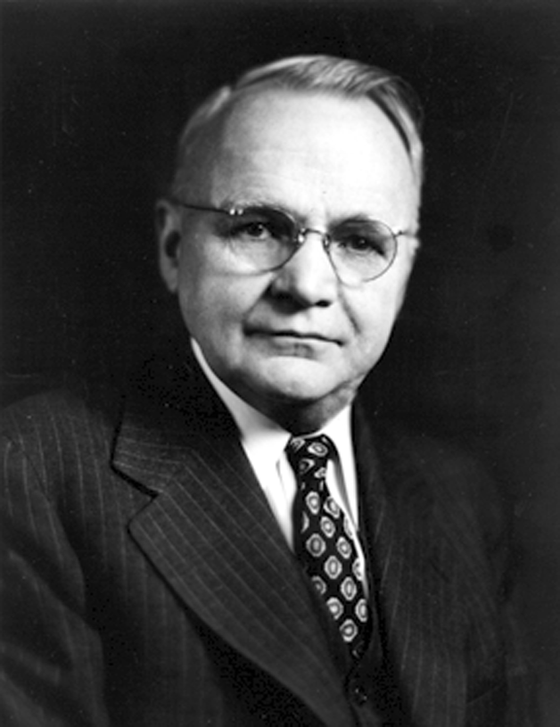
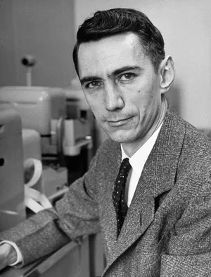

# FREQUENCY-RESPONSE

In digital signal processing (DSP), most of trading indicators can be viewed as discrete digital filters.
A digital filter is a mathematical operator (computation) that maps an input sequence of numbers
$x_k$ into an output sequence of numbers
$y_k=\mathcal\{F\}\{x_k\}$. Snce this definition is very general, there are several
more useful narrower classes of digital filters  (Oppenheim et al., 2009, pp.19-24).

*Linear* filters have a *superposition* property. If
$y1_k=\mathcal\{F\}\{x1_k\}$ and $y2_k=\mathcal\{F\}\{x2_k\}$
are the responses of a filter to the corresponding inputs $x1_k$ and $x2_k$,
then the filter is linear if and only if

$$\tag*{}\mathcal{F}\{ax1_k + bx2_k\}=a\mathcal{F}\{x1_k\}+b\mathcal{F}\{x2_k\}$$

$$\tag*{}=ay1_k+by2_k$$

For *Time-Invariant* filters, a time delay of $m$ samples in the input sequence
causes the same time delay in the output sequence (the invariance of time delay).
Mathematically, if $y_k=\mathcal\{F\}\{x_k\}$

$$\tag*{}x1_k=x_{k-m}\implies y1_k=y_{k-m}\ \forall m$$

The combination of these two filter classes defines the most important type --
*Linear Time-Invariant* (LTI) filters. The third important property, although not
directly related to frequency response, is casuality.

A filter is *casual* (nonanticipative) if the output values $y_k$
depend only on pervious input values $x_m$ where $m \le k$.
In plain words, a causal filter can't see the "future" input values to calculate the output "now".

LTI filters have a property which makes them very useful.
Such filters can be completely characterized by their *impulse response*.
Let Kronecker delta function

$$\tag*{}\delta_k = \begin{cases} 1, & k=0 \\ 0, & k \neq 0 \end{cases}$$

represent an impulse occuring at input $k$ and

$$\tag*{}y_k=\mathcal{F}\{\sum_{m=-\infty}^{\infty}x_m\delta_{k-m}\}$$

The *linearity* of the filter $\mathcal{F}$ means we can apply
the *superposition* property to the equation above and get

$$\tag*{}y_k=\sum_{m=-\infty}^{\infty}x_m\\mathcal{F}\{\delta_{k-m}\}=\sum_{m=-\infty}^{\infty}x_m h_{k,m}$$

where $h_{k,m}=\mathcal{F}\{\delta_{k-m}\}$ is a response
to an impulse $\delta_{k-m}$. Note that the value of
$h_{k,m}$ depends on both $k$ and $m$.
The *time invariance* of the filter $\mathcal{F}$ implies that if
$h_{k}$ is the response to $\delta_{k}$, then the
$h_{k-m}$ is the response to $\delta_{k-m}$.
Thus, the time invariance of the fiter allows us to write our equation as

$$\tag*{(1)}y_k=\sum_{m=-\infty}^{\infty}x_m h_{k-m}=x_k\circledast h_k$$

where $\circledast$ is a mathematical operation known as *convolution*.

To summarize, the output sequence of an LTI filter, when the input sequence is a weighted sum
of delayed impulses, is a weighted sum of delayed impulse responses.

If the input sequence of an LTI filter is a complex exponential
$x_k=e^{i\omega k}, -\infty\lt k \lt\infty$,
then, substituting it in equation (1),

$$\tag*{}y_k=\sum_{m=-\infty}^{\infty}h_{k-m}x_m=\sum_{m=-\infty}^{\infty}h_{k-m}e^{i\omega m}$$

$$\tag*{}=e^{i\omega k}\sum_{m=-\infty}^{\infty}h_{k-m}e^{i\omega m}e^{-i\omega k}$$

$$\tag*{}=e^{i\omega k}\sum_{m=-\infty}^{\infty}h_{k-m}e^{-i\omega (k-m)}$$

$$\tag*{(2)}=e^{i\omega k}\sum_{m=-\infty}^{\infty}h_{m}e^{-i\omega m}=H(e^{i\omega})e^{i\omega k}$$

where

$$\tag*{(3)}H(e^{i\omega})=\sum_{m=-\infty}^{\infty}h_{m}e^{-i\omega m}$$

Hence, the $exp(i\omega k)$ is the eigenfunction of the filter,
and $H(exp(i\omega))$ is the associated eigenvalue.

Equation (2) shows that $H(exp(i\omega))$ describes the change in complex amplitude
of a complex exponential input sequence as a function of the frequency $\omega$.
Another way of saying this is the $H(exp(i\omega))$ is the *frequency response*
of the filter. $H(exp(i\omega))$ is complex function and can be represented as a
*real* and *imaginary* parts or as a *magnitude* and *phase* parts.

*Harry Nyquist, 1889-1976 (Brittain 2010).*

Presuming that every discrete signal can be approximated by a superposition of periodic functions
with increasing frequencies and the amplitude and the phase parameters, an LTI filter changes the
values of these parameters. So we can plot the changes in the amplitude and the phase on a chart,
depending on the frequency.

What are the highest and the lowest frequency we should plot? To illustrate this, let's consider a
discrete time series of daily weather temperature measurements, which represent 24-hour averages.
Such series can't provide information about variation in timescale less than 24 hours.
We can't learn from this data that it's always hotter at 4 PM than at 4 AM.

*Claude Shannon, 1916-2001 (soni goodman 2021).*

If we have $n$ observations, than the lowest frequency is simply $\frac{1}{n}$
or $1$ cycle per $n$ samples. This corresponds to the period of $n$ data
points. On the other side of the spectrum the most number of cycles we can observe in the time series is
$\frac{n}{2}$, or one cycle per every other data point (since a minimum of two points are
required to even sketch a sine wave — one point for the peak and one point for the trough). In other words, the
highest frequency about which data can inform us is $\frac{1}{2}$, which corresponds to the
period of $2$ data points. In digital signal processing, this frequency is called the *Nyquist
frequency* and is related to the *Nyquist-Shannon sampling theorem.*

Claude Shannon's original formulation of the theorem is (Shannon 1984):

<q>
If a function $f(t)$ contains no frequencies higher than $W$ cps, it is completely
determined by giving its ordinates at a series of points spaced $\frac{1}{2W}$ seconds
apart.
</q>

To summarize, the smallest possible period of a cycle is $2$ samples
(we need at least two samples, peak and trough, to represent a cycle), which
corresponds to the Nyquist frequency.
The longest period is one cycle per whole data series. We can assume it to be an infinity
for a very long time series.

A frequency $\nu$ is an  inverse of the cycle's period $\tau$:
$\tau = \frac{1}{\nu}$.

- chart can use period or frequency as abscissa
- frequency is normalized, 1 being the Nyquist frequency
- example: sma(2), hyperbolic reltion between period and frequency curves
- what can be used as ordinate? since H(*) is a complex function we can use amplitude or power, and phase
- Amplitude and power can be displayed as percentage or as decibels. formula.
- Phase is arctabgent of Im/Re. By definition, it is bounded between (-pi, +pi) radians or (-180, 180) degrees. We use degrees
- The arctangent values we call wrapped phase. we can also display unwrapped phase

[Chart]

*The amplitude (a) and the plase (b) charts of the identity filter.*

*A power in decibels (a) and in percents (b), and an amplitude in decibels (c) and in percents (d).*

*An amplitude as a function of a normalized frequency (a) and a period (b).*

*A phase difference as a function of a normalized frequency (a) and a period (b).*

# Bibliography

Brittain, J. E. (2010). Electrical Engineering Hall of Fame: Harry Nyquist [Scanning Our Past].
*Proceedings of the IEEE*, *98*(8), 1535–1537. https://doi.org/10.1109/JPROC.2010.2050378

Jeffrey, A., & Dai, H. H. (2008).
*Handbook of mathematical formulas and integrals*. (4th ed., p. 592). San Diego, CA: Elsevier/Academic Press.

Oppenheim, A. V., Schafer, R. W., Yoder, M. A., & Padgett, W. T. (2009).
*Discrete-time signal processing*. (3rd ed., p. 1120). Upper Saddle River, NJ: Pearson.

Shannon, C. E. (1984). Communication in the presence of noise.
*Proceedings of the IEEE*, *72*, 1192-1201.

Soni, J., & Goodman, R. (2021).
*A man in a hurry: Claude Shannon's New York years*. IEEE Spectrum.
Retrieved August 14, 2022, from https://spectrum.ieee.org/a-man-in-a-hurry-claude-shannons-new-york-years
