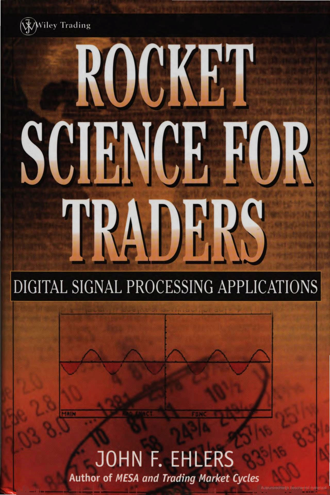

# HTCE

[Chart: OHLCV]

The instant cycle period lines are plotted in the lower pane.

## How it works

[Google
books](https://books.google.nl/books?id=K9F1rgEACAAJ).

In his book *Rocket Science for Traders: Digital Signal Processing Applications* (ehlers2001),
John Ehlers uses the Hilbert Transform and three cycle measurement techniques
(homodyne discriminator, phase accumulation, and dual discriminator) to analyze market data
and extract instant dominant cycle periods.

### Hilbert transform

The Hilbert transform produces a version of a signal (price data) with all frequency components
phase-shifted by $-90^\circ$ (or $-\pi /2$ radians).
This makes it possible to construct an analytic signal, from which we can extract the
instantaneous phase, amplitude and frequency.

According to a classical book on signal processing by Allen and Mills (Allen2004, chapter 9.6.2),
the analog Hilbert Transform $\hat{x}(t)$ of a real-valued signal
$x(t)$ is defined as:

$$\tag*{}\hat{x}(t)=\frac{1}{\pi} \, \text{P.V.} \int_{-\infty}^{\infty} \frac{x(\tau)}{t - \tau} \,d\tau$$

where $P.V.$ stands for the Cauchy principal value of the integral
(Jeffrey and Dai, 2008, xxvii and 1.15.4),
required because the kernel $\frac{1}{t-\tau}$ has singularity at
$t=\tau$.
The equation above is a convolution of $x(t)$ with $\frac{1}{\pi t}$.
In the frequency domain, it corresponds to multiplying the signal’s Fourier transform by
$-j \cdot \text{sgn}(\omega)$:

$$\tag*{}\mathcal{F}\{\hat{x}(t)\} = -j \cdot \text{sgn}(\omega) \cdot \mathcal{F}\{x(t)\}$$

This means that the positive frequencies are rotated by $-90^\circ$
(multiplied by $-j$), and the negative frequencies by are rotated by
$+90^\circ$ (multiplied by $j$).

Using the Hilbert transform, we can construct the complex-valued analytic signal $z(t)$:

$$\tag*{}z(t) = x(t) + j \cdot \hat{x}(t)$$

Here, the original signal $x(t)$ is called in-phase (I) component,
and the Hilbert transform $\hat{x}(t)$ is called quadrature (Q) component
(because it's phase is shifted by 1/4 of the full circle, or $+90^\circ$).

This complex-valued signal allows us to extract the instantaneous amplitude $A(t)$,
phase $\phi(t)$, and frequency $\omega(t)$.
Note that for nonstationary signals like price data, amplitude, phase and frequency vary over time.

$$\tag*{} A(t) = |z(t)| = \sqrt{x(t)^2 + \hat{x}(t)^2}$$

$$\tag*{}\phi(t) = \arg(z(t)) = \arctan\left( \frac{\hat{x}(t)}{x(t)} \right)$$

$$\tag*{}\omega(t) = \frac{d\phi(t)}{dt}$$

In discrete digital signal processing, according to another classical book by
Oppenheim et al. (Oppenheim2009, chapter 12), the Hilbert transform $\hat{x}[n]$
is usually approximated using a finite impulse response filter with odd symmetry.

$$\tag*{}h[n] = \begin{cases} \frac{2}{\pi}\frac{\sin^2(\pi n/2)}{n} & n \ne 0 \\ 0 & n=0\end{cases}$$

$$\tag*{}h[n] = \begin{cases} 0 & \text{for } n \text{ even} \\ \frac{2}{\pi n} & \text{for } n \text{ odd}\end{cases}$$

Impulse response of the ideal Hilbert transformer.

The ideal Hilbert Transform is non-causal and infinite in duration, making it impractical
for real-time applications like trading. For computing both the in-phase (I) and quadrature (Q)
components, Ehlers approximates the Hilbert transform using a 7-tap FIR filter with
a fixed set of coefficients. This filter is anti-symmetric, i.e.,
$h[-n]=-h[n]$, as required for the Hilbert transform.

$$\tag*{}h[n] = \begin{cases} +0.0962 & \text{for } n=-3 \\ +0.5769 & \text{for } n=-1 \\ -0.5769 & \text{for } n=+1 \\ -0.0962 & \text{for } n=+3 \\ 0 & \text{otherwise}\end{cases}$$

How Ehlers came up with these coefficients?
As we saw above, the Hilbert transform has an impulse response in continuous time
(i.e., is a convolution with the kernel)

$$\tag*{}h(t) = \frac{1}{\pi t}$$

In discrete time, this becomes

$$\tag*{}h[n] = \begin{cases} \frac{2}{\pi n} & \text{for } n=\pm 1, \pm 3, \pm 5, \cdots \\ 0 & \text{for }n=0\text{ or even}\end{cases}$$

Ehlers uses 7 taps ($n=-3,-2,-1,0,+1,+2,+3$), centered around $n=0$
and applie a Hann window function to reduce Gibbs ringing.
The equation above gives

$$\tag*{}h[\pm 1] = \frac{2}{\pi}\cdot \frac{1}{\pm 1} = \pm \frac{2}{\pi} \approx \pm 0.63661977$$

$$\tag*{}h[\pm 3] = \frac{2}{\pi}\cdot \frac{1}{\pm 3} = \pm \frac{2}{3\pi} \approx \pm 0.21220659$$

The Hann window for a 7-tap filter is

$$\tag*{}\omega[n] = \frac{1}{2}\left(1-\cos\left(\frac{2\pi n}{N-1}\right)\right), n=0,\cdots,N-1$$

Here $N=7$ is the number of taps (or filter length).
So, $n$ should run from $0$ to $N-1=6$,
which corresponds to indices $n=0,1,2,3,4,5,6$.
However, our Hilbert filter is anti-symmetric and centered at zero. So instead of using indices
$0$ to $6$, we reindex the window symmetrically
around the center: $n=-3,-2,-1,0,1,2,3$.
To apply the Hann window to these indices, we map them to:

$$\tag*{}n_{window} = n + \frac{N-1}{2}, n_{window}=0,\cdots,N-1$$

Where $n_{window}=0,\cdots,6$ and $n=-3,\cdots,3$.
Then apply

$$\tag*{}\omega[n] = \frac{1}{2}\left(1-\cos\left(\frac{2\pi(n+3)}{N-1}\right)\right), n=-3,\cdots,3$$

For $N=7$, this gives

$$\tag*{}\omega[-3] = \frac{1}{2}\left(1-\cos\left(\frac{2\pi\cdot 0}{6}\right)\right) = 0$$

$$\tag*{}\omega[-2] = \frac{1}{2}\left(1-\cos\left(\frac{2\pi\cdot 1}{6}\right)\right) \approx 0.25$$

$$\tag*{}\omega[-1] = \frac{1}{2}\left(1-\cos\left(\frac{2\pi\cdot 2}{6}\right)\right) \approx 0.75$$

$$\tag*{}\omega[0] = \frac{1}{2}\left(1-\cos\left(\frac{2\pi\cdot 3}{6}\right)\right) = 1$$

$$\tag*{}\omega[1] = \omega[-1] \approx 0.75$$

$$\tag*{}\omega[2] = \omega[-2] \approx 0.25$$

$$\tag*{}\omega[3] = \omega[-3] = 0$$

These are symmetric around the center tap, as expected.
Using the calculated Hann window values for a 7-tap symmetric filter:

$n$
$\frac{2}{\pi n}$
$\omega[n]$
$h[n]=\frac{2}{\pi n}\cdot\omega[n]$

-3
-0.21220659
$0.xxxxxxxxxxx$
$+0.0962$

-1
-0.63661977
$0.xxxxxxxxxxx$
$+0.5769$

+1
+0.63661977
$0.xxxxxxxxxxx$
$-0.5769$

+3
+0.21220659
$0.xxxxxxxxxxx$
$-0.0962$

The coefficients of the Hilbert filter.

Here is how this filter is applied to a smoothed price series $x[n]$.
In-Phase component $I[n]$ is a delayed version of the detrended signal.
This effectively centers the analytic signal around time $n$,
ensuring correct phase alignment with the quadrature component.

$$\tag*{}I[n] = x[n-3]$$

Quadrature component $Q[n]$ approximates the 90° phase-shifted version
of the signal.

$$\tag*{}Q[n] = \left( 0.0962 \cdot x[n - 3] + 0.5769 \cdot x[n - 1] - 0.5769 \cdot x[n + 1] - 0.0962 \cdot x[n + 3] \right) \cdot \left( 0.075 \cdot P[n - 1] + 0.54 \right)$$

The scaling factor $0.075 \cdot P[n - 1] + 0.54$,
where $P[n - 1]$ is the previously estimated dominant cycle period,
performs the "gain normalization" of the quadrature component by
"dynamically adjusting quadrature amplitude to maintain signal fidelity and phase accuracy".
The 0.075 constant factor amplifies quadrature component more for longer cycles (lower frequency).
The offset 0.54 keeps scale factor positive, stabilizes result for short cycles.
Both constants were empirically derived by Ehlers.
I don't fully understand what this all means, but it looks like a common practice
in digital signal processing.

## Homodyne discriminator

The first of the three techniques to estimate the instant cycle period is the
*homodyne discriminator*, which uses smoothed products of the analytic signal components.
We take the derivative of the analytic signal’s phase, without explicitly computing
$\phi(t)$ by computing phase rotation using previous values of
$I[n]$ and $Q[n]$.

$$\tag*{}\begin{align*}I_1[n] &= I[n] - I[n - 1] \\ Q_1[n] &= Q[n] - Q[n - 1]\end{align*}$$

Then we compute the real and the imaginary parts of the homodyne product:

$$\tag*{}\begin{align*}Re[n] &= I[n] \cdot I_1[n] + Q[n] \cdot Q_1[n] \\ Im[n] &= I[n] \cdot Q_1[n] - Q[n] \cdot I_1[n]\end{align*}$$

This gives a measure of rotation per sample in complex space.
Use the two parts to get:

$$\tag*{}\Delta\phi[n] = \arctan\left( \frac{Im[n]}{Re[n]} \right)$$

This is the phase rotation in radians per sample. The full cycle is
$2\pi$ radians, so the instant period in sample is

$$\tag*{}P[n] = \frac{2\pi}{\Delta\phi[n]}$$

This method is mathematically elegant, numerically stable, and well-suited
to financial data — that's why Ehlers favors it.

## Phase accumulation

The second technique is the *phase difference accumulation*.
Here, we compute the instantaneous phase from the $I[n]$ and
$Q[n]$ components:

$$\tag*{}\phi[n] = \arctan\left( \frac{Q[n]}{I[n]} \right)$$

Then we compute unwrapped phase difference

$$\tag*{}\Delta\phi[n] = \phi[n] - \phi[n-1]$$

Since $\arctan$ has a limited range $(-\pi,+\pi)$,
we apply phase unwrapping

$$\tag*{}\text{If }\Delta\phi[n] < 0,\quad \Delta \phi[n] \gets \Delta \phi[n] + 2\pi$$

This ensures all phase differences are positive, representing forward progress in phase.
We accumulate phase differences, keeping a running sum

$$\tag*{}\Phi[n] = \sum_{k=0}^{M} \Delta \phi[n - k]$$

until

$$\tag*{}\Phi[n] \geq 2\pi$$

Then $M$ is the number of bars it took for the phase to rotate
$2\pi$ radians, so:

$$\tag*{}P[n] = M$$

The method is simple and intuitive, it “times” how many samples are needed
for a full phase revolution ($2\pi$), but it can be noisy
if phase jumps irregularly (e.g., in choppy, trendless markets).

## Dual differentiator

The third technique is the *dual differentiator*.
Like the *homodyne discriminator*, the dual differentiation method estimates
the instantaneous phase rate of change — i.e., instantaneous frequency — and then inverts that to get cycle period.

But unlike homodyne, which computes products and arctangents, dual differentiation
uses two phase-difference estimations over different lags (e.g., 1 and 2 bars),
and averages them to reduce noise and improve stability.

We compute the instantaneous phase from the $I[n]$ and
$Q[n]$ components

$$\tag*{}\phi[n] = \arctan\left( \frac{Q[n]}{I[n]} \right)$$

and phase differences over two lags, a short lag (e.g., 1 bar),
and a long lag (e.g., 2 bars):

$$\tag*{}\begin{align*}\Delta\phi_1[n] &= \phi[n] - \phi[n - 1] \\ \Delta \phi_2[n] &= \phi[n] - \phi[n - 2]\end{align*}$$

Apply phase unwrapping if necessary

$$\tag*{}\text{If }\Delta\phi_i[n] < 0,\quad\Delta\phi_i[n]\gets\Delta\phi_i[n] + 2\pi,\quad i = 1,2$$

And then average the two phase advances:

$$\tag*{}\Delta\phi_{\text{avg}}[n]=\frac{1}{2}\left(\Delta\phi_1[n]+\frac{1}{2}\Delta\phi_2[n]\right)$$

Why divide $\Delta\phi_2[n]$ by 2?
Because it spans 2 bars, so it gives phase change per bar when halved.
Now, invert the phase rate (frequency) to estimate the instantaneous dominant cycle period:

$$\tag*{}P[n]=\frac{2\pi}{\Delta\phi_{\text{avg}}[n]}$$

By combining multiple lags, we average out noise and phase quantization error,
this makes it less sensitive to spikes than raw single-point phase differences.

## Implementation

John F. Ehlers (1933 -).
President at [MESA Software](https://mesasoftware.com/);
chief scientist at [StockSpotter](https://stockspotter.co);
contributing editor for [S&C Magazine](https://traders.com/).

The HTCE indicator is not primed during the first $\ell_{er}$ samples.
You can see the full implementation of the HTCE in
[Golang](https://github.com/ishiyan/Mbg/blob/main/trading/indicators/ehlers/hilberttransformcycleestimator.go)
and in
[Typescript](https://github.com/ishiyan/Mbng/blob/main/projects/mb/src/lib/trading/indicators/john-ehlers/hilbert-transform-cycle-estimator/hilbert-transform-cycle-estimator.ts)
on Github.

## Changing parameters

The influence of the parameters on the calculated instant cycle period of the HTCE
is demonstrated on the three following figures.

The first figure shows different efficiency ratio lengths $\ell_{er}$ leaving
the fast and slow lengths to be default values.

The second figure shows different fast lengths $\ell_{fast}$ leaving
the efficiency ratio and slow lengths to be default values.

The third one shows different slow lengths $\ell_{slow}$ leaving
the fast and efficiency ratio lengths to be default values.

[Chart: OHLCV]
*Varying the estimator smoothing length.*

[Chart: OHLCV]
*Varying the estimator smoothing length.*

[Chart: OHLCV]
*Varying the estimator $\alpha$ quadrature.*

[Chart: OHLCV]
*Varying the estimator $\alpha$ period.*

---

## References
Ehlers, John F. (2001).
*Rocket Science for Traders: Digital Signal Processing Applications*. (p. 272). John Wiley & Sons.
[google books](https://books.google.nl/books?id=K9F1rgEACAAJ)

Allen, Ronald L., Mills, Duncan W. (2004).
*Signal Analysis: Time, Frequency, Scale and Structure*. (p. 960). IEEE Press, Wiley-Interscience.
[google books](https://books.google.com/books?id=3munAdY7ZkoC)

Oppenheim, A. V., Schafer, R. W., Yoder, M. A., & Padgett, W. T.
(2009).
*Discrete-time signal processing*. (3rd ed., p. 1120). Upper Saddle River, NJ: Pearson.
[google books](https://books.google.com/books?id=EaMuAAAAQBAJ)

Jeffrey, A., & Dai, H. H. (2008).
*Handbook of mathematical formulas and integrals*. (4th ed., p. 592). San Diego, CA: Elsevier/Academic Press.
[google books](https://books.google.com/books?id=JokQD5nK4LMC)
