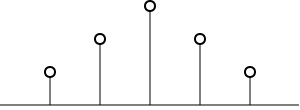
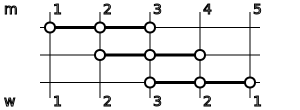

# TRIMA

[Chart: OHLCV]

(a)

(b)

(c)

*Weight coefficients of the (a) TRIMA(6), (b) TRIMA(5) and (c) SMA(5).*

A triangular moving average (TRIMA) of length $L \ge 2$ is a weighted mean of the last
$L$ observations of a series $x_{1},\, x_{2},\, x_{3},\,\ldots\,,\, x_{k}$,
where $x_{k}$ is the most recent value and $k \ge L$:

$$\tag*{(1)}trima_{k}=\frac{\displaystyle \sum_{m=1}^{L}w_{m}x_{k-L+m}}{\displaystyle \sum_{m=1}^{L}w_{m}}$$

The values of the weighting coefficients $w_m$ form a triangle shape with the top angle
centered in the middle of the moving average window. In case of the even value of $L$,
there are two samples located in the "middle" of the window and the top angle of the imaginary triangle
is located between them. Figure 2 shows TRIMA weighting coefficients for the even and odd values of
$L$, comparing them with the weighting coefficients of the [Simple Moving Average](/smaNote.route), which are all equal.

Knowing this difference, we can represent the values of the weighting coefficients $w_m$
for both even and odd values of $L$ as:

$$\tag*{(2)}w_{m}=\begin{cases}L=2l\ \text{(even):}\\m, & 1\le m\le l\\L+1-m, & l\lt m\le L\\ \\L=2l+1\ \text{(odd):}\\m, & 1\le m\le l+1\\L+1-m, & l+1\lt m\le L\end{cases}$$

It is easy to see that $w_m$ values form two arithmetic progressions, one ascending and
one descending. This allows us to calculate the sum of weighting coefficients in denominator of equation (1).

Let's consider an arithmetic progression:

$$\tag*{}a_n=a_{n-1}+d,\ d=const$$

Its sum when starting summation from the very first element is:

$$\tag*{}s_n=a_1+(a_1+d)+\dots +(a_1+(n-1)d)$$

If we start summation from the very last element, the sum is:

$$\tag*{}s_n=a_n+(a_n-d)+\dots +(a_n-(n-1)d)$$

Summing up the two above equations gives:

$$\tag*{}s_n=\frac{n}{2}(a_1+a_n)$$

Let's apply this equation to sum up all weighting coefficients from equation (2).
For an even $L=2l$:

$$\tag*{}\sum_{m=1}^{L}w_{m}=\sum_{m=1}^{l}m+\sum_{m=l+1}^{2l}(2l+1-m)$$

$$\tag*{}=\sum_{m=1}^{l}m+l(2l+1)-\sum_{m=l+1}^{2l}m$$

$$\tag*{}=\frac{l}{2}(1+l)+l(2l+1)-\frac{l}{2}(l+1+2l)$$

$$\tag*{}=\frac{l}{2}(1+l+4l+2-3l-1)$$

$$\tag*{}=\frac{l}{2}(2l+2)=l(l+1)$$

$$\tag*{(3)}=\frac{1}{4}L(L+2)$$

For an odd $L=2l+1$:

$$\tag*{}\sum_{m=1}^{L}w_{m}=\sum_{m=1}^{l+1}m+\sum_{m=l+2}^{2l+1}(2l+1-m)$$

$$\tag*{}=\sum_{m=1}^{l+1}m+l(2l+1)-\sum_{m=l+2}^{2l+1}m$$

$$\tag*{}=\frac{l+1}{2}(l+2)+l(2l+2)-\frac{l}{2}(3l+3)$$

$$\tag*{}=\frac{l+1}{2}(l+2+4l-3l)$$

$$\tag*{}=\frac{l+1}{2}(2l+2)=(l+1)^2$$

$$\tag*{(4)}=\frac{1}{4}(L+1)^2$$

Hence, combining equations (2), (3) and (4), we can write equation (1) only in terms of $L$:

$$\tag*{(5)}trima_{k}=\begin{cases}L=2l\ \text{(even):}\\ \displaystyle \frac{4}{L(L+2)}\left[\sum_{m=1}^{l}mx_{k-L+m}+\sum_{m=l+1}^{L}(L+1-m)x_{k-L+m}\right]\\ \\L=2l+1\ \text{(odd):}\\ \displaystyle \frac{4}{(L+1)^2}\left[\sum_{m=1}^{l+1}mx_{k-L+m}+\sum_{m=l+2}^{L}(L+1-m)x_{k-L+m}\right]\end{cases}$$

The TRIMA is a finite impulse response (FIR) filter because only a finite number of $L$
last samples contribute to its value.

The TRIMA is equivalent to doing an SMA of an SMA. As usial, the even and the odd cases are slightly different.

$$\tag*{(6)}trima(x,L)=\begin{cases}L=2l\ \text{(even):}\\ \displaystyle sma\left(sma(x,\frac{L}{2}),\frac{L}{2}+1\right)\\ \\L=2l+1\ \text{(odd):}\\ \displaystyle sma\left(sma(x,\frac{L+1}{2}),\frac{L+1}{2}\right)\end{cases}$$

(a)

(b)

*SMA over SMA calculation grid for the even and odd length of the TRIMA: (a) TRIMA(6) and (b) TRIMA(5).*

This equation can be used for an efficient calcultion of the TRIMA.

I couldn't derive the equation (6) algebraically, but its working is illustrated on the figure 3.
Here horizontal triplets, representing the inner SMA, are moving over the samples $m$
of the TRIMA window. Initially, the triplet resides on the left edge of the window.
On every move, it shifts one sample to the right until it reaches the right edge of the window.
During this sliding, some samples are covered by the triplet more than once. The bottom row
shows the count $w$ (weight) for the every sample.
The weight values form an imaginary triangular shape, similar to ones on the figure 2.

## Step response

Two figures below demonstrate the response to the step-up and step-down data.
The transition is clearly not linear.
Both responses touch the step data with the lag equal to the length $L$ of the filter.
The step-up response doesn't overshoot and the step-down response doesn't undershoot the data.

[Chart: OHLCV]
*Step-up response.*

[Chart: OHLCV]
*Step-down response.*

## Frequency response

The figures below show an amplitude and a phase lag of the unit sample response of the TRIMA as a function
of a period of various signal frequencies.

A period is a duration of a cycle in samples.
The smallest possible period of a cycle is $2$ samples.
To understand this, imagine a cycle of a sinusoid which starts at zero, goes up and peaks at $1$,
continues down and bottoms at $-1$, and then returns back to zero.
We need at least two samples (peak and trough) to represent a cycle.
See more details in the [frequency response article](/frequency-response).

The same charts can be represented as a function of a cycle's frequency.
A period ($\tau$) is an inverse of the cycle's frequency
($\nu$): $\tau = \frac{1}{\nu}$.
The smallest period $\tau = 2$ corresponds to the Nyquist frequency
$\nu = \frac{1}{\tau} = \frac{1}{2}$which is the highest frequency
possible in a signal. Below we use the normalized frequency which has the value of $1$
at the Nyquist frequency.
That is, $0$ corresponds to the infinite $\tau$,
$1$ corresponds to the $\tau = 2$.

[Chart: (a) amplitudePct vs period]
[Chart: (b) phaseDegUnwrapped vs period]

*An amplitude (a) and a phase lag (b) as a function of a period of a cycle.*

The shape of the amplitude response is slightly different for the different values of $L$.
It is interesting that the amplitude response poles of the TRIMA are formed by the lengths
of the inner and the outer SMAs in equation (6). Only if both $L_{inner}$
and $L_{outer}$ are odd, the amplitude attenuation percentage at the
smallest period $\tau = 2$ will stay above zero. If either $L_{inner}$
or $L_{outer}$ are even, the percentage will be almost zero.
The table 1 below illustrates this.

$L$
$l$
$L_{inner}$
$L_{outer}$
$dB, \tau = 2$
$poles, \tau$

2
1
1
2
-100

3
1
2
2
-100

4
2
2
3
-100
3

5
2
3
3
-20
3

6
3
3
4
-100
4, 3

7
3
4
4
-100
4

8
4
4
5
-100
5, 4, 5/2=2.5

9
4
5
5
-30
5, 5/2=2.5

10
5
5
6
-100
6, 5, 6/2=3, 5/2=2.5

11
5
6
6
-100
6, 6/2=3

12
6
6
7
-100
7, 6, 7/2=3.5, 6/2=3, 7/3=2.3

13
6
7
7
-35
7, 7/2=3.5, 7/3=2.3

14
7
7
8
-100
8, 7, 8/2=4, 7/2=3.5, 8/3=2.7, 7/3=2.3

The poles of the amplitude response for increasing length of the TRIMA.

The shape of the unwrapped frequency response is linear with respect to a normalized frequency,
and is hyperbolic with respect to a period. This is natural because TRIMA is formed by the outer SMA
over the inner SMA.

Amplitude and phase responses are illusrated in figures below both for the period (in samples)
and the normalized frequency.

[Chart: (a) amplitudePct vs period]
[Chart: (b) amplitudePct vs period]
*An amplitude as a function of a period of a cycle for even (a) and odd (b) TRIMA length.*

[Chart: (a) amplitudePct vs frequency]
[Chart: (b) amplitudePct vs frequency]
*An amplitude as a function of a normalized frequency of a cycle for even (a) and odd (b) TRIMA length.*

[Chart: (a) phaseDegUnwrapped vs period]
[Chart: (b) phaseDegUnwrapped vs period]
*A phase as a function of a period of a wave for even (a) and odd (b) TRIMA length.*

[Chart: (a) phaseDegUnwrapped vs frequency]
[Chart: (b) phaseDegUnwrapped vs frequency]
*A phase as a function of a normalized frequency of a wave for even (a) and odd (b) TRIMA length.*
