# JMA Algorithm Extracted

The original variable names are from a decompiled DLL, so they're opaque (`f18`, `s48`, `fA8`, etc.). Both the TypeScript and Go implementations preserve these names. Here's the algorithm reconstructed with meaningful names.

## Parameters

| Parameter | Range          | Description            |
|-----------|----------------|------------------------|
| `length`  | >= 1 (integer) | Smoothing period       |
| `phase`   | -100 to +100   | Overshoot/lag tradeoff |

## Initialization (from constructor)

Six constants are derived from the parameters:

```ts
halfLen = (length > 1) ? (length - 1) / 2.0 : 1e-10

phaseRatio = phase/100 + 1.5 // maps [-100,+100] to [0.5, 2.5]

logJMA   = max(ln(sqrt(halfLen)) / ln(2) + 2, 0) // ≈ log2(sqrt(halfLen)) + 2
powExp   = max(logJMA - 2, 0.5) // exponent for volatility ratio

loopLen  = sqrt(halfLen) * logJMA
loopAlpha = loopLen / (loopLen + 1) // in (0, 1), main adaptive alpha

beta     = 0.9 * halfLen / (0.9 * halfLen + 2) // in (0, 1), EMA smoothing factor
```

These control the filter's adaptive behavior. `logJMA` and `powExp` grow logarithmically with `length`. `loopAlpha` and `beta` approach 1 as `length` increases (heavier smoothing).

## Data structures

| Structure    | Size | Purpose                                                        |
|--------------|------|----------------------------------------------------------------|
| `buffer[62]` | 62   | Stores the first 61 input samples for warmup                   |
| `ring2[11]`  | 11   | Circular buffer of recent volatility values (10-period window) |
| `ring[128]`  | 128  | Circular buffer of smoothed-volatility values                  |
| `list[128]`  | 128  | **Sorted** array of smoothed-volatility values for trimmed-mean computation. First 64 slots initialized to -1,000,000; last 64 to +1,000,000. |

## The Update Function (per sample)

The algorithm has four stages that execute in sequence on each new sample.

---

### Stage 1: Buffer Fill (samples 1-30)

The first 30 samples are simply stored. The indicator returns NaN (not primed).

```ts
if sampleCount < 61:
    sampleCount++
    buffer[sampleCount] = sample

if sampleCount <= 30:
    return NaN
```

---

### Stage 2: First-Call Bootstrap (executes once, at sample 31)

On the first call past sample 30, the algorithm checks whether the buffered samples are all identical or varying:

```ts
varying = false
for i = 1 to 29:
    if buffer[i+1] != buffer[i]: varying = true

replayCount = varying ? 30 : 0 // how many buffered samples to replay
upperBand   = varying ? buffer[1] : sample
lowerBand   = upperBand

replayCount = min(replayCount, 29)
```

If the first 30 samples were constant, no replay is needed and the bands start at the current sample. If they varied, the algorithm replays up to 29 buffered samples through the main loop to warm up the internal state.

On subsequent calls, `replayCount = 0` (no replay).

---

### Stage 3: Main Adaptive Loop

This loop runs from `i = replayCount` down to `0`. At each iteration, it processes one value:

```ts
// replay from buffer, or current sample
value = (i != 0) ? buffer[31 - i] : sample
```

#### 3a. Volatility Measurement

Compute distance from adaptive upper/lower bands:

```ts
distUpper = value - upperBand
distLower = value - lowerBand
volProxy  = max(|distUpper|, |distLower|) + 1e-10
```

Update a 10-period running average of `volProxy` using `ring2` as a circular buffer:

```ts
// add new, subtract oldest
volSum += volProxy - ring2[ring2Index]
ring2[ring2Index] = volProxy
avgVol = (totalCount > 10) ? volSum / 10 : volSum / totalCount
```

#### 3b. Sorted List & Trimmed Mean of Volatility

The `list[128]` array is maintained in sorted order and holds historical `avgVol` values (stored in `ring[128]`). The algorithm maintains a trimmed range `[loBound, hiBound]` within the sorted list (initially converging from 64/64 toward 32/96).

On each iteration:

1. **Remove** the oldest `avgVol` from the sorted list (binary search for its position)
2. **Insert** the new `avgVol` at its sorted position (binary search, then shift elements)
3. **Incrementally update** a running sum `trimmedSum` based on what enters or leaves the trimmed range
4. Compute the **trimmed mean**: `trimmedMeanVol = trimmedSum / (hiBound - loBound + 1)`

This trimmed mean is a robust estimate of "normal" volatility -- it discards the extreme tails of the volatility distribution.

#### 3c. Adaptive Bandwidth

This is the core adaptive mechanism. It compares current volatility to the trimmed mean:

```ts
// Priming phase (first 30 iterations of the inner loop):
if innerCount <= 30:
    adaptiveAlpha = loopAlpha // fixed alpha during priming

// Steady-state phase:
else:
    relativeVol = (volProxy / trimmedMeanVol) ^ powExp
    adaptiveExp = clamp(relativeVol, 1.0, logJMA) // the "adaptive exponent"
    adaptiveAlpha = loopAlpha ^ sqrt(adaptiveExp) // adaptive band-tracking alpha
```

When current volatility `volProxy` is much larger than `trimmedMeanVol` (price gap / breakout), `adaptiveExp` approaches `logJMA`, making `adaptiveAlpha` smaller (closer to 0) -- the bands track price more aggressively. When volatility is normal or low, `adaptiveExp` stays near 1, keeping `adaptiveAlpha` near `loopAlpha` -- the bands move slowly.

#### 3d. Band Update

```ts
if distUpper > 0:   upperBand = value                             // price broke above: snap
else:               upperBand = value - distUpper * adaptiveAlpha // smooth tracking

if distLower < 0:   lowerBand = value                             // price broke below: snap
else:               lowerBand = value - distLower * adaptiveAlpha // smooth tracking
```

The bands form an adaptive envelope. When price moves sharply away, the band snaps. Otherwise it smoothly approaches.

#### 3e. Velocity Initialization (at innerCount == 30)

```ts
ema = sample
ceil_len = max(ceil(loopLen), 1)
floor_len = max(floor(loopLen), 1)
frac = (ceil_len != floor_len) ? (loopLen - floor_len) / (ceil_len - floor_len) : 1.0
v5 = min(floor_len, 29)
v6 = min(ceil_len, 29)

velocity = (sample - buffer[sampleCount - v5]) * (1 - frac) / floor_len
         + (sample - buffer[sampleCount - v6]) * frac / ceil_len
```

This interpolates a per-bar velocity estimate from two lookback distances, initializing the momentum tracking.

---

### Stage 4: Output Calculation (after the loop, steady state)

This is a **two-stage IIR filter** with phase correction:

```ts
// Adaptive smoothing factor (adapts based on volatility)
alpha = beta ^ adaptiveExp // small when volatile (fast), large when calm (smooth)

// Stage 1: Adaptive EMA + momentum
ema = (1 - alpha) * sample + alpha * ema
momentum = (sample - ema) * (1 - beta) + beta * momentum
phaseAdj = phaseRatio * momentum + ema      // phase-corrected target

// Stage 2: Second-order IIR (critically damped pursuit filter)
gain = (1 - alpha)^2 // = -2*alpha + alpha^2 + 1
velocity = (phaseAdj - output) * gain + alpha^2 * velocity
output += velocity
```

The final `output` (variable `fB8` in the source) is the JMA value.

---

## Conceptual Summary

The JMA is a **three-component adaptive system**:

1. **Volatility estimator** -- Maintains a sorted array of 10-period-averaged volatilities and computes their trimmed mean. This gives a robust baseline of "normal" volatility that resists outliers.

2. **Adaptive bandwidth controller** -- Compares instantaneous volatility to the trimmed mean. High relative volatility (gaps, breakouts) increases responsiveness; low relative volatility (noise, congestion) increases smoothing. The adaptation is controlled by `(volProxy / trimmedMeanVol) ^ powExp`, clamped to `[1, logJMA]`.

3. **Two-stage IIR output filter** --
   - First stage: An adaptive EMA whose smoothing factor `beta^adaptiveExp` varies with volatility, plus a momentum term scaled by `phaseRatio` (the user's `phase` parameter).
   - Second stage: A second-order IIR filter (the `velocity += ...; output += velocity` structure is a discrete-time integrator driven by a damped error signal). This is the structure from radar target-tracking filters -- it simultaneously estimates position and velocity of the "target" price.

The `phase` parameter only affects `phaseRatio` (stage 3), controlling how much momentum is added to the EMA before the pursuit filter. Positive phase amplifies momentum (less lag, more overshoot). Negative phase dampens it.

The `length` parameter affects all derived constants -- longer lengths increase `beta` and `loopAlpha` toward 1 (heavier smoothing), increase `logJMA` and `powExp` (wider adaptive range), and increase `loopLen` (longer volatility baseline).

---

## Diagram

Here's a flow diagram of the JMA algorithm's `update()` function in Mermaid:

```mermaid
flowchart TD
    START(["update(sample)"]) --> BUF_CHECK{"sampleCount < 61?"}

    %% ── Stage 1: Buffer Fill ──
    BUF_CHECK -- Yes --> BUF_STORE["sampleCount++
    buffer[sampleCount] = sample"]
    BUF_CHECK -- No --> PRIME_CHECK

    BUF_STORE --> PRIME_CHECK{"sampleCount ≤ 30?"}
    PRIME_CHECK -- Yes --> RET_NAN(["return NaN"])

    %% ── Stage 2: Bootstrap ──
    PRIME_CHECK -- No --> FIRST{"First call?
    (f0 == 1)"}

    FIRST -- Yes --> BOOTSTRAP["f0 = 0
    Scan buffer[1..30] for variation
    replayCount = varying ? min(30,29) : 0
    lowerBand = varying ? buffer[1] : sample
    upperBand = lowerBand"]

    FIRST -- No --> NO_REPLAY["replayCount = 0"]

    BOOTSTRAP --> LOOP_START
    NO_REPLAY --> LOOP_START

    %% ── Stage 3: Main Adaptive Loop ──
    LOOP_START["i = replayCount"] --> LOOP_COND{"i ≥ 0?"}
    LOOP_COND -- No --> POST_LOOP

    LOOP_COND -- Yes --> GET_VAL["value = (i ≠ 0)
    ? buffer[31 − i]
    : sample"]

    GET_VAL --> DIST["distUpper = value − upperBand
    distLower = value − lowerBand
    volProxy = max(|distUpper|, |distLower|) + ε"]

    %% ── 3a: Volatility Smoothing ──
    DIST --> VOL_SMOOTH["Advance ring2 circular index
    volSum += volProxy − ring2[idx]
    ring2[idx] = volProxy
    avgVol = volSum / min(totalCount, 10)"]

    %% ── 3b: Sorted List & Trimmed Mean ──
    VOL_SMOOTH --> LIST_WARM{"totalCount > 127?"}

    LIST_WARM -- Yes --> LIST_REPLACE["oldVal = ring[ringIdx]
    Binary-search list[] for oldVal position → remPos
    Binary-search list[] for avgVol insert   → insPos
    Update trimmedSum for entries entering/leaving [lo..hi]
    Shift elements, insert avgVol at insPos"]

    LIST_WARM -- No --> LIST_GROW["ring[ringIdx] = avgVol
    Expand boundaries: hi++ or lo−−
    hiBound = min(hi, 96)
    loBound = max(lo, 32)
    Binary-search for insPos, shift & insert
    Recompute trimmedSum = Σ list[loBound..hiBound]"]

    LIST_REPLACE --> TMEAN["trimmedMeanVol =
    trimmedSum / (hiBound − loBound + 1)"]
    LIST_GROW --> TMEAN

    %% ── 3c–d: Priming vs Adaptive ──
    TMEAN --> INNER{"innerCount ≤ 30?"}

    INNER -- Yes, Priming --> FIXED_BANDS["adaptiveAlpha = loopAlpha  (fixed)
    Update bands:
      upperBand = distUpper>0 ? value : value − distUpper·α
      lowerBand = distLower<0 ? value : value − distLower·α
    output = sample"]

    FIXED_BANDS --> INIT_CHECK{"innerCount == 30?"}

    INIT_CHECK -- No --> DEC_I["i−−"]
    DEC_I --> LOOP_COND

    INIT_CHECK -- Yes --> INIT_VEL["ema = sample
    Interpolate initial velocity from buffer:
      velocity = weighted avg of
      (sample − buffer[lookback]) / lookback
    for ceil/floor of loopLen"]
    INIT_VEL --> DEC_I2["i−−"]
    DEC_I2 --> LOOP_COND

    INNER -- No, Steady-state --> ADAPT["relVol = (volProxy / trimmedMeanVol) ^ powExp
    adaptiveExp = clamp(relVol, 1, logJMA)
    adaptiveAlpha = loopAlpha ^ √adaptiveExp"]

    ADAPT --> ADAPT_BANDS["Update bands:
      upperBand = distUpper>0 ? value : value − distUpper·α
      lowerBand = distLower<0 ? value : value − distLower·α"]

    ADAPT_BANDS --> DEC_I3["i−−"]
    DEC_I3 --> LOOP_COND

    %% ── Stage 4: Output Filter ──
    POST_LOOP{"innerCount > 30?"}

    POST_LOOP -- No --> RET(["return output"])

    POST_LOOP -- Yes --> STAGE1_EMA["α = beta ^ adaptiveExp
    ema = (1−α)·sample + α·ema
    momentum = (sample−ema)·(1−beta) + beta·momentum
    phaseAdj = phaseRatio·momentum + ema"]

    STAGE1_EMA --> STAGE2_IIR["gain = (1 − α)²
    velocity = (phaseAdj − output)·gain + α²·velocity
    output += velocity"]

    STAGE2_IIR --> RET2(["return output"])

    %% ── Styling ──
    classDef stage fill:#2d333b,stroke:#539bf5,color:#adbac7
    classDef decision fill:#2d333b,stroke:#e5c07b,color:#adbac7
    classDef terminal fill:#2d333b,stroke:#7ee787,color:#adbac7

    class BUF_STORE,BOOTSTRAP,NO_REPLAY,GET_VAL,DIST,VOL_SMOOTH,LIST_REPLACE,LIST_GROW,TMEAN,FIXED_BANDS,INIT_VEL,ADAPT,ADAPT_BANDS,DEC_I,DEC_I2,DEC_I3,STAGE1_EMA,STAGE2_IIR stage
    class BUF_CHECK,PRIME_CHECK,FIRST,LOOP_COND,LIST_WARM,INNER,INIT_CHECK,POST_LOOP decision
    class START,RET_NAN,RET,RET2 terminal
```



The four stages map to the algorithm's conceptual architecture:

- **Stage 1** (buffer fill): Collects 30 samples before producing any output. These are needed for the bootstrap and velocity initialization.

- **Stage 2** (bootstrap): Runs once. If the first 30 samples varied, it replays them through the main loop to warm up the volatility estimator and sorted list. If they were constant (e.g., flat market open), it skips replay.

- **Stage 3** (main loop): The adaptive core. Each iteration processes one value through three subsystems:
  - **Volatility smoother**: 10-period running average of `max(|distance from upper band|, |distance from lower band|)`.
  - **Sorted list**: Maintains a sorted array of these smoothed volatilities and computes their trimmed mean (indices 32-96 out of 128) -- a robust "normal volatility" baseline.
  - **Adaptive bandwidth**: Raises `(current vol / trimmed mean vol)` to `powExp`, clamping to `[1, logJMA]`. This exponent then modulates `loopAlpha` via `loopAlpha^sqrt(exp)` -- high relative volatility makes the bands snap to price; low makes them glide.

- **Stage 4** (output filter): A second-order IIR pursuit filter. The first part is an adaptive EMA plus phase-corrected momentum (`phaseRatio * momentum + ema`). The second part is the classic position-velocity integrator from radar tracking: `velocity = error * gain + damping * velocity; output += velocity`. The `phase` parameter only enters here, scaling the momentum term.

---
