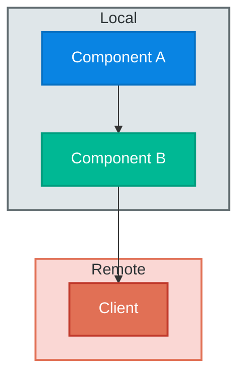
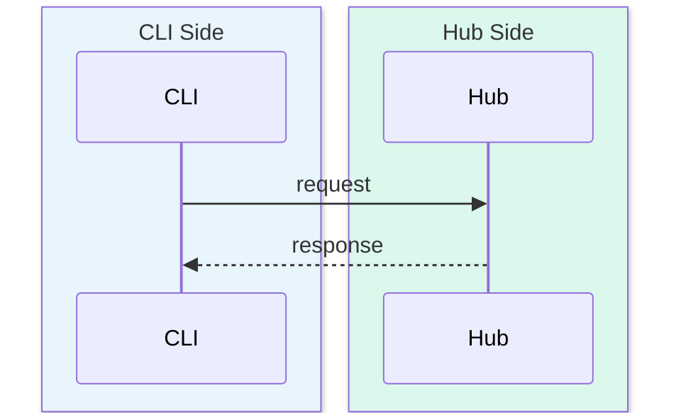
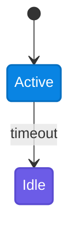

# Technical Blog Writing

For source-code deep dives, architecture analysis, implementation walkthroughs, and technology comparisons.

## When to Use

- Source code analysis or architecture deep dive
- Implementation walkthrough with file:line citations
- Technology comparison or design trade-off post
- Doc-driven research post (no source code in scope)

## Document Skeleton

```markdown
# [Topic] Deep Dive

Brief intro + why it matters.
> **Code Version**: Based on [project] `vX.Y.Z` (commit `abc1234`).

## 1. Introduction (problem + scope + navigation table)
## 2-N. Core Content (by data flow, not code structure)
## N+1. Design Decisions & Trade-offs
## N+2. Code Index (file, lines, responsibility)
## References
```

- Section 1 = problem + scope + navigation only (no implementation)
- Each core section follows: **concept → diagram → code → insight**
- Include navigation hints: `> First-time readers: skip to section X.`

---

## Core Principles

1. **Problem-first, progressive** — start with the problem; build concepts layer by layer; explain "why" before "how"
2. **Concept-before-use** — never use an undefined term. Add concept sub-sections. Cross-reference earlier definitions.
3. **Big picture first** — unified visual overview before diving into details; comparison diagram/table for 2+ approaches
4. **Balanced comparison** — analyze both sides; comparison tables; identify real differences vs. equivalences
5. **Design decisions** — state the problem, alternatives, and trade-offs for every non-obvious choice
6. **Concrete examples** — 1-2 per major section; show input → process → output with real data
7. **Terminology accuracy** — verify via source code or official docs; define on first use

---

## Code Examples

- Every snippet needs `file_path:line_number` citation
- Explain what it does AND why it matters (not just show it)
- Replace large blocks with diagram + key snippet
- Code must be tested and working
- Include imports, configuration, context
- Comments explain *why*, not *what*

---

## Mermaid Diagram Standard

All diagrams must use rich color styling. Monotone diagrams are rejected.

### Color Palette

| Role | Fill | Stroke | Text |
|------|------|--------|------|
| Primary Actor | `#6C5CE7` | `#5A4BD1` | `#fff` |
| Core Component | `#0984E3` | `#0770C2` | `#fff` |
| Service / Hub | `#00B894` | `#009D7E` | `#fff` |
| Helper / Auxiliary | `#FDCB6E` | `#E0B050` | `#2D3436` |
| External / Remote | `#E17055` | `#C0392B` | `#fff` |
| Data Store | `#636E72` | `#2D3436` | `#fff` |
| Output / Sink | `#55EFC4` | `#00B894` | `#2D3436` |
| Light Accent | `#74B9FF` | `#0984E3` | `#2D3436` |

### Graph / Flowchart

Every node styled. Subgraphs: named ID + label + colored background.



### Sequence Diagrams

Use `box rgb()` per layer with descriptive participants:



Box colors: CLI `rgb(232,245,253)` / Hub `rgb(220,247,235)` / Web `rgb(255,235,238)` / Agent `rgb(237,231,246)` / User `rgb(255,243,224)`

### State Diagrams

Use `classDef` + `class` binding:



### Diagram Rules

- Step numbers for complex flows: `A -->|1. Do X| B`
- Labels on all edges (no unlabeled arrows)
- No unstyled diagrams (every node gets a style)
- One diagram per major concept (if describing a system with 2+ interacting components)

---

## Callouts

Use consistently throughout:

- **Key Point** — critical insight the reader should remember
- **Gotcha** — common mistake or subtle trap
- **Think About** — design reasoning or open question
- **Navigation** — cross-reference to another section

---

## Research Strategy

| Source | When | Examples |
|--------|------|---------|
| Source code | Project-specific logic, defaults, file paths | Config params, implementation variants |
| Knowledge | Standard protocols, well-known algorithms | HTTP, B+ trees, Dijkstra's |
| Doc-driven | No source code; external systems | Official docs → vendor blogs → community |

Doc-driven rules:
- Extract claim list from documentation
- Cite at claim location (not just in References)
- Reference-style links: `[Label]: URL`
- Separate fact vs. inference clearly
- Never fabricate numbers (qualitative OK, quantitative needs citation)

---

## Quality Gates

- **No fabricated data** — qualitative language ("fast compression") is fine; quantitative claims need a citation
- **DRY concepts** — same concept in 3+ places → one authoritative section, others reference it
- **Hybrid systems** — verify which component does what; trace actual data flow; don't assume
- **Code version** — always specify commit hash or version tag for external repos

---

## Checklist

- [ ] Sections flow with transitions; concept → diagram → code → insight pattern
- [ ] Concepts introduced before use; navigation cross-references
- [ ] Code examples have `file:line`; 1-2 concrete examples per section
- [ ] No fabricated numbers; terminology verified against source
- [ ] Code version / commit id specified
- [ ] All Mermaid diagrams fully styled (palette + labels + backgrounds)
- [ ] Comparison tables for similar concepts
- [ ] Design decisions state problem + alternatives + trade-offs
