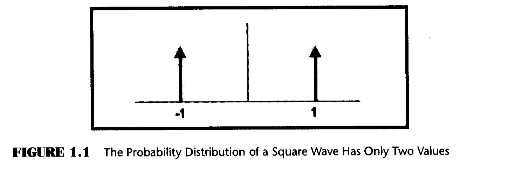
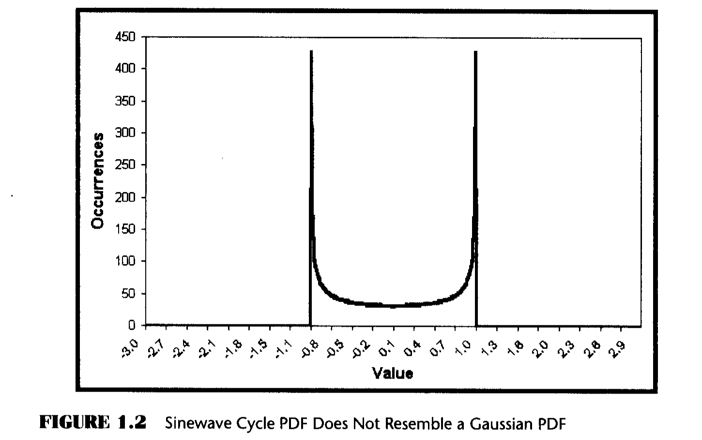
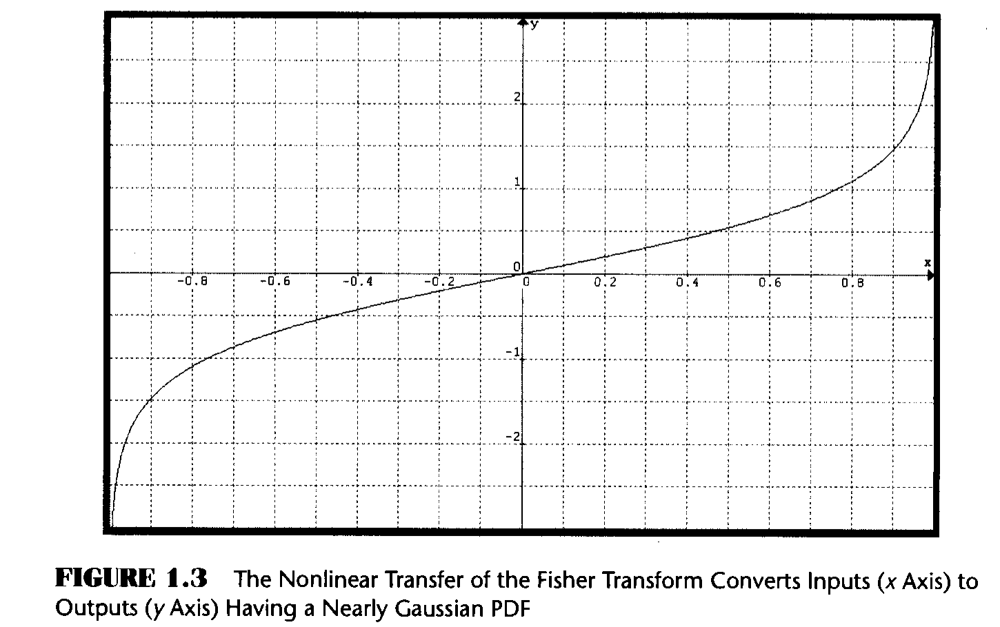
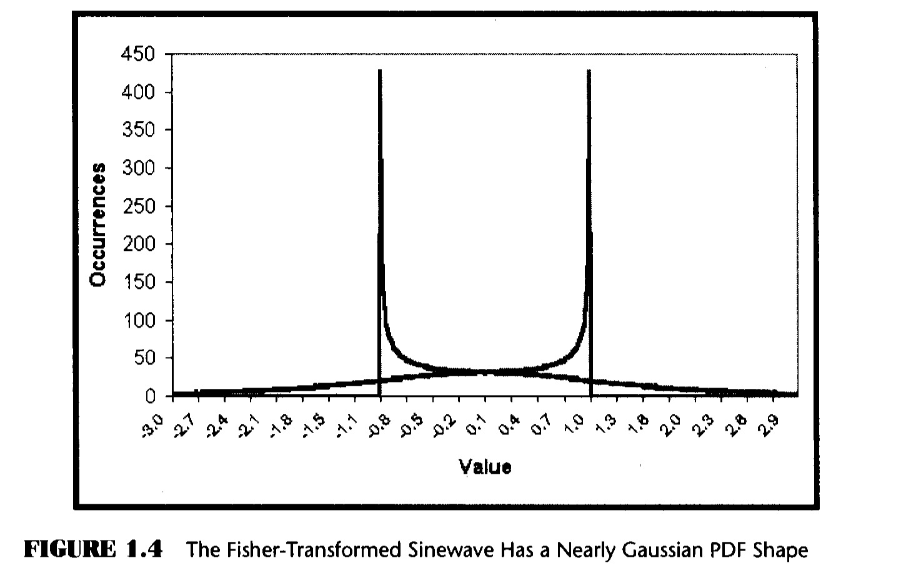
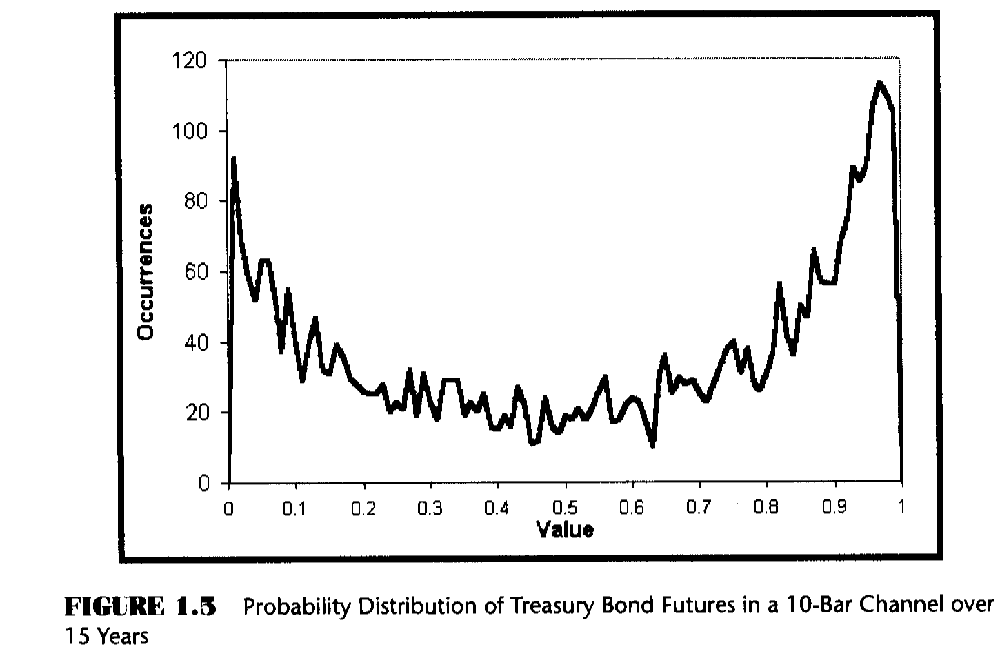
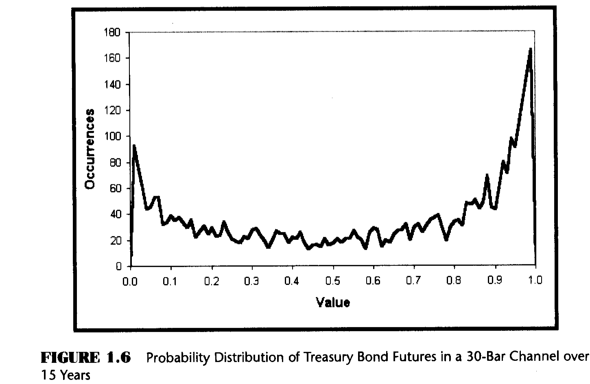
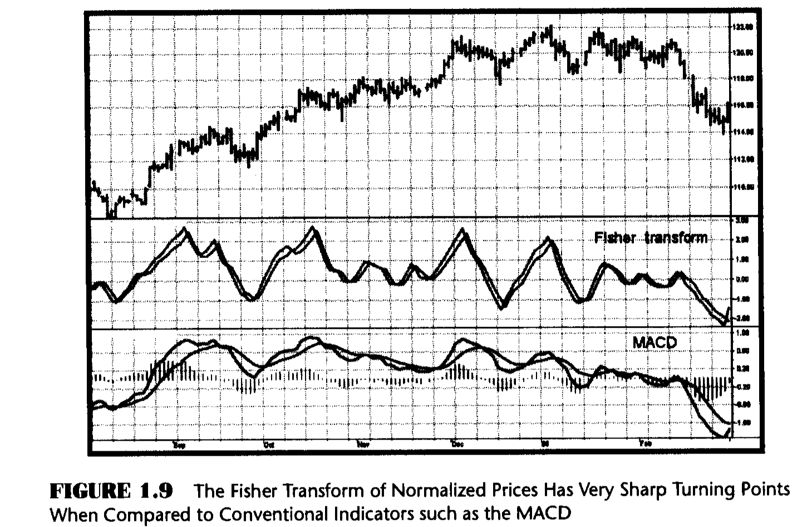

# Chapter 1: The Fisher Transform

> "I don't see any chance of a market recovery," said Tom improbably.

The focus of my research for more than two decades has been directed toward applying my background in engineering and signal processing to the art of trading. The goal of this book is to share the results of this research with you. Throughout the book I will demonstrate new methods for technical analysis of stocks and commodities and ways to code them for maximum efficiency and effectiveness. I will discuss methods for modeling the market to help categorize market activity. In addition to new indicators and automatic trading systems, I will explain how to turn good-performing traditional indicators into outstanding adaptive indicators. The trading systems that subsequently evolve from this analysis will seriously challenge, and often exceed, the consistent performance and profit-making capabilities of most commercially available trading systems.

While much of what is covered in this book breaks new ground, it is not simply innovation for innovation's sake. Rather, it is intended to challenge conventional wisdom and illuminate the shortcomings of many prevailing approaches to systems development.

In this chapter we plunge right into an excellent example of challenging conventional wisdom. I know at least a dozen statistically based indicators that reference "the one-sigma point," "the three-sigma point," and so on. Sigma is the standard deviation from the mean. In order to have a standard deviation from the mean, one must know the probability density function (PDF). A Gaussian, or Normal, PDF is almost universally assumed. A Gaussian PDF is the familiar bell-shaped curve used to describe IQ distribution in the population and a host of other statistical descriptions. The Gaussian PDF has long "tails" that describe events that have a wide deviation from the mean with relatively low probability. With a Gaussian PDF, 68.26 percent of all occurrences fall within plus or minus one standard deviation from the mean, 95.44 percent of occurrences fall within plus or minus two standard deviations, and 99.73 percent of all occurrences fall within plus or minus three deviations. In other words, the majority of all cases fall within the one-sigma "boundary" with a Gaussian PDF. If an event falls outside the one-sigma level, then certain inferences have been drawn about what can happen in the future.

The real question here is whether the Gaussian PDF can be used to reliably describe market activity. You can easily answer that question yourself. Just think about the way prices look on a bar chart. Do you see only 68 percent of the prices clustered near the mean price? That is, do you see 32 percent of the prices separated by more than one deviation from the mean? And, do you see prices spike away from the mean nearly 5 percent of the time by two standard deviations? How often do you even see price spikes at all? If you don't see these deviations, a Gaussian PDF is not a good assumption.

The Fisher transform is a simple mathematical process used to convert any data set to a modified data set whose PDF is approximately Gaussian. Once the Fisher transform is computed, we can then analyze the transformed data set in terms of its deviation from the mean.

The Commodity Channel Index (CCI), developed by Donald Lambert, is an example of reliance on the Gaussian PDF assumption. The equation to compute the CCI is:

```
CCI = (Price - Moving Average) / (0.015 * Deviation)
```

Deviation is computed from the difference of prices and moving average values over a period. The period of the moving average over which the computation is done is selectable by the user. The CCI can be viewed as the current deviation normalized to the standard deviation. But what gives with the 0.015 term? Well, conveniently enough, the reciprocal of 0.015 is 66.7, which is close enough to one standard deviation of a Gaussian PDF for most technical analysis work. The premise is that if prices exceed a standard deviation, they will revert to the mean. Therefore, the common rules are to sell if the CCI exceeds +100 and buy if the CCI is less than -100. Needless to say, the CCI can be improved substantially through the use of the Fisher transform.

Suppose prices behave as a square wave. If you tried to use the price crossing a moving average as a trading system, you would be destined for failure because the price has already switched to the opposite value by the time the movement is detected. There are only two price values. Therefore, the probability distribution is 50 percent that the price will be at one value or the other. There are no other possibilities.



The probability distribution of the square wave is shown in Figure 1.1. Clearly, this probability function does not remotely resemble a Gaussian probability distribution.

There is no great mystery about the meaning of a probability density or how it is computed. It is simply the likelihood the price will assume a given value. Think of it this way: Construct any waveform you choose by arranging beads strung on a series of parallel horizontal wires. After the waveform is created, turn the frame so the wires are vertical. All the beads will fall to the bottom, and the number of beads on each wire will stack up to demonstrate the probability of the value represented by each wire.



I used a slightly more sophisticated computer code, but nonetheless the same idea, to create the probability distribution of a sinewave in Figure 1.2. In this case, I used a total of 10,000 "beads." This PDF may be surprising, but if you stop and think about it, you will realize that most of the sampled data points of a sinewave occur near the maximum and minimum extremes. The PDF of a simple sinewave cycle is not at all similar to a Gaussian PDF. In fact, cycle PDFs are more closely related to those of a square wave. The high probability of a cycle being near the extreme values is one of the reasons why cycles are difficult to trade. About the only way to successfully trade a cycle is to take advantage of the short-term coherency and predict the cyclic turning point.

## The Fisher Transform Equation

The Fisher transform changes the PDF of any waveform so that the transformed output has an approximately Gaussian PDF. The Fisher transform equation is:

```
y = 0.5 * ln((1 + x) / (1 - x))                                    (1.2)

Where:
  x is the input (constrained to -1 < x < 1)
  y is the output
  ln is the natural logarithm
```



The transfer function of the Fisher transform is shown in Figure 1.3. When the input data is near the mean, the gain is approximately unity. For example, go to x = 0.5 in Figure 1.3. There, the Y value is only slightly larger than 0.5. By contrast, when the input approaches either limit within the range, the output is greatly amplified. This amplification accentuates the largest deviations from the mean, providing the "tail" of the Gaussian PDF.

Figure 1.4 shows the PDF of the Fisher-transformed output as the familiar bell-shaped curve, compared to the input sinewave PDF. Both have the same probability at the mean value. The transformed output PDF is nearly Gaussian, a radical change from the sinewave PDF.



## Measuring Market Probability Distributions

I measured the probability distribution of U.S. Treasury Bond futures over a 15-year span from 1988 to 2003. To make the measurement, I created a normalized channel 10 bars long. The normalized channel is basically the same as a 10-bar Stochastic Indicator. I then measured the price location within that channel in 100 bins and counted up the number of times the price was in each bin.



The results of this probability distribution measurement are shown in Figure 1.5. This actual probability distribution more closely resembles the PDF of a sinewave rather than a Gaussian PDF.

I then increased the length of the normalized channel to 30 bars to test the hypothesis that the sinewave-like probability distribution is only a short-term phenomenon. The resulting probability distribution is shown in Figure 1.6. The probability distributions of Figures 1.5 and 1.6 are very similar.



## Application to Trading

So what does this mean for trading? If the prices are normalized to fall within the range from -1 to +1 and subjected to the Fisher transform, extreme price movements are relatively rare events. This means the turning points can be clearly and unambiguously identified.

### EasyLanguage Code (Figure 1.7)

```easylanguage
Inputs: Price((H+L)/2),
        Len(10);

Vars:   MaxH(0),
        MinL(0),
        Fish(0);

MaxH = Highest(Price, Len);
MinL = Lowest(Price, Len);

Value1 = .5*2*((Price - MinL)/(MaxH - MinL) - .5) + .5*Value1[1];

If Value1 > .9999 then Value1 = .9999;
If Value1 < -.9999 then Value1 = -.9999;

Fish = 0.25*Log((1 + Value1)/(1 - Value1)) + .5*Fish[1];

Plot1(Fish, "Fisher");
Plot2(Fish[1], "Trigger");
```

*Figure 1.7: EasyLanguage Code to Normalize Price to a 10-Day Channel and Compute Its Fisher Transform*

Value1 is a function used to normalize price within its last 10-day range. The period for the range is adjustable as an input. Value1 is centered on its midpoint and then doubled so that Value1 will swing between the -1 and +1 limits. Value1 is also smoothed with an exponential moving average whose alpha is 0.5. The smoothing may allow Value1 to exceed the 10-day price range, so limits are introduced to preclude the Fisher transform from blowing up by having an input value larger than unity. The Fisher transform is computed to be the variable "Fish". Both Fish and Fish delayed by one bar are plotted to provide a crossover system that identifies the cyclic turning points.

### eSignal Formula Script (EFS) Code (Figure 1.8)

```javascript
/***********************************************************
Title: Fisher Transform
***********************************************************/
function preMain() {
    setStudyTitle("Fisher Transform");
    setCursorLabelName("Fisher", 0);
    setCursorLabelName("Trigger", 1);
    setDefaultBarFgColor(Color.blue, 0);
    setDefaultBarFgColor(Color.red, 1);
    setDefaultBarThickness(2, 0);
    setDefaultBarThickness(2, 1);
}

var Value1 = null;
var Value1_1 = 0;
var Fish = null;
var Fish_1 = 0;
var vPrice = null;
var aPrice = null;

function main(nLength) {
    var nState = getBarState();
    if (nLength == null) nLength = 10;
    if (aPrice == null) aPrice = new Array(nLength);

    if (nState == BARSTATE_NEWBAR && vPrice != null) {
        aPrice.pop();
        aPrice.unshift(vPrice);
        if (Value1 != null) Value1_1 = Value1;
        if (Fish != null) Fish_1 = Fish;
    }

    vPrice = (high() + low()) / 2;
    aPrice[0] = vPrice;
    if (aPrice[nLength-1] == null) return;

    var MaxH = high();
    var MinL = low();

    for (i = 0; i < nLength; ++i) {
        MaxH = Math.max(MaxH, aPrice[i]);
        MinL = Math.min(MinL, aPrice[i]);
    }

    Value1 = .5 * 2 * ((vPrice - MinL) /
        (MaxH - MinL) - .5) + .5 * Value1_1;

    if (Value1 > .9999) Value1 = .9999;
    if (Value1 < -.9999) Value1 = -.9999;

    Fish = 0.25 * Math.log((1 + Value1) /
        (1 - Value1)) + .5 * Fish_1;

    return new Array(Fish, Fish_1);
}
```

*Figure 1.8: EFS Code to Normalize Price to a 10-Day Channel and Compute Its Fisher Transform*

## Results



The Fisher transform of the prices within an eight-day channel is plotted below the price bars in Figure 1.9. Note that the turning points are not only sharp and distinct, but they also occur in a timely fashion so that profitable trades can be entered. The Fisher transform is also compared to a similarly scaled moving average convergence-divergence (MACD) indicator in Figure 1.9. The MACD is representative of conventional indicators whose turning points are rounded and indistinct in comparison to the Fisher transform. As a result of the rounded turning points, the entry and exit signals are invariably late.

## Key Points to Remember

- Prices almost never have a Gaussian, or Normal, probability distribution.
- Statistical measures based on Gaussian probability distributions, such as standard deviations, are in error because the probability distribution assumption underlying the calculation is in error.
- The Fisher transform converts almost any input probability distribution to be nearly a Gaussian probability distribution.
- The Fisher transform, when applied to indicators, provides razor-sharp buy and sell signals.
