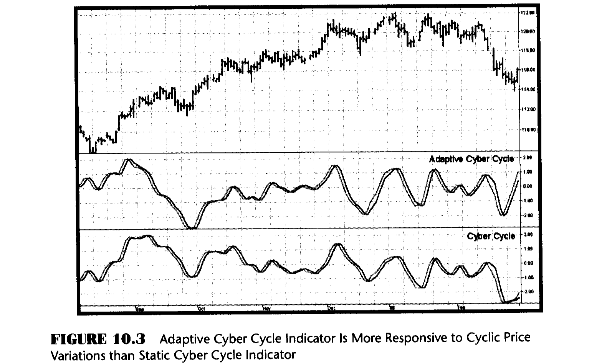
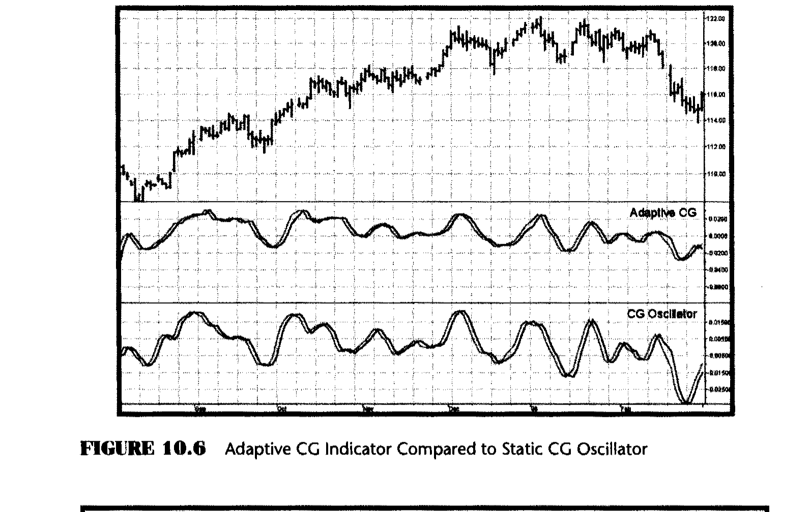
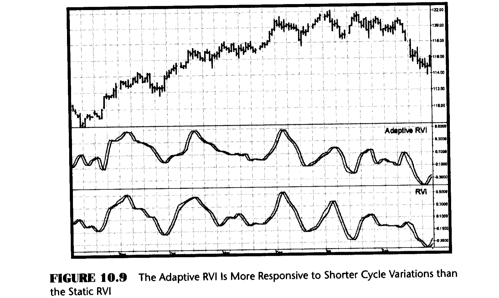
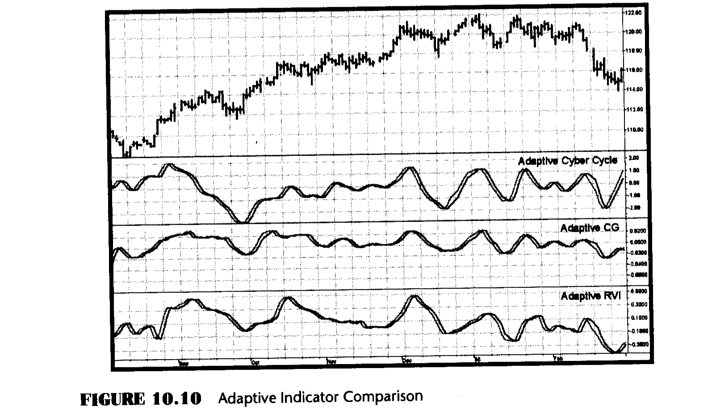

# Chapter 10: Adaptive Indicators

> "The dinosaurs did not survive," said Tom adaptively.

Having made the cycle period measurements as in Chapter 9, one brute force application would be to note the most recent highest high and then count forward the number of bars equal to half the dominant cycle period to locate the next buying opportunity. Fortunately, we can be much more sophisticated in our analysis using indicators. If indicators work moderately well using fixed lengths in their computation, then these indicators should sparkle when the length is adaptive to a fraction of the measured dominant cycle.

I developed several oscillator-type indicators in Chapters 4 through 6. I will now revisit each of these and examine the improvements that result from using a Dominant Cycle measurement to make their computational length adaptive to the current market conditions. In each case, I compare the adaptive version of the indicator to the static version. I also compare the three adaptive indicators to each other for you to judge which is preferable. Since I use the same price chart throughout this book for consistency, and because you can test these indicators on your own computer using your own data, I will not bore you with agonizing details regarding indicator performance and comparisons.

## Adaptive Cyber Cycle

The most simple cycle indicator was the Cyber Cycle, which was extracted from the price series in Chapter 4 by filtering out the trend component. The filter itself was derived in Chapter 2. This filter used the coefficient $\alpha = 0.07$. The EasyLanguage and eSignal Formula Script (EFS) codes for the adaptive version of the Cyber Cycle Indicator are shown in Figures 10.1 and 10.2, respectively. Here, the Dominant Cycle is computed exactly as in Chapter 9. A fixed value of alpha is used to make the Dominant Cycle period measurement; then the measured Dominant Cycle is used to compute the coefficient alpha1. It is commonly recognized that the exponential moving alpha is related to the length of a simple moving average by the equation $\alpha = 2 / (Length + 1)$. In this case, I use the Dominant Cycle period as the length in the computation of alpha1. This enables the Cyber Cycle Indicator to be adaptive to the measured Dominant Cycle period. A trigger signal consisting of the adaptive cycle delayed by one bar is also included in the indicator. Crossings of the adaptive cycle indicator and the trigger signal represent the buy and sell opportunities identified by this indicator.

Figure 10.3 shows the Adaptive Cyber Cycle Indicator compared to the static Cyber Cycle. This comparison shows that the adaptive indicator generally emphasizes the cyclic swings and is often one bar earlier in producing buy and sell signals.

**Figure 10.1: EasyLanguage Code for the Adaptive Cyber Cycle**

```easylanguage
Inputs: Price((H+L)/2),
        alpha(.07);

Vars:   Smooth(0),
        Cycle(0),
        Q1(0),
        I1(0),
        DeltaPhase(0),
        MedianDelta(0),
        DC(0),
        InstPeriod(0),
        Period(0),
        Length(0),
        Num(0),
        Denom(0),
        alpha1(0),
        AdaptCycle(0);

Smooth = (Price + 2*Price[1] + 2*Price[2]
    + Price[3])/6;

Cycle = (1 - .5*alpha)*(1 - .5*alpha)*(Smooth
    - 2*Smooth[1] + Smooth[2]) + 2*(1 - alpha)*Cycle[1]
    - (1 - alpha)*(1 - alpha)*Cycle[2];

If currentbar < 7 then Cycle = (Price - 2*Price[1]
    + Price[2]) / 4;

Q1 = (.0962*Cycle + .5769*Cycle[2] - .5769*Cycle[4]
    - .0962*Cycle[6])*(.5 + .08*InstPeriod[1]);

I1 = Cycle[3];

If Q1 <> 0 and Q1[1] <> 0 then DeltaPhase = (I1/Q1
    - I1[1]/Q1[1]) / (1 + I1*I1[1]/(Q1*Q1[1]));

If DeltaPhase < 0.1 then DeltaPhase = 0.1;
If DeltaPhase > 1.1 then DeltaPhase = 1.1;

MedianDelta = Median(DeltaPhase, 5);

If MedianDelta = 0 then DC = 15
    else DC = 6.28318 / MedianDelta + .5;

InstPeriod = .33*DC + .67*InstPeriod[1];

Period = .15*InstPeriod + .85*Period[1];

alpha1 = 2 / (Period + 1);

AdaptCycle = (1 - .5*alpha1)*(1 - .5*alpha1)*(Smooth
    - 2*Smooth[1] + Smooth[2]) + 2*(1
    - alpha1)*AdaptCycle[1] - (1 - alpha1)*(1
    - alpha1)*AdaptCycle[2];

If currentbar < 7 then AdaptCycle = (Price
    - 2*Price[1] + Price[2]) / 4;

Plot1(AdaptCycle, "AdaptCycle");
Plot2(AdaptCycle[1], "Trigger");
```

**Figure 10.2: EFS Code for the Adaptive Cyber Cycle**

```javascript
/***********************************************************
Title:   Adaptive Cyber Cycle Indicator
Coded By: Chris D. Kryza (Divergence Software, Inc.)
Email:   c.kryza@gte.net
Incept:  07/09/2003
Version: 1.0.0
Fix History:
07/09/2003 - Initial Release
1.0.0
***********************************************************/

//External Variables
var nBarCount = 0;
var aPriceArray = new Array();
var aSmoothArray = new Array();
var aCycleArray = new Array();
var aDeltaPhase = new Array();
var aPeriod = new Array();
var aInstPeriod = new Array();
var aQ1 = new Array();
var aI1 = new Array();
var aACycleArray = new Array();

//== PreMain function required by eSignal to set things up
function preMain() {
    var x;
    setPriceStudy(false);
    setStudyTitle("Adaptive CyberCycle");
    setCursorLabelName("Cycle", 0);
    setCursorLabelName("Trig", 1);
    setDefaultBarFgColor(Color.blue, 0);
    setDefaultBarFgColor(Color.red, 1);

    //initialize arrays
    for (x = 0; x < 10; x++) {
        aPriceArray[x] = 0.0;
        aSmoothArray[x] = 0.0;
        aCycleArray[x] = 0.0;
        aQ1[x] = 0.0;
        aI1[x] = 0.0;
        aDeltaPhase[x] = 0.0;
        aPeriod[x] = 0.0;
        aInstPeriod[x] = 0.0;
        aACycleArray[x] = 0.0;
    }
}

//== Main processing function
function main(Alpha) {
    var x;
    var Alpha1;
    var nDC;
    var nMedianDelta;

    //initialize parameters if necessary
    if (Alpha == null) {
        Alpha = 0.07;
    }

    // study is initializing
    if (getBarState() == BARSTATE_ALLBARS) {
        return null;
    }

    //on each new bar, save array values
    if (getBarState() == BARSTATE_NEWBAR) {
        nBarCount++;
        aPriceArray.pop();
        aPriceArray.unshift(0);
        aSmoothArray.pop();
        aSmoothArray.unshift(0);
        aCycleArray.pop();
        aCycleArray.unshift(0);
        aQ1.pop();
        aQ1.unshift(0);
        aI1.pop();
        aI1.unshift(0);
        aDeltaPhase.pop();
        aDeltaPhase.unshift(0);
        aInstPeriod.pop();
        aInstPeriod.unshift(0);
        aPeriod.pop();
        aPeriod.unshift(0);
        aACycleArray.pop();
        aACycleArray.unshift(0);
    }

    aPriceArray[0] = (high() + low()) / 2;

    aSmoothArray[0] = (aPriceArray[0]
        + 2 * aPriceArray[1] + 2 * aPriceArray[2]
        + aPriceArray[3]) / 6;

    if (nBarCount < 7) {
        aCycleArray[0] = (aPriceArray[0]
            - 2 * aPriceArray[1] + aPriceArray[2])
            / 4;
    }
    else {
        aCycleArray[0] = (1 - 0.5 * Alpha)
            * (1 - 0.5 * Alpha)
            * (aSmoothArray[0]
            - 2 * aSmoothArray[1]
            + aSmoothArray[2]) + 2 * (1 - Alpha)
            * aCycleArray[1] - (1 - Alpha)
            * (1 - Alpha) * aCycleArray[2];
    }

    aQ1[0] = (0.0962 * aCycleArray[0]
        + 0.5769 * aCycleArray[2]
        - 0.5769 * aCycleArray[4]
        - 0.0962 * aCycleArray[6]) * (0.5 + 0.08
        * aInstPeriod[1]);

    aI1[0] = aCycleArray[3];

    if (aQ1[0] != 0 && aQ1[1] != 0) {
        aDeltaPhase[0] = (aI1[0] / aQ1[0]
            - aI1[1] / aQ1[1]) / (1
            + aI1[0] * aI1[1] / (aQ1[0] * aQ1[1]));
    }

    if (aDeltaPhase[0] < 0.1) aDeltaPhase[0] = 0.1;
    if (aDeltaPhase[0] > 1.1) aDeltaPhase[0] = 1.1;

    nMedianDelta = Median(5, aDeltaPhase);

    if (nMedianDelta == 0) {
        nDC = 15;
    }
    else {
        nDC = 6.28318 / nMedianDelta + 0.5;
    }

    aInstPeriod[0] = 0.33 * nDC + 0.67
        * aInstPeriod[1];

    aPeriod[0] = 0.15 * aInstPeriod[0]
        + 0.85 * aPeriod[1];

    Alpha1 = 2 / (aPeriod[0] + 1);

    if (nBarCount < 7) {
        aACycleArray[0] = (aPriceArray[0]
            - 2 * aPriceArray[1]
            + aPriceArray[2]) / 4;
    }
    else {
        aACycleArray[0] = (1 - 0.5 * Alpha1)
            * (1 - 0.5 * Alpha1)
            * (aSmoothArray[0]
            - 2 * aSmoothArray[1]
            + aSmoothArray[2]) + 2 * (1
            - Alpha1) * aACycleArray[1]
            - (1 - Alpha1) * (1 - Alpha1)
            * aACycleArray[2];
    }

    //return the calculated values
    if (!isNaN(aACycleArray[0])) {
        return new Array(aACycleArray[0],
            aACycleArray[1]);
    }
}

function Median(nBars, aArray) {
    var aTmp = new Array();
    var nTmp;
    var result;
    var x;

    //transfer elements to temp array
    x = 0;
    while (x < nBars) {
        aTmp[x] = aArray[x++];
    }

    //sort array in asc order
    aTmp.sort(SortAsc);

    //if odd # of elements, just take middle
    if (nBars % 2 != 0) {
        result = aTmp[(nBars + 1) / 2];
        aTmp = null;
        return (result);
    }

    //if even # elements, take average of two middle elements
    else {
        nTmp = nBars / 2;
        result = (aTmp[nTmp] + aTmp[nTmp + 1]) / 2;
        aTmp = null;
        return (result);
    }
}

function SortAsc(arg1, arg2) {
    if (arg1 < arg2) {
        return (-1);
    }
    else {
        return (1);
    }
}
```



## Adaptive CG Indicator

The CG Oscillator, derived in Chapter 5, finds the center of gravity of a fixed-length data sample as the sampling window is moved from bar to bar. The Adaptive CG Indicator uses half the measured Dominant Cycle period as the adaptive length of this variant of the CG Oscillator. The EasyLanguage and EFS codes for the adaptive version of the CG Oscillator are shown in Figures 10.4 and 10.5, respectively. Here, the dominant cycle is computed exactly as in Chapter 9. A fixed value of alpha is used to make the dominant cycle period measurement. The variable IntPeriod is computed as the integer portion of a four-bar weighted moving average of the Period. Since the weighted coefficients are divided by twice their sum, IntPeriod is the integer value of half the Dominant Cycle period. An integer value is required to sum the numerator and denominator in the subsequent code. Since the length of the summing varies with the length of the measured Dominant Cycle period, the CG is adaptive to it.

Figure 10.6 shows the Adaptive CG Indicator compared to the static CG Oscillator. This comparison in this data set does not display any dramatic change in the indicator as a result of making it adaptive.

**Figure 10.4: EasyLanguage Code to Compute the Adaptive CG Indicator**

```easylanguage
Inputs: Price((H+L)/2),
        alpha(.07);

Vars:   Smooth(0),
        Cycle(0),
        Q1(0),
        I1(0),
        DeltaPhase(0),
        MedianDelta(0),
        DC(0),
        InstPeriod(0),
        Period(0),
        count(0),
        Num(0),
        Denom(0),
        CG(0),
        IntPeriod(0);

Smooth = (Price + 2*Price[1] + 2*Price[2]
    + Price[3])/6;

Cycle = (1 - .5*alpha)*(1 - .5*alpha)*(Smooth
    - 2*Smooth[1] + Smooth[2]) + 2*(1 - alpha)*Cycle[1]
    - (1 - alpha)*(1 - alpha)*Cycle[2];

If currentbar < 7 then Cycle = (Price - 2*Price[1]
    + Price[2]) / 4;

Q1 = (.0962*Cycle + .5769*Cycle[2] - .5769*Cycle[4]
    - .0962*Cycle[6])*(.5 + .08*InstPeriod[1]);

I1 = Cycle[3];

If Q1 <> 0 and Q1[1] <> 0 then DeltaPhase = (I1/Q1
    - I1[1]/Q1[1]) / (1 + I1*I1[1]/(Q1*Q1[1]));

If DeltaPhase < 0.1 then DeltaPhase = 0.1;
If DeltaPhase > 1.1 then DeltaPhase = 1.1;

MedianDelta = Median(DeltaPhase, 5);

If MedianDelta = 0 then DC = 15
    else DC = 6.28318 / MedianDelta + .5;

InstPeriod = .33*DC + .67*InstPeriod[1];

Value1 = .15*InstPeriod + .85*Value1[1];

IntPeriod = intportion(Value1 / 2);

Num = 0;
Denom = 0;

For count = 0 to IntPeriod - 1 begin
    Num = Num + (1 + count)*(Price[count]);
    Denom = Denom + (Price[count]);
End;

If Denom <> 0 then CG = -Num/Denom + (IntPeriod + 1) / 2;

Plot1(CG, "CG");
Plot2(CG[1], "Trigger");
```

**Figure 10.5: EFS Code to Compute the Adaptive CG Indicator**

```javascript
/***********************************************************
Title:   Adaptive CG Oscillator
Coded By: Chris D. Kryza (Divergence Software, Inc.)
Email:   c.kryza@gte.net
Incept:  07/09/2003
Version: 1.0.0
Fix History:
07/09/2003 - Initial Release
1.0.0
***********************************************************/

//External Variables
var nBarCount = 0;
var aPriceArray = new Array();
var aSmoothArray = new Array();
var aCycleArray = new Array();
var aDeltaPhase = new Array();
var aPeriod = new Array();
var aInstPeriod = new Array();
var aQ1 = new Array();
var aI1 = new Array();
var aCGArray = new Array();

//== PreMain function required by eSignal to set things up
function preMain() {
    var x;
    setPriceStudy(false);
    setStudyTitle("Adaptive CG");
    setCursorLabelName("CG", 0);
    setCursorLabelName("Trig", 1);
    setDefaultBarFgColor(Color.blue, 0);
    setDefaultBarFgColor(Color.red, 1);

    //initialize arrays
    for (x = 0; x < 70; x++) {
        aPriceArray[x] = 0.0;
        aSmoothArray[x] = 0.0;
        aCycleArray[x] = 0.0;
        aQ1[x] = 0.0;
        aI1[x] = 0.0;
        aDeltaPhase[x] = 0.0;
        aPeriod[x] = 0.0;
        aInstPeriod[x] = 0.0;
        aCGArray[x] = 0.0;
    }
}

//== Main processing function
function main(Alpha) {
    var x;
    var nCG = 0;
    var nDC;
    var nIntPeriod;
    var nNum;
    var nDenom;
    var nMedianDelta;

    //initialize parameters if necessary
    if (Alpha == null) {
        Alpha = 0.07;
    }

    // study is initializing
    if (getBarState() == BARSTATE_ALLBARS) {
        return null;
    }

    //on each new bar, save array values
    if (getBarState() == BARSTATE_NEWBAR) {
        nBarCount++;
        aPriceArray.pop();
        aPriceArray.unshift(0);
        aSmoothArray.pop();
        aSmoothArray.unshift(0);
        aCycleArray.pop();
        aCycleArray.unshift(0);
        aQ1.pop();
        aQ1.unshift(0);
        aI1.pop();
        aI1.unshift(0);
        aDeltaPhase.pop();
        aDeltaPhase.unshift(0);
        aInstPeriod.pop();
        aInstPeriod.unshift(0);
        aPeriod.pop();
        aPeriod.unshift(0);
        aCGArray.pop();
        aCGArray.unshift(0);
    }

    aPriceArray[0] = (high() + low()) / 2;

    aSmoothArray[0] = (aPriceArray[0]
        + 2 * aPriceArray[1] + 2 * aPriceArray[2]
        + aPriceArray[3]) / 6;

    if (nBarCount < 7) {
        aCycleArray[0] = (aPriceArray[0]
            - 2 * aPriceArray[1]
            + aPriceArray[2]) / 4;
    }
    else {
        aCycleArray[0] = (1 - 0.5 * Alpha) * (1
            - 0.5 * Alpha) * (aSmoothArray[0]
            - 2 * aSmoothArray[1]
            + aSmoothArray[2]) + 2 * (1 - Alpha)
            * aCycleArray[1] - (1 - Alpha) * (1
            - Alpha) * aCycleArray[2];
    }

    aQ1[0] = (0.0962 * aCycleArray[0]
        + 0.5769 * aCycleArray[2]
        - 0.5769 * aCycleArray[4]
        - 0.0962 * aCycleArray[6]) * (0.5 + 0.08
        * aInstPeriod[1]);

    aI1[0] = aCycleArray[3];

    if (aQ1[0] != 0 && aQ1[1] != 0) {
        aDeltaPhase[0] = (aI1[0] / aQ1[0]
            - aI1[1] / aQ1[1]) / (1
            + aI1[0] * aI1[1] / (aQ1[0] * aQ1[1]));
    }

    if (aDeltaPhase[0] < 0.1) aDeltaPhase[0] = 0.1;
    if (aDeltaPhase[0] > 1.1) aDeltaPhase[0] = 1.1;

    nMedianDelta = Median(5, aDeltaPhase);

    if (nMedianDelta == 0) {
        nDC = 15;
    }
    else {
        nDC = 6.28318 / nMedianDelta + 0.5;
    }

    aInstPeriod[0] = 0.33 * nDC + 0.67
        * aInstPeriod[1];

    aPeriod[0] = 0.15 * aInstPeriod[0]
        + 0.85 * aPeriod[1];

    nIntPeriod = Math.floor((4 * aPeriod[0]
        + 3 * aPeriod[1]
        + 2 * aPeriod[3] + aPeriod[4]) / 20);

    nNum = 0;
    nDenom = 0;

    for (x = 0; x < nIntPeriod; x++) {
        nNum += (1.0 + x) * (aPriceArray[x]);
        nDenom += (aPriceArray[x]);
    }

    if (nDenom != 0) nCG = -nNum / nDenom
        + (nIntPeriod + 1) / 2;

    aCGArray[0] = nCG;

    //return the calculated values
    if (!isNaN(aCGArray[0])) {
        return new Array(aCGArray[0],
            aCGArray[1]);
    }
}

function Median(nBars, aArray) {
    var aTmp = new Array();
    var nTmp;
    var result;
    var x;

    //transfer elements to temp array
    x = 0;
    while (x < nBars) {
        aTmp[x] = aArray[x++];
    }

    //sort array in asc order
    aTmp.sort(SortAsc);

    //if odd # of elements, just take middle
    if (nBars % 2 != 0) {
        result = aTmp[(nBars + 1) / 2];
        aTmp = null;
        return (result);
    }

    //if even # elements, take average of two middle elements
    else {
        nTmp = nBars / 2;
        result = (aTmp[nTmp] + aTmp[nTmp + 1]) / 2;
        aTmp = null;
        return (result);
    }
}

function SortAsc(arg1, arg2) {
    if (arg1 < arg2) {
        return (-1);
    }
    else {
        return (1);
    }
}
```



## Adaptive Relative Vigor Index

The RVI, derived in Chapter 6, finds the difference of the close minus the open, normalized to the difference of the high and low. This ratio was computed over a fixed period. The Adaptive RVI Indicator uses half the measured Dominant Cycle period as the adaptive length of this variant of the RVI. The EasyLanguage and EFS codes for the adaptive version of the RVI are shown in Figures 10.7 and 10.8, respectively. Here the Dominant Cycle is computed exactly as in Chapter 9. A fixed value of alpha is used to make the Dominant Cycle period measurement. The variable Length is computed as the integer portion of a four-bar weighted moving average of the period. Since the weighted coefficients are divided by twice their sum, Length is the integer value of half the Dominant Cycle period. An integer value is required to sum the numerator and denominator in the subsequent code. Since the length of the summing varies with the length of the measured Dominant Cycle period, the RVI is adaptive to it.

Figure 10.9 shows the Adaptive RVI compared to the static RVI. As with the other adaptive indicators, the contributions of the shorter cycle periods are emphasized when compared to their static variants.

Figure 10.10 shows the three adaptive indicators compared to each other. As with their static variants, all show about the same performance. Perhaps the message is that once the cyclic component is extracted from the data correctly, most oscillator-type indicators have about the same performance. It may be true that one indicator performs better in one data set than another. The bottom line is that you now have in your toolbox three independently derived indicators from which to choose. It then becomes a matter of personal preference.

**Figure 10.7: EasyLanguage Code to Compute the Adaptive RVI**

```easylanguage
Inputs: Price((H+L)/2),
        alpha(.07);

Vars:   Smooth(0),
        Cycle(0),
        Q1(0),
        I1(0),
        DeltaPhase(0),
        MedianDelta(0),
        DC(0),
        InstPeriod(0),
        Period(0),
        count(0),
        Length(0),
        Num(0),
        Denom(0),
        RVI(0),
        MaxRVI(0),
        MinRVI(0);

Smooth = (Price + 2*Price[1] + 2*Price[2]
    + Price[3])/6;

Cycle = (1 - .5*alpha)*(1 - .5*alpha)*(Smooth
    - 2*Smooth[1] + Smooth[2]) + 2*(1 - alpha)*Cycle[1]
    - (1 - alpha)*(1 - alpha)*Cycle[2];

If currentbar < 7 then Cycle = (Price - 2*Price[1]
    + Price[2]) / 4;

Q1 = (.0962*Cycle + .5769*Cycle[2] - .5769*Cycle[4]
    - .0962*Cycle[6])*(.5 + .08*InstPeriod[1]);

I1 = Cycle[3];

If Q1 <> 0 and Q1[1] <> 0 then DeltaPhase = (I1/Q1
    - I1[1]/Q1[1]) / (1 + I1*I1[1]/(Q1*Q1[1]));

If DeltaPhase < 0.1 then DeltaPhase = 0.1;
If DeltaPhase > 1.1 then DeltaPhase = 1.1;

MedianDelta = Median(DeltaPhase, 5);

If MedianDelta = 0 then DC = 15
    else DC = 6.28318 / MedianDelta + .5;

InstPeriod = .33*DC + .67*InstPeriod[1];

Period = .15*InstPeriod + .85*Period[1];

Length = intportion((4*Period + 3*Period[1]
    + 2*Period[3] + Period[4]) / 20);

Value1 = ((Close - Open) + 2*(Close[1] - Open[1])
    + 2*(Close[2] - Open[2]) + (Close[3] - Open[3]))/6;

Value2 = ((High - Low) + 2*(High[1] - Low[1])
    + 2*(High[2] - Low[2]) + (High[3] - Low[3]))/6;

Num = 0;
Denom = 0;

For count = 0 to Length - 1 begin
    Num = Num + Value1[count];
    Denom = Denom + Value2[count];
End;

If Denom <> 0 then RVI = Num / Denom;

Plot1(RVI, "RVI");
Plot2(RVI[1], "Trigger");
```

**Figure 10.8: EFS Code to Compute the Adaptive RVI**

```javascript
/***********************************************************
Title:   Adaptive RVI
Coded By: Chris D. Kryza (Divergence Software, Inc.)
Email:   c.kryza@gte.net
Incept:  07/09/2003
Version: 1.0.0
Fix History:
07/09/2003 - Initial Release
1.0.0
***********************************************************/

//External Variables
var nBarCount = 0;
var aPriceArray = new Array();
var aSmoothArray = new Array();
var aCycleArray = new Array();
var aDeltaPhase = new Array();
var aPeriod = new Array();
var aInstPeriod = new Array();
var aQ1 = new Array();
var aI1 = new Array();
var aRVIArray = new Array();
var aV1Array = new Array();
var aV2Array = new Array();

//== PreMain function required by eSignal to set things up
function preMain() {
    var x;
    setPriceStudy(false);
    setStudyTitle("Adaptive RVI");
    setCursorLabelName("RVI", 0);
    setCursorLabelName("Trig", 1);
    setDefaultBarFgColor(Color.blue, 0);
    setDefaultBarFgColor(Color.red, 1);

    //initialize arrays
    for (x = 0; x < 70; x++) {
        aPriceArray[x] = 0.0;
        aSmoothArray[x] = 0.0;
        aCycleArray[x] = 0.0;
        aQ1[x] = 0.0;
        aI1[x] = 0.0;
        aDeltaPhase[x] = 0.0;
        aPeriod[x] = 0.0;
        aInstPeriod[x] = 0.0;
        aRVIArray[x] = 0.0;
        aV1Array[x] = 0.0;
        aV2Array[x] = 0.0;
    }
}

//== Main processing function
function main(Alpha) {
    var x;
    var nRVI = 0;
    var nDC;
    var nLength;
    var nNum;
    var nDenom;
    var nMedianDelta;

    //initialize parameters if necessary
    if (Alpha == null) {
        Alpha = 0.07;
    }

    // study is initializing
    if (getBarState() == BARSTATE_ALLBARS) {
        return null;
    }

    //on each new bar, save array values
    if (getBarState() == BARSTATE_NEWBAR) {
        nBarCount++;
        aPriceArray.pop();
        aPriceArray.unshift(0);
        aSmoothArray.pop();
        aSmoothArray.unshift(0);
        aCycleArray.pop();
        aCycleArray.unshift(0);
        aQ1.pop();
        aQ1.unshift(0);
        aI1.pop();
        aI1.unshift(0);
        aDeltaPhase.pop();
        aDeltaPhase.unshift(0);
        aInstPeriod.pop();
        aInstPeriod.unshift(0);
        aPeriod.pop();
        aPeriod.unshift(0);
        aRVIArray.pop();
        aRVIArray.unshift(0);
        aV1Array.pop();
        aV1Array.unshift(0);
        aV2Array.pop();
        aV2Array.unshift(0);
    }

    aPriceArray[0] = (high() + low()) / 2;

    aSmoothArray[0] = (aPriceArray[0]
        + 2 * aPriceArray[1] + 2 * aPriceArray[2]
        + aPriceArray[3]) / 6;

    if (nBarCount < 7) {
        aCycleArray[0] = (aPriceArray[0]
            - 2 * aPriceArray[1] + aPriceArray[2])
            / 4;
    }
    else {
        aCycleArray[0] = (1 - 0.5 * Alpha) * (1
            - 0.5 * Alpha) * (aSmoothArray[0]
            - 2 * aSmoothArray[1]
            + aSmoothArray[2]) + 2 * (1 - Alpha)
            * aCycleArray[1] - (1 - Alpha) * (1
            - Alpha) * aCycleArray[2];
    }

    aQ1[0] = (0.0962 * aCycleArray[0]
        + 0.5769 * aCycleArray[2]
        - 0.5769 * aCycleArray[4]
        - 0.0962 * aCycleArray[6]) * (0.5 + 0.08
        * aInstPeriod[1]);

    aI1[0] = aCycleArray[3];

    if (aQ1[0] != 0 && aQ1[1] != 0) {
        aDeltaPhase[0] = (aI1[0] / aQ1[0]
            - aI1[1] / aQ1[1])
            / (1 + aI1[0] * aI1[1] / (aQ1[0] * aQ1[1]));
    }

    if (aDeltaPhase[0] < 0.1) aDeltaPhase[0] = 0.1;
    if (aDeltaPhase[0] > 1.1) aDeltaPhase[0] = 1.1;

    nMedianDelta = Median(5, aDeltaPhase);

    if (nMedianDelta == 0) {
        nDC = 15;
    }
    else {
        nDC = 6.28318 / nMedianDelta + 0.5;
    }

    aInstPeriod[0] = 0.33 * nDC + 0.67
        * aInstPeriod[1];

    aPeriod[0] = 0.15 * aInstPeriod[0]
        + 0.85 * aPeriod[1];

    nLength = Math.floor((4 * aPeriod[0]
        + 3 * aPeriod[1]
        + 2 * aPeriod[3] + aPeriod[4]) / 20);

    aV1Array[0] = ((close() - open())
        + 2 * (close(-1) - open(-1))
        + 2 * (close(-2) - open(-2))
        + (close(-3) - open(-3))) / 6;

    aV2Array[0] = ((high() - low())
        + 2 * (high(-1) - low(-1))
        + 2 * (high(-2) - low(-2))
        + (high(-3) - low(-3))) / 6;

    nNum = 0;
    nDenom = 0;

    for (x = 0; x < nLength; x++) {
        nNum += aV1Array[x];
        nDenom += aV2Array[x];
    }

    if (nDenom != 0) nRVI = nNum / nDenom;

    aRVIArray[0] = nRVI;

    //return the calculated values
    if (!isNaN(aRVIArray[0])) {
        return new Array(aRVIArray[0],
            aRVIArray[1]);
    }
}

function Median(nBars, aArray) {
    var aTmp = new Array();
    var nTmp;
    var result;
    var x;

    //transfer elements to temp array
    x = 0;
    while (x < nBars) {
        aTmp[x] = aArray[x++];
    }

    //sort array in asc order
    aTmp.sort(SortAsc);

    //if odd # of elements, just take middle
    if (nBars % 2 != 0) {
        result = aTmp[(nBars + 1) / 2];
        aTmp = null;
        return (result);
    }

    //if even # elements, take average of two middle elements
    else {
        nTmp = nBars / 2;
        result = (aTmp[nTmp] + aTmp[nTmp + 1]) / 2;
        aTmp = null;
        return (result);
    }
}

function SortAsc(arg1, arg2) {
    if (arg1 < arg2) {
        return (-1);
    }
    else {
        return (1);
    }
}
```





## Key Points to Remember

- The adaptive indicators all use the measured Dominant Cycle as their adaptive criterion.
- The Adaptive Cyber Cycle adapts to the full Dominant Cycle period in the computation of its alpha1 filter parameter.
- The Adaptive CG Oscillator uses the integer portion of the half Dominant Cycle period in the computation of the filter center of gravity.
- The Adaptive RVI uses the integer portion of the half Dominant Cycle period in the computation of the vigor ratio.
- All three adaptive indicators demonstrate similar performance.
