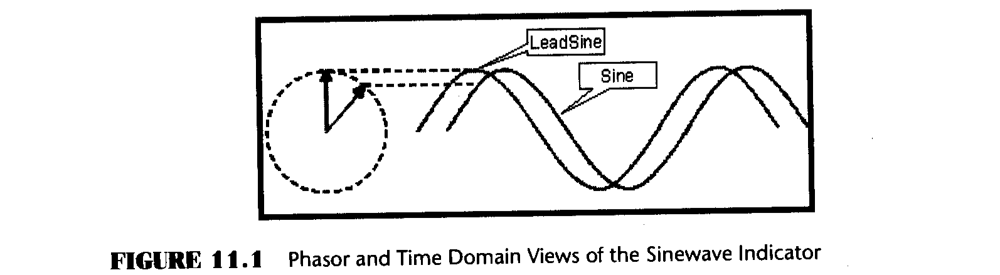
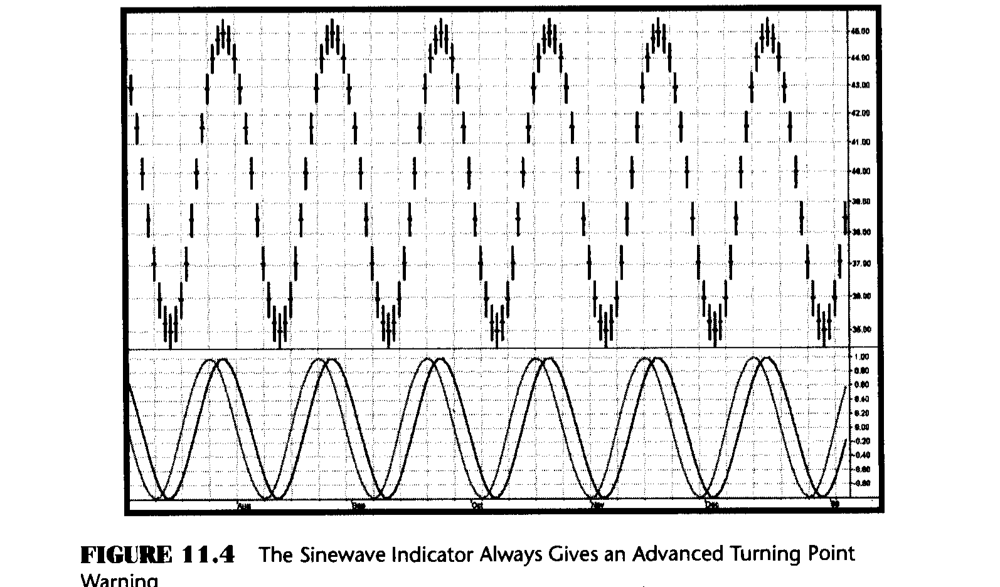
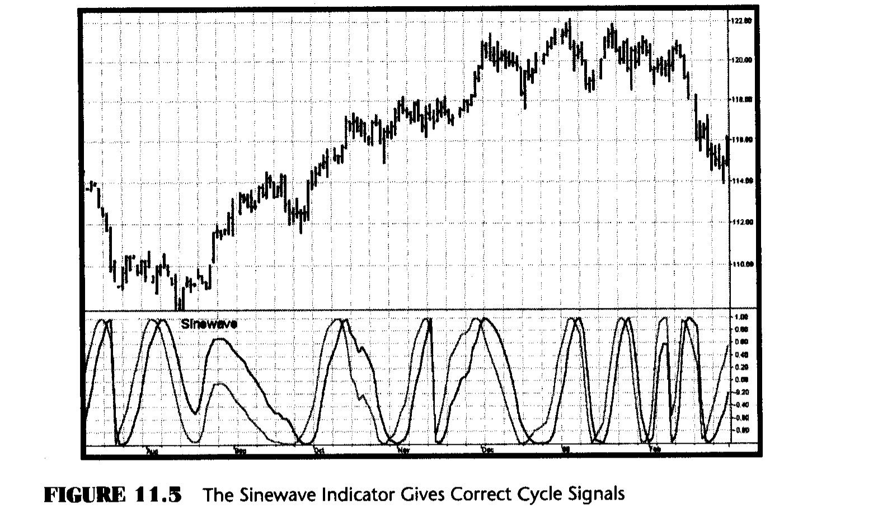

# Chapter 11: The Sinewave Indicator

> "I can forecast the future," said Tom predictably.

Causal filters can never predict the future. In fact, all have lag. The purpose of making good indicators adaptive in Chapter 9 was to eliminate as much lag as possible, not to make a prediction. With the Sinewave Indicator we are trying to create a noncausal filter that can predict the turning point of market cycles. Anticipation of the cyclic turning points is a major advantage of the Sinewave Indicator when compared to other oscillators, such as the RSI and Stochastic Indicators, that must wait for confirmation.

In Chapter 9 I showed you how to measure the period of the dominant market cycle for any bar in the data series. However, this measurement does not tell us where we are within that cycle. To locate the position of the cycle, we must measure the phase of the Dominant Cycle. Knowing the phase of the cycle, we can take the sine of the measured phase to create an artificial oscillator-type indicator. That is, the cyclic component of the market data is synthesized as a pure sinewave. Any lag we created in the process of measuring the phase can be mathematically removed. Furthermore, simply adding 45° to the measured phase creates an artificial phase lead. This is the noncausal factor. The phase is advanced on the presumption that the measured cycle has existed (at least briefly) in the past and will continue (at least briefly) into the future. Advancing the phase by 45° and taking a sine of the advanced phase angle produces an oscillator waveshape that leads the original sinewave by one-eighth of a cycle. The two sinewaves therefore cross ⅙ of a cycle before the peak cycle turning point and before the valley turning point. For a 16-bar Dominant Cycle, this gives an ideal 1-bar advance warning of the absolute Dominant Cycle turning points. For a 48-bar cycle, the advance extends to 3 bars. For an eight-bar Dominant Cycle, the advance warning is theoretically only half a bar.

My simplified model of the market consists of a trend and a cycle. There are certainly additional components present in real markets, but we are ignoring them in this simplified model. I call the highest-amplitude cycle the Dominant Cycle. Experience bears out that the assumption of the presence of a single Dominant Cycle is a workable approximation. Knowing the Dominant Cycle period, the phase of this Dominant Cycle can be measured. But if the market goes into a pure trend, there is no cycle. In this case, the phase ceases to advance. If the phase does not advance, then the two sinewave waveshapes of the Sinewave Indicator cannot cross. If the two waveshapes do not cross, the Sinewave Indicator produces no cyclic buy or sell signals. This avoidance of false whipsaw signals is a distinct advantage over traditional oscillators. In practice, the phase does not exactly stop; the phase does languish and the phase waveshape appears distinctly different than the constant rate of change that is produced when the market is in a cycle mode. The phase varies between 0° and 360°. If the cycle period is changing, there is an occasional crossing of the Sinewave Indicator lines to correct the phase angle for the current cycle period measurement. In these cases, the Sinewave Indicator lines do not appear to be sinewaves in the vicinity of the crossing. Therefore, these occasional bad crossing signals are easy to identify.

We obtain the Sinewave Indicator by plotting the sine of the measured phase angle. This gives us an oscillator that always swings between the limits of -1 and +1. We enhance the usability of this oscillator by plotting the sine of the phase angle advanced by 45°. The effect of plotting these two lines is shown for both the phasor and time domain presentations in Figure 11.1. Adding 45° clearly advances the phasor from a 45° slant to the vertical position. This phase advance means the LeadSine waveform will crest before the Sine crests. The LeadSine and Sine lines cross 22.5°, or ⅛ of a cycle, before the turning point of the cycle is reached. If the market has a cycle of 16 bars or less, this is a signal to enter or exit a trade immediately. If the market has a longer cycle, there is some built-in anticipation time before you pull the trigger.



Compared to conventional oscillators such as the Stochastic or RSI, the Sinewave Indicator has two major advantages:

1. The Sinewave Indicator anticipates the Cycle Mode turning point rather than waiting for confirmation.

2. The phase does not advance when the market is in a Trend Mode. Therefore the Sinewave Indicator does not tend to give false whipsaw signals when the market is in a Trend Mode.

An additional advantage is that the anticipation signal is obtained strictly by mathematically advancing the phase. Momentum is not employed. Therefore, the Sinewave Indicator signals are no more noisy than the original signal.

The EasyLanguage and eSignal Formula Script (EFS) codes to measure Dominant Cycle phase and then to synthesize the Sinewave are described with reference to Figures 11.2 and 11.3, respectively. The initial part of the code measures the Dominant Cycle exactly as in Chapter 9. The measured period must be further smoothed using an exponential moving average ($\alpha = 0.15$) because there is no further smoothing in the computation of the phase. The variable DCPeriod is the integer portion of the smoothed Dominant Cycle period because it is used to sum over the period and only an integer variable can be used for this purpose. Otherwise, rounding errors cause erratic results. The cycle component of the data is multiplied individually with the sine and cosine of the Dominant Cycle period, and these two products are summed individually over one complete cycle. These sums are known as the real part and the imaginary part of the data. It is well known that the arctangent of their ratio is the phase of the cycle component. The arctangent function can go to infinity, and the code precludes a computational problem if the ImagPart variable is smaller than 0.001. The arctangent function is also subject to ambiguities, depending on in which phase quadrant the computation resides. In EasyLanguage, it is simplest to resolve these ambiguities by rotating the DCPhase by 90° and then adding another 180° if ImagPart is negative. If converting this code to another language, care should be taken when dealing with the arctangent function. First, most computer languages represent angles in terms of radians rather than degrees. Second, the ambiguity resolution scheme I used is not universally appropriate for all languages. The Sine Indicator is plotted simply as the sine of the phase angle of the Dominant Cycle and the LeadSine Indicator is plotted as the sine of the phase angle plus 45°, giving it the desired leading property.
### EasyLanguage Code (Figure 11.2)

**Figure 11.2: EasyLanguage Code to Compute the Sinewave Indicator**

```easylanguage
{Sinewave Indicator}
Inputs: Price((H+L)/2),
        alpha(.07);

Vars:   Smooth(0),
        Cycle(0),
        I1(0),
        Q1(0),
        I2(0),
        Q2(0),
        DeltaPhase(0),
        MedianDelta(0),
        MaxAmp(0),
        AmpFix(0),
        Re(0),
        Im(0),
        DC(0),
        alpha1(0),
        InstPeriod(0),
        DCPeriod(0),
        count(0),
        SmoothCycle(0),
        RealPart(0),
        ImagPart(0),
        DCPhase(0);

Smooth = (Price + 2*Price[1] + 2*Price[2] + Price[3])/6;

Cycle = (1 - .5*alpha)*(1 - .5*alpha)*(Smooth - 2*Smooth[1] + Smooth[2])
        + 2*(1 - alpha)*Cycle[1] - (1 - alpha)*(1 - alpha)*Cycle[2];

If currentbar < 7 then Cycle = (Price - 2*Price[1] + Price[2]) / 4;

Q1 = (.0962*Cycle + .5769*Cycle[2] - .5769*Cycle[4]
      - .0962*Cycle[6])*(.5 + .08*InstPeriod[1]);
I1 = Cycle[3];

If Q1 <> 0 and Q1[1] <> 0 then DeltaPhase = (I1/Q1
    - I1[1]/Q1[1]) / (1 + I1*I1[1]/(Q1*Q1[1]));

If DeltaPhase < 0.1 then DeltaPhase = 0.1;
If DeltaPhase > 1.1 then DeltaPhase = 1.1;

MedianDelta = Median(DeltaPhase, 5);

If MedianDelta = 0 then DC = 15 else DC = 6.28318 / MedianDelta + .5;

InstPeriod = .33*DC + .67*InstPeriod[1];

Value1 = .15*InstPeriod + .85*Value1[1];

{Compute Dominant Cycle Phase}
DCPeriod = IntPortion(Value1);

RealPart = 0;
ImagPart = 0;

For count = 0 To DCPeriod - 1 begin
    RealPart = RealPart + Sine(360 * count / DCPeriod) * (Cycle[count]);
    ImagPart = ImagPart + Cosine(360 * count / DCPeriod) * (Cycle[count]);
End;

If AbsValue(ImagPart) > 0.001 then DCPhase = Arctangent(RealPart / ImagPart);
If AbsValue(ImagPart) <= 0.001 then DCPhase = 90 * Sign(RealPart);

DCPhase = DCPhase + 90;
If ImagPart < 0 then DCPhase = DCPhase + 180;
If DCPhase > 315 then DCPhase = DCPhase - 360;

Plot1(Sine(DCPhase), "Sine");
Plot2(Sine(DCPhase + 45), "LeadSine");
```

### eSignal Formula Script (EFS) Code (Figure 11.3)

**Figure 11.3: EFS Code for the Sinewave Indicator**

```javascript
/***********************************************************
Title:      Sine Wave Indicator
Coded By:   Chris D. Kryza (Divergence Software, Inc.)
Email:      c.kryza@gte.net
Incept:     07/09/2003
Version:    1.0.0
Fix History:
    1.0.0   07/09/2003 - Initial Release
***********************************************************/

//External Variables
var nBarCount = 0;
var aPriceArray = new Array();
var aSmoothArray = new Array();
var aCycleArray = new Array();
var aDeltaPhase = new Array();
var aPeriod = new Array();
var aInstPeriod = new Array();
var aQ1 = new Array();
var aI1 = new Array();
var aV1Array = new Array();

//== PreMain function required by eSignal to set things up
function preMain() {
    var x;
    setPriceStudy(false);
    setStudyTitle("Sine Wave");
    setCursorLabelName("Sine", 0);
    setCursorLabelName("LeadSine", 1);
    setDefaultBarFgColor(Color.blue, 0);
    setDefaultBarFgColor(Color.red, 1);
    //initialize arrays
    for (x=0; x<70; x++) {
        aPriceArray[x] = 0.0;
        aSmoothArray[x] = 0.0;
        aCycleArray[x] = 0.0;
        aQ1[x] = 0.0;
        aI1[x] = 0.0;
        aDeltaPhase[x] = 0.0;
        aPeriod[x] = 0.0;
        aInstPeriod[x] = 0.0;
        aV1Array[x] = 0.0;
    }
}

//== Main processing function
function main(Alpha) {
    var x;
    var nDC;
    var nDCPeriod;
    var nRealPart;
    var nImagPart;
    var nDCPhase = 0.0;
    var nMedianDelta;

    //initialize parameters if necessary
    if (Alpha == null) {
        Alpha = 0.07;
    }

    // study is initializing
    if (getBarState() == BARSTATE_ALLBARS) {
        return null;
    }

    //on each new bar, save array values
    if (getBarState() == BARSTATE_NEWBAR) {
        nBarCount++;
        aPriceArray.pop();
        aPriceArray.unshift(0);
        aSmoothArray.pop();
        aSmoothArray.unshift(0);
        aCycleArray.pop();
        aCycleArray.unshift(0);
        aQ1.pop();
        aQ1.unshift(0);
        aI1.pop();
        aI1.unshift(0);
        aDeltaPhase.pop();
        aDeltaPhase.unshift(0);
        aInstPeriod.pop();
        aInstPeriod.unshift(0);
        aPeriod.pop();
        aPeriod.unshift(0);
        aV1Array.pop();
        aV1Array.unshift(0);
    }

    aPriceArray[0] = (high()+low()) / 2;
    aSmoothArray[0] = (aPriceArray[0] + 2*aPriceArray[1]
        + 2*aPriceArray[2] + aPriceArray[3]) / 6;

    if (nBarCount < 7) {
        aCycleArray[0] = (aPriceArray[0] - 2*aPriceArray[1]
            + aPriceArray[2]) / 4;
    }
    else {
        aCycleArray[0] = (1 - 0.5*Alpha) * (1 - 0.5*Alpha)
            * (aSmoothArray[0] - 2*aSmoothArray[1] + aSmoothArray[2])
            + 2*(1-Alpha) * aCycleArray[1]
            - (1-Alpha) * (1-Alpha) * aCycleArray[2];
    }

    aQ1[0] = (0.0962*aCycleArray[0] + 0.5769*aCycleArray[2]
        - 0.5769*aCycleArray[4] - 0.0962*aCycleArray[6])
        * (0.5 + 0.08 * aInstPeriod[1]);
    aI1[0] = aCycleArray[3];

    if (aQ1[0] != 0 && aQ1[1] != 0) {
        aDeltaPhase[0] = (aI1[0]/aQ1[0] - aI1[1]/aQ1[1])
            / (1 + aI1[0]*aI1[1]/(aQ1[0]*aQ1[1]));
    }

    if (aDeltaPhase[0] < 0.1) aDeltaPhase[0] = 0.1;
    if (aDeltaPhase[0] > 1.1) aDeltaPhase[0] = 1.1;

    nMedianDelta = Median(5, aDeltaPhase);

    if (nMedianDelta == 0) {
        nDC = 15;
    }
    else {
        nDC = 6.28318 / nMedianDelta + 0.5;
    }

    aInstPeriod[0] = 0.33 * nDC + 0.67 * aInstPeriod[1];
    aPeriod[0] = 0.15*aInstPeriod[0] + 0.85*aPeriod[1];
    aV1Array[0] = 0.15*aPeriod[0] + 0.85*aV1Array[1];

    //compute dominant cycle phase
    nDCPeriod = Math.floor(aV1Array[0]);
    nRealPart = 0.0;
    nImagPart = 0.0;

    for (x=0; x<nDCPeriod; x++) {
        nRealPart += Math.sin(DegToRad(360*x/nDCPeriod))
            * (aCycleArray[x]);
        nImagPart += Math.cos(DegToRad(360*x/nDCPeriod))
            * (aCycleArray[x]);
    }

    if (Math.abs(nImagPart) > 0.001)
        nDCPhase = RadToDeg(Math.atan(nRealPart/nImagPart));
    if (Math.abs(nImagPart) <= 0.001)
        nDCPhase = 90 * (nRealPart<0 ? -1 : 1);

    nDCPhase += 90;
    if (nImagPart < 0) nDCPhase += 180;

    //return the calculated values
    if (!isNaN(nDCPhase)) {
        return new Array(Math.sin(DegToRad(nDCPhase)),
            Math.sin(DegToRad(nDCPhase+45)));
    }
}

//== Convert Degrees to Radians
function DegToRad(nValue) {
    var nTmp;
    nTmp = nValue * (Math.PI / 180);
    return(nTmp);
}

//== Convert Radians to Degrees
function RadToDeg(nValue) {
    var nTmp;
    nTmp = nValue * (180 / Math.PI);
    return(nTmp);
}

function Median(nBars, aArray) {
    var aTmp = new Array();
    var nTmp;
    var result;
    var x;

    //transfer elements to temp array
    x = 0;
    while(x < nBars) {
        aTmp[x] = aArray[x++];
    }

    //sort array in asc order
    aTmp.sort(SortAsc);

    //if odd # of elements, just take middle
    if (nBars % 2 != 0) {
        result = aTmp[(nBars+1) / 2];
        aTmp = null;
        return(result);
    }
    //if even # elements, take average of two middle elements
    else {
        nTmp = nBars/2;
        result = (aTmp[nTmp] + aTmp[nTmp+1])/2;
        aTmp = null;
        return(result);
    }
}

function SortAsc(arg1, arg2) {
    if (arg1<arg2) {
        return(-1);
    }
    else {
        return(1);
    }
}
```

The Sinewave Indicators are plotted against both theoretical analytic waveforms and real-world data to demonstrate their performance. Figure 11.4 shows a theoretical 20-bar cycle sinewave analytic waveform. Note how the LeadSine crosses over the Sine immediately prior to each peak and valley in the price waveform. The LeadSine always crosses the Sine line before the turning point in the cycle, giving advance indication of the cyclic turning point. The amount of advance warning relative to the length of the cycle is less for the shorter cycles.



The Sinewave Indicator is plotted in the bottom graph for the standard data set in Figure 11.5. The market is in a trend at the left side of the chart in August and September. We know this because the wiggles in the Sinewave Indicator do not cross. In other words, the Sinewave Indicator indicates that some kind of trend-following system should be used. Then there are three clear cyclic turning points until the trend is indicated again in November. This is a case where the phase is unwinding and there is no clear cyclic crossover in the indicator. The Sinewave Indicator then has six successive sterling turning points identified until the trend returns at the right side of the chart, near the end of February.



## Key Points to Remember

- The Sinewave Indicator is a noncausal predictive filter based on the premise that the Dominant Cycle has existed in the immediate past and will continue into the immediate future.
- The phase has a constant rate of change when the market is in a Cycle Mode.
- The phase languishes when the market is in a Trend Mode, and can even have a negative rate of change.
- The Sinewave Indicator consists of the sine of the Dominant Cycle phase and the sine of the Dominant Cycle phase advanced by 45 degrees.
- The Sinewave Indicator gives entry and exit signals 1/16 of a cycle period in advance of the cycle turning point.
- The Sinewave Indicator seldom gives false whipsaw signals when the market is in a Trend Mode.
