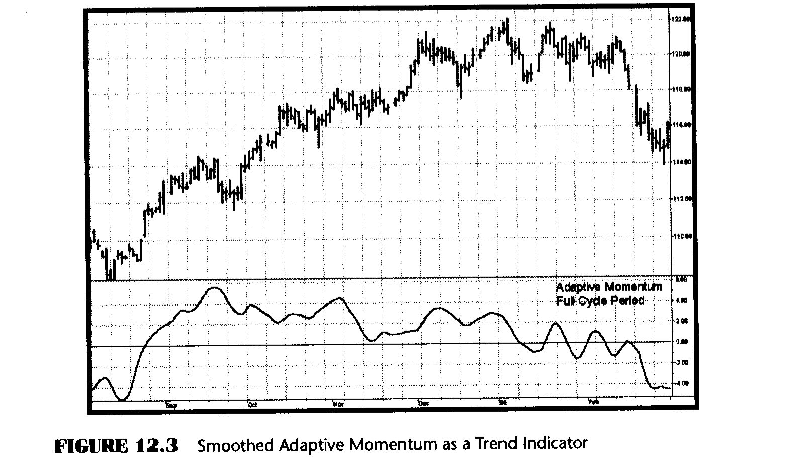

# Chapter 12: Smoothed Adaptive Momentum

> "I have no idea," said Tom thoughtlessly.

At this point, I have developed enough tools for you that you can now start putting them together to create some serious trading strategies. This chapter gives you the beginning of one such strategy. You can use this strategy as a beginning and add your own rules to increase the percentage winners.

In previous chapters, I derived and adapted oscillator-type indicators with the goal of having the indicators move with the cycle component of the market with as little lag as possible. Most technical analysis trend-following techniques don't use oscillators; they use moving averages or some variation thereof. In this chapter I will show you how to use the cycle measurement both as a trend indicator and as a trading system.

The slopes from any given point in a cycle to the same point in the next cycle are exactly the same. It doesn't matter whether the point you select is the peak, the valley, or anyplace in between; the slope between the same points in idealized cycles is zero. If there is a difference in the amplitudes between successive samples, either the cycle period has changed or the market is in a trend. Since the cycle periods morph very slowly from cycle to cycle, it is more likely that the one-cycle momentum is an indication of the trend.

Our approach to forming this trading strategy is to measure the Dominant Cycle period and then use that measured period to take a one-cycle momentum. Momentum functions are notoriously noisy, so I smooth the momentum using the three-pole Super Smoother filter described in the next chapter. It is just that simple. The EasyLanguage and eSignal Formula Script (EFS) codes to compute the Smoothed Adaptive Momentum are shown in Figures 12.1 and 12.2, respectively.

**Figure 12.1: EasyLanguage Code to Compute the Smoothed Adaptive Momentum**

```easylanguage
Inputs: Price((H+L)/2),
        alpha(.07),
        Cutoff(8);

Vars:   Smooth(0),
        Cycle(0),
        Q1(0),
        I1(0),
        DeltaPhase(0),
        MedianDelta(0),
        DC(0),
        InstPeriod(0),
        Period(0),
        Num(0),
        Denom(0),
        a1(0),
        b1(0),
        c1(0),
        coef1(0),
        coef2(0),
        coef3(0),
        coef4(0),
        Filt3(0);

Smooth = (Price + 2*Price[1] + 2*Price[2] + Price[3])/6;

Cycle = (1 - .5*alpha)*(1 - .5*alpha)*(Smooth - 2*Smooth[1] + Smooth[2])
    + 2*(1 - alpha)*Cycle[1] - (1 - alpha)*(1 - alpha)*Cycle[2];

If currentbar < 7 then Cycle = (Price - 2*Price[1] + Price[2]) / 4;

Q1 = (.0962*Cycle + .5769*Cycle[2] - .5769*Cycle[4]
    - .0962*Cycle[6])*(.5 + .08*InstPeriod[1]);

I1 = Cycle[3];

If Q1 <> 0 and Q1[1] <> 0 then DeltaPhase = (I1/Q1
    - I1[1]/Q1[1]) / (1 + I1*I1[1]/(Q1*Q1[1]));

If DeltaPhase < 0.1 then DeltaPhase = 0.1;
If DeltaPhase > 1.1 then DeltaPhase = 1.1;

MedianDelta = Median(DeltaPhase, 5);

If MedianDelta = 0 then DC = 15 else DC = 6.28318 / MedianDelta + .5;

InstPeriod = .33*DC + .67*InstPeriod[1];
Period = .15*InstPeriod + .85*Period[1];

Value1 = Price - Price[IntPortion(Period - 1)];

a1 = expvalue(-3.14159 / Cutoff);
b1 = 2*a1*Cosine(1.738*180 / Cutoff);
c1 = a1*a1;

coef2 = b1 + c1;
coef3 = -(c1 + b1*c1);
coef4 = c1*c1;
coef1 = 1 - coef2 - coef3 - coef4;

Filt3 = coef1*Value1 + coef2*Filt3[1] + coef3*Filt3[2] + coef4*Filt3[3];

If CurrentBar < 4 then Filt3 = Value1;

Plot1(Filt3, "Filt3");
Plot2(0, "Ref");
```

**Figure 12.2: EFS Code to Compute the Smoothed Adaptive Momentum**

```javascript
/************************************************************
Title:   Smoothed Adaptive Momentum Indicator
Coded By: Chris D. Kryza (Divergence Software, Inc.)
Email:   c.kryza@gte.net
Incept:  07/09/2003
Version: 1.0.0

Fix History:
07/09/2003 - Initial Release
1.0.0
************************************************************/

//External Variables
var nBarCount = 0;
var aPriceArray = new Array();
var aSmoothArray = new Array();
var aCycleArray = new Array();
var aDeltaPhase = new Array();
var aPeriod = new Array();
var aInstPeriod = new Array();
var aQ1 = new Array();
var aI1 = new Array();
var aFiltArray = new Array();

//== PreMain function required by eSignal to set things up
function preMain() {
    var x;
    setPriceStudy(false);
    setStudyTitle("Smoothed Adaptive Momentum");
    setCursorLabelName("Filt3", 0);
    setDefaultBarFgColor(Color.blue, 0);
    addBand(0.0, PS_SOLID, 1, Color.black, -10);

    //initialize arrays
    for (x = 0; x < 150; x++) {
        aPriceArray[x] = 0.0;
        aSmoothArray[x] = 0.0;
        aCycleArray[x] = 0.0;
        aQ1[x] = 0.0;
        aI1[x] = 0.0;
        aDeltaPhase[x] = 0.0;
        aPeriod[x] = 0.0;
        aInstPeriod[x] = 0.0;
        aFiltArray[x] = 0.0;
    }
}

//== Main processing function
function main(Alpha, Cutoff) {
    var x;
    var nValue1;
    var nDC;
    var nOffset;
    var nCoef1;
    var nCoef2;
    var nCoef3;
    var nCoef4;
    var nA1;
    var nB1;
    var nC1;
    var nMedianDelta;

    //initialize parameters if necessary
    if (Alpha == null) {
        Alpha = 0.07;
    }
    if (Cutoff == null) {
        Cutoff = 8;
    }

    // study is initializing
    if (getBarState() == BARSTATE_ALLBARS) {
        return null;
    }

    //on each new bar, save array values
    if (getBarState() == BARSTATE_NEWBAR) {
        nBarCount++;
        aPriceArray.pop();
        aPriceArray.unshift(0);
        aSmoothArray.pop();
        aSmoothArray.unshift(0);
        aCycleArray.pop();
        aCycleArray.unshift(0);
        aQ1.pop();
        aQ1.unshift(0);
        aI1.pop();
        aI1.unshift(0);
        aDeltaPhase.pop();
        aDeltaPhase.unshift(0);
        aInstPeriod.pop();
        aInstPeriod.unshift(0);
        aPeriod.pop();
        aPeriod.unshift(0);
        aFiltArray.pop();
        aFiltArray.unshift(0);
    }

    aPriceArray[0] = (high() + low()) / 2;
    aSmoothArray[0] = (aPriceArray[0]
        + 2 * aPriceArray[1] + 2 * aPriceArray[2]
        + aPriceArray[3]) / 6;

    if (nBarCount < 7) {
        aCycleArray[0] = (aPriceArray[0]
            - 2 * aPriceArray[1] + aPriceArray[2]) / 4;
    } else {
        aCycleArray[0] = (1 - 0.5 * Alpha)
            * (1 - 0.5 * Alpha)
            * (aSmoothArray[0] - 2 * aSmoothArray[1]
            + aSmoothArray[2]) + 2 * (1 - Alpha)
            * aCycleArray[1] - (1 - Alpha)
            * (1 - Alpha) * aCycleArray[2];
    }

    aQ1[0] = (0.0962 * aCycleArray[0]
        + 0.5769 * aCycleArray[2]
        - 0.5769 * aCycleArray[4]
        - 0.0962 * aCycleArray[6]) * (0.5 + 0.08
        * aInstPeriod[1]);

    aI1[0] = aCycleArray[3];

    if (aQ1[0] != 0 && aQ1[1] != 0) {
        aDeltaPhase[0] = (aI1[0] / aQ1[0]
            - aI1[1] / aQ1[1]) / (1 + aI1[0]
            * aI1[1] / (aQ1[0] * aQ1[1]));
    }

    if (aDeltaPhase[0] < 0.1) aDeltaPhase[0] = 0.1;
    if (aDeltaPhase[0] > 1.1) aDeltaPhase[0] = 1.1;

    nMedianDelta = Median(5, aDeltaPhase);

    if (nMedianDelta == 0) {
        nDC = 15;
    } else {
        nDC = 6.28318 / nMedianDelta + 0.5;
    }

    aInstPeriod[0] = 0.33 * nDC + 0.67 * aInstPeriod[1];
    aPeriod[0] = 0.15 * aInstPeriod[0] + 0.85 * aPeriod[1];

    nOffset = Math.floor(aPeriod[0]) - 1;
    if (nOffset < 0) nOffset = 0;

    nValue1 = aPriceArray[0] - aPriceArray[nOffset];

    nA1 = Math.exp(-3.14159 / Cutoff);
    nB1 = 2 * nA1 * Math.cos(DegToRad(1.738 * 180 / Cutoff));
    nC1 = nA1 * nA1;

    nCoef2 = nB1 + nC1;
    nCoef3 = -(nC1 + nB1 * nC1);
    nCoef4 = nC1 * nC1;
    nCoef1 = 1 - nCoef2 - nCoef3 - nCoef4;

    if (nBarCount < 4) {
        aFiltArray[0] = nValue1;
    } else {
        aFiltArray[0] = nCoef1 * nValue1
            + nCoef2 * aFiltArray[1]
            + nCoef3 * aFiltArray[2]
            + nCoef4 * aFiltArray[3];
    }

    //return the calculated values
    if (!isNaN(aFiltArray[0])) {
        return (aFiltArray[0]);
    }
}

//== Convert Degrees to Radians
function DegToRad(nValue) {
    var nTmp;
    nTmp = nValue * (Math.PI / 180);
    return (nTmp);
}

//== Convert Radians to Degrees
function RadToDeg(nValue) {
    var nTmp;
    nTmp = nValue * (180 / Math.PI);
    return (nTmp);
}

function Median(nBars, aArray) {
    var aTmp = new Array();
    var nTmp;
    var result;
    var x;

    //transfer elements to temp array
    x = 0;
    while (x < nBars) {
        aTmp[x] = aArray[x++];
    }

    //sort array in asc order
    aTmp.sort(SortAsc);

    //if odd # of elements, just take middle
    if (nBars % 2 != 0) {
        result = aTmp[(nBars + 1) / 2];
        aTmp = null;
        return (result);
    }
    //if even # elements, take average of two middle elements
    else {
        nTmp = nBars / 2;
        result = (aTmp[nTmp] + aTmp[nTmp + 1]) / 2;
        aTmp = null;
        return (result);
    }
}

function SortAsc(arg1, arg2) {
    if (arg1 < arg2) {
        return (-1);
    } else {
        return (1);
    }
}
```

Figure 12.3 suggests that the uptrend starts when the indicator crosses up through the zero line and a downtrend starts when the indicator crosses down through the zero line.



I converted the Smoothed Adaptive Momentum Indicator to an automatic strategy by writing the trading rules to buy each time the filter crosses up through zero and to sell short each time the filter crosses down through zero. I also added a money management stop. This simple but elegant trend-following automatic trading strategy produced the results shown in Table 12.1. The EasyLanguage and EFS codes for the Smoothed Adaptive Momentum strategy are in Figures 12.4 and 12.5, respectively.

| | Profit | Number | Percent | Profit Factor | Max Drawdown |
|---|---|---|---|---|---|
| JY (9/81-3/03) | $160,950 | 277 | 39.7% | 2.01 | ($13,450) |
| SF (6/76-3/03) | $157,337 | 523 | 38.8% | 1.64 | ($13,587) |

*Table 12.1: Sample Trading Results Using the Smoothed Adaptive Momentum Trading Strategy*

**Figure 12.4: EasyLanguage Code for the Smoothed Adaptive Momentum Strategy**

```easylanguage
Inputs: Price((H+L)/2),
        alpha(.07),
        Cutoff(8);

Vars:   Smooth(0),
        Cycle(0),
        Q1(0),
        I1(0),
        DeltaPhase(0),
        MedianDelta(0),
        DC(0),
        InstPeriod(0),
        Period(0),
        Num(0),
        Denom(0),
        a1(0),
        b1(0),
        c1(0),
        coef1(0),
        coef2(0),
        coef3(0),
        coef4(0),
        Filt3(0);

Smooth = (Price + 2*Price[1] + 2*Price[2] + Price[3])/6;

Cycle = (1 - .5*alpha)*(1 - .5*alpha)*(Smooth - 2*Smooth[1] + Smooth[2])
    + 2*(1 - alpha)*Cycle[1] - (1 - alpha)*(1 - alpha)*Cycle[2];

If currentbar < 7 then Cycle = (Price - 2*Price[1] + Price[2]) / 4;

Q1 = (.0962*Cycle + .5769*Cycle[2] - .5769*Cycle[4]
    - .0962*Cycle[6])*(.5 + .08*InstPeriod[1]);

I1 = Cycle[3];

If Q1 <> 0 and Q1[1] <> 0 then DeltaPhase = (I1/Q1
    - I1[1]/Q1[1]) / (1 + I1*I1[1]/(Q1*Q1[1]));

If DeltaPhase < 0.1 then DeltaPhase = 0.1;
If DeltaPhase > 1.1 then DeltaPhase = 1.1;

MedianDelta = Median(DeltaPhase, 5);

If MedianDelta = 0 then DC = 15 else DC = 6.28318 / MedianDelta + .5;

InstPeriod = .33*DC + .67*InstPeriod[1];
Period = .15*InstPeriod + .85*Period[1];

Value1 = Price - Price[IntPortion(Period - 1)];

a1 = expvalue(-3.14159 / Cutoff);
b1 = 2*a1*Cosine(1.738*180 / Cutoff);
c1 = a1*a1;

coef2 = b1 + c1;
coef3 = -(c1 + b1*c1);
coef4 = c1*c1;
coef1 = 1 - coef2 - coef3 - coef4;

Filt3 = coef1*Value1 + coef2*Filt3[1] + coef3*Filt3[2] + coef4*Filt3[3];

If CurrentBar < 4 then Filt3 = Value1;

If Filt3 Crosses Over 0 then Buy Next Bar on Open;
If Filt3 Crosses Under 0 then Sell Short Next Bar on Open;
```

**Figure 12.5: EFS for the Smoothed Adaptive Momentum Strategy**

```javascript
/************************************************************
Title:   Smoothed Adaptive Momentum Trading Strategy
Coded By: Chris D. Kryza (Divergence Software, Inc.)
Email:   c.kryza@gte.net
Incept:  07/09/2003
Version: 1.0.0

Fix History:
07/09/2003 - Initial Release
1.0.0
************************************************************/

//External Variables
var nBarCount = 0;
var aPriceArray = new Array();
var aSmoothArray = new Array();
var aCycleArray = new Array();
var aDeltaPhase = new Array();
var aPeriod = new Array();
var aInstPeriod = new Array();
var aQ1 = new Array();
var aI1 = new Array();
var aFiltArray = new Array();
var nStatus = 0;
var nEntryPrice = 0;
var nStop = 0;
var nPVal = 0;
var nSVal = 0;
var grID = 0;

//== PreMain function required by eSignal to set things up
function preMain() {
    var x;
    setPriceStudy(true);
    setStudyTitle("Smoothed Adaptive Momentum Strategy");
    setShowCursorLabel(false);

    //initialize arrays
    for (x = 0; x < 150; x++) {
        aPriceArray[x] = 0.0;
        aSmoothArray[x] = 0.0;
        aCycleArray[x] = 0.0;
        aQ1[x] = 0.0;
        aI1[x] = 0.0;
        aDeltaPhase[x] = 0.0;
        aPeriod[x] = 0.0;
        aInstPeriod[x] = 0.0;
        aFiltArray[x] = 0.0;
    }
}

//== Main processing function
function main(Alpha, Cutoff, StopAmt, PointValue) {
    var x;
    var nValue1;
    var nDC;
    var nOffset;
    var nCoef1;
    var nCoef2;
    var nCoef3;
    var nCoef4;
    var nA1;
    var nB1;
    var nC1;
    var nMedianDelta;

    //initialize parameters if necessary
    if (Alpha == null) {
        Alpha = 0.07;
    }
    if (Cutoff == null) {
        Cutoff = 8;
    }
    if (StopAmt == null) {
        StopAmt = 1000.0;
    }
    if (PointValue == null) {
        PointValue = 50;
    }

    nSVal = StopAmt;
    nPVal = PointValue;

    // study is initializing
    if (getBarState() == BARSTATE_ALLBARS) {
        return null;
    }

    //on each new bar, save array values
    if (getBarState() == BARSTATE_NEWBAR) {
        nBarCount++;
        aPriceArray.pop();
        aPriceArray.unshift(0);
        aSmoothArray.pop();
        aSmoothArray.unshift(0);
        aCycleArray.pop();
        aCycleArray.unshift(0);
        aQ1.pop();
        aQ1.unshift(0);
        aI1.pop();
        aI1.unshift(0);
        aDeltaPhase.pop();
        aDeltaPhase.unshift(0);
        aInstPeriod.pop();
        aInstPeriod.unshift(0);
        aPeriod.pop();
        aPeriod.unshift(0);
        aFiltArray.pop();
        aFiltArray.unshift(0);
    }

    aPriceArray[0] = (high() + low()) / 2;
    aSmoothArray[0] = (aPriceArray[0]
        + 2 * aPriceArray[1] + 2 * aPriceArray[2]
        + aPriceArray[3]) / 6;

    if (nBarCount < 7) {
        aCycleArray[0] = (aPriceArray[0]
            - 2 * aPriceArray[1] + aPriceArray[2]) / 4;
    } else {
        aCycleArray[0] = (1 - 0.5 * Alpha)
            * (1 - 0.5 * Alpha)
            * (aSmoothArray[0] - 2 * aSmoothArray[1]
            + aSmoothArray[2]) + 2 * (1 - Alpha)
            * aCycleArray[1] - (1 - Alpha)
            * (1 - Alpha) * aCycleArray[2];
    }

    aQ1[0] = (0.0962 * aCycleArray[0]
        + 0.5769 * aCycleArray[2]
        - 0.5769 * aCycleArray[4]
        - 0.0962 * aCycleArray[6]) * (0.5 + 0.08
        * aInstPeriod[1]);

    aI1[0] = aCycleArray[3];

    if (aQ1[0] != 0 && aQ1[1] != 0) {
        aDeltaPhase[0] = (aI1[0] / aQ1[0]
            - aI1[1] / aQ1[1]) / (1
            + aI1[0] * aI1[1] / (aQ1[0] * aQ1[1]));
    }

    if (aDeltaPhase[0] < 0.1) aDeltaPhase[0] = 0.1;
    if (aDeltaPhase[0] > 1.1) aDeltaPhase[0] = 1.1;

    nMedianDelta = Median(5, aDeltaPhase);

    if (nMedianDelta == 0) {
        nDC = 15;
    } else {
        nDC = 6.28318 / nMedianDelta + 0.5;
    }

    aInstPeriod[0] = 0.33 * nDC + 0.67 * aInstPeriod[1];
    aPeriod[0] = 0.15 * aInstPeriod[0] + 0.85 * aPeriod[1];

    nOffset = Math.floor(aPeriod[0]) - 1;
    if (nOffset < 0) nOffset = 0;

    nValue1 = aPriceArray[0] - aPriceArray[nOffset];

    nA1 = Math.exp(-3.14159 / Cutoff);
    nB1 = 2 * nA1 * Math.cos(DegToRad(1.738 * 180 / Cutoff));
    nC1 = nA1 * nA1;

    nCoef2 = nB1 + nC1;
    nCoef3 = -(nC1 + nB1 * nC1);
    nCoef4 = nC1 * nC1;
    nCoef1 = 1 - nCoef2 - nCoef3 - nCoef4;

    if (nBarCount < 4) {
        aFiltArray[0] = nValue1;
    } else {
        aFiltArray[0] = nCoef1 * nValue1
            + nCoef2 * aFiltArray[1]
            + nCoef3 * aFiltArray[2]
            + nCoef4 * aFiltArray[3];
    }

    // if currently flat, look for a trade entry
    if (nStatus == 0) {
        if (nStatus <= 0 && aFiltArray[0] > 0 && aFiltArray[1] <= 0) {
            goLong();
        } else if (nStatus >= 0 && aFiltArray[0] < 0 && aFiltArray[1] >= 0) {
            goShort();
        }
    } else {
        // in a long trade
        if (nStatus == 1) {
            // if stop hit, sell long
            if (low() <= nStop) {
                if (open() <= nStop) {
                    closeLong(open());
                } else {
                    closeLong(nStop);
                }
            }
            // check for reversal signal
            else if (aFiltArray[0] < 0 && aFiltArray[1] >= 0) {
                goShort();
            }
        }
        // in a short trade
        else if (nStatus == -1) {
            // if stop hit, cover short
            if (high() >= nStop) {
                if (open() >= nStop) {
                    closeShort(open());
                } else {
                    closeShort(nStop);
                }
            }
            // check for reversal signal
            else if (aFiltArray[0] > 0 && aFiltArray[1] <= 0) {
                goLong();
            }
        }
    }
}

//== gID function assigns unique identifier to graphic/text routines
function gID() {
    grID++;
    return (grID);
}

//== Convert Degrees to Radians
function DegToRad(nValue) {
    var nTmp;
    nTmp = nValue * (Math.PI / 180);
    return (nTmp);
}

//== Convert Radians to Degrees
function RadToDeg(nValue) {
    var nTmp;
    nTmp = nValue * (180 / Math.PI);
    return (nTmp);
}

function Median(nBars, aArray) {
    var aTmp = new Array();
    var nTmp;
    var result;
    var x;

    //transfer elements to temp array
    x = 0;
    while (x < nBars) {
        aTmp[x] = aArray[x++];
    }

    //sort array in asc order
    aTmp.sort(SortAsc);

    //if odd # of elements, just take middle
    if (nBars % 2 != 0) {
        result = aTmp[(nBars + 1) / 2];
        aTmp = null;
        return (result);
    }
    //if even # elements, take average of two middle elements
    else {
        nTmp = nBars / 2;
        result = (aTmp[nTmp] + aTmp[nTmp + 1]) / 2;
        aTmp = null;
        return (result);
    }
}

function SortAsc(arg1, arg2) {
    if (arg1 < arg2) {
        return (-1);
    } else {
        return (1);
    }
}

//enter a short trade
function goShort() {
    drawShapeRelative(1, high(1), Shape.DOWNARROW, "",
        Color.maroon, Shape.ONTOP | Shape.BOTTOM, gID());
    Strategy.doShort("Short", Strategy.MARKET,
        Strategy.NEXTBAR, Strategy.DEFAULT);
    nEntryPrice = open(1);
    nStop = (nEntryPrice + nSVal / nPVal);
    nStatus = -1;
}

//close a short trade
function closeShort(nPrice) {
    drawShapeRelative(0, low(), Shape.UPARROW, "",
        Color.blue, Shape.ONTOP | Shape.BOTTOM, gID());
    Strategy.doCover("Short Stopped Out",
        Strategy.STOP, Strategy.THISBAR, Strategy.ALL,
        nPrice);
    nStatus = 0;
}

//enter a long trade
function goLong() {
    drawShapeRelative(1, low(1), Shape.UPARROW, "",
        Color.lime, Shape.ONTOP | Shape.TOP, gID());
    Strategy.doLong("Long", Strategy.MARKET,
        Strategy.NEXTBAR, Strategy.DEFAULT);
    nEntryPrice = open(1);
    nStop = (nEntryPrice - nSVal / nPVal);
    nStatus = 1;
}

//close a long trade
function closeLong(nPrice) {
    drawShapeRelative(0, high(), Shape.DOWNARROW, "",
        Color.blue, Shape.ONTOP | Shape.TOP, gID());
    Strategy.doSell("Long Stopped Out",
        Strategy.STOP, Strategy.THISBAR,
        Strategy.ALL, nPrice);
    nStatus = 0;
}
```

## Key Points to Remember

- It really does matter if you measure the Dominant Cycle.
- The trend component is measured by taking the momentum across one full Dominant Cycle.
