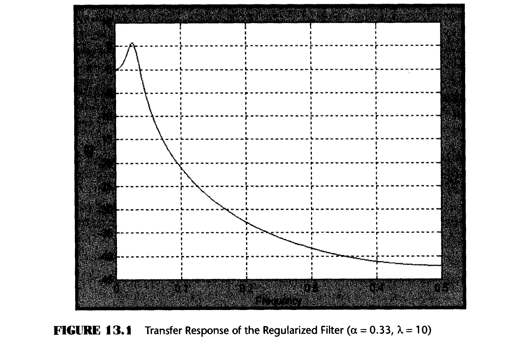
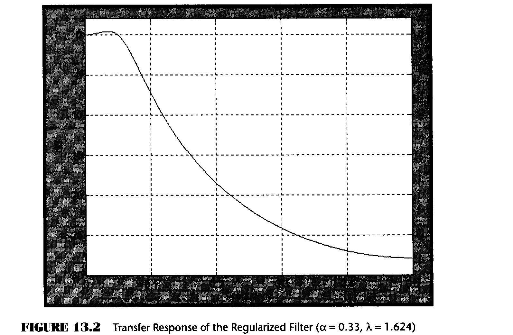
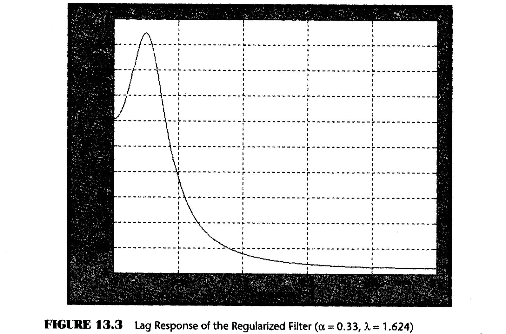
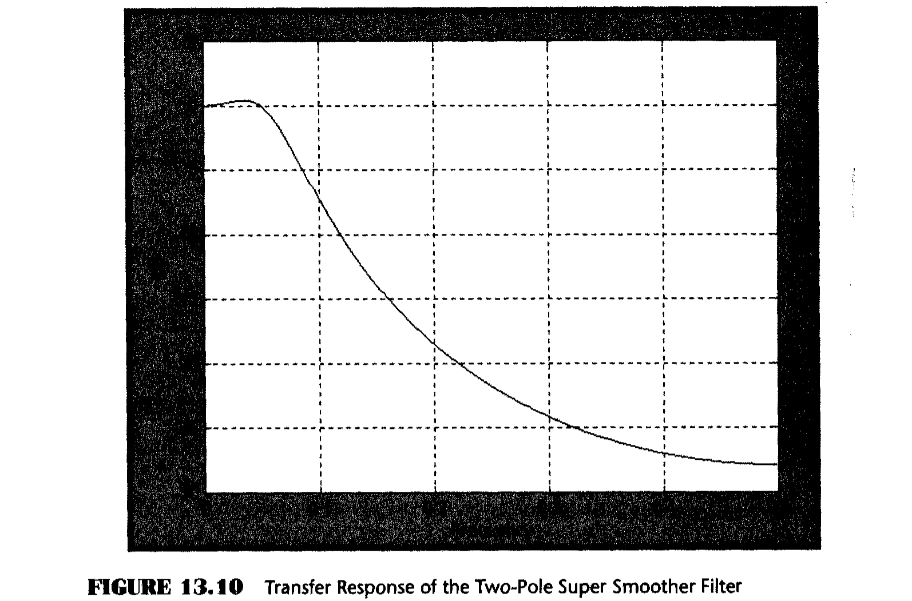
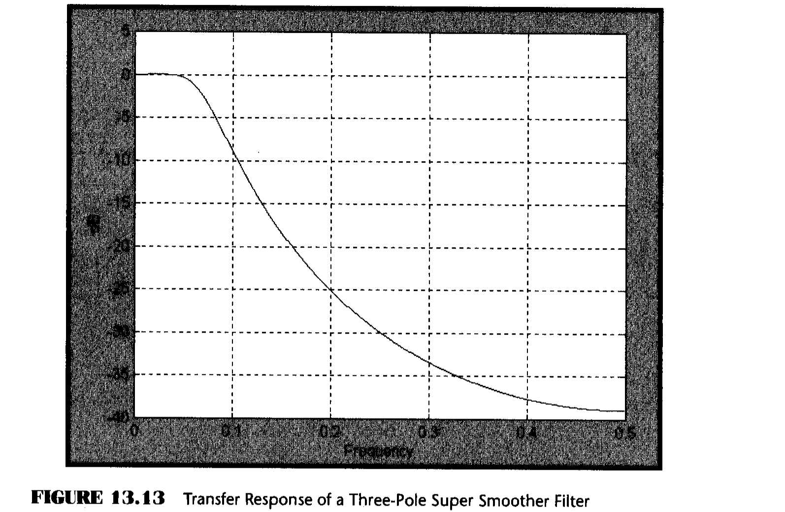

# Chapter 13: Super Smoothers

> "That evens it out," said Tom smoothly.

A method of smoothing called regularization was introduced to traders by Dr. Chris Satchwell. He starts with an exponential moving average as

$$F = \alpha \cdot G + (1 - \alpha) \cdot F[1] \tag{13.1}$$

Where $F[1]$ means the value of $F$ one sample ago. This is EasyLanguage notation. If Equation 13.1 is collected on one side of the equation and squared as in Equation 13.2, and differentiation with respect to $F$ is performed, then its minimum coincides with Equation 13.1. This shows that the exponential moving average can be derived by minimizing an associated function. In Equation 13.2, $D$ denotes differentiation.

$$D\{F - \alpha \cdot G - (1 - \alpha) \cdot F[1]\}^2 \cdot D\} = 0 \tag{13.2}$$

A least-squares component of an error function can be derived from the argument of the numerator of Equation 13.2 and a penalty term for the curvature can be introduced to achieve regularization. The penalty term comes from the mathematics of finite differences, where the second part of Equation 13.3 is based on the second derivative of $F$ with respect to time.

$$E = (F - \alpha \cdot G - (1 - \alpha) \cdot F[1])^2 + \lambda \cdot (F - 2 \cdot F[1] + F[2])^2 \tag{13.3}$$

Differentiating Equation 13.3 with respect to $F$ and equating to 0 gives

$$2 \cdot (F - \alpha \cdot G - (1 - \alpha) \cdot F[1]) + 2 \cdot \lambda \cdot (F - 2 \cdot F[1] + F[2]) = 0 \tag{13.4}$$

Rearranging, Equation 13.4 is written more conveniently as

$$F = \frac{\alpha \cdot G + (1 - \alpha + 2 \cdot \lambda) \cdot F[1] - \lambda \cdot F[2]}{1 + \lambda} \tag{13.5}$$

There are no explicit constraints on the value of the regularization constant $\lambda$. However, just a small amount of experimentation shows that unreasonable results can be obtained if the regularization constant is too large. For example, Figure 13.1 shows the transfer response of the Regularized filter for $\alpha = 0.33$ and $\lambda = 10$. In this case, the filter has more than a 6-dB gain at a frequency of 0.03 cycles per day (a 33-bar cycle). That means that the 33-bar period components in the input waveform will be amplified rather than smoothed.



It is ideal if the frequency components we want to pass through the filter are not amplified at all and the frequency components we want to reject are attenuated by the filter. The ideal goal is approximately met in a Regularized filter if the relationship between alpha and lambda is maintained as

$$\lambda = e^{0.16 / \alpha} \tag{13.6}$$

For example, if $\alpha = 0.33$, then the ideal value of lambda is 1.624. The filter transfer response for this pair of parameters is shown in Figure 13.2.



The frequency response is almost flat from zero frequency to 0.05 cycles per day. From that point on, the higher-frequency components are increasingly attenuated.

One amazing characteristic of Regularized filters is that their zero-frequency lag is determined solely by the alpha parameter, regardless of the value of lambda that is used. An example of the Regularized filter lag response is shown in Figure 13.3 for the ideal value of lambda. The relationship of the zero-frequency lag and alpha in an exponential moving average is

$$\alpha = \frac{1}{Lag + 1} \tag{13.7}$$

It therefore follows that if the zero-frequency lag is 2, then $\alpha = 0.33$ and vice versa.



Recalling from Chapter 2 that the transfer response of an exponential moving average is expressed as

$$A(Z) = \frac{Output}{Input} = \frac{\alpha}{1 - (1 - \alpha) \cdot Z^{-1}} \tag{13.8}$$

If the delay factor $Z^{-1}$ is $1/(1 - \alpha)$, the denominator goes to 0 and thus the transfer response goes to infinity. This is called a pole of the transfer response. Don't worry: Since $\alpha$ must be less than unity, and since the delay can only have integer values, the pole condition is never attained---rather it is a descriptor of the transfer response. In this case, the denominator is a first-order polynomial of $Z^{-1}$.

The Regularized filter transfer response is written as

$$B(Z) = \frac{Output}{Input} = \frac{\frac{1}{1 + \lambda}}{1 - \frac{1 - \alpha + 2\lambda}{1 + \lambda} Z^{-1} + \frac{\lambda}{1 + \lambda} Z^{-2}} \tag{13.9}$$

Equation 13.9 shows that the transfer response now has a second-order polynomial in the denominator. From the fundamental theorem of algebra, we know that an Nth-order polynomial can be factored into N roots. Roots of a polynomial are those values of the variable where the polynomial goes to 0. Therefore, an Nth-ordered polynomial produces N poles in the transfer response of a filter. The more poles a filter has, the sharper its attenuation curve becomes with respect to frequency. Visualize the transfer response as a circus tent; the filtering you get is like rolling a marble off the tent without actually getting to a tent pole. The more poles you have in the tent, the faster you can make the marble roll. The fact that the Regularized filter has one more pole than an exponential moving average is why it has superior smoothing.

The flat transfer response of an idealized Regularized filter and its being derived by taking multiple derivatives are reminiscent of Butterworth filters. Butterworth filters are analog filters (as opposed to digital filters) that are called maximally flat because the first N derivatives of an Nth-ordered Butterworth filter are 0 at zero frequency.

## Butterworth Digital Filters

Years ago I translated analog Butterworth filters to their digital approximations. The transfer response is characterized by a single variable---the cutoff frequency. The cutoff frequency is that frequency where the input is attenuated by 3 dB. Below the cutoff frequency, the input frequency components are passed to the output; above the cutoff frequency, the input frequency components are rejected to the extent possible by the filter characteristics. Since traders are more comfortable with period, which is the reciprocal of frequency, the equations for the Butterworth digital filters are characterized in terms of the cutoff period.

The equations for a two-pole Butterworth digital filter, in EasyLanguage notation, are

```
a = ExpValue(-1.414 * 3.14159 / Cutoff);
b = 2 * a * Cosine(1.414 * 180 / Cutoff);
Butter = ((1 - b + a * a) / 4) * (Price + 2 * Price[1] + Price[2])    (13.10)
       + b * Butter[1] - a * a * Butter[2];
```

The EasyLanguage and eSignal Formula Script (EFS) codes to implement the two-pole Butterworth digital filter are given in Figures 13.4 and 13.5, respectively.

It may be more convenient for some readers to implement the filter as a function of a given Cutoff Period. Table 13.1 is provided for this case. In a prior work, I have also given tables for Gaussian filters.

As opposed to the Regularized filter, the order of Butterworth filters can be increased indefinitely to increase the sharpness of the filter rejection. For traders, this quickly reaches the point of diminishing returns because increasing the number of poles in the filter means the lag of the filter is also increased. A three-pole filter gives just about the limit of tolerable lag for a selected cutoff period. The equations for a three-pole Butterworth filter, in EasyLanguage format, are

```
a = ExpValue(-3.14159 / Cutoff);
b = 2 * a * Cosine(1.738 * 180 / Cutoff);
c = a * a;
Butter = ((1 - b + c) * (1 - c) / 8) * (Price + 3 * Price[1]         (13.11)
       + 3 * Price[2] + Price[3])
       + (b + c) * Butter[1] - (c + b * c)
       * Butter[2] + c * c * Butter[3];
```

The EasyLanguage and EFS codes to implement the three-pole Butterworth digital filter are given in Figures 13.6 and 13.7, respectively.

Table 13.2 lists the coefficients of three-pole Butterworth filters as a function of their cutoff period. It is provided as a convenience for readers who may want only to quickly access the coefficient values rather than compute them.

**Figure 13.4: EasyLanguage Code to Compute the Two-Pole Butterworth Filter**

```easylanguage
{*********************************************************
  Two Pole Butterworth Filter
*********************************************************}
Inputs: Price((H+L)/2),
        Period(15);

Vars:   a1(0),
        b1(0),
        coef1(0),
        coef2(0),
        coef3(0),
        Butter(0);

a1 = expvalue(-1.414*3.14159 / Period);
b1 = 2*a1*Cosine(1.414*180 / Period);
coef2 = b1;
coef3 = -a1*a1;
coef1 = (1 - b1 + a1*a1) / 4;

Butter = coef1*(Price + 2*Price[1] + Price[2])
       + coef2*Butter[1] + coef3*Butter[2];

If CurrentBar < 3 then Butter = Price;

Plot1(Butter, "Butter");
```

**Figure 13.5: EFS Code for the Two-Pole Butterworth Filter**

```javascript
/***********************************************************
  Title:        2 Pole Butterworth Filter
  Coded By:     Chris D. Kryza (Divergence Software, Inc.)
  Email:        c.kryza@gte.net
  Incept:       07/09/2003
  Version:      1.0.0
  Fix History:
    07/09/2003 - Initial Release
                 1.0.0
***********************************************************/

//External Variables
var nPrice = 0;
var nBarCount = 0;
var aPriceArray = new Array();
var aButterArray = new Array();

//== PreMain function required by eSignal to set things up
function preMain() {
    var x;
    setPriceStudy(true);
    setStudyTitle("2-Pole Butterworth");
    setCursorLabelName("Butter", 0);
    setDefaultBarFgColor(Color.blue, 0);
    //initialize arrays
    for (x = 0; x < 10; x++) {
        aPriceArray[x] = 0.0;
        aButterArray[x] = 0.0;
    }
}

//== Main processing function
function main(Period) {
    var x;
    var nA1;
    var nB1;
    var nCoef1;
    var nCoef2;
    var nCoef3;

    //initialize parameters if necessary
    if (Period == null) {
        Period = 15;
    }

    // study is initializing
    if (getBarState() == BARSTATE_ALLBARS) {
        return null;
    }

    //on each new bar, save array values
    if (getBarState() == BARSTATE_NEWBAR) {
        nBarCount++;
        aPriceArray.pop();
        aPriceArray.unshift(0);
        aButterArray.pop();
        aButterArray.unshift(0);
    }

    nPrice = (high() + low()) / 2;
    aPriceArray[0] = nPrice;

    nA1 = Math.exp(-1.414 * 3.14159 / Period);
    nB1 = 2 * nA1 * Math.cos(DegToRad(1.414 * 180 / Period));

    nCoef2 = nB1;
    nCoef3 = -nA1 * nA1;
    nCoef1 = (1 - nB1 + nA1 * nA1) / 4;

    if (nBarCount < 3) {
        aButterArray[0] = aPriceArray[0];
    } else {
        aButterArray[0] = nCoef1 * (aPriceArray[0]
            + 2 * aPriceArray[1] + aPriceArray[2])
            + nCoef2 * aButterArray[1]
            + nCoef3 * aButterArray[2];
    }

    //return the calculated values
    if (!isNaN(aButterArray[0])) {
        return (aButterArray[0]);
    }
}

//== Convert Degrees to Radians
function DegToRad(nValue) {
    var nTmp;
    nTmp = nValue * (Math.PI / 180);
    return (nTmp);
}
```

### Table 13.1: Two-Pole Butterworth Filter Coefficients

`Y = A[0] * X[0] + A[1] * X[1] + A[2] * X[2] + B[1] * Y[1] + B[2] * Y[2]`

| Cutoff Period | A[0] | A[1] | A[2] | B[1] | B[2] |
|:---:|:---:|:---:|:---:|:---:|:---:|
| 2 | 0.285784 | 0.571568 | 0.285784 | -0.131366 | -0.011770 |
| 4 | 0.203973 | 0.407946 | 0.203973 | 0.292597 | -0.108489 |
| 6 | 0.130825 | 0.261650 | 0.130825 | 0.704171 | -0.227470 |
| 8 | 0.088501 | 0.177002 | 0.088501 | 0.975372 | -0.329377 |
| 10 | 0.063284 | 0.126567 | 0.063284 | 1.158161 | -0.411296 |
| 12 | 0.047322 | 0.094643 | 0.047322 | 1.287652 | -0.476938 |
| 14 | 0.036654 | 0.073308 | 0.036654 | 1.383531 | -0.530147 |
| 16 | 0.029198 | 0.058397 | 0.029198 | 1.457120 | -0.573914 |
| 18 | 0.023793 | 0.047586 | 0.023793 | 1.515266 | -0.610438 |
| 20 | 0.019754 | 0.039507 | 0.019754 | 1.562309 | -0.641324 |
| 22 | 0.016658 | 0.033317 | 0.016658 | 1.601119 | -0.667753 |
| 24 | 0.014235 | 0.028470 | 0.014235 | 1.633667 | -0.690607 |
| 26 | 0.012303 | 0.024607 | 0.012303 | 1.661342 | -0.710555 |
| 28 | 0.010739 | 0.021477 | 0.010739 | 1.685157 | -0.728112 |
| 30 | 0.009454 | 0.018908 | 0.009454 | 1.705862 | -0.743678 |
| 32 | 0.008386 | 0.016773 | 0.008386 | 1.724025 | -0.757571 |
| 34 | 0.007490 | 0.014980 | 0.007490 | 1.740086 | -0.770045 |
| 36 | 0.006729 | 0.013459 | 0.006729 | 1.754388 | -0.781305 |
| 38 | 0.006079 | 0.012158 | 0.006079 | 1.767204 | -0.791520 |
| 40 | 0.005518 | 0.011037 | 0.005518 | 1.778753 | -0.800827 |

**Figure 13.6: EasyLanguage Code to Compute the Three-Pole Butterworth Filter**

```easylanguage
{*********************************************************
  Three Pole Butterworth Filter
*********************************************************}
Inputs: Price((H+L)/2),
        Period(15);

Vars:   a1(0),
        b1(0),
        c1(0),
        coef1(0),
        coef2(0),
        coef3(0),
        coef4(0),
        Butter(0);

a1 = expvalue(-3.14159 / Period);
b1 = 2*a1*Cosine(1.738*180 / Period);
c1 = a1*a1;

coef2 = b1 + c1;
coef3 = -(c1 + b1*c1);
coef4 = c1*c1;
coef1 = (1 - b1 + c1)*(1 - c1) / 8;

Butter = coef1*(Price + 3*Price[1] + 3*Price[2]
       + Price[3]) + coef2*Butter[1] + coef3*Butter[2]
       + coef4*Butter[3];

If CurrentBar < 4 then Butter = Price;

Plot1(Butter, "Butter");
```

**Figure 13.7: EFS Code to Compute the Three-Pole Butterworth Filter**

```javascript
/***********************************************************
  Title:        3 Pole Butterworth Filter
  Coded By:     Chris D. Kryza (Divergence Software, Inc.)
  Email:        c.kryza@gte.net
  Incept:       07/09/2003
  Version:      1.0.0
  Fix History:
    07/09/2003 - Initial Release
                 1.0.0
***********************************************************/

//External Variables
var nPrice = 0;
var nBarCount = 0;
var aPriceArray = new Array();
var aButterArray = new Array();

//== PreMain function required by eSignal to set things up
function preMain() {
    var x;
    setPriceStudy(true);
    setStudyTitle("3-Pole Butterworth");
    setCursorLabelName("Butter", 0);
    setDefaultBarFgColor(Color.blue, 0);
    //initialize arrays
    for (x = 0; x < 10; x++) {
        aPriceArray[x] = 0.0;
        aButterArray[x] = 0.0;
    }
}

//== Main processing function
function main(Period) {
    var x;
    var nCoef1;
    var nCoef2;
    var nCoef3;
    var nCoef4;
    var nA1;
    var nB1;
    var nC1;

    //initialize parameters if necessary
    if (Period == null) {
        Period = 15;
    }

    // study is initializing
    if (getBarState() == BARSTATE_ALLBARS) {
        return null;
    }

    //on each new bar, save array values
    if (getBarState() == BARSTATE_NEWBAR) {
        nBarCount++;
        aPriceArray.pop();
        aPriceArray.unshift(0);
        aButterArray.pop();
        aButterArray.unshift(0);
    }

    nPrice = (high() + low()) / 2;
    aPriceArray[0] = nPrice;

    nA1 = Math.exp(-3.14159 / Period);
    nB1 = 2 * nA1 * Math.cos(DegToRad(1.738 * 180 / Period));
    nC1 = nA1 * nA1;

    nCoef2 = nB1 + nC1;
    nCoef3 = -(nC1 + nB1 * nC1);
    nCoef4 = nC1 * nC1;
    nCoef1 = (1 - nB1 + nC1) * (1 - nC1) / 8;

    if (nBarCount < 4) {
        aButterArray[0] = aPriceArray[0];
    } else {
        aButterArray[0] = nCoef1
            * (aPriceArray[0]
            + 3 * aPriceArray[1] + 3 * aPriceArray[2]
            + aPriceArray[3])
            + nCoef2 * aButterArray[1]
            + nCoef3 * aButterArray[2]
            + nCoef4 * aButterArray[3];
    }

    //return the calculated values
    if (!isNaN(aButterArray[0])) {
        return (aButterArray[0]);
    }
}

//== Convert Degrees to Radians
function DegToRad(nValue) {
    var nTmp;
    nTmp = nValue * (Math.PI / 180);
    return (nTmp);
}
```

### Table 13.2: Three-Pole Butterworth Filter Coefficients

`Y = A[0] * X[0] + A[1] * X[1] + A[2] * X[2] + A[3] * X[3] + B[1] * Y[1] + B[2] * Y[2] + B[3] * Y[3]`

| Cutoff Period | A[0] | A[1] | A[2] | A[3] | B[1] | B[2] | B[3] |
|:---:|:---:|:---:|:---:|:---:|:---:|:---:|:---:|
| 2 | 0.170149 | 0.510448 | 0.510448 | 0.170149 | -0.336246 | -0.026816 | 0.001867 |
| 4 | 0.100733 | 0.302200 | 0.302200 | 0.100733 | 0.398405 | -0.247486 | 0.043214 |
| 6 | 0.050373 | 0.151118 | 0.151118 | 0.050373 | 1.080990 | -0.607116 | 0.123145 |
| 8 | 0.027610 | 0.082830 | 0.082830 | 0.027610 | 1.505892 | -0.934652 | 0.207880 |
| 10 | 0.016541 | 0.049622 | 0.049622 | 0.016541 | 1.783327 | -1.200263 | 0.284610 |
| 12 | 0.010629 | 0.031887 | 0.031887 | 0.010629 | 1.976163 | -1.412114 | 0.350920 |
| 14 | 0.007213 | 0.021640 | 0.021640 | 0.007213 | 2.117205 | -1.582459 | 0.407548 |
| 16 | 0.005111 | 0.015334 | 0.015334 | 0.005111 | 2.224560 | -1.721388 | 0.455938 |
| 18 | 0.003750 | 0.011250 | 0.011250 | 0.003750 | 2.308883 | -1.836396 | 0.497514 |
| 20 | 0.002831 | 0.008492 | 0.008492 | 0.002831 | 2.376806 | -1.932941 | 0.533488 |
| 22 | 0.002188 | 0.006565 | 0.006565 | 0.002188 | 2.432658 | -2.015013 | 0.564848 |
| 24 | 0.001726 | 0.005179 | 0.005179 | 0.001726 | 2.479376 | -2.085571 | 0.592385 |
| 26 | 0.001385 | 0.004156 | 0.004156 | 0.001385 | 2.519020 | -2.146834 | 0.616731 |
| 28 | 0.001128 | 0.003385 | 0.003385 | 0.001128 | 2.553078 | -2.200500 | 0.638395 |
| 30 | 0.000931 | 0.002794 | 0.002794 | 0.000931 | 2.582648 | -2.247883 | 0.657784 |
| 32 | 0.000778 | 0.002333 | 0.002333 | 0.000778 | 2.608560 | -2.290012 | 0.675232 |
| 34 | 0.000656 | 0.001967 | 0.001967 | 0.000656 | 2.631451 | -2.327708 | 0.691011 |
| 36 | 0.000558 | 0.001674 | 0.001674 | 0.000558 | 2.651819 | -2.361631 | 0.705347 |
| 38 | 0.000479 | 0.001437 | 0.001437 | 0.000479 | 2.670059 | -2.392315 | 0.718425 |
| 40 | 0.000414 | 0.001242 | 0.001242 | 0.000414 | 2.686486 | -2.420202 | 0.730403 |

## Multipole Smoothing Filters

The transfer responses of Butterworth filters have polynomials in both the numerator and denominator. For example, the transfer response of a two-pole Butterworth filter is

$$H(Z) = \frac{Output}{Input} = \frac{A[0] + A[1]Z^{-1} + A[2]Z^{-2}}{1 + B[1]Z^{-1} + B[2]Z^{-2}} \tag{13.12}$$

There is a polynomial in the numerator as well as the denominator. The significance of the polynomial in the numerator is that it represents the finite impulse response (FIR) part of the filter. This part is like a simple moving average. The denominator forms the iterative part of the filter calculation and is the infinite impulse response (IIR) part of the filter. The FIR part of the filter sharpens the filter rejection response, but it also contributes to lag in the response. Recognizing that the parts of a Butterworth filter are separable, I form the multipole super smoothing filters by simply deleting the polynomial in the numerator. Since the transfer response must be unity when $Z^{-1} = 1$, I replace the polynomial with the fixed coefficient $C[0] = 1 - B[1] + B[2]$. The EasyLanguage and EFS codes for the two-pole Super Smoother are given in Figures 13.8 and 13.9, respectively. The coefficients are in Table 13.3.

The transfer response of the two-pole Super Smoother is shown in Figure 13.10. Note that it is almost identical to the transfer response of the Regularized filter shown in Figure 13.2. The difference between the two is that the characteristics of the Super Smoother are determined by a single parameter and the flatness of the passband response is guaranteed.

The order of Super Smoother filters can be increased indefinitely to increase the sharpness of the filter rejection, just as with Butterworth filters. The EasyLanguage and EFS codes to implement the three-pole Super Smoother filter are given in Figures 13.11 and 13.12, respectively.

Table 13.4 lists the coefficients of three-pole Super Smoother filters as a function of their cutoff period. It is provided as a convenience for readers who may want only to quickly access the coefficient values rather than compute them.

Figure 13.13 shows that a three-pole Super Smoother filter has far more attenuation in the reject band than the two-pole filters of Figures 13.2 and 13.10. The passbands are identical in all three cases.

**Figure 13.8: EasyLanguage Code to Compute the Two-Pole Super Smoother Filter**

```easylanguage
{*********************************************************
  Two Pole Super Smoother
*********************************************************}
Inputs: Price((H+L)/2),
        Period(15);

Vars:   a1(0),
        b1(0),
        coef1(0),
        coef2(0),
        coef3(0),
        Filt2(0);

a1 = expvalue(-1.414*3.14159 / Period);
b1 = 2*a1*Cosine(1.414*180 / Period);
coef2 = b1;
coef3 = -a1*a1;
coef1 = 1 - coef2 - coef3;

Filt2 = coef1*Price + coef2*Filt2[1] + coef3*Filt2[2];

If CurrentBar < 3 then Filt2 = Price;

Plot1(Filt2, "Filt2");
```

**Figure 13.9: EFS Code to Compute the Two-Pole Super Smoother Filter**

```javascript
/***********************************************************
  Title:        Two Pole Super Smoother
  Coded By:     Chris D. Kryza (Divergence Software, Inc.)
  Email:        c.kryza@gte.net
  Incept:       07/09/2003
  Version:      1.0.0
  Fix History:
    07/09/2003 - Initial Release
                 1.0.0
***********************************************************/

//External Variables
var nPrice = 0;
var nBarCount = 0;
var aPriceArray = new Array();
var aFiltArray = new Array();

//== PreMain function required by eSignal to set things up
function preMain() {
    var x;
    setPriceStudy(true);
    setStudyTitle("2-Pole Super Smoother");
    setCursorLabelName("Filt2", 0);
    setDefaultBarFgColor(Color.blue, 0);
    //initialize arrays
    for (x = 0; x < 10; x++) {
        aPriceArray[x] = 0.0;
        aFiltArray[x] = 0.0;
    }
}

//== Main processing function
function main(Period) {
    var x;
    var nA1;
    var nB1;
    var nCoef1;
    var nCoef2;
    var nCoef3;

    //initialize parameters if necessary
    if (Period == null) {
        Period = 15;
    }

    // study is initializing
    if (getBarState() == BARSTATE_ALLBARS) {
        return null;
    }

    //on each new bar, save array values
    if (getBarState() == BARSTATE_NEWBAR) {
        nBarCount++;
        aPriceArray.pop();
        aPriceArray.unshift(0);
        aFiltArray.pop();
        aFiltArray.unshift(0);
    }

    nPrice = (high() + low()) / 2;
    aPriceArray[0] = nPrice;

    nA1 = Math.exp(-1.414 * 3.14159 / Period);
    nB1 = 2 * nA1 * Math.cos(DegToRad(1.414 * 180 / Period));

    nCoef2 = nB1;
    nCoef3 = -nA1 * nA1;
    nCoef1 = 1 - nCoef2 - nCoef3;

    if (nBarCount < 3) {
        aFiltArray[0] = aPriceArray[0];
    } else {
        aFiltArray[0] = nCoef1 * aPriceArray[0]
            + nCoef2 * aFiltArray[1]
            + nCoef3 * aFiltArray[2];
    }

    //return the calculated values
    if (!isNaN(aFiltArray[0])) {
        return (aFiltArray[0]);
    }
}

//== Convert Degrees to Radians
function DegToRad(nValue) {
    var nTmp;
    nTmp = nValue * (Math.PI / 180);
    return (nTmp);
}
```

### Table 13.3: Two-Pole Super Smoother Coefficients

`Y = C[0] * X[0] + B[1] * Y[1] + B[2] * Y[2]`

| Cutoff Period | C[0] | B[1] | B[2] |
|:---:|:---:|:---:|:---:|
| 2 | 1.143136 | -0.131370 | -0.011770 |
| 4 | 0.815892 | 0.292597 | -0.108490 |
| 6 | 0.523299 | 0.704171 | -0.227470 |
| 8 | 0.354005 | 0.975372 | -0.329380 |
| 10 | 0.253135 | 1.158161 | -0.411300 |
| 12 | 0.189286 | 1.287652 | -0.476940 |
| 14 | 0.146616 | 1.383531 | -0.530150 |
| 16 | 0.116794 | 1.457120 | -0.573910 |
| 18 | 0.095172 | 1.515266 | -0.610440 |
| 20 | 0.079015 | 1.562309 | -0.641320 |
| 22 | 0.066634 | 1.601119 | -0.667750 |
| 24 | 0.056940 | 1.633667 | -0.690610 |
| 26 | 0.049213 | 1.661342 | -0.710560 |
| 28 | 0.042955 | 1.685157 | -0.728110 |
| 30 | 0.037816 | 1.705862 | -0.743680 |
| 32 | 0.033546 | 1.724025 | -0.757570 |
| 34 | 0.029959 | 1.740086 | -0.770050 |
| 36 | 0.026917 | 1.754388 | -0.781310 |
| 38 | 0.024316 | 1.767204 | -0.791520 |
| 40 | 0.022074 | 1.778753 | -0.800830 |



**Figure 13.11: EasyLanguage Code to Compute the Three-Pole Super Smoother Filter**

```easylanguage
{*********************************************************
  Three Pole Super Smoother
*********************************************************}
Inputs: Price((H+L)/2),
        Period(15);

Vars:   a1(0),
        b1(0),
        c1(0),
        coef1(0),
        coef2(0),
        coef3(0),
        coef4(0),
        Filt3(0);

a1 = expvalue(-3.14159 / Period);
b1 = 2*a1*Cosine(1.738*180 / Period);
c1 = a1*a1;

coef2 = b1 + c1;
coef3 = -(c1 + b1*c1);
coef4 = c1*c1;
coef1 = 1 - coef2 - coef3 - coef4;

Filt3 = coef1*Price + coef2*Filt3[1] + coef3*Filt3[2]
      + coef4*Filt3[3];

If CurrentBar < 4 then Filt3 = Price;

Plot1(Filt3, "Filt3");
```

**Figure 13.12: EFS Code to Compute the Three-Pole Super Smoother Filter**

```javascript
/***********************************************************
  Title:        Three Pole Super Smoother
  Coded By:     Chris D. Kryza (Divergence Software, Inc.)
  Email:        c.kryza@gte.net
  Incept:       07/09/2003
  Version:      1.0.0
  Fix History:
    07/09/2003 - Initial Release
                 1.0.0
***********************************************************/

//External Variables
var nPrice = 0;
var nBarCount = 0;
var aPriceArray = new Array();
var aFiltArray = new Array();

//== PreMain function required by eSignal to set things up
function preMain() {
    var x;
    setPriceStudy(true);
    setStudyTitle("3-Pole Super Smoother");
    setCursorLabelName("Filt3", 0);
    setDefaultBarFgColor(Color.blue, 0);
    //initialize arrays
    for (x = 0; x < 10; x++) {
        aPriceArray[x] = 0.0;
        aFiltArray[x] = 0.0;
    }
}

//== Main processing function
function main(Period) {
    var x;
    var nA1;
    var nB1;
    var nC1;
    var nCoef1;
    var nCoef2;
    var nCoef3;
    var nCoef4;

    //initialize parameters if necessary
    if (Period == null) {
        Period = 15;
    }

    // study is initializing
    if (getBarState() == BARSTATE_ALLBARS) {
        return null;
    }

    //on each new bar, save array values
    if (getBarState() == BARSTATE_NEWBAR) {
        nBarCount++;
        aPriceArray.pop();
        aPriceArray.unshift(0);
        aFiltArray.pop();
        aFiltArray.unshift(0);
    }

    nPrice = (high() + low()) / 2;
    aPriceArray[0] = nPrice;

    nA1 = Math.exp(-3.14159 / Period);
    nB1 = 2 * nA1 * Math.cos(DegToRad(1.738 * 180 / Period));
    nC1 = nA1 * nA1;

    nCoef2 = nB1 + nC1;
    nCoef3 = -(nC1 + nB1 * nC1);
    nCoef4 = nC1 * nC1;
    nCoef1 = 1 - nCoef2 - nCoef3 - nCoef4;

    if (nBarCount < 4) {
        aFiltArray[0] = aPriceArray[0];
    } else {
        aFiltArray[0] = nCoef1 * aPriceArray[0]
            + nCoef2 * aFiltArray[1]
            + nCoef3 * aFiltArray[2]
            + nCoef4 * aFiltArray[3];
    }

    //return the calculated values
    if (!isNaN(aFiltArray[0])) {
        return (aFiltArray[0]);
    }
}

//== Convert Degrees to Radians
function DegToRad(nValue) {
    var nTmp;
    nTmp = nValue * (Math.PI / 180);
    return (nTmp);
}
```

### Table 13.4: Three-Pole Super Smoother Filter Coefficients

`Y = C[0] * X[0] + B[1] * Y[1] + B[2] * Y[2] + B[3] * Y[3]`

| Cutoff Period | C[0] | B[1] | B[2] | B[3] |
|:---:|:---:|:---:|:---:|:---:|
| 2 | 1.361195 | -0.336250 | -0.026820 | 0.001867 |
| 4 | 0.805867 | 0.398405 | -0.247490 | 0.043214 |
| 6 | 0.402981 | 1.080990 | -0.607120 | 0.123145 |
| 8 | 0.220880 | 1.505892 | -0.934650 | 0.207880 |
| 10 | 0.132326 | 1.783327 | -1.200260 | 0.284610 |
| 12 | 0.085031 | 1.976163 | -1.412110 | 0.350920 |
| 14 | 0.057706 | 2.117205 | -1.582460 | 0.407548 |
| 16 | 0.040890 | 2.224560 | -1.721390 | 0.455938 |
| 18 | 0.029999 | 2.308883 | -1.836400 | 0.497514 |
| 20 | 0.022647 | 2.376806 | -1.932940 | 0.533488 |
| 22 | 0.017507 | 2.432658 | -2.015010 | 0.564848 |
| 24 | 0.013810 | 2.479376 | -2.085570 | 0.592385 |
| 26 | 0.011083 | 2.519020 | -2.146830 | 0.616731 |
| 28 | 0.009027 | 2.553078 | -2.200500 | 0.638395 |
| 30 | 0.007451 | 2.582648 | -2.247880 | 0.657784 |
| 32 | 0.006220 | 2.608560 | -2.290010 | 0.675232 |
| 34 | 0.005246 | 2.631451 | -2.327710 | 0.691011 |
| 36 | 0.004465 | 2.651819 | -2.361630 | 0.705347 |
| 38 | 0.003831 | 2.670059 | -2.392320 | 0.718425 |
| 40 | 0.003313 | 2.686486 | -2.420200 | 0.730403 |



## Key Points to Remember

- A Regularized filter has smoothing superior to that of an exponential moving average because an extra pole in the transfer response is introduced.
- The alpha and lambda parameters of the Regularized filters can be independently assigned.
- The optimum relationship between alpha and lambda for a flat passband response is approximately $\lambda = e^{0.16 / \alpha}$.
- A Butterworth filter is an analog filter whose response is maximally flat at zero frequency.
- A Butterworth digital filter is generated via an approximate translation from the analog version.
- Butterworth filters can have an arbitrarily large number of poles.
- The passband of Butterworth filters is prescribed by a single parameter. That parameter is the Cutoff Period, where the attenuation of the filter is 3 dB.
- The Super Smoother filter is formed by retaining the IIR part of a Butterworth digital filter.
- You can return to this chapter for equations to compute smoothing filters or to look up tables of their coefficients.