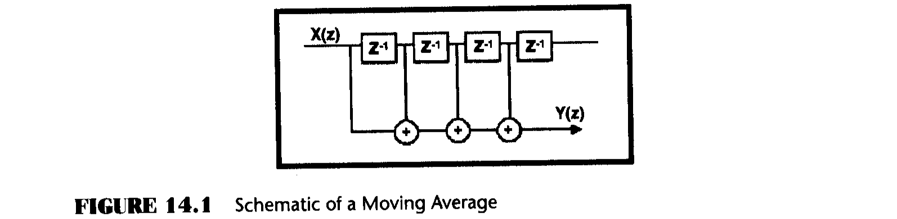
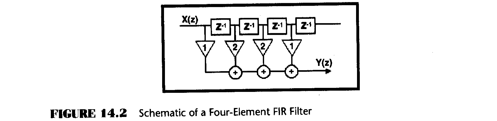
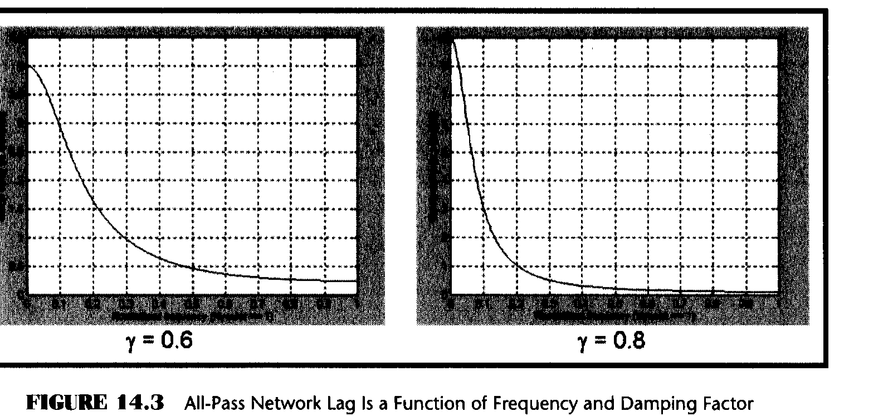
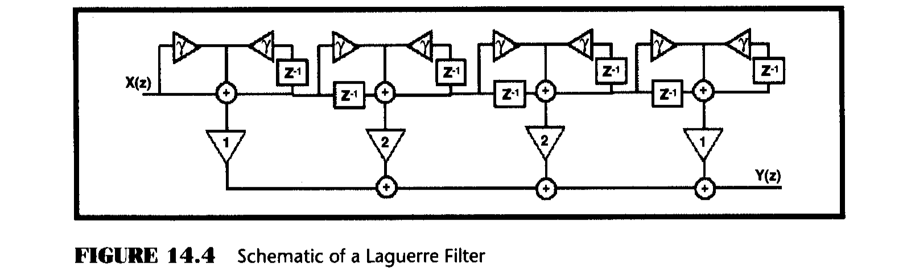
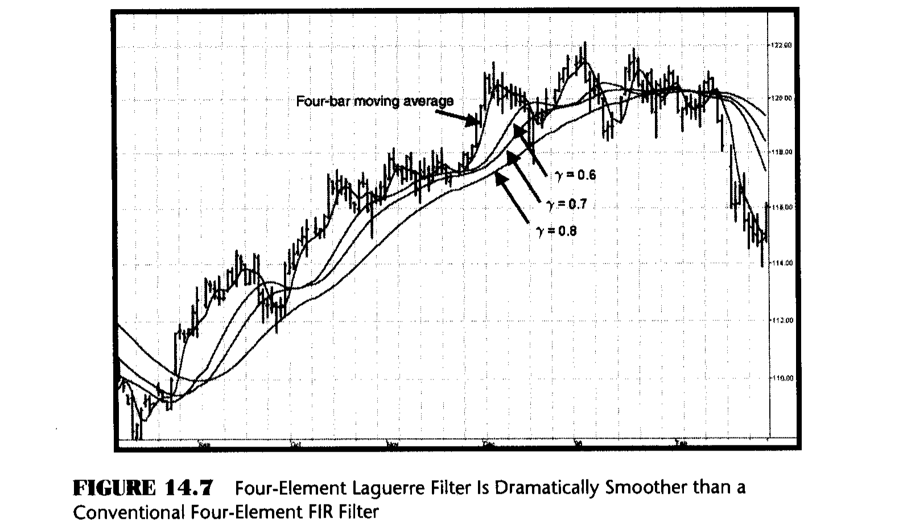
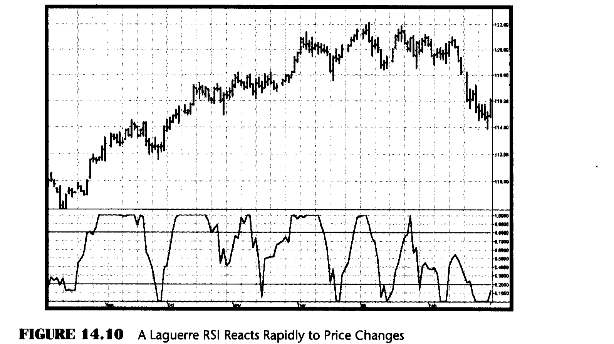

# Chapter 14: Time Warp — Without Space Travel

> "I only get Newsweek," said Tom timelessly.

One of the most frustrating aspects of technical analysis is trying to avoid whipsaw trades. When the moving averages are made smoother to avoid these whipsaws, the lag produced by the smoothing often renders the signals ineffective. The dilemma therefore is how to strike a balance between the amount of smoothing that can be obtained and the amount of lag that can be tolerated. In this chapter, I introduce a new tool to address the smoothing versus lag problem more effectively. In particular, you will learn another way to create better smoothing filters.

A moving average is a simple concept involving sampled data. One averages the data over the last N samples, moves forward one sample and averages over the new set of N samples, and so on. For each new set of N samples, only the oldest sample is discarded and one new sample is added. The average is done over a fixed number of samples and moved forward one sample at a time. In this way the average moves. An engineer views the process differently. From this perspective, the data moves down a fixed delay line that is tapped to get the output of each sample, and the tap outputs are added together to produce the moving average. This process is depicted in the schematic of Figure 14.1 for a four-bar moving average. In Figure 14.1, the symbol $Z^{-1}$ means that there is one unit of delay. In the case of daily data, the delay would be one day. The filter response in terms of the Z transform is

$$A(z) = \frac{1}{4} + Z^{-1}\frac{1}{4} + Z^{-2}\frac{1}{4} + Z^{-3}\frac{1}{4} \tag{14.1}$$



The equation for the moving average, in EasyLanguage format, is

$$Filt = (Price + Price[1] + Price[2] + Price[3]) / 4 \tag{14.2}$$

That is, successively older data samples from the newest sample are averaged to obtain the filtered output. The tapped delay line concept is favored by engineers because more generalized finite impulse response (FIR) filters can be developed by changing the relative amplitudes of the samples. For example, if we wanted the middle two samples to have twice the weight of the newest sample and oldest sample in our four-sample example, the schematic diagram would be as shown in Figure 14.2.



The equation for the FIR filter, in EasyLanguage format, is

$$Filt = (Price + 2 \times Price[1] + 2 \times Price[2] + Price[3]) / 6 \tag{14.3}$$

This is exactly the same filter used to eliminate the two-bar and three-bar cycle components in Figure 4.1. The multipliers on price are called the coefficients of the filter. Note that the filter is always normalized to the sum of the coefficients. This normalization is done so that the output will be the same as the input if all the samples have the same value. In engineering terms, the direct current, or zero frequency (DC) gain is equal to unity. The FIR filter can be made to have additional smoothing by making the filter longer. However, the lag of a FIR filter is approximately half the filter length. The result is that if we want greater smoothing we must accept the additional lag in conventional filters.

## The Laguerre Transform

Conventional filters use the Z transform to describe the filter transfer characteristic, where $Z^{-1}$ denotes a unit delay. There are a semi-infinite number of orthonormal functions for transform arithmetic. One such function is formed from Laguerre polynomials. The mathematical expression for a kth-order Laguerre transfer response is

$$A(z) = \frac{1 - \gamma}{1 - \gamma Z^{-1}} \left[\frac{Z^{-1} - \gamma}{1 - \gamma Z^{-1}}\right]^{k-1} \tag{14.4}$$

The Laguerre transform can be represented as an exponential moving average (EMA) low-pass filter (the first term) followed by a succession of all-pass elements instead of unit delays (the k − 1 terms). All terms have exactly the same damping factor γ. We see that these are all pass networks by examining the frequency response. When frequency is 0, the $Z^{-1}$ term has a value of 1, and therefore the element evaluates to $(1 - \gamma)/(1 - \gamma) = 1$. Similarly, when frequency is infinite, $Z^{-1}$ has a value of −1, and therefore the element evaluates to $(-1 - \gamma)/(1 + \gamma) = -1$. The element has a unity gain at all frequencies between 0 and infinity, and therefore is an all-pass network. However, the phase from input to output shifts over the frequency range, causing the lag to be variable as a function of frequency. The degree to which the lag is variable depends on the value of the damping factor γ. For example, the lag, or group delay, for γ = 0.6 and γ = 0.8 is shown in Figure 14.3.



Therefore, we can make a filter using the Laguerre elements instead of the unit delay, whose coefficients are also [1 2 2 1]/6 as with the FIR filter. The difference is that we have warped the time between the delay line taps. The schematic of the Laguerre filter is shown in Figure 14.4.



## Laguerre Filter Code

The EasyLanguage and eSignal Formula Script (EFS) codes for a four-element Laguerre Filter are given in Figures 14.5 and 14.6, respectively. L0 is the output of the first section and is just an EMA. The following three sections are identical in their form. The four sections of the Laguerre delay line are summed exactly the same way as a linear delay line for a FIR filter. The Laguerre output is the Filt variable. An identical-length FIR filter is also computed for comparison.

### EasyLanguage Code (Figure 14.5)

```easylanguage
Inputs: Price((H+L)/2),
        gamma(.8);

Vars:   L0(0),
        L1(0),
        L2(0),
        L3(0),
        Filt(0),
        FIR(0);

L0 = (1 - gamma)*Price + gamma*L0[1];
L1 = -gamma*L0 + L0[1] + gamma*L1[1];
L2 = -gamma*L1 + L1[1] + gamma*L2[1];
L3 = -gamma*L2 + L2[1] + gamma*L3[1];

Filt = (L0 + 2*L1 + 2*L2 + L3) / 6;
FIR = (Price + 2*Price[1] + 2*Price[2] + Price[3]) / 6;

Plot1(Filt, "Filt");
Plot2(FIR, "FIR");
```

### EFS Code (Figure 14.6)

```javascript
/***************************************************
Title:      Laguerre Filter
Coded By:   Chris D. Kryza (Divergence Software, Inc.)
Email:      c.kryza@gte.net
Incept:     06/19/2003
Version:    1.0.0
Fix History:
06/19/2003 - Initial Release
1.0.0
***************************************************/

//External Variables
var aL0 = new Array();
var aL1 = new Array();
var aL2 = new Array();
var aL3 = new Array();
var aPriceArray = new Array();

//== PreMain function required by eSignal to set things up
function preMain() {
    var x;
    setPriceStudy(true);
    setStudyTitle("LaguerreFilter");
    setCursorLabelName("Filt", 0);
    setCursorLabelName("FIR", 1);
    setDefaultBarFgColor(Color.blue, 0);
    setDefaultBarFgColor(Color.red, 1);
    //initialize arrays
    for (x = 0; x < 5; x++) {
        aPriceArray[x] = 0.0;
        aL0[x] = 0.0;
        aL1[x] = 0.0;
        aL2[x] = 0.0;
        aL3[x] = 0.0;
    }
}

//== Main processing function
function main(Gamma) {
    var x;
    var nFilt;
    var nFIR;

    //initialize parameters if necessary
    if (Gamma == null) {
        Gamma = 0.80;
    }

    // study is initializing
    if (getBarState() == BARSTATE_ALLBARS) {
        return null;
    }

    //on each new bar, save array values
    if (getBarState() == BARSTATE_NEWBAR) {
        aPriceArray.pop();
        aPriceArray.unshift(0);
        aL0.pop();
        aL0.unshift(0);
        aL1.pop();
        aL1.unshift(0);
        aL2.pop();
        aL2.unshift(0);
        aL3.pop();
        aL3.unshift(0);
    }

    aPriceArray[0] = (high() + low()) / 2;

    aL0[0] = (1.0 - Gamma) * aPriceArray[0] + Gamma * aL0[1];
    aL1[0] = -Gamma * aL0[0] + aL0[1] + Gamma * aL1[1];
    aL2[0] = -Gamma * aL1[0] + aL1[1] + Gamma * aL2[1];
    aL3[0] = -Gamma * aL2[0] + aL2[1] + Gamma * aL3[1];

    //calculate Laguerre filter
    nFilt = (aL0[0] + 2 * aL1[0] + 2 * aL2[0] + aL3[0]) / 6;

    //calculate FIR filter
    nFIR = (aPriceArray[0] + 2 * aPriceArray[1]
        + 2 * aPriceArray[2] + aPriceArray[3]) / 6;

    //return the calculated values
    if (!isNaN(nFilt)) {
        return new Array(nFilt, nFIR);
    }
}
```

## Laguerre Filter Results



The results of the Laguerre and FIR filters are shown in Figure 14.7. Remember that all filters have identical lengths. The FIR filter has a lag of only 1.5 bars and only moderately smooths the price data. On the other hand, the Laguerre filter is dramatically smoother and also has significant lag. You can decrease the smoothing and the lag by decreasing the damping factor. When the damping factor is reduced to 0, the Laguerre filter is identical to the FIR filter. This is a simple way to control the action of a moving average and still use only a few data samples in the calculation.

## Laguerre RSI

The story does not end with conventional filters. As I am fond of saying, "Truth and science always triumph over ignorance and superstition." If we can generate superior smoothing with very short filters, it follows that we should be able to create superior indicators using very short data lengths also. The use of shorter data lengths means that we can make the indicators more responsive to changes in the price. The Laguerre RSI will be used as an example.

Welles Wilder defined the RSI as

$$RSI = 100 - \frac{100}{1 + RS}$$

where $RS = CU / CD$ (Closes Up / Closes Down).

RS is shorthand for Relative Strength. That is, CU is the sum of the difference in closing prices over the observation period where that difference is positive. Similarly, CD is the sum of the difference in closing prices over the observation period where that difference is negative, but the sum is expressed as a positive number. When we substitute CU/CD for RS and simplify the RSI equation, we get

$$RSI = \frac{100 \times CU}{CU + CD}$$

In other words, the RSI is the percentage of the sum of the delta closes up to the sum of all the delta closes over the observation period. In the EasyLanguage and EFS codes of Figures 14.8 and 14.9, respectively, I have generated an RSI over Laguerre time rather than linear time, using only four data samples. In this case, I used a damping factor of 0.5, but you can adjust the damping factor to best suit your own data.

### EasyLanguage Code (Figure 14.8)

```easylanguage
Inputs: gamma(.5);

Vars:   L0(0),
        L1(0),
        L2(0),
        L3(0),
        CU(0),
        CD(0),
        RSI(0);

L0 = (1 - gamma)*Close + gamma*L0[1];
L1 = -gamma*L0 + L0[1] + gamma*L1[1];
L2 = -gamma*L1 + L1[1] + gamma*L2[1];
L3 = -gamma*L2 + L2[1] + gamma*L3[1];

CU = 0;
CD = 0;

If L0 >= L1 then CU = L0 - L1 Else CD = L1 - L0;
If L1 >= L2 then CU = CU + L1 - L2 Else CD = CD + L2 - L1;
If L2 >= L3 then CU = CU + L2 - L3 Else CD = CD + L3 - L2;

If CU + CD <> 0 then RSI = CU / (CU + CD);

Plot1(RSI, "RSI");
Plot2(.8);
Plot3(.2);
```

### EFS Code (Figure 14.9)

```javascript
/***************************************************
Title:      Laguerre RSI Indicator
Coded By:   Chris D. Kryza (Divergence Software, Inc.)
Email:      c.kryza@gte.net
Incept:     06/19/2003
Version:    1.0.0
Fix History:
06/19/2003 - Initial Release
1.0.0
***************************************************/

//External Variables
var aL0 = new Array();
var aL1 = new Array();
var aL2 = new Array();
var aL3 = new Array();
var aPriceArray = new Array();
var nRSI = 0;

//== PreMain function required by eSignal to set things up
function preMain() {
    var x;
    setPriceStudy(false);
    setStudyTitle("LaguerreRSI");
    setCursorLabelName("RSI", 0);
    setDefaultBarFgColor(Color.blue, 0);
    addBand(0.80, PS_SOLID, 2, Color.black, -55);
    addBand(0.20, PS_SOLID, 2, Color.black, -56);
    //initialize arrays
    for (x = 0; x < 5; x++) {
        aPriceArray[x] = 0.0;
        aL0[x] = 0.0;
        aL1[x] = 0.0;
        aL2[x] = 0.0;
        aL3[x] = 0.0;
    }
}

//== Main processing function
function main(Gamma) {
    var x;
    var nCD;
    var nCU;

    //initialize parameters if necessary
    if (Gamma == null) {
        Gamma = 0.50;
    }

    // study is initializing
    if (getBarState() == BARSTATE_ALLBARS) {
        return null;
    }

    //on each new bar, save array values
    if (getBarState() == BARSTATE_NEWBAR) {
        aPriceArray.pop();
        aPriceArray.unshift(0);
        aL0.pop();
        aL0.unshift(0);
        aL1.pop();
        aL1.unshift(0);
        aL2.pop();
        aL2.unshift(0);
        aL3.pop();
        aL3.unshift(0);
    }

    aPriceArray[0] = close();

    aL0[0] = (1.0 - Gamma) * aPriceArray[0] + Gamma * aL0[1];
    aL1[0] = -Gamma * aL0[0] + aL0[1] + Gamma * aL1[1];
    aL2[0] = -Gamma * aL1[0] + aL1[1] + Gamma * aL2[1];
    aL3[0] = -Gamma * aL2[0] + aL2[1] + Gamma * aL3[1];

    nCU = 0;
    nCD = 0;

    if (aL0[0] >= aL1[0]) {
        nCU = aL0[0] - aL1[0];
    } else {
        nCD = aL1[0] - aL0[0];
    }

    if (aL1[0] >= aL2[0]) {
        nCU = nCU + aL1[0] - aL2[0];
    } else {
        nCD = nCD + aL2[0] - aL1[0];
    }

    if (aL2[0] >= aL3[0]) {
        nCU = nCU + aL2[0] - aL3[0];
    } else {
        nCD = nCD + aL3[0] - aL2[0];
    }

    if (nCU + nCD != 0) {
        nRSI = nCU / (nCU + nCD);
    }

    return(nRSI);
}
```

## Laguerre RSI Results



An example of the results for the four-element Laguerre RSI is shown in Figure 14.10 below the price charts. The 20 percent and 80 percent signal levels are also plotted. Note that the excursions of the RSI are typically lock to lock and that the recovery is rapid at each major price reversal. A typical use of the Laguerre RSI is to buy after the line crosses back over the 20 percent level and sell after the price crosses back down over the 80 percent level. Of course, just as with the conventional RSI, more elaborate trading rules can be created.

## Key Points

- The Laguerre transform provides a time warp such that the low-frequency components are delayed much more than the high-frequency components.
- Time distortion enables very smooth filters to be built using a short amount of data.
- Indicators can also be created using the time warp.
- Time-warped indicators react faster because a shorter amount of data is used.
