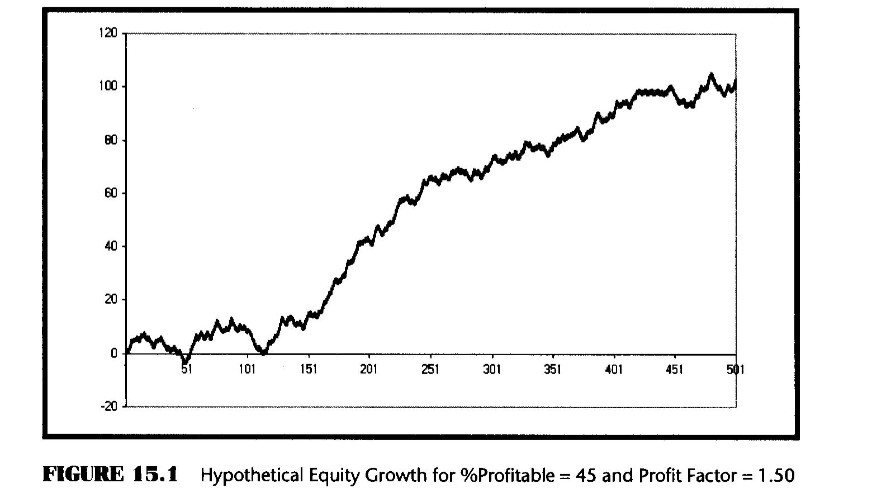
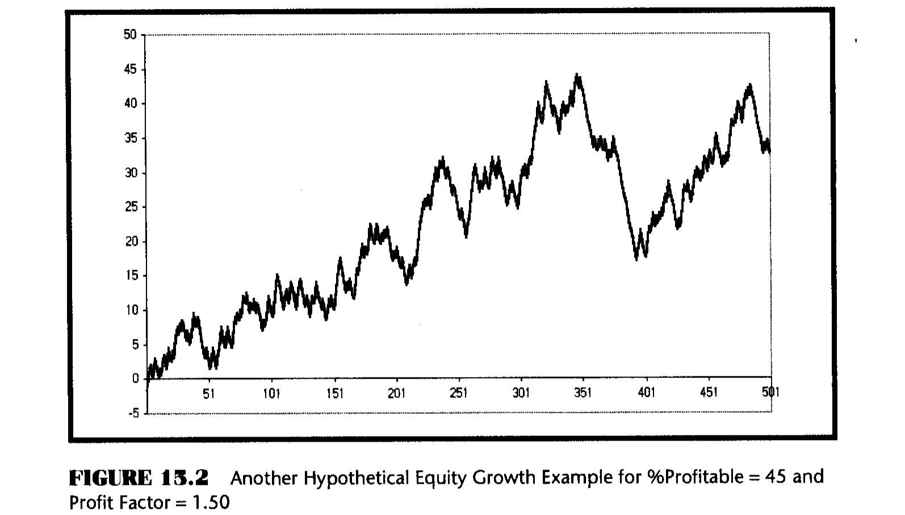

# Chapter 15: Evaluating Trading Systems

> "I got the first three wrong," said Tom forthrightly.

There are basically two ways to trade using technical analysis—discretionarily and systematically. Discretionary traders can, and have, made spectacular amounts of money with their techniques. They integrate their life's experience, knowledge of the markets, and technical indicators to make their trading decisions. In fact, I have used a large fraction of this book to describe new indicators to be used as tools. Systematic traders, on the other hand, do not need to know very much about the market or have much experience. Instead, they rely on the trading signals automatically produced by rules implemented by computer programs. They have the confidence to rely on the computerized systems because the performance statistics can be reproduced by backtesting. That is not to say that hypothetical performance is perfect. There can be sharp differences between hypothetical performance and real trading results. For example, hypothetical trading does not involve financial risk, and the ability to withstand losses or to adhere to a particular trading system in the face of these losses is not considered. Implementation issues, such as slippage and commission, can only be included as allowance factors. Furthermore, the trading system can have performance in the future significantly different from its past performance due simply to the randomness of events. Since backtests are always done with the benefit of hindsight, there are all kinds of ways to cheat on reported performance. This chapter is about what you can realistically expect from your trading system rather than how to cheat the statistics.

Many people equate speculation in the market to gambling. Their beliefs are reinforced by popular books such as *A Random Walk Down Wall Street*.¹ This belief persists although it is patently false and intellectually dishonest. More serious investors look at fundamental considerations such as P/E ratios, Sales, Debt, and so on, and give scant attention to technical analysis. The technique described in this chapter uses some gaming concepts not only to show that there is merit to trading using technical analysis trading systems, but also to enable you to visualize what equity growth performance you can reasonably expect from your system.

There are a number of statistics that are important if you are putting your hard-earned money at risk. Maximum drawdown is important because it, plus required margin, is the absolute minimum amount of money you should have in your account to avoid a margin call with reasonable probability. The number of consecutive losers is a test of how strong your stomach must be to trade the system. The average profit per trade is important to know because you must cover your transaction costs (commission plus slippage) before you can start making money for yourself.

Taking away all the details of the particular system, there are two statistics that enable you to assess what performance you can expect. These are the percentage of profitable trades and the Profit Factor. It is desirable to have as high a percentage of winners as possible, but this need not be greater than 50 percent to be profitable if you make more on winning trades than you lose on losing trades. Profit Factor is the ratio of Gross Winnings to Gross Losses. In terms of gaming, it is the payout probability.

By determining whether a trade is a winner or a loser using the percentage wins and a random number generator, applying the payout probability to each trade, and summing the randomly selected trades, you can provide realistic expectations for the equity growth produced by the system. Only in this sense can randomization be introduced to establish performance. Simply winning or losing is not a random occurrence.

## Monte Carlo Equity Curve Simulation in Excel

We can create an equity growth simulator and plot the results in an Excel spreadsheet. First we need to insert the two important statistics. In cell A1, type "% Winners" and in cell A2 type 45. In cell B1, type "Profit Factor" and in cell B2 type 1.5. The values of 45 and 1.5 are only initial values. The entries into cells A2 and B2 are system statistics that you can change to visualize their impact on equity growth.

In cell A3 input =RAND(). This creates a random number having a uniform probability density in the range between 0 and 1. This random number is compared to the probability of a win by inserting =IF(A3 < $B$1/100,$B$2,−1) into cell B3. This conditional statement says that if the random number falls within the winning probability then assign the payout probability (the Profit Factor) to the trade, otherwise assign a value of −1 to the trade. This is the outcome of the trade. In cell C3 input =B3. Copy all of row 3 into row 4. Then change cell C4 to be =C3 + B4. This sums the trades in column C. Next copy all of row 4 and paste into rows 5 through 500. Column C now becomes the equity growth for the randomized set of trades using only the percent winners and Profit Factor. This equity growth changes every time you press F9, causing the spreadsheet to recalculate.

You can plot the equity curve for ease of interpretation. To do this, highlight cells C3 through C500. Then click on the chart wizard and input the data as requested. First, select a line type chart and click on the type shown in the upper left corner of the thumbnail examples. Click Next. Then click Finish. Your chart is done! Now you are free to experiment with the kind of equity growth you can expect from your trading system. Just press F9 to recompute the spreadsheet. You will create a new randomized equity growth curve because all the random numbers have changed. Repeat as often as you desire to get a feeling that you know what to expect. Figures 15.1 and 15.2 are just two examples I ran using the default statistics. Note that although exactly the same statistics are used, the equity curves are dramatically different. The message is that you should not blindly accept an equity curve (real or hypothetical) from a vendor without also finding out what the Profit Factor and Percent Profitable statistics were.

To see what a nice equity growth curve looks like, change cell A2 to 50 and cell B2 to 2.0. MESA Software is among the few systems developers that have systems with statistics such as these. You can see the backtested equity curves of some of our systems at www.mesa-systems.com. Next, explore what the lower-limit statistics might be for a profitable trading system. My experience is that the boundary is 42 in cell A2 (for percentage winners) and 1.5 (for Profit Factor) in cell B2.

## Key Points to Remember

- Profit Factor and Percentage Winners of a trading system are all you need to create a Monte Carlo equity curve of that system.
- A real equity curve is only one of the possibilities that can be produced by a Monte Carlo equity curve.
- A Monte Carlo simulation can be used to evaluate the expected performance of any trading system.

---

¹ Burton G. Malkiel, *A Random Walk Down Wall Street* (New York: W.W. Norton & Company).
