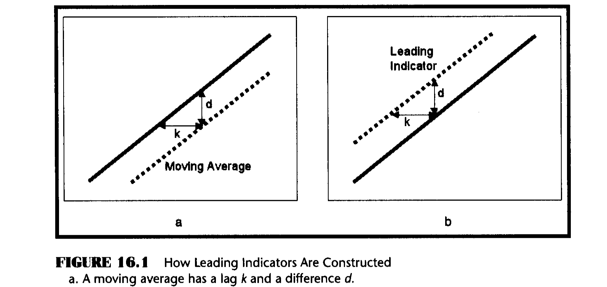
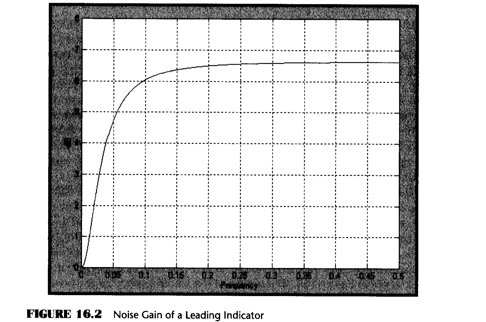
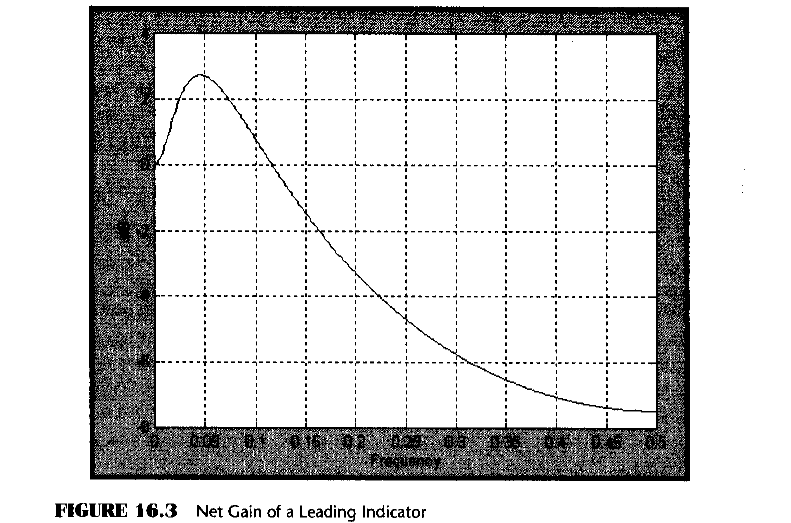
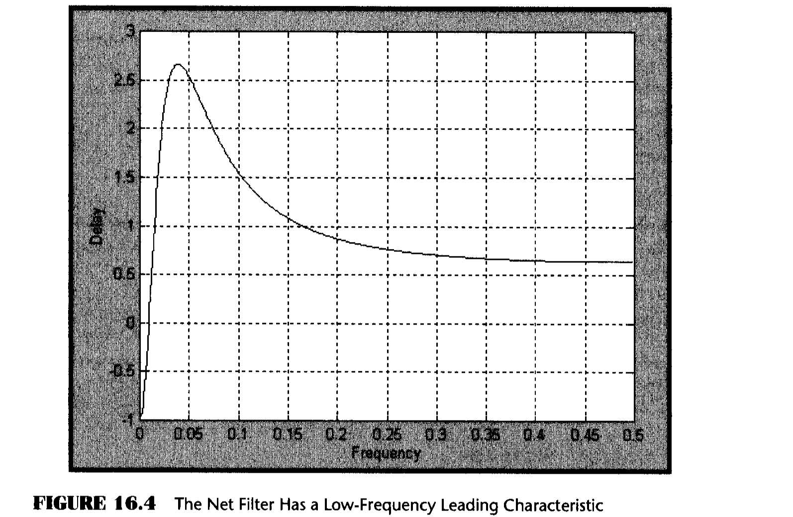
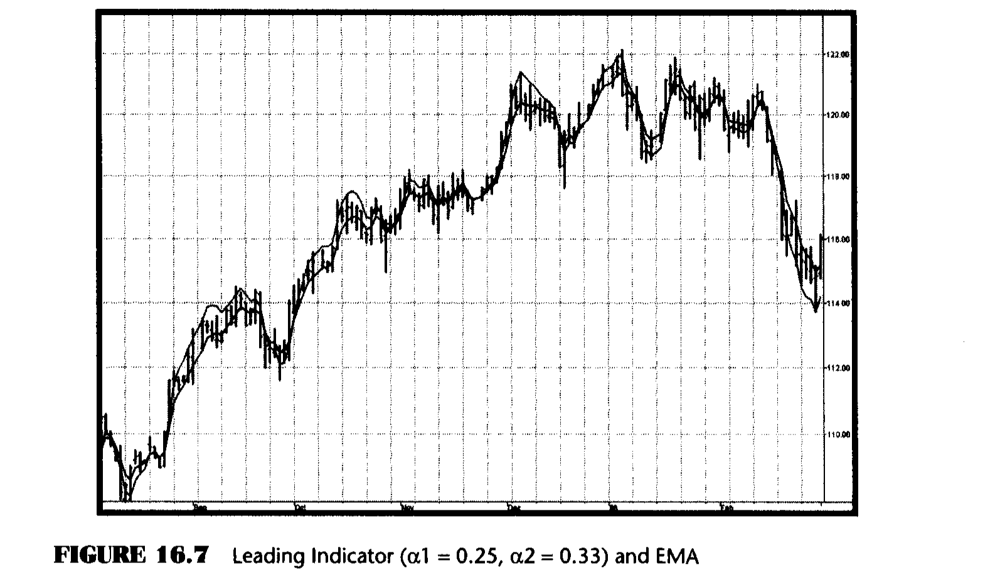
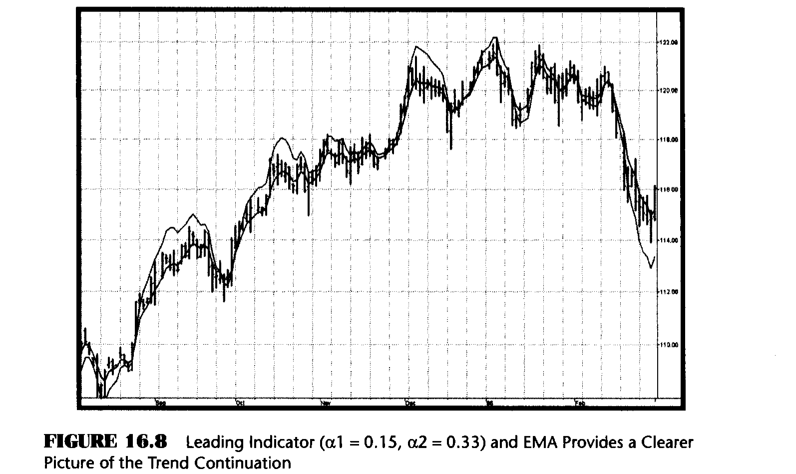

# Chapter 16: Leading Indicators

> "Leading indicators are neat," said Tom predictably.

There are two basic kinds of leading indicators: causal and noncausal filters. Causal filters depend on data and noncausal filters can be predictive from almost any other basis, including gut feelings. The Sinewave Indicator described in Chapter 11 is an example of a noncausal filter.

The purpose of this chapter is to derive the limitations and usefulness of causal predictive filters. It is a fundamental principle that causal filters cannot predict a specific event because their very value depends on that event. That is to say, causal filters cannot anticipate a transient response. However, they can and do act as reliable indicators of steady-state responses.

All moving averages have lag. A moving average is depicted as the dashed line relative to the original function (the solid line) in Figure 16.1a. The difference between the two lines d is a constant value in the case of a continuous trend. Similarly, the lag k is also a constant value. The leading indicator is created by adding the difference between the original function and its moving average to the function itself. Adding the difference necessarily places the indicator with a negative lag relative to the original function, as depicted in Figure 16.1b. Negative lag makes this filter a leading indicator. The amount of lead is exactly equal to the amount of lag of the moving average.



*Figure 16.1: How Leading Indicators Are Constructed. (a) A moving average has a lag k and a difference d. (b) Adding the moving average difference yields a lead k.*

Since the amount of lead of the leading indicator is dependent on the lag of a moving average, it is instructive to examine the lag of an exponential moving average as a function of its smoothing parameter alpha. Imagine an original function that increases by 1 with each sample. The function will have a value of J on the Jth sample. If the moving average has a lag of k, then the moving average will have a value of (J - k) on the Jth day. Similarly, the moving average will have had a value of (J - 1 - k) on the (J - 1)th day. Putting these values in the equation for an exponential moving average, we have

```
(J - k) = alpha * J + (1 - alpha) * (J - 1 - k)                    (16.1)
```

Solving for alpha in terms of the delay k, we have the relationship

```
alpha = 1 / (k + 1)                                                 (16.2)
```

Or, conversely

```
k = 1/alpha - 1                                                     (16.3)
```

Equation 16.3 tells how much lead we can expect from our leading indicator. From Chapter 2, the transfer response is the ratio of the output to the input. Thus the transfer response of the leading indicator can be written as

```
H(z) = Output / Input = 2 - (alpha * Z^-1) / (1 - (1 - alpha) * Z^-1)

     = [2 + (alpha - 2) * Z^-1] / [1 - (1 - alpha) * Z^-1]         (16.4)
```

But there is a price to be paid for getting the leading function. That price is noise gain. If we let Z^-1 = 1 in Equation 16.4, we get the zero frequency (constant input) gain. Doing this algebra, the gain of this filter is unity. That is, if the input is constant we get exactly the same output from the filter. The output cannot be leading because there is no trend to the input.

Letting Z^-1 = -1, the value of the transfer response at the Nyquist (highest possible) frequency is obtained. Doing this, the filter gain for a two-bar cycle is (4 - alpha) / (2 - alpha). So the noise gain varies from 2 when alpha = 0 to 3 when alpha = 1. If the lead is three bars, Equation 16.2 gives alpha = 0.25, and therefore the noise gain is 2.14, slightly more than 6 dB. Figure 16.2 shows how the noise gain varies with frequency for the case when alpha = 0.25.



Noise gain is not a good thing. The noise gain can be reduced by following the leading indicator filter with an exponential moving average. As I indicated earlier, all moving averages have lag. So, if an alpha of the moving average is selected to have less lag than the lead of the leading indicator, an indicator having a net leading function can still be produced. As an example, selecting alpha = 0.33 results in an exponential moving average that has a lag of only two bars. The attenuation at Z^-1 = -1 is 0.2, which gives a greater attenuation than the noise gain of the leading indicator. The net gain of the composite filter is shown in Figure 16.3. While there is still some noise gain in the vicinity of a 20-bar cycle (frequency = 0.05), the net filter has a net smoothing effect over most of the frequency range.





The leading characteristic is still present in the net filter, as shown in Figure 16.4. As predicted, the lead is one bar at very low frequencies. That is, the trend indication will lead by one bar. However, the net filter has a lag of approximately 2.5 bars for cycle components near 20-bar cycles. Also, higher-frequency lag settles down to be about half a bar. The interpretation of the lag response is that the filter predicts a continuation of a trend by 1 bar, lags abrupt changes by about 0.5 bars, and lags smooth changes that can be fitted by segments of a 20-bar sinewave by as much as 2.5 bars. That's the law of physics -- you cannot get something for nothing. Causal filters can have a predictive capability over some portion of the frequency response, but not at all frequencies. There is no magic predictor.

The EasyLanguage and eSignal Formula Script (EFS) codes to compute several leading indicators are given in Figures 16.5 and 16.6, respectively. In these codes, the leading indicator is compared to an exponential moving average whose alpha = 0.5. This exponential moving average has a lag of only a half bar. The relative positions of the leading indicator and the exponential moving average show when the market is in an uptrend or a downtrend as in the example in Figure 16.7. The alphas of the leading indicator are provided as inputs for ease of modification of the indicator. For example, the continuation of the trend is more clearly identified if alpha1 is reduced to a value of 0.15. The impact of giving the indicator greater lead is shown in Figure 16.8.

### EasyLanguage Code (Figure 16.5)

```easylanguage
Inputs: Price((H+L)/2),
        alpha1(.25),
        alpha2(.33);
Vars:   Lead(0),
        NetLead(0),
        EMA(0);

Lead = 2*Price + (alpha1 - 2)*Price[1] + (1 - alpha1)*Lead[1];
NetLead = alpha2*Lead + (1 - alpha2)*NetLead[1];
EMA = .5*Price + .5*EMA[1];

Plot1(NetLead, "Lead");
Plot2(EMA, "EMA");
```

*Figure 16.5: EasyLanguage Code to Compute Leading Indicators*

### eSignal Formula Script (EFS) Code (Figure 16.6)

```javascript
/************************************************************
Title:        Leading Indicator
Coded By:     Chris D. Kryza (Divergence Software, Inc.)
Email:        c.kryza@gte.net
Incept:       09/02/2003
Version:      1.0.0
Fix History:

09/02/2003 - Initial Release
1.0.0

************************************************************/

//External Variables

var nPrice = 0;
var nBarCount = 0;
var aPriceArray = new Array();
var aLead = new Array();
var aNetLead = new Array();
var aEMA = new Array();

//== PreMain function required by eSignal to set things up

function preMain() {
    var x;
    setPriceStudy(true);
    setStudyTitle("Leading Indicator");
    setCursorLabelName("Lead", 0);
    setCursorLabelName("EMA", 1);
    setDefaultBarFgColor(Color.red, 0);
    setDefaultBarFgColor(Color.blue, 1);

    //initialize arrays
    for (x = 0; x < 10; x++) {
        aPriceArray[x] = 0.0;
        aLead[x] = 0.0;
        aNetLead[x] = 0.0;
        aEMA[x] = 0.0;
    }
}

//== Main processing function

function main(Alpha1, Alpha2) {
    var x;

    //initialize parameters if necessary
    if (Alpha1 == null) {
        Alpha1 = 0.25;
    }
    if (Alpha2 == null) {
        Alpha2 = 0.33;
    }

    // study is initializing
    if (getBarState() == BARSTATE_ALLBARS) {
        return null;
    }

    //on each new bar, save array values
    if (getBarState() == BARSTATE_NEWBAR) {
        nBarCount++;
        aPriceArray.pop();
        aPriceArray.unshift(0);
        aLead.pop();
        aLead.unshift(0);
        aNetLead.pop();
        aNetLead.unshift(0);
        aEMA.pop();
        aEMA.unshift(0);
    }

    nPrice = (high() + low()) / 2;
    aPriceArray[0] = nPrice;

    aLead[0] = 2 * aPriceArray[0] + (Alpha1 - 2.0)
        * aPriceArray[1] + (1.0 - Alpha1)
        * aLead[1];

    aNetLead[0] = Alpha2 * aLead[0]
        + (1.0 - Alpha2) * aNetLead[1];

    aEMA[0] = 0.5 * aPriceArray[0] + 0.5 * aEMA[1];

    //return the calculated values
    if (!isNaN(aNetLead[0]) && !isNaN(aEMA[0])
        && nBarCount > 20) {
        return new Array(aNetLead[0], aEMA[0]);
    }
}
```

*Figure 16.6: EFS Code to Compute Leading Indicators*

## Results





## Key Points to Remember

- Adding the difference between price and an exponential moving average to the price itself creates a leading indicator.
- The leading indicator always has noise gain.
- Smoothing the leading indicator with another exponential moving average can mitigate noise gain.
- Constants can be selected to provide a net lead for the indicator at low frequencies.
- The leading indicator has a lagging signal at price turning points.
