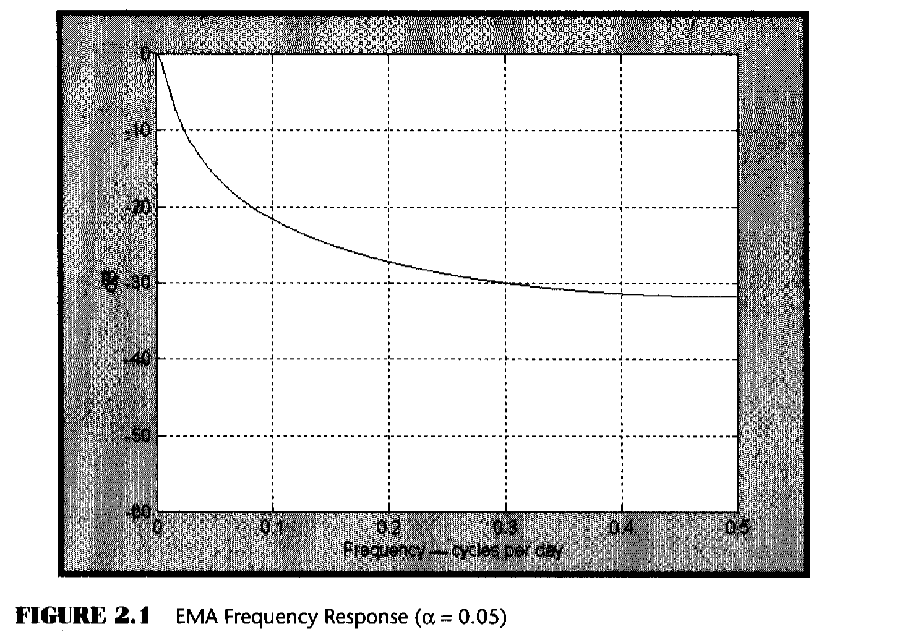
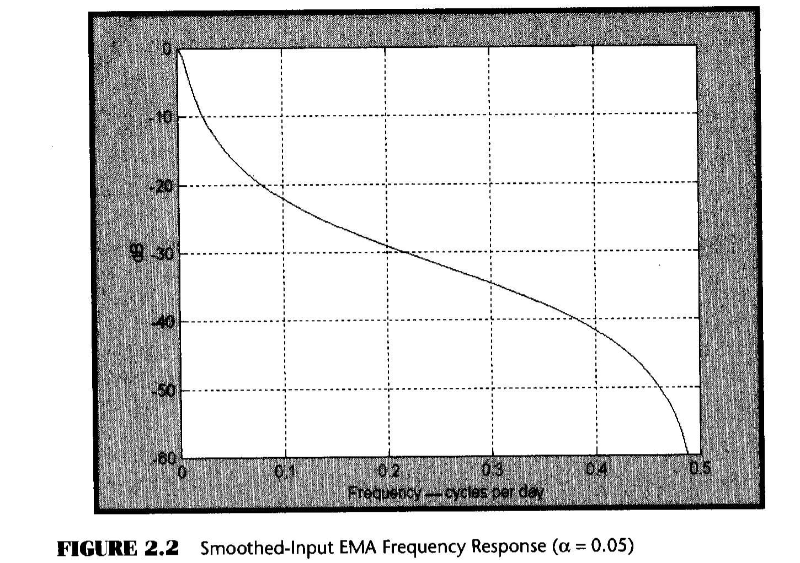
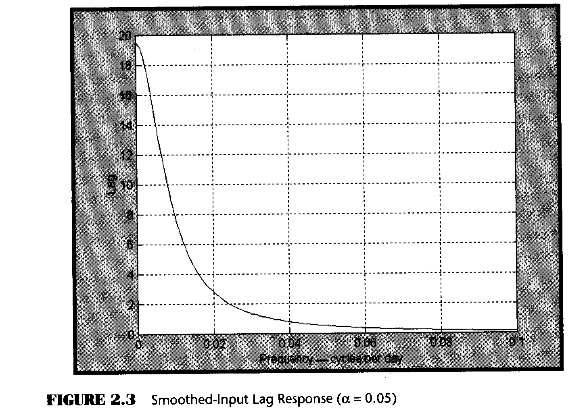
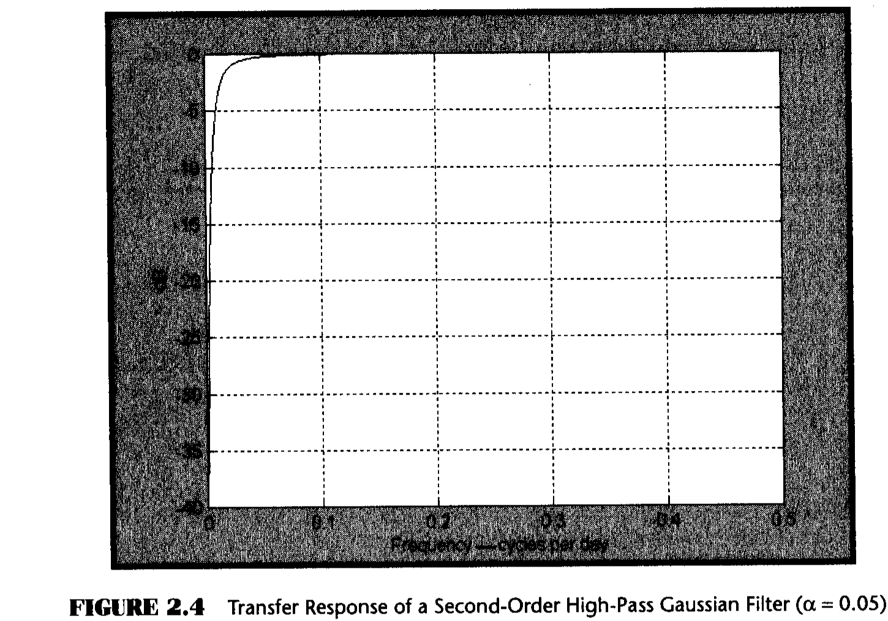
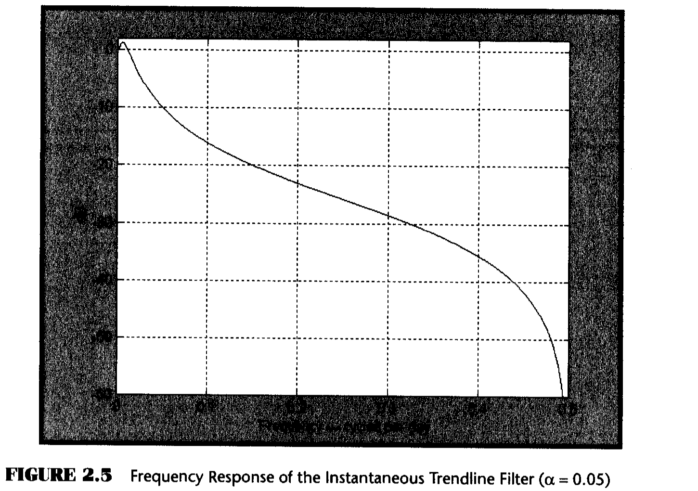
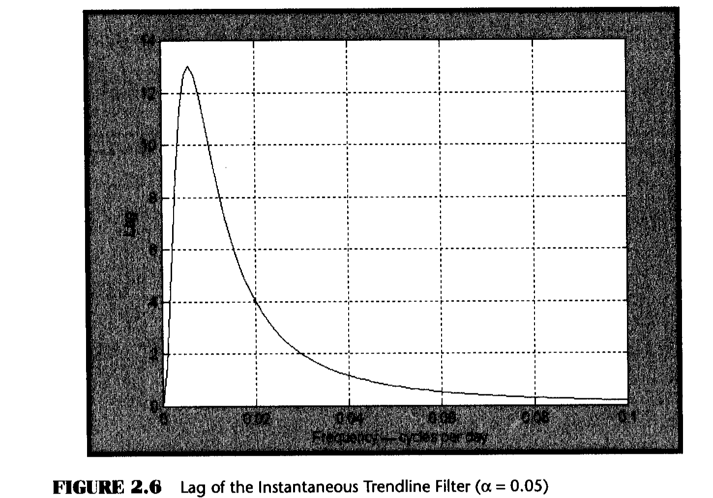
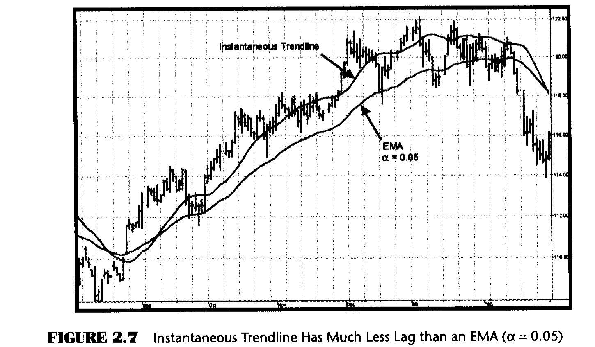

# Chapter 2: Trends and Cycles

> "That took the wind out of my sails," said Tom disgustedly.

To a trader, Trend Modes and Cycle Modes are synonymous with selection of a trading strategy. In an uptrend the obvious strategy is to buy and hold. Similarly, in a downtrend the strategy is to sell and hold. Conversely, the best strategy in a Cycle Mode is to top-pick and bottom-fish.

Traders usually use some variant of moving averages to trade the Trend Mode and some oscillator to trade the Cycle Mode. In either case, the lag induced by the calculations is one of the biggest problems for a trader.

To an analyst, Trend Modes and Cycle Modes are best described by their frequency content. Prices in Trend Modes vary slowly with respect to time. Therefore, Trend Modes disregard high-frequency components and use only the slowly varying low-frequency components. Moving averages are low-pass filters that allow only the low-frequency components to pass to their output, and that is why they are effective for Trend Mode trading. Oscillators are high-pass filters that almost completely disregard the low-frequency components.

I will use these concepts to create a complementary oscillator and moving average. Most important, both the oscillator and the moving average have essentially no lag. The elimination of lag is crucial to the trading indicators and systems developed from them in later chapters. I consider the creation of these zero-lag tools one of the most important developments described in this book. Searching for zero-lag tools has long been the focus of my research, and I have used descriptors such as Instantaneous Trendline in previous publications. The techniques I show you in this chapter are entirely new, even if the names are similar.

## The Exponential Moving Average as a Low-Pass Filter

I will start with the well-known exponential moving average (EMA) to derive an optimum mathematical description of Trend Mode and Cycle Mode components. The equation for an EMA is:

```
Output = alpha * Input + (1 - alpha) * Output[1]          (2.1)

Where alpha is a number less than 1 and greater than 0
```

In words, this equation means we take a fraction of the current price and add to it the filtered output one bar ago multiplied by the quantity (1 - alpha). With these coefficients, if the input is unchanging (zero frequency), the output will eventually converge to the input value. That is, this filter has unity gain at zero frequency.

We can describe this filter in terms of its transfer response, which is the output divided by its input. By using Z transform notation, we let Z^-1 denote one bar of lag as a multiplicative operator:

```
H(z) = Output/Input = alpha / (1 - (1-alpha) * Z^-1)      (2.2)
```

The high-frequency attenuation of this filter can be tested at the highest possible frequency, the Nyquist frequency, by letting Z^-1 equal -1. The two-bar cycle attenuation is [alpha/(2 - alpha)].



The general attenuation response of the EMA as a function of frequency is shown in Figure 2.1. The period of a cycle component can be calculated as the reciprocal of frequency. For example, a frequency of 0.1 cycles per day corresponds to a 10-bar period for that cycle component.

## Creating a High-Pass Filter

In principle, all we have to do to create a high-pass filter is subtract the transfer response of the low-pass filter from unity. However, the high-frequency attenuation of the low-pass filter of Equation 2.2 is not infinite at the Nyquist frequency. This problem is eliminated by averaging two sequential input samples:

```
H(z) = (alpha/2) * (1 + Z^-1) / (1 - (1-alpha) * Z^-1)   (2.3)
```

Equation 2.3 guarantees that the transfer response of the low-pass filter will be 0 when Z^-1 = -1.



The lag of a simple moving average is approximately half the average length. For example, a 21-bar moving average has a lag of 10 bars. The alpha of an equivalent EMA is related to the length of a simple moving average as:

```
alpha = 2 / (Length + 1)                                    (2.4)
```

Using Equation 2.4, an EMA using alpha = 0.05 is equivalent to a 39-bar simple moving average. A 39-day simple moving average has a 19-day lag, approximately half its length.



## Second-Order High-Pass Filter

With Equation 2.3 we now have the capacity to construct a high-pass filter. We will subtract Equation 2.3 from unity:

```
BP(z) = 1 - H(z) = (1-alpha/2) * (1 - Z^-1) / (1 - (1-alpha) * Z^-1)   (2.5)
```

Sharper attenuation can be obtained by using higher-order filters. However, higher-order filters not only have greater lag, but they also have transient effects that impress false artifacts on their outputs. This is somewhat like ringing a bell. A reasonable compromise is the use of a second-order Gaussian filter. A second-order Gaussian low-pass filter can be generated by taking an EMA and immediately taking another identical EMA of the first EMA. This can be represented by squaring the transfer response:

```
HP(z) = ((1-alpha/2)^2 * (1 - 2*Z^-1 + Z^-2)) / (1 - (1-alpha)*Z^-1)^2   (2.6)
```

Equation 2.6 is converted to an EasyLanguage statement as:

```easylanguage
HPF = (1 - alpha/2)^2 * (Price - 2*Price[1] + Price[2])
    + 2*(1 - alpha) * HPF[1] - (1 - alpha)^2 * HPF[2];          {2.7}
```



Figure 2.4 shows that only frequency periods longer than 40 bars (frequency = 0.025 cycles per day) are significantly attenuated. Thus we have created a high-pass filter with a relatively sharp cutoff response. Since the output of this filter contains essentially no trending components, it must be the cycle component of price.

## The Instantaneous Trendline

The complementary low-pass filter that produces the Instantaneous Trendline is found by subtracting the high-pass components of Equation 2.6 from unity. The equation for the low-pass Instantaneous Trendline is:

```easylanguage
InstTrend = (alpha - (alpha/2)^2) * Price + (alpha/2)^2 * Price[1]
          - (alpha - 3*alpha^2/4) * Price[2] + 2*(1 - alpha)
          * InstTrend[1] - (1 - alpha)^2 * InstTrend[2];          {2.9}
```



The most important feature of the Instantaneous Trendline is that it has **zero lag**. The lag is 0 because Instantaneous Trendline was created by subtracting the transfer response of a high-pass filter from unity. Since the high-pass filter has a very small amplitude at low frequencies, the resulting low-frequency lag of the difference is just the lag of unity, which is 0.



While the lag does increase to 13 bars at an approximate frequency of 0.005 cycles per day (200-day period), a frequency that low is more important to investors than to traders.

The importance of the zero lag feature of the Instantaneous Trendline is demonstrated by comparing its response to an EMA having an equivalent alpha. It is clear that the two averages have about the same degree of smoothing, but that the Instantaneous Trendline has zero lag. If it is more convenient, you can think of the Instantaneous Trendline as a centered moving average. The major advantage of the Instantaneous Trendline compared to the centered moving average is that it can be used up to the right edge of the chart.



## Key Points to Remember

- The Instantaneous Trendline has zero lag.
- The Instantaneous Trendline has about the same smoothing as an EMA using the same alpha.
- An EMA is a low-pass filter.
- Higher-order Gaussian filters are the equivalent of applying the EMA multiple times.
- Using filters higher than second order is not advisable because of the ringing transient responses of the higher-order filters.
- A complementary cycle oscillator to the Instantaneous Trendline exists as a second-order high-pass filter.
- The lag of the complementary cycle oscillator is 0.
