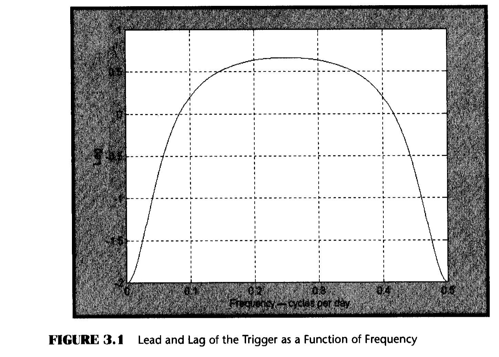
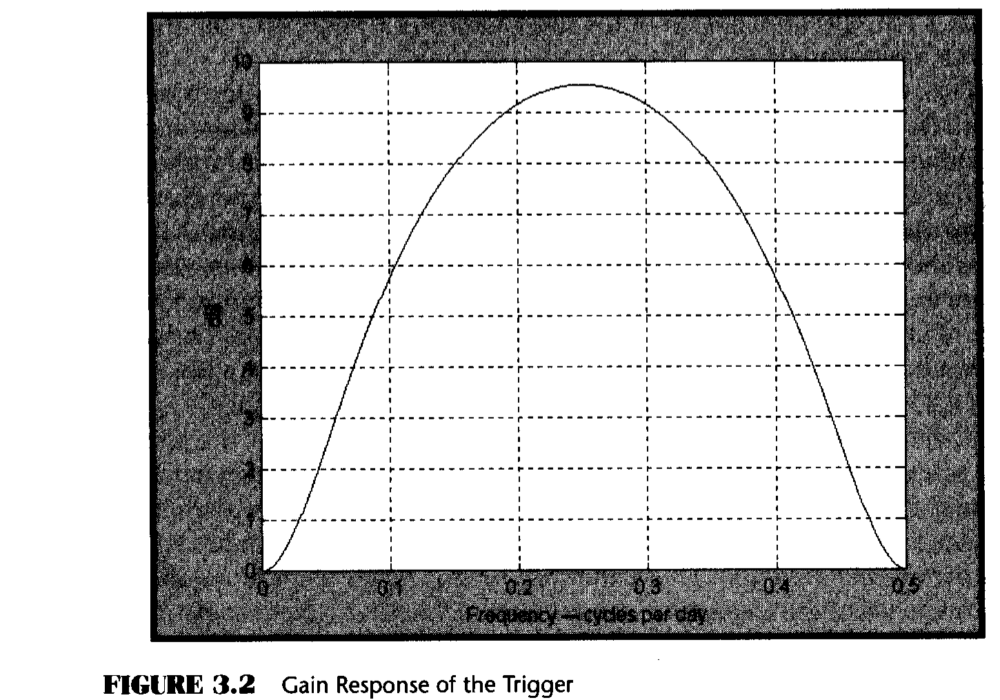
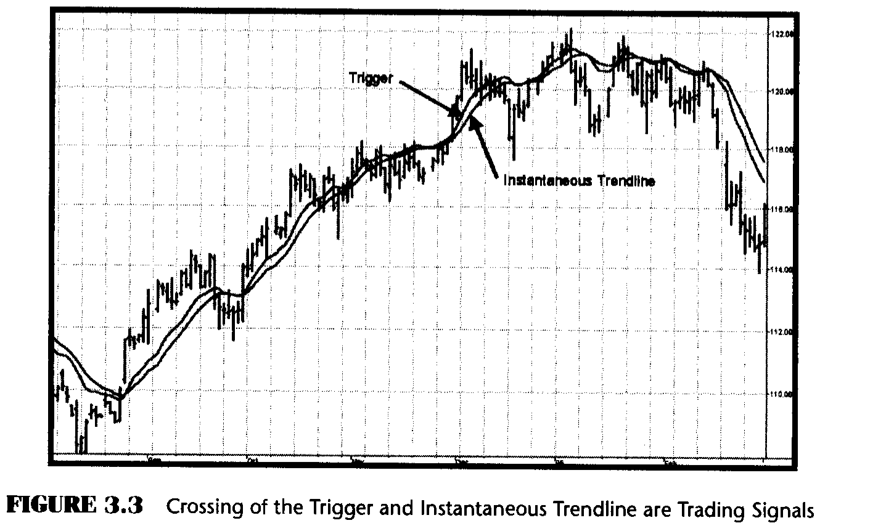

# Chapter 3: Trading the Trend

> "The market is going up," said Tom trendedly.

Having an Instantaneous Trendline with zero lag (Equations 2.8 and 2.9) is a good beginning to generate a responsive trend-following system. The system would be even more responsive if it contained a trigger that preceded the Instantaneous Trendline rather than following it and offering a confirming signal. A leading trigger can be generated by adding a two-day momentum of the Instantaneous Trendline to the Instantaneous Trendline itself.

The rationale for the leading trigger is that adding the two-day momentum to the current value in a trend is predicting where the Instantaneous Trendline will be two days from now. When plotting the trigger on the current bar, the trigger must lead the Instantaneous Trendline by two bars.



On a more mathematical level, the lag of the trigger is shown in Figure 3.1. The figure shows that the low-frequency lead is two bars and the worst-case lag occurs at a frequency of 0.25 cycles per day (a four-bar cycle period). The lag is of no concern because the attenuation of the Instantaneous Trendline makes the amplitude of the components in the vicinity of 0.25 cycles per day almost irrelevant to the overall response.

There is a price to pay for achieving the lead response of the trigger. That price is that leading functions cause a higher-frequency gain in the filter instead of attenuation, which has a smoothing effect. The gain response of the trigger has a maximum of 9.5 dB at a frequency of 0.25 cycles per day, as shown in Figure 3.2. In this case, the gain does not severely affect the smoothness of the trigger because the Instantaneous Trendline has an attenuation of 26 dB at 0.25 cycles per day. Therefore, using both terms to compute the net attenuation, the worst-case high-frequency smoothing attenuation is still about 16 dB.



## Trading Signals

The Instantaneous Trendline and the Trigger of the trend-following system are shown as indicators in Figure 3.3. The process for creating a trend-following trading system from the indicators is simple. The strategy enters a long position when the trigger crosses over the Instantaneous Trendline and enters a short position when the trigger crosses under the Instantaneous Trendline.



One unique aspect of the code is that the ITrend is forced to be a finite impulse response (FIR)-smoothed version of price for the first seven bars of the calculation. This initialization is included to cause the ITrend to converge more rapidly to its correct value from the beginning transient.

### EasyLanguage Indicator Code (Figure 3.4)

```easylanguage
Inputs: Price((H+L)/2),
        alpha(.07);

Vars:   Smooth(0),
        ITrend(0),
        Trigger(0);

ITrend = (alpha - alpha*alpha/4)*Price
       + .5*alpha*alpha*Price[1] - (alpha
       - .75*alpha*alpha)*Price[2] + 2
       *(1 - alpha)*ITrend[1] - (1 - alpha)
       *(1 - alpha)*ITrend[2];

If currentbar < 7 then ITrend = (Price + 2*Price[1]
    + Price[2]) / 4;

Trigger = 2*ITrend - ITrend[2];

Plot1(ITrend, "ITrend");
Plot2(Trigger, "Trig");
```

*Figure 3.4: EasyLanguage Code for the ITrend Indicator*

### eSignal Formula Script (EFS) Indicator Code (Figure 3.5)

```javascript
/*****************************************************
 Title: Instantaneous Trendline
 *****************************************************/
function preMain() {
    setPriceStudy(true);
    setStudyTitle("Instantaneous Trendline");
    setCursorLabelName("IT", 0);
    setDefaultBarThickness(2, 0);
}

var a = 0.05;
var IT = 0;
var IT1 = 0;
var IT2 = 0;
var Price = 0;
var Price1 = 0;
var Price2 = 0;

function main() {
    if (getBarState() == BARSTATE_NEWBAR) {
        IT2 = IT1;
        IT1 = IT;
        Price2 = Price1;
        Price1 = Price;
    }
    Price = close();
    IT = (a - ((a/2)*(a/2)))*Price + ((a*a)/2)*Price1
       - (a - (3*(a*a))/4)*Price2 + 2*(1-a)*IT1
       - ((1-a)*(1-a))*IT2;
    return (IT);
}
```

*Figure 3.5: EFS Code for the ITrend Indicator*

## Limit Orders and Reversal Protection

Experience has shown that greater profits result from using limit orders rather than market orders or stop orders. In the EasyLanguage trading strategy code, the level of the limit order is set to be 35 percent of the current bar's range added onto the closing price (in the case of a short signal) or subtracted from the closing price (in the case of a long signal). The 35 percent is the input variable RngFrac, and is an optimizable parameter.

Not all trading signals are perfect. With the crossover strategy it is possible to be on the wrong side of the trade for a substantial period. For this reason, a rule is added that if the price goes against your position by more than some percentage, the strategy will correct itself and automatically reverse to the opposite position. The percentage is supplied as the input variable RevPct (default value of 1.5 percent, RevPct = 1.015).

### EasyLanguage Trading Strategy (Figure 3.6)

```easylanguage
Inputs: Price((H+L)/2),
        alpha(.07),
        RngFrac(.35),
        RevPct(1.015);

Vars:   Smooth(0),
        ITrend(0),
        Trigger(0);

ITrend = (alpha - alpha*alpha/4)*Price
       + .5*alpha*alpha*Price[1] - (alpha
       - .75*alpha*alpha)*Price[2] + 2
       *(1 - alpha)*ITrend[1] - (1 - alpha)
       *(1 - alpha)*ITrend[2];

If currentbar < 7 then ITrend = (Price + 2*Price[1]
    + Price[2]) / 4;

Trigger = 2*ITrend - ITrend[2];

If Trigger Crosses Over ITrend then Buy Next Bar at
    Close - RngFrac*(High - Low) Limit;
If Trigger Crosses Under ITrend then Sell Short Next
    Bar at Close + RngFrac*(High - Low) Limit;

If MarketPosition = 1 and Close < EntryPrice/RevPct
    then Sell Short Next Bar On Open;
If MarketPosition = -1 and Close > RevPct*EntryPrice
    then Buy Next Bar on Open;
```

*Figure 3.6: EasyLanguage Code for the Instantaneous Trendline Trading Strategy*

### eSignal Formula Script (EFS) Trading Strategy (Figure 3.7)

```javascript
/*****************************************************
 Title: ITrend Trading Strategy
 Coded By: Chris D. Kryza (Divergence Software, Inc.)
 Email: c.kryza@gqte.net
 Incept: 06/27/2003
 Version: 1.0.0
 *****************************************************/

//External Variables
var grID = 0;
var nBarCount = 0;
var xOver = 0;
var nStatus = 0;
var nEntryPrice = 0;
var nDirection = 0;
var nLimitPrice = 0;
var nAdj1 = null;
var aPriceArray = new Array();
var aITrendArray = new Array();

function preMain() {
    var x;
    setPriceStudy(true);
    setStudyTitle("ITrend Strategy");
    setCursorLabelName("ITrend", 0);
    setCursorLabelName("Trig", 1);
    setDefaultBarFgColor(Color.blue, 0);
    setDefaultBarFgColor(Color.red, 1);
    //initialize arrays
    for (x = 0; x < 10; x++) {
        aPriceArray[x] = 0.0;
        aITrendArray[x] = 0.0;
    }
}

function main(Alpha, RngFrac, RevPct) {
    var x;
    var nPrice;
    if (getCurrentBarIndex() == 0) return;

    //initialize parameters if necessary
    if (Alpha == null) Alpha = 0.07;
    if (RngFrac == null) RngFrac = 0.35;
    if (RevPct == null) RevPct = 1.015;

    if (getBarState() == BARSTATE_ALLBARS) return null;

    if (nAdj1 == null) nAdj1 = (high() - low()) * 0.20;

    //on each new bar, save array values
    if (getBarState() == BARSTATE_NEWBAR) {
        nBarCount++;
        aPriceArray.pop();
        aPriceArray.unshift(0);
        aITrendArray.pop();
        aITrendArray.unshift(0);
    }

    nPrice = (high() + low()) / 2;
    aPriceArray[0] = nPrice;
    if (aPriceArray[2] == 0) return;

    if (nBarCount < 7) {
        aITrendArray[0] = (nPrice
            + 2*aPriceArray[1]
            + aPriceArray[2]) / 4;
    } else {
        aITrendArray[0] = (Alpha
            - Alpha*Alpha/4) * nPrice
            + 0.5*Alpha*Alpha * aPriceArray[1]
            - (Alpha - 0.75*Alpha*Alpha)
            * aPriceArray[2] + 2*(1-Alpha)
            * aITrendArray[1] - (1-Alpha)
            * (1-Alpha) * aITrendArray[2];
    }

    if (aITrendArray[2] == 0) return;
    nTrig = 2 * aITrendArray[0] - aITrendArray[2];

    nStatus = 0;
    if (Strategy.isLong()) nStatus = 1;
    if (Strategy.isShort()) nStatus = -1;

    var bReverseTrade = false;
    if (nStatus == 1 && close() < (nEntryPrice/RevPct)) {
        ReverseToShort();
        bReverseTrade = true;
    } else if (nStatus == -1 && close() > (RevPct*nEntryPrice)) {
        ReverseToLong();
        bReverseTrade = true;
    }

    //check for new signals
    if (bReverseTrade == false) {
        if (nTrig > aITrendArray[0]) {
            if (xOver == -1 && nStatus != 1) {
                nLimitPrice = Math.max(low(), (close()
                    - (high()-low()) * RngFrac));
                LongLimit(nLimitPrice);
                nDirection = 1;
            }
            xOver = 1;
        } else if (nTrig < aITrendArray[0]) {
            if (xOver == 1 && nStatus != -1) {
                nLimitPrice = Math.min(high(), (close()
                    + (high()-low()) * RngFrac));
                ShortLimit(nLimitPrice);
                nDirection = -1;
            }
            xOver = -1;
        }
    }

    if (!isNaN(aITrendArray[0])) {
        return new Array(aITrendArray[0], nTrig);
    }
}

function LongLimit(nPrice) {
    Strategy.doLong("Long", Strategy.LIMIT,
        Strategy.THISBAR, Strategy.DEFAULT, nPrice);
    nEntryPrice = nPrice;
    drawShapeRelative(0, low()-nAdj1, Shape.UPARROW,
        "", Color.lime, Shape.ONTOP, gID());
    return;
}

function ShortLimit(nPrice) {
    Strategy.doShort("Short", Strategy.LIMIT,
        Strategy.THISBAR, Strategy.DEFAULT, nPrice);
    nEntryPrice = nPrice;
    drawShapeRelative(0, high()+nAdj1, Shape.DOWNARROW,
        "", Color.maroon, Shape.ONTOP, gID());
    return;
}

function ReverseToLong() {
    Strategy.doLong("Reverse to Long",
        Strategy.MARKET, Strategy.NEXTBAR, Strategy.DEFAULT);
    drawShapeRelative(1, low(1)-nAdj1,
        Shape.UPARROW, "", Color.lime, Shape.ONTOP, gID());
    nEntryPrice = open(1);
    nStatus = 1;
    nDirection = 0;
    nLimitPrice = 0;
    return;
}

function ReverseToShort() {
    Strategy.doShort("Reverse to Short",
        Strategy.MARKET, Strategy.NEXTBAR, Strategy.DEFAULT);
    drawShapeRelative(1, high(1)+nAdj1,
        Shape.DOWNARROW, "", Color.maroon, Shape.ONTOP, gID());
    nEntryPrice = open(1);
    nStatus = -1;
    nDirection = 0;
    nLimitPrice = 0;
    return;
}

function gID() {
    grID++;
    return(grID);
}
```

*Figure 3.7: EFS Code for the Instantaneous Trendline Trading Strategy*

## Trading Results

I applied the strategy code to several currency futures because it is well known that currencies tend to trend. I additionally introduced a $2,500 money management stop to further avoid giving back accumulated profits.

**Table 3.1: Sample Trading Results Using the Instantaneous Trendline Strategy**

| Future | Net Profit | Number of Trades | Percent Profitable | Profit Factor | Max DD |
|--------|-----------|-----------------|-------------------|--------------|--------|
| EC (4/81-3/03) | $201,812 | 230 | 42.2% | 1.89 | ($26,775) |
| JY (9/81-3/03) | $221,312 | 229 | 48.5% | 2.50 | ($11,712) |
| SF (6/76-3/03) | $129,175 | 337 | 45.1% | 1.52 | ($15,387) |

The time span is on the order of a quarter century, and a relatively large number of trades are taken. The Instantaneous Trend Strategy consists of only a few independent parameters. Since the ratio of the number of trades to the number of parameters is large and since the trading took place over a large time span, it is highly unlikely that the strategy has been curve fitted. Curve fitting is a weakness of many technical analysis trading strategies.

The performance results of this strategy are comparable to, or exceed, the performance of commercial systems costing thousands of dollars.

## Key Points to Remember

- The Instantaneous Trendline has zero lag.
- The Instantaneous Trendline has about the same smoothing as an exponential moving average (EMA) using the same alpha.
- The smoothing enables the use of a trading trigger that has a two-bar lead.
- Trading signals are generated by the crossing of the Trigger line and the Instantaneous Trendline.
- Trade entries are made on limit orders to capture a larger range of the trade and to eliminate slippage losses.
- Major losses are avoided by recognizing when a trade is on the wrong side and reversing position.
- The Instantaneous Trendline Strategy can be optimized for application to many stocks and commodity markets.
