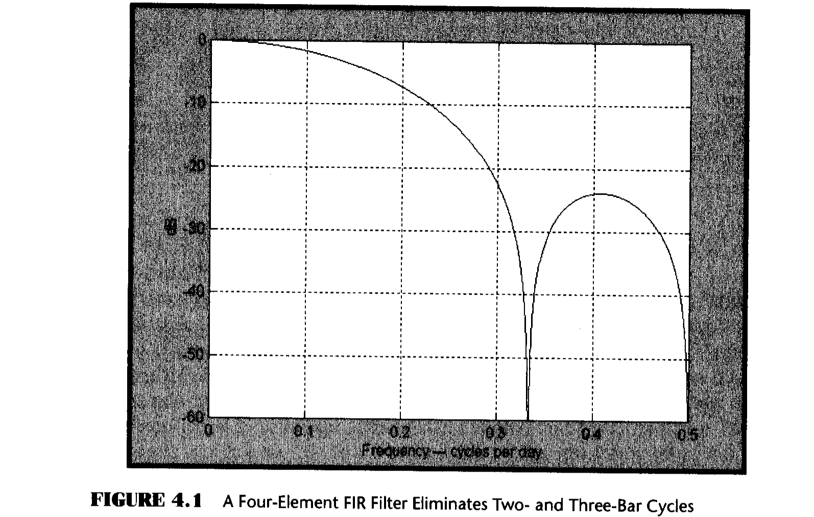
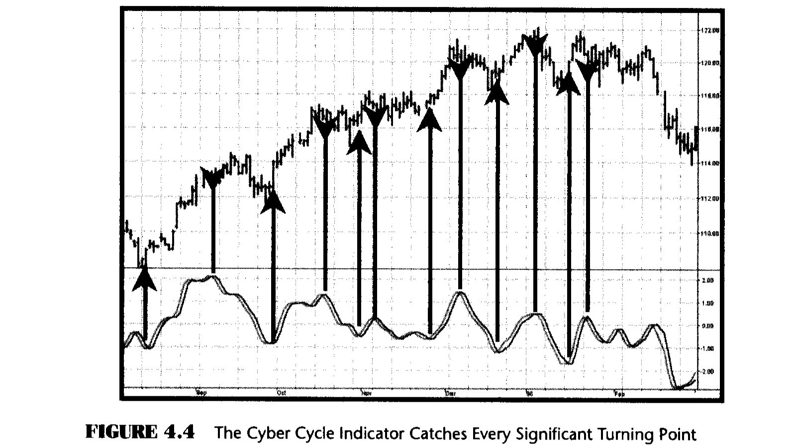
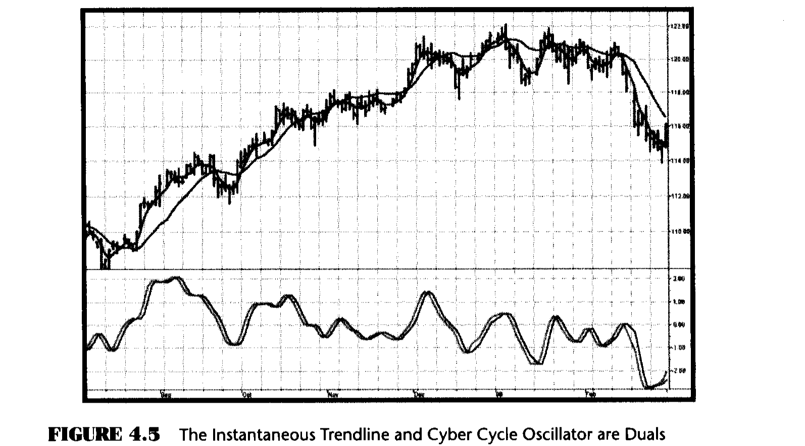
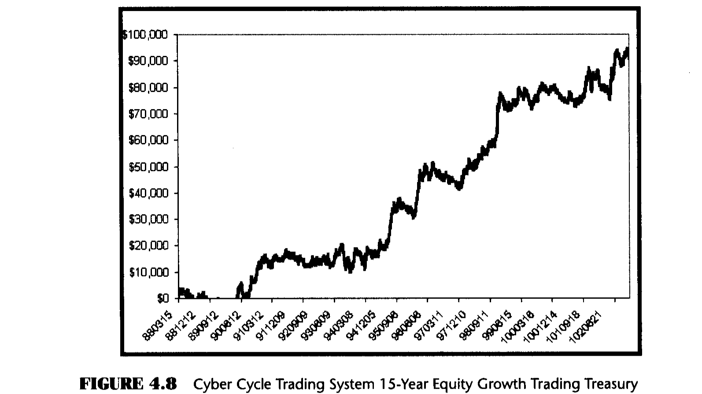

# Chapter 4: Trading the Cycle

> "It happens again and again," said Tom periodically.

Equation 2.5 described a high-pass filter that isolated the cycle mode components. Essentially all that need be done to generate a cycle-based indicator is to plot the results of this equation. However, some smoothing is required to remove the two-bar and three-bar components that detract from the interpretation of the cyclic signals. These components can be removed with a simple finite impulse response (FIR) low-pass filter as

$$Smooth = (Price + 2 \times Price[1] + 2 \times Price[2] + Price[3]) / 6 \tag{4.1}$$

The lag of the Smooth filter of Equation 4.1 is 1.5 bars at all frequencies. Figure 4.1 demonstrates that the Smooth filter eliminates the two- and three-bar cycle components. The Smooth filter is to be used as an additional filter to remove the distracting very-high-frequency components, thus creating an indicator that is easier to interpret for trading.



The EasyLanguage code to make a cycle component indicator is given in Figure 4.2 and the eSignal Formula Script (EFS) code is given in Figure 4.3. I call this the Cyber Cycle Indicator. After the inputs and variables are defined, the smoothing filter of Equation 4.1 and the high-pass filter of Equation 2.7 are computed. They are followed by an initialization condition that facilitates a rapid convergence at the beginning of the input data. A trading trigger signal is created by delaying the cycle by one bar.

```easylanguage
Inputs: Price((H+L)/2),
        alpha(.07);

Vars:   Smooth(0),
        Cycle(0);

Smooth = (Price + 2*Price[1] + 2*Price[2]
    + Price[3])/6;
Cycle = (1 - .5*alpha)*(1 - .5*alpha)*(Smooth
    - 2*Smooth[1] + Smooth[2]) + 2*(1 - alpha)
    *Cycle[1] - (1 - alpha)*(1 - alpha)*Cycle[2];
If currentbar < 7 then Cycle = (Price - 2*Price[1]
    + Price[2]) / 4;

Plot1(Cycle, "Cycle");
Plot2(Cycle[1], "Trigger");
```

*Figure 4.2: EasyLanguage Code for the Cyber Cycle Indicator*

```javascript
/***************************************************
Title:          Cyber Cycle
***************************************************/
function preMain() {
    setStudyTitle("High Pass Filter");
    setCursorLabelName("HPF", 0);
    setDefaultBarThickness(2, 0);
}

var a = 0.07;
var HPF = 0;
var HPF1 = 0;
var HPF2 = 0;
var Price = 0;
var Price1 = 0;
var Price2 = 0;

function main() {
    if (getBarState() == BARSTATE_NEWBAR) {
        HPF2 = HPF1;
        HPF1 = HPF;
        Price2 = Price1;
        Price1 = Price;
    }

    Price = close();

    HPF = ((1-(a/2))*(1-(a/2))) * (Price - 2*Price1
        + Price2) + 2*(1-a)*HPF1 - ((1-a)*(1-a))*HPF2;

    return (HPF);
}
```

*Figure 4.3: EFS Code for the Cyber Cycle Indicator*

Trading the Cyber Cycle Indicator is straightforward. Buy when the Cycle line crosses over the Trigger line. You are at the bottom of the cycle at this point. Sell when the Cycle line crosses under the Trigger line. You are at the top of the cycle in this case. Figure 4.4 illustrates that each of the major turning points is captured by the Cycle line crossing the Trigger line. To be sure, there are crossings at other than the cyclic turning points. Many of these can be eliminated by discretionary traders using their experience or others of their favorite tools.



One of the more interesting aspects of the Cyber Cycle is that it was developed simultaneously with the Instantaneous Trendline. They are opposite sides of the same coin because the total frequency content of the market being analyzed is in one indicator or the other. This is important because the conventional methods of using moving averages and oscillators can be dispensed with. The significance of this duality is demonstrated in Figure 4.5.

A low-lag four-bar weighted moving average (WMA) is plotted in Figure 4.5 for comparison with the action of the Instantaneous Trendline. Note that each time the WMA crosses the Instantaneous Trendline the Cyber Cycle Oscillator is also crossing its zero line. Since there is essentially no lag in the Instantaneous Trendline we can, for the first time, use an indicator overlay on prices in exactly the same way we have traditionally used oscillators. That is, when the prices cross the Instantaneous Trendline you can start to prepare for a reversal when prices reach a maximum excursion from the Instantaneous Trendline. Since there is only a small lag in the Instantaneous Trendline, it represents a short-term mean of prices. This being the case, we can use the old principle that prices revert to their mean.



But what is the best way to exploit the mean reversion? The false signals arising from use of the Cyber Cycle are more problematic for automatic trading systems. The first thing that must be understood about indicators is that they are invariably late. No indicator can precede an event from which it is derived. This is particularly important when trading short-term cycles.

We need an indicator that predicts the turning point so the trade can be made at the turning point or even before it occurs. In the code of Figure 4.2 we know we induce 1.5 bars of lag due to the calculation of Smooth. The cycle equation contributes some small amount of lag also, perhaps half a bar. The Trigger lags the Cycle by one bar, so that their crossing introduces at least another bar of lag. Finally, we can't execute the trade until the bar after the signal is observed. In total, that means our trade execution will be at least four bars late. If we are working with an eight-bar cycle, that means the signal will be exactly wrong. We could do better to buy when the signal says Sell, and vice versa.

The difficulties arising from the lag suggest a way to build an automatic trading strategy. Suppose we choose to use the trading signal in the opposite direction of the signal. That will work if we can introduce lag so the correct signal will be given in the more general case, not just the case of an eight-bar cycle. Figure 4.6 is the EasyLanguage code for the Cyber Cycle strategy. It starts exactly the same as the Cyber Cycle Indicator. I then introduce the variable Signal, which is an exponential moving average of the Cycle variable. The exponential moving average generates the desired lag in the trading signal. As derived in *Rocket Science for Traders*, the relationship between the alpha of an exponential moving average and lag is

$$\alpha = \frac{1}{Lag + 1} \tag{4.2}$$

```easylanguage
Inputs: Price((H+L)/2),
        alpha(.07),
        Lag(9);

Vars:   Smooth(0),
        Cycle(0),
        alpha2(0),
        Signal(0);

Smooth = (Price + 2*Price[1] + 2*Price[2]
    + Price[3])/6;
Cycle = (1 - .5*alpha)*(1 - .5*alpha)*(Smooth
    - 2*Smooth[1] + Smooth[2]) + 2*(1 - alpha)
    *Cycle[1] - (1 - alpha)*(1 - alpha)*Cycle[2];
If currentbar < 7 then Cycle = (Price - 2*Price[1]
    + Price[2]) / 4;

alpha2 = 1 / (Lag + 1);
Signal = alpha2*Cycle + (1 - alpha2)*Signal[1];

If Signal Crosses Under Signal[1] then Buy Next
    Bar on Open;
If Signal Crosses Over Signal[1] then Sell Short Next
    Bar on Open;

If MarketPosition = 1 and PositionProfit
    < 0 and BarsSinceEntry > 8 then Sell This Bar;
If MarketPosition = -1 and PositionProfit
    < 0 and BarsSinceEntry > 8 then Buy To Cover This Bar;
```

*Figure 4.6: EasyLanguage Code for the Cyber Cycle Trading Strategy*

This relationship is used to create the variable alpha2 in the code and the variable Signal using the exponential moving average.

The trading signals using the variable Signal crossing itself delayed by one bar are exactly the opposite of the trading signals I would have used if there were no delay. But, since the variable Signal is delayed such that the net delay is less than half a cycle, the trading signals are correct to catch the next cyclic reversal.

The idea of betting against the correct direction by waiting for the next cycle reversal can be pretty scary because that reversal may "never" happen because the market takes off in a trend. For this reason I included two lines of code that are escape mechanisms if we were wrong in our entry signal. These last two lines of code in Figure 4.6 reverse the trading position if we have been in the trade for more than eight bars and the trade has an open position loss.

The EFS code for the Cyber Cycle Trading Strategy is given in Figure 4.7.

The trading strategy of Figures 4.6 and 4.7 was applied to Treasury Bond futures because this contract tends to cycle and not stay in a trend for long periods. The performance response from January 4, 1988 to March 3, 2003, a period in excess of 15 years, produced the results shown in Table 4.1. These performance results, and the consistent equity growth depicted in Figure 4.8, exceed the results of most commercially available trading systems designed for Treasury Bonds.

```javascript
/***********************************************************
Title:          Cyber Cycle Trading Strategy
Coded By:       Chris D. Kryza (Divergence Software, Inc.)
Email:          c.kryza@gte.net
Incept:         06/27/2003
Version:        1.0.0
Fix History:
06/27/2003 - Initial Release
1.0.0
***********************************************************/

//External Variables
var grID = 0;
var nBarCount = 0;
var nStatus = 0;    //0=flat, -1=short, 1=long
//var nTrigger = 0; //buy/sell on next open
var nBarsInTrade = 0;
var nEntryPrice = 0;
var nAdj1 = 0;
var nAdj2 = 0;
var aPriceArray = new Array();
var aSmoothArray = new Array();
var aCycleArray = new Array();
var aSignalArray = new Array();

//== PreMain function required by eSignal to set things up
function preMain() {
    var x;
    //setPriceStudy( true );
    setStudyTitle("CyberCycle Strategy");
    //setShowCursorLabel( false );
    setCursorLabelName("Signal ", 0);
    setCursorLabelName("Signal1", 1);
    setDefaultBarFgColor(Color.blue, 0);
    setDefaultBarFgColor(Color.red, 1);

    //initialize arrays
    for (x=0; x<10; x++) {
        aPriceArray[x] = 0.0;
        aSmoothArray[x] = 0.0;
        aCycleArray[x] = 0.0;
        aSignalArray[x] = 0.0;
    }
}

//== Main processing function
function main( Alpha, Lag ) {
    var x;
    var nPrice;
    var nAlpha2;

    if (getCurrentBarIndex() == 0) return;

    //initialize parameters if necessary
    if ( Alpha == null ) {
        Alpha = 0.07;
    }
    if ( Lag == null ) {
        Lag = 20;
    }

    // study is initializing
    if (getBarState() == BARSTATE_ALLBARS) {
        return null;
    }

    //on each new bar, save array values
    if ( getBarState() == BARSTATE_NEWBAR ) {
        nBarCount++;
        nBarsInTrade++;

        //variables for image alignment
        nAdj1 = (high()-low()) * 0.20;
        nAdj2 = (high()-low()) * 0.35;

        aPriceArray.pop();
        aPriceArray.unshift( 0 );
        aSmoothArray.pop();
        aSmoothArray.unshift( 0 );
        aCycleArray.pop();
        aCycleArray.unshift( 0 );
        aSignalArray.pop();
        aSignalArray.unshift( 0 );
    }

    //Cyber Cycle formula
    nPrice = ( high()+low() ) / 2;
    aPriceArray[0] = nPrice;

    if (aPriceArray[3] == 0) return;

    aSmoothArray[0] = ( aPriceArray[0]
        + 2*aPriceArray[1] + 2*aPriceArray[2]
        + aPriceArray[3] ) / 6;

    if ( nBarCount < 7 ) {
        aCycleArray[0] = ( aPriceArray[0]
            - 2*aPriceArray[1]
            + aPriceArray[2] ) / 4;
    }
    else {
        aCycleArray[0] = (1 - 0.5*Alpha )
            * ( 1 - 0.5*Alpha )
            * ( aSmoothArray[0]
            - 2*aSmoothArray[1]
            + aSmoothArray[2] ) + 2*( 1-Alpha )
            * aCycleArray[1] - ( 1-Alpha )
            * ( 1-Alpha ) * aCycleArray[2];
    }

    //create the actual trading signals
    nAlpha2 = 1 / (Lag + 1 );
    aSignalArray[0] = nAlpha2 * aCycleArray[0]
        + ( 1.0 - nAlpha2 ) * aSignalArray[1];

    //process our trading strategy code
    nStatus = 0;
    if (Strategy.isLong() == true) nStatus = 1;
    if (Strategy.isShort() == true) nStatus = -1;

    //currently not in a trade so look for a trigger
    if ( nBarCount > 10 && nStatus == 0 ) {
        //signal cross down - we buy
        if ( aSignalArray[0] < aSignalArray[1]
                && aSignalArray[1]
                >= aSignalArray[2] ) {
            goLong();
        }
        //signal cross up - we sell
        if ( aSignalArray[0] > aSignalArray[1]
                && aSignalArray[1]
                <= aSignalArray[2] ) {
            goShort();
        }
    }
    //currently in a trade so look for profit stop or reversal
    else if ( nBarCount > 10 && nStatus != 0 ) {
        if ( nStatus == 1 ) {  //in a long trade
            //if trade is unprofitable after 8 bars, exit position
            if ( close() - nEntryPrice
                    < 0 && nBarsInTrade > 8 ) {
                closeLong();
            }
            //otherwise, check for trigger in other direction
            if ( aSignalArray[0]
                    > aSignalArray[1]
                    && aSignalArray[1]
                    <= aSignalArray[2] ) {
                goShort();
            }
        } else if ( nStatus == -1 ) {  //in a short trade
            //if trade is unprofitable after 8 bars, exit position
            if ( nEntryPrice - close() < 0
                    && nBarsInTrade > 8 ) {
                closeShort();
            }
            //otherwise, check for trigger in other direction
            if ( aSignalArray[0]
                    < aSignalArray[1]
                    && aSignalArray[1]
                    >= aSignalArray[2] ) {
                goLong();
            }
        }
    }

    return new Array(aSignalArray[0], aSignalArray[1]);
}

//enter a short trade
function goShort() {
    drawShapeRelative(1, aSignalArray[1],
        Shape.DOWNARROW, "",
        Color.maroon, Shape.ONTOP|Shape.BOTTOM, gID());
    Strategy.doShort("Short Signal",
        Strategy.MARKET, Strategy.NEXTBAR,
        Strategy.DEFAULT );
    nStatus = -1;
    nEntryPrice = open(1);
    nBarsInTrade = 1;
}

//exit a short trade
function closeShort() {
    drawShapeRelative(0, aSignalArray[0],
        Shape.DIAMOND, "",
        Color.maroon, Shape.ONTOP|Shape.TOP, gID());
    Strategy.doCover("Cover Short",
        Strategy.MARKET, Strategy.THISBAR,
        Strategy.ALL );
    nStatus = 0;
    nEntryPrice = 0;
}

//enter a long trade
function goLong() {
    drawShapeRelative(1, aSignalArray[1],
        Shape.UPARROW, "",
        Color.lime, Shape.ONTOP|Shape.TOP, gID());
    Strategy.doLong("Long Signal", Strategy.MARKET,
        Strategy.NEXTBAR, Strategy.DEFAULT );
    nStatus = 1;
    nEntryPrice = open(1);
    nBarsInTrade = 1;
}

//exit a long trade
function closeLong() {
    drawShapeRelative(0, aSignalArray[0],
        Shape.DIAMOND, "",
        Color.lime, Shape.ONTOP|Shape.BOTTOM, gID());
    Strategy.doSell("Sell Long", Strategy.MARKET,
        Strategy.THISBAR, Strategy.ALL );
    nStatus = 0;
    nEntryPrice = 0;
}

//== gID function assigns unique identifier to
//   graphic/text routines
function gID() {
    grID++;
    return( grID );
}
```

*Figure 4.7: EFS Code for the Cyber Cycle Trading Strategy*

**Table 4.1** Fifteen-Year Performance of the Cyber Cycle Trading System Trading Treasury Bond Futures

| Metric | Value |
|---|---|
| Net profit | $93,156 |
| Number of trades | 430 |
| Percent profitable | 56.7% |
| Profit factor | 1.44 |
| Max drawdown | ($12,500) |
| Profit/trade | $216.64 |



## Key Points to Remember

- All indicators have lag.
- The Instantaneous Trendline and the Cyber Cycle Indicator are complementary. This enables traders to use indicators overlaid on prices the same way conventional oscillators are used.
- A viable cycle-based trading system delays the signal slightly less than a half cycle to generate leading turning point entry and exit signals.
- Major losses are avoided by recognizing when a trade is on the wrong side and reversing position.
