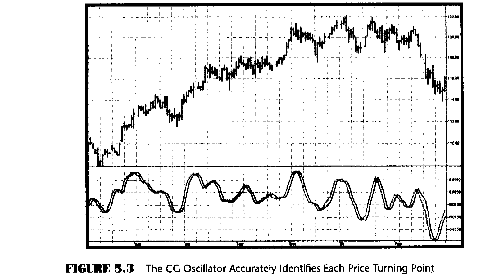

# Chapter 5: The CG Oscillator

> "Add up this list of n numbers and then divide the sum by n," said Tom meanly.

In this chapter I describe a new oscillator that is unique because it is smoothed and has essentially zero lag. The smoothing enables clear identification of turning points and the zero-lag aspect enables action to be taken early in the move. This oscillator, which is the serendipitous result of my research into adaptive filters, has substantial advantages over conventional oscillators used in technical analysis. The CG in the name of the oscillator stands for the center of gravity of the prices over the window of observation.

The center of gravity (CG) of a physical object is its balance point. For example, if you balance a 12-inch ruler on your finger, the CG will be at its 6-inch point. If you change the weight distribution of the ruler by putting a paper clip on one end, then the balance point (i.e., the CG) shifts toward the paper clip. Moving from the physical world to the trading world, we can substitute the prices over our window of observation for the units of weight along the ruler. Using this analogy, we see that the CG of the window moves to the right when prices increase sharply. Correspondingly, the CG of the window moves to the left when prices decrease.

The idea of computing the center of gravity arose from observing how the lags of various finite impulse response (FIR) filters vary according to the relative amplitude of the filter coefficients. A simple moving average (SMA) is an FIR filter where all the filter coefficients have the same value (usually unity). As a result, the CG of the SMA is exactly in the center of the filter. A weighted moving average (WMA) is an FIR filter where the most recent price is weighted by the length of the filter, the next most recent price is weighted by the length of the filter less 1, and so on. The weighting terms are the filter coefficients. The filter coefficients of a WMA describe the outline of a triangle. It is well known that the CG of a triangle is located at one-third the length of the base of the triangle. In other words, the CG of the WMA has shifted to the right relative to the CG of an SMA of equal length, resulting in less lag. In all FIR filters, the sum of the product of the coefficients and prices must be divided by the sum of the coefficients so that the scale of the original prices is retained.

The most general FIR filter is the Ehlers Filter, which can be written as

$$\text{Ehlers Filter} = \frac{\sum_{i=0}^{N} c_i \cdot \text{Price}_i}{\sum_{i=0}^{N} c_i} \tag{5.1}$$

The coefficients of the Ehlers Filter can be almost any measure of variability. I have looked at momentum, signal-to-noise ratio, volatility, and even Stochastics and Relative Strength Index (RSI) values as filter coefficients. One of the most adaptive sets of coefficients arose from video edge detection filters, and was the sum of the square of the differences between each price and each previous price. In any event, the result of using different filter coefficients is to make the filter adaptive by moving the CG of the coefficients.

While I was debugging the code of an adaptive FIR filter, I noticed that the CG itself moved in exact opposition to the price swings. The CG moves to the right when prices go up and to the left when prices go down. Measured as the distance from the most recent price, the CG decreased when prices rose and increased when they fell. All I had to do was to invert the sign of the CG to get a smoothed oscillator that was in phase with the price swings and had essentially zero lag.

The CG is computed in much the same way as we computed the Ehlers Filter. The position of the balance point is the summation of the product of position within the observation window times the price at that position divided by the summation of prices across the window. The mathematical expression for this calculation is

$$\text{CG} = \frac{\sum_{i=0}^{N} (x_i + 1) \cdot \text{Price}_i}{\sum_{i=0}^{N} \text{Price}_i} \tag{5.2}$$

In this expression I added 1 to the position count because the count started with the most recent price at zero, and multiplying the most recent price by the position count would remove it from the computation. The EasyLanguage code to compute the CG Oscillator is given in Figure 5.1 and the eSignal Formula Script (EFS) code is given in Figure 5.2.

In EasyLanguage, the notation Price[N] means the price N bars ago. Thus Price[0] is the price for the current bar. Counting for the location is backward from the current bar. In the code the summation is accomplished by recursion, where the count is varied from the current bar to the length of the observation window. The numerator is the sum of the product of the bar position and the price, and the denominator is the sum of the prices. Then the CG is just the negative ratio of the numerator to the denominator. A zero counter value for CG is established by adding half the length of the observation window plus 1. Since the CG is smoothed, an effective crossover signal is produced simply by delaying the CG by one bar.

### EasyLanguage Code (Figure 5.1)

```easylanguage
Inputs: Price((H+L)/2),
        Length(10);

Vars:   count(0),
        Num(0),
        Denom(0),
        CG(0);

Num = 0;
Denom = 0;
For count = 0 to Length - 1 begin
    Num = Num + (1 + count) * (Price[count]);
    Denom = Denom + (Price[count]);
End;

If Denom <> 0 then CG = -Num/Denom + (Length + 1) / 2;

Plot1(CG, "CG");
Plot2(CG[1], "CG1");
```

*Figure 5.1: EasyLanguage Code to Compute the CG Oscillator*

### eSignal Formula Script (EFS) Code (Figure 5.2)

```javascript
/***********************************************************
Title: CG Oscillator
Coded By: Chris D. Kryza (Divergence Software, Inc.)
Email: c.kryza@gte.net
Incept: 06/27/2003
Version: 1.0.0
Fix History:
06/27/2003 - Initial Release
1.0.0
***********************************************************/

//External Variables
var nPrice = 0;
var nCG = 0;
var aPriceArray = new Array();
var aCGArray = new Array();

//== PreMain function required by eSignal to set things up
function preMain() {
    var x;
    setPriceStudy(false);
    setStudyTitle("CG Osc");
    setCursorLabelName("CG", 0);
    setCursorLabelName("Trig", 1);
    setDefaultBarFgColor(Color.blue, 0);
    setDefaultBarFgColor(Color.red, 1);

    //initialize arrays
    for (x=0; x<70; x++) {
        aPriceArray[x] = 0.0;
        aCGArray[x] = 0.0;
    }
}

//== Main processing function
function main(OscLength) {
    var x;
    var nNum;
    var nDenom;
    var nValue1;

    //initialize parameters if necessary
    if (OscLength == null) {
        OscLength = 10;
    }

    // study is initializing
    if (getBarState() == BARSTATE_ALLBARS) {
        return null;
    }

    //on each new bar, save array values
    if (getBarState() == BARSTATE_NEWBAR) {
        aPriceArray.pop();
        aPriceArray.unshift(0);
        aCGArray.pop();
        aCGArray.unshift(0);
    }

    nPrice = (high() + low()) / 2;
    aPriceArray[0] = nPrice;

    nNum = 0;
    nDenom = 0;
    for (x=0; x<OscLength; x++) {
        nNum += (1.0 + x) * (aPriceArray[x]);
        nDenom += (aPriceArray[x]);
    }

    if (nDenom != 0) nCG = -nNum/nDenom
        + (OscLength + 1) / 2;
    aCGArray[0] = nCG;

    //return the calculated values
    if (!isNaN(aCGArray[0])) {
        return new Array(aCGArray[0],
            aCGArray[1]);
    }
}
```

*Figure 5.2: EFS Code to Compute the CG Oscillator*



An example of the CG Oscillator is shown in Figure 5.3. In this case, I selected the length to be an eight-bar observation window. It is clear that every major price turning point is identified with zero lag by the CG Oscillator and the crossovers formed by its trigger. Since the CG Oscillator is filtered and smoothed, whipsaws of the crossovers are minimized. The relative amplitudes of the cyclic swings are retained. The resemblance of the CG Oscillator to the Cyber Cycle Indicator of Chapter 4 is striking. I will compare all the oscillator type indicators in a later chapter.

The appearance of the CG Oscillator varies with the selection of the observation window length. Ideally, the selected length should be half the dominant cycle length because half the dominant cycle fully captures the entire cyclic move in one direction. If the length is too long, the CG Oscillator is desensitized. For example, if the window length is one full dominant cycle, half the data pulls the CG to the right and the other half of the data pulls the CG to the left. As a result, the CG stays in the middle of the window and no motion of the CG Oscillator is observed. On the other hand, if the window length is too short, you are missing the benefits of smoothing. As a result of this case, the CG Oscillator contains higher-frequency components and is a little too nervous for profitable trading.

## Key Points to Remember

- The CG in an FIR filter is the position of the average price within the filter window length.
- The CG moves toward the most recent bar (decreases) when prices rise and moves away from the most recent bar (increases) when prices fall. Thus the CG moves exactly opposite to the price direction.
- The CG Oscillator has essentially zero lag.
- The CG Oscillator retains the relative cycle amplitude, similar to the Cyber Cycle Indicator.
