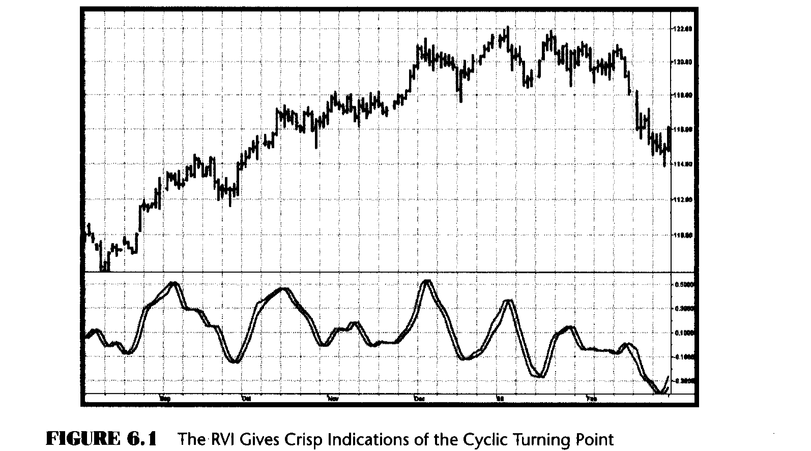

# Chapter 6: Relative Vigor Index

> "Get to the back of the boat," said Tom sternly.

It is a well-known observation that prices tend to close higher than they open in up markets. Conversely, prices close lower than they open in down markets. The vigor of this movement can be expressed relative to the trading range to produce a normalized oscillator. I call this the Relative Vigor Index (RVI). The equation to compute the RVI is:

```
RVI = (Close - Open) / (High - Low)                                  (6.1)
```

The concept of the RVI is not altogether new. As far back as 1972, Larry Williams and Jim Waters created the Accumulation/Distribution (A/D) Oscillator. They defined the buying pressure (BP) and selling pressure (SP) as:

```
BP = High - Open
SP = Close - Low
```

From these definitions, they defined their Distribution Range Factor (DRF) as:

```
DRF = (BP + SP) / (2 * (High - Low))                                (6.2)
```

If we expand the numerator of the DRF, we get:

```
DRF = (High - Open + Close - Low) / (2 * (High - Low))
    = 1/2 * (1 + (Close - Open) / (High - Low))                     (6.3)
```

Thus, the DRF is simply a biased and scaled version of the RVI. The RVI is preferred because it removes the bias and the scaling, leaving a purer indication of relative vigor.

The RVI is computed by applying the four-bar symmetrical FIR filter (from Equation 4.1) to smooth the numerator and denominator independently. That is, both the (Close - Open) component and the (High - Low) component are smoothed before the ratio is taken. Smoothing the numerator and denominator independently avoids division by zero and produces a much smoother oscillator.

The theoretical justification for the RVI is based on the observation that the sharpest rate of change for a cycle occurs at its midpoint. The derivative of a sinewave produces a negative cosine, which leads the original sinewave by a quarter cycle. Integration of this rate of change over a half cycle delays the result by a quarter cycle. The net result of the quarter-cycle lead and the quarter-cycle delay is an oscillator that is in phase with the original cycle. Thus, the RVI tends to be synchronous with the market cycle.

The trigger line for the RVI is simply the RVI delayed by one bar. Crossovers of the RVI and its trigger provide trading signals.

A default period of 8 is suggested for the RVI computation.



The RVI applied to a chart is shown in Figure 6.1. The turning points are crisp and occur in a timely fashion.

### EasyLanguage Code (Figure 6.2)

```easylanguage
Inputs: Length(10);
Vars:   Num(0),
        Denom(0),
        count(0),
        RVI(0),
        Trigger(0);

Value1 = ((Close - Open) + 2*(Close[1] - Open[1]) + 2*(Close[2] - Open[2]) + (Close[3] - Open[3]))/6;
Value2 = ((High - Low) + 2*(High[1] - Low[1]) + 2*(High[2] - Low[2]) + (High[3] - Low[3]))/6;

Num = 0;
Denom = 0;
For count = 0 to Length - 1 begin
    Num = Num + Value1[count];
    Denom = Denom + Value2[count];
End;

If Denom <> 0 then RVI = Num / Denom;

Trigger = RVI[1];

Plot1(RVI, "RVI");
Plot2(Trigger, "Trigger");
```

*Figure 6.2: EasyLanguage Code to Compute the RVI*

### eSignal Formula Script (EFS) Code (Figure 6.3)

```javascript
/***********************************************************
Title:      RVI
Coded By:   Chris D. Kryza (Divergence Software, Inc.)
Email:      c.kryza@gte.net
Incept:     06/19/2003
Version:    1.0.0
Fix History:
06/19/2003 - Initial Release
1.0.0
***********************************************************/

//External Variables
var aRVIArray = new Array();
var aValue1Array = new Array();
var aValue2Array = new Array();

//== PreMain function required by eSignal to set things up
function preMain() {
    var x;
    setPriceStudy(false);
    setStudyTitle("RVI");
    setCursorLabelName("RVI", 0);
    setCursorLabelName("Trig", 1);
    setDefaultBarFgColor(Color.blue, 0);
    setDefaultBarFgColor(Color.red, 1);
    addBand(0, PS_SOLID, Color.black, 1, -55);
    //initialize arrays
    for (x = 0; x < 70; x++) {
        aRVIArray[x] = 0.0;
        aValue1Array[x] = 0.0;
        aValue2Array[x] = 0.0;
    }
}

//== Main processing function
function main(OscLength) {
    var x;
    var nNum;
    var nDenom;

    //initialize parameters if necessary
    if (OscLength == null) {
        OscLength = 8;
    }

    // study is initializing
    if (getBarState() == BARSTATE_ALLBARS) {
        return null;
    }

    //on each new bar, save array values
    if (getBarState() == BARSTATE_NEWBAR) {
        aRVIArray.pop();
        aRVIArray.unshift(0);
        aValue1Array.pop();
        aValue1Array.unshift(0);
        aValue2Array.pop();
        aValue2Array.unshift(0);
    }

    aValue1Array[0] = ((close() - open())
        + 2 * (close(-1) - open(-1))
        + 2 * (close(-2) - open(-2))
        + (close(-3) - open(-3))) / 6;

    aValue2Array[0] = ((high() - low())
        + 2 * (high(-1) - low(-1))
        + 2 * (high(-2) - low(-2))
        + (high(-3) - low(-3))) / 6;

    nNum = 0;
    nDenom = 0;
    for (x = 0; x < OscLength; x++) {
        nNum += aValue1Array[x];
        nDenom += aValue2Array[x];
    }

    if (nDenom != 0) aRVIArray[0] = nNum / nDenom;

    //return the calculated values
    return new Array(aRVIArray[0], aRVIArray[1]);
}
```

*Figure 6.3: EFS Code to Compute the RVI*

## Key Points to Remember

- The RVI concept is that prices close higher than they open in up markets and close lower than they open in down markets.
- The RVI is a normalized oscillator, where the movement is normalized to the trading range of each bar.
- Lag-canceling four-bar symmetrical FIR filters are used to produce a readable indicator.
