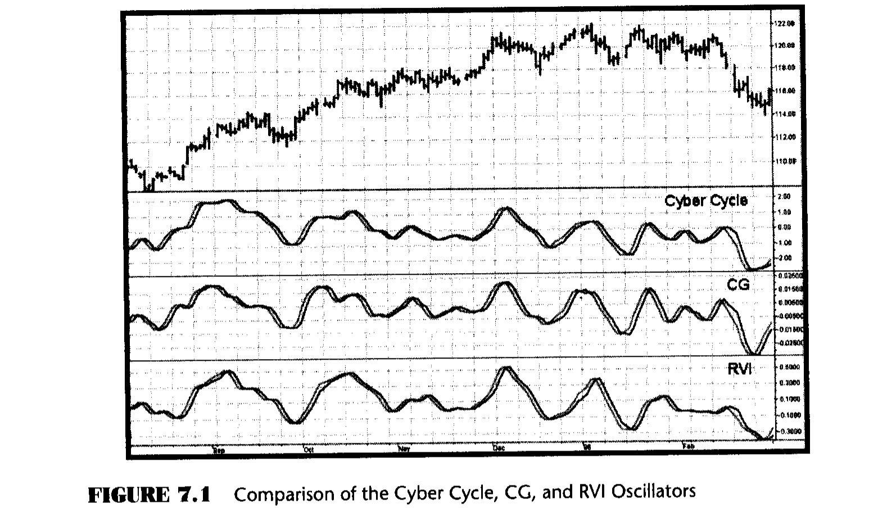
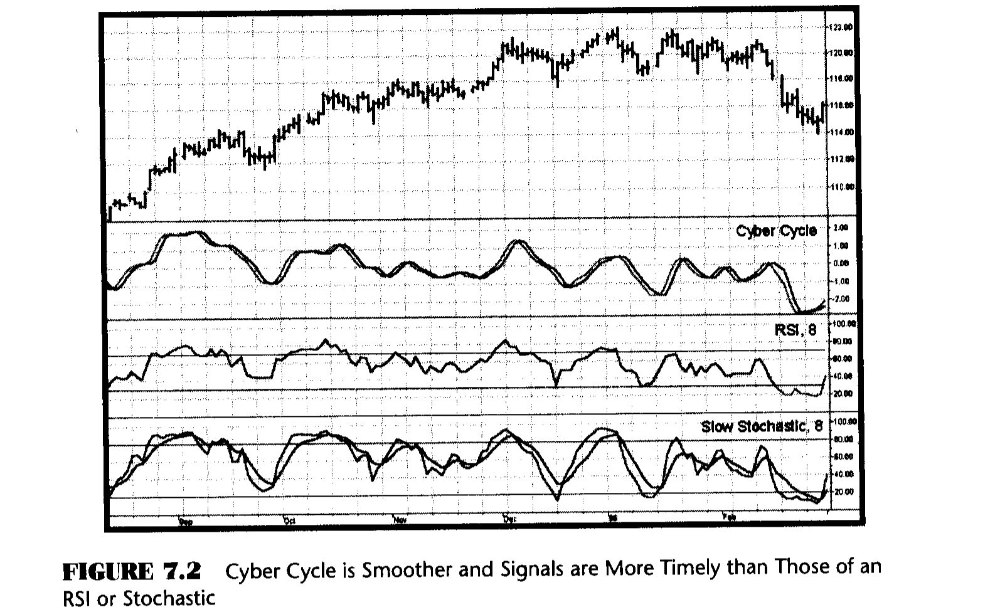

# Chapter 7: Oscillator Comparison

> "Let's play musical chairs," said Tom deceitfully.

In the previous three chapters I have described three different oscillators using three different principles. There is probably no need for more than one oscillator in your technical trading arsenal if it is a good one. It is my experience that a number of traders suffer from the "paralysis of analysis." Rather than searching for the ideal combination of tools---or worse, changing the mix of tools for every situation---it is better to settle on the few tools that work the best for you on average. The three oscillators are for your consideration. The only way to know which of the three is best is to do a comparison on the same chart using the same data for each. This comparison is shown in Figure 7.1.

Frankly, I don't see a nickel's worth of difference between the three oscillators in this particular example. All three indicate the relative cycle amplitude and correctly identify each major turning point as it occurs. If anything, the Relative Vigor Index (RVI) is slightly less susceptible to whipsaw indications. Nonetheless, I am partial to the Cyber Cycle because I know it contains only the theoretical cycle components that comprise an oscillator. I have seen greater differences between the oscillators in other data samples.

The differences will become more apparent when you insert these oscillators as part of an automatic trading strategy. In these applications one oscillator may give a signal one bar earlier than the others at critical times for the strategy. It's also true that one oscillator may have fewer short-term crossovers that lead to whipsaw trades. In any event, you now have three excellent tools for your own technical analysis. It may be that one of the oscillators will outperform the others in your application.

It may be constructive to compare just one of the oscillators I have developed to several other oscillators that are in common use on a chart using the same data as before. This standardized comparison is useful to assess the relative lag of the trading signals and the degree to which whipsaw signals are produced. Two of the more popular oscillators are the Relative Strength Index (RSI) and the Stochastic. These are compared to the Cyber Cycle in Figure 7.2, where eight-bar periods are used for comparable scaling. Whoa! Clearly, the RSI and Stochastic are more erratic than the Cyber Cycle. Waiting for confirmation for the indicators to cross the signal lines is the conventional way of minimizing the erratic behavior of the indicators. Waiting for confirmation means that the RSI and Stochastic trading signals are invariably late or that the signal is missed altogether. I could cite many more examples and many more comparison indicators, but the purpose of this book is to generate tools you can use in your own work. Since you have the code, you can test your own examples. You can also compare these new tools to your other favorite indicators.

## Key Points to Remember

- The Cyber Cycle, CG, and RVI oscillators all carry relative cycle amplitude information.
- The Cyber Cycle, CG, and RVI all indicate major turning points with minimum lag.
- The Cyber Cycle, CG, and RVI are vastly superior to standard indicators.
