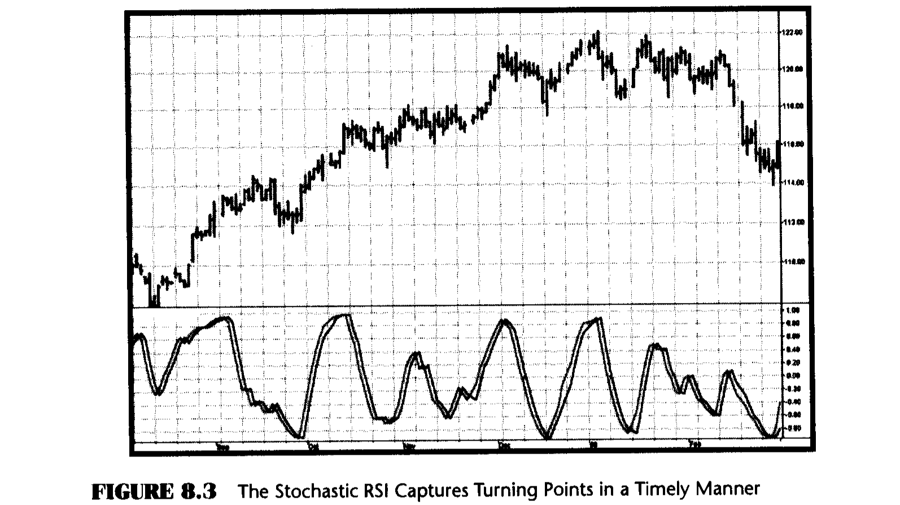
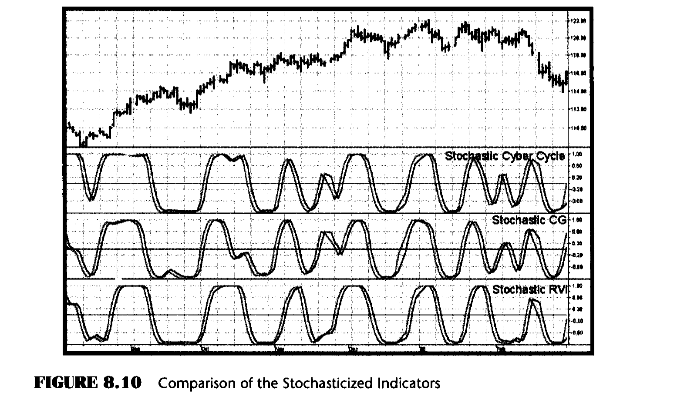
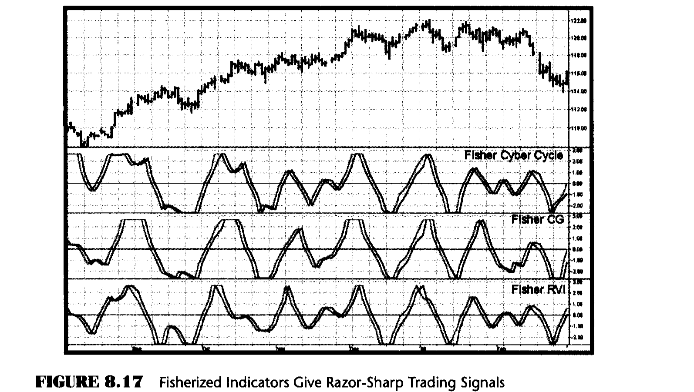

# Chapter 8: Stochasticization and Fisherization of Indicators

> "I'm of greater value to you every day," said Tom appreciatively.

There is an indicator I wish I had invented because it works pretty well. This indicator is called the Stochastic RSI. Since I didn't invent it, the best I can do is to describe it and then proceed to shamelessly adapt some of its principles to create even better indicators. All of these indicators will be described and compared in this chapter.

The name of the Stochastic RSI is descriptive of how it is calculated. First an RSI Indicator is computed from recent prices; then a Stochastic Indicator is computed using the RSI as the input variable. Finally, a weighted moving average of the Stochastic is taken to smooth it so that a workable output can be viewed.

An RSI averages the difference in ascending closing prices over a selected period separately from averaging the difference in descending closing prices. For a shorthand notation, I will call these Closes Up (CU) and Closes Down (CD). The RSI is the ratio of CU to the sum of CU and CD. If there are no CD in the selected period, the ratio is unity (1). If there are no CU in the selected period, the ratio is 0. So, if the length exactly coincides with half the period of a perfect cycle, the RSI will swing between 0 and 1. It is common to multiply the ratio by 100 to display the RSI as a percentage.

A Stochastic Indicator (definitely not a stochastic random variable) is computed by finding the highest value and the lowest value over a selected period. The Stochastic Indicator is the ratio of the difference between the current and lowest values and the difference between the highest and lowest values. It is also common to multiply this ratio by 100 to display the Stochastic Indicator as a percentage.

The EasyLanguage and EFS codes to derive the Stochastic RSI from RSI and Stochastics are given in Figures 8.1 and 8.2, respectively. Before the Stochastic RSI is plotted, it is smoothed by a weighted moving average to provide a pleasing display with minimal lag. The Trigger line displayed is the Signal line delayed by one bar. The crossing of the Stochastic RSI Signal and a Trigger line constitutes buy and sell signals of the indicator. I have taken the liberty of scaling the Stochastic RSI to swing between -1 and +1. My scaling is selected so that I can directly apply the Fisher transform to it to generate razor-sharp entry and exit signals.

The amazing thing about the Stochastic RSI is that, after all the computations, the trading signals have almost no lag. The primary reason for this is that both the RSI and the Stochastic Indicators are ratios, so that lag in the numerator is canceled by lag in the denominator. The performance of the Stochastic RSI is shown in Figure 8.3. Unlike the Cyber Cycle and CG Oscillator, the Stochastic RSI tends not to retain the relative amplitudes of the cycles. This amplitude standardization can be an advantage to traders because it removes some of the interpretive aspects of the oscillators. In Figure 8.3, the Stochastic RSI clearly captures every major turning point in a timely manner.

**Figure 8.1: EasyLanguage Code to Compute the Stochastic RSI**

```easylanguage
Inputs: RSILength(8),
        StocLength(8),
        WMALength(8);

Value1 = RSI(Close, RSILength) - Lowest(RSI(Close,
    RSILength), StocLength);
Value2 = Highest(RSI(Close, RSILength), StocLength)
    - Lowest(RSI(Close, RSILength), StocLength);

If Value2 <> 0 then Value3 = Value1 / Value2;

Value4 = 2*(WAverage(Value3, WMALength) - .5);

Plot1(Value4, "StocRSI");
Plot2(Value4[1], "Trig");
```

**Figure 8.2: EFS Code to Compute the Stochastic RSI**

```javascript
/*************************************************************
Title:      Stochastic RSI
Coded By:   Chris D. Kryza (Divergence Software, Inc.)
Email:      c.kryza@gte.net
Incept:     06/19/2003
Version:    1.0.0
Fix History:

06/19/2003 - Initial Release
1.0.0
*************************************************************/

//External Variables
var nAvgUpClose = 0;
var nAvgDnClose = 0;
var ntAvgUpClose = 0;
var ntAvgDnClose = 0;
var nValue3 = 0;
var nValue4 = 0;
var nTrig = 0;
var bInitialized = false;
var nRS = 0;
var nRSI = 0;
var aRSIArray = new Array();
var aValue3Array = new Array();

//== PreMain function required by eSignal to set things up
function preMain() {
    var x;
    setPriceStudy(false);
    setStudyTitle("StochasticRSI");
    setCursorLabelName("StocRSI", 0);
    setCursorLabelName("Trig", 1);
    setDefaultBarFgColor(Color.blue, 0);
    setDefaultBarFgColor(Color.red, 1);

    //initialize arrays
    for (x = 0; x < 70; x++) {
        aRSIArray[x] = 0.0;
        aValue3Array[x] = 0.0;
    }
}

//== Main processing function
function main(RSILength, StocLength, WMALength) {
    var x;
    var nDiff;
    var nDivBy;
    var nValue1;
    var nValue2;

    //initialize parameters if necessary
    if (RSILength == null) {
        RSILength = 8;
    }
    if (StocLength == null) {
        StocLength = 8;
    }
    if (WMALength == null) {
        WMALength = 8;
    }

    // study is initializing
    if (getBarState() == BARSTATE_ALLBARS) {
        return null;
    }

    //initialize the basic RSI calculation
    if (bInitialized == false) {
        nAvgUpClose = 0.0;
        nAvgDnClose = 0.0;
        for (x = 0; x < RSILength; x++) {
            nDiff = close(-x) - close(-(x + 1));
            if (nDiff > 0) {
                nAvgUpClose += nDiff;
            }
            else {
                nAvgDnClose += Math.abs(nDiff);
            }
        }
        nAvgUpClose /= RSILength;
        nAvgDnClose /= RSILength;
        nRS = nAvgUpClose / nAvgDnClose;
        nRSI = 100.0 - (100.0 / (1.0 + nRS));
        bInitialized = true;
    }
    //continue the RSI calculation on subsequent bars
    else {
        if (getBarState() == BARSTATE_NEWBAR) {
            nAvgUpClose = ntAvgUpClose;
            nAvgDnClose = ntAvgDnClose;
            if (!isNaN(nRSI)) {
                aRSIArray.pop();
                aRSIArray.unshift(0);
                aValue3Array.pop();
                aValue3Array.unshift(0);
                nTrig = nValue4;
            }
        }
        nDiff = close(0) - close(-1);
        if (nDiff > 0) {
            ntAvgUpClose = ((nAvgUpClose
                * (RSILength - 1)) + nDiff)
                / RSILength;
            ntAvgDnClose = ((nAvgDnClose
                * (RSILength - 1)) + 0)
                / RSILength;
        }
        else {
            ntAvgUpClose = ((nAvgUpClose
                * (RSILength - 1)) + 0)
                / RSILength;
            ntAvgDnClose = ((nAvgDnClose
                * (RSILength - 1))
                + Math.abs(nDiff))
                / RSILength;
        }
        nRS = ntAvgUpClose / ntAvgDnClose;
        nRSI = 100.0 - (100.0 / (1 + nRS));
        aRSIArray[0] = nRSI;
    }

    //calculate the StocRSI using the RSI Array we have created.
    nValue1 = nRSI - Lowest(StocLength);
    nValue2 = Highest(StocLength) - Lowest(StocLength);
    nValue3 = 0;
    if (nValue2 != 0) nValue3 = (nValue1 / nValue2);
    aValue3Array[0] = nValue3;

    //compute weighted moving average
    nValue4 = 0;
    nDivBy = 0;
    for (x = 0; x < WMALength; x++) {
        nValue4 += (aValue3Array[x] * (WMALength - x));
        nDivBy += (WMALength - x);
    }
    nValue4 = nValue4 / nDivBy;
    nValue4 = 2.0 * (nValue4 - 0.5);

    //return the calculated values
    if (!isNaN(nValue4)) {
        return new Array(nValue4, nTrig);
    }
}

/*************************************************************
SUPPORT FUNCTIONS
*************************************************************/
function Highest(nPeriod) {
    var x;
    var nTmp = -999999999.0;
    for (x = 0; x < nPeriod; x++) {
        nTmp = Math.max(nTmp, aRSIArray[x]);
    }
    return (nTmp);
}

function Lowest(nPeriod) {
    var x;
    var nTmp = 999999999.0;
    for (x = 0; x < nPeriod; x++) {
        nTmp = Math.min(nTmp, aRSIArray[x]);
    }
    return (nTmp);
}
```



This is the good part. If taking the Stochastic of a standard indicator produces a better indicator, it is reasonable that a superlative indicator can be created by applying the same process to an already good indicator. The EasyLanguage and EFS codes for transforming the Cyber Cycle of Figure 4.4 into a Stochastic Cyber Cycle are given in Figures 8.4 and 8.5, respectively. The EasyLanguage and eSignal Formula Script (EFS) codes for converting the CG Indicator of Figure 5.3 into a Stochastic CG are given in Figures 8.6 and 8.7, respectively. Finally, the EasyLanguage and EFS codes to stochasticize the Relative Vigor Index (RVI) of Figure 6.1 are provided in Figures 8.8 and 8.9, respectively. In each case, I have simply added the code to take the Stochastic of the indicators and scaled the resulting indicators to range between -1 and +1. This scaling was done because the next step of the indicator creation is to take the Fisher transform for sharper, better-defined entry and exit signals. The Trigger is just the indicator delayed by one bar and scaled to swing between -0.98 and +0.98. Shrinking the size of the Trigger gives a better-defined crossover when the indicator moves away from the extreme values.

**Figure 8.4: EasyLanguage Code to Compute the Stochastic Cyber Cycle**

```easylanguage
{Stochastic Cyber Cycle}

Inputs: Price((H+L)/2),
        alpha(.07),
        Len(8);

Vars:   Smooth(0),
        Cycle(0),
        MaxCycle(0),
        MinCycle(0);

Smooth = (Price + 2*Price[1] + 2*Price[2]
    + Price[3])/6;
Cycle = (1 - .5*alpha)*(1 - .5*alpha)*(Smooth
    - 2*Smooth[1] + Smooth[2]) + 2*(1 - alpha)*Cycle[1]
    - (1 - alpha)*(1 - alpha)*Cycle[2];

If currentbar < 7 then Cycle = (Price - 2*Price[1]
    + Price[2]) / 4;

MaxCycle = Highest(Cycle, Len);
MinCycle = Lowest(Cycle, Len);

If MaxCycle <> MinCycle then Value1 = (Cycle
    - MinCycle) / (MaxCycle - MinCycle);

Value2 = (4*Value1 + 3*Value1[1] + 2*Value1[2]
    + Value1[3]) / 10;
Value2 = 2*(Value2 - .5);

Plot1(Value2, "Cycle");
Plot2(.96*(Value2[1] + .02), "Trigger");
Plot3(0, "Ref");
```

**Figure 8.5: EFS Code to Compute the Stochastic Cyber Cycle**

```javascript
/*************************************************************
Title:      Stochastic Cyber Cycle
Coded By:   Chris D. Kryza (Divergence Software, Inc.)
Email:      c.kryza@gte.net
Incept:     06/19/2003
Version:    1.0.0
Fix History:

06/19/2003 - Initial Release
1.0.0
*************************************************************/

//External Variables
var nBarCount = 0;
var nValue2 = 0;
var aPriceArray = new Array();
var aSmoothArray = new Array();
var aCycleArray = new Array();
var aValue1Array = new Array();

//== PreMain function required by eSignal to set things up
function preMain() {
    var x;
    setPriceStudy(false);
    setStudyTitle("StochasticCyberCycle");
    setCursorLabelName("Cycle", 0);
    setCursorLabelName("Trig", 1);
    setDefaultBarFgColor(Color.blue, 0);
    setDefaultBarFgColor(Color.red, 1);
    addBand(0, PS_SOLID, Color.black, 1, -55);

    //initialize arrays
    for (x = 0; x < 70; x++) {
        aPriceArray[x] = 0.0;
        aSmoothArray[x] = 0.0;
        aCycleArray[x] = 0.0;
        aValue1Array[x] = 0.0;
    }
}

//== Main processing function
function main(Alpha, OscLength) {
    var x;
    var nPrice;
    var nMaxCycle;
    var nMinCycle;

    //initialize parameters if necessary
    if (Alpha == null) {
        Alpha = 0.07;
    }
    if (OscLength == null) {
        OscLength = 8;
    }

    // study is initializing
    if (getBarState() == BARSTATE_ALLBARS) {
        return null;
    }

    //on each new bar, save array values
    if (getBarState() == BARSTATE_NEWBAR) {
        nBarCount++;
        aPriceArray.pop();
        aPriceArray.unshift(0);
        aSmoothArray.pop();
        aSmoothArray.unshift(0);
        aCycleArray.pop();
        aCycleArray.unshift(0);
        aValue1Array.pop();
        aValue1Array.unshift(0);
        nTrig = nValue2;
    }

    nPrice = (high() + low()) / 2;
    aPriceArray[0] = nPrice;
    aSmoothArray[0] = (aPriceArray[0]
        + 2*aPriceArray[1] + 2*aPriceArray[2]
        + aPriceArray[3]) / 6;

    if (nBarCount < 7) {
        aCycleArray[0] = (aPriceArray[0]
            - 2*aPriceArray[1]
            + aPriceArray[2]) / 4;
    }
    else {
        aCycleArray[0] = (1 - 0.5*Alpha) * (1
            - 0.5*Alpha) * (aSmoothArray[0]
            - 2*aSmoothArray[1] +
            aSmoothArray[2]) + 2*(1 - Alpha)
            * aCycleArray[1] - (1 - Alpha)
            * (1 - Alpha) * aCycleArray[2];
    }

    nMaxCycle = Highest(OscLength);
    nMinCycle = Lowest(OscLength);
    if (nMaxCycle != nMinCycle) aValue1Array[0]
        = (aCycleArray[0] - nMinCycle) / (nMaxCycle
        - nMinCycle);

    nValue2 = (4*aValue1Array[0]
        + 3*aValue1Array[1] + 2*aValue1Array[2]
        + aValue1Array[3]) / 10;
    nValue2 = 2 * (nValue2 - 0.5);

    if (!isNaN(nValue2)) {
        return new Array(nValue2,
            (0.96 * (nTrig + 0.02)));
    }
}

/*************************************************************
SUPPORT FUNCTIONS
*************************************************************/
function Highest(nPeriod) {
    var x;
    var nTmp = -999999999.0;
    for (x = 0; x < nPeriod; x++) {
        nTmp = Math.max(nTmp, aCycleArray[x]);
    }
    return (nTmp);
}

function Lowest(nPeriod) {
    var x;
    var nTmp = 999999999.0;
    for (x = 0; x < nPeriod; x++) {
        nTmp = Math.min(nTmp, aCycleArray[x]);
    }
    return (nTmp);
}
```

**Figure 8.6: EasyLanguage Code to Compute the Stochastic CG**

```easylanguage
{Stochastic CG Oscillator}

Inputs: Price((H+L)/2),
        Length(8);

Vars:   count(0),
        Num(0),
        Denom(0),
        CG(0),
        MaxCG(0),
        MinCG(0);

Num = 0;
Denom = 0;

For count = 0 to Length - 1 begin
    Num = Num + (1 + count)*(Price[count]);
    Denom = Denom + (Price[count]);
End;

If Denom <> 0 then CG = -Num/Denom + (Length + 1) / 2;

MaxCG = Highest(CG, Length);
MinCG = Lowest(CG, Length);

If MaxCG <> MinCG then Value1 = (CG - MinCG) / (MaxCG
    - MinCG);

Value2 = (4*Value1 + 3*Value1[1] + 2*Value1[2]
    + Value1[3]) / 10;
Value2 = 2*(Value2 - .5);

Plot1(Value2, "CG");
Plot2(.96*(Value2[1] + .02), "Trigger");
Plot3(0, "Ref");
```

**Figure 8.7: EFS Code to Compute the Stochastic CG**

```javascript
/*************************************************************
Title:      Stochastic CG Oscillator
Coded By:   Chris D. Kryza (Divergence Software, Inc.)
Email:      c.kryza@gte.net
Incept:     06/19/2003
Version:    1.0.0
Fix History:

06/19/2003 - Initial Release
1.0.0
*************************************************************/

//External Variables
var nPrice = 0;
var nCG = 0;
var nValue2 = 0;
var nTrig = 0;
var aPriceArray = new Array();
var aCGArray = new Array();
var aValue1Array = new Array();

//== PreMain function required by eSignal to set things up
function preMain() {
    var x;
    setPriceStudy(false);
    setStudyTitle("StochasticCGOsc");
    setCursorLabelName("CG", 0);
    setCursorLabelName("Trig", 1);
    setDefaultBarFgColor(Color.blue, 0);
    setDefaultBarFgColor(Color.red, 1);
    addBand(0, PS_SOLID, Color.black, 1, -55);

    //initialize arrays
    for (x = 0; x < 70; x++) {
        aPriceArray[x] = 0.0;
        aCGArray[x] = 0.0;
        aValue1Array[x] = 0.0;
    }
}

//== Main processing function
function main(OscLength) {
    var x;
    var nNum;
    var nDenom;
    var nMaxCG;
    var nMinCG;
    var nValue1;

    //initialize parameters if necessary
    if (OscLength == null) {
        OscLength = 8;
    }

    // study is initializing
    if (getBarState() == BARSTATE_ALLBARS) {
        return null;
    }

    //on each new bar, save array values
    if (getBarState() == BARSTATE_NEWBAR) {
        aPriceArray.pop();
        aPriceArray.unshift(0);
        aCGArray.pop();
        aCGArray.unshift(0);
        aValue1Array.pop();
        aValue1Array.unshift(0);
        nTrig = nValue2;
    }

    nPrice = (high() + low()) / 2;
    aPriceArray[0] = nPrice;
    nNum = 0;
    nDenom = 0;

    for (x = 0; x < OscLength; x++) {
        nNum += (1.0 + x) * (aPriceArray[x]);
        nDenom += (aPriceArray[x]);
    }

    if (nDenom != 0) nCG = -nNum/nDenom
        + (OscLength + 1) / 2;
    aCGArray[0] = nCG;

    nMaxCG = Highest(OscLength);
    nMinCG = Lowest(OscLength);
    nValue1 = 0;
    if (nMaxCG != nMinCG) nValue1 = (nCG
        - nMinCG) / (nMaxCG - nMinCG);
    aValue1Array[0] = nValue1;

    nValue2 = (4*aValue1Array[0]
        + 3*aValue1Array[1] + 2*aValue1Array[2]
        + aValue1Array[3]) / 10;
    nValue2 = 2.0 * (nValue2 - 0.5);

    //return the calculated values
    if (!isNaN(nValue2)) {
        return new Array(nValue2,
            (0.96 * (nTrig + 0.02)));
    }
}

/*************************************************************
SUPPORT FUNCTIONS
*************************************************************/
function Highest(nPeriod) {
    var x;
    var nTmp = -999999999.0;
    for (x = 0; x < nPeriod; x++) {
        nTmp = Math.max(nTmp, aCGArray[x]);
    }
    return (nTmp);
}

function Lowest(nPeriod) {
    var x;
    var nTmp = 999999999.0;
    for (x = 0; x < nPeriod; x++) {
        nTmp = Math.min(nTmp, aCGArray[x]);
    }
    return (nTmp);
}
```

**Figure 8.8: EasyLanguage Code to Compute the Stochastic RVI**

```easylanguage
{Stochastic Relative Vigor Index (RVI)}

Inputs: Length(8);

Vars:   Num(0),
        Denom(0),
        count(0),
        RVI(0),
        MaxRVI(0),
        MinRVI(0);

Value1 = ((Close - Open) + 2*(Close[1] - Open[1])
    + 2*(Close[2] - Open[2]) + (Close[3] - Open[3]))/6;
Value2 = ((High - Low) + 2*(High[1] - Low[1])
    + 2*(High[2] - Low[2]) + (High[3] - Low[3]))/6;

Num = 0;
Denom = 0;

For count = 0 to Length - 1 begin
    Num = Num + Value1[count];
    Denom = Denom + Value2[count];
End;

If Denom <> 0 then RVI = Num / Denom;

MaxRVI = Highest(RVI, Length);
MinRVI = Lowest(RVI, Length);

If MaxRVI <> MinRVI then Value3 = (RVI - MinRVI)
    / (MaxRVI - MinRVI);

Value4 = (4*Value3 + 3*Value3[1] + 2*Value3[2]
    + Value3[3]) / 10;
Value4 = 2*(Value4 - .5);

Plot1(Value4, "RVI");
Plot2(.96*(Value4[1] + .02), "Trigger");
Plot3(0, "Ref");
```

**Figure 8.9: EFS Code to Compute the Stochastic RVI**

```javascript
/*************************************************************
Title:      Stochastic RVI
Coded By:   Chris D. Kryza (Divergence Software, Inc.)
Email:      c.kryza@gte.net
Incept:     06/19/2003
Version:    1.0.0
Fix History:

06/19/2003 - Initial Release
1.0.0
*************************************************************/

//External Variables
var nValue4 = 0;
var nTrig = 0;
var aRVIArray = new Array();
var aValue1Array = new Array();
var aValue2Array = new Array();
var aValue3Array = new Array();

//== PreMain function required by eSignal to set things up
function preMain() {
    var x;
    setPriceStudy(false);
    setStudyTitle("StochasticRVI");
    setCursorLabelName("RVI", 0);
    setCursorLabelName("Trig", 1);
    setDefaultBarFgColor(Color.blue, 0);
    setDefaultBarFgColor(Color.red, 1);
    addBand(0, PS_SOLID, Color.black, 1, -55);

    //initialize arrays
    for (x = 0; x < 70; x++) {
        aRVIArray[x] = 0.0;
        aValue1Array[x] = 0.0;
        aValue2Array[x] = 0.0;
        aValue3Array[x] = 0.0;
    }
}

//== Main processing function
function main(OscLength) {
    var x;
    var nNum;
    var nDenom;
    var nMaxRVI;
    var nMinRVI;

    //initialize parameters if necessary
    if (OscLength == null) {
        OscLength = 8;
    }

    // study is initializing
    if (getBarState() == BARSTATE_ALLBARS) {
        return null;
    }

    //on each new bar, save array values
    if (getBarState() == BARSTATE_NEWBAR) {
        aRVIArray.pop();
        aRVIArray.unshift(0);
        aValue1Array.pop();
        aValue1Array.unshift(0);
        aValue2Array.pop();
        aValue2Array.unshift(0);
        aValue3Array.pop();
        aValue3Array.unshift(0);
        nTrig = nValue4;
    }

    aValue1Array[0] = ((close() - open())
        + 2*(close(-1) - open(-1)) + 2*(close(-2)
        - open(-2)) + (close(-3) - open(-3)))
        / 6;
    aValue2Array[0] = ((high() - low())
        + 2*(high(-1) - low(-1)) + 2*(high(-2)
        - low(-2)) + (high(-3) - low(-3))) / 6;

    nNum = 0;
    nDenom = 0;
    for (x = 0; x < OscLength; x++) {
        nNum += aValue1Array[x];
        nDenom += aValue2Array[x];
    }
    if (nDenom != 0) aRVIArray[0] = nNum / nDenom;

    nMaxRVI = Highest(OscLength);
    nMinRVI = Lowest(OscLength);
    if (nMaxRVI != nMinRVI) aValue3Array[0]
        = (aRVIArray[0] - nMinRVI)
        / (nMaxRVI - nMinRVI);

    nValue4 = (4*aValue3Array[0]
        + 3*aValue3Array[1] + 2*aValue3Array[2]
        + aValue3Array[3]) / 10;
    nValue4 = 2.0 * (nValue4 - 0.5);

    //return the calculated values
    if (!isNaN(nValue4)) {
        return new Array(nValue4,
            (0.96 * (nTrig + 0.02)));
    }
}

/*************************************************************
SUPPORT FUNCTIONS
*************************************************************/
function Highest(nPeriod) {
    var x;
    var nTmp = -999999999.0;
    for (x = 0; x < nPeriod; x++) {
        nTmp = Math.max(nTmp, aRVIArray[x]);
    }
    return (nTmp);
}

function Lowest(nPeriod) {
    var x;
    var nTmp = 999999999.0;
    for (x = 0; x < nPeriod; x++) {
        nTmp = Math.min(nTmp, aRVIArray[x]);
    }
    return (nTmp);
}
```



The three stochasticized indicators are compared in Figure 8.10. They are clearly similar, although I like the Stochastic Cyber Cycle because the buy/sell indications are based purely on the cycle content of the data. On the other hand, it is clear that the Stochastic RVI is more regular with fewer whipsaws. In any event, you have all the tools to make your own selection. The input parameters for each of the indicators enable you to optimize the indicator period, if desired, when used with a specific security.

In Chapter 1, I pointed out that the probability density functions of sinewaves are not Gaussian and that creating sharp indicators from them is difficult because the indications come after the movement has already started. The Stochasticized Indicators all look somewhat like sinewaves. Therefore, we should be able to create razor-sharp trading signals by applying the Fisher transform to them. This is exactly what I have done in the indicator codes of Figures 8.11 through 8.16. I have limited the amplitude swings to absolute values of 0.99 to avoid getting huge output amplitudes from the Fisher transform. The trading signals, as before, are given by the crossing of the Signal line and the Trigger line. The Trigger line is simply the Signal line delayed by one bar.

**Figure 8.11: EasyLanguage Code to Compute the Fisher Stochastic Cyber Cycle**

```easylanguage
{Fisher Cyber Cycle}

Inputs: Price((H+L)/2),
        alpha(.07),
        Len(8);

Vars:   Smooth(0),
        Cycle(0),
        MaxCycle(0),
        MinCycle(0),
        Lead(0);

Smooth = (Price + 2*Price[1] + 2*Price[2]
    + Price[3])/6;
Cycle = (1 - .5*alpha)*(1 - .5*alpha)*(Smooth
    - 2*Smooth[1] + Smooth[2]) + 2*(1 - alpha)*Cycle[1]
    - (1 - alpha)*(1 - alpha)*Cycle[2];

If currentbar < 7 then Cycle = (Price - 2*Price[1]
    + Price[2]) / 4;

MaxCycle = Highest(Cycle, Len);
MinCycle = Lowest(Cycle, Len);

If MaxCycle <> MinCycle then Value1 = (Cycle
    - MinCycle) / (MaxCycle - MinCycle);

Value2 = (4*Value1 + 3*Value1[1] + 2*Value1[2]
    + Value1[3]) / 10;

Value3 = .5*Log((1+1.98*(Value2-.5))/(1-1.98
    *(Value2-.5)));

Plot1(Value3, "Cycle");
Plot2(Value3[1], "Trigger");
Plot3(0, "Ref");
```

**Figure 8.12: EFS Code to Compute the Fisher Stochastic Cyber Cycle**

```javascript
/*************************************************************
Title:      Fisher Cyber Cycle
Coded By:   Chris D. Kryza (Divergence Software, Inc.)
Email:      c.kryza@gte.net
Incept:     06/19/2003
Version:    1.0.0
Fix History:

06/19/2003 - Initial Release
1.0.0
*************************************************************/

//External Variables
var nBarCount = 0;
var nValue3 = 0;
var aPriceArray = new Array();
var aSmoothArray = new Array();
var aCycleArray = new Array();
var aValue1Array = new Array();

//== PreMain function required by eSignal to set things up
function preMain() {
    var x;
    setPriceStudy(false);
    setStudyTitle("FisherCyberCycle");
    setCursorLabelName("Cycle", 0);
    setCursorLabelName("Trig", 1);
    setDefaultBarFgColor(Color.blue, 0);
    setDefaultBarFgColor(Color.red, 1);
    addBand(0, PS_SOLID, Color.black, 1, -55);

    //initialize arrays
    for (x = 0; x < 70; x++) {
        aPriceArray[x] = 0.0;
        aSmoothArray[x] = 0.0;
        aCycleArray[x] = 0.0;
        aValue1Array[x] = 0.0;
    }
}

//== Main processing function
function main(Alpha, OscLength) {
    var x;
    var nPrice;
    var nValue2;
    var nMaxCycle;
    var nMinCycle;

    //initialize parameters if necessary
    if (Alpha == null) {
        Alpha = 0.07;
    }
    if (OscLength == null) {
        OscLength = 8;
    }

    // study is initializing
    if (getBarState() == BARSTATE_ALLBARS) {
        return null;
    }

    //on each new bar, save array values
    if (getBarState() == BARSTATE_NEWBAR) {
        nBarCount++;
        aPriceArray.pop();
        aPriceArray.unshift(0);
        aSmoothArray.pop();
        aSmoothArray.unshift(0);
        aCycleArray.pop();
        aCycleArray.unshift(0);
        aValue1Array.pop();
        aValue1Array.unshift(0);
        nTrig = nValue3;
    }

    nPrice = (high() + low()) / 2;
    aPriceArray[0] = nPrice;
    aSmoothArray[0] = (aPriceArray[0]
        + 2*aPriceArray[1] + 2*aPriceArray[2]
        + aPriceArray[3]) / 6;

    if (nBarCount < 7) {
        aCycleArray[0] = (aPriceArray[0]
            - 2*aPriceArray[1]
            + aPriceArray[2]) / 4;
    }
    else {
        aCycleArray[0] = (1 - 0.5*Alpha) * (1
            - 0.5*Alpha) * (aSmoothArray[0]
            - 2*aSmoothArray[1] +
            aSmoothArray[2]) + 2*(1 - Alpha)
            * aCycleArray[1] - (1 - Alpha)
            * (1 - Alpha) * aCycleArray[2];
    }

    nMaxCycle = Highest(OscLength);
    nMinCycle = Lowest(OscLength);
    if (nMaxCycle != nMinCycle) aValue1Array[0]
        = (aCycleArray[0] - nMinCycle)
        / (nMaxCycle - nMinCycle);

    nValue2 = (4*aValue1Array[0]
        + 3*aValue1Array[1] + 2*aValue1Array[2]
        + aValue1Array[3]) / 10;

    nValue3 = 0.5 * Math.log((1 + 1.98
        * (nValue2 - 0.5)) / (1 - 1.98
        * (nValue2 - 0.5)));

    //return the calculated values
    if (!isNaN(nValue3)) {
        return new Array(nValue3, nTrig);
    }
}

/*************************************************************
SUPPORT FUNCTIONS
*************************************************************/
function Highest(nPeriod) {
    var x;
    var nTmp = -999999999.0;
    for (x = 0; x < nPeriod; x++) {
        nTmp = Math.max(nTmp, aCycleArray[x]);
    }
    return (nTmp);
}

function Lowest(nPeriod) {
    var x;
    var nTmp = 999999999.0;
    for (x = 0; x < nPeriod; x++) {
        nTmp = Math.min(nTmp, aCycleArray[x]);
    }
    return (nTmp);
}
```

**Figure 8.13: EasyLanguage Code to Compute the Fisher Stochastic CG**

```easylanguage
{Fisher CG}

Inputs: Price((H+L)/2),
        Length(8);

Vars:   count(0),
        Num(0),
        Denom(0),
        CG(0),
        MaxCG(0),
        Lead(0);

Num = 0;
Denom = 0;

For count = 0 to Length - 1 begin
    Num = Num + (1 + count)*(Price[count]);
    Denom = Denom + (Price[count]);
End;

If Denom <> 0 then CG = -Num/Denom + (Length + 1) / 2;

MaxCG = Highest(CG, Length);
MinCG = Lowest(CG, Length);

If MaxCG <> MinCG then Value1 = (CG - MinCG) /
    (MaxCG - MinCG);

Value2 = (4*Value1 + 3*Value1[1] + 2*Value1[2] +
    Value1[3]) / 10;

Value3 = .5*Log((1+1.98*(Value2-.5))/(1-1.98
    *(Value2-.5)));

Plot1(Value3, "CG");
Plot2(Value3[1], "Trigger");
Plot3(0, "Ref");
```

**Figure 8.14: EFS Code to Compute the Fisher Stochastic CG**

```javascript
/*************************************************************
Title:      Fisher Stochastic CG Oscillator
Coded By:   Chris D. Kryza (Divergence Software, Inc.)
Email:      c.kryza@gte.net
Incept:     06/19/2003
Version:    1.0.0
Fix History:

06/19/2003 - Initial Release
1.0.0
*************************************************************/

//External Variables
var nPrice = 0;
var nCG = 0;
var nValue3 = 0;
var nTrig = 0;
var aPriceArray = new Array();
var aCGArray = new Array();
var aValue1Array = new Array();

//== PreMain function required by eSignal to set things up
function preMain() {
    var x;
    setPriceStudy(false);
    setStudyTitle("FisherStochasticCGOsc");
    setCursorLabelName("CG", 0);
    setCursorLabelName("Trig", 1);
    setDefaultBarFgColor(Color.blue, 0);
    setDefaultBarFgColor(Color.red, 1);
    addBand(0, PS_SOLID, Color.black, 1, -55);

    //initialize arrays
    for (x = 0; x < 70; x++) {
        aPriceArray[x] = 0.0;
        aCGArray[x] = 0.0;
        aValue1Array[x] = 0.0;
    }
}

//== Main processing function
function main(OscLength) {
    var x;
    var nNum;
    var nDenom;
    var nMaxCG;
    var nMinCG;
    var nValue1;

    //initialize parameters if necessary
    if (OscLength == null) {
        OscLength = 8;
    }

    // study is initializing
    if (getBarState() == BARSTATE_ALLBARS) {
        return null;
    }

    //on each new bar, save array values
    if (getBarState() == BARSTATE_NEWBAR) {
        aPriceArray.pop();
        aPriceArray.unshift(0);
        aCGArray.pop();
        aCGArray.unshift(0);
        aValue1Array.pop();
        aValue1Array.unshift(0);
        nTrig = nValue3;
    }

    nPrice = (high() + low()) / 2;
    aPriceArray[0] = nPrice;
    nNum = 0;
    nDenom = 0;

    for (x = 0; x < OscLength; x++) {
        nNum += (1.0 + x) * (aPriceArray[x]);
        nDenom += (aPriceArray[x]);
    }

    if (nDenom != 0) nCG = -nNum/nDenom
        + (OscLength + 1) / 2;
    aCGArray[0] = nCG;

    nMaxCG = Highest(OscLength);
    nMinCG = Lowest(OscLength);
    if (nMaxCG != nMinCG) aValue1Array[0]
        = (nCG - nMinCG) / (nMaxCG - nMinCG);

    nValue2 = (4*aValue1Array[0]
        + 3*aValue1Array[1] + 2*aValue1Array[2]
        + aValue1Array[3]) / 10;

    nValue3 = 0.5 * Math.log((1 + 1.98
        * (nValue2 - 0.5)) / (1 - 1.98
        * (nValue2 - 0.5)));

    //return the calculated values
    if (!isNaN(nValue3)) {
        return new Array(nValue3, nTrig);
    }
}

/*************************************************************
SUPPORT FUNCTIONS
*************************************************************/
function Highest(nPeriod) {
    var x;
    var nTmp = -999999999.0;
    for (x = 0; x < nPeriod; x++) {
        nTmp = Math.max(nTmp, aCGArray[x]);
    }
    return (nTmp);
}

function Lowest(nPeriod) {
    var x;
    var nTmp = 999999999.0;
    for (x = 0; x < nPeriod; x++) {
        nTmp = Math.min(nTmp, aCGArray[x]);
    }
    return (nTmp);
}
```

**Figure 8.15: EasyLanguage Code to Compute the Fisher Stochastic RVI**

```easylanguage
{Fisher RVI}

Inputs: Length(8);

Vars:   Num(0),
        Denom(0),
        count(0),
        RVI(0),
        Lead(0),
        MaxRVI(0),
        MinRVI(0);

Value1 = ((Close - Open) + 2*(Close[1] - Open[1])
    + 2*(Close[2] - Open[2]) + (Close[3] - Open[3]))/6;
Value2 = ((High - Low) + 2*(High[1] - Low[1])
    + 2*(High[2] - Low[2]) + (High[3] - Low[3]))/6;

Num = 0;
Denom = 0;

For count = 0 to Length - 1 begin
    Num = Num + Value1[count];
    Denom = Denom + Value2[count];
End;

If Denom <> 0 then RVI = Num / Denom;

MaxRVI = Highest(RVI, Length);
MinRVI = Lowest(RVI, Length);

If MaxRVI <> MinRVI then Value3 = (RVI - MinRVI)
    / (MaxRVI - MinRVI);

Value4 = (4*Value3 + 3*Value3[1] + 2*Value3[2]
    + Value3[3]) / 10;

Value5 = .5*Log((1+1.98*(Value4 - .5))/(1-1.98*(Value4
    - .5)));

Plot1(Value5, "RVI");
Plot2(Value5[1], "Trigger");
Plot3(0, "Ref");
```

**Figure 8.16: EFS Code to Compute the Fisher Stochastic RVI**

```javascript
/*************************************************************
Title:      Fisher Stochastic RVI
Coded By:   Chris D. Kryza (Divergence Software, Inc.)
Email:      c.kryza@gte.net
Incept:     06/19/2003
Version:    1.0.0
Fix History:

06/19/2003 - Initial Release
1.0.0
*************************************************************/

//External Variables
var nValue5 = 0;
var nTrig = 0;
var aRVIArray = new Array();
var aValue1Array = new Array();
var aValue2Array = new Array();
var aValue3Array = new Array();

//== PreMain function required by eSignal to set things up
function preMain() {
    var x;
    setPriceStudy(false);
    setStudyTitle("FisherStochasticRVI");
    setCursorLabelName("RVI", 0);
    setCursorLabelName("Trig", 1);
    setDefaultBarFgColor(Color.blue, 0);
    setDefaultBarFgColor(Color.red, 1);
    addBand(0, PS_SOLID, Color.black, 1, -55);

    //initialize arrays
    for (x = 0; x < 70; x++) {
        aRVIArray[x] = 0.0;
        aValue1Array[x] = 0.0;
        aValue2Array[x] = 0.0;
        aValue3Array[x] = 0.0;
    }
}

//== Main processing function
function main(OscLength) {
    var x;
    var nNum;
    var nDenom;
    var nValue4;
    var nMaxRVI;
    var nMinRVI;

    //initialize parameters if necessary
    if (OscLength == null) {
        OscLength = 8;
    }

    // study is initializing
    if (getBarState() == BARSTATE_ALLBARS) {
        return null;
    }

    //on each new bar, save array values
    if (getBarState() == BARSTATE_NEWBAR) {
        aRVIArray.pop();
        aRVIArray.unshift(0);
        aValue1Array.pop();
        aValue1Array.unshift(0);
        aValue2Array.pop();
        aValue2Array.unshift(0);
        aValue3Array.pop();
        aValue3Array.unshift(0);
        nTrig = nValue5;
    }

    aValue1Array[0] = ((close() - open())
        + 2*(close(-1) - open(-1))
        + 2*(close(-2) - open(-2))
        + (close(-3) - open(-3))) / 6;
    aValue2Array[0] = ((high() - low())
        + 2*(high(-1) - low(-1))
        + 2*(high(-2) - low(-2))
        + (high(-3) - low(-3))) / 6;

    nNum = 0;
    nDenom = 0;
    for (x = 0; x < OscLength; x++) {
        nNum += aValue1Array[x];
        nDenom += aValue2Array[x];
    }
    if (nDenom != 0) aRVIArray[0] = nNum / nDenom;

    nMaxRVI = Highest(OscLength);
    nMinRVI = Lowest(OscLength);
    if (nMaxRVI != nMinRVI) aValue3Array[0]
        = (aRVIArray[0] - nMinRVI)
        / (nMaxRVI - nMinRVI);

    nValue4 = (4*aValue3Array[0]
        + 3*aValue3Array[1] + 2*aValue3Array[2]
        + aValue3Array[3]) / 10;

    nValue5 = 0.5 * Math.log((1 + 1.98
        * (nValue4 - 0.5)) / (1 - 1.98
        * (nValue4 - 0.5)));

    //return the calculated values
    if (!isNaN(nValue5)) {
        return new Array(nValue5, nTrig);
    }
}

/*************************************************************
SUPPORT FUNCTIONS
*************************************************************/
function Highest(nPeriod) {
    var x;
    var nTmp = -999999999.0;
    for (x = 0; x < nPeriod; x++) {
        nTmp = Math.max(nTmp, aRVIArray[x]);
    }
    return (nTmp);
}

function Lowest(nPeriod) {
    var x;
    var nTmp = 999999999.0;
    for (x = 0; x < nPeriod; x++) {
        nTmp = Math.min(nTmp, aRVIArray[x]);
    }
    return (nTmp);
}
```

The three Fisherized indicators are compared in Figure 8.17. In all cases, the Fisher transform provides a means to filter the undesired whipsaw signals by ignoring line crossovers that happen at an absolute amplitude of less than 2. It appears that the Fisher RVI is the superior oscillator because, almost without exception, it provides trading signals several bars in advance of the other indicators. That makes it a really good indicator because the other two are not slouches in their own right. Any or all of the three can be a profound addition to your technical analysis tools.



## Key Points to Remember

- New, easier-to-read oscillators can be created by applying the Stochastic calculation to existing indicators.
- The Stochastic RVI is an extraordinarily smooth and consistent oscillator.
- Performing a Fisher transform on amplitude-limited oscillators provides a way to eliminate whipsaw signals by ignoring crossovers that occur at amplitudes less than 2.
- The Fisher RSI provides consistently timely signals with surgical precision.
