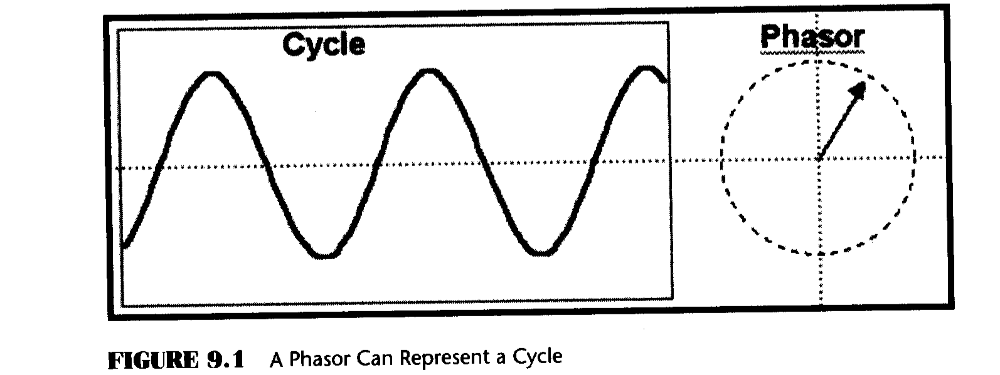
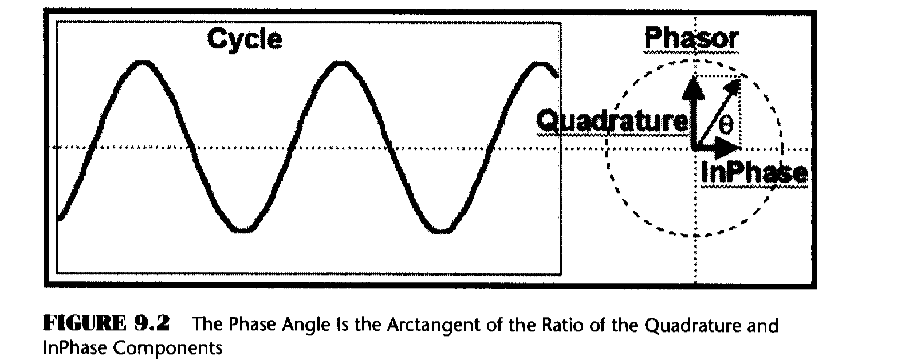
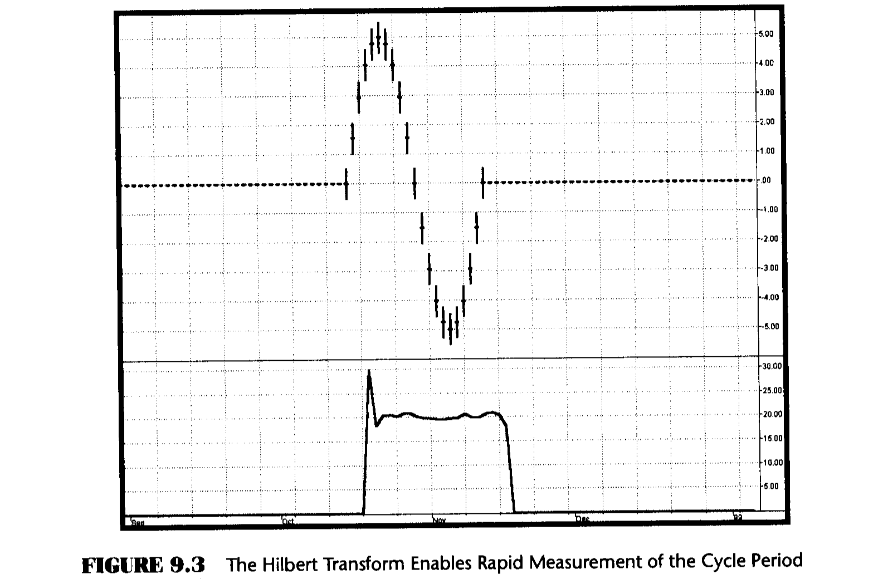
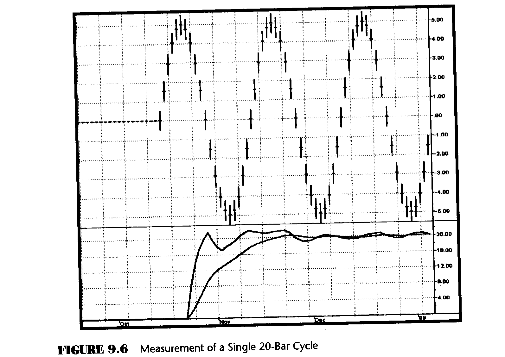
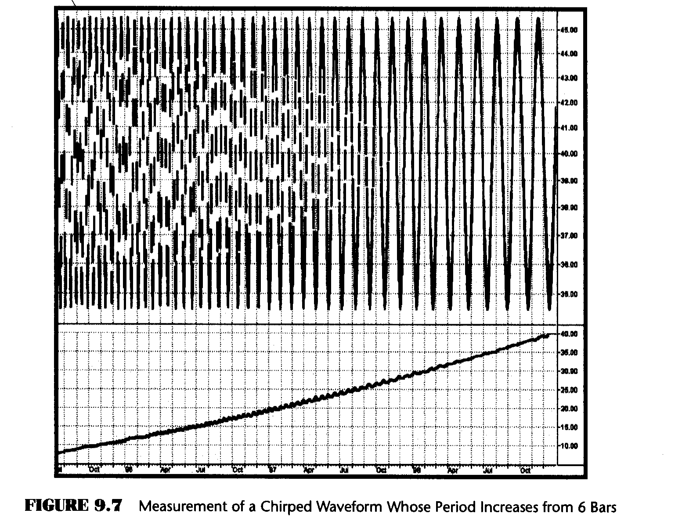
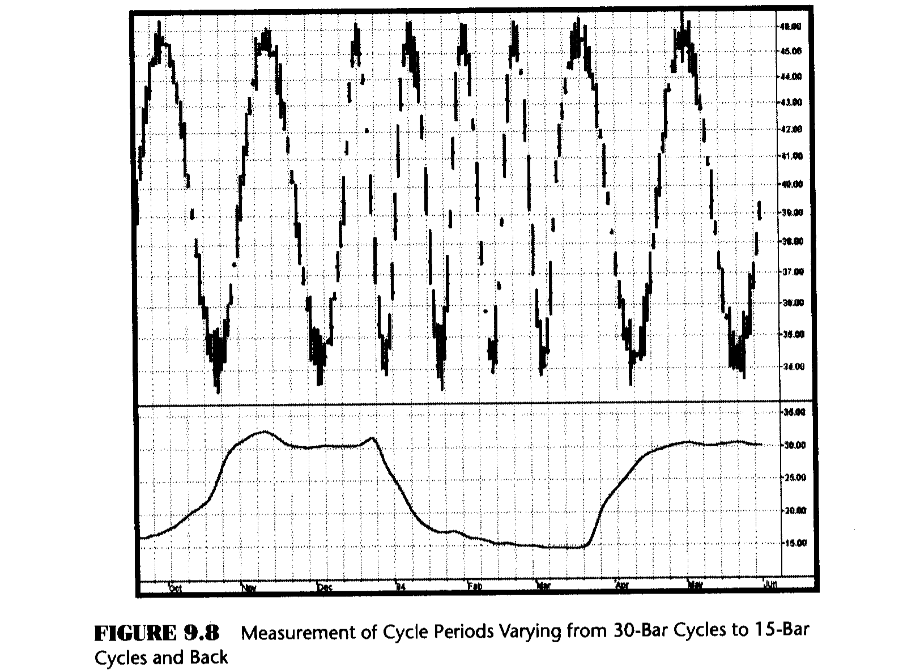
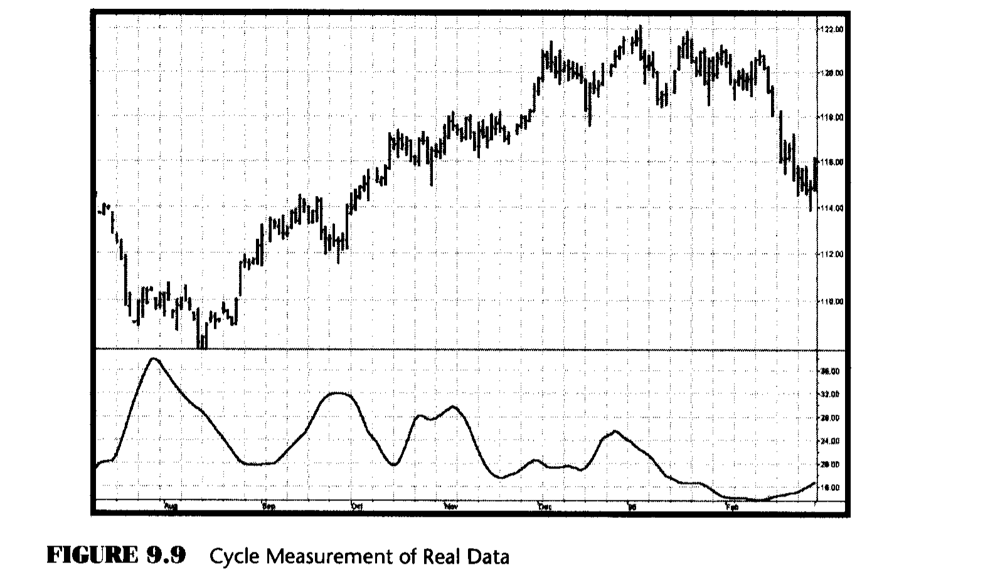

# Chapter 9: Measuring Cycles

> "Looks like rain," said Tom precipitously.

It is obvious that cycles exist in the market. They can be found on any chart by the most casual observer. What is not so clear is how to identify those cycles in real time and how to take advantage of their existence. When Welles Wilder first introduced the Relative Strength Index (RSI), I was curious as to why he selected 14 bars as the basis of his calculations. I reasoned that if I knew the correct market conditions, then I could make indicators such as the RSI adaptive to those conditions. Cycles were the answer. I knew cycles could be measured. Once I had the cyclic measurement, a host of automatically adaptive indicators could follow.

Measurement of market cycles is not easy. The signal-to-noise ratio is often very low, making measurement difficult even using a good measurement technique. Additionally, the measurements theoretically involve simultaneously solving a triple infinity of parameter values. The parameters required for the general solutions were frequency, amplitude, and phase. Some standard engineering tools, like fast Fourier transforms (FFTs), are simply not appropriate for measuring market cycles because FFTs cannot simultaneously meet the stationarity constraints and produce results with reasonable resolution. Therefore I introduced Maximum Entropy Spectral Analysis (MESA) for the measurement of market cycles. This approach, originally developed to interpret seismographic information for oil exploration, produces high-resolution outputs with an exceptionally short amount of information. A short data length improves the probability of having nearly stationary data. Stationary data means that frequency and amplitude are constant over the length of the data. I noticed over the years that the cycles were ephemeral. Their periods would be continuously increasing and decreasing. Their amplitudes also were changing, giving variable signal-to-noise ratio conditions. Although all this is going on with the cyclic components, the enduring characteristic is that generally only one tradable cycle at a time is present for the data set being used. I prefer the term Dominant Cycle to denote that one component. The assumption that there is only one cycle in the data collapses the difficulty of the measurement process dramatically.

Assuming that only one cycle is present in the data enables the measurement to be made using a frequency discriminator. A frequency discriminator basically measures the differential phase between successive samples. Since there are 360 degrees in each cycle, dividing 360 by the differential phase produces the measured cycle length. For example, if the differential phase is 20 degrees, the resulting cycle length would be 360/20 = 18 bars. That is, an 18-bar cycle is changing phase at the rate of 20 degrees per sample so that 360 degrees (one cycle) is reached after 18 samples. Pretty simple! The most significant fact is that, in theory, the cycle measurement can be attained in just two samples.

To make the phase measurements, we need to describe the cycle in terms of a phasor instead of the conventional waveform with which we are familiar. The relationship between the cycle waveform and the phasor is shown in Figure 9.1. Imagine the phasor as the arrow whose tail is pinned at the origin and is rotating counterclockwise. A shadow cast by the arrowhead would then trace out the sinewave cycle. That is, as the phasor rotates, the peak amplitude is reached, followed by the zero crossing, followed by the minimum cycle amplitude, and then back to zero, and so on. One complete rotation of the phasor describes a cycle.

The phasor can be broken into two components, called the InPhase and Quadrature components, as shown in Figure 9.2. The phase angle for any given sample is easily found as the arctangent of the ratio of these two components.

## The Hilbert Transform

The trick is to break the analytic waveform (the cyclic component of prices in the form with which we are familiar) into the InPhase and Quadrature components. This is done with the Hilbert transform. The Hilbert transform is theoretically an infinite series; to make it practical for traders I have truncated the series at four elements. The equation for the Quadrature component in EasyLanguage notation is

$$Q = 0.0962 \times Price + 0.5769 \times Price[2] - 0.5769 \times Price[4] - 0.0962 \times Price[6] \quad (9.1)$$

The lag of the Quadrature component is half the filter length, or three bars. Therefore the InPhase component is just the price delayed by three bars, or

$$I = Price[3] \quad (9.2)$$

To test the speed of the cycle-measuring process, I created a single cycle of a 20-bar sinewave. I then applied the Hilbert transform, computed the phase angles, and used a discriminator to measure the cycle period. The results of this experiment are shown in Figure 9.3. These results are impressive. An accurate measurement of the cycle period is made within four samples of the beginning of the cycle. That four-sample lag is just the lag of the Hilbert transform plus one more sample because the phase difference between samples is required for the computation of the period.

Before getting too excited about these results, please recall that this is a purely monochromatic theoretical waveform having an infinite signal-to-noise ratio. Furthermore, the waveform is already detrended because the cycle swings about the zero line. In the real world we must detrend the signal to extract the cyclic component and then also deal with the noise that is superimposed on the signal. In other words, we need to compute the cyclic component of the market prices as we did in Figure 4.2 before we compute the cycle period.

## Computing the Cycle Period

The EasyLanguage and eSignal Formula Script (EFS) codes for computing the cycle period are shown in Figures 9.4 and 9.5, respectively. The description of the calculation is done with reference to Figure 9.4. After defining the inputs and declaring the variables, the first three lines of code recover the cyclic component, just as in Figure 4.2. The cyclic component is used to compute the Quadrature (Q1) and InPhase (I1) components of the Hilbert transform. One penalty for truncating the infinite series in computing the Quadrature component is that its amplitude is attenuated for the longer cycle periods. The last term in the computation of Q1 is a straight-line amplitude correction. Since the period is not yet known at this point in the code, and since the period is a relatively slowly varying function from sample to sample, it is satisfactory to use the period computed one bar ago in this compensation. I found this feedback compensation to be the most robust approach.

There is another amplitude compensation scheme that is possible. In the case of a pure cycle I can think of the InPhase component being Cos(theta) and the Quadrature component being Sin(theta). Then, a compensation for amplitude error in the Quadrature component can be computed from the simple trigonometric identity

$$\sin^2(\theta) = 1 - \cos^2(\theta)$$

and normalizing amplitudes. While this is a great theory, and it works on theoretical waveforms, I could not obtain satisfactory compensation on real price data because of the noise present in that data. I therefore use the feedback amplitude compensation in the code.

### EasyLanguage Code (Figure 9.4)

**Figure 9.4: EasyLanguage Code to Compute the Cycle Period**

~~~easylanguage
Inputs: Price((H+L)/2),
        alpha(.07);

Vars:   Smooth(0),
        Cycle(0),
        Q1(0),
        I1(0),
        DeltaPhase(0),
        MedianDelta(0),
        DC(0),
        InstPeriod(0),
        Period(0);

Smooth = (Price + 2*Price[1] + 2*Price[2] + Price[3])/6;

Cycle = (1 - .5*alpha)*(1 - .5*alpha) * (Smooth - 2*Smooth[1] + Smooth[2])
        + 2*(1 - alpha)*Cycle[1] - (1 - alpha)*(1 - alpha)*Cycle[2];

If currentbar < 7 then Cycle = (Price - 2*Price[1] + Price[2]) / 4;

Q1 = (.0962*Cycle + .5769*Cycle[2] - .5769*Cycle[4]
      - .0962*Cycle[6])*(.5 + .08*InstPeriod[1]);

I1 = Cycle[3];

If Q1 <> 0 and Q1[1] <> 0 then DeltaPhase = (I1/Q1 - I1[1]/Q1[1])
                                              / (1 + I1*I1[1]/(Q1*Q1[1]));

If DeltaPhase < 0.1 then DeltaPhase = 0.1;
If DeltaPhase > 1.1 then DeltaPhase = 1.1;

MedianDelta = Median(DeltaPhase, 5);

If MedianDelta = 0 then DC = 15
else DC = 6.28318 / MedianDelta + .5;

InstPeriod = .33*DC + .67*InstPeriod[1];
Period = .15*InstPeriod + .85*Period[1];

Plot1(Period, "Period");
~~~

### eSignal Formula Script (EFS) Code (Figure 9.5)

**Figure 9.5: EFS Code to Compute the Cycle Period**

~~~javascript
/************************************************************
Title:      Cycle Period
Coded By:   Chris D. Kryza (Divergence Software, Inc.)
Email:      c.kryza@gte.net
Incept:     06/19/2003
Version:    1.0.0
Fix History:
06/19/2003 - Initial Release 1.0.0
************************************************************/

//External Variables
var nBarCount = 0;
var aPriceArray = new Array();
var aSmoothArray = new Array();
var aCycleArray = new Array();
var aDeltaPhase = new Array();
var aPeriod = new Array();
var aInstPeriod = new Array();
var aQ1 = new Array();
var aI1 = new Array();

//== PreMain function required by eSignal to set things up
function preMain() {
    var x;
    setPriceStudy(false);
    setStudyTitle("Cycle Period");
    setCursorLabelName("Period", 0);
    setDefaultBarFgColor(Color.blue, 0);

    //initialize arrays
    for (x = 0; x < 10; x++) {
        aPriceArray[x] = 0.0;
        aSmoothArray[x] = 0.0;
        aCycleArray[x] = 0.0;
        aQ1[x] = 0.0;
        aI1[x] = 0.0;
        aDeltaPhase[x] = 0.0;
        aPeriod[x] = 0.0;
        aInstPeriod[x] = 0.0;
    }
}

//== Main processing function
function main(Alpha) {
    var x;
    var nDC;
    var nMedianDelta;

    //initialize parameters if necessary
    if (Alpha == null) {
        Alpha = 0.07;
    }

    // study is initializing
    if (getBarState() == BARSTATE_ALLBARS) {
        return null;
    }

    //on each new bar, save array values
    if (getBarState() == BARSTATE_NEWBAR) {
        nBarCount++;
        aPriceArray.pop();
        aPriceArray.unshift(0);
        aSmoothArray.pop();
        aSmoothArray.unshift(0);
        aCycleArray.pop();
        aCycleArray.unshift(0);
        aQ1.pop();
        aQ1.unshift(0);
        aI1.pop();
        aI1.unshift(0);
        aDeltaPhase.pop();
        aDeltaPhase.unshift(0);
        aInstPeriod.pop();
        aInstPeriod.unshift(0);
        aPeriod.pop();
        aPeriod.unshift(0);
    }

    aPriceArray[0] = (high() + low()) / 2;
    aSmoothArray[0] = (aPriceArray[0] + 2 * aPriceArray[1]
        + 2 * aPriceArray[2] + aPriceArray[3]) / 6;

    if (nBarCount < 7) {
        aCycleArray[0] = (aPriceArray[0] - 2 * aPriceArray[1]
            + aPriceArray[2]) / 4;
    } else {
        aCycleArray[0] = (1 - 0.5 * Alpha) * (1 - 0.5 * Alpha)
            * (aSmoothArray[0] - 2 * aSmoothArray[1]
            + aSmoothArray[2]) + 2 * (1 - Alpha)
            * aCycleArray[1] - (1 - Alpha)
            * (1 - Alpha) * aCycleArray[2];
    }

    aQ1[0] = (0.0962 * aCycleArray[0] + 0.5769 * aCycleArray[2]
        - 0.5769 * aCycleArray[4] - 0.0962 * aCycleArray[6])
        * (0.5 + 0.08 * aInstPeriod[1]);

    aI1[0] = aCycleArray[3];

    if (aQ1[0] != 0 && aQ1[1] != 0) {
        aDeltaPhase[0] = (aI1[0] / aQ1[0] - aI1[1] / aQ1[1])
            / (1 + aI1[0] * aI1[1] / (aQ1[0] * aQ1[1]));
    }

    if (aDeltaPhase[0] < 0.1) aDeltaPhase[0] = 0.1;
    if (aDeltaPhase[0] > 1.1) aDeltaPhase[0] = 1.1;

    //Need a 5 bar Median filter of DeltaPhase here (MedianDelta)
    nMedianDelta = Median(5, aDeltaPhase);

    if (nMedianDelta == 0) {
        nDC = 15;
    } else {
        nDC = 6.28318 / nMedianDelta + 0.5;
    }

    aInstPeriod[0] = 0.33 * nDC + 0.67 * aInstPeriod[1];
    aPeriod[0] = 0.15 * aInstPeriod[0] + 0.85 * aPeriod[1];

    return (aPeriod[0]);
}

function Median(nBars, aArray) {
    var aTmp = new Array();
    var nTmp;
    var result;
    var x;

    //transfer elements to temp array
    x = 0;
    while (x < nBars) {
        aTmp[x] = aArray[x++];
    }

    //sort array in asc order
    aTmp.sort(SortAsc);

    //if odd # of elements, just take middle
    if (nBars % 2 != 0) {
        result = aTmp[(nBars + 1) / 2];
        aTmp = null;
        return (result);
    }

    //if even # elements, take average of two middle elements
    else {
        nTmp = nBars / 2;
        result = (aTmp[nTmp] + aTmp[nTmp + 1]) / 2;
        aTmp = null;
        return (result);
    }
}

function SortAsc(arg1, arg2) {
    if (arg1 < arg2) {
        return (-1);
    } else {
        return (1);
    }
}
~~~

## DeltaPhase Computation

The computation of the DeltaPhase starts with a conditional IF statement to preclude the possibility of dividing by 0. Some explanation for the rest of the line is required. The phase angle measured for the current bar is ArcTan(I1/Q1) and the phase angle for one bar ago is ArcTan(I1[1]/Q1[1]). The differential phase calculation is simplified using the trigonometric identity

$$\arctan(A) - \arctan(B) = \arctan\left(\frac{A - B}{1 + AB}\right) \quad (9.3)$$

A six-bar cycle is as short as we need to measure. A six-bar cycle has a phase shift of 60 degrees per bar, or 1.047 radians per bar. Since the differential phase has a maximum of about one radian, a reasonable approximation is that the angle in radians is approximately equal to the arctangent of that angle. This is the approximation we have applied to the computation of the differential angle in the code.

After the DeltaPhase is first computed, some limits must be established. First, the DeltaPhase must always be positive because time cannot run backward. If we get a negative DeltaPhase computation, it is either due to noise or because the two absolute phase measurements have split a quadrant of the phasor. (The arctangent is positive in quadrants 1 and 3 and is negative in quadrants 2 and 4.) In the case of a negative DeltaPhase, it is satisfactory to substitute the previous calculation. Instead, if the DeltaPhase is less than 0.1 radians I limit it to 0.1 radians. This is because a DeltaPhase smaller than 0.1 radians implies the period is greater than 63 bars (2 * pi / 0.1). The other limit is to not compute a period of less than six bars. This is done by limiting the DeltaPhase to 1.1 radians.

The actual calculation of the cycle period is perhaps the easiest part of the code to understand. In a nutshell, the concept is to divide the DeltaPhase into 2*pi because 2*pi represents one full cycle of phases in radian measure. In practice, DeltaPhase is very noisy, varying by a large amount from bar to bar. If DeltaPhase were used directly, substantial smoothing would be required to recover a reasonable Dominant Cycle. There is a more efficient way of smoothing. The best kind of filter to use on spiky data is a median filter. Therefore I filter the DeltaPhases over five samples in a median filter to give the variable MedianDelta. MedianDelta is then divided into 2*pi to compute the Dominant Cycle. Measuring theoretical sinewave periods, I found there is a bias of about 0.5 in the period measurement, and therefore added a compensation term to remove that bias. The Dominant Cycle is smoothed in an exponential moving average having alpha = 0.33 for a relatively rapid response for the feedback term in the computation of Q1. I call this variable the Instantaneous Period (InstPeriod). The InstPeriod is then smoothed again in an exponential moving average having alpha = 0.15. This value was selected to reach the full cycle length measurement in one cycle of a 20-bar signal, starting from 0.

## Testing the Measurement

I have conducted a number of rigorous tests to examine the quality of the cycle measurement. First among these is to examine the start-up transient in a way similar to the single cycle measurement of Figure 9.3. The final results are shown in the bottom subgraph of Figure 9.6. In this case, I continue the 20-bar cycles after the first one. The InstPeriod comes up to a 20-bar measurement at 8 bars after initiation. This is consistent with the 1.5-bar lag of the smoothing filter plus the four-bar lag for the Hilbert transform plus the 2.5-bar lag of the median filter. The smoothing of the period output is due to the exponential moving average. I could have used less smoothing. However, cycle periods tend to change relatively slowly in real data, and the greater amount of smoothing is desirable when lag is of less concern. These results should be viewed in context. For example, an FFT would take about 16 cycles of data to make a measurement of comparable resolution. Yes, you read it correctly -- 16 full cycles of data would be required by an FFT for equivalent results. Even MESA would take a large fraction of the cycle to make the first measurement.

With any measurement algorithm, one crucial test is whether the algorithm makes a correct measurement over a wide range of input data. To this end I created a theoretical sinewave whose period gradually increased from 6 bars to 40 bars. Figure 9.7 shows this waveform and shows that the measurement of its cycle periods is very accurate.

Another transient and accuracy test is to measure how fast the measurement algorithm can follow the switch from a 30-bar cycle to a 15-bar cycle and back. In Figure 9.8, the data consists of two cycles of a 30-bar cycle, four cycles of a 15-bar cycle, and two more cycles of a 30-bar cycle. This is a severe test, requiring the measurement to slew over a wide range between harmonically related cycles. This test shows that the measurement is within reasonable range of the actual period within 15 samples, switching either way.

The basic message here is that the cycle measurement has a lag of about 8 bars, as demonstrated in Figure 9.6, up to a lag of about 15 bars in one of the most stressing situations. This lag should be recognized when the measurement is used in trading.

Figure 9.9 shows the cycle period measurement of real data. This measurement is far more responsive than the more common measurements. Measurement accuracy can be tested by counting bars between major successive lowest lows or major successive highest highs and comparing the count to the measurement at that point. There are five bars per horizontal unit as a tip to help speed up your bar count. Please recall that there is about an eight-bar lag in the cycle measurement waveform.

## Key Points to Remember

- The Hilbert transform enables the cycle period to be measured in as few as four bars.
- The cyclic component must be extracted from the data and then used to measure the Dominant Cycle period.
- The frequency discriminator to measure the Dominant Cycle period just sums the differential phases between bars until the sum reaches 360 degrees -- a full cycle.
- A five-bar median filter creates the differential phase to be summed.
- Summing the median differential phase enables the cycle measurement to be made using only five samples.
- The lag of measuring the Dominant Cycle period is about eight bars.
- The Dominant Cycle period measurement technique described in this chapter is the most responsive technique available.