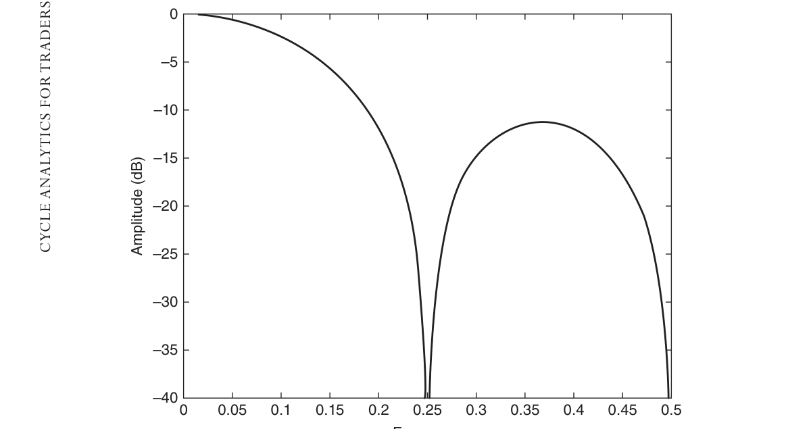
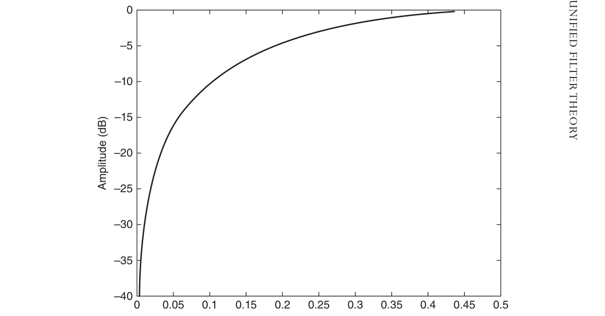
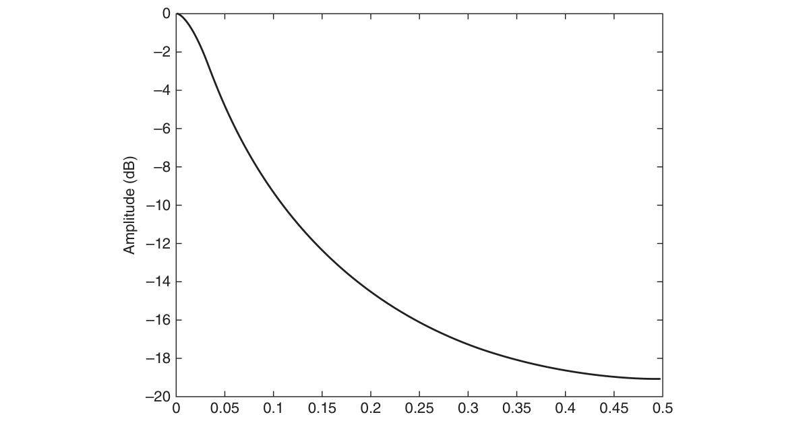

# Chapter 1: Unified Filter Theory


## BibTeX

```bibtex
@InBook{ehlers2013cycle_ch1,
  author    = {Ehlers, John F.},
  title     = {Cycle Analytics for Traders: Advanced Technical Trading Concepts},
  chapter   = {1},
  chaptertitle = {Unified Filter Theory},
  publisher = {Wiley},
  year      = {2013},
  series    = {Wiley Trading},
  isbn      = {9781118728604},
}
```

---

Unified Filter
Theory
“It is too complex,” said Tom simply.
S
implicity is at the heart of the concept of linear systems. Input data
are supplied to the system, and the system provides the resultant as an
­output. There is only one input and only one output. However, the system
between the input and output can be as complex as desired. The output
divided by the input is the transfer response of the system. It is this transfer
response that describes the action of the system.
In this chapter you will find the difference between nonrecursive filters and
recursive filters, and combinations of the two, enabling you to select the best
filter for each application. In addition, you will find that the responses in the
time domain and in the frequency domain are intimately connected. When
designing filters for trading, it is beneficial to consider the response in both
of these domains. It is important to remember that no filter is predictive—
filter responses are computed on the basis of historical data samples.
By thinking in terms of the transfer responses, you will easily make the
transition between filter theory and programming the filters in your trading
platform.

## Transfer Response

Consider a four-bar simple moving average. The input data are the last four
samples of price. The filter output is one-fourth of the most recent price
data plus one-fourth of the data sample delayed by one bar plus one-fourth

of the data sample delayed by two bars plus one-fourth of the data sample
delayed by three bars. If we allow the symbol Z −1 to represent one unit of
delay, then we can write an equation for the transfer response of a simple
moving average (SMA) as:

(Output / Input Data) = 1/4 + Z −1/4 + Z −2/4 + Z −3/4
(1-1)
The values of ¼ are called the coefficients of the filter. In general, the
filter coefficients sum to 1, so the ratio of the input to the output is 1 if the
input is a constant. If we choose to generalize the filter to be other than an
SMA, the values of the coefficients can be arbitrarily assigned. Further, we
can extend the filter to have any arbitrary length. In this case, the filter trans-
fer response can be written as:
H(z) = b0 + b1 * Z −1 + b2 * Z −2 + b3 * Z −3 + b4 * Z −4 + ..........+ bN * Z −N

(1-2)
The interesting thing about this equation is that we have now written the
transfer response as a generalized algebraic polynomial. The polynomial can
have as high an order as desired.
The filter generality can be extended by writing the transfer response as
the ratio of two polynomials as:
The filter generality can be extended by writing the transfer response as
the ratio of two polynomials as:

$$H(z) = \frac{b_0 + b_1 Z^{-1} + b_2 Z^{-2} + b_3 Z^{-3} + b_4 Z^{-4} + \cdots + b_N Z^{-N}}{a_0 + a_1 Z^{-1} + a_2 Z^{-2} + a_3 Z^{-3} + a_4 Z^{-4} + \cdots + a_N Z^{-N}}$$

(1-3)

This equation completely describes the transfer response of any filter.
The only thing that differentiates one filter from another is the selection of
the coefficients of the polynomials. It is immediately apparent that the more
fancy and complex the filter becomes, the more input data is required. This
is really bad for filters used in trading because using more data means the fil-
ter necessarily has more lag. Minimizing lag in trading filters is almost more
important than the smoothing that is realized by using the filter. Therefore,
filters used for trading best use a relatively small amount of input data and
should be not be complex.
Although mathematicians will cringe at the notation, filter computations
can perhaps be better understood by simplifying Equation 1-3 as:
Although mathematicians will cringe at the notation, filter computations
can perhaps be better understood by simplifying Equation 1-3 as:

$$\frac{\text{Output}}{\text{Input}} = \frac{\text{Numerator}}{a_0 + \text{Denominator}}$$


Clearing fractions by cross multiplying, we get an equation useful for
programming:
a0 * Output + Denominator * Output = Numerator * Input
a0 * Output = Numerator * Input − Denominator * Output

Output = (Numerator * Input − Denominator * Output) / a0
(1-4)
Equation 1-4 says that the filter output is comprised of two parts. The
first part, the numerator term, uses only input data values. If that is the
only term used in the filter, the filter is said to be nonrecursive. The second
part, the denominator term, consists of previously computed values of the
output. Filters using any previously computed values of the output are said
to be recursive. The distinction is important because it is difficult to create
recursive filters in some computer languages used for trading. Parentheti-
cally, the coefficient a0 is usually unity to keep things simple.

## Nonrecursive Filters

A nonrecursive filter is one where the output response depends only on the
input data and does not use a previous calculation of the output to partially
determine the current value of the output. Nonrecursive filters have wide
applications and therefore have acquired many different names. Among the
aliases are:

## Moving average filters


## Finite impulse response (FIR) filters


## Tapped delay line filters


## Transversal filters

SMA filters are a special case of moving average filters where all the filter
coefficients have the same value.
One of the most important filter characteristics to a trader is how much
lag the filter introduces at the output relative to the input. A nonrecur-
sive filter whose coefficients are symmetrical about the center of the filter
­always has a lag equal to the degree of the filter divided by two. For ­example,
a nonrecursive filter of degree six will have a three-bar delay. This delay
is ­constant for all frequency components. Since lag is very important, and

since lag is directly related to filter degree, filters used for trading most gen-
erally are simple and are of low degree.
If the a0 coefficient equals one and all the other “a” coefficients are zero,
the most general transfer response is just the simple polynomial in the nu-
merator. From the fundamental theorem of algebra, the polynomial can be
factored into as many complex roots as it has degrees. In other words, the
transfer response can be written as:
H(z) = (c0 + Z −1) * (c1 + Z −1) * (c2 + Z −1) * (c3 + Z −1) * ... * (cN + Z −1)

(1-5)
The coefficients may be complex numbers rather than real numbers. In
this case, the roots of the polynomial are called the zeros of the transfer re-
sponse. For example, the four-bar SMA transfer response is a polynomial of
degree three and therefore has three roots factored as:


$$H(z) = (1/4)(1 + Z^{-1})(1 + Z^{-1})(1 - Z^{-1})$$

(1-6)

This transfer response has one real root and two complementary imagi-
nary roots. If we substitute an exponential as exp(−j2π  f) = Z −1, in the real root
portion of  Equation 1-5, we get using DeMoivre’s theorem:


$$1 + Z^{-1} = 1 + e^{-j2\pi f} = e^{-j\pi f}(e^{j\pi f} + e^{-j\pi f}) = 2\cos(\pi f) = 0$$

(1-7)

(1-7)
This equation can be true only when the frequency is half the sampling
frequency. Half the sampling frequency is the highest frequency that is al-
lowable in sampled data systems without aliasing, and is called the Nyquist
frequency. In our case, the sampling is done uniformly at once per bar, so
the highest possible frequency we can filter is 0.5 cycles per bar, or a pe-
riod of two bars. Equation 1-7 shows that the zero in the transfer response
occurs exactly at the Nyquist frequency. We have succeeded in completely
canceling out the highest possible frequency in the four-bar SMA.

We can see the frequency characteristic of the transfer response by start-
ing with a five-element SMA and then generalizing.
We can see the frequency characteristic of the transfer response by start-
ing with a five-element SMA and then generalizing.

$$H(z) = \frac{1}{5}(1 + Z^{-1} + Z^{-2} + Z^{-3} + Z^{-4})$$

Multiplying both sides of this equation by $Z^{-1}$ and subtracting that multi-
plicand from both sides of the equation, we obtain

$$H(z)(1 - Z^{-1}) = \frac{1 - Z^{-5}}{5}$$

$$H(z) = \frac{1 - Z^{-5}}{5(1 - Z^{-1})}$$

$$H(z) = \frac{Z^{-5/2}(Z^{5/2} - Z^{-5/2})}{5 \cdot Z^{-1/2}(Z^{1/2} - Z^{-1/2})}$$


We get the frequency response of this five-element SMA by making the
We get the frequency response of this five-element SMA by making the
substitution $Z^{-1} = e^{-j2\pi f}$, where f is the sampling frequency. Then,

$$H(2\pi f) = \frac{e^{-j5\pi f}(e^{j5\pi f} - e^{-j5\pi f})}{5 \cdot e^{-j\pi f}(e^{j\pi f} - e^{-j\pi f})} = \frac{\sin(5\pi f/2)}{5\sin(\pi f/2)}$$

The equality of the exponential expressions and the sine equivalent will
be recognized by readers familiar with complex variables as DeMoivre's
theorem. For readers without this math background, please accept it on
faith.
Generalizing this result for an N-length SMA, we have the transfer re-
sponse of an SMA in the frequency domain expressed as:

$$H(2\pi f) = \frac{\sin(N\pi f/2)}{N\sin(2\pi f/2)}$$

But since the Nyquist frequency is half the sampling frequency, the trans-
fer response in the frequency domain is

$$H(2\pi f) = \frac{\sin(N\pi f)}{N\sin(\pi f)}$$

(1-8)

where f = frequency relative to the sampling frequency


The important conclusion from this discussion is that we can think of the
transfer response with equal validity in the time domain or in the frequency
domain.
When we plot the response of the four-element SMA as a function of
frequency in Figure 1.1, we see that we not only have a zero at the Nyquist
frequency, but also at a frequency of 0.25.
The horizontal axis is plotted in terms of frequency rather than the cycle
period that is most familiar to traders. Frequency and period have a recip-
rocal relationship, so a frequency of 0.25 cycles per bar corresponds to a
four-bar period. The vertical axis is the amplitude of the output relative to
the ­amplitude of the input data in decibels. A decibel (dB) is a logarithmic
measure of the power in the output. Figure 1.1 shows that there are zeros
in the filter transfer response in the frequency domain as well as in the time
domain.
The concept of thinking of how a filter works in the frequency domain as
well as how it works in the time domain is central to the understanding of
the indicators that will be developed. Low frequencies near zero are passed
from input to output with little or no attenuation. Since higher frequencies
are blocked from being passed to the output, the SMA is a type of low-pass



*Figure 1.1: Frequency Response of a Four-Bar Simple Moving Average*


filter—passing low frequencies and blocking higher frequencies. Low-pass
filters are data smoothers that remove the higher-frequency jitter in the in-
put data that often makes the data hard to interpret. The penalty traders pay
for this smoothing is the lag introduced in the transfer response.
Low-pass filters are not the only filters that can be generated with the
generalized transfer response of Equation 1-3. Suppose we arrange to have
the coefficients to be as:
b0 = 0.5
b1 = −0.5
a0 = 1
All other coefficients are equal to zero.
Then the frequency response of the filter is shown in Figure 1.2.
In this case, the higher frequencies are passed, and the lower frequencies
are severely attenuated by the filter. This is an example of a high-pass filter.
Since trends can be viewed as pieces of a very long cycle, a high-pass filter
is basically a detrender because the low-trend frequencies are rejected in its
transfer response.



*Figure 1.2: Frequency Response of a Two-Bar Difference Filter*


Since the coefficients of a simple high-pass filter are equivalent to just tak-
ing the difference of two consecutive samples of input data, the difference
operation can be viewed as analogous to a derivative function in the calculus.
This concept enables a high-pass filter to be used in several different ways in
trading to attempt to create a predictive waveform. If the input data are as-
sumed to be in a trend, then the difference between any two data samples is
constant. In this case, adding the difference to the current bar data predicts
the value of the input data for the next sample. Alternatively, if the input
data are assumed to be a quiescent sine wave, a trader can use the relation-
ship from calculus as:


$$\frac{d\sin(2\pi ft)}{dt} = 2\pi f \cos(2\pi ft)$$

(1-9)

If the frequency of the sine wave is known, the high-pass filter not only
provides a waveform that leads the input data waveform by 90 degrees, but
also provides the means to normalize the output amplitude to the amplitude
of the input data.
Returning to Equation 1-2 for a generalized nonrecursive filter, and fac-
toring out a Z −N/2 term, we obtain:
H(z) = (b0ZN/2 + b1 * Z N−1/2 + .  .  .  .  . + 1 + .  .  .  .’+ b(N−1)Z −(N−1)/2

+ bN * Z −N/2) * Z −N/2
(1-10)
Since Z −N/2 is a pure delay term, and since exp(−j2π f  ) can be substituted
for Z −1, Equation 1-10 is proof that nonrecursive filters having coefficients
symmetrical about the center of the filter will have a constant delay at all
frequencies. Further, that delay will be exactly half the degree of the transfer
response polynomial.

## Recursive Filters

A recursive filter is one where the output response depends not only on the in-
put data but also on previous values of the output. Strictly recursive filters are
characterized by using only a constant in the numerator and multiple terms in
the denominator of Equation 1-3. Recursive filters also have wide applications
and therefore have acquired many different names. Among the aliases are:

## Exponential moving average filters


## Infinite impulse response (IIR) filters


## Ladder filters


## Autoregressive filters

If the b0 coefficient is a constant and all the other “b” coefficients are zero,
the most general transfer response is just the simple polynomial in the de-
nominator.  This polynomial can be factored into as many complex roots as it
has degrees. In other words, the transfer response can be written as:
H(z) = b0 / ((c0 + Z −1) * (c1 + Z −1) * (c2 + Z −1) * ... * (cN + Z −1))
(1-11)
The coefficients may be complex, rather than real, numbers. In this case,
the roots of the polynomial are called the poles of the transfer response be-
cause a zero in the denominator of the transfer response causes the transfer
response to go to infinity at that point. One can visualize the transfer re-
sponse as the canvas of a circus tent in the context of complex numbers, and
the poles in the transfer response are analogous to the tent poles. While it is
possible to choose coefficients that cause the transfer function to “blow up,”
frequencies are constrained to be real numbers, and therefore it is relatively
easy to avoid the complex pole locations.
Consider the special case of a recursive filter where

b0 = α

a0 = 1

a1 = −(1 − α)
Then, Equation 1-3 becomes
Then, Equation 1-3 becomes

$$\frac{\text{Output}}{\text{Input}} = \frac{\alpha}{1 - (1-\alpha)Z^{-1}}$$

$$\text{Output} \cdot (1 - (1-\alpha)Z^{-1}) = \alpha \cdot \text{Input}$$

$$\text{Output} = \alpha \cdot \text{Input} + (1-\alpha) \cdot \text{Output}[1]$$


Then, using the conventional notation that Output[1] equals the output
one bar ago:

Output = α * Input + (1 − α) * Output[1]
(1-12)
Equation 1-12 is exactly the equation for an exponential moving average
(EMA). Note that the sum of all of the coefficients on the right-hand side of
Equation 1-11 sum to 1 so that the filter has no noise gain.




*Figure 1.3: shows the frequency response of the EMA when alpha = 0.2.*
The EMA is a type of low-pass filter, passing the lower-frequency components
of the input data and attenuating its higher-frequency components. If alpha is
made to be smaller, fewer of the lower-frequency components are allowed to
pass, and the high-frequency components are attenuated to a ­greater degree.
Conversely, if alpha is made to be larger, there is less smoothing, and there-
fore more higher-frequency components of the input are allowed to pass to
the output. There are no zeros (or poles) in the transfer response.
The lag of EMA filters will be derived in Chapter 2.

## Generalized Filters

A generalized filter uses both the numerator and denominator of Equation 1-3
to achieve a wider range of responses other than low-pass filtering and high-
pass filters. Some familiar aliases for these generalized filters are:

## Autoregressive moving average (ARMA) filters


## Autoregressive integrated moving average (ARIMA) filters


*Figure 1.3: Exponential Moving Average Frequency Response for α = 0.2*

A band-pass filter can be created by connecting a low-pass filter in tandem
with a high-pass filter so that both the low-frequency and high-­frequency
components are attenuated and components near a selected frequency
are passed to the output. However, it is much more efficient to ­create the
band-pass filter response simply by selecting the proper ­coefficients in
­Equation 1-3.

## Programming the Filters

It is most convenient to consider filters as “stonewall” filters that have only
a pass band and a stop band with the boundary between them located at
a critical cycle period. For example, a smoothing low-pass filter on stock
data might have a critical cycle period of 20 bars because many stocks have
monthly cycle periods of approximately 20 bars and the smoothing would
attenuate only those cyclic components shorter than 20 bars. Band-pass fil-
ters would pass only cycle components centered at the critical cycle period.
Band-stop filters would reject only cycle components also centered at the
critical cycle period.
With the exception of nonrecursive filters, only filters of degree two
are used due to lag considerations. In this case, Equation 1-3 reduces to
­Equation 1-13:


$$\frac{\text{Output}}{\text{Input}} = \frac{b_0 + b_1 Z^{-1} + b_2 Z^{-2}}{a_0 + a_1 Z^{-1} + a_2 Z^{-2}}$$

(1-13)

Using the notation that Z−1 * Input = Input[1], etc., and algebraically re-
arranging Equation 1-13, the expression that can be used for programming
becomes Equation 1-14:
Output = b0 * Input + b1 * Input[1] + b2 * Input[2] —

a1 * Output[1] − a2 * Output[2]
(1-14)
Before we assign the value of the coefficients, it is most convenient to com-
pute some constants in terms of the critical period. In the following equa-
tions, the arguments of the trigonometric functions are in degrees.1


$$\alpha = \frac{\cos(K \cdot 360 / \text{Period}) + \sin(K \cdot 360 / \text{Period}) - 1}{\cos(K \cdot 360 / \text{Period})}$$

(1-15)


Where  K = 1 for single-pole filters
K = 0.707 for two-pole high-pass filters
K = 1.414 for two-pole low-pass filters


$$\sigma = \frac{1 - \gamma}{1 - \gamma}$$

(1-16)

Where
γ = Cos(360*/Period)
and
δ = bandwith as a fraction of Period

λ = Cos(360/Period)
(1-17)
Using these unified calculations, the filter coefficients for the various
types of filters can be found in Table 1.1.
Simple two-pole filters are just two single-pole filters that are serially
connected. Filtering a previously filtered output means the coefficients must
be adjusted to obtain the same −3-dB attenuation at the desired critical pe-
riod. Equation 1-15 accomplishes this by computing alpha term at a period
where the attenuation is approximately −1.5 dB for each of the two com-
ponent filters. Thus, the total attenuation of the serially connect set is −3
decibels at the critical period.
A trader may also serially connect any of the conical filter types in

**Table 1.1 to obtain a more complex system to achieve an overall desired**

result. For example, a band-pass filter output could be the input to an EMA
filter with a different critical period to further smooth the data. As another
example, a low-pass filter can be combined with a high-pass filter to create
a very wide bandwidth band-pass filter.
All the filters in Table 1.1 have application to trading with the exception
of the band-stop filter. Using the parameters in Table 1.1 the band-stop ­filter

**Table 1.1**

Filter Coefficients for Various Types of Filters
Filter Type
b0
b1
b2
a0
a1
a2
EMA
α
−(1 − α)
Two-pole low-pass
α2
−2 * (1 − α)
(1 − α)2
High-pass
(1 − α/2)
−(1 − α/2)
−(1 − α)
Two-pole high-pass
(1 − α/2)2
−2 * (1 − α/2)2
(1 − α/2)2
−2 * (1 − α)
(1 − α)2
Band-pass
(1 − σ)/2
−(1 − σ)/2
−λ * (1 + σ)
σ
Band-stop
(1 + σ)/2
−2λ * (1 + σ)/2
(1 + σ)/2
−λ * (1 + σ)
σ

would more appropriately be called a notch filter. That is, it attenuates a very
narrow range of frequencies. It could be used to remove 60-hertz power line
frequency from audio equipment, for example. Market cycles tend to be
ephemeris and have very fuzzy bandwidths, making them difficult to reject by
filtering. Even more sophisticated band-stop filters with relatively wide stop
bands do not seem to be effective in removing cyclic components from the
data. This is indeed unfortunate because removing cyclic components to isolate
the trends is a philosophically interesting digital signal processing approach.

## Wave Amplitude, Power, and Decibels (dB)

The transfer response of a filter is expressed as the output relative to the
input. In the time domain, we can examine the two waveforms to make
a comparison. Waves have three components: frequency, amplitude, and
phase. It is generally more convenient for trading to describe only the rela-
tive amplitudes and delays. We can eliminate phase by examining power
rather than wave amplitude. The difference between power and wave am-
plitude is analogous to describing a lightbulb as using 60 watts rather than
using 115 volts. Power is proportional to the square of the wave amplitude,
and to better examine a wide range of power levels, relative power is usually
measured in a logarithmic ratio called decibels.2
Using V to represent relative wave amplitude, the transfer response am-
plitude is expressed mathematically as
H = 10 * Log10(V * V) = 20 * Log10 (V )
Some relative amplitudes useful to remember are:
−3 dB = 0.5 Power = 0.707 Amplitude
−6 dB = 0.25 Power = 0.5 Amplitude
−10 dB = 0.1 Power = 0.316 Amplitude
−20 dB = 0.01 Power = 0.1 Amplitude

## Key Points to Remember

1.	 All the common filters useful for traders have a transfer response that
can be written as a ratio of two polynomials.

2.	 Lag is very important to traders. More complex filters can be created
using more input data, but more input data increases lag. Sophisticated
filters are not very useful for trading because they incur too much lag.
3.	 Filter transfer response can be viewed in the time domain and the
­frequency domain with equal validity.
4.	 Nonrecursive filters can have zeros in the transfer response, enabling
the complete cancellation of some selected frequency components.
5.	 Nonrecursive filters having coefficients symmetrical about the center
of the filter will have a delay of half the degree of the transfer response
polynomial at all frequencies.
6.	 Low-pass filters are smoothers because they attenuate the high-­
frequency components of the input data.
7.	 High-pass filters are detrenders because they attenuate the low-­
frequency components of trends.
8.	 Band-pass filters are both detrenders and smoothers because they
­attenuate all but the desired frequency components.
9.	 Filters provide an output only through their transfer response. The
transfer response is strictly a mathematical function, and interpretations
such as overbought, oversold, convergence, divergence, and so on are
not implied. The validity of such interpretations must be made on the
basis of statistics apart from the filter.
Notes
1.	 Sanjit K. Mitra, Digital Signal Processing, 2nd ed. (New York: McGraw-
Hill, 2000), Section 4.5.2.
2.	 A decibel is one-tenth of a bel, named after Alexander Graham Bell.  A
bel original meant the approximate power lost in one mile of standard
telephone cable, and is about the least amount of change in audio de-
tectable by a human.

