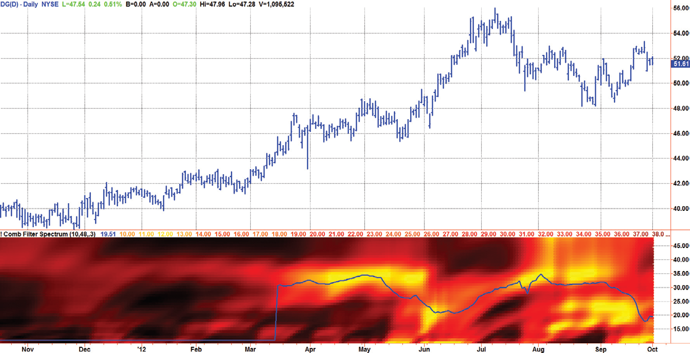
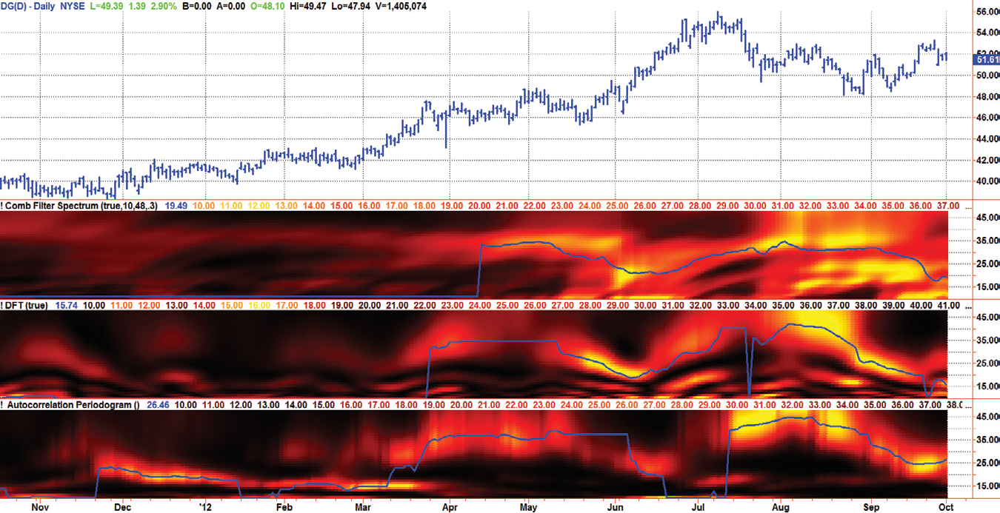

# Chapter 10: Adaptive Band-Pass Filters


## BibTeX

```bibtex
@InBook{ehlers2013cycle_ch10,
  author    = {Ehlers, John F.},
  title     = {Cycle Analytics for Traders: Advanced Technical Trading Concepts},
  chapter   = {10},
  chaptertitle = {Adaptive Band-Pass Filters},
  publisher = {Wiley},
  year      = {2013},
  series    = {Wiley Trading},
  isbn      = {9781118728604},
}
```

---

Comb Filter
Spectral Estimates
“You can take that to the bank,” said Tom repeatedly.
B
and-pass filters were described in Chapter 5. The concept of this chap-
ter is to arrange a bank of these filters, each tuned to a different cycle
period and overlapping, and applying the same data to the input of these fil-
ters. The band-pass filters can be pictured as teeth in a comb, only the teeth
overlap. With this comb structure the relative amplitudes of the signals at
the output of the filters would constitute an estimate of the spectral content
of the input data. The measurement resolution and, correspondingly, the
transient response of the measurement is by control of the bandwidth of
each filter. It is just that easy. This is the most conceptually pure and easy to
understand of all the spectral estimate approaches.

## Spectral Dilation

Before beginning, it is imperative to again address the issue of Spectral Dila-
tion of market data cycle amplitudes. This is a characteristic intrinsic to the
nature of market data. Compensation for Spectral Dilation is mandatory
when making cycle period measurements over a relatively large range and is
therefore included in this spectral estimation approach. Spectral Dilation of
market cycles was discussed more fully in Chapter 7.


## Computing a Comb Filter Spectral Estimate

Since the concept of computing a spectral estimate based measuring the out-
put powers of a bank of overlapping band-pass filters is so straightforward,
the best way of describing the process is with reference to the ­EasyLanguage
code in Code Listing 10-1.

**Code Listing 10-1. EasyLanguage Code to Compute a Comb Filter Spectral Estimate**

```easylanguage
{
Comb BandPass Spectrum
© 2013   John F. Ehlers
}
Vars:
alpha1(0),
HP(0),
a1(0),
b1(0),
c1(0),
c2(0),
c3(0),
Filt(0),
Comp(0),
beta1(0),
gamma1(0),
delta1(0),
N(0),
M(0),
Period(0),
Sp(0),
Spx(0),
MaxPwr(0),
DominantCycle(0),
Color1(0),
Color2(0),
Color3(0);

Comb Filter Spectral Estimates
Arrays:
BP[48,48](0),
Pwr[48](0);
//Highpass filter cyclic components whose periods are
shorter than 48 bars
alpha1 = (Cosine(.707*360 / 48) + Sine (.707*360 / 48) - 1) /
Cosine(.707*360 / 48);
HP = (1 - alpha1 / 2)*(1 - alpha1 / 2)*(Close - 2*Close[1] +
Close[2]) + 2*(1 - alpha1)*HP[1] - (1 - alpha1)*
(1 - alpha1)*HP[2];
//Smooth with a Super Smoother Filter from equation 3-3
a1 = expvalue(-1.414*3.14159 / 10);
b1 = 2*a1*Cosine(1.414*180 / 10);
c2 = b1;
c3 = -a1*a1;
c1 = 1 - c2 - c3;
Filt = c1*(HP + HP[1]) / 2 + c2*Filt[1] + c3*Filt[2];
For N = 10 to 48 Begin
For M = 48 DownTo 2 Begin
BP[N, M] = BP[N, M - 1];
End;
End;
If CurrentBar > 12 Then Begin
For N = 10 to 48 Begin
Comp = N;
If SpectralDilationCompensation = False Then Comp = 1;
beta1 = Cosine(360 / N);
gamma1 = 1 / Cosine(360*Bandwidth / N);
alpha1 = gamma1 - SquareRoot(gamma1*gamma1 - 1);
BP[N, 1] = .5*(1 - alpha1)*(Filt - Filt[2]) + beta1*
(1 + alpha1)*BP[N, 2] - alpha1*BP[N, 3];
Pwr[N] = 0;
For M = 1 to N Begin
Pwr[N] = Pwr[N] + (BP[N, M] / Comp)*(BP[N, M] / Comp);
End;
End;
End;
(Continued )

//Find Maximum Power Level for Normalization
MaxPwr = .995*MaxPwr;
For Period = ShortestPeriod to 48 Begin
If Pwr[Period] > MaxPwr Then MaxPwr = Pwr[Period];
End;
//Normalize Power Levels and Convert to Decibels
For Period = 10 to 48 Begin
If MaxPwr > 0 Then Pwr[Period] = Pwr[Period] / MaxPwr;
End;
//Compute the dominant cycle using the CG of the spectrum
Spx = 0;
Sp = 0;
For Period = ShortestPeriod to LongestPeriod Begin
If Pwr[Period] >= .5 Then Begin
Spx = Spx + Period*Pwr[Period];
Sp = Sp + Pwr[Period];
End;
End;
If Sp <> 0 Then DominantCycle = Spx / Sp;
Plot2(DominantCycle, “DC”, RGB(0, 0, 255), 0, 2);
{
//Increase Display Resolution by raising the Pwr to a higher
mathematical power
For Period = 10 to 48 Begin
Pwr[Period] = Power(Pwr[Period], 3);
End;
}
For N = 10 to 48 Begin
Color3 = 0;
If Pwr[N] > .5 Then Begin
Color1 = 255;
Color2 = 255*(2*Pwr[N] - 1);
End
Else Begin
Color1 = 2*255*Pwr[N];
Color2 = 0;
End;

Comb Filter Spectral Estimates
If N = 10 Then Plot10(N, “S10”, RGB(Color1, Color2,
Color3),0,5);
If N = 11 Then Plot11(N, “S11”, RGB(Color1, Color2,
Color3),0,5);
If N = 12 Then Plot12(N, “S12”, RGB(Color1, Color2,
Color3),0,5);
If N = 13 Then Plot13(N, “S13”, RGB(Color1, Color2,
Color3),0,5);
If N = 14 Then Plot14(N, “S14”, RGB(Color1, Color2,
Color3),0,5);
If N = 15 Then Plot15(N, “S15”, RGB(Color1, Color2,
Color3),0,5);
If N = 16 Then Plot16(N, “S16”, RGB(Color1, Color2,
Color3),0,5);
If N = 17 Then Plot17(N, “S17”, RGB(Color1, Color2,
Color3),0,5);
If N = 18 Then Plot18(N, “S18”, RGB(Color1, Color2,
Color3),0,5);
If N = 19 Then Plot19(N, “S19”, RGB(Color1, Color2,
Color3),0,5);
If N = 20 Then Plot20(N, “S20”, RGB(Color1, Color2,
Color3),0,5);
If N = 21 Then Plot21(N, “S21”, RGB(Color1, Color2,
Color3),0,5);
If N = 22 Then Plot22(N, “S22”, RGB(Color1, Color2,
Color3),0,5);
If N = 23 Then Plot23(N, “S23”, RGB(Color1, Color2,
Color3),0,5);
If N = 24 Then Plot24(N, “S24”, RGB(Color1, Color2,
Color3),0,5);
If N = 25 Then Plot25(N, “S25”, RGB(Color1, Color2,
Color3),0,5);
If N = 26 Then Plot26(N, “S26”, RGB(Color1, Color2,
Color3),0,5);
If N = 27 Then Plot27(N, “S27”, RGB(Color1, Color2,
Color3),0,5);
If N = 28 Then Plot28(N, “S28”, RGB(Color1, Color2,
Color3),0,5);
If N = 29 Then Plot29(N, “S29”, RGB(Color1, Color2,
Color3),0,5);
If N = 30 Then Plot30(N, “S30”, RGB(Color1, Color2,
Color3),0,5);
If N = 31 Then Plot31(N, “S31”, RGB(Color1, Color2,
Color3),0,5);
(Continued )

If N = 32 Then Plot32(N, “S32”, RGB(Color1, Color2,
Color3),0,5);
If N = 33 Then Plot33(N, “S33”, RGB(Color1, Color2,
Color3),0,5);
If N = 34 Then Plot34(N, “S34”, RGB(Color1, Color2,
Color3),0,5);
If N = 35 Then Plot35(N, “S35”, RGB(Color1, Color2,
Color3),0,5);
If N = 36 Then Plot36(N, “S36”, RGB(Color1, Color2,
Color3),0,5);
If N = 37 Then Plot37(N, “S37”, RGB(Color1, Color2,
Color3),0,5);
If N = 38 Then Plot38(N, “S38”, RGB(Color1, Color2,
Color3),0,5);
If N = 39 Then Plot39(N, “S39”, RGB(Color1, Color2,
Color3),0,5);
If N = 40 Then Plot40(N, “S40”, RGB(Color1, Color2,
Color3),0,5);
If N = 41 Then Plot41(N, “S41”, RGB(Color1, Color2,
Color3),0,5);
If N = 42 Then Plot42(N, “S42”, RGB(Color1, Color2,
Color3),0,5);
If N = 43 Then Plot43(N, “S43”, RGB(Color1, Color2,
Color3),0,5);
If N = 44 Then Plot44(N, “S44”, RGB(Color1, Color2,
Color3),0,5);
If N = 45 Then Plot45(N, “S45”, RGB(Color1, Color2,
Color3),0,5);
If N = 46 Then Plot46(N, “S46”, RGB(Color1, Color2,
Color3),0,5);
If N = 47 Then Plot47(N, “S47”, RGB(Color1, Color2,
Color3),0,5);
If N = 48 Then Plot48(N, “S48”, RGB(Color1, Color2,
Color3),0,5);
End;
```

The arrays and plotting routines have been sized to accommodate the
range of band-pass filter periods from 10 to 48 bars. After the data have
been preconditioned by the combination of the two-pole high-pass and Su-
perSmoother filters to allow only the cyclic components of interest to be
analyzed, the band-pass filters for each of the channels is filled with histori-
cal values to allow computation and averaging later in the code.

Comb Filter Spectral Estimates
Since the entire EasyLanguage code is implemented from top to bot-
tom with each new bar of data, the next block of code selects each band-
pass channel and computes the current filtered value at the output of each
channel. The wave amplitude of each channel is divided by its center period
to compensate for the AGC frequency roll-off that comes later, squared to
compute the power output of the channel, and averaged over the length of
the channel period.
In the next block of code a fast attack−slow decay automatic gain con-
trol (AGC) is used to normalize the spectral components and to minimize
the variance of the spectral power over time. The AGC concept was intro-
duced in Chapter 5; however, in this case, we are scaling on the basis of
power rather than on wave amplitude. Therefore, the correct decay fac-
tor is the square root of 0.991, or 0.995. If the current power is greater
than the variable MaxPwr, then the variable MaxPwr is immediately set
to the value of the current power. However, if the current power is less
than MaxPwr, then the MaxPwr is allowed to decay to 0.995 of its previous
value.
Of course, any action in the time domain has implications in the fre-
quency domain. In this case, the fast attack−slow decay AGC has the effect
of an exponential decay in the time domain. Its effect in the frequency do-
main is the same as an exponential moving average (EMA). Therefore, the
frequency roll-off of this de facto filter must be compensated for during
the spectrum computation. The AGC frequency response slope is approxi-
mately 6 dB per octave across the frequency band of interest, and therefore
dividing each channel band-pass wave amplitude by the respective channel
period provided a 6 dB per octave compensation for the AGC action. For
reference, an octave is a 2:1 frequency or period ratio. A factor of 2 in the
wave amplitude is a factor of 4 in the power ratio, and a factor of 4 in power
corresponds to 6 dB.
The dominant cycle is extracted from the spectral estimate in the next
block of code using a center of gravity (CG) algorithm. The CG algorithm
measures the average center of two-dimensional objects. It is computed by
summing the Y values and independently summing the X * Y values. Divid-
ing the latter by the former yields the average position along the X axis
where all the Y values reside. In the case of computing the dominant cycle,
the Y values are power and the X values are the periods. Thus, the algorithm
computes the average period at which the powers are centered. That is the
dominant cycle. The dominant cycle is a value that varies with time and can
be used to automatically tune other indicators such as the band-pass filter,

commodity channel index (CCI), relative strength index (RSI), Stochastic,
and so on.
The spectrum values vary between 0 and 1 after being normalized.
These values are converted to colors. When the spectrum is greater than
0.5, the colors combine red and green, with yellow being the result when
spectrum = 1, and red being the result when the spectrum = 0.5. When the
spectrum is less than 0.5, the red saturation is decreased, with the result
that the color is black when spectrum = 0. Since the maximum value of the
spectrum is unity, I have included an optional block of code (which has been
commented out by the curly brackets) that provides additional visual resolu-
tion by raising the spectral components to a higher power. The selection of
the power to be used is arbitrary.
An example of the spectral estimate computed by the array of band-pass
filters using a pass-band value of 0.3 is shown in Figure 10.1. This estimate
is compared with the autocorrelation periodogram and DFT methods in
­Figure 10.2. The three techniques provide a consistent estimate of the spec-
tral content of the data. In my opinion, the autocorrelation periodogram is
the superior approach because the measurement has less latency, has a wider
range of amplitude swings, does not require historical averaging, and does
not require Spectrum Dilation compensation. For these reasons I will be
using the autocorrelation periodogram approach to compute the dominant
cycle in the remainder of this book.



*Figure 10.1: Comb Filter Spectral Estimate for DG*


Comb Filter Spectral Estimates

## Key Points to Remember

1.	 Market data spectra can be estimated by applying the data to a bank of
band-pass filters, each tuned to a different center period with overlap-
ping pass bands. The relative output power of the filters provides an
estimate of the cyclic content of the data.
2.	 Compensation for Spectral Dilation should be included in the computa-
tions for a comb filter estimate of the spectrum.
3.	 The autocorrelation periodogram is the preferred method of obtaining
spectral estimates of market data.



*Figure 10.2: Comparison of the Comb Filter, DFT, and Autocorrelation*

Periodogram Spectral Estimates for DG

