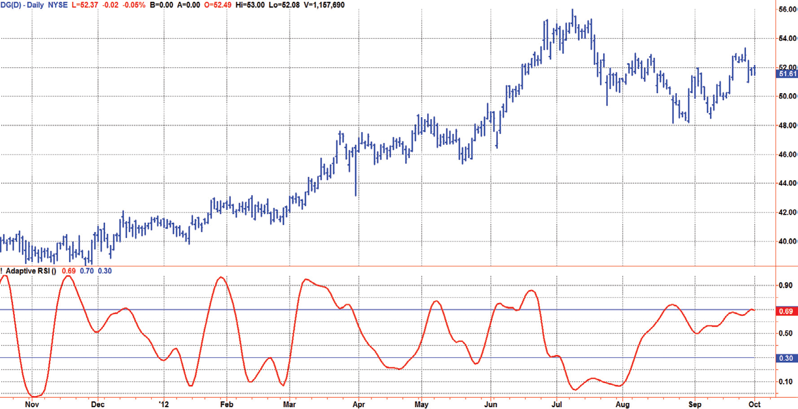
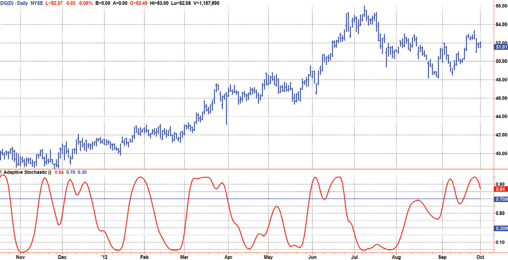
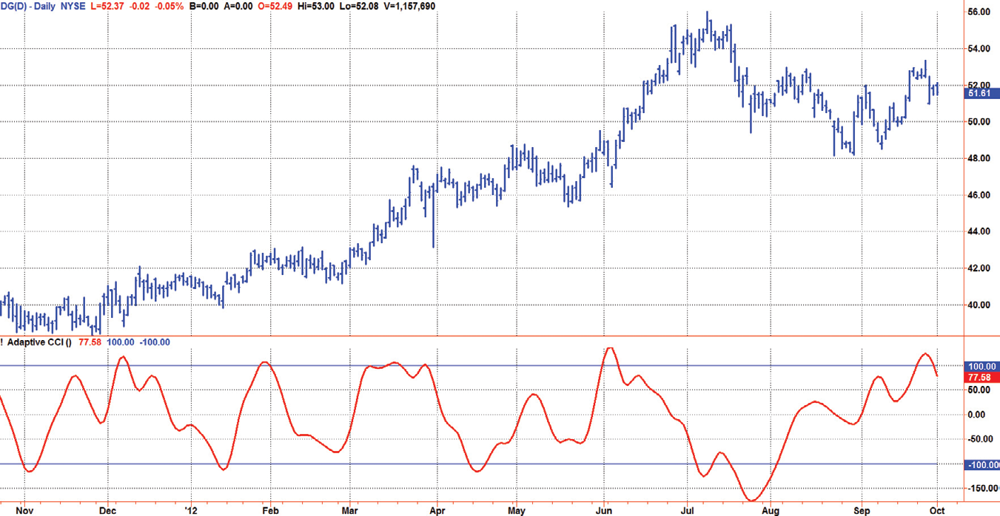
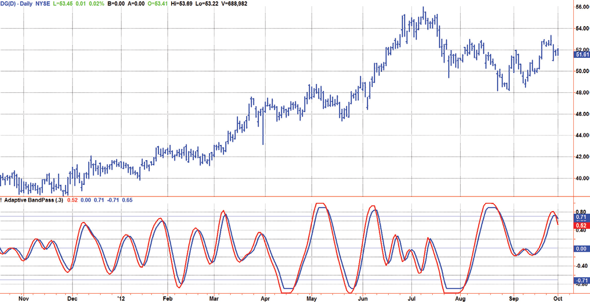
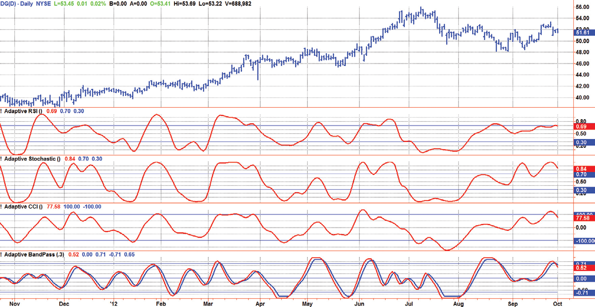

# Chapter 11: Spectral Estimation


## BibTeX

```bibtex
@InBook{ehlers2013cycle_ch11,
  author    = {Ehlers, John F.},
  title     = {Cycle Analytics for Traders: Advanced Technical Trading Concepts},
  chapter   = {11},
  chaptertitle = {Spectral Estimation},
  publisher = {Wiley},
  year      = {2013},
  series    = {Wiley Trading},
  isbn      = {9781118728604},
}
```

---

Adaptive Filters
“We should adjust the indicators,” said Tom rigidly.
A
daptive filters can have several different meanings. For example, Perry
Kaufman’s adaptive moving average (KAMA)1 and Tushar Chande’s variable
index dynamic average (VIDYA)2 adapt to changes in volatility. By definition,
these filters are reactive to price changes, and therefore they close the barn door
after the horse is gone. The adaptive filters discussed in this chapter are the famil-
iar Stochastic, relative strength index (RSI), commodity channel index (CCI),
and band-pass filter. The key parameter in each case is the lookback period used
to calculate the indicator. This lookback period is commonly a fixed value. How-
ever, since the measured cycle period is changing, as we have seen in previous
chapters, it makes sense to adapt these indicators to the measured cycle pe-
riod. When tradable market cycles are observed, they tend to persist for a short
while. Therefore, by tuning the indicators to the measure cycle period they are
optimized for current conditions and can even have predictive characteristics.
The dominant cycle period is measured using the autocorrelation peri-
odogram algorithm. That dominant cycle dynamically sets the lookback
period for the indicators. I employ my own streamlined computation for
the indicators that provide smoother and easier to interpret outputs than
traditional methods. Further, the indicator codes have been modified to re-
move the effects of spectral dilation. This basically creates a whole new set
of indicators for your trading arsenal.

## Adaptive Relative Strength Index (RSI)

Welles Wilder had just introduced the RSI3 when I began trading. I asked
my broker why 14 days was used in the calculation. His response was
­something like “because Wilder said so.” You have no idea how unsatisfying

that response was to an engineer, and that started me on my decades-long
quest to find the optimum indicator settings. I think I can now describe
those optimum settings.
Wilder's original RSI was defined by

$$RSI = 100 - \frac{100}{1 + RS}$$

where

$$RS = \frac{\text{Average of 14 day's closes UP}}{\text{Average of 14 day's closes DOWN}}$$

"Closes UP" meant that if today's close was higher than yesterday's close,
we would add the difference in closing prices to the average. Similarly, "closes
DOWN" meant that if today's close was lower than yesterday's, we would add
the positive difference in closing prices to the average. We can simplify the
RSI equation if we substitute RSI = CU / CD. Then,

$$RSI = 100 - \frac{100}{1 + \frac{CU}{CD}} = 100 - \frac{100 \cdot CD}{CD + CU} = \frac{100 \cdot CU + 100 \cdot CD - 100 \cdot CD}{CU + CD} = \frac{100 \cdot CU}{CU + CD}$$

Increasing generality, CU can mean the sum of closes up over any interval,
and CD can mean the sum of closes down over the same period. Additionally,
the factor of 100 is recognized as providing a simple scaling. So, RSI is just
the ratio of the sum of closes up to the sum of the absolute value of all the
differential closing prices.

$$RSI = \frac{CU}{CU + CD}$$

The question then becomes what is the best length to use for the RSI
summation. If we use an extremely long length, then the closes up will be
approximately half of the absolute value of all the closing price differentials.
In this case, the RSI would hover near 0.5 and would be basically worthless.
However, if the length used for summation is very short, then the RSI would
be stuck at 1 for extended periods in uptrends and would be stuck at 0 for
extended periods in downtrends. In a perfect world where prices swing as a

Adaptive Filters
sine wave having the period of the dominant cycle, the RSI would just touch
the value of 1 if the upswing half of the dominant cycle is used for the sum-
mation. Similarly, the RSI would just touch the value of 0 if the downswing
half of the dominant cycle is used for the summation. Therefore, to get the
optimum swing of the RSI indicator, the best adaptive summation length to
use is half the measured dominant cycle.
The adaptive RSI starts with the computation of the dominant cycle us-
ing the autocorrelation periodogram approach. Rather than describing the
computations, the reader is referred to the description in Chapter 8. Code
Listing 11-1 contains the EasyLanguage code for the adaptive RSI, and the
identification of the RSI indicator itself following the dominant cycle calcu-
lation is noted by the comment near the end. Since the objective is to use
only those frequency components passed by the roofing filter, the variable
Filt is used as a data input rather than closing prices. Rather than indepen-
dently taking the averages of the numerator and denominator, I chose to
perform smoothing on the ratio using the SuperSmoother filter described
in Chapter 3. The coefficients for the SuperSmoother filters have previously
been computed in the dominant cycle measurement part of the code. I have
included reference lines at the 30 percent and 70 percent levels, but these
can easily be adjusted to 20 percent/80 percent or whatever else serves the
purpose.

**Code Listing 11-1. EasyLanguage Code for the Adaptive RSI**

```easylanguage
{
Adaptive RSI
(c) 2013 John F. Ehlers
}
Vars:
AvgLength(3),
M(0),
N(0),
X(0),
Y(0),
alpha1(0),
HP(0),
(Continued )

a1(0),
b1(0),
c1(0),
c2(0),
c3(0),
Filt(0),
Lag(0),
count(0),
Sx(0),
Sy(0),
Sxx(0),
Syy(0),
Sxy(0),
Period(0),
Sp(0),
Spx(0),
MaxPwr(0),
DominantCycle(0),
Color1(0),
Color2(0),
Color3(0);
Arrays:
Corr[48](0),
CosinePart[48](0),
SinePart[48](0),
SqSum[48](0),
R[48, 2](0),
Pwr[48](0);
//Highpass filter cyclic components whose periods are shorter
than 48 bars
alpha1 = (Cosine(.707*360 / 48) + Sine (.707*360 / 48) - 1) /
Cosine(.707*360 / 48);
HP = (1 - alpha1 / 2)*(1 - alpha1 / 2)*(Close - 2*Close[1] +
Close[2]) + 2*(1 - alpha1)*HP[1] - (1 - alpha1)*(1 -
alpha1)*HP[2];
//Smooth with a Super Smoother Filter from equation 3-3
a1 = expvalue(-1.414*3.14159 / 10);

Adaptive Filters
b1 = 2*a1*Cosine(1.414*180 / 10);
c2 = b1;
c3 = -a1*a1;
c1 = 1 - c2 - c3;
Filt = c1*(HP + HP[1]) / 2 + c2*Filt[1] + c3*Filt[2];
//Pearson correlation for each value of lag
For Lag = 0 to 48 Begin
//Set the averaging length as M
M = AvgLength;
If AvgLength = 0 Then M = Lag;
Sx = 0;
Sy = 0;
Sxx = 0;
Syy = 0;
Sxy = 0;
For count = 0 to M - 1 Begin
X = Filt[count];
Y = Filt[Lag + count];
Sx = Sx + X;
Sy = Sy + Y;
Sxx = Sxx + X*X;
Sxy = Sxy + X*Y;
Syy = Syy + Y*Y;
End;
If (M*Sxx - Sx*Sx)*(M*Syy - Sy*Sy) > 0 Then Corr[Lag] =
(M*Sxy - Sx*Sy)/SquareRoot((M*Sxx - Sx*Sx)*(M*Syy -
Sy*Sy));
End;
For Period = 10 to 48 Begin
CosinePart[Period] = 0;
SinePart[Period] = 0;
For N = 3 to 48 Begin
CosinePart[Period] = CosinePart[Period] +
Corr[N]*Cosine(360*N / Period);
SinePart[Period] = SinePart[Period] + Corr[N]*Sine(360*N /
Period);
End;
(Continued )

SqSum[Period] = CosinePart[Period]*CosinePart[Period] +
SinePart[Period]*SinePart[Period];
End;
For Period = 10 to 48 Begin
R[Period, 2] = R[Period, 1];
R[Period, 1] = .2*SqSum[Period]*SqSum[Period] +
.8*R[Period, 2];
End;
//Find Maximum Power Level for Normalization
MaxPwr = .991*MaxPwr;
For Period = 10 to 48 Begin
If R[Period, 1] > MaxPwr Then MaxPwr = R[Period, 1];
End;
For Period = 3 to 48 Begin
Pwr[Period] = R[Period, 1] / MaxPwr;
End;
//Compute the dominant cycle using the CG of the spectrum
Spx = 0;
Sp = 0;
For Period = 10 to 48 Begin
If Pwr[Period] >= .5 Then Begin
Spx = Spx + Period*Pwr[Period];
Sp = Sp + Pwr[Period];
End;
End;
If Sp <> 0 Then DominantCycle = Spx / Sp;
If DominantCycle < 10 Then DominantCycle = 10;
If DominantCycle > 48 Then DominantCycle = 48;
//Adaptive RSI starts here, using half the measured dominant
cycle for tuning
Vars:
ClosesUp(0),
ClosesDn(0),
Denom(0),
MyRSI(0);
ClosesUp = 0;
ClosesDn = 0;

Adaptive Filters
```

For count = 0 to IntPortion(DominantCycle / 2 - 1) Begin
If Filt[count] > Filt[count + 1] Then ClosesUp = ClosesUp +
(Filt[count] - Filt[count + 1]);
If Filt[count] < Filt[count + 1] Then ClosesDn = ClosesDn +
(Filt[count + 1] - Filt[count]);
End;
Denom = ClosesUp + ClosesDn;
If Denom <> 0 and Denom[1] <> 0 Then MyRSI = c1*(ClosesUp /
Denom + ClosesUp[1] / Denom[1]) / 2 + c2*MyRSI[1] +
c3*MyRSI[2];
Plot1(MyRSI);
Plot2(.7);
Plot6(.3);
The adaptive RSI has been applied to Dollar General (symbol DG) over
roughly the last year in Figure 11.1. Note that the indicator reaches zero
or one only when the prices have had a cyclic swing over half the period of
the dominant cycle. These events happen relatively rarely, and show that the
indicator is properly tuned.



*Figure 11.1: Adaptive RSI Is Properly Tuned to Half the Dominant Cycle*

Period


## Adaptive Stochastic Indicator

The basic idea of the stochastic indicator is that it measures the current
closing price relative to the lowest close over the observation range, and
normalize that relative price to the range between the highest close and the
lowest close over the observation range. Since finding the highest close and
lowest close over the dominant cycle period is assured only by searching
over the entire dominant cycle period, the entire dominant cycle period is
used for the observation range in the calculations.
The adaptive stochastic indicator starts with the computation of the domi-
nant cycle using the autocorrelation periodogram approach. Rather than
­describing the computations, the reader is referred to the description in
Chapter 8. Code Listing 11-2 contains the EasyLanguage code for the adap-
tive stochastic indicator, and the identification of the indicator itself following
the dominant cycle calculation is noted by the comment near the end. Since
the objective is to use only those frequency components passed by the roofing
filter, the variable Filt is used as a data input rather than closing prices.
The first step is to identify the highest “close” and the lowest “close” over
the period of the current dominant cycle. The variable Stoc is computed as
the ratio of the current value of Filt to the price range and is the unfiltered
value of the adaptive stochastic. The Stoc variable is filtered using the SuperS-
moother filter first describe in Chapter 3. Rather than independently taking
the averages of the numerator and denominator, I chose to perform smooth-
ing on the ratio Stoc using the SuperSmoother filter described in Chapter 3.
The coefficients for the SuperSmoother filters have previously been com-
puted in the dominant cycle measurement part of the code. I have included
reference lines at the 30 percent and 70 percent levels, but these can easily
be adjusted to 20 percent/80 percent or whatever else serves the purpose.

**Code Listing 11-2. EasyLanguage Code for the Adaptive Stochastic Indicator**

```easylanguage
{
Adaptive Stochastic
(c) 2013 John F. Ehlers
}
Vars:
AvgLength(3),
M(0),

Adaptive Filters
N(0),
X(0),
Y(0),
alpha1(0),
HP(0),
a1(0),
b1(0),
c1(0),
c2(0),
c3(0),
Filt(0),
Lag(0),
count(0),
Sx(0),
Sy(0),
Sxx(0),
Syy(0),
Sxy(0),
Period(0),
Sp(0),
Spx(0),
MaxPwr(0),
DominantCycle(0);
Arrays:
Corr[48](0),
CosinePart[48](0),
SinePart[48](0),
SqSum[48](0),
R[48, 2](0),
Pwr[48](0);
//Highpass filter cyclic components whose periods are
shorter than 48 bars
alpha1 = (Cosine(.707*360 / 48) + Sine (.707*360 / 48) - 1) /
Cosine(.707*360 / 48);
HP = (1 - alpha1 / 2)*(1 - alpha1 / 2)*(Close - 2*Close[1] +
Close[2]) + 2*(1 - alpha1)*HP[1] - (1 - alpha1)*
(1 - alpha1)*HP[2];
//Smooth with a Super Smoother Filter from equation 3-3
(Continued )

a1 = expvalue(-1.414*3.14159 / 10);
b1 = 2*a1*Cosine(1.414*180 / 10);
c2 = b1;
c3 = -a1*a1;
c1 = 1 - c2 - c3;
Filt = c1*(HP + HP[1]) / 2 + c2*Filt[1] + c3*Filt[2];
//Pearson correlation for each value of lag
For Lag = 0 to 48 Begin
//Set the averaging length as M
M = AvgLength;
If AvgLength = 0 Then M = Lag;
Sx = 0;
Sy = 0;
Sxx = 0;
Syy = 0;
Sxy = 0;
For count = 0 to M - 1 Begin
X = Filt[count];
Y = Filt[Lag + count];
Sx = Sx + X;
Sy = Sy + Y;
Sxx = Sxx + X*X;
Sxy = Sxy + X*Y;
Syy = Syy + Y*Y;
End;
If (M*Sxx - Sx*Sx)*(M*Syy - Sy*Sy) > 0 Then Corr[Lag] =
(M*Sxy - Sx*Sy)/SquareRoot((M*Sxx - Sx*Sx)*(M*Syy -
Sy*Sy));
End;
For Period = 10 to 48 Begin
CosinePart[Period] = 0;
SinePart[Period] = 0;
For N = 3 to 48 Begin
CosinePart[Period] = CosinePart[Period] +
Corr[N]*Cosine(360*N / Period);
SinePart[Period] = SinePart[Period] + Corr[N]*Sine(360*N /
Period);
End;

Adaptive Filters
(Continued )
SqSum[Period] = CosinePart[Period]*CosinePart[Period] +
SinePart[Period]*SinePart[Period];
End;
For Period = 10 to 48 Begin
R[Period, 2] = R[Period, 1];
R[Period, 1] = .2*SqSum[Period]*SqSum[Period] +
.8*R[Period, 2];
End;
//Find Maximum Power Level for Normalization
MaxPwr = .995*MaxPwr;
For Period = 10 to 48 Begin
If R[Period, 1] > MaxPwr Then MaxPwr = R[Period, 1];
End;
For Period = 3 to 48 Begin
Pwr[Period] = R[Period, 1] / MaxPwr;
End;
//Compute the dominant cycle using the CG of the spectrum
Spx = 0;
Sp = 0;
For Period = 10 to 48 Begin
If Pwr[Period] >= .5 Then Begin
Spx = Spx + Period*Pwr[Period];
Sp = Sp + Pwr[Period];
End;
End;
If Sp <> 0 Then DominantCycle = Spx / Sp;
If DominantCycle < 10 Then DominantCycle = 10;
If DominantCycle > 48 Then DominantCycle = 48;
//Stochastic Computation starts here
Vars:
HighestC(0),
LowestC(0),
Stoc(0),
SmoothNum(0),
SmoothDenom(0),
AdaptiveStochastic(0);

```

The adaptive Stochastic has been applied to Dollar General (symbol
DG) over roughly the last year in Figure 11.2. An eyeball scan comparing
the prices and the adaptive stochastic shows that this indicator accurately
portrays the relative detrended prices over the length of the dominant
cycle period, and has many characteristics in common with the adaptive
RSI.
```easylanguage
HighestC = Filt;
LowestC = Filt;
For count = 0 to DominantCycle - 1 Begin
If Filt[count] > HighestC then HighestC = Filt[count];
If Filt[count] < LowestC then LowestC = Filt[count];
End;
Stoc = (Filt - LowestC) / (HighestC - LowestC);
AdaptiveStochastic = c1*(Stoc + Stoc[1]) / 2 +
c2*AdaptiveStochastic[1] + c3*AdaptiveStochastic[2];
Plot1(AdaptiveStochastic);
Plot2(.7);
Plot6(.3);
```




*Figure 11.2: Adaptive Stochastic Accurately Displays the Relative*

Detrended Prices over the Channel Length of the Dominant Cycle Period

Adaptive Filters

## Adaptive CCI (Commodity Channel Index)

The CCI indicator was first described by Donald Lambert4 as a means of sta-
tistically estimating where the current prices lie within the length of a chan-
nel. He basically compares the current price relative to a moving average of
prices over the length of the channel to the standard deviation of prices over
the same length. A standard deviation is just the square root of the averaged
squared difference of the prices from their moving averages. As a shorthand
way of thinking of it, the basic idea of the CCI is taking the ratio of the “in-
stantaneous deviation” to the standard deviation. Lambert also divides the
ratio by 0.015, which is the same as multiplying the ratio by 66.7. This scal-
ing factor sets +100 and −100 as approximations to the plus and minus one
standard deviation if the data had a Gaussian probability distribution. That is
not a good assumption, which can be proven heuristically by measuring the
data probability distributions over a lot of data.
The time length to be used for the channel in the calculations is widely var-
ied in the literature. In all cases, the length is rather arbitrarily established to fit
the indicator to some preconceived event. It seems to me that it would be bet-
ter to use one full period of the dominant cycle as the length of data to be used.
The adaptive CCI indicator starts with the computation of the dominant
cycle using the autocorrelation periodogram approach. Rather than describ-
ing the computations, the reader is referred to the description in Chapter 8.
Code Listing 11-3 contains the EasyLanguage code for the adaptive CCI in-
dicator, and the identification of the indicator itself is noted by the comment
near the end following the dominant cycle calculation. Since the objective
is to use only those frequency components passed by the roofing filter, the
variable Filt is used as a data input rather than the average of the high, low,
and close as was done by Lambert.
The first step in the computation is to find the average “price.” It is im-
portant to use this long form to compute the average price rather than the
fast algorithm of dropping off 1 / N of the oldest price and adding 1 / N of
the current price to the average because N is varying from bar to bar due
to the tuning using the dominant cycle period. Once the moving average is
computed, it is used to compute the root mean square (RMS) of the prices.
RMS is synonymous with the standard deviation. After creating the numera-
tor and the denominator, the ratio is smoothed using the SuperSmoother
filter described in Chapter 3. The coefficients for the SuperSmoother filters
have previously been computed in the dominant cycle measurement part of
the code. I have included reference lines at the +100 and −100 levels.


**Code Listing 11-3. EasyLanguage Code for the Adaptive CCI**

```easylanguage
{
Adaptive CCI
(c) 2013 John F. Ehlers
}
Vars:
AvgLength(3),
M(0),
N(0),
X(0),
Y(0),
alpha1(0),
HP(0),
a1(0),
b1(0),
c1(0),
c2(0),
c3(0),
Filt(0),
Lag(0),
count(0),
Sx(0),
Sy(0),
Sxx(0),
Syy(0),
Sxy(0),
Period(0),
Sp(0),
Spx(0),
MaxPwr(0),
DominantCycle(0);
Arrays:
Corr[48](0),
CosinePart[48](0),
SinePart[48](0),
SqSum[48](0),
R[48, 2](0),
Pwr[48](0);

Adaptive Filters
//Highpass filter cyclic components whose periods are
shorter than 48 bars
alpha1 = (Cosine(.707*360 / 48) + Sine (.707*360 / 48) - 1) /
Cosine(.707*360 / 48);
HP = (1 - alpha1 / 2)*(1 - alpha1 / 2)*(Close - 2*Close[1] +
Close[2]) + 2*(1 - alpha1)*HP[1] - (1 - alpha1)*
(1 - alpha1)*HP[2];
//Smooth with a Super Smoother Filter from equation 3-3
a1 = expvalue(-1.414*3.14159 / 10);
b1 = 2*a1*Cosine(1.414*180 / 10);
c2 = b1;
c3 = -a1*a1;
c1 = 1 - c2 - c3;
Filt = c1*(HP + HP[1]) / 2 + c2*Filt[1] + c3*Filt[2];
//Pearson correlation for each value of lag
For Lag = 0 to 48 Begin
//Set the averaging length as M
M = AvgLength;
If AvgLength = 0 Then M = Lag;
Sx = 0;
Sy = 0;
Sxx = 0;
Syy = 0;
Sxy = 0;
For count = 0 to M - 1 Begin
X = Filt[count];
Y = Filt[Lag + count];
Sx = Sx + X;
Sy = Sy + Y;
Sxx = Sxx + X*X;
Sxy = Sxy + X*Y;
Syy = Syy + Y*Y;
End;
If (M*Sxx - Sx*Sx)*(M*Syy - Sy*Sy) > 0 Then Corr[Lag] =
(M*Sxy - Sx*Sy)/SquareRoot((M*Sxx - Sx*Sx)*(M*Syy -
Sy*Sy));
End;
(Continued )

For Period = 10 to 48 Begin
CosinePart[Period] = 0;
SinePart[Period] = 0;
For N = 3 to 48 Begin
CosinePart[Period] = CosinePart[Period] +
Corr[N]*Cosine(360*N / Period);
SinePart[Period] = SinePart[Period] + Corr[N]*Sine(360*N /
Period);
End;
SqSum[Period] = CosinePart[Period]*CosinePart[Period] +
SinePart[Period]*SinePart[Period];
End;
For Period = 10 to 48 Begin
R[Period, 2] = R[Period, 1];
R[Period, 1] = .2*SqSum[Period]*SqSum[Period] +
.8*R[Period, 2];
End;
//Find Maximum Power Level for Normalization
MaxPwr = .991*MaxPwr[1];
For Period = 10 to 48 Begin
If R[Period, 1] > MaxPwr Then MaxPwr = R[Period, 1];
End;
For Period = 3 to 48 Begin
If MaxPwr <> 0 Then Pwr[Period] = R[Period, 1] / MaxPwr;
End;
//Compute the dominant cycle using the CG of the spectrum
Spx = 0;
Sp = 0;
For Period = 10 to 48 Begin
If Pwr[Period] >= .5 Then Begin
Spx = Spx + Period*Pwr[Period];
Sp = Sp + Pwr[Period];
End;
End;
If Sp <> 0 Then DominantCycle = Spx / Sp;
If DominantCycle < 10 Then DominantCycle = 10;
If DominantCycle > 48 Then DominantCycle = 48;

Adaptive Filters
```

The adaptive CCI has been applied to Dollar General (symbol DG)
over roughly the past year in Figure 11.3. This indicator accurately dis-
plays the level of the current prices within a channel. The duration of the
channel length is determined by the measured dominant cycle period.
The adaptive CCI exceeds the plus or minus one standard deviation only
occasionally.
```easylanguage
Vars:
Price(0),
AvePrice(0),
RMS(0),
Num(0),
Denom(0),
Ratio(0),
MyCCI(0);
//Adaptive CCI starts here, using half the measured dominant
cycle for tuning
Price = Filt;
AvePrice = 0;
For count = 0 to DominantCycle - 1 Begin;
AvePrice = AvePrice + Price[count];
End;
AvePrice = AvePrice / DominantCycle;
RMS = 0;
For count = 0 to DominantCycle - 1 Begin;
RMS = RMS + (Price[count] - AvePrice[count])*(Price[count] -
AvePrice[count]);
End;
RMS = SquareRoot(RMS / DominantCycle);
Num = Price - AvePrice;
Denom = .015*RMS;
Ratio = Num / Denom;
MyCCI = c1*(Ratio + Ratio[1]) / 2 + c2*MyCCI[1] + c3*MyCCI[2];
Plot1(MyCCI);
Plot2(100);
Plot6(-100);

```


## Adaptive Band-Pass Filter

If a band-pass filter can be designed, it just makes since to tune that fil-
ter to the measured dominant cycle to eliminate all the other frequency
components that are of no interest. The band-pass filter was described in
­Chapter 5. Here, the adaptive band-pass indicator starts with the computa-
tion of the dominant cycle using the autocorrelation periodogram approach.
Code Listing 11-4 contains the EasyLanguage code for the adaptive band-
pass indicator, and the identification of the indicator itself is noted by the
comment near the end following the calculation of the dominant cycle.
One way to make a band-pass filter have a leading phase capability is to tune
the filter to a period shorter than the period of the cycle being measured. In
this case, the bandwidth of filter is set to 0.3. That is 30 percent of the tuned
center period. Therefore, the half bandwidth is 15 percent. We tune the filter
to be 10 percent toward the shorter period from the dominant cycle period to
provide the phase lead while still having the data of interest be within the filter
bandwidth. This provides a phase lead of the dominant cycle to be something
on the order of 60 degrees, or one-sixth of a cycle. If the dominant cycle were
18 bars, for example, then the detuning of the filter would produce a 3-bar
lead. This leading function is not huge, but it is significant.
A convenient trigger line is included in the adaptive band-pass filter to
signal the more highly likely buy and sell points. The trigger is compute



*Figure 11.3: Adaptive CCI Shows the Price Location within the Channel*

Length Determined by the Measured Dominant Cycle Period

Adaptive Filters
as 90 percent of the amplitude of the adaptive band-pass filter line and is
­delayed by one bar. While the line crossings occur after the peak of the band-
pass filter, phase lead provides for the generation of a timely signal. Sig-
nificant trading signals should also include the criteria that the line crossing
occur at greater than the +0.7 and less than the −0.7 reference lines.

**Code Listing 11-4. EasyLanguage Code to Compute the Adaptive Band-Pass Filter**

```easylanguage
{
Adaptive BandPass Indicator
(c) 2013 John F. Ehlers
}
Inputs:
Bandwidth(.3);
Vars:
AvgLength(3),
M(0),
N(0),
X(0),
Y(0),
alpha1(0),
HP(0),
a1(0),
b1(0),
c1(0),
c2(0),
c3(0),
Filt(0),
Lag(0),
count(0),
Sx(0),
Sy(0),
Sxx(0),
Syy(0),
Sxy(0),
Period(0),
Sp(0),
(Continued )

Spx(0),
MaxPwr(0),
DominantCycle(0);
Arrays:
Corr[48](0),
CosinePart[48](0),
SinePart[48](0),
SqSum[48](0),
R[48, 2](0),
Pwr[48](0);
//Highpass filter cyclic components whose periods are
shorter than 48 bars
alpha1 = (Cosine(.707*360 / 48) + Sine (.707*360 / 48) - 1) /
Cosine(.707*360 / 48);
HP = (1 - alpha1 / 2)*(1 - alpha1 / 2)*(Close - 2*Close[1] +
Close[2]) + 2*(1 - alpha1)*HP[1] - (1 - alpha1)*
(1 - alpha1)*HP[2];
//Smooth with a Super Smoother Filter from equation 3-3
a1 = expvalue(-1.414*3.14159 / 10);
b1 = 2*a1*Cosine(1.414*180 / 10);
c2 = b1;
c3 = -a1*a1;
c1 = 1 - c2 - c3;
Filt = c1*(HP + HP[1]) / 2 + c2*Filt[1] + c3*Filt[2];
//Pearson correlation for each value of lag
For Lag = 0 to 48 Begin
//Set the averaging length as M
M = AvgLength;
If AvgLength = 0 Then M = Lag;
Sx = 0;
Sy = 0;
Sxx = 0;
Syy = 0;
Sxy = 0;
For count = 0 to M - 1 Begin
X = Filt[count];

Adaptive Filters
(Continued )
Y = Filt[Lag + count];
Sx = Sx + X;
Sy = Sy + Y;
Sxx = Sxx + X*X;
Sxy = Sxy + X*Y;
Syy = Syy + Y*Y;
End;
If (M*Sxx - Sx*Sx)*(M*Syy - Sy*Sy) > 0 Then Corr[Lag] =
(M*Sxy - Sx*Sy)/SquareRoot((M*Sxx - Sx*Sx)*(M*Syy - Sy*Sy));
End;
For Period = 10 to 48 Begin
CosinePart[Period] = 0;
SinePart[Period] = 0;
For N = 3 to 48 Begin
CosinePart[Period] = CosinePart[Period] +
Corr[N]*Cosine(360*N / Period);
SinePart[Period] = SinePart[Period] + Corr[N]*Sine(360*N /
Period);
End;
SqSum[Period] = CosinePart[Period]*CosinePart[Period] +
SinePart[Period]*SinePart[Period];
End;
For Period = 10 to 48 Begin
R[Period, 2] = R[Period, 1];
R[Period, 1] = .2*SqSum[Period]*SqSum[Period] +
.8*R[Period, 2];
End;
//Find Maximum Power Level for Normalization
MaxPwr = .995*MaxPwr;
For Period = 10 to 48 Begin
If R[Period, 1] > MaxPwr Then MaxPwr = R[Period, 1];
End;
For Period = 3 to 48 Begin
Pwr[Period] = R[Period, 1] / MaxPwr;
End;
//Compute the dominant cycle using the CG of the spectrum
Spx = 0;
Sp = 0;

For Period = 10 to 48 Begin
If Pwr[Period] >= .5 Then Begin
Spx = Spx + Period*Pwr[Period];
Sp = Sp + Pwr[Period];
End;
End;
If Sp <> 0 Then DominantCycle = Spx / Sp;
If DominantCycle < 10 Then DominantCycle = 10;
//Adaptive BandPass indicator tunes a BandPass filter to 90%
of the period of the Dominant Cycle
Vars:
gamma1(0),
alpha2(0),
beta1(0),
BP(0),
Peak(0),
Signal(0),
Lead(0),
LeadPeak(0),
LeadSignal(0);
beta1 = Cosine(360 / (.9*DominantCycle));
gamma1 = 1 / Cosine(360*Bandwidth / (.9*DominantCycle));
alpha2 = gamma1 - SquareRoot(gamma1*gamma1 - 1);
BP = .5*(1 - alpha2)*(Filt - Filt[2]) + beta1*(1 +
alpha2)*BP[1] - alpha2*BP[2];
If Currentbar = 1 or CurrentBar = 2 Then BP = 0;
Peak = .991*Peak[1];
If AbsValue(BP) > Peak Then Peak = AbsValue(BP);
If Peak <> 0 Then Signal = BP / Peak;
Lead = 1.3*(Signal + Signal[1] - Signal[2] - Signal[3]) / 4;
LeadPeak = .93*LeadPeak[1];
If AbsValue(Lead) > LeadPeak Then LeadPeak = Absvalue(Lead);
If LeadPeak <> 0 Then LeadSignal = .7*Lead / LeadPeak;
Plot1(Signal);
Plot14(.9*Signal[1]);
Plot2(0);
Plot6(.707);
Plot10(-.707);

Adaptive Filters
```

The adaptive band-pass filter has been applied to Dollar General (symbol
DG) over roughly the past year in Figure 11.4. This indicator accurately dis-
plays cyclic entry points when the two indicator lines cross outside the plus
or minus 0.7 reference lines.

## Adaptive Indicator Comparison

It is instructive to view the adaptive indicators on a single chart so they can be
compared on a head-to-head basis. This comparison is available in Figure 11.5.
The most striking difference is that the band-pass filter has more high-



*Figure 11.4: The Adaptive Band-Pass Filter Shows Buying and Selling*

Opportunities



*Figure 11.5: Comparison of the Adaptive Indicators*


frequency components. It is also apparent to me that the RSI, Stochastic, and
CCI all pretty much indicate the same thing in the broad general sense. With-
out indicator transforms to enhance interpretation, which we cover in Chap-
ter 15, there is no overwhelming reason to select one indicator over another.

## Key Points to Remember

1.	 When length is an input parameter to any indicator, that indicator can
often be optimized by tuning that length to the dominant cycle period
or a fraction thereof.
2.	 The preferred method of computing the dominant cycle is using the
autocorrelation periodogram.
3.	 The RSI indicator is optimized over half the period of the measured
dominant cycle to reach full-scale swings without oversaturation.
4.	 The stochastic indicator is optimized over the full period of the meas-
ured dominant cycle to ensure the highest close and the lowest close
have been included.
5.	 The CCI indicator is optimized over the full period of the measured
dominant cycle to ensure a complete measurement of the standard
­deviation.
6.	 The band-pass filter is optimized by tuning the filter to 90 percent of
the measured dominant cycle period. This provides an approximate
60-degree phase lead in the indicator.
Notes
1.	 P. J. Kaufman, Trading Systems and Methods, 3rd ed. (New York: John
Wiley & Sons, 1998), pp. 436–438.
2.	 T. S. Chande and S. Kroll, The New Technical Trader (New York: John Wiley
& Sons, 1994).
3.	 J. Welles Wilder, Jr., New Concepts in Technical Trading Systems (Winston-
Salem, NC: Hunter, 1978).
4.	 D. Lambert, Commodities Magazine, October 1980.

