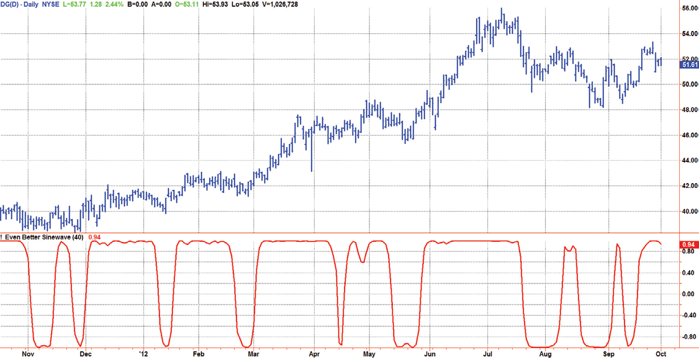
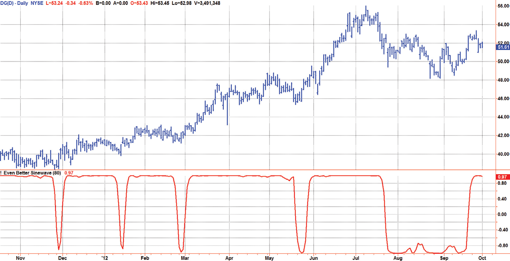
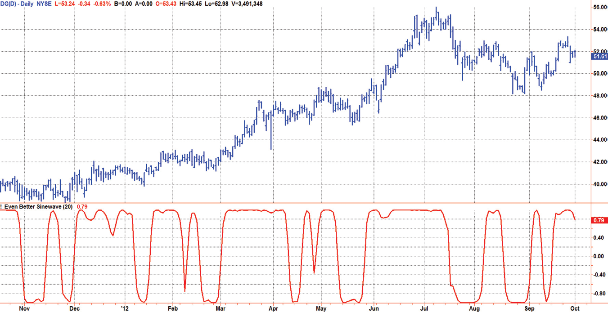

# Chapter 12: Convolution


## BibTeX

```bibtex
@InBook{ehlers2013cycle_ch12,
  author    = {Ehlers, John F.},
  title     = {Cycle Analytics for Traders: Advanced Technical Trading Concepts},
  chapter   = {12},
  chaptertitle = {Convolution},
  publisher = {Wiley},
  year      = {2013},
  series    = {Wiley Trading},
  isbn      = {9781118728604},
}
```

---

The Even Better
Sinewave Indicator
“This is heavy stuff,” said Tom lighty.
I
first introduced the Sinewave Indicator as early as 1996.1,2 The concept
was based on the idea that no technical indicator is predictive. All indica-
tors rely on historical data, and are therefore their signals are always lagging.
However, cycles exist in the market, and it is often true that an observed
cycle will continue for a short while into the future. Therefore, if we can
transfer the cyclic data swings to a sine wave, we can then artificially advance
the phase of the sine wave to create a predictive indicator.
Two conditions must be satisfied to make the Sinewave Indicator use-
ful. First, the market must be in a cycle mode. Making a cyclic prediction
when the data are in a trend is basically futile. Second, the period of the
dominant cycle must be estimated with reasonable accuracy. The downside
of the Sinewave Indicator is that the amplitude swings must be from −1 to
+1, and therefore there is no direct indication of when the market is in a
trend mode.
Since the roofing filter gives control of the frequency content of the
data to be analyzed, the basic idea is to use the frequency content to an
advantage. This control enables the Even Better Sinewave Indicator to not
only enter a trade as quickly as possible, but also use the trend compo-
nent to give the confidence to stay with an existing trade without being
whipsawed.


## Even Better Sinewave Approach

The original Sinewave Indicator was created by seeking the dominant cycle
phase angle that had the best correlation between the price data and a theo-
retical dominant cycle sine wave. The Even Better Sinewave Indicator skips
all the cycle measurements completely and relies on a strong normaliza-
tion of the waveform at the output of a modified roofing filter. The modi-
fied roofing filter uses a single-pole high-pass filter to deliberately retain the
longer-period trend components. The single-pole high-pass filter basically
levels the amplitude of all the cycle components that would otherwise be
larger with longer wavelengths due to Spectral Dilation. Therefore, when
the waveform is normalized to the power in the waveform over a short pe-
riod of time, the longer wavelength contributions tend to be an indication
to stay in a trade when the market is in a trend.
The Even Better Sinewave Indicator works extraordinarily well when the
market is in a trend mode. This means that the spectacular failures of most
swing wave indicators are mitigated when the expected price turning point
does not occur.
Although I have not studied it extensively, it appears that the Even Better
Sinewave Indicator works well on futures intraday data. It takes a position in
the correct direction and tends to stay with the good trades without exces-
sive whipsawing.

## Even Better Sinewave Description

The Even Better Sinewave Indicator is described with reference to the
EasyLanguage code given in Code Listing 12-1. The only user input for the
indicator is the expected maximum duration of the trades when the market
is in a trend. Making the duration input parameter shorter will increase the
number of trades over a given time span, and will have a minor effect of
entering the trades a little sooner. Conversely, increasing the duration input
parameter has the primary effect of holding and indicated trade position
longer.
After declaring variables, the data is filtered in a single-pole high-pass fil-
ter. A single-pole high-pass filter is deliberately selected to equalize the data
spectrum and allow trending components through the filter into the indica-
tor. The degree of the spectrum allowed through the filter is established by
the duration input. The value of the duration input is set to be approximately

The Even Better Sinewave Indicator
the length of a trade position in a continuing trend. The default value of the
duration input is 40 bars, so a maximum trade duration of about two months
can be expected with this setting. Increasing the duration input will increase
the maximum duration of a trade in a trend. This has the implication that
you will be working through some additional drawdowns throughout the
trade with the benefit that you will not be whipsawed out of a profitable
trending trade.
The high-pass filtered data is then filtered in a SuperSmoother filter
whose critical period is set to 10 bars.
After the data is passed through the modified roofing filter the three-
bar average of the wave amplitude and the power are computed. Power is
proportional to the square of the wave amplitude. The Even Better Sin-
ewave is then computed by normalizing the averaged wave amplitude to
the square root of the averaged power, causing the indicator to swing be-
tween −1 and +1.

**Code Listing 12-1. Even Better Sinewave Indicator EasyLanguage Code**

```easylanguage
{
Even Better Sinewave Indicator
© 2013  John F. Ehlers
}
Inputs:
Duration(40);
Vars:
alpha1(0),
HP(0),
a1(0),
b1(0),
c1(0),
c2(0),
c3(0),
Filt(0),
count(0),
Wave(0),
Pwr(0);
(Continued )

```


## Using the Even Better Sinewave Indicator

The Even Better Sinewave Indicator is shown in Figure 12.1, using the de-
fault duration setting of 40 bars. This means that the maximum length of
a trade when the market is in a trend is about two months. This is because
the high-pass filter starts to attenuate the cyclic components that are longer
than 40 bars.
Interpretation of the Even Better Sinewave is simple. Hold a long posi-
tion when the indicator value is near +1, and hold a short position (or go flat
if trading to the long side only) when the indicator value is near −1.
The trade duration in a trend can be extended just by increasing the du-
ration input value. For example, the indicator using a duration value of 40
is shown in Figure 12.2. Sure enough, the indicated long position in the
uptrend is extended. Doing this causes some of the short-term reversals
during the trend to be eliminated. The duration input parameter is adjusted
to fit your trading style.
```easylanguage
//HighPass filter cyclic components whose periods are
shorter than Duration input
alpha1 = (1 - Sine (360 / Duration)) / Cosine(360 /
Duration);
HP = .5*(1 + alpha1)*(Close - Close[1]) + alpha1*HP[1];
//Smooth with a Super Smoother Filter from equation 3-3
a1 = expvalue(-1.414*3.14159 / 10);
b1 = 2*a1*Cosine(1.414*180 / 10);
c2 = b1;
c3 = -a1*a1;
c1 = 1 - c2 - c3;
Filt = c1*(HP + HP[1]) / 2 + c2*Filt[1] + c3*Filt[2];
//3 Bar average of Wave amplitude and power
Wave = (Filt + Filt[1] + Filt[2]) / 3;
Pwr = (Filt*Filt + Filt[1]*Filt[1] + Filt[2]*Filt[2]) / 3;
//Normalize the Average Wave to Square Root of the Average
Power
Wave = Wave / SquareRoot(Pwr);
Plot1(Wave);

The Even Better Sinewave Indicator
Conversely, decreasing the duration input parameter shortens the maxi-
mum trade length when the market is in a trend, being more sensitive to the
shorter wavelengths in the data. For example, Figure 12.3 shows the indi-
cator when the duration input is set to 20 bars. Some care should be taken
when shortening the duration input because the resulting shorter trades
are more sensitive to entry and exit timing and computational lag of the
indicator.
```




*Figure 12.1: The Default Even Better Sinewave Indicator Holds a Position*

for about Two Months in a Trend



*Figure 12.2: Trade Position Length is Increased by Increasing the*

Duration Input Parameter


## Key Points to Remember

1.	 The Even Better Sinewave Indicator is a variant of the roofing filter, us-
ing a single-pole high-pass filter.
2.	 The unambiguous signals of the Even Better Sinewave Indicator are gen-
erated by normalizing the wave amplitude to the square root of the
power.
3.	 The only input for the Even Better Sinewave Indicator is the duration
parameter.
4.	 The duration parameter controls the maximum length of an indicated
position by setting the critical period of the high-pass filter.
Notes
1. 	John F. Ehlers, “Stay in Phase,” Stocks & Commodities, November 1996,
Vol. 14, No. 11, p. 69.
2. 	John F. Ehlers, Rocket Science for Traders: Digital Signal Processing Applica-
tions (Hoboken, NJ: John Wiley & Sons, 2001), Chapter 9.



*Figure 12.3: Decreasing the Duration Input Parameter Make the Even*

Better Sinewave Indicator More Sensitive to Short-Term Variations in the Data

