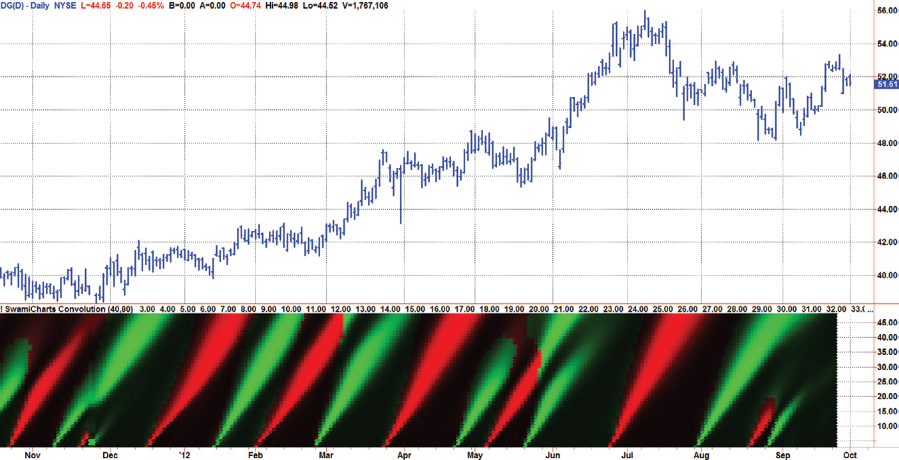
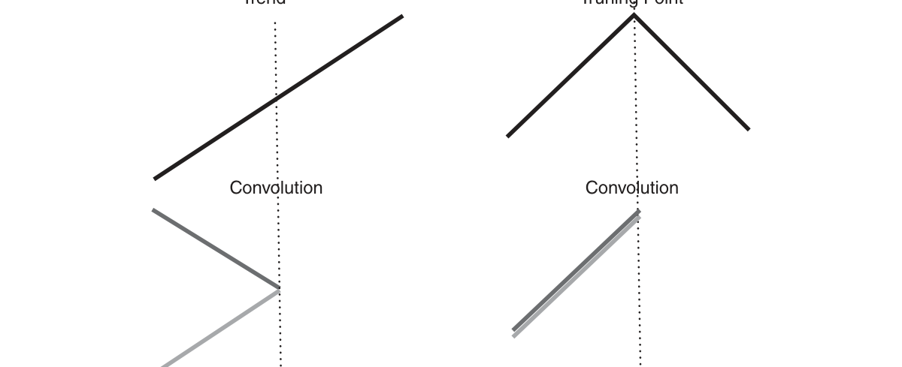
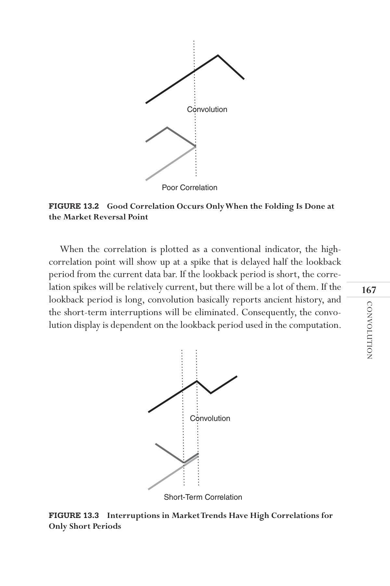

# Chapter 13: Signal-to-Noise Ratio


## BibTeX

```bibtex
@InBook{ehlers2013cycle_ch13,
  author    = {Ehlers, John F.},
  title     = {Cycle Analytics for Traders: Advanced Technical Trading Concepts},
  chapter   = {13},
  chaptertitle = {Signal-to-Noise Ratio},
  publisher = {Wiley},
  year      = {2013},
  series    = {Wiley Trading},
  isbn      = {9781118728604},
}
```

---

Convolution
“I need to know when the market reverses,” said Tom pointedly.
O
ne of the major objectives of technical analysis is to decisively identify
a major reversal so that one can trade the market primarily in the
direction of the ensuing trend. Convolution is just the ticket to meet that
objective.
In mathematics, convolution is an operation on two functions that pro-
duces a third function. Convolution is similar to cross-correlation between
the two input functions—with a twist. A somewhat antique name for con-
volution is faltung, which means folding in German. It is this folding concept
that makes convolution useful for trading.
In this chapter, we will spare you the details of the mathematics and will
jump from the theoretical concept to useful trading examples.

## Theoretical Foundation

Consider what happens at an idealized market bottom. The prices decrease
linearly until the bottom is reached and then increase linearly after the
bottom has occurred. If we fold these idealized prices about the market
bottom, the two price segments are perfectly correlated. That is, we have
cross-correlated two market segments that have been folded at the horizon-
tal point of the market bottom. This perfect correlation occurs only at the
idealized market bottom that, in fact, establishes the need for prefiltering
before the correlation is calculated so that a relatively high correlation can
be achieved using real data.



*Figure 13.1: shows two graphic examples of convolution in an initial up-*

trend. In the left-hand case, the folding has been done in the middle of a

continuing trend. The resultant is that the two price segments are not cor-
related after the folding operation. However, if the folding is done at exactly
the market peak, as shown in the right-hand case, the two price segments
are exactly correlated after the folding operation.
Since high correlation exists only at the market turning point, the convo-
lution indicator is dependent on the lookback period used in the calculation.
Assuming the two price segments have an equal time duration, the peak cor-
relation occurs at half the lookback period of the indicator. For example, if a
13-bar period is used, the market peak would appear with a 7-bar delay. The
same market peak would appear with a 19-bar delay if a 39-bar lookback
period were used in the convolution computation. The case of the market
peak’s not occurring at the folding point is illustrated in Figure 13.2, show-
ing how the correlation decreases when the folding point does not occur at
the market peak.
Still another case is shown in Figure 13.3, where the market trend is
briefly interrupted and then resumes. As long as the lookback period is
equal to or less than twice the distance between the two vertical dotted
lines, a high-correlation event will occur at half the lookback period. How-
ever, when the lookback period becomes longer, the noncorrelated line seg-
ment is included in the convolution computation and the overall correlation
is reduced.
Trend
Convolution
No Correlation
Truning Point
Convolution
Correlation



*Figure 13.1: High Correlations Occur Only at Major Market Turning*
Points

Convolution
When the correlation is plotted as a conventional indicator, the high-
correlation point will show up at a spike that is delayed half the lookback
period from the current data bar. If the lookback period is short, the corre-
lation spikes will be relatively current, but there will be a lot of them. If the
lookback period is long, convolution basically reports ancient history, and
the short-term interruptions will be eliminated. Consequently, the convo-
lution display is dependent on the lookback period used in the computation.
Convolution
Poor Correlation



*Figure 13.2: Good Correlation Occurs Only When the Folding Is Done at*
the Market Reversal Point
Figure 13.3  Interruptions in Market Trends Have High Correlations for
Only Short Periods
Convolution
Short-Term Correlation


## Heat Map Display

The convolution indicator covers a range of lookback periods. The verti-
cal scale of the indicator is the lookback period, and the indicator value is
converted to colors. An indicator is repeatedly calculated for each lookback
period for each new bar of data. The result is a heat map display that is in
time sync with the price data and the values of the indicator are shown for
the full range of useful lookback periods.
When the convolution computations are displayed as colors over the range
of lookback periods, the resulting chart shows the high correlation points as
“plumes” that point back precisely to the major market reversals. The inter-
ruptions in market trends show up as foreshorted and vestigial plumes.
The convolution for approximately the last year on the Dollar General
(symbol DG) is shown in Figure 13.4. By taking the direction of the trend
into account, market tops are displayed as red plumes (signaling a reversal to
the downside), and market bottoms are displayed as green plumes (signaling a
reversal to the upside). The foreshortened plumes in January 2011 signal that
the uptrend from the fall of 2010 is still in play. For the remainder of 2011,
the five red plumes and the six green plumes absolutely nail the major market
reversals. The reversal points are located at the bottom of the convolution
subgraph, and the long plumes identify each as a major turning point. Since a
finite amount of data is required to make the shortest calculation, convolution
is moved four bars to the left to better correlate the indicator with the actual
turning point. This technique is similar to that of a centered moving average.
Figure 13.4  Convolution Nailed Each Market Reversal over the Past Year

Convolution

## Computing Convolution

For those interested in computing the convolution indicator on their
own, the process is relatively straightforward. A filter to minimize the ef-
fects of Spectral Dilation precedes the actual calculation, and the short-
est and longest periods of this filter are profit as user inputs. The default
values are 40 bars and 80 bars. The shortest period can be reduced to re-
duce computational lag, but at the expense of additional display artifacts
near the bottom of the display. After declaring the variables and the ar-
rays, undesired long-wave cyclic components are removed by a two-pole
high-pass filter tuned to the longest period. The high-pass filter is fol-
lowed by the SuperSmoother of Equation 3-3, whose transfer response
is displayed in Figure 3.10. The 40-bar period for this filter was selected
to reduce the displays of all but the major turning points. Since the mar-
ket data are fractal (the longer cycle periods have the larger swings), we
want to avoid spurious displays of relatively minor turning points. Thus,
the combination of the high-pass filter and the SuperSmoother form a
“roofing” filter that passes the desired range of frequency components
useful for convolution.
Textbook Pearson correlation is accomplished for each of the lookback
periods from 1 to 48, and a correlation value is assigned to each lookback
period. The variable X is the base data stream, and the variable Y is the data
stream folded back for each calculation loop. The values of X, Y, X * X, X * Y,
and Y * Y are summed over the lookback length before being applied to the
correlation equation. The correlation resulting from the computations var-
ies from −1 to +1. These correlation values are applied to an inverse Fisher
transform2 to sharpen the display and then rescaled to vary between 0 and
1 for plotting purposes.
There is a considerable amount of information to be displayed, and a
heat map is used to make sense of it all. The general scheme is that for
each horizontal axis time position the vertical displacement is equal to
the lag from 3 to 48. The correlation value for each lag is converted to a
color. If the slope of the prices over the lookback period is positive, then
the hue is red.  The saturation of the red color is determined by the value
of the correlation.  If the slope of the prices over the lookback period
is negative, then the hue is green.  The saturation of the green color is
determined by the value of the correlation.
The EasyLanguage code to compute the Convolution indicator is given
in Code Listing 13-1.


**Code Listing 13-1. EasyLanguage Code to Compute and Display Convolution**

```easylanguage
{
Convolution Indicator
(c) 2013  John F. Ehlers
}
Inputs:
ShortestPeriod(40),
LongestPeriod(80);
Vars:
alpha1(0),
HP(0),
a1(0),
b1(0),
c1(0),
c2(0),
c3(0),
Filt(0),
N(0),
II(0),
X(0),
Y(0),
Sx(0),
Sy(0),
Sxx(0),
Syy(0),
Sxy(0),
Color1(0),
Color2(0),
Color3(0);
Arrays:
Corr[48](0),
Slope[48](0),
Convolution[48](0);
//HighPass filter cyclic components whose periods are
shorter than 48 bars
alpha1 = (Cosine(1.414*360 / LongestPeriod) + Sine
(1.414*360 / LongestPeriod) - 1) / Cosine(1.414*360 /
LongestPeriod);

Convolution
HP = (1 - alpha1 / 2)*(1 - alpha1 / 2)*(Close - 2*Close[1] +
Close[2]) + 2*(1 - alpha1)*HP[1] - (1 - alpha1)*
(1 - alpha1)*HP[2];
//Smooth with a Super Smoother Filter from equation 3-3
a1 = expvalue(-1.414*3.14159 / ShortestPeriod);
b1 = 2*a1*Cosine(1.414*180 / ShortestPeriod);
c2 = b1;
c3 = -a1*a1;
c1 = 1 - c2 - c3;
Filt = c1*(HP + HP[1]) / 2 + c2*Filt[1] + c3*Filt[2];
For N = 1 to 48 Begin
Sx = 0;
Sy = 0;
Sxx = 0;
Syy = 0;
Sxy = 0;
For II = 1 to N Begin
X = Filt[II - 1];
Y = Filt[N - II];
Sx = Sx + X;
Sy = Sy + Y;
Sxx = Sxx + X*X;
Sxy = Sxy + X*Y;
Syy = Syy + Y*Y;
End;
If (N*Sxx - Sx*Sx)*(N*Syy - Sy*Sy) > 0 Then Corr[N] =
(N*Sxy - Sx*Sy)/SquareRoot((N*Sxx - Sx*Sx)*(N*Syy -
Sy*Sy));
Slope[N] = 1;
If Filt[IntPortion(.5*N)] < Filt Then Slope[N] = -1;
Convolution[N] = (1 + (ExpValue(3*Corr[N]) - 1) /
(ExpValue(3*Corr[N]) + 1)) / 2;
End;
//Plot as a Heatmap
For N = 3 to 48 Begin
If Slope[N] > 0 Then Begin
Color1 = 255*Convolution[N];
Color2 = 0;
End;
(Continued )

If Slope[N] < 0 Then Begin
Color1 = 0;
Color2 = 255*Convolution[N];
End;
Color3 = 0;
If N = 2 Then Plot2[4](2, “S2”, RGB(Color1, Color2,
Color3),0,4);
If N = 3 Then Plot3[4](3, “S3”, RGB(Color1, Color2,
Color3),0,4);
If N = 4 Then Plot4[4](4, “S4”, RGB(Color1, Color2,
Color3),0,4);
If N = 5 Then Plot5[4](5, “S5”, RGB(Color1, Color2,
Color3),0,4);
If N = 6 Then Plot6[4](6, “S6”, RGB(Color1, Color2,
Color3),0,4);
If N = 7 Then Plot7[4](7, “S7”, RGB(Color1, Color2,
Color3),0,4);
If N = 8 Then Plot8[4](8, “S8”, RGB(Color1, Color2,
Color3),0,4);
If N = 9 Then Plot9[4](9, “S9”, RGB(Color1, Color2,
Color3),0,4);
If N = 10 Then Plot10[4](10, “S10”, RGB(Color1, Color2,
Color3),0,4);
If N = 11 Then Plot11[4](11, “S11”, RGB(Color1, Color2,
Color3),0,4);
If N = 12 Then Plot12[4](12, “S12”, RGB(Color1, Color2,
Color3),0,4);
If N = 13 Then Plot13[4](13, “S13”, RGB(Color1, Color2,
Color3),0,4);
If N = 14 Then Plot14[4](14, “S14”, RGB(Color1, Color2,
Color3),0,4);
If N = 15 Then Plot15[4](15, “S15”, RGB(Color1, Color2,
Color3),0,4);
If N = 16 Then Plot16[4](16, “S16”, RGB(Color1, Color2,
Color3),0,4);
If N = 17 Then Plot17[4](17, “S17”, RGB(Color1, Color2,
Color3),0,4);
If N = 18 Then Plot18[4](18, “S18”, RGB(Color1, Color2,
Color3),0,4);
If N = 19 Then Plot19[4](19, “S19”, RGB(Color1, Color2,
Color3),0,4);
If N = 20 Then Plot20[4](20, “S20”, RGB(Color1, Color2,
Color3),0,4);

Convolution
If N = 21 Then Plot21[4](21, “S21”, RGB(Color1, Color2,
Color3),0,4);
If N = 22 Then Plot22[4](22, “S22”, RGB(Color1, Color2,
Color3),0,4);
If N = 23 Then Plot23[4](23, “S23”, RGB(Color1, Color2,
Color3),0,4);
If N = 24 Then Plot24[4](24, “S24”, RGB(Color1, Color2,
Color3),0,4);
If N = 25 Then Plot25[4](25, “S25”, RGB(Color1, Color2,
Color3),0,4);
If N = 26 Then Plot26[4](26, “S26”, RGB(Color1, Color2,
Color3),0,4);
If N = 27 Then Plot27[4](27, “S27”, RGB(Color1, Color2,
Color3),0,4);
If N = 28 Then Plot28[4](28, “S28”, RGB(Color1, Color2,
Color3),0,4);
If N = 29 Then Plot29[4](29, “S29”, RGB(Color1, Color2,
Color3),0,4);
If N = 30 Then Plot30[4](30, “S30”, RGB(Color1, Color2,
Color3),0,4);
If N = 31 Then Plot31[4](31, “S31”, RGB(Color1, Color2,
Color3),0,4);
If N = 32 Then Plot32[4](32, “S32”, RGB(Color1, Color2,
Color3),0,4);
If N = 33 Then Plot33[4](33, “S33”, RGB(Color1, Color2,
Color3),0,4);
If N = 34 Then Plot34[4](34, “S34”, RGB(Color1, Color2,
Color3),0,4);
If N = 35 Then Plot35[4](35, “S35”, RGB(Color1, Color2,
Color3),0,4);
If N = 36 Then Plot36[4](36, “S36”, RGB(Color1, Color2,
Color3),0,4);
If N = 37 Then Plot37[4](37, “S37”, RGB(Color1, Color2,
Color3),0,4);
If N = 38 Then Plot38[4](38, “S38”, RGB(Color1, Color2,
Color3),0,4);
If N = 39 Then Plot39[4](39, “S39”, RGB(Color1, Color2,
Color3),0,4);
If N = 40 Then Plot40[4](40, “S40”, RGB(Color1, Color2,
Color3),0,4);
If N = 41 Then Plot41[4](41, “S41”, RGB(Color1, Color2,
Color3),0,4);
If N = 42 Then Plot42[4](42, “S42”, RGB(Color1, Color2,
Color3),0,4);
(Continued )

```


## Key Points to Remember

1.	 Convolution is synonymous with “folding.” The convolution indicator
finds price reversal points by identifying the highest correlation of the
data by folding it in the time dimension about the lookback period.
2.	 The major price reversals are identified by plumes pointing backward to
the time of the price reversal.
3.	 Tops and bottoms can be identified by color using the price slope to as-
sign the color values.
Notes
1. 	John Ehlers and Ric Way, “SwamiCharts Convolution,” Stocks & Commodi-
ties, October 2012, Vol. 30, No. 10, pp. 10–13.
2. 	John Ehlers, “The Inverse Fisher Transform,” Stocks & Commodities, 2004,
Vol. 22, No. 5, pp. 38−42.
```easylanguage
If N = 43 Then Plot43[4](43, “S43”, RGB(Color1, Color2,
Color3),0,4);
If N = 44 Then Plot44[4](44, “S44”, RGB(Color1, Color2,
Color3),0,4);
If N = 45 Then Plot45[4](45, “S45”, RGB(Color1, Color2,
Color3),0,4);
If N = 46 Then Plot46[4](46, “S46”, RGB(Color1, Color2,
Color3),0,4);
If N = 47 Then Plot47[4](47, “S47”, RGB(Color1, Color2,
Color3),0,4);
If N = 48 Then Plot48[4](48, “S48”, RGB(Color1, Color2,
Color3),0,4);
End;


```