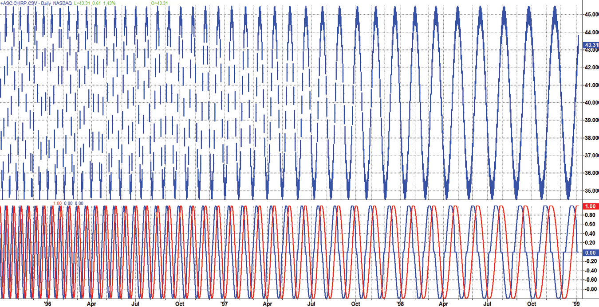
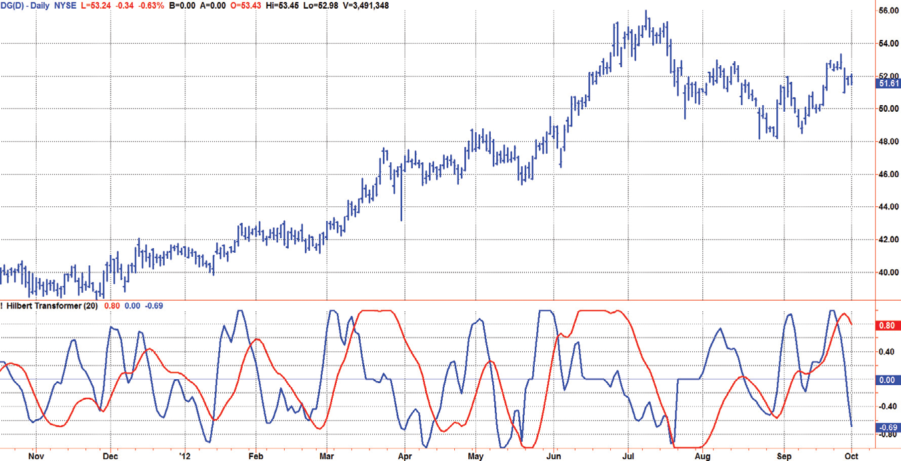
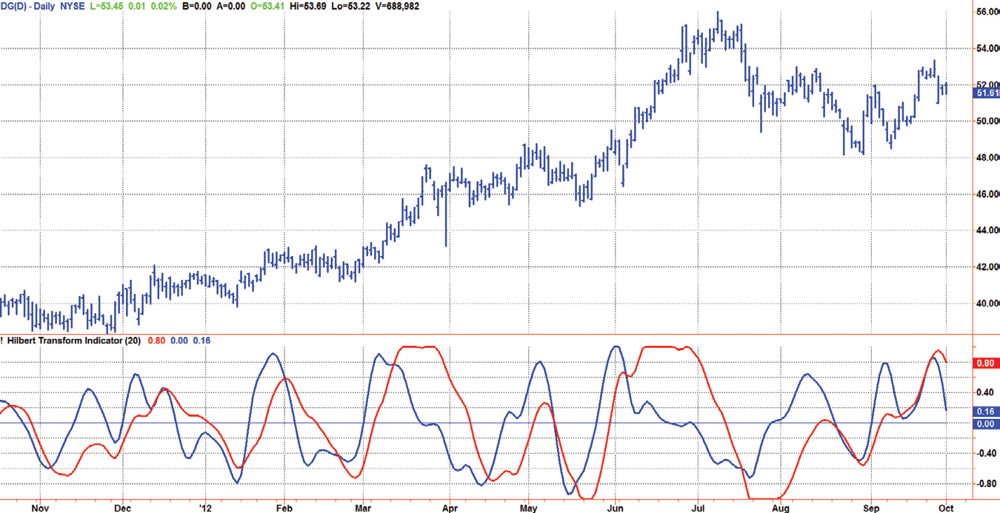
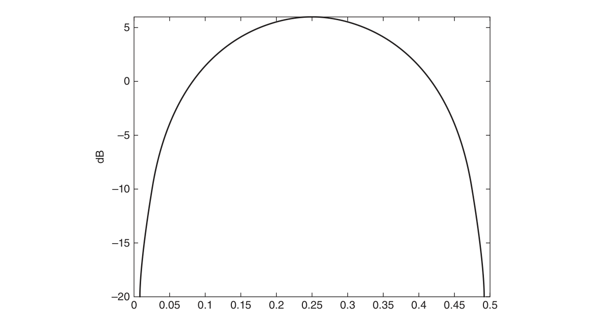
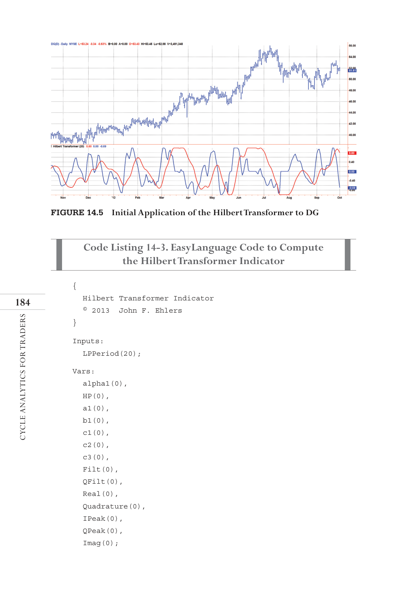

# Chapter 14: Predictive Filters


## BibTeX

```bibtex
@InBook{ehlers2013cycle_ch14,
  author    = {Ehlers, John F.},
  title     = {Cycle Analytics for Traders: Advanced Technical Trading Concepts},
  chapter   = {14},
  chaptertitle = {Predictive Filters},
  publisher = {Wiley},
  year      = {2013},
  series    = {Wiley Trading},
  isbn      = {9781118728604},
}
```

---

The Hilbert
Transformer
“The wave has an imaginary component,” said Tom realistically.
A
n analytic signal allows for time-variable parameters and is a generali-
zation of the phasor concept, which is restricted to time-invariant am-
plitude, phase, and frequency. The analytic representation of a real-valued
function or signal facilitates many mathematical manipulations of the signal.
For example, computing the phase of a signal or the power in the wave is
much simpler using analytic signals.
The Hilbert transformer is the technique to create an analytic signal from
a real one. The conventional Hilbert transformer is theoretically an infinite-
length FIR filter. Even when the filter length is truncated to a useful but
finite length, the induced lag is far too large to make the transformer useful
for trading.
I have therefore created a modified Hilbert transformer that has only a
small lag but still has performance characteristics superior to those of a
truncated FIR Hilbert transformer.
The modified Hilbert transformer can be used as an effective trading in-
dicator because the quadrature component output leads the real output in
the same manner a cosine wave leads a sine wave. In this sense, a modified
Hilbert transformer is a predictive indicator.
In this chapter, I demonstrate three different ways to measure the time-
variant dominant cycle period using analytic signals. These are all basically
measuring the instantaneous phase of the signal and, in essence, summing
the phases to estimate the cycle period. Since the smoothing length is ­usually

less than one full cycle period, the results are fairly noisy and are ­therefore
only marginally useful for trading. I include the code for these dominant
cycle measurements primarily for completeness and because someone
smarter than me may be able to use them successfully.

## Analytic Signals

Without getting all mathy on you, I will try a simplified description of the
theory of numbers for you to reach an understanding of analytic signals. The
numbers that you know and love extend from minus infinity to plus infinity
along a straight line. This line includes integers, rational numbers, irrational
numbers, and even zero. This is not exactly as trivial as it seems because the
Roman numerals, for example, had no concept of zero. It wasn’t until 976
a.d. that the Persian encyclopedist Muhammad ibn Ahmad al-Khwarizmi
(from whom we get the word algorithm) used the notation and wasn’t until
1202 a.d. that Fibonnaci introduced the concept of zero to Europe at the
beginning of the Renaissance. Of course, that was before margin calls, and
so the idea of negative numbers didn’t arise until relatively recently. With
that digression, the main idea is that all “real” numbers can be pictured as
being on a straight line.
A straight line is not the only construct we can use to visualize a num-
bering system. For example, if we place numbers on a plane surface we can
describe numbers by their location on the plane. We do this by using a “real”
axis and an “imaginary” axis that is at right angles to the real axis. The names
are not necessarily significant except in a historical context. After all, if we
can have irrational numbers we can have an imaginary axis.



*Figure 14.1: shows the relevance of analytic signals to traders using in-*

dicators. As a function of time the sine wave starts at zero and increases
toward its maximum value while the cosine wave starts at its maximum
Cosine
Sine



*Figure 14.1: Sine and Cosine Waves as Analytic Signals*


The Hilbert Transformer
value and decreases in amplitude. Note that the cosine wave crosses zero just
as the sine wave reaches its maximum value and has zero slope. The cosine
wave represents the rate of change of the sine wave. These two waveforms
can also be represented as vectors in the complex plane having the real and
imaginary axes. The waves in the time domain are represented by projec-
tions on the imaginary axis as the two vectors rotate counterclockwise. A
full cycle in the time domain is completed when the vectors rotate a full 360
degrees in the complex plane.
Note that the vectors in the complex plane are at right angles, and are
said to be orthogonal. Because of the right angle property, I often refer to
the sine component as the in-phase component, and the cosine component
is the quadrature component. More generally, orthogonality means that the
product of the two vectors is uncorrelated. For example, the sum of sin(x) *
cos(x) over a full cycle is zero. Knowing about analytic signals opens the
door to making some interesting calculations using market data. For exam-
ple, sin2(x) + cosine2(x) is equal to a constant. We also know this from basic
trigonometry. Failing to compute the sum of the squares as a constant is an
indication of the failure of creating an analytic signal. In this case, that fail-
ure means the market is probably transitioning between a cycle mode and
a trend mode.
Analytic signals also open the possibility of making very rapid measure-
ments of the dominant cycle period by examining the rate change of phase
angle of the vectors in the complex plane. For example if the vector angle
changes 18 degrees per bar, the dominant cycle period must be 20 bars
because that rate of change gives a total of 360 degree over the 20-bar
period.

## Hilbert Transformer Mathematics

A Hilbert transformer is just an FIR filter whose purpose is to create a
quadrature component from the real data stream. The filter length is the-
oretically infinite, but can be truncated as an approximation. The filter
coefficients can be expressed as Sin2(πn / 2) / n, where n is the position
from the center of the filter. Coefficients older than half the filter have a
negative sign. For example, a 23-element Hilbert transformer filter has
coefficients as:
[.091 0 .111 0 .143 0 .2 0 .33 0 1 0 −1 0 −.33 0 −.2 0
−.143 0 −.111 0 −.091] / 1.865

The frequency response of this filter is shown in Figure 14.2. This filter
output response has ripple throughout its pass band and roll-off at zero
frequency and the Nyquist frequency due to truncation of the coefficients.
Ideally, the Hilbert transformer is an all-pass filter. We can manipulate
the coefficients to reduce the amount of in-band ripple; however, it is not
worth the effort. The problem is that this FIR filter has a 11-bar lag. More
generally, the FIR filter lag is (N − 1) / 2, where there are an odd number
of elements in the filter. In our case, a lag of 11 bars is just unacceptable for
trading.
The lag of a Hilbert transformer can be reduced by reducing the number
of elements in the filter. In the limit, the shortest truncated Hilbert trans-
former has the coefficients as:
[1 0 −1]
This shorter Hilbert transformer is nice for trading because it has only a
one-bar lag. However, the frequency response of the three-element Hilbert
transformer has a substantial amplitude slope across the pass band, as shown



*Figure 14.2: Frequency Response of a 23-Element Hilbert Transformer*


The Hilbert Transformer
in Figure 14.3. The pass band of interest extends from approximately a 50-
bar period (frequency = 0.02) to a 10-bar period (frequency = 0.1). The
shorter Hilbert transformer is also not acceptable for trading because of the
huge amplitude variation over the pass band.
I have included the EasyLanguage code to compute the Hilbert trans-
former as a classic truncated FIR filter in Code Listing 14-1 because it can
be useful for comparing results to the modified Hilbert transformer I will
derive. After declaring variables, the code begins by computing the roofing
filter as a combination of a two-pole high-pass filter and a SuperSmoother
filter. The automatic gain control (AGC) technique described in Chapter 5
is used to compute the normalized Real signal. The variable Real is basically
the same as the variable Filt except that it has a normalized amplitude. The
imaginary signal, called Imag, is computed from the FIR filtering of the vari-
able Real. Then the Real and Imag signals are plotted. Note that the plot for
the imaginary signal is artificially moved to the left by 11 bars to compensate
for the lad induced by the FIR filter. If the Real and Imag signals were to be
used for trading, Real would have to be delayed by 11 bars to have the cor-
rect relationship to Imag.



*Figure 14.3: Frequency Response of a Three-Element Hilbert Transformer*


**Code Listing 14-1. EasyLanguage Code to Compute a Classic Hilbert Transformer**

```easylanguage
{
Classic Hilbert Transformer
© 2013  John F. Ehlers
}
Vars:
alpha1(0),
HP(0),
a1(0),
b1(0),
c1(0),
c2(0),
c3(0),
Filt(0),
Real(0),
Imag(0),
IPeak(0);
//Highpass filter cyclic components whose periods are
shorter than 48 bars
alpha1 = (Cosine(.707*360 / 48) + Sine (.707*360 / 48) - 1) /
Cosine(.707*360 / 48);
HP = (1 - alpha1 / 2)*(1 - alpha1 / 2)*(Close - 2*Close[1] +
Close[2]) + 2*(1 - alpha1)*HP[1] - (1 - alpha1)*
(1 - alpha1)*HP[2];
//Smooth with a Super Smoother Filter from equation 3-3
a1 = expvalue(-1.414*3.14159 / 10);
b1 = 2*a1*Cosine(1.414*180 / 10);
c2 = b1;
c3 = -a1*a1;
c1 = 1 - c2 - c3;
Filt = c1*(HP + HP[1]) / 2 + c2*Filt[1] + c3*Filt[2];
IPeak = .991*IPeak[1];
If Absvalue(Filt) > IPeak Then IPeak = AbsValue(Filt);
Real = Filt / IPeak;
//Truncated Hilbert Transform FIR filter as a test
Imag = (.091*Real + .111*Real[2] + .143*Real[4] + .2*Real[6] +
.333*Real[8] + Real[10] - Real[12] - .333*Real[14] -
.2*Real[16] - .143*Real[18] - .111*Real[20] - .091*Real
[22]) / 1.865;

The Hilbert Transformer
Plot1(Real);
Plot2(0);
Plot6[11](Imag);
```


## Computing the Hilbert Transformer

The Hilbert Transform Indicator is described with reference to the Easy­
Language code shown in Code List 14-2. The computations begin with the
roofing filter as with the classic Hilbert transformer except that the critical
period of the SuperSmoother is provided as a user-selectable input. This
gives the indicator more flexibility in providing greater or lesser smoothing
as desired.
The Real component is computed exactly as it was in the classic Hilbert
transformer, by normalizing Filt to its recent peak value as determined by
the AGC algorithm.
The imaginary component calculation starts by taking the one bar dif-
ference of the Real variable. This is analogous to taking the derivative of a
sine wave to generate a cosine wave. The one-bar difference computation
provides the phase quadrature required for the imaginary component. The
amplitude correction is provided by a second AGC action performed on the
imaginary component alone. Having the phase quadrature and the normal-
ized amplitude fulfills all the requirements for the imaginary component.
The lag of the Real and Imag analytic signals is very small, and no compen-
sation in the plotting routine is required. In other words, an indicator has
been created that has a predictive capability.

**Code Listing 14-2. EasyLanguage Code to Compute the Hilbert Transformer**

```easylanguage
{
Hilbert Transformer
© 2013  John F. Ehlers
}
Inputs:
LPPeriod(20);
(Continued )

Vars:
alpha1(0),
HP(0),
a1(0),
b1(0),
c1(0),
c2(0),
c3(0),
Filt(0),
QFilt(0),
Real(0),
Imag(0),
IPeak(0),
QPeak(0);
//Highpass filter cyclic components whose periods are
shorter than 48 bars
alpha1 = (Cosine(.707*360 / 48) + Sine (.707*360 / 48) - 1) /
Cosine(.707*360 / 48);
HP = (1 - alpha1 / 2)*(1 - alpha1 / 2)*(Close - 2*Close[1] +
Close[2]) + 2*(1 - alpha1)*HP[1] - (1 - alpha1)*
(1 - alpha1)*HP[2];
//Smooth with a Super Smoother Filter from equation 3-3
a1 = expvalue(-1.414*3.14159 / LPPeriod);
b1 = 2*a1*Cosine(1.414*180 / LPPeriod);
c2 = b1;
c3 = -a1*a1;
c1 = 1 - c2 - c3;
Filt = c1*(HP + HP[1]) / 2 + c2*Filt[1] + c3*Filt[2];
IPeak = .991*IPeak[1];
If Absvalue(Filt) > IPeak Then IPeak = AbsValue(Filt);
Real = Filt / IPeak;
QFilt = (Real - Real[1]);
QPeak = .991*QPeak[1];
If Absvalue(QFilt) > QPeak Then QPeak = AbsValue(QFilt);
Imag = QFilt /QPeak;
Plot1(Real);
Plot2(0);
Plot6(Imag);

The Hilbert Transformer
```

The outstanding performance of the Hilbert transformer is best demon-
strated by its response to a chirped sine wave whose period continuously
increases from 10 bars to 40 bars. Throughout the entire range, the indicator
maintains the correct phase and amplitude relationship between the real and
imaginary components. This performance is vastly superior to that of the
classic Hilbert transformer using a truncated FIR filter.

## The Hilbert Transformer Indicator




*Figure 14.5: shows the real and imaginary components of the Hilbert trans-*
former below the price chart. Basically, the real component moves with the
general direction of the prices, and the imaginary component is a predictive
indicator for the real component in the same sense that a cosine wave is a
predictor of a sine wave. Although the default LPPeriod input is set to 20 bars
in an attempt to smooth the indicator the imaginary component is still too
erratic to be useful.
Code Listing 14-3 shows the EasyLanguage code for the Hilbert trans-
former indicator. The code is exactly the same as for the Hilbert transformer
except that a SuperSmoother filter has been added to smooth the imaginary
component.
Figure 14.4  The Hilbert Transformer Indicator Has the Correct Phase and
Amplitude as Shown by the Response to a Chirped Sine Wave Whose Period
Varies from 10 Bars to 40 Bars


*Figure 14.5: Initial Application of the Hilbert Transformer to DG*

**Code Listing 14-3. EasyLanguage Code to Compute the Hilbert Transformer Indicator**

```easylanguage
{
Hilbert Transformer Indicator
© 2013  John F. Ehlers
}
Inputs:
LPPeriod(20);
Vars:
alpha1(0),
HP(0),
a1(0),
b1(0),
c1(0),
c2(0),
c3(0),
Filt(0),
QFilt(0),
Real(0),
Quadrature(0),
IPeak(0),
QPeak(0),
Imag(0);

The Hilbert Transformer
//Highpass filter cyclic components whose periods are
shorter than 48 bars
alpha1 = (Cosine(.707*360 / 48) + Sine (.707*360 / 48) - 1) /
Cosine(.707*360 / 48);
HP = (1 - alpha1 / 2)*(1 - alpha1 / 2)*(Close - 2*Close[1] +
Close[2]) + 2*(1 - alpha1)*HP[1] - (1 - alpha1)*
(1 - alpha1)*HP[2];
//Smooth with a Super Smoother Filter from equation 3-3
a1 = expvalue(-1.414*3.14159 / LPPeriod);
b1 = 2*a1*Cosine(1.414*180 / LPPeriod);
c2 = b1;
c3 = -a1*a1;
c1 = 1 - c2 - c3;
Filt = c1*(HP + HP[1]) / 2 + c2*Filt[1] + c3*Filt[2];
IPeak = .991*IPeak[1];
If Absvalue(Filt) > IPeak Then IPeak = AbsValue(Filt);
Real = Filt / IPeak;
Quadrature = (Real - Real[1]);
QPeak = .991*QPeak[1];
If Absvalue(Quadrature) > QPeak Then QPeak =
AbsValue(Quadrature);
Quadrature = Quadrature /QPeak;
a1 = expvalue(-1.414*3.14159 / 10);
b1 = 2*a1*Cosine(1.414*180 / 10);
c2 = b1;
c3 = -a1*a1;
c1 = 1 - c2 - c3;
Imag = c1*(Quadrature + Quadrature[1]) / 2 + c2*Imag[1] +
c3*Imag[2];
Plot1(Real);
Plot2(0);
Plot6(Imag);
```

The performance of the Hilbert transformer indicator is demonstrated
in Figure 14.6. The smoothing afforded by the added SuperSmoother filter
destroys the orthogonality of the imaginary component because it intro-
duces several bars of lag. However, the SuperSmoother made the imaginary
component useful by smoothing out its erratic behavior. Now the predicted

turning point to the upside is when the imaginary component crosses over
the real component. This gives you time to actually place the trade before
the turning point has occurred. Similarly, the predicted turning point to the
downside is when the imaginary component crosses under the real compo-
nent. You have some control over the indicator through the LPPeriod input
parameter.
The problem with predicting the turning point is that it may not be a
swing turning point at all. Rather, it can be the onset of a new trend. In this
case, the turning point prediction will be dead wrong. One way to miti-
gate an incorrect turning point prediction is to first take the trade in the
predicted direction, but then be quick and agile to exit the trade if it is not
confirmed by the Even Better Sinewave Indicator.

## Using the Hilbert Transformer to Compute

the Dominant Cycle
I want to emphasize that the only reason for including this section is for
completeness. Unless you are interested in research, I suggest you skip this
section entirely. To further emphasize my point, do not use the code for
trading. A vastly superior approach to compute the dominant cycle in the
price data is the autocorrelation periodogram. The code is included because
the reader may be able to capitalize on the algorithms in a way that I do not
see. All the algorithms encapsulated in the code operate reasonably well
Figure 14.6  The Imaginary Component of the Hilbert Transformer
Indicator Predicts the Turning Points of the Real Component

The Hilbert Transformer
on theoretical waveforms that have no noise component. My conjecture at
this time is that the sample-to-sample noise simply swamps the computa-
tion of the rate change of phase, and therefore the resulting calculations to
find the dominant cycle are basically worthless. The imaginary component
of the Hilbert transformer cannot be smoothed as was done in the Hilbert
transformer indicator because the smoothing destroys the orthogonality of
the imaginary component.

## Dual Differentiator

The first algorithm to compute the dominant cycle is called the dual differ-
entiator. In this case, the phase angle is computed from the analytic signal as
the arctangent of the ratio of the imaginary component to the real compo-
nent. Further, the angular frequency is defined as the rate change of phase.
We can use these facts to derive the cycle period. From the definition of the
derivative of an arctangent, the mathematics of this process are:

$$\theta = \arctan\left(\frac{Q}{IP}\right)$$

$$\omega = \frac{d\theta}{dt} = \frac{1}{1 + (Q/IP)^2} \cdot \frac{IP \cdot \dot{Q} - Q \cdot \dot{IP}}{IP^2} = \frac{IP \cdot \dot{Q} - Q \cdot \dot{IP}}{IP^2 + Q^2}$$

Simplifying and solving for the cycle period instead of frequency, we
obtain:

$$\text{Period} = \frac{2\pi(IP^2 + Q^2)}{Q \cdot \dot{IP} - IP \cdot \dot{Q}}$$

Where:  IP = In-phase component (Real)

Q = Quadrature component (Imag)

IDot = Rate of change of IP

QDot = Rate of change of Q
The code to compute the dominant cycle using the dual differentiator is
given in Code Listing 14-4.

{
Measuring the Dominant Cycle using the Dual Differentiator
© 2013  John F. Ehlers
}
Inputs:
LPPeriod(20);
Vars:
alpha1(0),
HP(0),
a1(0),
b1(0),
c1(0),
c2(0),
c3(0),
Filt(0),
QFilt(0),
Real(0),
Quad(0),
Imag(0),
IPeak(0),
QPeak(0),
IDot(0),
QDot(0),
Period(0),
DomCycle(0);
//Highpass filter cyclic components whose periods are
shorter than 48 bars
alpha1 = (Cosine(.707*360 / 48) + Sine (.707*360 / 48) - 1) /
Cosine(.707*360 / 48);
HP = (1 - alpha1 / 2)*(1 - alpha1 / 2)*(Close - 2*Close[1] +
Close[2]) + 2*(1 - alpha1)*HP[1] - (1 - alpha1)*
(1 - alpha1)*HP[2];
//Smooth with a Super Smoother Filter from equation 3-3
a1 = expvalue(-1.414*3.14159 / LPPeriod);
b1 = 2*a1*Cosine(1.414*180 / LPPeriod);
c2 = b1;
c3 = -a1*a1;
c1 = 1 - c2 - c3;
Filt = c1*(HP + HP[1]) / 2 + c2*Filt[1] + c3*Filt[2];
IPeak = .991*IPeak[1];
If Absvalue(Filt) > IPeak Then IPeak = AbsValue(Filt);
Real = Filt / IPeak;

**Code Listing 14-4. EasyLanguage Code to Compute the Dominant Cycle Using the Dual Differentiator Method**

```easylanguage

The Hilbert Transformer
```


## Phase Accumulation

The next algorithm to compute the dominant cycle is the phase accumula-
tion method. The phase accumulation method of computing the dominant
cycle is perhaps the easiest to comprehend. In this technique, we measure
the phase at each sample by taking the arctangent of the ratio of the quadra-
ture component to the in-phase component. A delta phase is generated by
taking the difference of the phase between successive samples. At each sam-
ple we can then look backwards, adding up the delta phases. When the sum
of the delta phases reaches 360 degrees, we must have passed through one
full cycle, on average. The process is repeated for each new sample.
The phase accumulation method of cycle measurement always uses one
full cycle’s worth of historical data. This is both an advantage and a disad-
vantage. The advantage is the lag in obtaining the answer scales directly with
the cycle period. That is, the measurement of a short cycle period has less
lag than the measurement of a longer cycle period. However, the number of
samples used in making the measurement means the averaging period is var-
iable with cycle period. Longer averaging reduces the noise level compared
to the signal. Therefore, shorter cycle periods necessarily have a higher out-
put signal-to-noise ratio.
The code to compute the dominant cycle using the phase accumulation
method is given in Code Listing 14-5.
```easylanguage
Quad = (Real - Real[1]);
QPeak = .991*QPeak[1];
If Absvalue(Quad) > QPeak Then QPeak = AbsValue(Quad);
Imag = Quad /QPeak;
IDot = Real - Real[1];
QDot = Imag - Imag[1];
If (Real*QDot - Imag*IDot) <> 0 Then Period =
6.28318*(Real*Real + Imag*Imag) / (-Real*QDot +
Imag*IDot);
If Period < 8 Then Period = 8;
If Period > 48 Then Period = 48;
DomCycle = c1*(Period + Period[1]) / 2 + c2*DomCycle[1] +
c3*DomCycle[2];
Plot1(DomCycle);


**Code Listing 14-5. EasyLanguage Code to Compute the Dominant Cycle Using the Phase Accumulation Method**

```easylanguage
{
Measuring the Dominant Cycle using Phase Accumulation
© 2013  John F. Ehlers
}
Inputs:
LPPeriod(20);
Vars:
alpha1(0),
HP(0),
a1(0),
b1(0),
c1(0),
c2(0),
c3(0),
Filt(0),
QFilt(0),
Real(0),
Quad(0),
Imag(0),
IPeak(0),
QPeak(0),
Phase(0),
DeltaPhase(0),
InstPeriod(0),
count(0),
PhaseSum(0),
DomCycle(0);
//Highpass filter cyclic components whose periods are
shorter than 48 bars
alpha1 = (Cosine(.707*360 / 48) + Sine (.707*360 / 48) - 1) /
Cosine(.707*360 / 48);
HP = (1 - alpha1 / 2)*(1 - alpha1 / 2)*(Close - 2*Close[1] +
Close[2]) + 2*(1 - alpha1)*HP[1] - (1 - alpha1)*
(1 - alpha1)*HP[2];
//Smooth with a Super Smoother Filter from equation 3-3
a1 = expvalue(-1.414*3.14159 / LPPeriod);
b1 = 2*a1*Cosine(1.414*180 / LPPeriod);

The Hilbert Transformer
c2 = b1;
c3 = -a1*a1;
c1 = 1 - c2 - c3;
Filt = c1*(HP + HP[1]) / 2 + c2*Filt[1] + c3*Filt[2];
IPeak = .991*IPeak[1];
If Absvalue(Filt) > IPeak Then IPeak = AbsValue(Filt);
Real = Filt / IPeak;
Quad = (Real - Real[1]);
QPeak = .991*QPeak[1];
If Absvalue(Quad) > QPeak Then QPeak = AbsValue(Quad);
Imag = Quad /QPeak;
//Use ArcTangent to compute the current phase
If AbsValue(Real) > 0 then Phase = ArcTangent(AbsValue
(Imag / Real));
//Resolve the ArcTangent ambiguity
If Real < 0 and Imag > 0 then Phase = 180 - Phase;
If Real < 0 and Imag < 0 then Phase = 180 + Phase;
If Real > 0 and Imag < 0 then Phase = 360 - Phase;
//Compute a differential phase, resolve phase wraparound,
and limit delta phase errors
DeltaPhase = Phase[1] - Phase;
If Phase[1] < 90 and Phase > 270 then DeltaPhase = 360 +
Phase[1] - Phase;
//Limit DeltaPhase to be within the bounds of 10 bar and 48
bar cycles}
If DeltaPhase < 10 then DeltaPhase = 10;
If DeltaPhase > 48  then Deltaphase = 48;
//Sum DeltaPhases to reach 360 degrees. The sum is the
instantaneous period.
InstPeriod = 0;
PhaseSum = 0;
For count = 0 to 40 begin
PhaseSum = PhaseSum + DeltaPhase[count];
If PhaseSum > 360 and InstPeriod = 0 then begin
InstPeriod = count;
End;
End;
(Continued )

```


## Homodyne

The third algorithm for computing the dominant cycle is the homodyne ap-
proach. Homodyne means the signal is multiplied by itself. More precisely,
we want to multiply the signal of the current bar with the complex value
of the signal one bar ago. The complex conjugate is, by definition, a com-
plex number whose sign of the imaginary component has been reversed.
Expressing the signal in polar coordinates, the arithmetic is:

$$(\rho e^{j\omega t_n})(\rho e^{-j\omega t_{n-1}}) = \rho^2 e^{j\omega(t_n - t_{n-1})}$$

The interesting result is that we get both the square of the signal ampli-
tude and the angular frequency (2π / Period) from the product because the
difference in time between samples (tn − tn−1) is just one bar. In principle, this
means that we can get the instantaneous cycle period in just two successive
samples. The added benefit is that we also get the square of the signal am-
plitude. The calculations are carried out using the in-phase and quadrature
components rather than converting them to polar coordinates. Either way,
the results will be the same.
Since the differential angle is small in radian measure, the angle, the tan-
gent of the angle and the arctangent of the angle are all approximately the
same. Therefore, the dominant cycle is computed by dividing 2π by the
ratio of the imaginary component to the real component. Ideally, the angle
cannot be negative because time cannot run backwards. Frankly, the pur-
pose of the smoothing filter is to cover the erratic calculations caused by
noise.
The code to compute the dominant cycle using the homodyne method is
given in Code Listing 14-6.
```easylanguage
//Resolve Instantaneous Period errors and smooth
If InstPeriod = 0 then InstPeriod = InstPeriod[1];
DomCycle = c1*(InstPeriod + InstPeriod[1]) / 2 +
c2*DomCycle[1] + c3*DomCycle[2];
Plot1(DomCycle);

The Hilbert Transformer

**Code Listing 14-6. EasyLanguage Code to Compute the Dominant Cycle Using the Homodyne Method**

```easylanguage
{
Measuring the Dominant Cycle using a HomoDyne
Discriminator
© 2013  John F. Ehlers
}
Inputs:
LPPeriod(20);
Vars:
alpha1(0),
HP(0),
a1(0),
b1(0),
c1(0),
c2(0),
c3(0),
Filt(0),
QFilt(0),
Real(0),
Quad(0),
Imag(0),
IPeak(0),
QPeak(0),
Re(0),
Im(0),
Period(0),
DomCycle(0);
//Highpass filter cyclic components whose periods are
shorter than 48 bars
alpha1 = (Cosine(.707*360 / 48) + Sine (.707*360 / 48) - 1) /
Cosine(.707*360 / 48);
HP = (1 - alpha1 / 2)*(1 - alpha1 / 2)*(Close - 2*Close[1] +
Close[2]) + 2*(1 - alpha1)*HP[1] - (1 - alpha1)*
(1 - alpha1)*HP[2];
//Smooth with a Super Smoother Filter from equation 3-3
a1 = expvalue(-1.414*3.14159 / LPPeriod);
b1 = 2*a1*Cosine(1.414*180 / LPPeriod);
c2 = b1;
(Continued )

```


## Key Points to Remember

1.	 The classic Hilbert transformer uses a truncated FIR filter.
2.	 The classic Hilbert transformer cannot be used for trading because the
FIR filter introduces a large amount of lag, and shortening the FIR filter
introduces large amplitude variations across the pass band.
3.	 A modified Hilbert transformer can be created using a one-bar differ-
ence to establish phase quadrature and AGC to provide amplitude com-
pensation.
4.	 The Hilbert transformer indicator provides predictive turning points
for swing trading. These predictions can be wrong if a new trend is es-
tablished rather than a new swing.
5.	 Using the Hilbert transformer to compute the dominant cycle is the
price data is not advised.
```easylanguage
c3 = -a1*a1;
c1 = 1 - c2 - c3;
Filt = c1*(HP + HP[1]) / 2 + c2*Filt[1] + c3*Filt[2];
IPeak = .991*IPeak[1];
If Absvalue(Filt) > IPeak Then IPeak = AbsValue(Filt);
Real = Filt / IPeak;
Quad = (Real - Real[1]);
QPeak = .991*QPeak[1];
If Absvalue(Quad) > QPeak Then QPeak = AbsValue(Quad);
Imag = Quad /QPeak;
Re = Real*Real[1] + Imag*Imag[1];
Im = Real[1]*Imag - Real*Imag[1];
If Im <> 0 and Re <> 0 Then Period = 6.28318 / AbsValue
((Im / Re));
If Period < 10 Then Period = 10;
If Period > 48 Then Period = 48;
DomCycle = c1*(Period + Period[1]) / 2 + c2*DomCycle[1] +
c3*DomCycle[2];
Plot1(DomCycle);


```