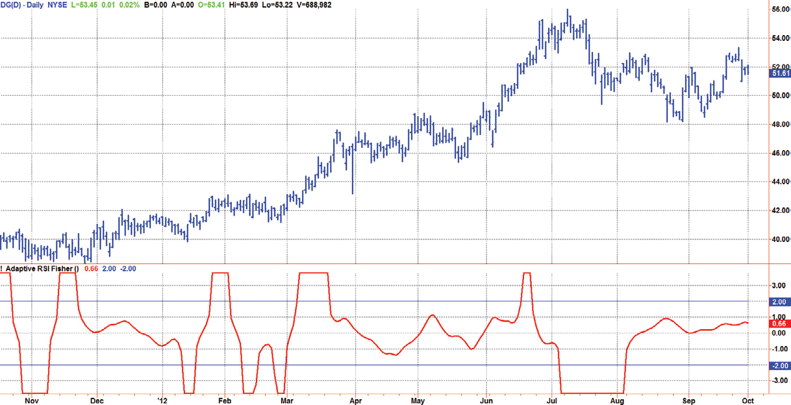
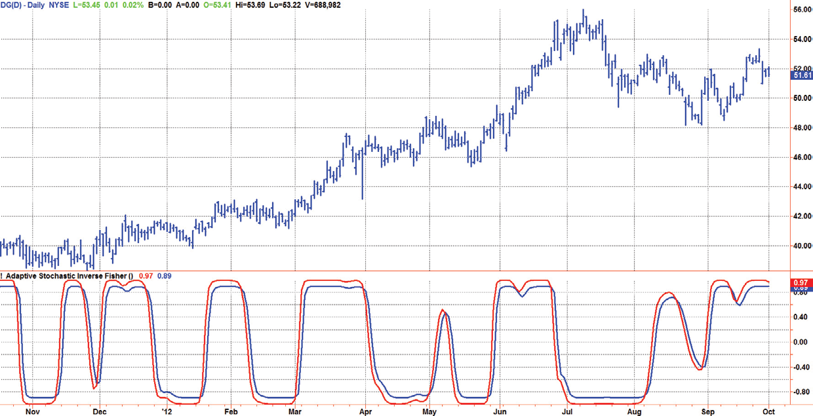
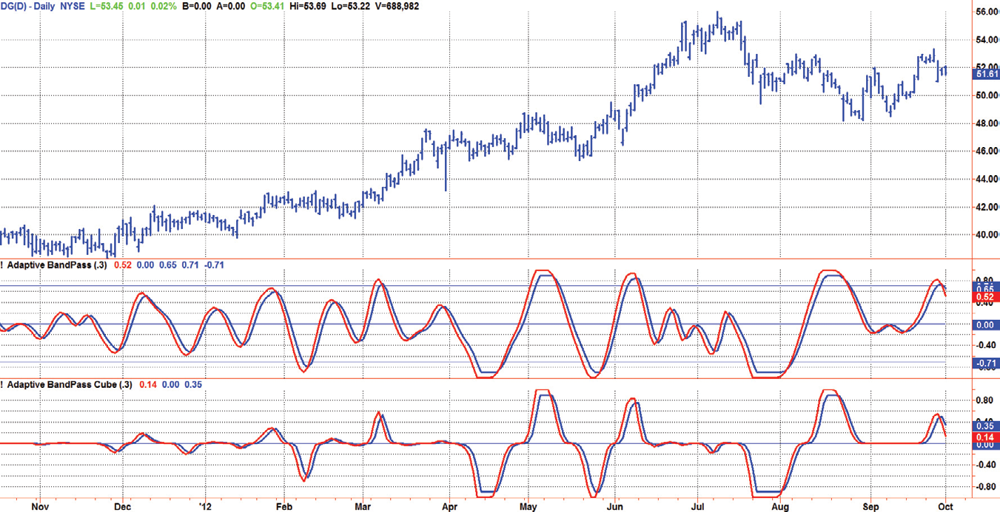
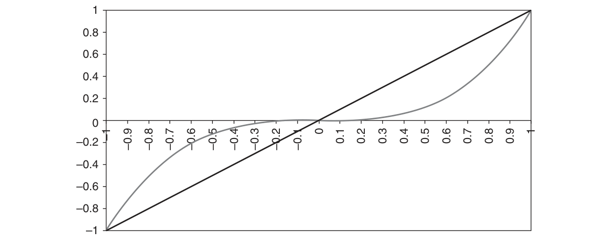

# Chapter 15: Classifying Cycle Signals


## BibTeX

```bibtex
@InBook{ehlers2013cycle_ch15,
  author    = {Ehlers, John F.},
  title     = {Cycle Analytics for Traders: Advanced Technical Trading Concepts},
  chapter   = {15},
  chaptertitle = {Classifying Cycle Signals},
  publisher = {Wiley},
  year      = {2013},
  series    = {Wiley Trading},
  isbn      = {9781118728604},
}
```

---

Indicator
Transforms
“Now I see,” said Tom blindly.
A
n indicator transform is a means to shape the indicator to aid interpre-
tation and use of the indicator itself. Other than shaping the display,
these transforms have no impact on the indicator. For example, they induce
no lag. While relatively trivial to implement, these transforms have a huge
impact on the interpretation and use of the indicators. There are primar-
ily three indicators of interest to traders: the Fisher transform, the inverse
Fisher transform, and the cube transform. Each has its preferred applica-
tion, which we describe in this chapter.

## Fisher Transform

A common fallacy in the use of technical indicators is that their probability dis-
tribution follows a normal, or Gaussian, probability distribution. That just is
not so, as you can prove for yourself by analyzing a reasonable amount of data.
If the data do not have a normal probability distribution, then the calculation
of a standard deviation is based on a false premise. The purpose of the Fisher
transform is to take any indicator having a nominally zero mean and bounded
between the limits of −1 to +1 and convert the amplitude so that the trans-
formed indicator has an approximate normal probability distribution.
Plotting an indicator scaled to a normal probability distribution has a
huge advantage on indicator interpretation. If the transformed indicator has
a value of −1, it has a value of negative one standard deviation and therefore

there is a 32 percent chance prices will go lower. If the transformed indica-
tor has a value of −2, it has a value of negative two standard deviations, and
therefore there is only an 8 percent chance prices will go lower. This is a
high-probability buying opportunity. At a level of −3, the negative 3 stand-
ard deviations means there is only a 2 percent chance of the prices going
lower. The transformed values are symmetrical, so positive deviations are
high-probability indications to exit a long position or to sell short.
The equation for a Fisher transform is
Output
ln
Input
Input
0.5*
=
+
−




Since an input value of unity can cause the ratio to go to infinity, the input
must be limited to 0.999, which corresponds to an output on the order of
three standard deviations. Similarly, the argument of the natural logarithm
cannot be allowed to go to zero, and so the input must also be limited at
−0.999.
The transfer response of the Fisher transform is shown in Figure 15.1.
The straight line shows the range of inputs, and the curved line shows the
corresponding range of outputs. When the inputs are less than an absolute
value of 0.5, the outputs are almost the same as the inputs. However, there
is a greater and greater magnification of the outputs as the inputs approach
the absolute value of 1. It is this nonlinear magnification that produces the
“long tails” in the output probability distribution, thus creating the resulting
normal probability distribution.
–1
–1
–0.8
–0.6
–0.4
–0.2
0.2
0.4
0.6
0.8
–2
–3



*Figure 15.1: Transfer Response of the Fisher Transform Shows Greater*

Magnification of the Outputs as the Inputs Approach an Absolute Value of 1

Indicator Transforms
To implement the Fisher transform on the adaptive RSI, replace the plot
statements of Code Listing 11-1 with the following code fragment:

**Code Listing 15-1. EasyLanguage Code Fragment to Add the Fisher Transform to the Adaptive RSI Indicator**

```easylanguage
Vars:
TranslatedRSI(0),
AmplifiedRSI(0),
Fish(0);
TranslatedRSI = 2*(MyRSI - .5);
AmplifiedRSI = 1.5*TranslatedRSI;
If AmplifiedRSI > .999 Then AmplifiedRSI = .999;
If AmplifiedRSI < -.999 Then AmplifiedRSI = -.999;
Fish = .5*Log((1 + AmplifiedRSI) / (1 - AmplifiedRSI));
Plot1(Fish);
Plot2(2);
Plot6(-2);
```

The variable MyRSI ranges between zero and one, and therefore to ac-
commodate the conditions for the Fisher transform, this variable must be
translated and dilated to range between −1 and +1. If the MyRSI variable
does not range fully between zero and one, you can shorten the RSI look-
back period to be less than half the measured dominant cycle, or you can
simply multiply it by a magnification factor as I have done in the code frag-
ment. The amplifying factor was selected to make the indicator rarely ex-
ceed the two sigma points in the output. The amplified RSI is then limited
to be within the range of −0.999 to +0.999 to avoid a computer crash,
and then is used to compute the Fisher transform. The plus and minus two
standard deviation levels are included in the indicator display. An example
of the adaptive RSI using the Fisher transform is shown in Figure 15.2. The
trend up is heralded by the Fisherized indicator’s falling below −2. Then, the
trend down is signaled by the Fisherized indicator rising above +2. These
major turning points are relatively rare events and are perhaps best used in
association with trend trading.
Since the Stochastic and commodity channel index (CCI) indicators
measure relative position in a channel, they tend to be near the upper or
lower limits during trends. That means that they do not have a zero mean in
the short run and therefore are not good candidates on which to apply the

Fisher transform. A band-pass filter would be a much better candidate, but
the major cyclic turning points are already easy to identify and don’t require
a more complex statistical approach.

## Inverse Fisher Transform

Whereas the Fisher transform expands the base indicator near the extremes,
the purpose of the inverse Fisher transform is to compress the indicator in
these regions. By compressing values near the extremes many extraneous
and irrelevant wiggles are removed from the indicator, making interpreta-
tion of the real meaning of the indicator be far simpler. In a sense, the in-
verse Fisher transform acts as a soft limiter.
The equation for the inverse Fisher transform is
Output
e
e
K Input
K Input
(2* *
)
(2* *
)
=
−
+
The input may have as large a value as desired. If the input values are very
large, then the exponential terms in both the numerator and denominator
are very large compared to one, and so the output is approximately 1. If the
input values are very large, but negative, then the exponential terms in both
the numerator and denominator are very small compare to one, with the
result that the output is approximately −1. The K in the expression is an op-
tional amplifying term because conventional indicators already fall between



*Figure 15.2: Adaptive RSI with Fisher Transform Clearly Identifies Major*

Turning Points

Indicator Transforms
the limits of −1 and +1, and so amplifying them is necessary to reap the
benefits of the soft limiting of the inverse Fisher transform.
The transfer response of the inverse Fisher transform is shown in Figure 15.3.
The input values are shown by the straight line, and the output values are
shown by the curved line. This graphical representation shows how larger and
larger absolute values of the input are compressed to essentially be unity.
To implement the inverse Fisher transform on an adaptive Stochastic
indicator, replace the plot statements of Code Listing 11-2 with the code
fragment given in Code Listing 15-2. I have chosen to amplify the adaptive
Stochastic by a factor of 3 when taking the inverse Fisher transform.
–1
–3
–3
–4
–2
–1
–2



*Figure 15.3: Transfer Response of the Inverse Fisher Transform Shows the*

Compression of Larger Values of the Input

**Code Listing 15-2. EasyLanguage Code Fragment to Implement the Inverse Fisher Transform on the Adaptive Stochastic Indicator**

```easylanguage
Vars:
IFish(0);
Value1 = 2*(AdaptiveStochastic - .5);
IFish = (ExpValue(2*3*Value1) - 1) / (ExpValue
(2*3*Value1) + 1);
Plot1(IFish);
Plot4(.9*IFish[1]);

I have also included a trigger line, which is just the inverse Fisher transform
delayed by one bar and attenuated to 90 percent. The crossings of the inverse
Fisher transform line and the trigger line provide clear and unequivocal indica-
tions for the buy and sell points, as demonstrated in the example of Figure 15.4.
```

The use of the inverse Fisher adaptive Stochastic indicator involves the cross-
ings of the inverse Fisher line and the trigger line. When the inverse Fisher line
crosses over the trigger line, then buy. When the inverse Fisher line crosses
under the trigger line, then sell short, or if you choose, exit the long position.
The inverse Fisher transform should be one of the biggest weapons in
your arsenal of trading indicators and strategies. Its use as a soft limiter is
universal and can help remove many of the distracting and irrelevant squig-
gles in your indicators. The only constraint should be that the original input
has a nearly a zero mean. You may need to amplify the input to attain the
desired compression at the output. If you want a simple “digital” output, just
amplify the input by a large amount.

## Cube Transform

The purpose of the cube transform is to compress the signals near zero of
an indicator that swings between the limits of −1 and +1. This is handy for
an indicator such as the adaptive band-pass filter where you are concerned
only with the larger swings, and the squiggles in the middle are merely
distractions. The transform consists of merely cubing the indicator values.
Figure 15.4  The Inverse Fisher Transform of the Adaptive Stochastic
Indicator Gives Clear and Unambiguous Indications of the Proper Buy and
Sell Points

Indicator Transforms
Doing this, the values near +1 and −1 are nearly unchanged, but the smaller
absolute values are severely reduced in amplitude. Of course, this only works
if the effects of spectral dilation have been removed by a roofing filter or
some equivalent technique. The cubing of the display is only effective when
the original indicator has a nominally zero mean. The transfer response of the
cube transform is shown in Figure 15.5. In this figure, the input values are
shown by the straight line and the output values are shown by the curved line.
The effect of the cube transform is shown in Figure 15.6, where the
adaptive band-pass filter is shown in the first subgraph, and the adaptive
0.8
0.4
–0.4
–1
–0.8
–0.6
–0.4
–0.2
0.3
0.4
0.6
0.9
–0.8
–1
0.6
0.2
–0.7
–0.9
–0.5
–0.3
–0.1
0.1
0.2
0.5
0.7
0.8
–0.2
–0.6



*Figure 15.5: The Cube Transform Compresses Smaller Values of the Input*
Figure 15.6  The Cube Transform Clarifies Swinging Signals by
Compressing the Smaller Amplitude Swings

band-pass filter with the cube transform is shown in the second subgraph.
The purpose of the cube transform is to clarify the major swings by com-
pressing the distractions of the smaller swing values.

## Key Points to Remember

1.	 The purpose of a transformer is shape the indicator to aid interpretation
and use of the indicator itself.
2.	 Transformers do not induce lag.
3.	 A Fisher transform of an indicator swinging between −1 and +1 with a
nominal zero mean plots that indicator in terms of standard deviations
with a nearly normal probability distribution.
4.	 An inverse Fisher transform acts as a soft limiter to remove extraneous
wiggles in indicators have a nominal zero mean.
5.	 A cube transform compresses the smaller values of an indicator swing-
ing between −1 and +1.

