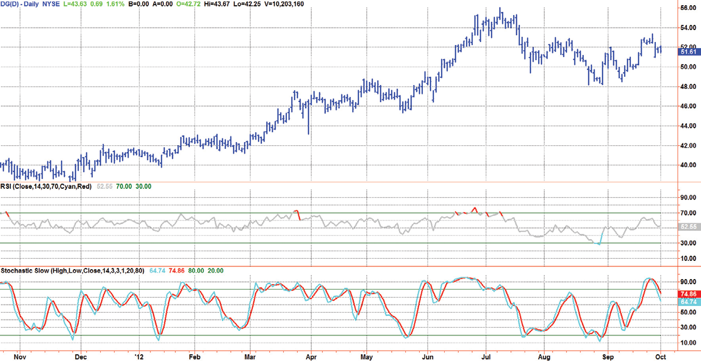
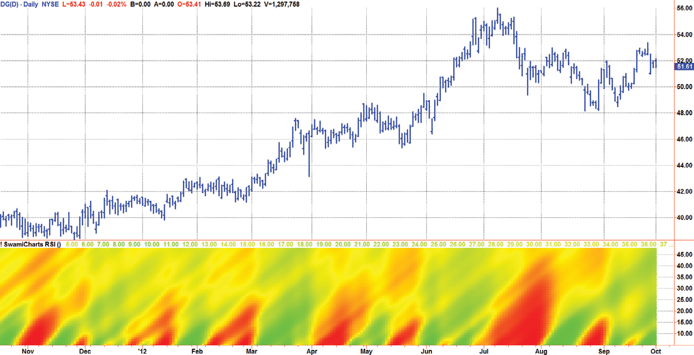
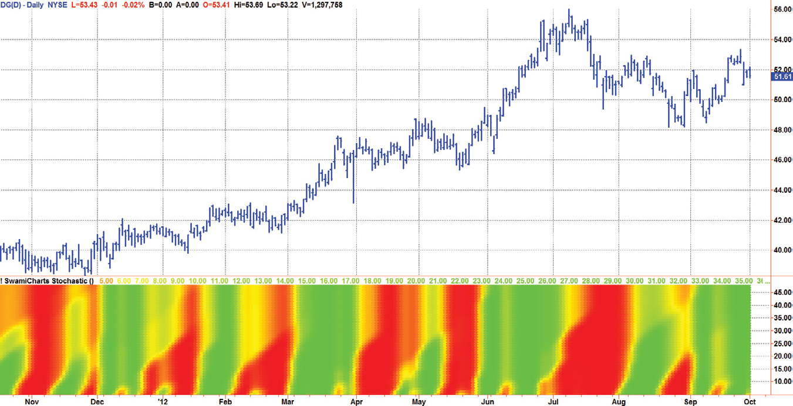
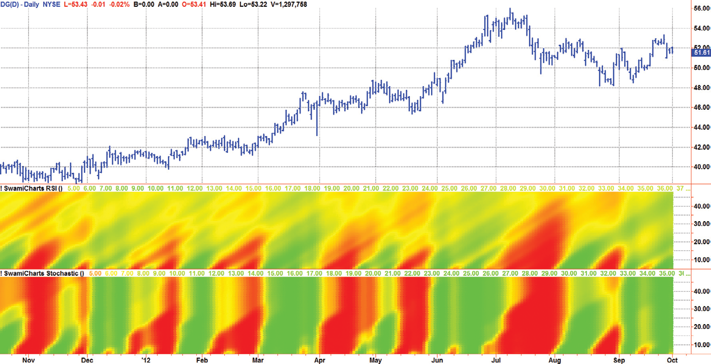

# Chapter 16: Trading Strategies


## BibTeX

```bibtex
@InBook{ehlers2013cycle_ch16,
  author    = {Ehlers, John F.},
  title     = {Cycle Analytics for Traders: Advanced Technical Trading Concepts},
  chapter   = {16},
  chaptertitle = {Trading Strategies},
  publisher = {Wiley},
  year      = {2013},
  series    = {Wiley Trading},
  isbn      = {9781118728604},
}
```

---

SwamiCharts
“Now that’s a hot display,” said Tom coolly.
T
echnical indicators for trading are long on precision but short on
­accuracy. For example, you know exactly when a relative strength in-
dex (RSI) crosses the 80 percent threshold. In my opinion, this precision
property of indicators gives traders a false sense of security and obscures
the fact that indicators are basically displays of a statistical process. Further,
most traders don’t have a clue regarding the proper setting of the indicator
lookback period. The end result is that the precise indicator can show you
pretty much anything you want, depending on how you set the parameters.
Part of the solution, as discussed in Chapter 11, is to make the indicator
adaptive to the measured cycle period.
In this chapter, I describe another completely different perspective,
which is to accept that indicators are inherently inaccurate and a better
­approach is to look at that indicator over a range of lookback periods and
view the short-term movement in the context of the longer-term indictor
results. In a sense, the indicator is used as fuzzy logic. This is the purpose of
­SwamiCharts.
Almost any oscillator-type indicator can be plotted as a SwamiChart.
If you do this, you will quickly isolate those indicators that have the best
­performance. You will also find, as I did, that there are some indicators
that indicate nothing at all. As a quick visual example, Figure 16.1 shows
a conventional RSI and a conventional Stochastic on the same chart. They
seem to be giving different information. Part of the answer is that neither
has been compensated for Spectral Dilation. The rest of the answer is that
when viewed in context, these two indicators show just about the same
thing.


## SwamiCharts Overview

SwamiCharts retain the core functionality of the technical indicators with
which you’re already familiar, while packing much more information into
an easy-to-interpret heat map chart. With SwamiCharts, you now visualize
each indicator over a range of lookback periods to reveal a better view of the
indicator’s truer meaning in context.
SwamiCharts provide a better solution because you can now visualize
context over a wide range of lookback periods. Trends and cycles emerge
more succinctly, while continuation patterns and reversals become easier to
identify. SwamiCharts solves the data lookback problem by enabling you to
view market conditions at a glance, a feature that will dramatically facilitate
your trading.
SwamiCharts condenses much more information about each indicator’s
true meaning into an easy-to-interpret heat map chart. SwamiCharts indica-
tors are created by computing the technical indicator multiple times over
a range of lookback periods. The vertical scale of the SwamiChart indica-
tor is that range of those lookback periods. For each data bar and for each
lookback period the value of the indicator is computed in the conventional
way. After the indicator is computed, a color value is assigned to the matrix
location defined by the bar location in the horizontal plane and the look-
back period in the vertical plane. The complete matrix looks like a heat map
when drawn below the price bars in a subgraph. The resulting basic display



*Figure 16.1: RSI and Stochastic Indicators Seem to Impart Different*

­Information

SwamiCharts
is easy to interpret. Green means increasing values, red mean decreasing
values, and yellow means intermediate values. That is, the heat map is a so-
called “stoplight” chart.

## SwamiCharts RSI

The RSI indicator was described in Chapter 11, where we made the indi-
cator adaptive to the measured dominant cycle. In this case, we compute
multiple RSIs over the range of lookback periods of interest and plot all of
them as a heat map. The SwamiCharts RSI is described with reference to the
EasyLanguage code in Code Listing 16-1.
Since the MyRSI is computed for all values over the range of lookback
periods, it must be an array in EasyLanguage rather than a variable. The RSI
is computed relative to the output of the roofing filter rather than price
closes to eliminate the effects of Spectral Dilation. After the computation of
the ratio, the indicator is smoothed in a SuperSmoother filter, so we must
create the three most recent instances ourselves in the code. This is because
EasyLanguage retains historical values for variables but not for arrays. In
fact, ratio must be an array also for the same reasons. The coefficients for the
10-bar SuperSmoother filter are computed and are the same for all lookback
periods, and so can be outside the lookback loop to make the calculations a
little more efficient.

**Code Listing 16-1. EasyLanguage Code to Compute the SwamiCharts RSI**

```easylanguage
{
SwamiCharts RSI
© 2013  John F. Ehlers
}
Vars:
alpha1(0),
HP(0),
a1(0),
b1(0),
c1(0),
c2(0),
c3(0),
(Continued )

Filt(0),
Lookback(0),
ClosesUp(0),
ClosesDn(0),
count(0),
Denom(0),
Color1(0),
Color2(0),
Color3(0);
Arrays:
Ratio[48, 2](0),
MyRSI[48, 3](0);
//Highpass filter cyclic components whose periods are
shorter than 48 bars
alpha1 = (Cosine(.707*360 / 48) + Sine (.707*360 / 48) - 1) /
Cosine(.707*360 / 48);
HP = (1 - alpha1 / 2)*(1 - alpha1 / 2)*(Close - 2*Close[1] +
Close[2]) + 2*(1 - alpha1)*HP[1] - (1 - alpha1)*
(1 - alpha1)*HP[2];
//Smooth with a Super Smoother Filter from equation 3-3
a1 = expvalue(-1.414*3.14159 / 10);
b1 = 2*a1*Cosine(1.414*180 / 10);
c2 = b1;
c3 = -a1*a1;
c1 = 1 - c2 - c3;
Filt = c1*(HP + HP[1]) / 2 + c2*Filt[1] + c3*Filt[2];
For Lookback = 5 to 48 Begin
//range includes half the shortest period of interest
Ratio[Lookback, 2] = Ratio[Lookback, 1];
MyRSI[Lookback, 3] = MyRSI[Lookback, 2];
MyRSI[Lookback, 2] = MyRSI[Lookback, 1];
ClosesUp = 0;
ClosesDn = 0;
For count = 0 to Lookback - 1 Begin
If Filt[count] > Filt[count + 1] Then ClosesUp =
ClosesUp + (Filt[count] - Filt[count + 1]);
If Filt[count] < Filt[count + 1] Then ClosesDn =
ClosesDn + (Filt[count + 1] - Filt[count]);
End;
Denom = ClosesUp + ClosesDn;

SwamiCharts
If Denom <> 0 Then Ratio[Lookback, 1] = ClosesUp / Denom;
//Smooth MyRSI with a 10 bar Super Smoother
MyRSI[Lookback, 1] = c1*(Ratio[Lookback, 1] +
Ratio[Lookback, 2]) / 2 + c2*MyRSI[Lookback, 2] +
c3*MyRSI[Lookback, 3];
//Ensure MyRSI does not fall outside color limits
If MyRSI[Lookback, 1] < 0 Then MyRSI[Lookback, 1] = 0;
If MyRSI[Lookback, 1] > 1 Then MyRSI[Lookback, 1] = 1;
End;
//Plot as a Heatmap
//Plotting data must range between 0 and 1
For Lookback = 5 to 48 Begin
// StopLight Colors
If MyRSI[Lookback, 1] >= .5 Then Begin
Color1 = 255*(2 - 2*MyRSI[Lookback, 1]);
Color2 = 255;
Color3 = 0;
End
Else If MyRSI[Lookback, 1] < .5 Then Begin
Color1 = 255;
Color2 = 255*2*MyRSI[Lookback, 1];
Color3 = 0;
End;
If Lookback = 5 Then Plot5(5, “S10”, RGB(Color1, Color2,
Color3),0,4);
If Lookback = 6 Then Plot6(6, “S10”, RGB(Color1, Color2,
Color3),0,4);
If Lookback = 7 Then Plot7(7, “S10”, RGB(Color1, Color2,
Color3),0,4);
If Lookback = 8 Then Plot8(8, “S10”, RGB(Color1, Color2,
Color3),0,4);
If Lookback = 9 Then Plot9(9, “S10”, RGB(Color1, Color2,
Color3),0,4);
If Lookback = 10 Then Plot10(10, “S10”, RGB(Color1,
Color2, Color3),0,4);
If Lookback = 11 Then Plot11(11, “S11”, RGB(Color1,
Color2, Color3),0,4);
If Lookback = 12 Then Plot12(12, “S12”, RGB(Color1,
Color2, Color3),0,4);
If Lookback = 13 Then Plot13(13, “S13”, RGB(Color1,
Color2, Color3),0,4);
(Continued )

If Lookback = 14 Then Plot14(14, “S14”, RGB(Color1,
Color2, Color3),0,4);
If Lookback = 15 Then Plot15(15, “S15”, RGB(Color1,
Color2, Color3),0,4);
If Lookback = 16 Then Plot16(16, “S16”, RGB(Color1,
Color2, Color3),0,4);
If Lookback = 17 Then Plot17(17, “S17”, RGB(Color1,
Color2, Color3),0,4);
If Lookback = 18 Then Plot18(18, “S18”, RGB(Color1,
Color2, Color3),0,4);
If Lookback = 19 Then Plot19(19, “S19”, RGB(Color1,
Color2, Color3),0,4);
If Lookback = 20 Then Plot20(20, “S20”, RGB(Color1,
Color2, Color3),0,4);
If Lookback = 21 Then Plot21(21, “S21”, RGB(Color1,
Color2, Color3),0,4);
If Lookback = 22 Then Plot22(22, “S22”, RGB(Color1,
Color2, Color3),0,4);
If Lookback = 23 Then Plot23(23, “S23”, RGB(Color1,
Color2, Color3),0,4);
If Lookback = 24 Then Plot24(24, “S24”, RGB(Color1,
Color2, Color3),0,4);
If Lookback = 25 Then Plot25(25, “S25”, RGB(Color1,
Color2, Color3),0,4);
If Lookback = 26 Then Plot26(26, “S26”, RGB(Color1,
Color2, Color3),0,4);
If Lookback = 27 Then Plot27(27, “S27”, RGB(Color1,
Color2, Color3),0,4);
If Lookback = 28 Then Plot28(28, “S28”, RGB(Color1,
Color2, Color3),0,4);
If Lookback = 29 Then Plot29(29, “S29”, RGB(Color1,
Color2, Color3),0,4);
If Lookback = 30 Then Plot30(30, “S30”, RGB(Color1,
Color2, Color3),0,4);
If Lookback = 31 Then Plot31(31, “S31”, RGB(Color1,
Color2, Color3),0,4);
If Lookback = 32 Then Plot32(32, “S32”, RGB(Color1,
Color2, Color3),0,4);
If Lookback = 33 Then Plot33(33, “S33”, RGB(Color1,
Color2, Color3),0,4);
If Lookback = 34 Then Plot34(34, “S34”, RGB(Color1,
Color2, Color3),0,4);
If Lookback = 35 Then Plot35(35, “S35”, RGB(Color1,
Color2, Color3),0,4);

SwamiCharts
If Lookback = 36 Then Plot36(36, “S36”, RGB(Color1,
Color2, Color3),0,4);
If Lookback = 37 Then Plot37(37, “S37”, RGB(Color1,
Color2, Color3),0,4);
If Lookback = 38 Then Plot38(38, “S38”, RGB(Color1,
Color2, Color3),0,4);
If Lookback = 39 Then Plot39(39, “S39”, RGB(Color1,
Color2, Color3),0,4);
If Lookback = 40 Then Plot40(40, “S40”, RGB(Color1,
Color2, Color3),0,4);
If Lookback = 41 Then Plot41(41, “S41”, RGB(Color1,
Color2, Color3),0,4);
If Lookback = 42 Then Plot42(42, “S42”, RGB(Color1,
Color2, Color3),0,4);
If Lookback = 43 Then Plot43(43, “S43”, RGB(Color1,
Color2, Color3),0,4);
If Lookback = 44 Then Plot44(44, “S44”, RGB(Color1,
Color2, Color3),0,4);
If Lookback = 45 Then Plot45(45, “S45”, RGB(Color1,
Color2, Color3),0,4);
If Lookback = 46 Then Plot46(46, “S46”, RGB(Color1,
Color2, Color3),0,4);
If Lookback = 47 Then Plot47(47, “S47”, RGB(Color1,
Color2, Color3),0,4);
If Lookback = 48 Then Plot48(48, “S48”, RGB(Color1,
Color2, Color3),0,4);
End;
Now, let’s see how the SwamiCharts RSI indicators look in Figure 16.2.
Wow! Now you can see the entire market activity at a glance. The short-
term downturns are shown in the context of caution to upside trends. When
the market turns down the short-term red areas expand into the longer-
term down market. Then, at the right-hand edge of the chart, you can see
the short-term rising area expanding into the longer-term cautionary areas.
```

The RSI naturally equivocates at the longer lookback periods because the
value of the closes up start to approach the value of closes down over the
longer average.


## SwamiCharts Stochastic

The Stochastic indicator was also described in Chapter 11, where we made
the indicator adaptive to the measured dominant cycle. In this case, we com-
pute multiple Stochastics over the range of lookback periods of interest and
plot all of them as a heat map. The SwamiCharts Stochastic is described with
reference to the EasyLanguage code in Code Listing 16-2.

**Code Listing 16-2. EasyLanguage Code to Compute the SwamiCharts Stochastic**

```easylanguage
{
SwamiCharts Stochastic
© 2013  John F. Ehlers
}
Vars:
alpha1(0),
HP(0),
a1(0),
b1(0),
c1(0),
c2(0),
c3(0),
```




*Figure 16.2: SwamiCharts RSI Contains Much More Information than the*

Standard RSI

SwamiCharts
```easylanguage
Filt(0),
Lookback(0),
count(0),
HighestC(0),
LowestC(0),
Color1(0),
Color2(0),
Color3(0);
Arrays:
Ratio[48, 2](0),
Stoc[48, 3](0);
//Highpass filter cyclic components whose periods are
shorter than 48 bars
alpha1 = (Cosine(.707*360 / 48) + Sine (.707*360 / 48) - 1) /
Cosine(.707*360 / 48);
HP = (1 - alpha1 / 2)*(1 - alpha1 / 2)*(Close - 2*Close[1] +
Close[2]) + 2*(1 - alpha1)*HP[1] - (1 - alpha1)*
(1 - alpha1)*HP[2];
//Smooth with a Super Smoother Filter from equation 3-3
a1 = expvalue(-1.414*3.14159 / 10);
b1 = 2*a1*Cosine(1.414*180 / 10);
c2 = b1;
c3 = -a1*a1;
c1 = 1 - c2 - c3;
Filt = c1*(HP + HP[1]) / 2 + c2*Filt[1] + c3*Filt[2];
//Compute Stochastic for each lookback period
For Lookback = 5 to 48 Begin
Ratio[Lookback, 2] = Ratio[Lookback, 1];
Stoc[Lookback, 3] = Stoc[Lookback, 2];
Stoc[Lookback, 2] = Stoc[Lookback, 1];
HighestC = Filt;
LowestC = Filt;
For count = 0 to Lookback -1  Begin
If Filt[count] > HighestC then HighestC = Filt[count];
If Filt[count] < LowestC then LowestC = Filt[count];
End;
Ratio[Lookback, 1] = (Filt - LowestC) / (HighestC -
LowestC);
(Continued )

//Smooth with a 10 bar Super Smoother.  Coefficients are
computed above
Stoc[Lookback, 1] = c1*(Ratio[Lookback, 1] +
Ratio[Lookback, 2]) / 2 + c2*Stoc[Lookback, 2] +
c3*Stoc[Lookback, 3];
//Ensure Stoc[Lookback, 1] does not exceed the 0 to 1 limits
If Stoc[Lookback, 1] < 0 Then Stoc[Lookback, 1] = 0;
If Stoc[Lookback, 1] > 1 Then Stoc[Lookback, 1] = 1;
End;
//Plot as a Heatmap
For Lookback = 5 to 48 Begin
// StopLight Colors
If Stoc[Lookback, 1] >= .5 Then Begin
Color1 = 255*(2 - 2*Stoc[Lookback, 1]);
Color2 = 255;
Color3 = 0;
End
Else If Stoc[Lookback, 1] < .5 Then Begin
Color1 = 255;
Color2 = 255*2*Stoc[Lookback, 1];
Color3 = 0;
End;
If Lookback = 5 Then Plot5(5, “S10”, RGB(Color1, Color2,
Color3),0,4);
If Lookback = 6 Then Plot6(6, “S10”, RGB(Color1, Color2,
Color3),0,4);
If Lookback = 7 Then Plot7(7, “S10”, RGB(Color1, Color2,
Color3),0,4);
If Lookback = 8 Then Plot8(8, “S10”, RGB(Color1, Color2,
Color3),0,4);
If Lookback = 9 Then Plot9(9, “S10”, RGB(Color1, Color2,
Color3),0,4);
If Lookback = 10 Then Plot10(10, “S10”, RGB(Color1,
Color2, Color3),0,4);
If Lookback = 11 Then Plot11(11, “S11”, RGB(Color1,
Color2, Color3),0,4);
If Lookback = 12 Then Plot12(12, “S12”, RGB(Color1,
Color2, Color3),0,4);
If Lookback = 13 Then Plot13(13, “S13”, RGB(Color1,
Color2, Color3),0,4);
If Lookback = 14 Then Plot14(14, “S14”, RGB(Color1,
Color2, Color3),0,4);

SwamiCharts
If Lookback = 15 Then Plot15(15, “S15”, RGB(Color1,
Color2, Color3),0,4);
If Lookback = 16 Then Plot16(16, “S16”, RGB(Color1,
Color2, Color3),0,4);
If Lookback = 17 Then Plot17(17, “S17”, RGB(Color1,
Color2, Color3),0,4);
If Lookback = 18 Then Plot18(18, “S18”, RGB(Color1,
Color2, Color3),0,4);
If Lookback = 19 Then Plot19(19, “S19”, RGB(Color1,
Color2, Color3),0,4);
If Lookback = 20 Then Plot20(20, “S20”, RGB(Color1,
Color2, Color3),0,4);
If Lookback = 21 Then Plot21(21, “S21”, RGB(Color1,
Color2, Color3),0,4);
If Lookback = 22 Then Plot22(22, “S22”, RGB(Color1,
Color2, Color3),0,4);
If Lookback = 23 Then Plot23(23, “S23”, RGB(Color1,
Color2, Color3),0,4);
If Lookback = 24 Then Plot24(24, “S24”, RGB(Color1,
Color2, Color3),0,4);
If Lookback = 25 Then Plot25(25, “S25”, RGB(Color1,
Color2, Color3),0,4);
If Lookback = 26 Then Plot26(26, “S26”, RGB(Color1,
Color2, Color3),0,4);
If Lookback = 27 Then Plot27(27, “S27”, RGB(Color1,
Color2, Color3),0,4);
If Lookback = 28 Then Plot28(28, “S28”, RGB(Color1,
Color2, Color3),0,4);
If Lookback = 29 Then Plot29(29, “S29”, RGB(Color1,
Color2, Color3),0,4);
If Lookback = 30 Then Plot30(30, “S30”, RGB(Color1,
Color2, Color3),0,4);
If Lookback = 31 Then Plot31(31, “S31”, RGB(Color1,
Color2, Color3),0,4);
If Lookback = 32 Then Plot32(32, “S32”, RGB(Color1,
Color2, Color3),0,4);
If Lookback = 33 Then Plot33(33, “S33”, RGB(Color1,
Color2, Color3),0,4);
If Lookback = 34 Then Plot34(34, “S34”, RGB(Color1,
Color2, Color3),0,4);
If Lookback = 35 Then Plot35(35, “S35”, RGB(Color1,
Color2, Color3),0,4);
If Lookback = 36 Then Plot36(36, “S36”, RGB(Color1,
Color2, Color3),0,4);
(Continued )

If Lookback = 37 Then Plot37(37, “S37”, RGB(Color1,
Color2, Color3),0,4);
If Lookback = 38 Then Plot38(38, “S38”, RGB(Color1,
Color2, Color3),0,4);
If Lookback = 39 Then Plot39(39, “S39”, RGB(Color1,
Color2, Color3),0,4);
If Lookback = 41 Then Plot41(41, “S41”, RGB(Color1,
Color2, Color3),0,4);
If Lookback = 42 Then Plot42(42, “S42”, RGB(Color1,
Color2, Color3),0,4);
If Lookback = 43 Then Plot43(43, “S43”, RGB(Color1,
Color2, Color3),0,4);
If Lookback = 44 Then Plot44(44, “S44”, RGB(Color1,
Color2, Color3),0,4);
If Lookback = 45 Then Plot45(45, “S45”, RGB(Color1,
Color2, Color3),0,4);
If Lookback = 46 Then Plot46(46, “S46”, RGB(Color1,
Color2, Color3),0,4);
If Lookback = 47 Then Plot47(47, “S47”, RGB(Color1,
Color2, Color3),0,4);
If Lookback = 48 Then Plot48(48, “S48”, RGB(Color1,
Color2, Color3),0,4);
End;
```

Since the Stoc is computed for all values over the range of lookback peri-
ods, it must be an array in EasyLanguage rather than a variable. The Stochas-
tic is computed using the output of the roofing filter rather than price closes
to eliminate the effects of Spectral Dilation. After the computation of the
ratio, the indicator is smoothed in a SuperSmoother filter, and so we must
create the three most recent instances ourselves in the code. This is because
EasyLanguage retains historical values for variables but not for arrays. In
fact, ratio must be an array also for the same reasons. The coefficients for the
10-bar SuperSmoother filter are computed and are the same for all lookback
periods, and so can be outside the lookback loop to make the calculations a
little more efficient.
The SwamiCharts stochastic is shown in Figure 16.3. The primary
­differences from the SwamiCharts RSI is that the display of the short-term
downturns are more vivid, and there is much less yellow at the longer look-
back periods. Thus, there is less equivocation regarding the market calls.

SwamiCharts
Reviewing Figure 16.4, where the SwamiCharts RSI and the SwamiCharts
Stochastic are compared, it is apparent that both indicators are telling you
pretty much the same thing about the market. This consistency of viewpoint
is hardly apparent in Figure 16.1, where the standard versions of the indica-
tors are compared.



*Figure 16.3: SwamiCharts Stochastic Equivocates Less than the*

SwamiCharts RSI Regarding Trends



*Figure 16.4: SwamiCharts RSI and SwamiCharts Stochastic Basically*

Reveal the Same Information about Market Activity


## Roll Your Own SwamiCharts

You can write your own SwamiCharts custom indicator if you create the ar-
rays for all lookback periods, scale the indicator values to fall between 0 and
1, and use the heat map display code without any further changes except for
inserting the names of the arrays in the color converter section of the code.
Note that the heat map plotting routine is exactly the same for all three ex-
amples in this chapter.
If you wanted to make a SwamiCharts commodity channel index (CCI),
for example, you would only need to add 100 to the result. This would make
the indicator range between 0 and 200. Then, divide by 200, with the end
result that the indicator ranges between 0 and 1.
Even if you never really use a SwamiCharts indicator for trading it will be
worthwhile to program your favorite indicator in the SwamiCharts format.
This will enable you to compare that indicator to others and assess its effec-
tiveness. Having programmed a number of indicators as SwamiCharts, I can
tell you that there are more than a few indicators that don’t indicate anything
at all. If you visit www.StockSpotter.com or www.SwamiCharts.com, you
will get a sneak preview of some of the advanced indicators I have ­created
using the SwamiCharts model.

## Key Points to Remember

1.	 SwamiCharts give you “the view from 30,000 feet.” That is, you get a
bird’s-eye view of market activity from a SwamiChart indicator.
2.	 Many indicators basically tell you the same thing about market activity.
3.	 A SwamiCharts rendition of an indicator will quickly reveal its value or
lack thereof.

