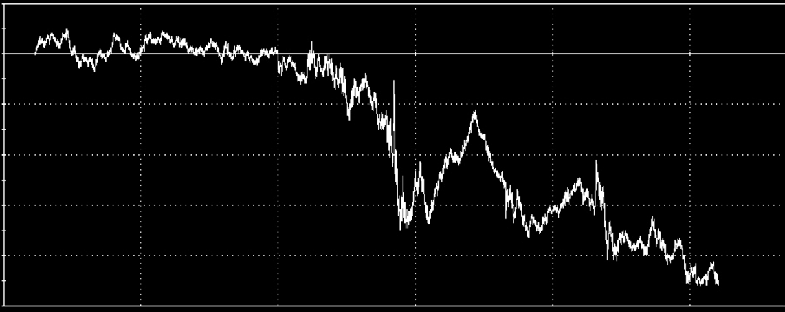
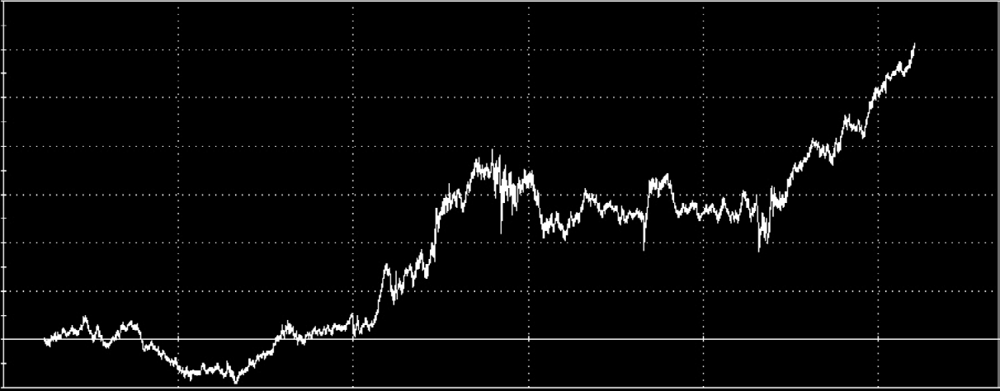
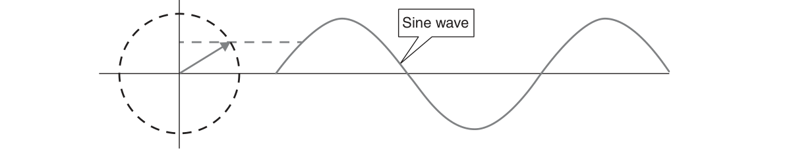
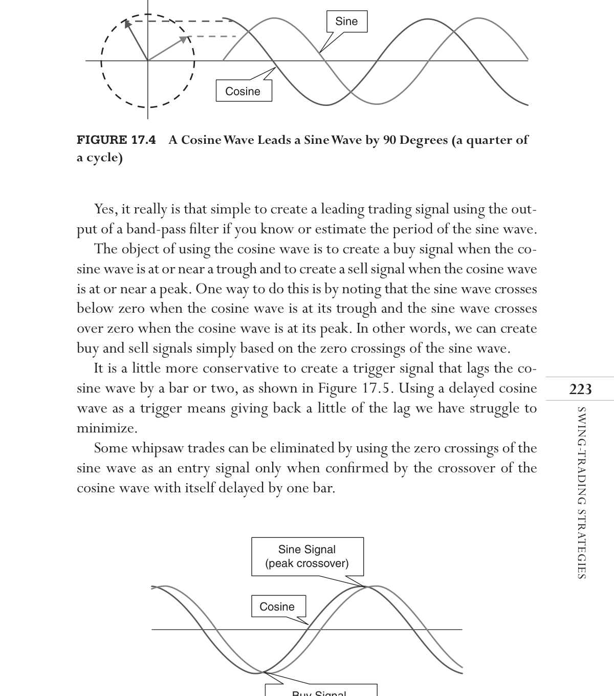

# Chapter 17: Putting It All Together


## BibTeX

```bibtex
@InBook{ehlers2013cycle_ch17,
  author    = {Ehlers, John F.},
  title     = {Cycle Analytics for Traders: Advanced Technical Trading Concepts},
  chapter   = {17},
  chaptertitle = {Putting It All Together},
  publisher = {Wiley},
  year      = {2013},
  series    = {Wiley Trading},
  isbn      = {9781118728604},
}
```

---

Swing-Trading
Strategies
“Writing trading strategies is simple,”  Tom said easily.
W
ell, I think Tom really meant that trading systems should be simple,
but writing effective ones is not easy. Trading systems should be sim-
ple to avoid curve fitting to the data set on which the system is developed.
For example, if you used one year’s worth of daily data to develop a system
and your system was written as a polynomial of order 250, then you could
have theoretically matched that polynomial exactly to the data. However,
applying that polynomial to another year’s data would most likely have dis-
astrous results. Therefore, keeping a trading strategy simple improves the
likelihood that the strategy will be robust across multiple symbols and mul-
tiple time frames. If you use few parameters in your system, it is less likely
the strategy is customized to the data set.
Given that the strategy is simple, the next criterion is that the entry
and exit rules be predictive. Most rule-based strategies depend on indica-
tors, setups, or patterns. Sadly, all of these depend on historical data and
are better at documenting what has happened rather than predicting what
will happen. Additionally, setups and patterns are often based on just a few
observations and are therefore anecdotal or heuristic. The fact that setups
or patterns do not have sufficient instances to be statistically significant is
usually overlooked. Therefore, finding a predictive indicator is probably the
most difficult part of developing a trading strategy.

The majority of this book describes advanced filters and indicators to
help your trading. Ultimately, the indicators are used as an aid to making
buy and sell decisions, whether the decisions are based on discretion or on
an algorithmic rule set. Indicators use parameters. For example, a moving
average uses length of the average as a parameter. The power of modern
trading platforms enables you to vary the parameters to maximize trading
performance over the selected data set. The process is called optimization. I
can assure you that the process is anything but optimum and can lull you into
a false sense of confidence in your prospective strategy. The process of opti-
mization should include a sensitivity analysis where you vary each parameter
by itself and then view the performance over a full range of the parameter. If
the optimization does not provide a gentle peak so the parameter is effective
over a range of settings, then your candidate strategy is guaranteed not to
be robust. When testing your strategy, you should produce enough trades so
the results are statistically significant. One rule of thumb is that you should
have at least 30 trades for each parameter used in the prospective strategy.
For example, if you use four parameters in your strategy, you should exam-
ine the results over at least 120 trades. I personally think this count is on the
low side.
Nobody wants to lose money on a trade, and stop-loss criteria are often
built into the strategy to minimize losses. Remember, the name of the pro-
cedure is stop loss, and half that name is loss. Therefore, stop-loss rules should
be used sparingly and not be imbedded so that the stop loss is an integral
part of the strategy. My procedure is to develop the strategy without the use
of a stop-loss rule. After the main part of the strategy is satisfactory, I then
examine the maximum adverse excursions encountered, and then insert a
stop-loss rule that limits only the maximum losses without interfering much
with the winning trades.
The final general aspect of strategy development that cannot be over-
looked is “out-of-sample” testing. You have undoubtedly developed the
strategy on a given data set that consists of one symbol over a selected
period of time. Out-of-sample testing means that you apply your trading
strategy to the same symbol over a different time range or apply your trad-
ing strategy to multiple different symbols, all of which is done without
changing parameters. If you reoptimize, you are simply cheating, and you
are only cheating yourself because you are bound to be disappointed when
you apply your strategy to real trading. However, if you get satisfactory
results doing this, then your strategy is robust and you can trade it with
greater confidence.

Swing-Trading Strategies

## Conventional Wisdom

By analogy to gambling, trading strategy performance is most easily charac-
terized by percent winning trades and profit factor. Profit factor is the ratio
of gross winnings to gross losses, comparable to the payout on a wager. Per-
cent winning trades is self-explanatory. There is no unique combination of
these characteristics that lead to a successful trading strategy, so the trading
style is optional.
Trend following usually means trying to identify an entry opportunity
and then exit the trade quickly if the trend does not develop. This means
one can make a lot of money on a few trades, but there will be many losing
trades along the way. Therefore, trading the trend means being willing to
accept a relatively low percentage of winning trades to achieve a relatively
high profit factor. Alternatively, a trend trader may elect to hold a position
through adversity to profit in the long run. Holding trades through adversity
usually means accepting large drawdowns. In my view, trend trading works
because the general market is unbounded and has an upside bias due to
economic growth and inflation. I assert that there are no predictive indica-
tors for trends, and therefore this style of trading does not fit my ­preferred
­process.
Predictive indicators are more applicable to short-term processes such as
swing or momentum trading because, like the weather, predicting the future
is fragile and evanescent. If the indicators are indeed predictive, short-term
trading is characterized by a higher percentage of winning trades. The profit
factor of short-term trades is generally smaller because spectral dilation
limits the swings of the short-term market movements. The general class of
indicators that support short-term trading are called oscillators.
As described in Chapter 6, we are dealing with random variables when
trying to describe the market. Additionally, traders generally prefer to err
on the side of caution because losses are painful. These considerations lead
to a trading philosophy that waits for confirmation of the turning point of
an indicator before signaling a trade entry. For example, the conventional
Stochastic indicator rule could be “wait until the oscillator crosses above
20 percent before making a long position trade, and wait until the oscillator
crosses below 80 percent before reversing to a short position trade.” This
rule set waits until the Stochastic indicator moves in the direction of the
desired trade before making the trade decision. As an example, assume the
market has a monthly cycle. We would then want to set the length param-
eter of a stochastic indicator to 10 because there are roughly 10 days up and

10 days down in a monthly cycle. When we invoke the conventional Stochas-
tic indicator rule using the two-pole Stochastic indicator of Chapter 7, we
obtain the equity curve of Figure 17.1 when applied to 10 years of the S&P
Futures data.
These trading results are awful! Just a little analysis can show what went
wrong. First, the roofing filter has a lag of about two bars, almost like the
SuperSmoother filter. There is basically no lag computing the Stochastic, and
then there is another two-bar lag of the SuperSmoother filter that smooths
the Stochastic calculation. So there is a total of four bars of lag just to com-
pute the indicator. We don’t get a signal for about 25 percent of the move in
time, or about three bars, after the turning point of the indicator. Further,
we cannot make a trade entry until the day after the signals are given. There-
fore, our trade entries and reversals are about 8 bars late on a 10-bar move.
This means we are trading almost exactly opposite of the way the market is
moving in a monthly cycle. This is the penalty for waiting for confirmation.

## Anticipating the Turning Point

I think the best way to trade an oscillator is to anticipate the turning point
and rely on the statistical return to the mean as being predictive. I wrote a
paper on this subject that was awarded the 2008 Runner-Up Winner of the
Market Technician Association’s Charles H. Dow Award.1 In contrast to the
conventional wisdom, the Stochastic indicator anticipation of the turning
point trading rule would be “make a long position trade when the oscilla-
tor crosses below 20 percent, and reverse to a short position trade when
–10000
–20000
–30000
–40000
–50000
3/28/05
Equity($)
2/28/07
1/28/09
9/17/2003 - 4/25/2013
12/29/10
11/29/12



*Figure 17.1: Using a Conventional Stochastic Indicator Rule Is Not*

­Profitable

Swing-Trading Strategies
the oscillator crosses above 80 percent.” The anticipation rule enables us to
get the trading signal nominally three bars before the turning point of the
indicator. We still have the four bars of computational lag and the one bar
lag of entry following the signal. Therefore, our net lag in making the trade
entry is only two bars relative to the real turning point in the data. In other
words, out timing is just about right. Invoking the anticipated trading rule
using the two-pole Stochastic indicator of Chapter 7, we obtain the equity
curve of Figure 17.2 when applied to 10 years of the S&P Futures data.
The anticipation rule is equally applicable to most oscillators. Example os-
cillators in this book would be the band-pass filter in Chapter 5 and the two-
pole RSI in Chapter 7. The anticipation rule using the two-pole Stochastic indi-
cator is not intended to be a complete trading system. For example, the 10-bar
period was selected for demonstration purposes. The computation period of
the indicator can be optimized for a given symbol to produce the best timing
for the trade entries and exits. Further, no stop-loss values have been used.
The purpose of describing the conventional wisdom of waiting for
confirmation as contrasted with anticipating the turning points with no
other changes of parameters or rules is to sensitize you to the impacts of
­computational lag.

## Sine Wave Uniqueness

According to Fourier analysis, any complex waveform can be synthesized
using a combination of sine wave components. That makes a sine wave a
primitive from which all patterns can be formed. It is best to use a primitive
–10000
3/28/05
Equity($)
2/28/07
1/28/09
9/17/2003 - 4/25/2013
12/29/10
11/29/12



*Figure 17.2: Using the Anticipated Stochastic Indicator Turning Point*

Rule Is Generally Profitable

in trading in the interest of robustness. Further, it is difficult enough just to
measure one primitive in the market data, let alone a complex set that cre-
ates anecdotal patterns. With a sufficiently small bandwidth, the band-pass
filter creates an output that can be characterized as a sine wave having a
slowly varying amplitude and phase. Armed with this information, we can
examine the use of sine waves in providing trading signals.
A sine wave can be generated by the projection of a rotating phasor on
its vertical axis,2 as depicted in Figure 17.3. As the phasor rotates, the sine
wave rises from zero to its maximum, back to zero, to its minimum, and
then back to zero again to complete one full cycle period. Note that the
“tail” of the phasor is pinned at the origin. If the tail of the phasor were off-
set from the origin, then the sine wave would be distorted and would not
have a zero mean. Since market data have Spectral Dilation, it is crucial that
the Spectral Dilation effects be removed, as discussed in Chapter 5, before
working with the filtered sine wave.
The position of the phasor at any instant in time is the phase angle of the
sine wave. There is a special relationship if the phase angle between two pha-
sors is 90 degrees, or a quarter of a cycle. As shown in Figure 17.4, a phasor
leading the sine wave phasor by 90 degrees creates a cosine wave. The fact
that a cosine wave leads a sine wave by 90 degrees is important because it
gives us a way to artificially advance the turning point of a band-pass filter
output by a quarter of a cycle. By advancing the waveform a quarter of a
cycle we can negate or reduce the computational lag required by the filter.
From the calculus we know that the rate of change of the sine wave is ­exactly
a cosine wave whose amplitude is modified by the argument. A one-bar dif-
ference creates the rate of change of the sine wave, so an amplitude-corrected
cosine wave can be computed in code as (using EasyLanguage notation):
Cosine = (Period / 2π) * (BP − BP[1])
Sine wave



*Figure 17.3: A Sine Wave Can Be Generated by a Rotating Phasor That Is*
Pinned at the Origin

Swing-Trading Strategies
Yes, it really is that simple to create a leading trading signal using the out-
put of a band-pass filter if you know or estimate the period of the sine wave.
The object of using the cosine wave is to create a buy signal when the co-
sine wave is at or near a trough and to create a sell signal when the ­cosine wave
is at or near a peak. One way to do this is by noting that the sine wave crosses
below zero when the cosine wave is at its trough and the sine wave crosses
over zero when the cosine wave is at its peak. In other words, we can create
buy and sell signals simply based on the zero crossings of the sine wave.
It is a little more conservative to create a trigger signal that lags the co-
sine wave by a bar or two, as shown in Figure 17.5. Using a delayed cosine
wave as a trigger means giving back a little of the lag we have struggle to
minimize.
Some whipsaw trades can be eliminated by using the zero crossings of the
sine wave as an entry signal only when confirmed by the crossover of the
cosine wave with itself delayed by one bar.



*Figure 17.4: A Cosine Wave Leads a Sine Wave by 90 Degrees (a quarter of*
a cycle)
Cosine
Sine
Figure 17.5  Buy and Sell Signals Can Be Created by Crossovers with a
Cosine Wave and the Cosine Wave Delayed by a Bar or Two
Cosine
Buy Signal
(trough crossover)
Sine Signal
(peak crossover)


## Safety Valve

Since effective swing trades require anticipation of the price turning, it is
inevitable that there will be cases when the price keeps on going and basi-
cally becomes a new trend movement. In these cases, your anticipation puts
you on exactly the wrong side of the trade. You therefore need a rule that
closes out a position when losing trades like this are experienced. You basi-
cally have two options to exit the trade: base the exit on price or on time
in the trade. As a practical matter, I have not found setting a stop loss to be
an effective method of exiting a losing trade in these conditions because the
stop value has to be set so tight that one is whipsawed out of a trade that
ultimately could turn out to be profitable.
If the exit rule for a losing trade is based on price, one can rely on the
fact that the swing trade is expecting a reversion to the mean, and therefore
the price are varying within a channel. If the anticipated reversal does not
occur, then it is likely that the prices will have a channel breakout. A simple
channel can be established using a SuperSmoother filter on the highs and
lows of the price bars. The channel can be widened, if desired, by adding a
fraction of the average bar range to the smoothed high prices and subtract-
ing it from the smoothed low prices. If you are in a long position trade and
the price falls outside the lower channel, then it is time to exit the trade at
a loss, perhaps reversing to a short position to capture the downtrend that
you did not anticipate.
If the safety valve is operating on a time line, you must be sensitive to
the periodicity of the cycle you are trading. For example, a monthly cycle
generally consists of a 10-bar move up followed by a 10-bar move down.
Therefore, your expected time to be in any given trade is about 10 bars. If
you are not in a profitable position by the time you are about halfway into
the expected trade duration, it is probably time to bail out of the trade at a
loss. Being a little more aggressive, you can also establish a “quick out” rule
that basically says that if you are not profitable in the first bar or two of a
trade, exit the trade and wait for a better opportunity.
I rely on technology for trading and therefore do not rely on psychol-
ogy much, even though psychology certain has a place in discretionary
trading. There is one unmistakable psychological signal to exit a trade.
That is, if you even think about hoping a trade will turn around and move
in your favor, then exit the trade immediately. Hope has a negative value
in trading.

Swing-Trading Strategies

## Exiting a Trade

When trading futures, it is common to take both long and short positions.
Using a swing-trading strategy in this case, the exit of a long position can
become the entry for the next short position. Alternatively, when trading
long-only positions, the short entry signal can become the exit signal for a
long position trade.
Using a short entry signal as an exit signal when trading stocks is less than
optimal because the stock prices do not move symmetrically. There is an
upside bias to stock prices, and prices generally move slower to the upside
than to the downside. Therefore, anticipating a downside move often will
result in an early exit to what otherwise could have been a very profitable
trade.
A better exit strategy when trading stocks follows the general principle
of “let your profits run.” A practical way of implementing such an exit would
be to smooth the closing prices with a SuperSmoother filter, and if the filter
output crosses below the filter output delayed by several bars, then exit the
trade. The smoothed prices will always be above the delayed smooth prices
as long as the prices are moving to the upside. Thus, you will be kept in a
profitable long position longer. Of course, you will give up a little of the ac-
crued profit when the prices turn down, but that is the price you must pay
to avoid the whipsaw exit.

## Stop Loss

My experience is that a stop loss will decimate the robustness of a trading
strategy if it is built into the strategy and becomes an integral part of it.
Rather, a stop loss is best left only as a guard against extremely large losses.
Using a stop loss this way will maintain the robustness of the core strategy
you have built. There are a large number of ways to implement a stop loss
rule. The simple rule that works for me is to let the stop value just be a per-
centage of the entry price. In EasyLanguage notation, the stop-loss rules are:
If Marketposition = 1 and Close < (1 − PctLoss/100)*EntryPrice
Then Sell Next Bar on Open:
If Marketposition = −1 and Close > (1 + PctLoss/100)*EntryPrice
Then Buy to Cove Next Bar on Open:

The PctLoss is an input that can be established differently from ticker sym-
bol to ticker symbol. I find that a value from 2 to 5 percent works for most
stocks. Since leverage is involved with futures, the percentage input prob-
ably should be a little smaller.

## Evaluating a Trading Strategy

It is common to evaluate a trading strategy by looking at its historical track
record in the form of an equity curve. This can lead to an unwarranted en-
thusiasm for the trading strategy or, less likely, abandonment of a perfectly
good strategy. The reason is that there is considerable variability in the eq-
uity curves produced by a strategy having the given characteristics of profit
factor and percent winning trades.
By determining whether a trade is a winner or a loser using the percent-
age wins and a random number generator, applying the payout probability
to each trade, and summing the randomly selected trades, you can provide
realistic expectations for the equity growth produced by the system. Only in
this sense can randomization be introduced to establish performance. Sim-
ply winning or losing is not a random occurrence. An Excel spreadsheet
can show the randomized cumulative trading profits. Just press F9 and the
spreadsheet will recompute 500 randomized trades. You can independently
input different values of profit factor and percent winning trades to visually
assess the impact of these variables.
The variability in equity curves, even for examples having relatively high
profit factors and percent winning trades, indicates the wisdom of diversifi-
cation in your portfolio. If all the symbols in your portfolio are statistically
independent, then the deviation in the equity curve is theoretically reduced
by the square root of two for each doubling in the number of elements. For
example, you would halve the deviation of the equity curve if you used only
four symbols. You would halve the deviation again if you used eight symbols.
Therefore, you would quickly reach a point of diminishing returns by adding
symbols. Continuing the example, it would take 16 simultaneously traded
symbols to halve the deviation again. Further, finding a large set of symbols
having statistically independent trades is unlikely.
The following are the directions to recreate the spreadsheet. We need to
first insert the two important statistics. In cell A1, type “% Winners” with-
out quotation marks, and in cell B1, type 55. In cell A2, type “Profit Factor”
without quotation marks and in cell B2, type 1.5. The values of 55 and 1.5

Swing-Trading Strategies
are only initial values and are representative of a good system. The entries
into cells B1 and B2 are system statistics that you can change to visualize
their impact on equity growth.
In row 4, insert headings for five columns as “random,” “trade profit,”
“cum profit,” “trade #,” and “cum avg profit.” The quotation marks for the
headers are unnecessary.
In cell A5, input “=RAND()” without quotation marks. This creates a ran-
dom number having a uniform probability density in the range between
0 and 1. This random number is compared to the probability of a win by
inserting “=IF(A4<$B$1/100,$B$2,−1)” without the quotation marks into
cell B5. This conditional statement says that if the random number falls
within the winning probability, then assign the payout probability (the profit
factor) to the trade; otherwise, assign a value of −1 to the trade. This is the
outcome of the trade. In cell C5, input “=B5” without quotation marks be-
cause the first trade profit is the same as the cumulative profit for the first
trade. Insert 1 into cell D5 as the first trade number. In cell E5, insert the
equation “=D5*(($B$2+1)*$B$1/100 −1)” without the quotation marks.
Copy all of row 5 into row 6.
Then change cell C6 to be “=C4 + B5” without the quotation marks. This
sums the trade profits in column C. Next, insert the equation “=D5 + 1”
without quotation marks in cell D6. This increments the trade number.
Finally, copy all of row 6 and paste it into rows 7 through 504. Now you
have the data for your analysis over 500 trades. Make a line plot of columns
C and E to graph the Monte Carlo equity growth and cumulative average
trade profit together.
Just press F9 to recompute the spreadsheet. You will create a new rand-
omized equity growth curve because all the random numbers have changed.
Repeat as often as you desire to get a feeling that you know what to expect.
You can change the data in cells B1 and B2 to assess the sensitivity of success
to these basic parameters.

## Monte Carlo Evaluation

Monte Carlo analysis is the best way to evaluate a trading strategy if you have
the programming capability. The calculations are relatively straightforward.
Suppose you have a sufficiently large number of trades that you have confi-
dence in the strategy’s working in a variety of conditions. If working futures,
this could be something like trading every two weeks on the average over

the past 10 years. If working stocks, this could be using all the symbols in the
S&P 500 index over the past several years.
The computations start by computing the profit per day for each of the
trades in the real trading history. Then place all these profits per day in the
proverbial hat. Next, draw a profit per day from the hat, record its value,
and replace it in the hat. Repeat the drawing 260 times to create a ran-
domized year’s worth of trading. Note and record the randomized annual
profit in a “bin,” which is a relative small range of profit. Then, repeat the
annualized drawing 10,000 times and place the annualized profit into its
correct bin. Doing this, it is possible to have some years that have nothing
but losing trades and other years that have nothing but winning trades. Of
course, there is a wide range of combinations between the two extremes.
The resulting number of counts in each bin will have an approximate nor-
mal (Gaussian) probability distribution shape. An example of a Monte Carlo
analysis of trades can be found at www.StockSpotter.com.3 Since the Monte
Carlo analysis results have the shape of a normal probability distribution
function, you can easily establish the expectation (average profit) of the trad-
ing strategy. Additionally, you can estimate the standard deviation in profit-
ability, so you won’t be surprised when your actual results don’t match your
expectation.

## StockSpotter.com

In this chapter, I have outlined the tips and techniques to write an effective
short-term or swing-trading strategy. Rather than giving a specific code list-
ing, I have painted the techniques to be used with a broad brush because
there are so many variables that writing a trading strategy is analogous to
writing music. For full disclosure, I am the cofounder of StockSpotter.com.
StockSpotter contains a number of free indicators that use the principles I
have described in this book. They eliminate the effects of spectral dilation.
They minimize lag. They are uncommonly smooth due to multipole filtering.
SwamiCharts are also included.
StockSpotter is primarily a site for short-term trading, and has all the
necessary tools to support this role. Data for over 4,000 U.S. stocks and
exchange-traded funds is included. Screeners scan the data every day to
identify unique situations conducive to short term trading. Since StockSpot-
ter is a cloud computing service, there are four customized watch lists that
you can modify and monitor for trading signals. You can import other lists,

Swing-Trading Strategies
such as the IBD Nifty Fifty, into the watch list to get a double filtering op-
portunity for your trading signals.
My cofounder, Ric Way, has implemented data-mining techniques to
supplement the trading rules produced by the indicators. This data mining
includes difficult-to-pinpoint characteristics such as trendiness, cycle am-
plitude, volatility, and so on. All the trading signals, both entry and exit,
are given after the market close for exercise at the market on the open of
the next trading day. That is, the trading signals are given in advance. Then
these signals are transparently tracked as hypothetical trades. You have com-
plete access to all trading results, including trade-by-trade listing and Monte
Carlo analysis.
If your interest is primarily in short-term trading rather than cod-
ing indicators or writing trading strategies, I recommend that you try
­StockSpotter.com as your tool of choice.

## Key Points to Remember

1.	 The roofing filter or its equivalent must be used with the indicators
used to generate swing-trading signals to eliminate the distortions in-
troduced by Spectral Dilation. That is, the indicators used to create the
signals must have a zero mean.
2.	 Effective swing-trading signals must anticipate the price turning points
to mitigate the lag introduced in computing the indicators. Using con-
ventional oscillators, this is accomplished by creating a long trading sig-
nal when the indicator crosses under a lower threshold and creating a
short trading signal when the indictor crosses over an upper threshold.
3.	 A sine wave is a unique primitive. It can be created from price data using
a relatively narrow band-pass filter described in Chapter 5.
4.	 A cosine wave can be created by taking the one-bar difference of a sine
wave. The cosine wave is an anticipating signal because it leads the sine
wave by a quarter of a cycle. Using a cosine wave is a synthetic way to
remove lag.
5.	 A leading long entry signal can be generated when a cosine wave crosses
over itself delayed by a bar or two. A leading short entry signal can be gen-
erated when a cosine wave crosses under itself delayed by a bar or two.
6.	 A less conservative method generates a long entry signal when the sine
wave crosses under zero and generates a short entry signal when the
sine wave crosses over zero.

7.	Swing trades must have a safety valve exit because the trades are entered
in anticipation of a price turning point. The safety valve can be based on
either time in trade or a price break out.
8.	Swing-trade entry signals indicate position reversals for always-in-the-
market strategies.
9.	Exit signals when trading stocks to the long side are best accomplished
using a SuperSmoother filter crossing under itself delayed by a few bars.
This technique minimizes whipsaws and unwarranted early trade exits.
10.	Stop-loss techniques should be used only to limit major losses.
11.	Monte Carlo analysis is the best and most reliable way to assess trading
strategy performance.
Notes
1. 	www.stockspotter.com/In/TechnicalPapers.aspx
2. 	www.stockspotter.com/In/MesaIndicatorHelp.aspx
3. 	www.stockspotter.com/In/MonteCarloProfit.aspx

