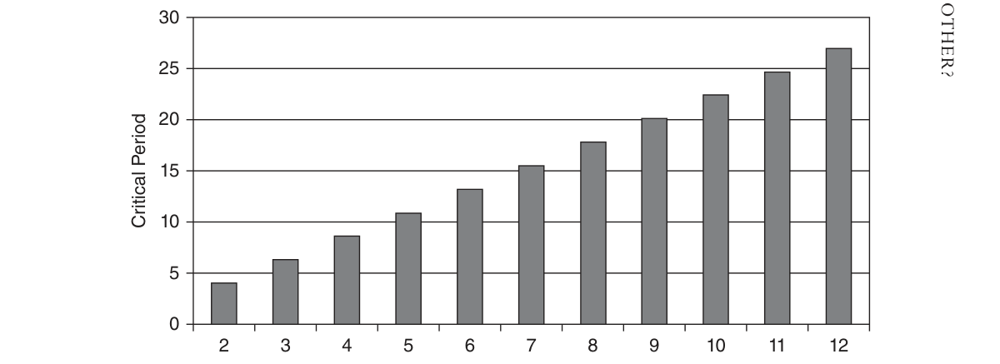
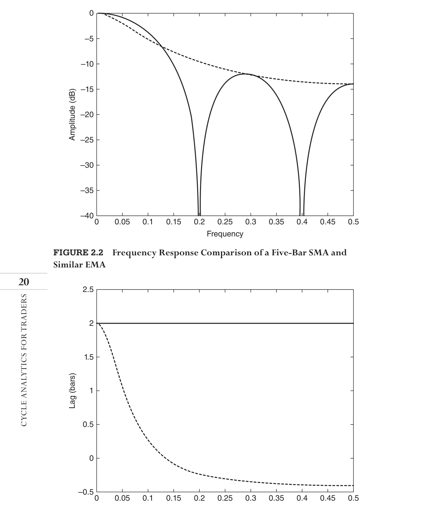
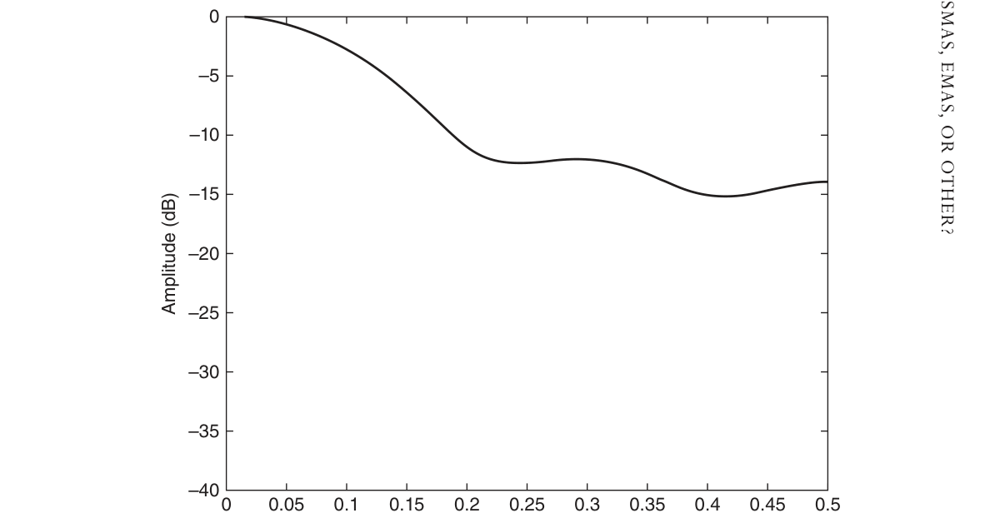
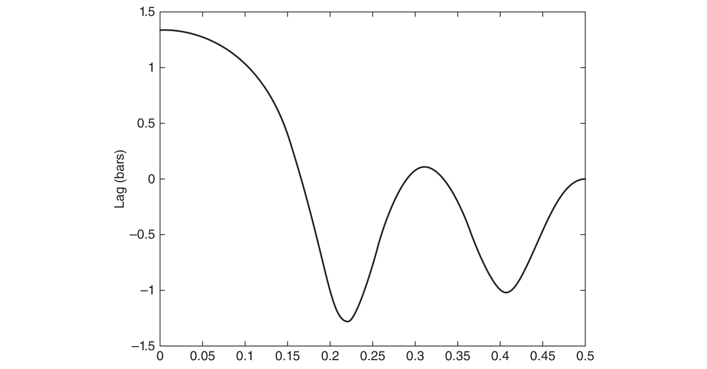

# Chapter 2: Indicators Based on Instantaneous Trend


## BibTeX

```bibtex
@InBook{ehlers2013cycle_ch2,
  author    = {Ehlers, John F.},
  title     = {Cycle Analytics for Traders: Advanced Technical Trading Concepts},
  chapter   = {2},
  chaptertitle = {Indicators Based on Instantaneous Trend},
  publisher = {Wiley},
  year      = {2013},
  series    = {Wiley Trading},
  isbn      = {9781118728604},
}
```

---

SMAs, EMAs, or
Other?
“Everyone’s children are above average,” said Tom meanly.
M
oving averages are discussed in this chapter simply because they are
ubiquitous in technical analysis. There are many better filters for
­various applications that are described in the following chapters. Moving
averages have the advantage that they are dirt-simple to compute. Their dis-
advantage is that the produce only a small amount of smoothing for the cost
of lag in their computation.
One little-known fact is that a simple moving average constitutes a best
fit to data in the least-squares sense.

## Simple Moving Averages (SMAs)

SMAs are a special case of nonrecursive filters where all the coefficients are equal
to unity divided by the number of elements in the filter. At any given point in
the data stream, the output of the filter is just the average of data over the span
of the filter. When time is advanced by one bar in one algorithm, the fractional
part of the oldest data sample is discarded and the fractional newest data sample
is added. Thus, it is a “moving” average. It just doesn’t get more simple than that,
and so it is deemed to be a simple ­moving average.
Viewed from another perspective, it can be viewed as a “window” that
is passed across a fixed data stream. Only those data samples within the
window are averaged and provided as an output of the filter. Since modern
computers are very fast, I recommend this latter approach because if the

length of the average is varied across the data set, the computations will fail.
We may want to make the length of the average vary when adapting the filter
to volatility or a measured cycle period.
An impulse is a theoretical data object that has zero width and infinite
height. It is used to assess the filter transfer response. For example, you
can think of it as a clapper striking a bell—the bell provides the transfer
response, and the ringing is the output. In other words, the ringing is the
impulse response of a bell. In sampled data systems, we can approximate an
impulse as a data stream that has a value only at one point and has zeros at
all other data samples.
If we slide the SMA window across the impulse data stream, the filter will
have an output only when the impulse falls within the window of the filter.
Thus, the impulse response of an SMA is finite, and therefore an SMA is a
special case of a finite impulse response (FIR) filter.
Suppose we start a filter design by trying to make its transfer response
be the best fit to a straight line. If we have more than two data points, this
would be impossible in the general case. However, we can define a best fit,
where the sum of the squares of the differences between the data and our
straight line is minimum. In the case of five data points, designated as ux, we
can write the desired function as
F
u
mx
b
x
x
=
−
+
= −∑[
(
)]

We can minimize this function by taking the derivatives of this function
with respect to m and b and setting those derivatives to zero. When we do
this, we find that the correct value of b is just the average of the five data
points. This is true regardless of which five data points we select, so that an
SMA is synonymous with finding a best-fitting straight line to the data, at
least when the lag of the filter is disregarded. I find this to be a fascinating
little-known fact about SMAs.
In Chapter 1, we showed that the lag of a nonrecursive filter having
coefficients symmetrical about its center point and of length N is exactly
(N − 1) / 2. Since an SMA is a special case of a nonrecursive filter, it is also
true that an SMA lag is also
(N − 1) / 2
Equation 1-8 is repeated here as the amplitude of the transfer response
of an SMA.

SMAs, EMAs, or Other?

H
f
Sin N f
NSin
f
(2
)
(
)
(
)
π
π
π
=

(2-1)
At zero frequency, Equation 2-1 evaluates to 1 in the limit. This starts the
pass band of the SMA. The critical period of a filter output is the frequency
at which the output power of the filter is half the power of the input wave
at that frequency. Since power is proportional to the square of the wave
amplitude, we are interested in finding the frequency at which the output
wave has an amplitude of 0.707 (the square root of 0.5). Knowing this, we
can select an SMA that gives us the approximate critical period we seek.
­Figure 2.1 shows the relationship between the critical period and the num-
ber of elements in the SMA.
It is a reasonable approximation and easy to remember that the critical
period of an SMA is twice its length.
The first zero in the transfer response occurs the when the argument
in the numerator has a value of π. This occurs when f = 1 / N. Subsequent
zeros in the transfer response occur when the argument in the numerator
are integer multiples of π. The first maximum in the stop band occurs when
the argument in the numerator causes the sine function to be at a maxi-
mum, or f = 3π / 2. At this frequency the value of the transfer response is
approximately 2 / (3π), or −13.3 decibels (dB). For the same reason, the
next maximum in the stop band occurs at f = 5π / 2, and the attenuation
is 2 / (5π), or −17.8 dB. This amount of attenuation is not substantial, and
you will see methods to modify an SMA to improve its filtering capability.
SMA Length
Critical Period



*Figure 2.1: SMA Critical Period as a Function of Filter Length*


## Exponential Moving Averages (EMAs)

An EMA is computed by taking a fraction of the current price added to
the complementary fraction of the EMA calculation one bar ago. The first
­fraction is usually called alpha, and can have a value between zero and one.
The two fractions must sum to unity, so the second fraction must have the
value of one minus alpha. The equation to compute an EMA is:

EMA = α * Price + (1 − α) * EMA[1]
(2-2)
The EMA becomes a moving average by moving from bar to bar, from left
to right, across the price data.
Imagine a case where the input data set has only one sample at an am-
plitude of 1 / α. When the EMA is applied to these data, the first output
from the filter is unity because there was no previous value for the EMA.
On subsequent calculations, the price value is zero, and so the sequence of
calculations is:

EMA(0) = 1

EMA(1) = (1 − α)
EMA(2) = (1 − α) * (1 − α) = (1 − α)2

EMA(3) = (1 − α)2 * (1 − α) = (1 − α)3
.  .  .

EMA(N) = (1 − α)N
Since the quantity (1 − α) must be less than one, the amplitude decays as
the exponent of each succeeding calculation from an impulse input, hence
the name exponential moving average. In principle, a part of any data input
remains in subsequent calculations, although the contribution becomes van-
ishingly small. This attribute makes an EMA part of a general class of filters
called infinite impulse response (IIR) filters.
It is instructive to examine the EMA response to a step function. A step
function has a series of constant values and then jumps to another series of
constant values. Assume the price has been zero for a long time and then
suddenly jumps up to a value of 1 and maintains that value thereafter. On
the first bar, the EMA will have a value of α. On the second bar, the value
will be α + α * (1 − α). On the third bar, the value will be α + α * (1 − α) +

SMAs, EMAs, or Other?
α * (1 − α)2, and so on. The EMA will gradually approach the value of 1.
A common error in programming is to insert a value for α, such as .2, and
inserting another number for (1 − α), such as .9. The two terms must sum
to unity or the recursive algorithm will lead to erratic results or might even
cause your computer to crash. You should always check your computer code
to ensure that the two terms sum to unity. I am so cautious on this point
that I assign the value α as a global variable and write out the EMA equation
in terms of α. By letting the computer do the work, I know the two terms
must sum correctly.
We can assert that the price on day “d” is d. If we assume the lag of the
EMA is “L,” then the current value of the EMA is (d − L). Further, the previ-
ous EMA would have a value of (d − L − 1), since price is rising one unit per
bar. Putting these values into the equation for the EMA, we obtain
(d − L) = α * d + (1 − α) * (d − L − 1)

= α * d + (d − L) − 1 − α * d + α * (L + 1)

O = α * (L + 1) − 1

α = 1 / (L + 1)
This equation shows that we can select an acceptable lag and, from that
lag, compute the alpha term of the EMA. For example, if we can accept a
three-bar lag resulting from the EMA, we would use α = 0.25.
We can also relate an EMA to an SMA on the basis of their equivalent
static lags. Recalling that the lag of an SMA is (N − 1) / 2 for an N-bar SMA,
we can substitute this value of lag into the alpha calculation of the EMA as

α = 1 / ((N − 1)/2 + 1)

= 2 / ((N − 1) + 2)
(2-3)

= 2 / (N + 1)
This is the relationship between an N-bar SMA and the alpha of an EMA
that is quoted in most technical analysis books. The frequency responses of a
five-bar SMA and its EMA equivalent are compared in Figure 2.2. Figure 2.3
shows that the lags of the SMA and EMA are equal only at zero frequency.
Although the lags at static frequencies align, note that the critical period
of the EMA is not aligned with that of the SMA. We can obtain a better cal-
culation for the fraction α by examining the transfer response of the EMA.

–5
–10
–15
–20
–25
–30
–35
–400
0.05
0.1
0.15
0.2
0.25
Frequency
Amplitude (dB)
0.3
0.35
0.4
0.45
0.5



*Figure 2.2: Frequency Response Comparison of a Five-Bar SMA and*
­Similar EMA
2.5
1.5
0.5
–0.50
0.05
0.1
0.15
0.2
0.25
Frequency
Lag (bars)
0.3
0.35
0.4
0.45
0.5
Figure 2.3  Lag Response of EMA Compared to a Constant Two-Bar Lag of
a Five-Bar SMA

SMAs, EMAs, or Other?

## Weighted Moving Averages (WMAs)

It appears that the WMA was invented by a trader who did not have a firm
grasp of filter theory in hopes of reducing lag.
A WMA is an FIR filter having coefficients asymmetrically weighted
about the center point of the filter. The most recent data sample is weighted
most heavily, the second most recent data sample weighted somewhat less,
and so on. The weighting does not necessarily have to be linear with the
data sample, but that is the most common usage. For our graphical exam-
ple, I will use a five-element WMA whose coefficients are [5 4 3 2 1] / 15.



*Figure 2.4: shows the frequency response of this filter, and Figure 2.5 shows*
its lag response.


*Figure 2.4: shows that a WMA has poorer attenuation than the equiva-*
lent SMA shown in Figure 2.2 and that a WMA has more lag in the pass
band than the equivalent EMA shown in Figure 2.3. In short, a WMA
has little to recommend itself compared to the other common moving
­averages.
–5
–10
–15
–20
–25
–30
–35
–400
0.05
0.1
0.15
0.2
0.25
Frequency
Amplitude (dB)
0.3
0.35
0.4
0.45
0.5


*Figure 2.4: A WMA Has Poor Rejection in Its Transfer Response*


## Median Filter

There are times when a median filter is the most appropriate filter to use.
It is best applied when the data contains impulsive noise or when there are
wide variations in the data, such as volume data. Its purpose is to attempt to
discard outlier data samples to avoid having them exert an inordinate impact
on the average.
A median filter simply picks the middle value of a sample set of data
after the samples have been ranked. This selection is easiest when an odd
number of data samples is used. To demonstrate the effect of a median filter,
consider a data set consisting of four samples, each having a value of 1 and
one sample that has a value of 6. The data samples can appear in any order.
After ranking, the center value is just 1. Therefore the median value is 1,
which happens to be the value of most of the data samples. However, the
average value is (4 + 6) / 5 = 2. That one outlier data sample has severely
skewed the average, and the median filter best recovers the “average” value
of the data set.



*Figure 2.5: Lag of a Five-Element WMA Has No Outstanding Characteristics*
1.5
0.5
–0.5
–1
–1.50
0.05
0.1
0.15
0.2
0.25
Frequency
Lag (bars)
0.3
0.35
0.4
0.45
0.5

SMAs, EMAs, or Other?

## Key Points to Remember

1.	 The critical period defining the pass band of an SMA is approximately
twice the length of the filter.
2.	 An N-length SMA will have a lag of (N − 1) / 2 bars at all frequencies.
3.	 An EMA should always be written as EMA = α * Input + (1 − α) *
EMA[1] to avoid computational errors in evaluating the fractional coef-
ficient.
4.	 The fractional coefficient of an EMA equivalent to an N-length SMA is
calculated as α = 2 / (N − 1).
5.	 A WMA has little or no redeeming virtue.
6.	 A median filter is best used when the data contain impulsive noise or
when there are wild variations in the data. Smoothing volume data is
one example of a good application for a median filter.

