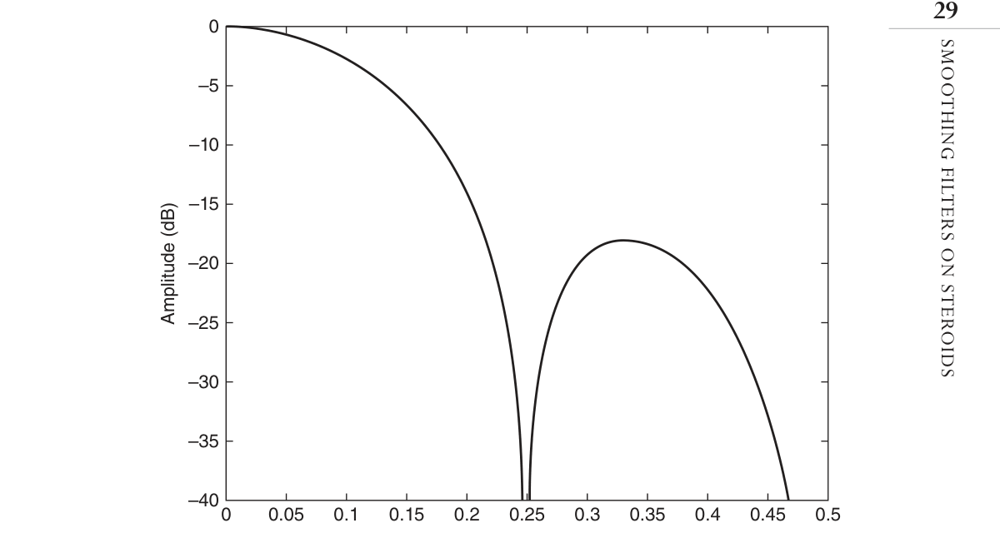
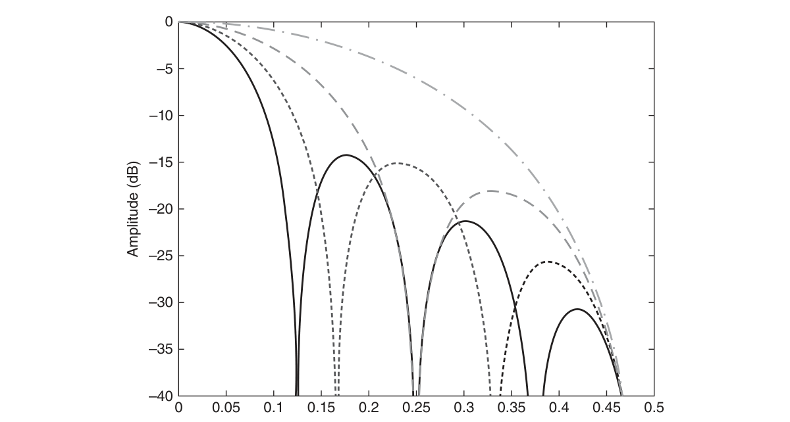
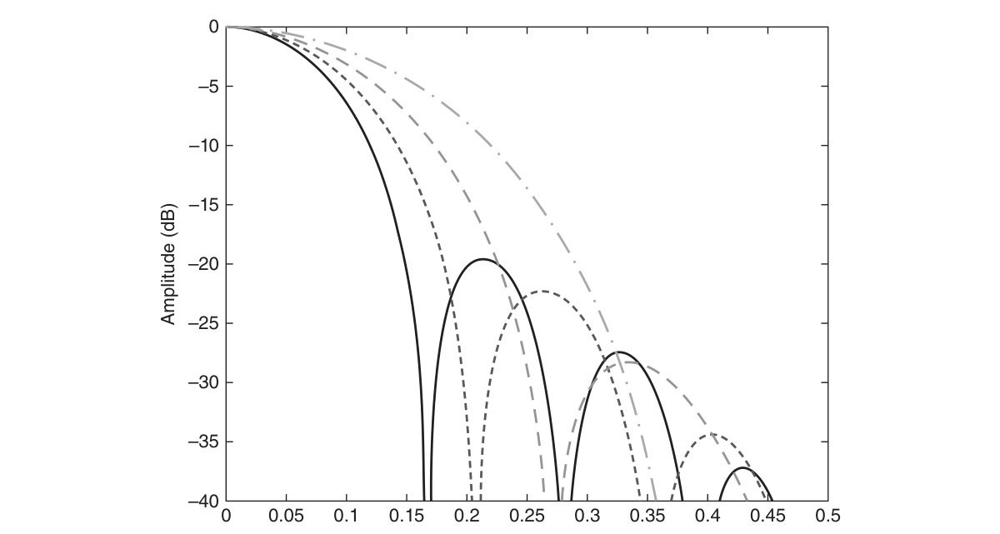
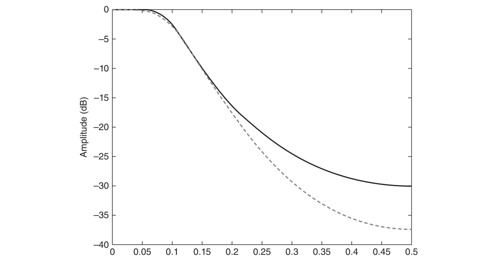
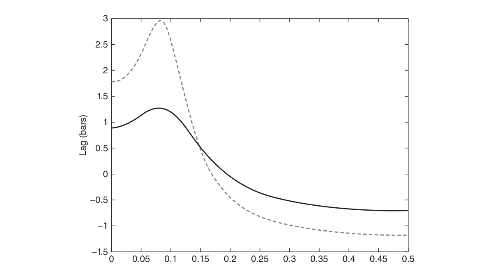
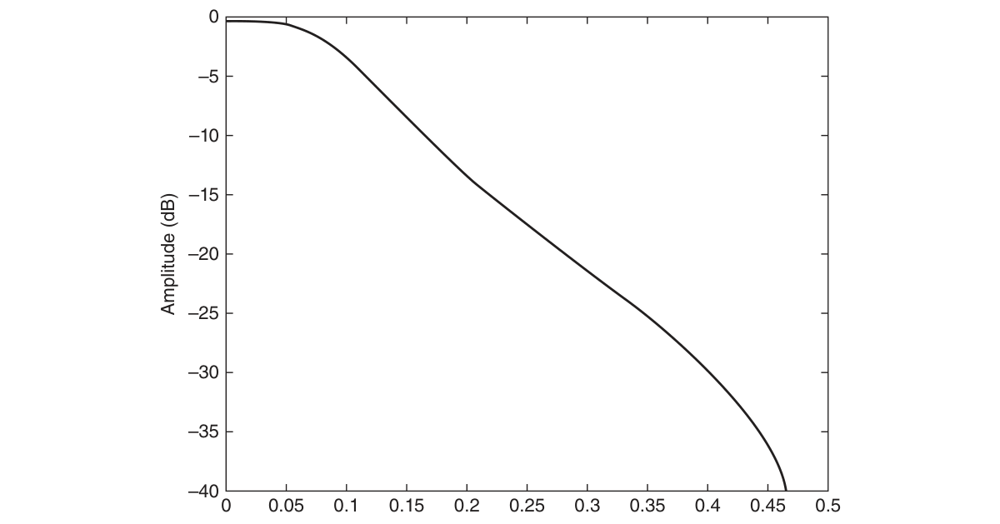

# Chapter 3: Measuring Cycles


## BibTeX

```bibtex
@InBook{ehlers2013cycle_ch3,
  author    = {Ehlers, John F.},
  title     = {Cycle Analytics for Traders: Advanced Technical Trading Concepts},
  chapter   = {3},
  chaptertitle = {Measuring Cycles},
  publisher = {Wiley},
  year      = {2013},
  series    = {Wiley Trading},
  isbn      = {9781118728604},
}
```

---

Smoothing Filters
on Steroids
“Steroids are for guys who want to cheat their opponents,”
said Tom combatively.
T
he objective of smoothing filters in trading is to get the highest de-
gree of smoothing possible within the constraint of inducing the least
amount of lag. The purpose of this chapter is to develop those kinds of filters
for traders. Then, it is up to the trader to interpret the results of the filter-
ing. None of these filters are predictive. None of these filters explain market
activity.

## Nonrecursive Filters

Any nonrecursive filter having coefficients symmetrical about the center
point of the filter and having a polynomial of odd degree will always have a
root of the polynomial at the Nyquist frequency. This is important because
completely rejecting the highest possible frequency component in the filter
output goes a long way toward noise reduction. Noise reduction is the prin-
cipal purpose of a smoothing filter.
Since the degree of the polynomial is one less than the number of elements
in the filter, nonrecursive filters having the number of elements as 2, 4, 6, 8,
10, and so on will have this characteristic. Since the lag of nonrecursive filters
is half the degree of the filter, these filters will have lags of 0.5, 1.5, 2.5, 3.5,
and 4.5 bars, respectively. Filter design not only depends on the amount of
smoothing desired, but also on the amount of lag that can be tolerated.

As a shorthand notation, [b0 b1 b2 b3 . . . bN] / S is introduced to describe the
coefficients of nonrecursive filters. For example, [1 1 1 1] / 4 describes the
coefficients of a four-element simple moving average (SMA). In fact, a four-
element SMA fits the criterion of having a zero at the Nyquist frequency. Its
frequency response is shown in Figure 3.1. This figure shows that a four-bar
cycle period (frequency = 0.25) is also rejected. The critical frequency is the
−3 dB point in the response. The −3 dB point along the frequency axis is where
the output is attenuated to be half the input power. In this case the critical fre-
quency is approximately 0.1 cycles per bar, corresponding to a 10-bar cycle
period. The attenuation characteristic between a two-bar cycle period and a
four-bar cycle period rises to about −12 decibels (dB), which means the wave
amplitude at the output is about 25 percent of the amplitude at the input.
The expectation of obtaining more smoothing by increasing the length of
the SMA leads us to examine a six-element nonrecursive filter whose ele-
ments are [1 1 1 1 1 1] / 6. The frequency response of this filter is shown in
Figure 3.2. Increasing the degree of the polynomial introduced another zero
in the transfer response polynomial so that two-, three-, and five-bar cycle pe-
riods are completely eliminated at the output. However, ­attenuation ­between
the rejection points is not changed with respect to the lobe number, and is
–5
–10
–15
–20
–25
–30
–35
–400
0.05
0.1
0.15
0.2
0.25
Frequency
Amplitude (dB)
0.3
0.35
0.4
0.45
0.5

![Figure 3.1: Frequency Response of a [1 1 1 1] / 4 Nonrecursive Filter](ch3_images/fig_3_1.png)

*Figure 3.1: Frequency Response of a [1 1 1 1] / 4 Nonrecursive Filter*

Smoothing Filters on Steroids
only slightly increased from lobe to lobe. The critical period of this filter is in-
creased compared to the four-element SMA to be at a 13.7-bar cycle period.
Nonrecursive filters are not restricted to be SMAs. The coefficients can
be weighted symmetrically about the center of the filter. Among the most
simple of these is a filter whose coefficients are [1 2 2 1] / 6. The frequency
response of this filter is shown in Figure 3.3. Comparing this nonrecursive
filter to the SMA of like order (in Figure 3.1), we see that not only have the
cycle periods that are completely rejected are two- and three-bar cycle pe-
riods as opposed to two- and four-cycle periods. In addition, the attenuation
between the rejection frequencies rises to a minimum of −25 dB, meaning
the output waveform amplitude is less than 5.6 percent of the input ampli-
tude in this rejection band. The increased attenuation comes at the expense
of a decrease in the critical cycle period to a 7.4-bar cycle. The filter delay
remains the same at 2.5 bars.
From our experience with SMAs, we can improve both the smoothing
and the rejection band attenuation by increasing the degree of the filter (at
the expense of increased lag). The frequency response of a [1 2 3 3 2 1] / 12
nonrecursive filter is shown in Figure 3.4. In this case, two-, three-, and
four-bar cycle periods are completely eliminated from the output of the

![Figure 3.2: Frequency Response of a [1 1 1 1 1 1] / 6 Nonrecursive Filter](ch3_images/fig_3_2.png)

*Figure 3.2: Frequency Response of a [1 1 1 1 1 1] / 6 Nonrecursive Filter*
–5
–10
–15
–20
–25
–30
–35
–400
0.05
0.1
0.15
0.2
0.25
Frequency
Amplitude (dB)
0.3
0.35
0.4
0.45
0.5


![Figure 3.3: Frequency Response of a [1 2 2 1] / 6 Nonrecursive Filter](ch3_images/fig_3_3.png)

*Figure 3.3: Frequency Response of a [1 2 2 1] / 6 Nonrecursive Filter*
–5
–10
–15
–20
–25
–30
–35
–400
0.05
0.1
0.15
0.2
0.25
Frequency
Amplitude (dB)
0.3
0.35
0.4
0.45
0.5
Figure 3.4  Frequency Response of a [1 2 3 3 2 1] / 12 Nonrecursive Filter
–5
–10
–15
–20
–25
–30
–35
–400
0.05
0.1
0.15
0.2
0.25
Frequency
Amplitude (dB)
0.3
0.35
0.4
0.45
0.5

Smoothing Filters on Steroids
­filter and the rejection in the stop bands is still greater than −25 dB. Filtering
is improved because the critical period has been increased to be at a 10.9-
bar cycle period. All this is done at the expense of a delay of 3.5 bars. While
this is a pretty nice filter, we can do better.

## Modified Simple Moving Averages

An interesting fact is that if the values of the first and last elements of an
SMA having an even degree are cut in half, then one is guaranteed a double
zero in the transfer response at the Nyquist frequency. For example, a five-
element (four-degree) SMA would have coefficients as [0.5 1 1 1 0.5] / 4.
The transfer response of a five-element modified SMA is shown in ­Figure 3.5
for comparison to the response of a four-element SMA shown in Figure 3.1.
Not only do we have the double zero at the Nyquist frequency and the same
zero at a four-bar cycle period, but we also have increased the minimum
attenuation between the two zeros to be −20 dB, which means the output
amplitude is only 10 percent of the input data amplitude. This improved



*Figure 3.5: Frequency Response of a Five-Element Modified Simple*
­Moving Average
–5
–10
–15
–20
–25
–30
–35
–400
0.05
0.1
0.15
0.2
0.25
Frequency
Amplitude (dB)
0.3
0.35
0.4
0.45
0.5

­filtering performance comes at the expense of only a half bar of delay be-
cause we went from a four-element filter to a five-element filter.
The frequency responses of three-, five-, seven-, and nine-element modi-
fied SMAs are shown in Figure 3.6.

## Modified Least-Squares Quadratics

Instead of transfer response’s having a least-squares best fit, as with the SMA,
we can also arrange to obtain a least-squares best fit to a quadratic equation.
This means we can accommodate some bowing in the data while getting
our least-squares best fit. Then, we can halve the first and last coefficients
to realize the double zero in the transfer response at the Nyquist frequency.
Hamming1 gives the coefficients of such filters as:
[7 24 34 24 7] / 96
[1 6 12 14 12 6 1] / 52
[−1 28 78 108 118 108 78 28 −1] / 544
[−11 18 88 138 168 178 168 138 88 18 −11] / 980
–5
–10
–15
–20
–25
–30
–35
–400
0.05
0.1
0.15
0.2
0.25
Frequency
Amplitude (dB)
0.3
0.35
0.4
0.45
0.5



*Figure 3.6: Modified Simple Moving Average Frequency Responses*

Smoothing Filters on Steroids
The frequency responses of these filters are shown in Figure 3.7. The
­frequency responses in Figure 3.7 show that these are clearly superior
smoothing filters for trading. These filters incur two, three, four, and five
bars of lag, respectively.

## SuperSmoother

One of the advantages of recursive filters is that the transition between the
pass band and the stop band can be much sharper compared to that of the
nonrecursive filters. As a matter of computational simplicity, the critical
period of the filter can be established independently from the degree of
the filter. On the downside, recursive filters don’t have the same delay at
all frequencies. This variable delay across the spectrum leads to dispersion
distortion of the output waveform. Most of the dispersion occurs at those
frequency components that have been attenuated, so the effect of the distor-
tion is a relatively minor one.
A Butterworth filter is a favorite analog filter because its frequency re-
sponse is maximally flat, near zero frequency. Years ago, I translated analog
Butterworth filters to their digital approximations having like degrees in the



*Figure 3.7: Modified Least-Squares Quadratics Filter Frequency Responses*
–5
–10
–15
–20
–25
–30
–35
–400
0.05
0.1
0.15
0.2
0.25
Frequency
Amplitude (dB)
0.3
0.35
0.4
0.45
0.5

numerator and denominator of the transfer response. The transfer response
is characterized by a single variable: the critical period. The critical period is
that where the output is attenuated by 3 dB relative to the input data.
The digital Butterworth filter approximations included numerators
whose coefficients were [1 2 1] and [1 3 3 1] for two- and three-pole con-
figurations, respectively. However, for applications to trading, I noted that
the primary contribution of the numerator terms was to increase the filter
lag. So I created modified versions simply by deleting all but the constant
term in the numerator of the Butterworth transfer response.
The equations for the two-pole modified Butterworth filter are:
a = e(−1.414*3.14159 / Period)
b = 2 * a * Cos(1.414 * 1.25 * 180 / Period)

c2 = b
(3-1)
c3 = −a * a
c1 = 1 − c2 − c3
Output = c1 * Input − c2 * Output[1] − c3 * Output[2]
The equations for the three-pole modified Butterworth filter are:
a = e(−3.14159 / Period)
b = 2 * a * Cos(1.738 * 180 / Period)
c = a * a
d2 = b + c
(3-2)
d3 = −(c + b * c)
d4 = c * c
d1 = 1 − d2 − d3 − d4
Output = d1 * Input − d2 * Output[1] − d3 * Output[2] − d4 * Output[3]
The frequency responses for two- and three-pole modified Butterworth fil-
ters whose critical period was set at a 10-bar cycle are shown in ­Figure 3.8. The
three-pole version gives about 6 dB more attenuation at the Nyquist frequency
than the two-pole version. That means the output wave amplitude of the three-
pole version would be half the wave amplitude at the Nyquist frequency. In
some applications, this difference in filtered amplitude could be important.

Smoothing Filters on Steroids
The delay of the two- and three-pole modified Butterworth filters whose
critical period was set at a 10-bar cycle is shown in Figure 3.9. The price to
be paid for the additional rejection band attenuation is an increase of almost
two bars of additional delay near the critical period. In addition, there is
greater percentage dispersion distortion across the pass band.
Having obtained good filtering with minimum delay and minimum delay
distortion, it is relatively easy to obtain a zero in the transfer response at
the Nyquist frequency by adding a two-element moving average in the nu-
merator. The delay cost is only half a bar, and that cost seems worth it. By
doing this, a filter I call the SuperSmoother is created. The equations for the
SuperSmoother filter are:
a = e(−1.414*3.14159 / Period)
b = 2 * a * Cos(1.414 * 180 / Period)
c2 = b
(3-3)
c3 = −a * a
c1 = 1 − c2 − c3
Output = c1 * (Input + Input[1]) / 2 + c2 * Output[1] + c3 * Output[2]
–5
–10
–15
–20
–25
–30
–35
–400
0.05
0.1
0.15
0.2
0.25
Frequency
Amplitude (dB)
0.3
0.35
0.4
0.45
0.5



*Figure 3.8: Frequency Response of Two- and Three-Pole Modified*
Butterworth Filters Where Period = 10

The frequency response of the SuperSmoother filter where the critical
period is set to 10 is shown in Figure 3.10.

## SuperSmoother Filter Applications

A SuperSmoother filter is used anytime a moving average of any type would
otherwise be used, with the result that the SuperSmoother filter output
would have substantially less lag for an equivalent amount of smoothing
produced by the moving average. For example, a five-bar SMA has a cutoff
period of approximately 10 bars and has two bars of lag. A SuperSmoother
filter with a cutoff period of 10 bars has a lag a half bar larger than the
two-pole modified Butterworth filter shown in Figure 3.9. Therefore, such
a SuperSmoother filter has a maximum lag of approximately 1.5 bars and
even less lag into the attenuation band of the filter. The differential in lag
between moving average and SuperSmoother filter outputs becomes even
larger when the cutoff periods are larger.
Market data contain noise, and removal of noise is the reason for using
smoothing filters. In fact, market data contain several kinds of noise. I’ll
2.5
1.5
–0.5
–1
–1.50
0.05
0.1
0.15
0.2
0.25
Frequency
Lag (bars)
0.3
0.35
0.4
0.45
0.5
0.5



*Figure 3.9: Lags of Two- and Three-Pole Modified Butterworth Filters*
Where Period = 10

Smoothing Filters on Steroids
group one kind of noise as systemic, caused by the random events of trades
being exercised. A second kind of noise is aliasing noise, caused by the use
of sampled data. Aliasing noise is the dominant term in the data for shorter
cycle periods.
It is easy to think of market data as being a continuous waveform, but
it is not. Using the closing price as representative for that bar constitutes
one sample point. It doesn’t matter if you are using an average of the high
and low instead of the close, you are still getting one sample per bar. Since
sampled data is being used, there are some DSP aspects that must be con-
sidered. For example, the shortest analysis period that is possible (without
aliasing)2 is a two-bar cycle. This is called the Nyquist frequency, 0.5 cycles
per sample. A perfect two-bar sine wave cycle sampled at the peaks becomes
a square wave due to sampling. However, sampling at the cycle peaks can-
not be guaranteed, and the interference between the sampling frequency
and the data frequency creates the aliasing noise. The noise is reduced as the
data period is longer. For example, a four-bar cycle means there are four
samples per cycle. Because there are more samples, the sampled data are a
better replica of the sine wave component. The replica is better yet for an



*Figure 3.10: Frequency Response of a SuperSmoother Filter Where*
Period = 10
–5
–10
–15
–20
–25
–30
–35
–400
0.05
0.1
0.15
0.2
0.25
Frequency
Amplitude (dB)
0.3
0.35
0.4
0.45
0.5

eight-bar data component. The improved fidelity of the sampled data means
the aliasing noise is reduced at longer and longer cycle periods. The rate of
reduction is 6 dB per octave. My experience is that the systemic noise rarely
is more than 10 dB below the level of cyclic information, so that we create
two conditions for effective smoothing of aliasing noise:
1.	 It is difficult to use cycle periods shorter that two octaves below the
Nyquist frequency. That is, an eight-bar cycle component has a quanti-
zation noise level 12 dB below the noise level at the Nyquist frequency.
Longer cycle components therefore have a systemic noise level that
­exceeds the aliasing noise level.
2.	 A smoothing filter should have sufficient selectivity to reduce aliasing
noise below the systemic noise level. Since aliasing noise increases at the
rate of 6 dB per octave above a selected filter cutoff frequency and since
the SuperSmoother attenuation rate is 12 dB per octave, the Super-
Smoother filter is an effective tool to virtually eliminate aliasing noise in
the output signal.
I urge readers to universally adapt the SuperSmoother filter set to a cutoff
period of 10 bars or so on all data to attenuate aliasing noise. The output
of the SuperSmoother filter can be used directly as an indicator or as the
sampled data fed to any other indicator.

## Key Points to Remember

1.	 The lag of all nonrecursive filters having coefficients symmetrical about
the center point of the filter is half the degree of the transfer response
polynomial. In other words, for a nonrecursive filter having N elements,
the lag of that filter will be (N − 1) / 2.
2.	 Nonrecursive filters with coefficients symmetrical about the center
point of the filter and having an even number of elements will always
have a zero in the transfer response at the Nyquist frequency.
3.	 An SMA having an odd number of elements and whose first and last
elements have coefficients cut in half are guaranteed of having a double
zero in the transfer response at the Nyquist frequency.
4.	 Whereas SMAs are a least-squares best fit to a straight line, nonrecur-
sive filters can also have coefficients that are a least-squares best fit to a
quartic. Halving their end coefficients also guarantees a double zero in
their transfer response at the Nyquist frequency.

Smoothing Filters on Steroids
5.	 Probably the best filter for most smoothing applications is a two-pole
SuperSmoother.
6.	 A SuperSmoother filter is recommended for universal use to remove
aliasing noise.
Notes
1.	 R. W. Hamming, Digital Filters, 3rd ed. (Upper Saddle River, NJ:
­Prentice Hall, 1997), 49.
2.	 Aliasing is the false signals that result from undersampling. For example,
wagon wheels often appeared to turn backwards in the early cowboy
motion pictures because of the relatively slow movie frame rate.

