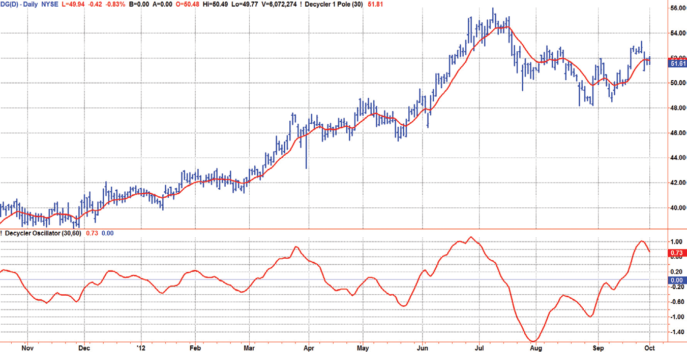
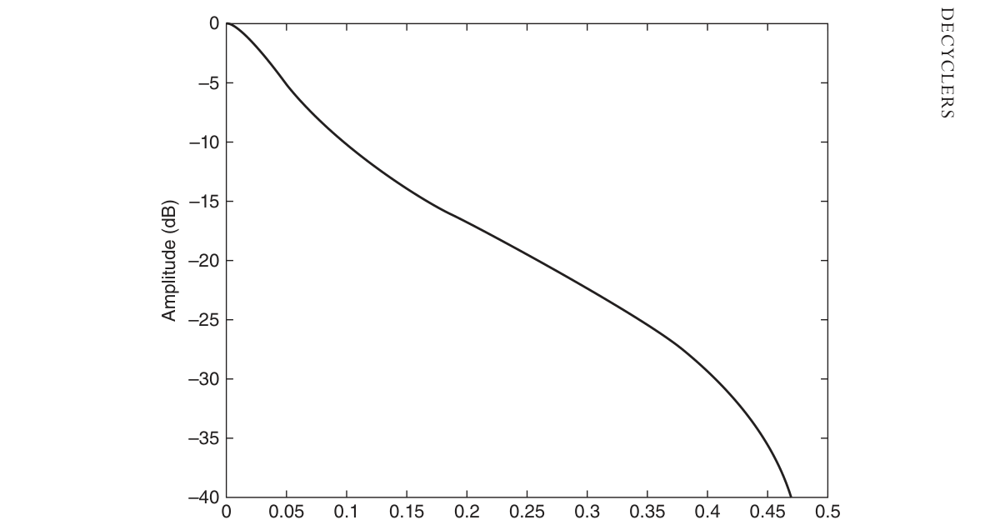
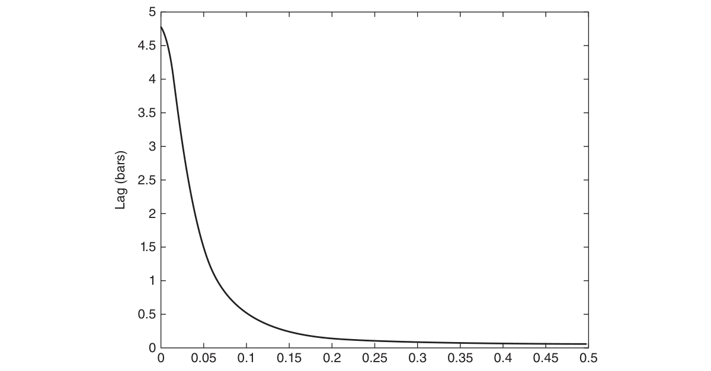
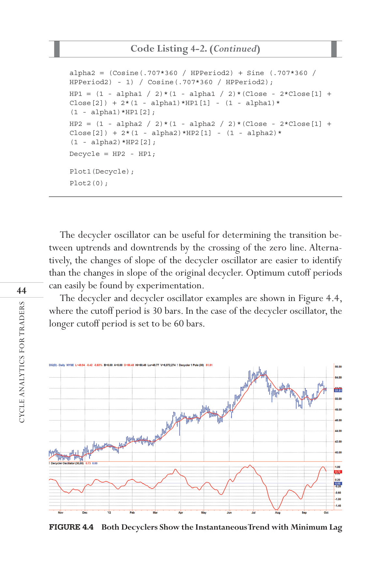

# Chapter 4: Roofing Filter as a Universal Indicator Preprocessor


## BibTeX

```bibtex
@InBook{ehlers2013cycle_ch4,
  author    = {Ehlers, John F.},
  title     = {Cycle Analytics for Traders: Advanced Technical Trading Concepts},
  chapter   = {4},
  chaptertitle = {Roofing Filter as a Universal Indicator Preprocessor},
  publisher = {Wiley},
  year      = {2013},
  series    = {Wiley Trading},
  isbn      = {9781118728604},
}
```

---

Decyclers
“The wiggles have been canceled,” said Tom flatly.
I
f technical analysis techniques include a detrender, then certainly there is
room for its corollary, a decycler. A decycler removes the cycle compo-
nents and retains only the trend components.

## Decycler Construction

The concept of a decycler is really pretty simple. The cyclic components are
removed by the process of cancellation. Figure 4.1 shows the amplitude re-
sponse of a high-pass filter. Note that the amplitude of the filter output is al-
most the same as the filter input amplitude (i.e., 0 dB). Thus, if the high-pass
filter output is subtracted from the input data, the residual only contains the
low-frequency components.
The transfer response of a decycler is written as the difference between
input and the output of a high-pass filter as
$$H(z) = 1 - \frac{(1 - \alpha/2)(1 - z^{-1})}{1 - (1 - \alpha) z^{-1}}$$
By putting the right-hand side of this equation over a common denominator,
we obtain
$$H(z) = \frac{(\alpha/2)(1 + z^{-1})}{1 - (1 - \alpha) z^{-1}}$$
This transfer response equation shows the decycler to be a one-pole
­filter because the denominator contains only a first-order polynomial. By
­examination, the decycler must closely follow the input data because there

is no difference term in the numerator of the transfer response. The Easy-
Language code to compute the decycler is written almost directly from the
transfer response equation in Code Listing 4-1.



*Figure 4.1: Frequency Response of a High-Pass Filter Having a 30-Bar Cutoff Period*

**Code Listing 4-1. EasyLanguage Code to Compute a Decycler**

```easylanguage
{
Decycler
© 2013 John F. Ehlers
}
Inputs:
Cutoff(60);
Vars:
alpha1(0),
HP(0),
Decycle(0);

//Highpass filter cyclic components whose periods are
//shorter than "cutoff" bars
alpha1 = (Cosine(360 / Cutoff) + Sine (360 / Cutoff) - 1) /
Cosine(360 / Cutoff);
Decycle = (alpha1 / 2)*(Close + Close[1]) +
(1- alpha1)*Decycle[1];
Plot1(Decycle);
```


## Decycler Application

The decycler removes the shorter cycle energy by cancellation, leaving the
decycler output to be basically a one-pole low-pass filter. A decycler hav-
ing a 30-bar cutoff period is used as an example. The amplitude response
is shown in Figure 4.2, and the lag is shown in Figure 4.3. The amplitude
response confirms the 6-dB-per-octave attenuation roll-off rate of a single-
pole filter. For example, the response at a frequency of 0.1 bars per cycle is
approximately −10 dB, and the response one octave higher at a frequency of
0.2 bars per cycle is approximately −16 dB.


## Decycler Application

The decycler removes the shorter cycle energy by cancellation, leaving the
decycler output to be basically a one-pole low-pass filter. A decycler hav-
ing a 30-bar cutoff period is used as an example. The amplitude response
is shown in Figure 4.2, and the lag is shown in Figure 4.3. The amplitude
response confirms the 6-dB-per-octave attenuation roll-off rate of a single-
pole filter. For example, the response at a frequency of 0.1 bars per cycle is
approximately −10 dB, and the response one octave higher at a frequency of
0.2 bars per cycle is approximately −16 dB.
//Highpass filter cyclic components whose periods are
shorter than “cutoff” bars
alpha1 = (Cosine(360 / Cutoff) + Sine (360 / Cutoff) - 1) /
Cosine(360 / Cutoff);
Decycle = (alpha1 / 2)*(Close + Close[1]) +
(1- alpha1)*Decycle[1];
Plot1(Decycle);
```easylanguage
```




*Figure 4.2: Amplitude Response of a Decycler Having a 30-Bar Cutoff Period*

The really important characteristic of the decycler is its exceptionally
low lag. The very longest cycle components are delayed less than five bars,
and at a frequency of 0.05 cycles per bar (a 20-bar cycle period), the lag is
on the order of 1.5 bars. Higher-frequency components are delayed even
less. The end result is the higher-frequency wiggles that make it through
the filter attenuation are roughly coincident with the wiggles in the price
itself. This feature makes the decycler an ideal “instantaneous trend line” that
­accurately portrays the trend of the data.
A similar smoothed filter output can be produced using a SuperSmoother
filter. However, when the results of the decycler are compared to those
of the SuperSmoother, the decycler will always have less lag. However, a
decycler is only a one-pole filter and therefore has inferior filtering capa-
bilities. Therefore, a decycler should not be used as a smoothing filter to
remove aliasing noise. Rather, its role should be relegated to producing an
instantaneous trend line where the selected cutoff period is relatively large.
The large cutoff period enables the decycler to attenuate the aliasing noise
because it is many octaves away from the Nyquist frequency.
It is certainly possible to create a decycler by subtracting a two-pole high-
pass filter output from the input data. In fact, such a decycler has some



*Figure 4.3: Lag of a Decycler Having a 30-Bar Cutoff Period*

Decyclers
­interesting properties because the long cycle components have substan-
tial lag, while the short cycle components continue to have minimal lag.
­However, interpretation of the indicator is more difficult because the larger
spread in lag across the spectrum. Therefore, only the single-pole decycler
is recommended for use as instantaneous trend lines.

## Decycler Oscillator

A decycler oscillator is created by subtracting the output of a high-pass
filter having a shorter cutoff period from the output of another high-pass
filter having a longer cutoff period. This way, both elements have a zero in
their transfer responses at zero frequency. Thus, the very, very long cycle
components (and the static term) are removed. There is a finite differ-
ence between the output of the two filters in the frequency range between
their cutoff periods, but shorter cycle components are still removed by
cancellation. As a result, the trend line is displayed as an oscillator. The
EasyLanguage code to compute the decycler oscillator is shown in Code
Listing 4-2.

**Code Listing 4-2. EasyLanguage Code for Decycler Oscillator**

```easylanguage
{
Decycler Oscillator
© 2013 John F. Ehlers
}
Inputs:
HPPeriod1(30),
HPPeriod2(60);
Vars:
alpha1(0),
alpha2(0),
HP1(0),
HP2(0),
Decycle(0);
alpha1 = (Cosine(.707*360 / HPPeriod1) + Sine (.707*360 /
HPPeriod1) - 1) / Cosine(.707*360 / HPPeriod1);
(Continued )

```

The decycler oscillator can be useful for determining the transition be-
tween uptrends and downtrends by the crossing of the zero line. Alterna-
tively, the changes of slope of the decycler oscillator are easier to identify
than the changes in slope of the original decycler. Optimum cutoff periods
can easily be found by experimentation.
The decycler and decycler oscillator examples are shown in Figure 4.4,
where the cutoff period is 30 bars. In the case of the decycler oscillator, the
longer cutoff period is set to be 60 bars.
```easylanguage
alpha2 = (Cosine(.707*360 / HPPeriod2) + Sine (.707*360 /
HPPeriod2) - 1) / Cosine(.707*360 / HPPeriod2);
HP1 = (1 - alpha1 / 2)*(1 - alpha1 / 2)*(Close - 2*Close[1] +
Close[2]) + 2*(1 - alpha1)*HP1[1] - (1 - alpha1)*
(1 - alpha1)*HP1[2];
HP2 = (1 - alpha2 / 2)*(1 - alpha2 / 2)*(Close - 2*Close[1] +
Close[2]) + 2*(1 - alpha2)*HP2[1] - (1 - alpha2)*
(1 - alpha2)*HP2[2];
Decycle = HP2 - HP1;
Plot1(Decycle);
Plot2(0);
```




*Figure 4.4: Both Decyclers Show the Instantaneous Trend with Minimum Lag*

Decyclers

## Key Points to Remember

1.	 A decycler filter functions the same as a low-pass filter.
2.	 A decycler filter is created by subtracting the output of a high-pass filter
from the input, thereby removing the high-frequency components by
cancellation.
3.	 A decycler filter has very low lag.
4.	 A decycler oscillator is created by subtracting the output of a high-pass
filter having a shorter cutoff period from the output of another high-
pass filter having a longer cutoff period.
5.	 A decycler oscillator shows transitions between uptrends and down-
trends at the zero crossings.

