# Chapter 5: Band-Pass Filters


## BibTeX

```bibtex
@InBook{ehlers2013cycle_ch5,
  author    = {Ehlers, John F.},
  title     = {Cycle Analytics for Traders: Advanced Technical Trading Concepts},
  chapter   = {5},
  chaptertitle = {Band-Pass Filters},
  publisher = {Wiley},
  year      = {2013},
  series    = {Wiley Trading},
  isbn      = {9781118728604},
}
```

---

Band-Pass Filters
“A little of the data narrowly passed,” said Tom broadly.
P
erhaps the least appreciated and most underutilized filter in ­technical
analysis is the band-pass filter. The band-pass filter simultaneously
­diminishes the amplitude at low frequencies, qualifying it as a detrender, and
diminishes the amplitude at high frequencies, qualifying it as a data ­smoother.
It passes only those frequency components from input to output in which
the trader is interested. The filtering produced by a band-pass filter is supe-
rior because the rejection in the stop bands is related to its bandwidth. The
degree of rejection of undesired frequency components is called selectivity.
The band-stop filter is the dual of the band-pass filter. It rejects a band
of frequency components as a notch at the output and passes all other fre-
quency components virtually unattenuated. Since the bandwidth of the deep
rejection in the notch is relatively narrow and since the spectrum of market
cycles is relatively broad due to systemic noise, the band-stop filter has little
application in trading.

## Band-Pass Filter

A band-pass filter can be generated by cascading a low-pass filter and a
­high-pass filter. However, this approach results in really poor filtering
­unless a large number of data samples are used to increase the degree of the
­polynomials. However, digital signal processing (DSP) enables us to map the
entire 0 to 0.5 cycles per bar range of a simple high-pass filter into the lower
half-bandwidth of the pass band and to also map the entire 0 to 0.5 cycles
per bar range of an exponential moving average (EMA) low-pass filter into
the upper half-bandwidth of the pass band. When we do this, the transfer

response of a simple pass-band filter is described by Equation 5-1. The band-
pass filter was also described in Table 1.1.

$$H(z) = \frac{1 - \sigma z^{-1}}{(1 - \gamma z^{-1})(1 - \gamma z^{-2})}$$

(5-1)
Where
γ = Cos(360*/Period)
and
δ = bandwith as a fraction of Period
λ = Cos(360/Period)

$$H(z) = \frac{0.5(1 - \sigma)(1 - z^{-2})}{1 - \lambda(1 + \sigma)z^{-1} + \sigma z^{-2}}$$

Since the degree of the polynomial in the denominator of the transfer re-
sponse is two, this is a two-pole band-pass filter. In programming language,
where the delay of N bars is denoted by “[N]”, the equation for a two-pole
band-pass filter becomes

Output = 0.5 * (1 − σ) * (Input − Input[2])
+ λ * (1 + σ) * Output[1] − σ * Output[2]
(5-2)
The frequency response of a two-pole band-pass filter centered at a
10-bar cycle period, and having a pass band that is 30 percent of the center
frequency at the half power points (−3 dB) is shown in Figure 5.1. Note that
this filter has zeros in the transfer response both at zero frequency and at the
Nyquist frequency. The relatively sharp roll-off in the reject bands occurs
because the computational frequencies of the filter have been scaled to the
half-bandwidth of the filter.
Another example of the frequency response of a band-pass filter is shown
in Figure 5.2, where the input data is a chirped frequency sine wave whose
period is continuously swept from a 10-bar cycle period to a 60-bar cycle
period. The theoretical closing prices swing +/− 5 from a central value of
60. In this case, the band-pass filter is tuned to a 20-bar cycle period. In Fig-
ure 5.2, it is clear that signals whose periods are both less than and greater
than a 20-bar cycle are attenuated.
Readers can easily make their own chirped frequency sine wave data
source in Excel. Make the first column be a counter from 1 to 1,000. The
equation for a phase rate of change per sample so the cycle period var-
ies from 10 to 60 as a counter varies from 100 to 1,000 is approximately
Phase = 0.1 − 0.000075 * Counter. Therefore, in cell B1 type “= 60 + 5 *

Sin(6.28318 * (0.1 − 0.000075 * a1))” and then copy cell B1 into cells B2
through B1000. Column B can be the opening price. You can make the data
look a little more realistic by making column C the high price as one greater
than price in column B, making column D as the low price be one lower
than the price in column B, and letting column E be the closing price and

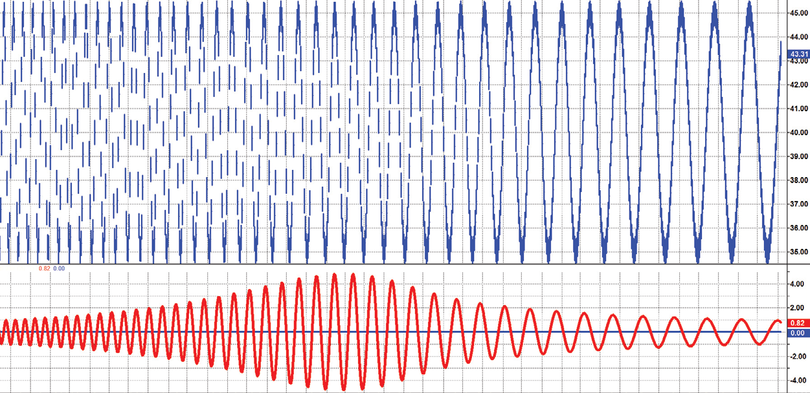

*Figure 5.1: Frequency Response of a Two-Pole Band-Pass Filter Tuned to a*

10-Bar Cycle Period and Having 30 Percent Bandwith

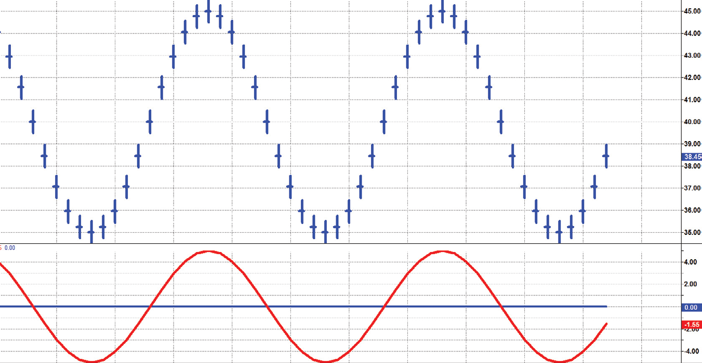

*Figure 5.2: Frequency Response of a Band-Pass Filter Tuned to a 20-Bar*

Cycle Period

have the same value of the price in column B. For those platforms sensitive
to dates in price data, export a real data file having about five years of data
in CSV format to capture the dates. Then, copy columns B, C, D, and E into
the clipboard and then Edit  .  .  . Paste Special  .  .  .  Values into the Open, High,
Low, and Close columns, overwriting the values in those columns with the
chirped sine wave values. Finally, save the data file so you can import it into
your trading platform.
One of the amazing characteristics of a band-pass filter is that if the
center period of the filter is tuned to a static sine wave whose period is
the same as the center period of the filter, then there is absolutely no lag
in the output. Figure 5.3 shows the output of a 20-bar band-pass filter hav-
ing a 30 percent bandwidth compared to the 20-bar input data. However,
if the band-pass filter is tuned to its previous half-power period of 17 bars
per cycle, the 20-bar data cycle is longer than the tuned frequency of the
filter. As a result, the output response has a 65-degree lag, as shown in
Figure 5.4. However, if the band-pass filter is tuned to its other previous
half-power period of 23 bars per cycle, the 20-bar data cycle is shorter
than the tuned frequency of the filter. As a result, the output response has
a 65-degree lead, as shown in Figure 5.5. The phase shift across the band-
width of the band-pass filter is unavoidable. The phase shift is doubled each
time the number of poles is doubled in the transfer response. Therefore, it
is important to use the simplest filter possible in trading to minimize phase
shift distortion.

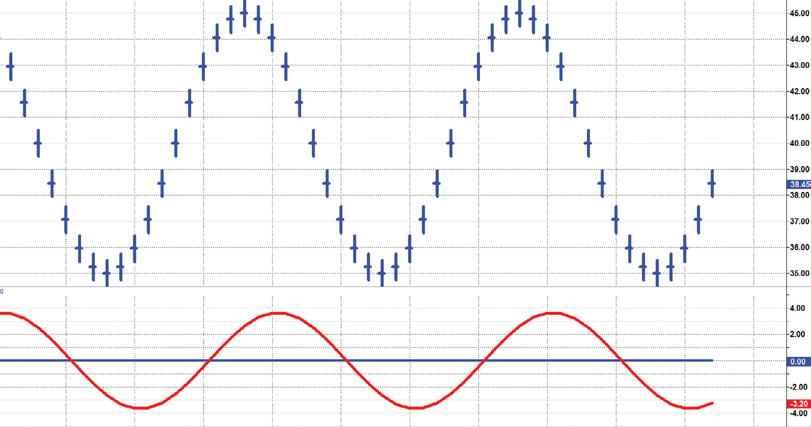

*Figure 5.3: A Band-Pass Filter Precisely Tuned Has No Lag*


## Band-Pass Filter Q

The quality factor, or Q, of a band-pass filter is one of its important
­characteristics. There are several interrelated definitions of Q. Perhaps the
simplest is based on selectivity of the filter as the ratio of its center ­frequency
to its percentage bandwidth at the half-power points. In our example of
a 30 percent bandwidth filter, the Q would be 3.33. Stated another way,
Q = 20 / (23 − 17) = 20 / 6 = 3.33.

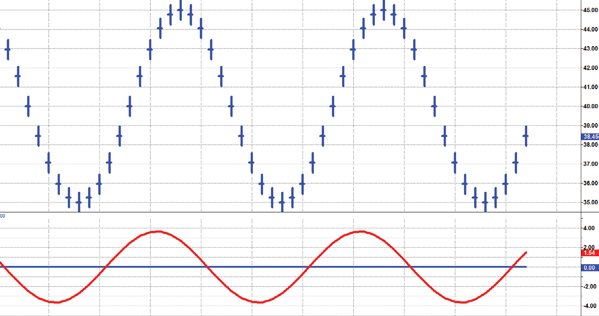

*Figure 5.4: 65-Degree Lag Results from the Band-Pass Filter’s Being Tuned*

15 Percent Too Long

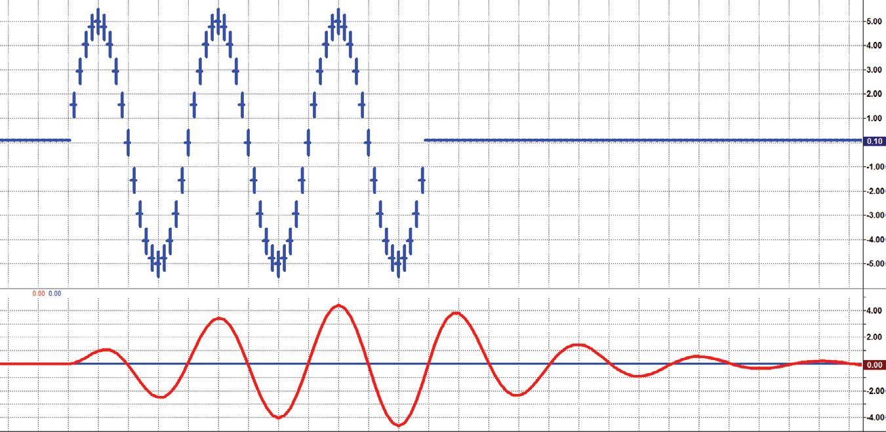

*Figure 5.5: 65-Degree Lead Results from the Band-Pass Filter’s Being*

Tuned 15 Percent Too Short

However, Q can also be defined in terms of energy quantities. From the
relationships in resonant electronic circuits the definition becomes

Q = 2π*(Energy Stored) / (Energy Dissipated per Cycle)
(5-3)
For example, a band-pass filter having a Q = 3.33 would have the energy
stored in the filter but only about half the energy dissipated per cycle. Such
a filter would have its ringing quickly quenched. Such a filter would also
quickly adapt to new and different cycle components at its input. However,
a high-Q filter would ring out a long time in response to an impulse input. A
bell is an example of such a high-Q filter. High-Q filters have high selectivity
in the frequency domain, but their ringing obscures the cyclic information
in the data input. Therefore, the Q of band-pass filters used in trading should
be as low as possible and still obtain the desired filtering.

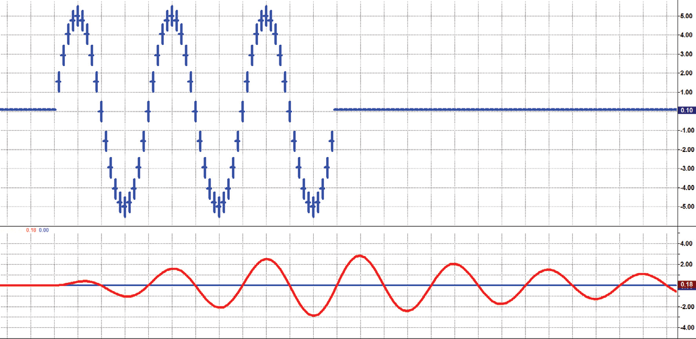

*Figure 5.6: shows the input data as three complete cycles of a sine wave*

having a 20-bar cycle period. The subgraph shows the output response of a
band-pass filter tuned to a 20-bar period and having a Q = 3.33. The out-
put swing exceeds the half-power amplitude within one full cycle period
after the data are applied to the input. Further, the output swing is damped
below the half-power amplitude within a half cycle after the data input is
removed. However, a relatively high Q filter will be slow to rise in response
to new data and will continue to ring after the data is removed, as shown in
­Figure 5.7.

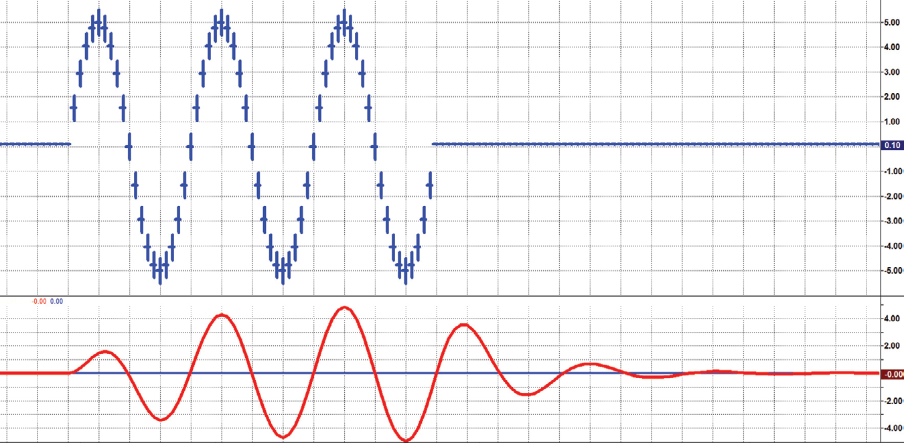

*Figure 5.6: Transient Response of a Band-Pass Filter Having a Q = 3.33*


Band-pass filters can be more responsive in the time domain by having a
lower Q (wider percentage bandwidth). For example, Figure 5.8 shows the
response of a band-pass filter having a Q = 2. This filter quickly responds to
new data and just as quickly has the output fall off after the input data are
removed.
Using a band-pass filter having a 30 percent pass band is a relatively good
compromise between selectivity and transient responsiveness for most trad-
ing applications.

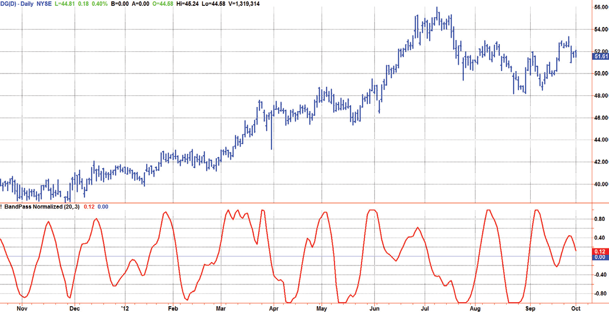

*Figure 5.7: Transient Response of a Band-Pass Filter Having a Q = 10*


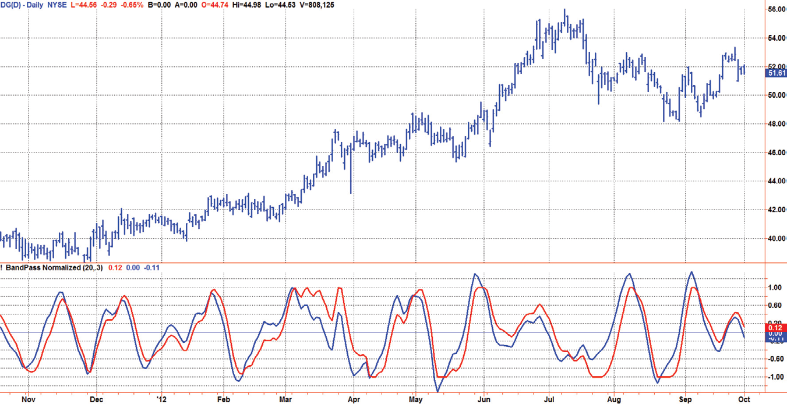

*Figure 5.8: Transient Response of a Band-Pass Filter Having a Q = 2*


## Automatic Gain Control (AGC)

A band-pass filter described by Equations 5-1 and 5-2 will accurately ­display
the amplitude of the cyclic swings in the input data. Consequently, the am-
plitude of these swings will vary among stock ticker signals because the
­prices range from penny stocks to well over $100 per share. A penny stock
just cannot have as large a swing as a blue-chip stock because the basis is
much smaller. Traders are used to indicators being normalized to a range
like 0 to 100 so that the indicator scales the same regardless of the price am-
plitude swings. The purpose of the AGC is to provide a consistent indicator
appearance independently from the range of the price swings. The process
of the AGC divides the current price by the absolute value of the recent
maximum swing so that the normalized waveform has a maximum of 1 or
a minimum of −1. I have never seen the AGC concept applied to technical
indicators, which is a shame because it can be applied universally.
The specific kind of AGC is called a fast attack−slow decay AGC. The nor-
malizing factor is allowed to decay a small amount before being compared
to the next sample of the signal so the normalizing is not done on the largest
swing throughout history. If the next sample of the signal is larger than the
normalizing factor, then the normalizing factor is immediately assigned the
value of the next sample. However, if the next sample of the signal is smaller
than the normalizing factor, then the normalizing factor is allowed to decay
another small amount and then is compared to the third sample, and so on.
The amount of decay is exponential if the normalizing factor is not reset. If
the decay factor is K for the first sample, then it is K * K = K2 for the next
sample, and is K * K * K = K3 for the third sample, and so on.

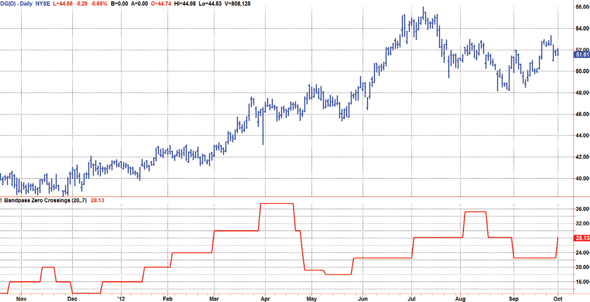

*Figure 5.9: depicts the AGC action, where the absolute value of the sine*

wave signal is shown by the solid line. The normalizing factor, shown by
the dashed line, decays exponentially with each sample. When the signal
exceeds the normalizing factor, the normalizing factor is assigned the new
value of the signal so that when the input signal is divided by the normalizing
factor the AGC algorithm output normalized the input value to be 1. The
process is repeated for each new sample of data.
When changes are made in the time domain, there are always implica-
tions made in the frequency domain. Considering theoretical sine wave sig-
nals, the effective gain of the AGC is the decay factor to the exponent of the
half period of the sine wave as

Gain = K(Period / 2)

About the shortest cycle period useful for trading is a 10-bar cycle, and
cycle periods longer than 48 bars can often be considered trends. Therefore,
we are concerned with the gain slope over the range from a 10-bar period to
a 48-bar period. The gain ratio over this range can be expressed as

$$\text{Ratio} = \frac{K^{24}}{K^5} = K^{(24-5)} = K^{19}$$

Since we must accept some gain slope across the cycle periods of interest,
an arbitrary but reasonable selection is 1.5 dB. The numerical value of the
ratio is computed as:
−1.5 = 20 * Log10(Ratio)
10(−1.520) = 10−0.75 = Ratio
Ratio = 0.841
Knowing the desired gain ratio across the band, we can compute the de-
cay factor as:
K19 = 0.841
K = 0.841(1/19)
K = 0.991
I will use this value for the AGC decay factor throughout the remainder of
the book unless the AGC is used for amplitude compensation as a function
of the cycle period.

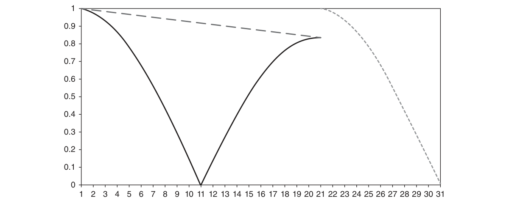

*Figure 5.9: The AGC Normalizing Factor Decays Exponentially and Is*
Rapidly Reset to the Absolute Value of the Cyclic Swing


## Spectral Dilation Removal

The effect of Spectral Dilation will be fully described in Chapter 7. In a
nutshell, the amplitude of the market data spectrum is not flat, and traders
must be sensitive to that fact when employing filters.
The band-pass filter attenuation increases 6 dB per octave of the half
bandwidth, starting at the upper and lower cutoff frequencies. This relatively
low rate of attenuation is insufficient to remove the effects of Spectral Dila-
tion on the long cycle period side of the filter. Therefore, a high-pass filter
should be connected in series with the band-pass filter to ensure that the
Spectral Dilation distortions are not allowed to reach the output.
The critical frequency of the high-pass filter is set to be one octave below
the lower edge of the band-pass filter to minimize the interaction of the two
filters within the pass band. Since the lower edge of the band-pass filter is
at 0.5 * Bandwidth relative to the center frequency of the filter, the critical
frequency of the high-pass filter is set to be 0.25 * Bandwidth relative to the
center frequency of the band-pass filter. That makes the high-pass critical
frequency a full octave of the half-bandwidth below the center frequency.

## Band-Pass Filter

The EasyLanguage code to implement the band-pass filter is given in Code
Listing 5-1. After declaring variables, the band-pass filter calculation is pre-
ceded by a high-pass filter whose cutoff frequency is one half-bandwidth oc-
tave below the lower-frequency critical frequency of the band-pass filter to
avoid interference with the action of the band-pass filter while still removing
the effects of Spectral Dilation.

**Code Listing 5-1. EasyLanguage Code for the Band-Pass Indicator**

```easylanguage
{
BandPass Filter
© 2013 John F. Ehlers
}
Inputs:
Period(20),
Bandwidth(.3);

Vars:
alpha2(0),
HP(0),
gamma1(0),
alpha1(0),
beta1(0),
BP(0),
Peak(0),
Signal(0),
Trigger(0);
alpha2 = (Cosine(.25*Bandwidth*360 / Period) + Sine
(.25*Bandwidth*360 / Period) - 1) / Cosine(.25*Bandwidth*360 /
Period);
HP = (1 + alpha2 / 2)*(Close - Close[1]) + (1- alpha2)*HP[1];
beta1 = Cosine(360 / Period);
gamma1 = 1 / Cosine(360*Bandwidth / Period);
alpha1 = gamma1 - SquareRoot(gamma1*gamma1 - 1);
BP = .5*(1 - alpha1)*(HP - HP[2]) + beta1*(1 + alpha1)*BP[1] -
alpha1*BP[2];
If Currentbar = 1 or CurrentBar = 2 Then BP = 0;
Peak = .991*Peak[1];
If AbsValue(BP) > Peak Then Peak = AbsValue(BP);
If Peak <> 0 Then Signal = BP / Peak;
Plot1(Signal);
Plot2(0);
alpha2 = (Cosine(1.5*Bandwidth*360 / Period) + Sine
(1.5*Bandwidth*360 / Period) - 1) / Cosine(1.5*Bandwidth*360 /
Period);
Trigger = (1 + alpha2 / 2)*(Signal - Signal[1]) +
(1- alpha2)*Trigger[1];
Plot6(Trigger);
```

An example of the indicator plotted over roughly a year on daily data
of Dollar General (symbol DG) is shown in Figure 5.10. Note the band-
pass filter correctly identifies the peaks and valleys in the data. However,
the band-pass filter is dead wrong when the prices go into a trend as in

March 2012 and June and July 2012. As a discretionary indicator, one can
say the band-pass filter is working well when the filter output looks similar
to a sine wave. However, watch out when the filter output contains erratic
signals.
An interesting addition to the band-pass filter is the second high-pass
filter serially connected to the output of the band-pass filter. In this case,
the high-pass filter is tuned to the high-frequency side critical frequency of
the band-pass filter. Doing this creates a leading waveform resembling the
band-pass filter output, but still has a phase lead characteristic. If a leading
waveform is attempted by taking the rate change of the band-pass filter out-
put, the resulting waveform would be too erratic to be of use as a trading
indicator. As seen in Figure 5.11, the leading trigger crosses the band-pass
filter output at the exact peaks and valleys of the waveform except when the
data are trending.

## Measuring the Cycle Period

Figure 5.10 shows the cycle content of the data swinging pretty much as
a variable amplitude sine wave with variable periodicity. The band-pass fil-
ter can be used as a relatively simple measurement of the dominant cycle.
A cycle is complete when the waveform crosses zero two times from the
last zero crossing. Therefore, each successive zero crossing of the indicator
Figure 5.10  Band-Pass Indicator for DG Pinpoints Peaks and Valleys

marks a half cycle period. We can establish the dominant cycle period as
twice the spacing between successive zero crossings.
When we measure the dominant cycle period this way, it is best to widen
the pass band of the band-pass filter to avoid distorting the measurement
simply due to the selectivity of the filter. Using an input bandwidth of 0.7
produces an octave-wide pass band. For example, if the center period of
the filter is 20 and the relative bandwidth is 0.7, the bandwidth is 14. That
means the pass band of the filter extends from 13-bar periods to 27-bar
periods. That is, roughly an octave exists because the longest period is
twice the shortest period of the pass band. It is imperative that a high-pass
filter is tuned one octave below the half-bandwidth edge of the band-pass
filter to ensure a nominal zero mean of the filtered output. Without a zero
mean, the zero crossings can have a substantial error. The code to measure
the dominant cycle using the band-pass filter is given in Code Listing 5-2.
Since the measurement can vary dramatically from zero crossing to zero
crossing, the code limits the change between measurements to be no more
than 25 ­percent. An example of the dominant cycle period measurement is
shown in Figure 5.12.
While measuring the changing dominant cycle period via zero crossings
of the band-pass waveform is easy, it is not necessarily the most accurate
method. More accurate techniques examining the entire spectral content of
the data are presented in later chapters of this book.
Figure 5.11  The Leading Trigger Waveform Clearly Flags Peaks and Valleys
of the Band-Pass Indicator in Real Time


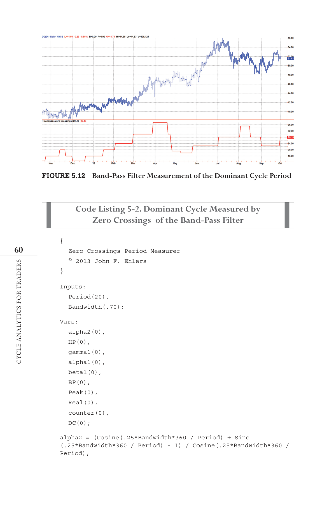

*Figure 5.12: Band-Pass Filter Measurement of the Dominant Cycle Period*
{
Zero Crossings Period Measurer
© 2013 John F. Ehlers
}
Inputs:
Period(20),
Bandwidth(.70);
Vars:
alpha2(0),
HP(0),
gamma1(0),
alpha1(0),
beta1(0),
BP(0),
Peak(0),
Real(0),
counter(0),
DC(0);
alpha2 = (Cosine(.25*Bandwidth*360 / Period) + Sine
(.25*Bandwidth*360 / Period) - 1) / Cosine(.25*Bandwidth*360 /
Period);

**Code Listing 5-2. Dominant Cycle Measured by Zero Crossings  of the Band-Pass Filter**

```easylanguage

HP = (1 + alpha2 / 2)*(Close - Close[1]) + (1- alpha2)*HP[1];
beta1 = Cosine(360 / Period);
gamma1 = 1 / Cosine(360*Bandwidth / Period);
alpha1 = gamma1 - SquareRoot(gamma1*gamma1 - 1);
BP = .5*(1 - alpha1)*(HP - HP[2]) + beta1*(1 + alpha1)*BP[1] -
alpha1*BP[2];
If Currentbar = 1 or CurrentBar = 2 Then BP = 0;
Peak = .991*Peak;
If AbsValue(BP) > Peak Then Peak = AbsValue(BP);
If Peak <> 0 Then Real = BP / Peak;
DC = DC[1];
If DC < 6 Then DC = 6;
counter = counter + 1;
If Real Crosses Over 0 or Real Crosses Under 0 Then Begin
DC = 2*counter;
If 2*counter > 1.25*DC[1] Then DC = 1.25*DC[1];
If 2*counter < .8*DC[1] Then DC = .8*DC[1];
counter = 0;
End;
Plot1(DC);
```


## Key Points to Remember

1.	 A band-pass filter is both a detrender and a smoother combined into one
filter.
2.	 Attenuation of out-of-band frequency components is superior to that of
high-pass filters and low-pass filters because the rejection is scaled to the
bandwidth of the filter.
3.	 A band-pass filter tuned precisely to a consistent dominant cycle has no
lag.
4.	 A band-pass filter tuned to a period shorter than the dominant cycle
produces an output that leads the swing in the input data.
5.	 A band-pass filter tuned to a period longer than the dominant cycle
produces an output that lags the swing in the input data.
6.	 The selectivity and the transient response of a band-pass filter are inter-
related. A narrow pass-band filter is slower to react to changes in the

input data. A wider pass-band filter adapts more quickly to changes in
the input data.
7.	 A serially connected single-pole high-pass filter tuned one octave below
the low-frequency critical frequency of the band-pass filter is necessary
to eliminate the effects of Spectral Dilation and to create an output hav-
ing a nominally zero mean.
8.	 A leading function can be created by serially connecting a single-pole
high-pass filter tuned to the high-frequency critical period of the band-
pass filter.
9.	 The dominant cycle period of the data can be estimated by counting the
number of bars between zero crossings of the band-pass filter output.

