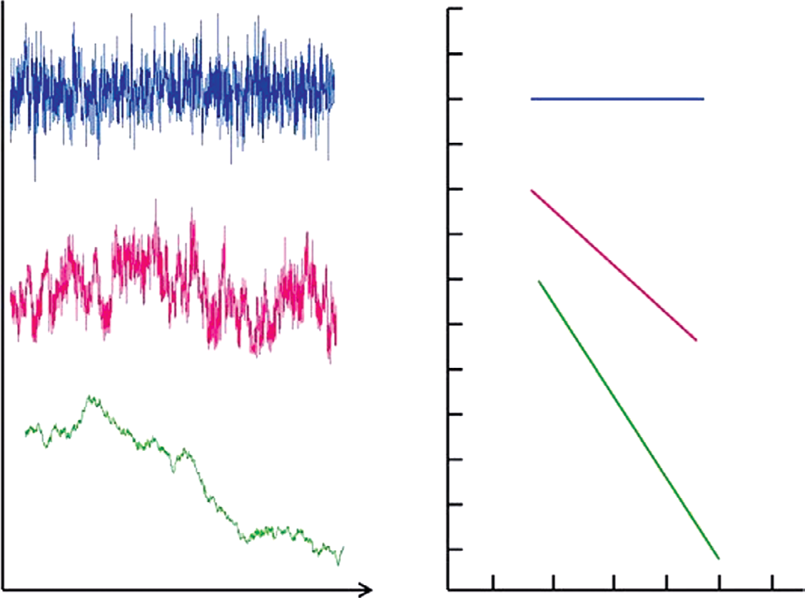
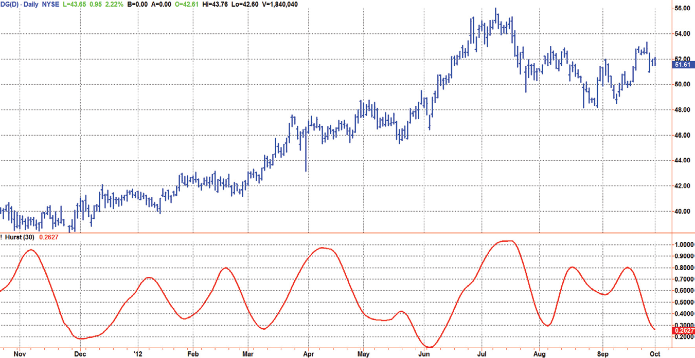
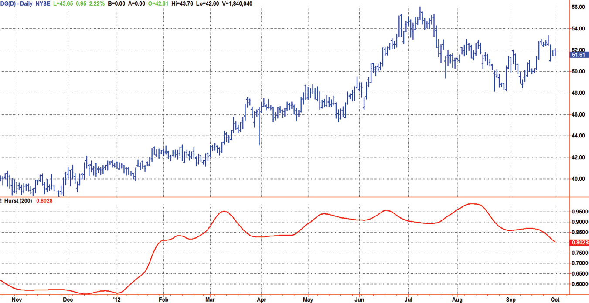
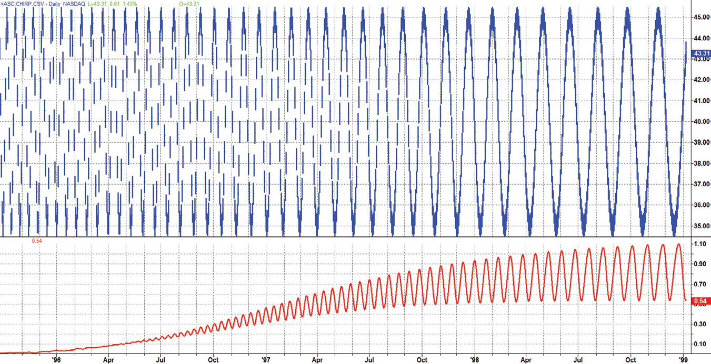

# Chapter 6: Hurst Coefficient


## BibTeX

```bibtex
@InBook{ehlers2013cycle_ch6,
  author    = {Ehlers, John F.},
  title     = {Cycle Analytics for Traders: Advanced Technical Trading Concepts},
  chapter   = {6},
  chaptertitle = {Hurst Coefficient},
  publisher = {Wiley},
  year      = {2013},
  series    = {Wiley Trading},
  isbn      = {9781118728604},
}
```

---

Market Structure
and the Hurst
Coefficient
“The market has a definite structure,” said Tom randomly.
I
t is well understood that white noise has no correlation in time, and ran-
dom walk (Brownian motion) noise has no correlation between incre-
ments. Brownian walks can be generated from a function where the spectral
density is proportional to 1/F α, where F is frequency, α is a power law, and
α = 1 generally signifies “long memory,” as I will describe in Chapter 8.
Thus, 1/F noise is synonymous with long-range dependence. Integration of
noise increases the exponent α by 2, whereas the inverse operation of dif-
ferentiation decreases it by 2. Therefore, 1/F α noise cannot be obtained by
the simple procedure of integration or of differentiation of such convenient
signals. The widespread occurrence of signals exhibiting such behavior sug-
gests that a generic mathematical explanation might exist. The ubiquity of
1/F α noise is one of the oldest puzzles of contemporary physics and science
in general.



*Figure 6.1: displays some time series and, in the same colors, their associ-*

ated power spectra. Such time series arise in many natural systems. Power
spectra are plotted in log-log coordinates, as is customary, because
log(S(F)) = log(constant/F α)
= αlog(F) + log(constant)

In other words, the logarithmic transform renders the 1/F α power spec-
trum a straight line whose slope, −α, can be easily estimated. Clearly, for
such natural systems, observed by humans, neither arbitrarily small nor ar-
bitrarily large frequencies can be recorded. These models are simply rel-
evant to physically plausible situations.
Noise in economic data is usually studied as long-range dependence
or long memory. It has been shown repeatedly that the autocorrelation
functions of economic time series, such as series of stock prices over
days, weeks, or months, or the gross national product of various coun-
tries over years, do not decay exponentially as they would if the process
generating the series were a simple autoregressive process. Instead, the
autocorrelation functions of many economic time series reach a nonzero
asymptote and remain there for the entire series, albeit often at a low
value, indicating that economic events some distance in the past continue
to have an influence on current prices. You only need to do an Internet
search on “stock market spectral density” to find a number of academic
papers, both measured and theoretical, regarding the frequency content
of the market.
The Hurst coefficient is one way to attempt to get a handle on the slope
of the power density of market data. The Hurst coefficient varies between



*Figure 6.1: Time Series and Spectral Densities for Several Kinds of Noise*

Market Structure and the Hurst Coefficient
0 and 1, and is related to the α power coefficient as H = 1 − α/2. The
Hurst coefficient is more estimated than computed. I find the estimate
using the fractal dimension is the most practical for shorter-term market
data. The Hurst coefficient is related to the fractal dimension as H = 2 − D.
I would like to make it perfectly clear that the Hurst coefficient or the
fractal dimension has no direct practical application to trading not only
because it is an estimate, but also because it has no predictive value. These
computations only reflect the general structure of the market, and the
answer you get is dependent on your assumptions. For example, the Hurst
coefficient changes dramatically with the length of data used in making
the estimate.

## Fractal Dimension

To determine the fractal dimension of a generalized pattern, we cover
the pattern with a number “N” of small objects of several various sizes “S.”
The relationship of the number of objects in two sets of sizes is:

$$\frac{N_2}{N_1} = \left(\frac{S_1}{S_2}\right)^D$$

$$D = \frac{\log(N_2 / N_1)}{\log(S_1 / S_2)}$$

As an example, we can start with a pattern that is a line segment 10 meters
long. We chose the two small dimensions as S1 = 1 meter and S2 = 0.1 meter.
Placing boxes along the line we can fit ten 1-meter boxes on the segment,
therefore N1 = 10. Similarly, we can fit one hundred 0.1-meter boxes on the
same 10-meter line segment. Therefore, N2 = 100. The fractal dimension of
the line then computes to:

$$D = \frac{\log(100/10)}{\log(1/0.1)} = 1.0$$

As a second example, we will use the pattern as a square that is 10 meters
on a side instead of a line segment. Retaining the same sizes of our small
boxes as 1 meter and 0.1 meter on a side, respectively, we get N1 = 100

and N2 = 10,000. When the square is our pattern, the fractal dimension
therefore computes to be:

$$D = \frac{\log(10000/100)}{\log(1/0.1)} = 2.0$$

A perfect square represents an idealized geometry not found in nature.
Natural fractals, such as that of a seashore, lack the true regularity of an al-
gorithmic structure but are self-similar in a statistical sense. Thus, in order
to determine the fractal dimension of natural shapes, we must average the
measured fractal dimension made over different scales.
We could measure the fractal dimension of prices by covering the curve
with a series of small boxes. This is a burdensome task, but if we take into
account that the price samples are uniformly spaced, we note that the box
count is approximately the average slope of the curve. Therefore, we can
estimate the box count as the highest price during an interval minus the
lowest price during that interval, divided by the length of the interval itself.
The equation for the number of boxes is then:

$$N = \frac{\text{HighestPrice} - \text{LowestPrice}}{\text{Length}}$$

We compute the fractal dimension by computing N over two equal in-
tervals to get the averaging over each interval. Interval 1 covers the period
from 0 to T bars ago. Interval 2 covers the period from T to 2T bars ago.
Therefore, N1 = (Highest Price − Lowest Price) over the interval from 0 to T,
divided by T. Similarly, N2 = (Highest Price − Lowest Price) over the interval
from T to 2T, divided by T. We also define an N3 = (Highest Price − Lowest
Price) over the entire interval from 0 to 2T, divided by 2T. Since we are look-
ing backwards in time, the slope computation of the fractal dimension is:

$$D = \frac{\log(N_1 + N_2) - \log(N_3)}{\log(2)}$$

The fractal dimension varies over the range from D = 1 to D = 2. Since
the Hurst coefficient is related to the fractal dimension as H = 2 − D, so that
it varies between 0 and 1. A value of 0.5 indicates a true random walk (a
Brownian time series). In a random walk there is no correlation between
any element and a future element. A coefficient between 0.5 and 1 indicates
“persistent behavior,” that is, a long-term dependence. A Hurst coefficient

Market Structure and the Hurst Coefficient
between 0 and 0.5 exists with time series with “antipersistent behavior”—
in other words, “a countertrender” (a term that I detest).

## Computing the Hurst Coefficient

The EasyLanguage code to compute the Hurst coefficient is given in Code
Listing 6-1. The only user input is the length of data to be used. The number
can be arbitrarily large if you have sufficient data. The results are critically
dependent on the input data length selected. After declaring variables, the
coefficients of a 20-bar SuperSmoother filter are computed. The computa-
tions of N1, N2, and N3 are as described in the previous section. The fractal
dimension is then converted to the Hurst coefficient, which is subsequently
smoothed in the SuperSmoother filter.
(Continued )
{
© 2013 John F. Ehlers
}
Inputs:
Length(30);  {Length must be an even number}
Vars:
a1(0),
b1(0),
c1(0),
c2(0),
c3(0),
count(0),
N1(0),
N2(0),
N3(0),
HH(0),
LL(0),
Dimen(0),
Hurst(0),
SmoothHurst(0);

**Code Listing 6-1. EasyLanguage Code to Compute the Hurst Coefficient**

```easylanguage

//Smooth with a Super Smoother Filter from equation 3-3
a1 = expvalue(-1.414*3.14159 / 20);
b1 = 2*a1*Cosine(1.414*180 / 20);
c2 = b1;
c3 = -a1*a1;
c1 = 1 - c2 - c3;
N3 = (Highest(Close, Length) - Lowest(Close, Length)) /
Length;
HH = Close;
LL = Close;
For count = 0 to Length / 2 - 1 begin
If Close[count] > HH then HH = Close[count];
If Close[count] < LL then LL = Close[count];
End;
N1 = (HH - LL) / (Length / 2);
HH = Close[Length / 2];
LL = Close[Length / 2];
For count = Length / 2 to Length - 1 begin
If Close[count] > HH then HH = Close[count];
If Close[count] < LL then LL = Close[count];
End;
N2 = (HH - LL)/(Length / 2);
If N1 > 0 and  N2 > 0 and N3 > 0 then Dimen = .5*((Log(N1
+ N2) - Log(N3)) / Log(2) + Dimen[1]);
Hurst = 2 - Dimen;
SmoothHurst = c1*(Hurst + Hurst[1]) / 2 + c2*SmoothHurst[1]
+ c3*SmoothHurst[2];
Plot1(SmoothHurst);
```


## The Hurst Coefficient in Action

The fractal dimension indicator is applied to approximately one year of data
of Dollar General (symbol DG) in Figure 6.2 using an input length of 30.
With this setting, the Hurst coefficient swings between showing persistence
and antipersistence. However, when the input length is increased to 200, as
shown in Figure 6.3, the uptrend is reflected as the Hurst coefficient rising
to be above 0.5.

Market Structure and the Hurst Coefficient
It is perhaps instructive to describe action of the Hurst coefficient from
another theoretical perspective. In Figure 6.4, the indicator is applied to a
theoretical sine wave whose period is continuously increasing from left to
right from a period of 10 bars to 40 bars. A period of 20 bars is approxi-
mately in the horizontal center of the chart. In this case, I have given the
Hurst coefficient indicator an input of 20. The periodicity in the persistent
case is due to the peaks and valleys of the time waveform tending to “fill the



*Figure 6.2: Using an Input Length of 30, the Hurst Coefficient Swings*

between Showing Persistence and Antipersistence



*Figure 6.3: The Longer-Term Trend is Indicated by a Hurst Coefficient*

Greater than 0.5 When an Input Length of 200 Is Used

boxes” of the fractal dimension. From this perspective, the Hurst coefficient
can be used to define trend modes (> 0.5) and cycle modes (< 0.5) in the
market relative to the selected input length.

## Drunkard’s Walk Hypothesis for

Market Structure
The efficient markets model statement that the price fully reflects available
information has been assumed to imply that successive price changes are in-
dependent of each other. In addition, it has usually been assumed that suc-
cessive changes are identically distributed. Together, these two hypotheses
constitute the random walk model. This model says that the conditional and
marginal probability distributions of an independent random variable are
identical. In addition, it says that the probability density function must be the
same for all time. This model is clearly flawed. If the mean return is constant
over time then the return is independent of any information available at a
given time.
I assume that there are an adequate number of traders involved in making
the market that a statistical analysis involving a random walk is appropriate.
There must be several constraints to such a random walk. The first constraint
is that the prices are constrained to one dimension—they can only go up or
down. The second constraint is that time must progress monotonically.
Figure 6.4  Cycle Periods Shorter than the Hurst Coefficient Input
Parameter Display as Antipersistent; Longer Cycle Periods Display as
Persistent

Market Structure and the Hurst Coefficient
I propose a philosophical basis of market action from extensive work using
constrained random walks in the physical sciences.1  The expression of such a
random walk is that of a drunkard moving on a one-dimensional array of reg-
ularly spaced points. At regular intervals the drunkard flips a coin and makes
one step to the right or left, depending on the outcome of the coin toss. At
the end of n steps, he can be at any one of 2n + 1 sites, and the probability
that he is at any site can be calculated. Let the distance between the points
on the lattice be Δ L, and let the time between successive steps be ΔT. If Δ L
and ΔT are allowed to shrink to zero in such a way that (Δ L)2 / ΔT remains
constant to the diffusion constant D, then the equation governing the distri-
bution of the displacement of the random walker from his starting point is

$$\frac{\partial P}{\partial t} = D \frac{\partial^2 P}{\partial x^2}$$

This rather famous partial differential equation is called the diffusion equa-
tion. The function P(x,t) can be interpreted in two ways. It can be taken
to express either the probability density or the concentration of diffusing
matter at position x at time t. Following the latter interpretation, it can, for
example, describe the way heat flows up the stem of a silver spoon when
placed in a hot cup of coffee.
To better understand the theory of diffusion, imagine the way a smoke
plume leaves a smokestack. Think about how the smoke rises as comparable
to how a trend carries itself through the market. A gentle breeze determines
the angle to which the smoke, or trend, is bent. The widening of the smoke
plume represents the probability density of the smoke particles as a function
of distance from the smokestack. This widening is analogous to the decreased
accuracy of the prediction of future trend prices further into the future.
The formulation of the drunkard’s walk has no property that can be re-
garded as the analog of momentum. A more realistic model of the motion
of a physical object needs to take into account some form of memory—we
need to know where the object came from and the likelihood that it will
continue to move in the same direction. The simplest modification of the
random walk is to allow the coin toss to determine the persistence of mo-
tion. In other words, with probability p the drunkard makes his next step
in the same direction as the last one, and with probability 1 − p he makes a
move in the opposite direction. The ordinary drunkard’s walk occurs when
p = 1/2 because either move is equally likely. The interesting feature of the
modified drunkard’s walk is that as the distance between the point and the

time between steps decreases, one no longer obtains the diffusion equation,
but rather the following equation:

$$\frac{\partial^2 P}{\partial t^2} + \frac{1}{T}\frac{\partial P}{\partial t} = c^2 \frac{\partial^2 P}{\partial x^2}$$

in one dimension, where T and c2 are constants. This is another famous
partial differential equation called the telegrapher’s equation. This equation
­expresses the idea that diffusion occurs in restricted regions, such that
x2 < c2t2. That is, the position must be less than the velocity of propaga-
tion (c) multiplied by time (t). More important, the telegrapher’s equation
describes the harmonic motion of P(x, t) just as surely as it describes the
electric wave traveling down a pair of wires.
Harmonic motion is ubiquitous. It is the natural response to a disturbance
on any scale ranging from the atomic to the galactic. You can demonstrate
the effect to yourself by holding a ruler over the edge of a table, bending the
ruler down, and then releasing it. The resulting vibration is harmonic mo-
tion. Alternatively, you can stretch a rubber band between your fingers, pull
the band to one side, and then release it. The oscillations of the rubber band
also constitute harmonic motion. Since there are plenty of opportunities for
market disturbances, it is only a small stretch to extend the solution to the
drunkard’s walk problem from physical phenomena and use it to describe
the action of the market.
The drunkard’s walk solution can describe two market conditions. The
first condition, where the probability is evenly divided between stepping
to the right or the left, results in the trend mode, described by the diffusion
equation. The second condition, where the probability of motion direction
is skewed, results in the cycle mode, described by the telegrapher’s equation.
The difference between the two conditions can be as simple as the question
that the majority of traders are constantly asking themselves. If the ques-
tion is “I wonder if the market will go up or down?,” then the probability of
market movement is about 50−50, establishing the conditions for a trend
mode. However, if the question is posed as “Will the trend continue?,” then
the conditions are such that the telegrapher’s equation applies. As a result,
the cycle mode of the market can be established.
The telegrapher’s equation solution also describes the meandering of a
river. Viewed as an aerial photograph, every river in the world meanders.
This meandering is not due to a lack of homogeneity in the soil, but to the
conservation of energy. (You can appreciate that soil homogeneity is not

Market Structure and the Hurst Coefficient
a factor because other streams, such as ocean currents, also meander in a
nearly homogeneous medium.) Ocean currents are not nearly as visible as
rivers and are therefore not as familiar to most of us. Every meander in a
river is independent of other meanders, and thus all are completely random.
If we were to look at all the meanders as an ensemble, overlaying one on top
of the other like a multiple-exposure photograph, the meander randomness
would also become apparent. The composite envelope of the river paths
would be about the same as the cross-section of the smoke plume. However,
if we are in a given meander, we are virtually certain of the general path of
the river for a short distance downstream. The result is that the river can be
described as having a short-term coherency but is random over the longer
span.
River meanders are the kind of cycles we have in the market. We can
measure and use these short-term cycles to our advantage if we realize they
can come and go in the longer term.
We can extend our analogy to understand when short-term cycles oc-
cur. Rivers meander in an attempt to maintain a constant slope on their way
to the ocean. If the slope is too severe, the meanders have the same effect
as a skier who weaves back and forth across the slope to slow his descent.
The flow of a river physically adjusts itself for the purpose of energy con-
servation. If the water speeds up, the width of the river decreases to yield
a constant flow volume. The faster flow contains more kinetic energy, and
the river attempts to slow it down by changing direction. At the same time,
the river direction cannot change abruptly because of the momentum of the
flow of water. Meandering results. Thus, meanders cause the river to take
the path of least resistance in the sense of energy conservation. We should
think of markets the same way. Time must progress as surely as the river
must flow to the ocean. Overbought and oversold conditions result from an
attempt to conserve the “energy” of the market. This “energy” arises from
the fear and greed of traders.
Again, it may be useful to test the principle of conservation of energy
for yourself. Tear a strip about 1 inch wide along the side of a standard
sheet of paper about 11 inches long. Grasp each end of this strip between
the thumb and forefinger of each hand. Now move your hands toward each
other. Your compression is putting energy into this strip, and its natural
response can take one of four modes. These modes are determined by the
boundary conditions that you forced. If both hands are pointing up, the
response is a single upward arc, approximating one alternation of a sine
wave. If both hands are pointing down, the response is a downward arc. If

one hand is pointing up and the other pointing down, the strip response to
the energy input is approximately a full sine wave. The four lowest modes
are the natural responses following the principle of conservation of energy.
You can introduce additional bends in the strip, but a minor jiggling will
cause the paper to snap to one of the four lowest modes, with the exact
mode depending on the boundary conditions that you impose. The two full
sine wave modes are approximately the second harmonic of the two single-
alternation modes.
The market only has a single dominant cycle most of the time, as shown
by the spectrum measurements in Chapters 8 through 10. When multiple
cycles are simultaneously present, they are generally harmonically related.
This is not to say that nonharmonic simultaneous cycles cannot exist, just
that they are rare enough to be discounted in simplified models of market
action. The general observation of a single dominant cycle tends to support
the notion that the natural response to a disturbance is monotonic harmonic
motion.
It is true that if you are a hammer, the rest of the world looks like a nail.
We must take care to recognize that all market action is not strictly de-
scribed by cycles alone and that cycle tools are not always appropriate. A
more complete model of the market can be achieved by recognizing the fact
that there are times when the solution to the telegrapher’s equation prevails
and times when the solution to the diffusion equation applies. We can there-
fore divide the market action into a cycle mode and a trend mode. By having
only two modes in our market model we can switch our trading strategy
back and forth between them, using the more appropriate tool according to
our situation. Since our digital signal processing tools analyze cycles, we can
establish that a trend mode is more appropriate at any given time due to the
failure of a cycle mode.

## Key Points to Remember

1.	 The markets can be characterized as noise having varying degrees of
long-term memory.
2.	 The Hurst coefficient is related to the power spectral density of the noise
and to the fractal dimension. The use of these terms is interchangeable.
3.	 The Hurst coefficient is more estimated than computed.
4.	 The Hurst coefficient has no predictive value and therefore has no direct
usefulness in trading.

Market Structure and the Hurst Coefficient
5.	 The appearance of the Hurst coefficient is critically dependent on the
length of data used to compute it.
6.	 A Hurst coefficient less than 0.5 indicates a cycle mode.
7.	 A Hurst coefficient greater than 0.5 indicates a trend mode.
8.	 A drunkard’s walk model can also be used to form a philosophical basis
of market activity.
Note
1.	 G. H. Weiss and R. J. Rubin, “Random Walks: Theory and Selected Ap-
plications,” Advances in Chemical Physics 52 (1982): 363−505.

