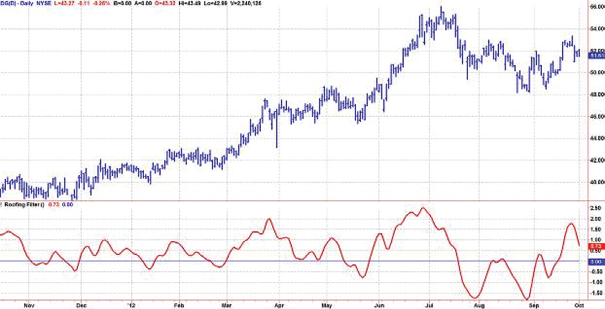
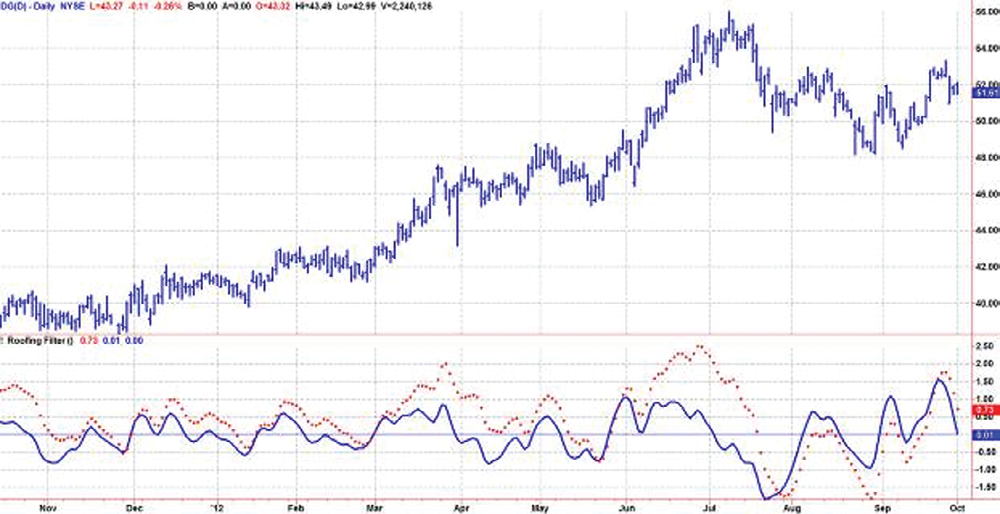
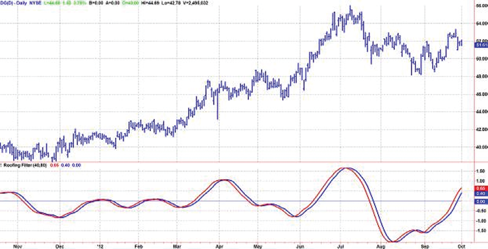
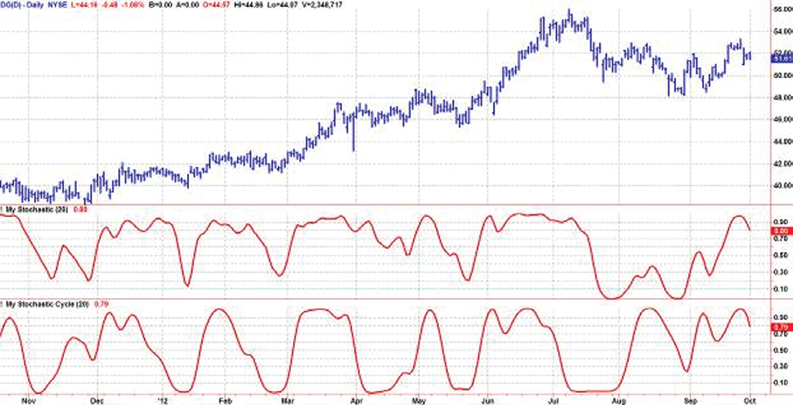
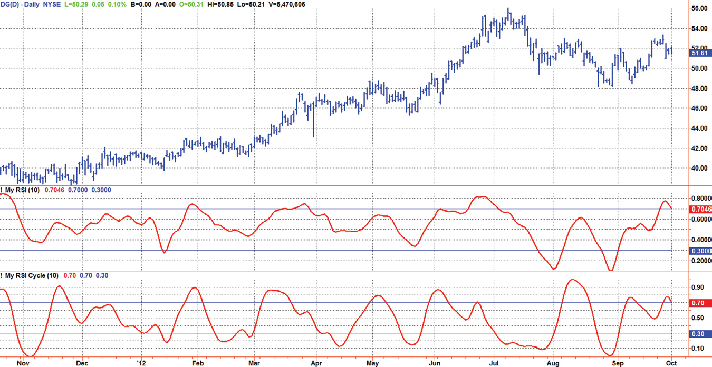

# Chapter 7: Spectral Dilation


## BibTeX

```bibtex
@InBook{ehlers2013cycle_ch7,
  author    = {Ehlers, John F.},
  title     = {Cycle Analytics for Traders: Advanced Technical Trading Concepts},
  chapter   = {7},
  chaptertitle = {Spectral Dilation},
  publisher = {Wiley},
  year      = {2013},
  series    = {Wiley Trading},
  isbn      = {9781118728604},
}
```

---

“The cycle swings are getting bigger,” said Tom expansively.
Linear system theory teaches that any problem can be divided into three
“boxes”: an input box, a transfer box, and an output box. The transfer
box can be as complex as desired and can be composed of many less com-
plex boxes wired together. For this reason, I assumed that if I applied a
filter to input data the output would contain only frequency components
defined by the filter. I have certainly been aware of the fractal nature of
market data and the log spiral used by Fibonaccians, but it just did not oc-
cur to me that the concept would extend to the frequency range of swing-
trading filters.
I coined the term Spectral Dilation to encapsulate the significance of the
effect. This effect has a profound influence on all technical indicators and
is commonly neglected because these indicators are not viewed from the
perspective of their frequency content. The interpretation of common
indicators such as the relative strength index (RSI) or Stochastic are de-
scribed with the frequency distortions of Spectral Dilation imbedded in
the output.

## Frequency Content of Indicator Outputs

A “roofing filter” can be used to limit the frequency content of an input before
proceeding to construct an indicator. The roofing filter is composed of a high-
pass filter that passes only frequency components whose periods are shorter
than 48 bars, for example. It also is composed of a SuperSmoother filter that
passes frequency components whose periods are longer than 10 bars. Thus, the
roofing filter is a wide bandwidth band-pass filter that passes only frequency

components whose periods fall between 10 bars and 48 bars. This, by itself, is
a simple indicator. The EasyLanguage code for this indicator is given in Code
Listing 7-1, and the indicator output is displayed in Figure 7.1.
While the roofing filter indicator wiggles in proportion to the wiggles
in the price data as you would expect, it is noticeable that the indicator is
above zero for extended periods where the market is in an uptrend. In other

**Code Listing 7-1. HP-LP Roofing Filter EasyLanguage Code**

```easylanguage
{
HP-LP Roofing Filter
© 2013 John F. Ehlers
}
Vars:
alpha1(0),
HP(0),
a1(0),
b1(0),
c1(0),
c2(0),
c3(0),
Filt(0);
//Highpass filter cyclic components whose periods are
shorter than 48 bars
alpha1 = (Cosine(360 / 48) + Sine (360 / 48) - 1) /
Cosine(360 / 48);
HP = (1 - alpha1 / 2)*(Close - Close[1]) +
(1 - alpha1)*HP[1];
//Smooth with a Super Smoother Filter from equation 3-3
a1 = expvalue(-1.414*3.14159 / 10);
b1 = 2*a1*Cosine(1.414*180 / 10);
c2 = b1;
c3 = -a1*a1;
c1 = 1 - c2 - c3;
Filt = c1*(HP + HP[1]) / 2 + c2*Filt[1] + c3*Filt[2];
Plot1(Filt);
Plot2(0);

words, the filter output does not have a zero mean as you would expect if
the output consisted only of cyclic components whose periods fall between
10 bars and 48 bars.
```

The explanation for the lack of a zero mean is that the input data has a
spectral power density proportional to 1/F α, and therefore increases am-
plitude at the rate of 6 dB per octave, more or less. The high-pass filter has
a rejection slope that increases attenuation directly proportional to F 0.5,
or rolls off at the rate of 6 dB per octave. This response is similar to the
frequency response shown in Figure 1.2. As a result, the only effect of the
high-pass filter is to basically to equalize the fractal amplitude growth of all
longer periods in the data. Therefore, the filter output still contains all of
these frequency components. The only way we can reduce the effect of these
lower-frequency components is to introduce another high-pass filter, add-
ing an additional 6 dB per octave roll-off, so that the net effect of the filter
is as originally surmised. I have added Filt2 to the code in Code ­Listing 7-2,
and the effect is shown as the solid line in Figure 7.2. The original roofing
filter response is shown with the crosshatched markers. Note that in ad-
dition to establishing a nominally zero mean, removal of the longer-cycle
components caused by spectral dilation removes lag from the roofing filter
output.
Since the roofing filter consists of the serial connection of a one-pole
high-pass filter, a SuperSmoother, and another one-pole high-pass filter, it is
clear the better formulation of the roofing filter would be the serial connec-
tion of a two-pole high-pass filter and the SuperSmoother.



*Figure 7.1: Roofing Filter Display Does Not Have a Zero Mean*


**Code Listing 7-2. EasyLanguage Code for a Zero Mean Roofing Filter**

```easylanguage
{
Zero Mean Roofing Filter
© 2013 John F. Ehlers
}
Vars:
alpha1(0),
HP(0),
a1(0),
b1(0),
c1(0),
c2(0),
c3(0),
Filt(0),
Filt2(0);
//Highpass filter cyclic components whose periods are
shorter than 48 bars
alpha1 = (Cosine(360 / 48) + Sine (360 / 48) - 1) /
Cosine(360 / 48);
HP = (1 - alpha1 / 2)*(Close - Close[1]) +
(1 - alpha1)*HP[1];
//Smooth with a Super Smoother Filter from equation 3-3
a1 = expvalue(-1.414*3.14159 / 10);
b1 = 2*a1*Cosine(1.414*180 / 10);
c2 = b1;
c3 = -a1*a1;
c1 = 1 - c2 - c3;
Filt = c1*(HP + HP[1]) / 2 + c2*Filt[1] + c3*Filt[2];
Filt2= (1 - alpha1 / 2)*(Filt - Filt[1]) +
(1 - alpha1)*Filt2[1];
Plot1(Filt);
Plot2(Filt2);
Plot6(0);
```


## Roofing Filter as an Indicator

The roofing filter does an excellent job of using only the frequency compo-
nents between its upper and lower critical periods. All that needs to be done
to create an indicator from the roofing filter is to add more generality by

allowing the high-pass and low-pass critical periods be supplied as indicator
inputs. In the code of Code Listing 7-3, the two high-pass filters have been
implemented as a single two-pole high-pass filter.
The ideal time to buy is when the cycle is at a trough, and the ideal time
to exit a long position or to sell short is when the cycle is at a peak. These
conditions are flagged by the filter crossing itself delayed by two bars, and
are included as part of the indicator.



*Figure 7.2: Zero Mean Roofing Filter Output Contains Only Desired Frequency Components*

**Code Listing 7-3. EasyLanguage Code for a Roofing Filter Indicator**

```easylanguage
{
Roofing Filter Indicator
© 2013 John F. Ehlers
}
Inputs:
LPPeriod(40),
HPPeriod(80);
Vars:
alpha1(0),
HP(0),
(Continued )

```

An example of the roofing filter indicator is shown in Figure 7.3, where
the LP period rather arbitrarily has been set at 40 and the HP period also
has been arbitrarily set at 80 bars. A casual glance shows the roofing filter
to be an excellent indicator whose signals are not marred by computational
lag. The two inputs can be set to get the best response for a particular stock,
exchange-traded fund, or future symbol. This indicator gives excellent guid-
ance for discretionary trading, but additional rules would be required to
create a good mechanical trading system from it.
If a normalized amplitude indicator is desired, the automatic gain control
(AGC) code fragment described in Chapter 5 can be added after the Filt
calculation.
```easylanguage
a1(0),
b1(0),
c1(0),
c2(0),
c3(0),
Filt(0),
Filt2(0);
//Highpass filter cyclic components whose periods are
shorter than 48 bars
alpha1 = (Cosine(.707*360 / HPPeriod) + Sine (.707*360 /
HPPeriod) - 1) / Cosine(.707*360 / HPPeriod);
HP = (1 - alpha1 / 2)*(1 - alpha1 / 2)*(Close - 2*Close[1] +
Close[2]) + 2*(1 - alpha1)*HP[1] - (1 - alpha1)*
(1 - alpha1)*HP[2];
//Smooth with a Super Smoother Filter from equation 3-3
a1 = expvalue(-1.414*3.14159 / LPPeriod);
b1 = 2*a1*Cosine(1.414*180 / LPPeriod);
c2 = b1;
c3 = -a1*a1;
c1 = 1 - c2 - c3;
Filt = c1*(HP + HP[1]) / 2 + c2*Filt[1] + c3*Filt[2];
Plot1(Filt);
Plot2(Filt[2]);
Plot6(0);

```


## Impact of Spectral Dilation on Conventional Indicators

Conventional indicators are not immune to the effects of spectral dilation.
For example, a Stochastic indicator remains near its upper bound when the
market is in an uptrend even though a relatively short lookback period is
used. This, of course, is due to the presence of the larger and longer cyclic
components in the data. I describe the effect on the Stochastic indicator with
reference to Figure 7.4. A Stochastic indicator basically displays the current



*Figure 7.3: The Roofing Filter Is an Outstanding Technical Indicator*




*Figure 7.4: Spectral Dilation Removal Has a Dramatic Impact on the Stochastic Indicator*

closing price relative to the highest and lowest values in the lookback range.
If you stop and think about it, the current price will tend to be in the high
end of the range when the market is in an uptrend. In a broad sense, the clas-
sic Stochastic indicator acts as a one-pole filter because there is just a single
difference term in the numerator of its calculation. The first subgraph in Fig-
ure 7.4 shows my calculation of a Stochastic over a 20-bar lookback range.
This calculation is the same as the standard, except I use a SuperSmoother
for the smoothing instead of moving averages. The bottom subgraph shows
an identical calculation except that the Stochastic calculations are preceded
by the roofing filter that constrains the cyclic components to fall within the
range from 10-bar to 48-bar periods. Clearly, the Stochastic indicator has
been dramatically altered by the insertion of the roofing filter.
The interpretation and use of the Stochastic indicator, or any other in-
dicator, preceded by the roofing filter will not be addressed. Those kinds
of applications can fill books all by themselves. Therefore, I will leave it to
the reader to explore how standard indicators can be improved simply by
inserting the roofing filter before the indicator computations are begun.
As a point of reference, the EasyLanguage code used to create the bottom
subgraph in Figure 7.4 is given in Code Listing 7-4.

**Code Listing 7-4. EasyLanguage Code to Compute the Modified Stochastic Indicator**

```easylanguage
{
Modified Stochastic Indicator
© 2013 John F. Ehlers
}
Inputs:
Length(20);
Vars:
alpha1(0),
HP(0),
a1(0),
b1(0),
c1(0),
c2(0),
c3(0),
Filt(0),
HighestC(0),

Welles Wilder defined the RSI as
RSI = 100—100 / (1 + RS)
where
RS = (Closes Up) / (Closes Down)
= CU / CD
RS is shorthand for relative strength. That is, CU is the sum of the dif-
ference in closing prices over the observation period where that difference
LowestC(0),
count(0),
Stoc(0),
MyStochastic(0);
//Highpass filter cyclic components whose periods are
shorter than 48 bars
alpha1 = (Cosine(.707*360 / 48) + Sine (.707*360 / 48) - 1) /
Cosine(.707*360 / 48);
HP = (1 - alpha1 / 2)*(1 - alpha1 / 2)*(Close - 2*Close[1]
+ Close[2]) + 2*(1 - alpha1)*HP[1] - (1 - alpha1)*(1 -
alpha1)*HP[2];
//Smooth with a Super Smoother Filter from equation 3-3
a1 = expvalue(-1.414*3.14159 / 10);
b1 = 2*a1*Cosine(1.414*180 / 10);
c2 = b1;
c3 = -a1*a1;
c1 = 1 - c2 - c3;
Filt = c1*(HP + HP[1]) / 2 + c2*Filt[1] + c3*Filt[2];
HighestC = Filt;
LowestC = Filt;
For count = 0 to Length - 1 Begin
If Filt[count] > HighestC then HighestC = Filt[count];
If Filt[count] < LowestC then LowestC = Filt[count];
End;
Stoc = (Filt - LowestC) / (HighestC - LowestC);
MyStochastic = c1*(Stoc + Stoc[1]) / 2 + c2*MyStochastic[1] +
c3*MyStochastic[2];
Plot1(MyStochastic);

is positive. Similarly, CD is the sum of the difference in closing prices over
the observation period where that difference is negative, but the sum is ex-
pressed as a positive number. When we substitute CU / CD for RS and sim-
plify the RSI equation, we get

$$RSI = 100 - \frac{100}{1 + CU/CD} = 100 - \frac{100 \cdot CD}{CU + CD} = \frac{100 \cdot (CU + CD)}{CU + CD} - \frac{100 \cdot CD}{CU + CD} = \frac{100 \cdot CU}{CU + CD}$$

```

In other words, the RSI is the percentage of the sum of the delta closes
up to the sum of all the delta closes over the observation period. The
only variable here is the observation period. To have maximum effective-
ness the observation period should be half of the measured period. If
the observation period is half the dominant cycle, then for a pure sine
wave, the closes up is exactly equal to the total closes during part of the
cycle from the valley to the peak. In this case, the RSI would have a value
of 100. During another part of the cycle—the next half cycle—there
would be no closes up. During this half cycle, the RSI would have a value
of zero. So, in principle, half the measured cycle is the correct choice
for the RSI observation period. In Figure 7.5 I have shown a standard
RSI (except I used a SuperSmoother filter) in the first subgraph with a
modified RSI that is preceded by a roofing filter in the second subgraph.
The modified RSI is far more responsive and has less lag because the low
frequency components have been removed by the high-pass part of the
roofing filter. The RSI is functionally the same as a single-pole high-pass
filter because the CU term in the numerator is just a summation of one-
bar differences.
The EasyLanguage code to compute the modified RSI indicator is given
in Code Listing 7-5. The computation starts with the roofing filter, followed
by the routine calculations for an RSI. I have included an optional Super-
Smoother to produce the MyRSI variable. The indicator lag can be reduced
a little by not using a smoothing filter, but the decreased lag comes at the
expense of the indicator’s being more irregular.




*Figure 7.5: The Modified RSI Is More Responsive than the Standard RSI*


**Code Listing 7-5. EasyLanguage Code to Compute the Modified RSI Indicator**

```easylanguage
{
Modified RSI Indicator
© 2013 John F. Ehlers
}
Inputs:
Length(10);
Vars:
alpha1(0),
HP(0),
a1(0),
b1(0),
c1(0),
c2(0),
c3(0),
Filt(0),
ClosesUp(0),
ClosesDn(0),
count(0),
Denom(0),
MyRSI(0);
(Continued )

```


## Key Points to Remember

1.	 Spectral Dilation is inherently part of market data, arising from the frac-
tal nature of the data. That is, longer cycle periods necessarily have cor-
respondingly larger amplitude swings.
2.	 Spectral Dilation is virtually ignored in all common technical indicators.
3.	 Ignoring Spectral Dilation has led to erroneous, and often wacky, inter-
pretation of market activity.
```easylanguage
//Highpass filter cyclic components whose periods are
shorter than 48 bars
alpha1 = (Cosine(.707*360 / 48) + Sine (.707*360 / 48) - 1) /
Cosine(.707*360 / 48);
HP = (1 - alpha1 / 2)*(1 - alpha1 / 2)*(Close - 2*Close[1] +
Close[2]) + 2*(1 - alpha1)*HP[1] - (1 - alpha1)*(1 -
alpha1)*HP[2];
//Smooth with a Super Smoother Filter from equation 3-3
a1 = expvalue(-1.414*3.14159 / 10);
b1 = 2*a1*Cosine(1.414*180 / 10);
c2 = b1;
c3 = -a1*a1;
c1 = 1 - c2 - c3;
Filt = c1*(HP + HP[1]) / 2 + c2*Filt[1] + c3*Filt[2];
ClosesUp = 0;
ClosesDn = 0;
For count = 0 to Length - 1 Begin
If Filt[count] > Filt[count + 1] Then ClosesUp = ClosesUp +
(Filt[count] - Filt[count + 1]);
If Filt[count] < Filt[count + 1] Then ClosesDn = ClosesDn +
(Filt[count + 1] - Filt[count]);
End;
Denom = ClosesUp + ClosesDn;
If Denom <> 0 and Denom[1] <> 0 Then MyRSI = c1*(ClosesUp /
Denom + ClosesUp[1] / Denom[1]) / 2 + c2*MyRSI[1] +
c3*MyRSI[2];
Plot1(MyRSI);
Plot2(.7);
Plot6(.3);

	 4.	 Spectral Dilation can be corrected by placing a roofing filter before the
computation of indicators.
	 5.	 A roofing filter establishes a near zero mean of detrended data by allow-
ing only cyclic components within the filter pass band to be passed on
for further analysis.
	 6.	 The roofing filter, itself, can be a successful technical indicator.
	 7.	 Insertion of the roofing filter will dramatically change the use and in-
terpretation of standard indicators, basically making them all new
indicators.


```