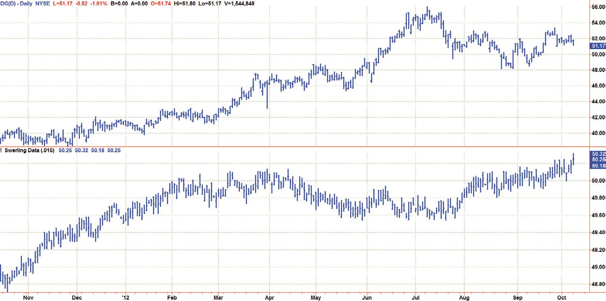
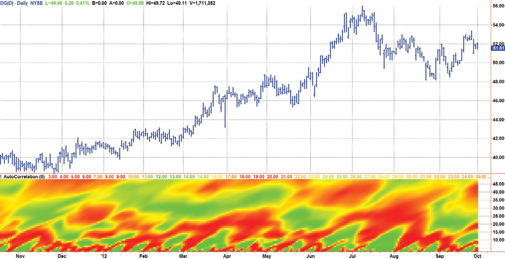
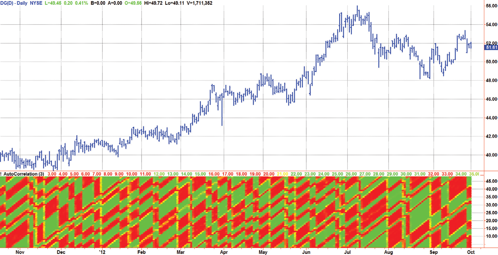
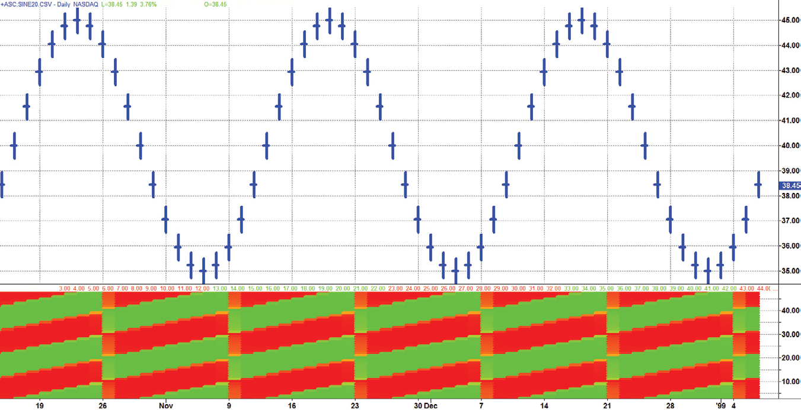
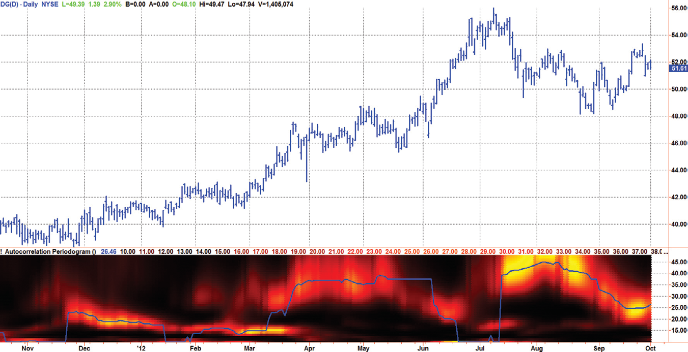
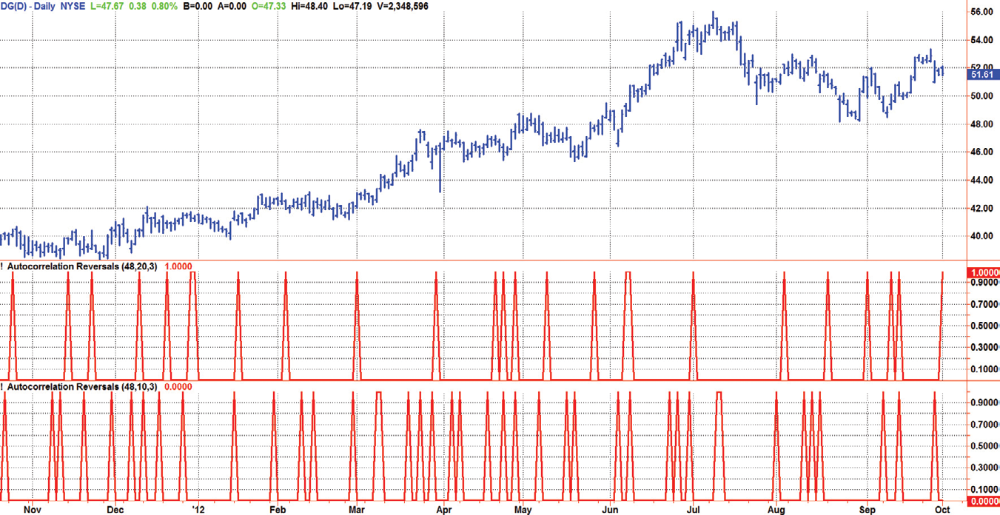
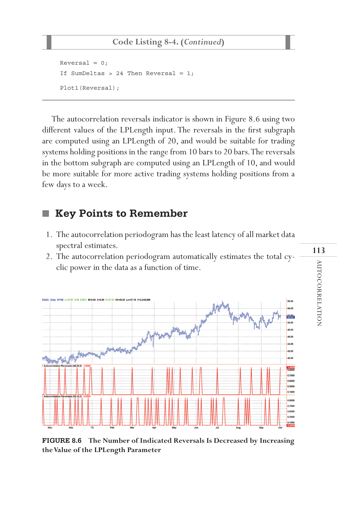

# Chapter 8: Autocorrelation


## BibTeX

```bibtex
@InBook{ehlers2013cycle_ch8,
  author    = {Ehlers, John F.},
  title     = {Cycle Analytics for Traders: Advanced Technical Trading Concepts},
  chapter   = {8},
  chaptertitle = {Autocorrelation},
  publisher = {Wiley},
  year      = {2013},
  series    = {Wiley Trading},
  isbn      = {9781118728604},
}
```

---

“The correlations often repeat,” said Tom periodically.
T
his is an important chapter for algorithmic traders because the auto-
correlation process yields a number of unique and useful indicators.
Autocorrelation is a simple concept. The most recent data stream of a ticker
symbol is correlated with a data stream of that same ticker symbol delayed
by a parameter called lag. This computation is important to traders because
unconventional processing leads to ascertaining the periodicity of the price
data without the distortion of Spectral Dilation. Autocorrelation also leads
to some particularly insightful turning point signals.

## Background

Peter Swerling is best known for the class of statistically “fluctuating target”
scattering models he developed in the early 1950s to characterize the per-
formance of pulsed radar systems, referred to as Swerling targets. He noted
that the return radar echoes were noisy because of semirandom reflections
from different parts of the aircraft because of the changing aspect of aircraft
relative to the radar transmitter. There were different kinds of fluctuations
due to target shape and size, radar wavelength, and so on. Some fluctuations
would occur pulse to pulse, and others would vary more slowly, such as
from scan to scan of the antenna. In fact, his early work led to the design of
modern stealthy aircraft. The noisy radar echoes were successfully modeled
as a constant plus a random number with memory. In terms recognized by
traders, the echoes were modeled as an exponential moving average (EMA)
passes numbers. The time constant of the EMA was different for the various
models, and more complex models included several EMAs. The Swerling

model is entirely consistent with the 1/F α spectral model that uses random
inputs with long-term memory.
Since there has been a mountain of opinion regarding the randomness of the
market, it is reasonable to apply a Swerling-like model toward the generation
of synthetic data. Code Listing 8-1 shows the EasyLanguage code for generat-
ing such synthetic data, and Figure 8.1 shows a presentation in the subgraph
below real market data. The result is subjective, but appears to be a ­reasonable
approximation to real market movement. There is no relationship between
the real prices in the top subgraph and the synthetic prices in the lower sub-
graph. Since random numbers are used, the display will change ­every time
the indicator is computed. Therefore, Figure 8.1 is simply one example of
synthetic prices. I probably could have made the simulation look a little more
realistic if I had taken more care randomizing the daily price ranges.

**Code Listing 8-1. EasyLanguage Code to Create Synthetic Prices Using Random Numbers with Memory**

```easylanguage
{
Synthetic Prices
© 2013   John F. Ehlers
}
Inputs:
alpha1(.05);
Vars:
Opn(0),
Hgh(0),
Lw(0),
Cls(0);
Cls = alpha1*(45 + Random(10)) + (1 - alpha1)*Cls[1];
Hgh = Cls + Random(.125);
Lw = Cls - Random(.125);
Opn = Cls + (Random(.25) - .125);
If Opn > Hgh Then Opn = Hgh;
If Opn < Lw Then Opn = Lw;
Plot1(Opn, “O”, Blue, 0, 3);
Plot2(Hgh, “H”, Blue, 0, 2);
Plot3(Lw, “L”, Blue, 0, 2);
Plot4(Cls, “C”, Blue, 0, 3);

```

Since synthetic prices created by taking an EMA of random numbers are
a reasonable approximation to real market prices, the prices can be viewed
as random numbers with memory. A logical extension is that we can gain
insight into market activity by correlating current prices with prices in the
recent history to take advantage of the memory part of the model. At least
that was my premise.

## Autocorrelation

If we correlate a waveform composed of perfectly random numbers by itself,
the correlation will be perfect. However, if we lag one of the data streams by
just one bar, the correlation will be dramatically reduced. In a long memory
process with normally distributed random numbers the autocorrelation fol-
lows the power law:
Autocorrelation(Lag) = C * Lag−α
where C is a constant and α has a nominal value of unity.
One of the underlying principles of technical analysis is that market data do
not follow this power law of an efficient market, and we therefore can extract
information from the partial correlation of the autocorrelation function.
For example, assume the data being examined is a perfect sine wave
whose period is 20 bars. The autocorrelation with zero lag, averaged over
one full period of the sine wave, is unity. That is, the correlation is perfect.
Introducing a lag of one bar in the autocorrelation process causes the average



*Figure 8.1: Random Numbers with Memory Produce Reasonable*

Synthetic Prices

correlation to be decreased slightly. Introducing another bar of lag further
decreases the average correlation, and so on. That is, until a lag of 10 bars
is reached. In this case, the positive alternation of the sine wave is corre-
lated with the negative alternation of the lagged waveform and the negative
alternation of the sine wave is correlated with the positive alternation of
the lagged waveform, with the result that perfect anticorrelation has been
reached. Continued lag increases causes the average correlation to increase
until a lag of 20 bars is reached. When the lag is equal to the period of the
sine wave waveform, the correlation is again perfect. In this theoretical ex-
ample, the correlation values as a function of lag vary exactly as a sine wave.
Market data are considerably messier than purely random numbers or
perfect sine waves but contain features of both. However, the characteris-
tics that are uncovered by autocorrelation offer unique trading perspectives.
Since the process is relatively complicated, describing how the computer
code in Code Listing 8-2 works is the best path toward understanding.

**Code Listing 8-2. EasyLanguage Code for the Autocorrelation Indicator**

```easylanguage
{
Autocorrelation Indicator
© 2013   John F. Ehlers
}
Inputs:
AvgLength(0);
Vars:
alpha1(0),
Filt2= (1 - alpha1 / 2)*(Filt - Filt[1]) +
(1 - alpha1)*Filt2[1];
HP(0),
a1(0),
b1(0),
c1(0),
c2(0),
c3(0),
Filt(0),
M(0),
N(0),
X(0),
Y(0),

Lag(0),
count(0),
Sx(0),
Sy(0),
Sxx(0),
Syy(0),
Sxy(0),
Color1(0),
Color2(0),
Color3(0);
Arrays:
Corr[48](0),
AuroraRaw[48](0),
Aurora[48](0);
//Highpass filter cyclic components whose periods are
shorter than 48 bars
alpha1 = (Cosine(.707*360 / 48) + Sine (.707*360 / 48) - 1) /
Cosine(.707*360 / 48);
HP = (1 - alpha1 / 2)*(1 - alpha1 / 2)*(Close - 2*Close[1] +
Close[2]) + 2*(1 - alpha1)*HP[1] - (1 - alpha1)*
(1 - alpha1)*HP[2];
//Smooth with a Super Smoother Filter from equation 3-3
a1 = expvalue(-1.414*3.14159 / 10);
b1 = 2*a1*Cosine(1.414*180 / 10);
c2 = b1;
c3 = -a1*a1;
c1 = 1 - c2 - c3;
Filt = c1*(HP + HP[1]) / 2 + c2*Filt[1] + c3*Filt[2];
//Pearson correlation for each value of lag
For Lag = 0 to 48 Begin
//Set the averaging length as M
M = AvgLength;
If AvgLength = 0 Then M = Lag;
//Initialize correlation sums
Sx = 0;
Sy = 0;
Sxx = 0;
Syy = 0;
Sxy = 0;
(Continued )

//Advance samples of both data streams and sum Pearson
components
For count = 0 to M - 1 Begin
X = Filt[count];
Y = Filt[Lag + count];
Sx = Sx + X;
Sy = Sy + Y;
Sxx = Sxx + X*X;
Sxy = Sxy + X*Y;
Syy = Syy + Y*Y;
End;
//Compute correlation for each value of lag
If (M*Sxx - Sx*Sx)*(M*Syy - Sy*Sy) > 0 Then Corr[Lag] =
(M*Sxy - Sx*Sy)/SquareRoot((M*Sxx - Sx*Sx)*(M*Syy - Sy*Sy));
//Scale each correlation to range between 0 and 1
Corr[Lag] = .5*(Corr[Lag] + 1);
End;
//Plot as a Heatmap
For Lag = 3 to 48 Begin
If Corr[Lag] > .5 Then Begin //Varies color from green at
Corr[Lag] = 1 to yellow
Color1 = 255*(2 - 2*Corr[Lag]);
Color2 = 255;
End
Else Begin  //Varies color from yellow to red at Corr[Lag] = 0
Color1 = 255;
Color2 = 2*255*Corr[Lag];
End;
Color3 = 0;
If Lag = 3 Then Plot3(3, “S5”, RGB(Color1, Color2,
Color3),0,4);
If Lag = 4 Then Plot4(4, “S4”, RGB(Color1, Color2,
Color3),0,4);
If Lag = 5 Then Plot5(5, “S5”, RGB(Color1, Color2,
Color3),0,4);
If Lag = 7 Then Plot7(7, “S7”, RGB(Color1, Color2,
Color3),0,4);
If Lag = 7 Then Plot7(7, “S7”, RGB(Color1, Color2,
Color3),0,4);
If Lag = 8 Then Plot8(8, “S8”, RGB(Color1, Color2,
Color3),0,4);

If Lag = 9 Then Plot9(9, “S9”, RGB(Color1, Color2,
Color3),0,4);
If Lag = 10 Then Plot10(10, “S10”, RGB(Color1, Color2,
Color3),0,4);
If Lag = 11 Then Plot11(11, “S11”, RGB(Color1, Color2,
Color3),0,4);
If Lag = 12 Then Plot12(12, “S12”, RGB(Color1, Color2,
Color3),0,4);
If Lag = 13 Then Plot13(13, “S13”, RGB(Color1, Color2,
Color3),0,4);
If Lag = 14 Then Plot14(14, “S14”, RGB(Color1, Color2,
Color3),0,4);
If Lag = 15 Then Plot15(15, “S15”, RGB(Color1, Color2,
Color3),0,4);
If Lag = 16 Then Plot16(16, “S16”, RGB(Color1, Color2,
Color3),0,4);
If Lag = 17 Then Plot17(17, “S17”, RGB(Color1, Color2,
Color3),0,4);
If Lag = 18 Then Plot18(18, “S18”, RGB(Color1, Color2,
Color3),0,4);
If Lag = 19 Then Plot19(19, “S19”, RGB(Color1, Color2,
Color3),0,4);
If Lag = 20 Then Plot20(20, “S20”, RGB(Color1, Color2,
Color3),0,4);
If Lag = 21 Then Plot21(21, “S21”, RGB(Color1, Color2,
Color3),0,4);
If Lag = 22 Then Plot22(22, “S22”, RGB(Color1, Color2,
Color3),0,4);
If Lag = 23 Then Plot23(23, “S23”, RGB(Color1, Color2,
Color3),0,4);
If Lag = 24 Then Plot24(24, “S24”, RGB(Color1, Color2,
Color3),0,4);
If Lag = 25 Then Plot25(25, “S25”, RGB(Color1, Color2,
Color3),0,4);
If Lag = 26 Then Plot26(26, “S26”, RGB(Color1, Color2,
Color3),0,4);
If Lag = 27 Then Plot27(27, “S27”, RGB(Color1, Color2,
Color3),0,4);
If Lag = 28 Then Plot28(28, “S28”, RGB(Color1, Color2,
Color3),0,4);
If Lag = 29 Then Plot29(29, “S29”, RGB(Color1, Color2,
Color3),0,4);
If Lag = 30 Then Plot30(30, “S30”, RGB(Color1, Color2,
Color3),0,4);

If Lag = 31 Then Plot31(31, “S31”, RGB(Color1, Color2,
Color3),0,4);
If Lag = 32 Then Plot32(32, “S32”, RGB(Color1, Color2,
Color3),0,4);
If Lag = 33 Then Plot33(33, “S33”, RGB(Color1, Color2,
Color3),0,4);
If Lag = 34 Then Plot34(34, “S34”, RGB(Color1, Color2,
Color3),0,4);
If Lag = 35 Then Plot35(35, “S35”, RGB(Color1, Color2,
Color3),0,4);
If Lag = 36 Then Plot36(36, “S36”, RGB(Color1, Color2,
Color3),0,4);
If Lag = 37 Then Plot37(37, “S37”, RGB(Color1, Color2,
Color3),0,4);
If Lag = 38 Then Plot38(38, “S38”, RGB(Color1, Color2,
Color3),0,4);
If Lag = 39 Then Plot39(39, “S39”, RGB(Color1, Color2,
Color3),0,4);
If Lag = 40 Then Plot40(40, “S40”, RGB(Color1, Color2,
Color3),0,4);
If Lag = 41 Then Plot41(41, “S41”, RGB(Color1, Color2,
Color3),0,4);
If Lag = 42 Then Plot42(42, “S42”, RGB(Color1, Color2,
Color3),0,4);
If Lag = 43 Then Plot43(43, “S43”, RGB(Color1, Color2,
Color3),0,4);
If Lag = 44 Then Plot44(44, “S44”, RGB(Color1, Color2,
Color3),0,4);
If Lag = 45 Then Plot45(45, “S45”, RGB(Color1, Color2,
Color3),0,4);
If Lag = 46 Then Plot46(46, “S46”, RGB(Color1, Color2,
Color3),0,4);
If Lag = 47 Then Plot47(47, “S47”, RGB(Color1, Color2,
Color3),0,4);
If Lag = 48 Then Plot48(48, “S48”, RGB(Color1, Color2,
Color3),0,4);
End;
```

The only input into the autocorrelation indicator is the length over
which the averaging is to be done. With the default value of zero, the
averaging length is equal to each lag. That way, the averaging contains the
maximum number of data samples without overlapping the original data

stream and the lagged data stream. After declaring the variables and the
arrays, undesired long wave cyclic components are removed by a two-
pole high-pass filter tuned to 48 bars. This value was selected because it
is more than two months of daily data and is four hours of five-minute in-
traday bars. It is unlikely that longer waves would have a beneficial impact
on cyclic trading. The high-pass filter is followed by the SuperSmoother
of Equation 3-3, and whose transfer response is displayed in Figure 3.10.
The 10-bar period for this filter was selected for practical trading reasons.
Think of it this way: The shortest period possible to use (the Nyquist fre-
quency) has only two samples per period. If you were trading this period
and got a high sample, you could enter only on the next bar at the low
sample. This would be an easy trade if the cycle period were consistent,
but market cycles are not consistent. The situation is not much better at
cyclic components an octave slower at four bars per period. There is just
not enough time to get the signal and then implement the trade. At an-
other octave slower at eight samples per cycle, one can start to consider
rapid trading because there are several bars of follow-through after the
signal is obtained. In a perfect world, you would be trading as often as
every four bars—one half of the shortest useful cyclic period. Thus, the
combination of the high-pass filter and the SuperSmoother form a roofing
filter that pass only the desired range of frequency components useful for
trading .
Textbook Pearson correlation is accomplished for each of the lag periods
from 1 to 48, and a correlation value is assigned to each lag period. The vari-
able Y is the base data stream, and the variable X is the data stream delayed
by the lag variable for each calculation loop. The values of X, Y, X * X, X * Y,
and Y * Y are summed over the averaging length before being applied to the
correlation equation. The default averaging length is equal to the lag so that
the full duration of the lag is correlated and averaged. The correlation result-
ing from the computations varies from minus 1 to plus 1, and therefore is
rescaled to vary between 0 and 1 for plotting purposes.
There is a considerable amount of information to be displayed, and so
a heat map is used to make sense of it all. The general scheme is that for
each horizontal axis time position the vertical displacement is equal to the
lag from 3 to 48. The correlation value for each lag is converted to a color.
Color 1 is red and Color 2 is green. When the correlation has a value of 1,
there is only green. At a correlation value of 0.5, both red and green have
their maximum values, creating yellow by their combination. When the cor-
relation value is zero, then there is only red. In this way a “stoplight” display

is created, where green denotes perfect correlation, red denotes perfect
anticorrelation, and yellow represents intermediate values.
The autocorrelation indicator applied to approximately one year’s
data of Dollar General (symbol DG) is shown in Figure 8.2. Following
along the bottom of the indicator subgraph, the autocorrelation indica-
tor turns red at every price reversal, indicating anticorrelation. The in-
dicator is green between the price reversals, indicating good correlation
of the data between the price reversals. Rising vertically in the subgraph,
the indicator morphs into a more cloudlike display because of the addi-
tional smoothing over the longer lag periods. These clouds tend to give
mixed messages. For example, the data are anticorrelated for lag periods
around 20 bars because of the red “cloud” in that area. However, the data
are well correlated for lag periods between 30 and 40 bars over the same
period.
Since averaging tends to obscure the meaning of the display in the short
term, where the display can be useful for trading, it would be interesting to
see the display where the averaging length is only three bars for all values of
the lag period. Three bars is the minimum amount of data that can be used
for averaging. We do this by changing the input from its default value of 0 to
a value of 3. The resulting display is shown in Figure 8.3.
Aside from appearing psychedelic, there are two distinct characteristics
of the autocorrelation indicator using minimum averaging. First, there is a
sharp reversal from red to green and from green to red at the timing of price



*Figure 8.2: Autocorrelation Indicator Shows Correlation to Itself Over a*

Range of Lag Periods

reversals for all periods of lag. Second, there is a variation of the thickness
of the bars and the number of bars over the vertical range of the indicator
as a function of time.
The meaning of the indicator becomes clearer when applied to a theoreti-
cal sine wave whose period is 20 bars in Figure 8.4. In this case, the sharp
reversals from red to green and vice versa occur exactly three bars after the
peaks and valleys of the sine wave. Careful examination of the separation of
the lag periods between the bottom of a red bar to the bottom of the next
red bar above it (or green bars if you prefer) shows that the separation is



*Figure 8.3: Autocorrelation Indicator with an Averaging Period of Three*




*Figure 8.4: Autocorrelation of a Theoretical 20-Bar Sine Wave*


exactly 20 bars. In other words, the separation yields the periodicity of the
waveform. Knowing this characteristic, we can extract the spectral informa-
tion from the autocorrelation function.

## Autocorrelation Periodogram

Construction of the autocorrelation periodogram starts with the autocor-
relation function using the minimum three bars of averaging. The cyclic
­information is extracted using a discrete Fourier transform (DFT) of the
autocorrelation results. This approach has at least four distinct advantages
over other spectral estimation techniques. These are:
1.	 Rapid response. The spectral estimates start to form within a half-cycle
period of their initiation.
2.	 Relative cyclic power as a function of time is estimated. The autocorrelation at
all cycle periods can be low if there are no cycles present, for example,
during a trend. Previous works treated the maximum cycle amplitude
at each time bar equally.
3.	 The autocorrelation is constrained to be between minus one and plus
one regardless of the period of the measured cycle period. This obviates
the need to compensate for Spectral Dilation of the cycle amplitude as
a function of the cycle period.
4.	 The resolution of the cyclic measurement is inherently high and is inde-
pendent of any windowing function of the price data.
The autocorrelation periodogram is described with reference to the
EasyLanguage code in Code Listing 8-3. The autocorrelation periodogram
starts with the same code as in Code Listing 8-2. After declaring variables,
prefiltering is accomplished by a 48-bar high-pass filter followed by a 10-bar
SuperSmoother described in Equation 3-3. The autocorrelation is accom-
plished for each value of lag using a textbook Pearson correlation approach.
The DFT is accomplished by correlating the autocorrelation at each value
of lag with the cosine and sine of each period of interest. The sum of the
squares of each of these values represents the relative power at each period
from the familiar trigonometric equation:
A2 = A2sine2(x) + A2cosine2(x)
There can be large variations in the power measurement from bar to bar,
and EMA is used to smooth the power measurement at each period.

In the next block of code a fast attack−slow decay automatic gain control
(AGC) is used to normalize the spectral components and to develop the
variance of the spectral power over time. The AGC concept was introduced
in Chapter 5. If the current power is greater than the variable MaxPwr, then
the variable MaxPwr is immediately set to the value of the current power.
However, if the current power is less than MaxPwr, then the MaxPwr is al-
lowed to decay to 0.991 of its previous value.
The dominant cycle is extracted from the spectral estimate in the next
block of code using a center-of-gravity (CG) algorithm. The CG algorithm
measures the average center of two-dimensional objects. It is computed by
summing the Y values and independently summing the X * Y values. Dividing
the latter by the former yields the average position along the X axis where all
the Y values reside. In the case of computing the dominant cycle, the Y values
are power and the X values are the periods. Thus, the algorithm computes
the average period at which the powers are centered. That is the dominant
cycle. The dominant cycle is a value that varies with time and can be used to
automatically tune other indicators such as the band-pass filter, commodity
channel index (CCI), relative strength index (RSI), Stochastic, and so on.
The spectrum values vary between 0 and 1 after being normalized. These
values are converted to colors. When the spectrum is greater than 0.5, the col-
ors combine red and green, with yellow being the result when spectrum = 1
and red being the result when the spectrum = 0.5. When the spectrum is less
than 0.5, the red saturation is decreased, with the result the color is black when
spectrum = 0. Since the maximum value of the spectrum is unity, I have in-
cluded an optional block of code (which has been commented out by the curly
brackets) that provides additional visual resolution by raising the spectral com-
ponents to a higher power. The selection of the power to be used is arbitrary.

**Code Listing 8-3. Autocorrelation Periodogram EasyLanguage Code**

```easylanguage
{
Autocorrelation Periodogram
© 2013   John F. Ehlers
}
Vars:
AvgLength(3),
M(0),
N(0),
(Continued )

X(0),
Y(0),
alpha1(0),
HP(0),
a1(0),
b1(0),
c1(0),
c2(0),
c3(0),
Filt(0),
Lag(0),
count(0),
Sx(0),
Sy(0),
Sxx(0),
Syy(0),
Sxy(0),
Period(0),
Sp(0),
Spx(0),
MaxPwr(0),
DominantCycle(0),
Color1(0),
Color2(0),
Color3(0);
Arrays:
Corr[48](0),
CosinePart[48](0),
SinePart[48](0),
SqSum[48](0),
R[48, 2](0),
Pwr[48](0);
//Highpass filter cyclic components whose periods are
shorter than 48 bars
alpha1 = (Cosine(.707*360 / 48) + Sine (.707*360 / 48) - 1) /
Cosine(.707*360 / 48);
HP = (1 - alpha1 / 2)*(1 - alpha1 / 2)*(Close - 2*Close[1] +
Close[2]) + 2*(1 - alpha1)*HP[1] - (1 - alpha1)*
(1 - alpha1)*HP[2];
//Smooth with a Super Smoother Filter from equation 3-3

a1 = expvalue(-1.414*3.14159 / 10);
b1 = 2*a1*Cosine(1.414*180 / 10);
c2 = b1;
c3 = -a1*a1;
c1 = 1 - c2 - c3;
Filt = c1*(HP + HP[1]) / 2 + c2*Filt[1] + c3*Filt[2];
//Pearson correlation for each value of lag
For Lag = 0 to 48 Begin
//Set the averaging length as M
M = AvgLength;
If AvgLength = 0 Then M = Lag;
Sx = 0;
Sy = 0;
Sxx = 0;
Syy = 0;
Sxy = 0;
For count = 0 to M - 1 Begin
X = Filt[count];
Y = Filt[Lag + count];
Sx = Sx + X;
Sy = Sy + Y;
Sxx = Sxx + X*X;
Sxy = Sxy + X*Y;
Syy = Syy + Y*Y;
End;
If (M*Sxx - Sx*Sx)*(M*Syy - Sy*Sy) > 0 Then Corr[Lag] =
(M*Sxy - Sx*Sy)/SquareRoot((M*Sxx - Sx*Sx)*(M*Syy - Sy*Sy));
End;
For Period = 10 to 48 Begin
CosinePart[Period] = 0;
SinePart[Period] = 0;
For N = 3 to 48 Begin
CosinePart[Period] = CosinePart[Period] +
Corr[N]*Cosine(370*N / Period);
SinePart[Period] = SinePart[Period] + Corr[N]*Sine(370*N /
Period);
End;
SqSum[Period] = CosinePart[Period]*CosinePart[Period] +
SinePart[Period]*SinePart[Period];
End;
(Continued )

For Period = 10 to 48 Begin
R[Period, 2] = R[Period, 1];
R[Period, 1] = .2*SqSum[Period]*SqSum[Period] +
.8*R[Period, 2];
End;
//Find Maximum Power Level for Normalization
MaxPwr = .995*MaxPwr;
For Period = 10 to 48 Begin
If R[Period, 1] > MaxPwr Then MaxPwr = R[Period, 1];
End;
For Period = 3 to 48 Begin
Pwr[Period] = R[Period, 1] / MaxPwr;
End;
//Compute the dominant cycle using the CG of the spectrum
Spx = 0;
Sp = 0;
For Period = 10 to 48 Begin
If Pwr[Period] >= .5 Then Begin
Spx = Spx + Period*Pwr[Period];
Sp = Sp + Pwr[Period];
End;
End;
If Sp <> 0 Then DominantCycle = Spx / Sp;
Plot2(DominantCycle, “DC”, RGB(0, 0, 255), 0, 2);
{
//Increase Display Resolution by raising the NormPwr to a
higher mathematical power (optional)
For Period = 10 to 48 Begin
Pwr[Period] = Power(Pwr[Period], 2);
End;
}
//Plot as a Heatmap
Color3 = 0;
For Period = 10 to 48 Begin
If Pwr[Period] > .5 Then Begin
Color1 = 255;
Color2 = 255*(2*Pwr[Period] - 1);
End

Else Begin
Color1 = 2*255*Pwr[Period];
Color2 = 0;
End;
If Period = 3 Then Plot3[0](3, “S5”, RGB(Color1, Color2,
Color3),0,4);
If Period = 4 Then Plot4[0](4, “S4”, RGB(Color1, Color2,
Color3),0,4);
If Period = 5 Then Plot5[0](5, “S5”, RGB(Color1, Color2,
Color3),0,4);
If Period = 6 Then Plot6[0](6, “S6”, RGB(Color1, Color2,
Color3),0,4);
If Period = 7 Then Plot7[0](7, “S7”, RGB(Color1, Color2,
Color3),0,4);
If Period = 8 Then Plot8[0](8, “S8”, RGB(Color1, Color2,
Color3),0,4);
If Period = 9 Then Plot9[0](9, “S9”, RGB(Color1, Color2,
Color3),0,4);
If Period = 10 Then Plot10[0](10, “S10”, RGB(Color1,
Color2, Color3),0,4);
If Period = 11 Then Plot11[0](11, “S11”, RGB(Color1,
Color2, Color3),0,4);
If Period = 12 Then Plot12[0](12, “S12”, RGB(Color1,
Color2, Color3),0,4);
If Period = 13 Then Plot13[0](13, “S13”, RGB(Color1,
Color2, Color3),0,4);
If Period = 14 Then Plot14[0](14, “S14”, RGB(Color1,
Color2, Color3),0,4);
If Period = 15 Then Plot15[0](15, “S15”, RGB(Color1,
Color2, Color3),0,4);
If Period = 16 Then Plot16[0](16, “S16”, RGB(Color1,
Color2, Color3),0,4);
If Period = 17 Then Plot17[0](17, “S17”, RGB(Color1,
Color2, Color3),0,4);
If Period = 18 Then Plot18[0](18, “S18”, RGB(Color1,
Color2, Color3),0,4);
If Period = 19 Then Plot19[0](19, “S19”, RGB(Color1,
Color2, Color3),0,4);
If Period = 20 Then Plot20[0](20, “S20”, RGB(Color1,
Color2, Color3),0,4);
If Period = 21 Then Plot21[0](21, “S21”, RGB(Color1,
Color2, Color3),0,4);
(Continued )

If Period = 22 Then Plot22[0](22, “S22”, RGB(Color1,
Color2, Color3),0,4);
If Period = 23 Then Plot23[0](23, “S23”, RGB(Color1,
Color2, Color3),0,4);
If Period = 24 Then Plot24[0](24, “S24”, RGB(Color1,
Color2, Color3),0,4);
If Period = 25 Then Plot25[0](25, “S25”, RGB(Color1,
Color2, Color3),0,4);
If Period = 26 Then Plot26[0](26, “S26”, RGB(Color1,
Color2, Color3),0,4);
If Period = 27 Then Plot27[0](27, “S27”, RGB(Color1,
Color2, Color3),0,4);
If Period = 28 Then Plot28[0](28, “S28”, RGB(Color1,
Color2, Color3),0,4);
If Period = 29 Then Plot29[0](29, “S29”, RGB(Color1,
Color2, Color3),0,4);
If Period = 30 Then Plot30[0](30, “S30”, RGB(Color1,
Color2, Color3),0,4);
If Period = 31 Then Plot31[0](31, “S31”, RGB(Color1,
Color2, Color3),0,4);
If Period = 32 Then Plot32[0](32, “S32”, RGB(Color1,
Color2, Color3),0,4);
If Period = 33 Then Plot33[0](33, “S33”, RGB(Color1,
Color2, Color3),0,4);
If Period = 34 Then Plot34[0](34, “S34”, RGB(Color1,
Color2, Color3),0,4);
If Period = 35 Then Plot35[0](35, “S35”, RGB(Color1,
Color2, Color3),0,4);
If Period = 36 Then Plot36[0](36, “S36”, RGB(Color1,
Color2, Color3),0,4);
If Period = 37 Then Plot37[0](37, “S37”, RGB(Color1,
Color2, Color3),0,4);
If Period = 38 Then Plot38[0](38, “S38”, RGB(Color1,
Color2, Color3),0,4);
If Period = 39 Then Plot39[0](39, “S39”, RGB(Color1,
Color2, Color3),0,4);
If Period = 40 Then Plot40[0](40, “S40”, RGB(Color1,
Color2, Color3),0,4);
If Period = 41 Then Plot41[0](41, “S41”, RGB(Color1,
Color2, Color3),0,4);
If Period = 42 Then Plot42[0](42, “S42”, RGB(Color1,
Color2, Color3),0,4);
If Period = 43 Then Plot43[0](43, “S43”, RGB(Color1,
Color2, Color3),0,4);

```

The autocorrelation periodogram for Dollar General (symbol DG) over
approximately one year of data is shown in Figure 8.5. The spectrum display
is in time synchronization with the price bars above it. The vertical scale is the
cycle length in terms of number of bars. Using this scale, the spectrum dis-
play is equally applicable to intraday data as it is to daily or weekly data. The
cycle strength is colored from yellow to black as if the measurement is going
from white hot through red hot to cold. It is obvious from the spectrum dis-
play that market cycles are evanescent—they come and go and change their
periodicity over time. The blue line through roughly the center of the stron-
gest components in the spectrum is the computed dominant cycle.
```easylanguage
If Period = 44 Then Plot44[0](44, “S44”, RGB(Color1,
Color2, Color3),0,4);
If Period = 45 Then Plot45[0](45, “S45”, RGB(Color1,
Color2, Color3),0,4);
If Period = 46 Then Plot46[0](46, “S46”, RGB(Color1,
Color2, Color3),0,4);
If Period = 47 Then Plot47[0](47, “S47”, RGB(Color1,
Color2, Color3),0,4);
If Period = 48 Then Plot48[0](48, “S48”, RGB(Color1,
Color2, Color3),0,4);
End;
```




*Figure 8.5: Autocorrelation Periodogram for DG*




*Figure 8.5: is a time-frequency representation (TFR) that is easily usable by traders by interpreting colors as the strength of the spectral components.*

Academia1 uses contour plots and waterfall diagrams to display the results
of their calculations. A wide range of techniques is employed to measure the
spectra of market data, including wavelets. Many of these techniques require
analytic data that are not easily available to traders. Most important, none of
these techniques have compensation for Spectral Dilation.

## Autocorrelation Reversals

One of the distinctive characteristics of Figures 8.3 and 8.4 is that the auto-
correlation shifts from green to red or from red to green at all values of lag at
the cyclic reversals of the price. Therefore, all we need do to determine these
reversals is to sum the bar-to-bar differences of the autocorrelation function
across all values of lag. When the sum is large a turning point has been iden-
tified. The EasyLanguage code to compute these turning points is shown in

**Code Listing 8-4. The indicated reversals are very sensitive to the smoothing of the price data. Therefore, the LPLength is made available as an indicator input to decrease or increase the number of indicated reversals as desired. The AvgLength parameter is also made available as an indicator because this averaging also impacts the number of indicated reversals. Care should be taken when increasing the value of this input because the lag of the in- dicator increases in direct proportion to the increase of the value of the AvgLength. Typical delay of the indicator will be about three bars when the AvgLength parameter is set to a value of 3. The HPLength parameter is also made available as an input for complete flexibility of the indicator. However, changing its value has a relatively minor impact on the indicated reversals.**

```easylanguage

**Code Listing 8-4. EasyLanguage Code to Compute Autocorrelation Reversals**

```easylanguage
{
Autocorrelation Reversals
© 2013   John F. Ehlers
}
Inputs:
HPLength(48),

LPLength(10),
AvgLength(3);
Vars:
alpha1(0),
HP(0),
a1(0),
b1(0),
c1(0),
c2(0),
c3(0),
Filt(0),
M(0),
N(0),
X(0),
Y(0),
Lag(0),
count(0),
Sx(0),
Sy(0),
Sxx(0),
Syy(0),
Sxy(0),
SumDeltas(0),
Reversal(0);
Arrays:
Corr[48, 2](0);
//Highpass filter cyclic components whose periods are
shorter than 48 bars
alpha1 = (Cosine(.707*360 / 48) + Sine (.707*360 / 48) - 1) /
Cosine(.707*360 / 48);
HP = (1 - alpha1 / 2)*(1 - alpha1 / 2)*(Close - 2*Close[1] +
Close[2]) + 2*(1 - alpha1)*HP[1] - (1 - alpha1)*
(1 - alpha1)*HP[2];
//Smooth with a Super Smoother Filter from equation 3-3
a1 = expvalue(-1.414*3.14159 / LPLength);
b1 = 2*a1*Cosine(1.414*180 / LPLength);
c2 = b1;
c3 = -a1*a1;
(Continued )

c1 = 1 - c2 - c3;
Filt = c1*(HP + HP[1]) / 2 + c2*Filt[1] + c3*Filt[2];
//Pearson correlation for each value of lag
For Lag = 3 to 48 Begin
Corr[Lag, 2] = Corr[Lag, 1];
//Set the averaging length as M
M = AvgLength;
If AvgLength = 0 Then M = Lag;
//Initialize correlation sums
Sx = 0;
Sy = 0;
Sxx = 0;
Syy = 0;
Sxy = 0;
//Advance samples of both data streams and sum Pearson
components
For count = 0 to M - 1 Begin
X = Filt[count];
Y = Filt[Lag + count];
Sx = Sx + X;
Sy = Sy + Y;
Sxx = Sxx + X*X;
Sxy = Sxy + X*Y;
Syy = Syy + Y*Y;
End;
//Compute correlation for each value of lag
If (M*Sxx - Sx*Sx)*(M*Syy - Sy*Sy) > 0 Then Corr[Lag, 1] =
(M*Sxy - Sx*Sy)/SquareRoot((M*Sxx - Sx*Sx)*(M*Syy -
Sy*Sy));
//Scale each correlation to range between 0 and 1
Corr[Lag, 1] = .5*(Corr[Lag, 1] + 1);
End;
SumDeltas = 0;
For Lag = 3 to 48 Begin
If (Corr[Lag, 1] > .5 and Corr[Lag, 2] < .5) Or
(Corr[Lag, 1] < .5 and Corr[Lag, 2] > .5) Then SumDeltas =
SumDeltas + 1;
End;

```

The autocorrelation reversals indicator is shown in Figure 8.6 using two
different values of the LPLength input. The reversals in the first subgraph
are computed using an LPLength of 20, and would be suitable for trading
systems holding positions in the range from 10 bars to 20 bars. The reversals
in the bottom subgraph are computed using an LPLength of 10, and would
be more suitable for more active trading systems holding positions from a
few days to a week.

## Key Points to Remember

1.	 The autocorrelation periodogram has the least latency of all market data
spectral estimates.
2.	 The autocorrelation periodogram automatically estimates the total cy-
clic power in the data as a function of time.
```easylanguage
Reversal = 0;
If SumDeltas > 24 Then Reversal = 1;
Plot1(Reversal);
```




*Figure 8.6: The Number of Indicated Reversals Is Decreased by Increasing*
the Value of the LPLength Parameter

3.	 The autocorrelation periodogram provides an accurate estimate of
the market spectrum without the need for compensation for Spectral
Dilation.
4.	 The autocorrelation periodogram resolution is independent of any win-
dowing function of the price data.
5.	 Price reversals are indicated by a dramatic switch in correlations at all
values of lag. These reversals can be used as a reliable indicator.
Note
1. 	Boualem Boushash, Time-Frequency Signal Analysis (Kidlington, Oxford,
UK: Elsevier Ltd., 2003).

