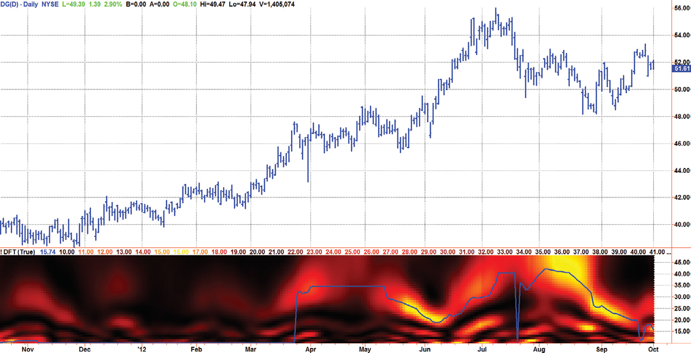
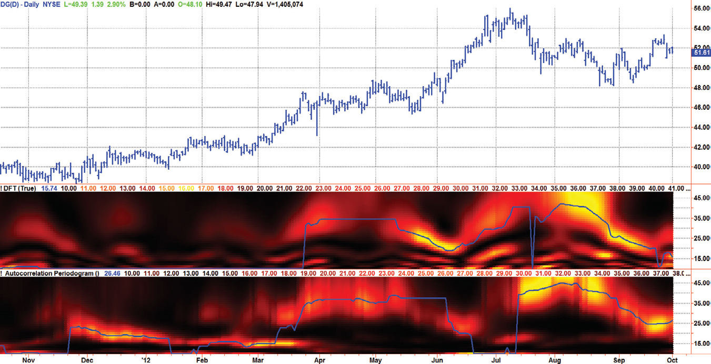

# Chapter 9: Adaptive Filters


## BibTeX

```bibtex
@InBook{ehlers2013cycle_ch9,
  author    = {Ehlers, John F.},
  title     = {Cycle Analytics for Traders: Advanced Technical Trading Concepts},
  chapter   = {9},
  chaptertitle = {Adaptive Filters},
  publisher = {Wiley},
  year      = {2013},
  series    = {Wiley Trading},
  isbn      = {9781118728604},
}
```

---

Fourier
Transforms
“The spectrum displays are colorful,” said Tom plainly.
I
n technical circles the term FFT (fast Fourier transform) is nearly synony-
mous with frequency measurement, and therefore the expectation is that
Fourier transforms would be the technique of choice to measure market
cycles. However, doing so means the violation of three basic requirements
of Fourier transforms. These requirements are:
1.	 The data sample used is a representative of an infinitely long string of
data.
2.	 The data must be stationary (unchanging characteristics) over the
­sample.
3.	 Only an integer number of cycles over the sample length can be ­analyzed
to avoid end effects in the analysis.
As we saw in Chapter 8, market cycles are evanescent. They come and go
and change periodicity. This fact alone is not consistent with requirements
1 and 2 above. Suppose we start with 64 bars of data. The smallest integer
number of cycles fitting in this data is one (a 64-bar cycle). The next shortest
allowable cycle period is 64 / 2 = 32 bar cycle because 2 is next largest inte-
ger number of allowed cycles. The next shortest allowed cycle period is 64 /
3 = 21.3 bars, and the next shortest is 64 / 4 = 16 bar cycle, and so on. The
shortest allowed cycle period is a two-bar cycle, because any shorter cycle
period violates the Nyquist sampling criteria of requiring at least two sam-
ples per cycle. The point is that it is unrealistic to expect a relatively short
12-bar market cycle to remain consistent in amplitude and frequency even

over a relatively short data sample of 64 bars. But even if the stationarity
constraint is met, the short data sample yields an extremely poor measure-
ment resolution. For example, the closest spectral lines between a 16-bar
cycle and a 21.3-bar cycle yield a resolution of 5 bars, or 31 percent relative
to the 16-bar cycle. The only way to improve the resolution is to increase the
length of the data sample, which exacerbates the problems with stationarity
and averaging out short-term results over the longer term. Further, increas-
ing the data length increases the latency of the measured result, further
contributing to lag.
Nonetheless, I have been able to bludgeon the technology by taking
liberal license with the mathematics to compute a Fourier transform that
produces a spectral estimate that is useful for traders. The approach is to
compute a moving discrete Fourier transform (DFT). Each computation
is a block calculation over the historical data window, and the entire block
computation is repeated for each succeeding bar of data. One of the tricks
used is to compute the DFT in terms of cycle period rather than in the
more conventional computation in terms of frequency. Traders can relate to
a 20-bar cycle period, but the equivalent 0.05 cycles per bar frequency has
no particular meaning. Another key feature to making the DFT usable is to
display the spectral estimate as a heat map.

## Spectral Dilation

It is obvious, once stated, that annual cycle swings are greater than ­monthly
cycle swings, that monthly cycle swings are greater than daily cycle swings,
and that daily cycle swings are greater than hourly cycle swings. This is
Spectral Dilation. Spectral Dilation is approximately linearly proportional
to the period of the cycle being considered. If one is seeking the dominant
cycle over a relatively small range of cycle periods, Spectral Dilation can
be ignored. However, if the dominant cycle is being extracted from data
containing several octaves of cycle periods, then fractal dilation must be
compensated in the computational process.
I discovered the necessity for Spectral Dilation compensation when cor-
relating the spectral results using the autocorrelation periodogram and the
DFT described in this chapter. The autocorrelation periodogram described
in Chapter 8 requires no compensation because the relative amplitudes of
the spectral components are extracted from the correlation waveforms that
are constrained to swing between −1 and +1. However, spectral ­components

Fourier Transforms
used in the computation of the DFT are subject to Spectral Dilation. There-
fore, Spectral Dilation compensation is required for a correct spectral esti-
mate using the DFT algorithm.

## Discrete Fourier Transform (DFT)

The DFT is accomplished by correlating the data with the cosine and sine
of each period of interest over the selected window period. The sum of the
squares of each of these correlated values represents the relative power at
each period from the familiar trigonometric equation:
A2 = A2sine2(x) + A2cosine2(x)
The code to compute the DFT is shown in Code Listing 9-1. The only
user input is whether to select Spectral Dilation compensation. The default
selection is to use the compensation. The default window length is 48 bars,
selected to be one full cycle period of the longest cycle period to be com-
puted. The arrays are sized for the longest cycle period’s being 48 bars. After
declaring the variables, the data are prefiltered in a high-pass filter having a
48-bar cutoff period to be consistent with our longest computed cycle pe-
riod and then smoothed in the SuperSmoother, described in Equation 3-3,
and having a 10-bar cutoff period to be consistent with the shortest cycle
period of interest.
EasyLanguage executes the entire code from top to bottom for each new
bar of data from oldest to newest. Computation of the DFT for each new
data bar starts by multiplying the data with a sine wave and a cosine wave,
respectively, divided by the period being calculated and summing the prod-
ucts over the window length. In this case, the window length was made to
be equal to the period of the longest cycle period to be computed. The sine
part and cosine part of the wave at each period are squared and summed
to compute the power at each period. The wave amplitude of each period
computation was divided by the value fractal dilation compensation. If the
spectral dilation compensation input is set to false, the wave amplitudes are
simply divided by 1, with the effect that there is no compensation.
In the next block of code, a fast attack−slow decay automatic gain control
(AGC) is used to normalize the spectral components and to minimize the
variance of the spectral power over time. The AGC concept was introduced
in Chapter 5 of this book; however, in this case, we are scaling on the basis of

power rather than on wave amplitude. Therefore, the correct decay factor is
the square root of 0.991, or 0.995. If the current power is greater than the
variable MaxPwr, then the variable MaxPwr is immediately set to the value of
the current power. However, if the current power is less than MaxPwr, then
the MaxPwr is allowed to decay to 0.995 of its previous value.
The dominant cycle is extracted from the spectral estimate in the next
block of code using a center-of-gravity (CG) algorithm. The CG algorithm
measures the average center of two-dimensional objects. It is computed by
summing the Y values and independently summing the X * Y values. Divid-
ing the latter by the former yields the average position along the X axis
where all the Y values reside. In the case of computing the dominant cycle,
the Y values are power and the X values are the periods. Thus, the algorithm
computes the average period at which the powers are centered. That is the
dominant cycle. The dominant cycle is a value that varies with time and can
be used to automatically tune other indicators such as the band-pass filter,
commodity channel index (CCI), relative strength index (RSI), Stochastic,
and so on.
The spectrum values vary between 0 and 1 after being normalized.
These values are converted to colors. When the spectrum is greater than
0.5 the colors combine red and green, with yellow being the result when
­spectrum = 1 and red being the result when the spectrum = 0.5. When the
spectrum is less than 0.5, the red saturation is decreased, with the result
that the color is black when spectrum = 0. Since the maximum value of the
spectrum is unity, I have included an optional block of code (which has been
commented out by the curly brackets) that provides additional visual resolu-
tion by raising the spectral components to a higher power. The selection of
the power to be used is arbitrary.

**Code Listing 9-1. EasyLanguage Code to Compute a DFT Spectral Estimate**

```easylanguage
{
Discrete Fourier Transform (DFT)
© 2013   John F. Ehlers
}
Inputs:
SpectralDilationCompensation(true);

Fourier Transforms
Vars:
alpha1(0),
HP(0),
a1(0),
b1(0),
c1(0),
c2(0),
c3(0),
Filt(0),
Period(0),
N(0),
M(0),
MaxPwr(0),
Comp(0),
Sp(0),
Spx(0),
DominantCycle(0),
Color1(0),
Color2(0);
//Arrays are sized to have a maximum Period of 48 bars
Arrays:
CosinePart[48](0),
SinePart[48](0),
Pwr[48](0);
//Highpass filter cyclic components whose periods are
shorter than 48 bars
alpha1 = (Cosine(.707*360 / 48) + Sine (.707*360 / 48) - 1) /
Cosine(.707*360 / 48);
HP = (1 - alpha1 / 2)*(1 - alpha1 / 2)*(Close - 2*Close[1] +
Close[2]) + 2*(1 - alpha1)*HP[1] - (1 - alpha1)*
(1 - alpha1)*HP[2];
//Smooth with a Super Smoother Filter
a1 = expvalue(-1.414*3.14159 / 10);
b1 = 2*a1*Cosine(1.414*180 / 10);
c2 = b1;
c3 = -a1*a1;
c1 = 1 - c2 - c3;
Filt = c1*(HP + HP[1]) / 2 + c2*Filt[1] + c3*Filt[2];
(Continued )

//This is the DFT
For Period = 10 to 48 Begin
Comp = Period;
If SpectralDilationCompensation = False Then Comp = 1;
CosinePart[Period] = 0;
SinePart[Period] = 0;
//Find Cosine and Sine correlated components, compensated
for fractal dilation
For N = 0 to 47 Begin
CosinePart[Period] = CosinePart[Period] +
Filt[N]*Cosine(360*N/Period) / Comp;
SinePart[Period] = SinePart[Period] +
Filt[N]*Sine(360*N/Period) / Comp;
End;
Pwr[Period] = CosinePart[Period]*CosinePart[Period] + Sine
Part[Period]*SinePart[Period];
End;
//Find Maximum Power Level for Normalization
MaxPwr = .995*MaxPwr[1];
For Period = 8 to 48 Begin
If Pwr[Period] > MaxPwr Then MaxPwr = Pwr[Period];
End;
//Normalize Power Levels and Convert to Decibels
For Period = 10 to 48 Begin
IF MaxPwr > 0 Then Pwr[Period] = Pwr[Period] / MaxPwr;
End;
//Compute the dominant cycle using the CG of the spectrum
Spx = 0;
Sp = 0;
For Period = 10 to 48 Begin
If Pwr[Period] >= .5 Then Begin
Spx = Spx + Period*Pwr[Period];
Sp = Sp + Pwr[Period];
End;
End;
If Sp <> 0 Then DominantCycle = Spx / Sp;
Plot2(DominantCycle, “DC”, RGB(0, 0, 255), 0, 2);

Fourier Transforms
{
//Increase Display Resolution by raising the NormPwr to a
higher mathematical power (optional)
For Period = 10 to 48 Begin
Pwr[Period] = Power(Pwr[Period], 3);
End;
}
//Plot the Spectrum as a Heatmap
For Period = 10 to 48 Begin
//Convert Power to RGB Color for Display
If Pwr[Period] >= .5 Then Begin
Color1 = 255;
Color2 = 255*(2*Pwr[Period] - 1);
End;
If Pwr[Period] < .5 Then Begin
Color1 = 255*2*Pwr[Period];
Color2 = 0;
End;
If Period = 10 Then Plot10(10, “S10”, RGB(Color1, Color2, 0),
0,4);
If Period = 11 Then Plot11(11, “S11”, RGB(Color1, Color2, 0),
0,4);
If Period = 12 Then Plot12(12, “S12”, RGB(Color1, Color2, 0),
0,4);
If Period = 13 Then Plot13(13, “S13”, RGB(Color1, Color2, 0),
0,4);
If Period = 14 Then Plot14(14, “S14”, RGB(Color1, Color2, 0),
0,4);
If Period = 15 Then Plot15(15, “S15”, RGB(Color1, Color2, 0),
0,4);
If Period = 16 Then Plot16(16, “S16”, RGB(Color1, Color2, 0),
0,4);
If Period = 17 Then Plot17(17, “S17”, RGB(Color1, Color2, 0),
0,4);
If Period = 18 Then Plot18(18, “S18”, RGB(Color1, Color2, 0),
0,4);
If Period = 19 Then Plot19(19, “S19”, RGB(Color1, Color2, 0),
0,4);
If Period = 20 Then Plot20(20, “S20”, RGB(Color1, Color2, 0),
0,4);
(Continued )

If Period = 21 Then Plot21(21, “S21”, RGB(Color1, Color2, 0),
0,4);
If Period = 22 Then Plot22(22, “S22”, RGB(Color1, Color2, 0),
0,4);
If Period = 23 Then Plot23(23, “S23”, RGB(Color1, Color2, 0),
0,4);
If Period = 24 Then Plot24(24, “S24”, RGB(Color1, Color2, 0),
0,4);
If Period = 25 Then Plot25(25, “S25”, RGB(Color1, Color2, 0),
0,4);
If Period = 26 Then Plot26(26, “S26”, RGB(Color1, Color2, 0),
0,4);
If Period = 27 Then Plot27(27, “S27”, RGB(Color1, Color2, 0),
0,4);
If Period = 28 Then Plot28(28, “S28”, RGB(Color1, Color2, 0),
0,4);
If Period = 29 Then Plot29(29, “S29”, RGB(Color1, Color2, 0),
0,4);
If Period = 30 Then Plot30(30, “S30”, RGB(Color1, Color2, 0),
0,4);
If Period = 31 Then Plot31(31, “S31”, RGB(Color1, Color2, 0),
0,4);
If Period = 32 Then Plot32(32, “S32”, RGB(Color1, Color2, 0),
0,4);
If Period = 33 Then Plot33(33, “S33”, RGB(Color1, Color2, 0),
0,4);
If Period = 34 Then Plot34(34, “S34”, RGB(Color1, Color2, 0),
0,4);
If Period = 35 Then Plot35(35, “S35”, RGB(Color1, Color2, 0),
0,4);
If Period = 36 Then Plot36(36, “S36”, RGB(Color1, Color2, 0),
0,4);
If Period = 37 Then Plot37(37, “S37”, RGB(Color1, Color2, 0),
0,4);
If Period = 38 Then Plot38(38, “S38”, RGB(Color1, Color2, 0),
0,4);
If Period = 39 Then Plot39(39, “S39”, RGB(Color1, Color2, 0),
0,4);
If Period = 40 Then Plot40(40, “S40”, RGB(Color1, Color2, 0),
0,4);
If Period = 41 Then Plot41(41, “S41”, RGB(Color1, Color2, 0),
0,4);
If Period = 42 Then Plot42(42, “S42”, RGB(Color1, Color2, 0),
0,4);

Fourier Transforms
If Period = 43 Then Plot43(43, “S43”, RGB(Color1, Color2, 0),
0,4);
If Period = 44 Then Plot44(44, “S44”, RGB(Color1, Color2, 0),
0,4);
If Period = 45 Then Plot45(45, “S45”, RGB(Color1, Color2, 0),
0,4);
If Period = 46 Then Plot46(46, “S46”, RGB(Color1, Color2, 0),
0,4);
If Period = 47 Then Plot47(47, “S47”, RGB(Color1, Color2, 0),
0,4);
If Period = 48 Then Plot48(48, “S48”, RGB(Color1, Color2, 0),
0,4);
End;
```

A sample computation and spectral display of the DFT is shown in
­Figure 9.1. Harmonic components are clearly present (at periods of half and
one-third the stronger dominant cycle period). Nonetheless, the spectral es-
timate compares favorably with the preferred autocorrelation periodogram,
as shown in Figure 9.2. This result is remarkable considering all the conces-
sions made to pure theory.



*Figure 9.1: An Example of a DFT Spectral Estimate*


## Key Points to Remember

1.	 The practical computation of a DFT for market data disregards theoreti-
cal requirements.
2.	 The DFT for traders is computed in terms of cycle period rather than
frequency for ease of interpretation.
3.	 The DFT calculation should include compensation for Spectral Dila-
tion.
4.	 The DFT results as computed in Figure 9.1 compare favorably with the
results of the autocorrelation periodogram.



*Figure 9.2: DFT Spectral Estimate Compares Favorably with an*

Autocorrelation Periodogram

