# Rocket Science Made Easy

**Digital Signal Processing applied to trading**

By Mel Dickover
Copyright September 2012

---

## Evolution of a trader

## Epiphany

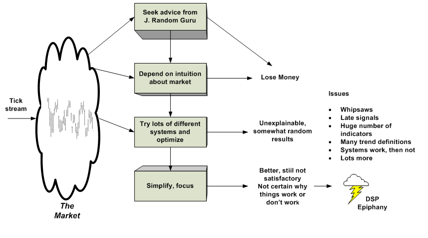

*From XKCD.com*

---

## Ehlers Cycle based Market Model explains

- The essential nature of the market, how to recognize when its nature changes, and how to find the most tradeable moves
- When not to trade, and why
- When to use what indicators, and why
  - what parameters to use in them, and why
- Where divergence comes from and what it means
- How to make indicators predictive, not lagging
- Why whipsaws happen, and how to avoid them
- Where patterns come from and the conditions that make patterns fail or succeed
- What using multiple time frames really means, and how to use them so they always improve your odds

---

## John Ehlers Market Assumptions

- The market moves in cycles, and in fact, in the absence of market events, moves are caused by cycles
- The principles and mathematics of Digital Signal Processing (DSP) were developed to analyze real world sensor signals, converted to digital form
  - A series of market ticks is a signal in digital form, so DSP can profitably used to analyze price data
- The most tradeable moves are those caused by that one cycle that stands out as the most important, the dominant cycle

---

## The John Ehlers Market Model


- Cycle
- Trend
- Model = Trend + Cycle

---

## Approach of the Ehlers Model

- Find the dominant cycle period, and using it
  - Calculate the trend
  - Calculate the cycle amplitude and phase
  - Calculate whether trend or cycle dominates – the market mode
  - Choose appropriate indicators for the current market mode, calculate the best parameters
  - Calculate Signal to Noise Ratio to determine tradability

---

## Ways to find the dominant cycle period

- Calculate Hilbert Period from price data
  - Ehlers books show the code for this
- Bank of band pass filters
  - Some people search a series of frequency bands
- MESA – Maximum Entropy Spectral Analysis
  - Algorithm developed by Burg in his 1975 PhD thesis. Geophysicists use it for oil exploration – gives usable results with as little as four data points.
- Spectrogram
  - Based on MESA or bank of filters

---

## Analyzing a Spectrogram

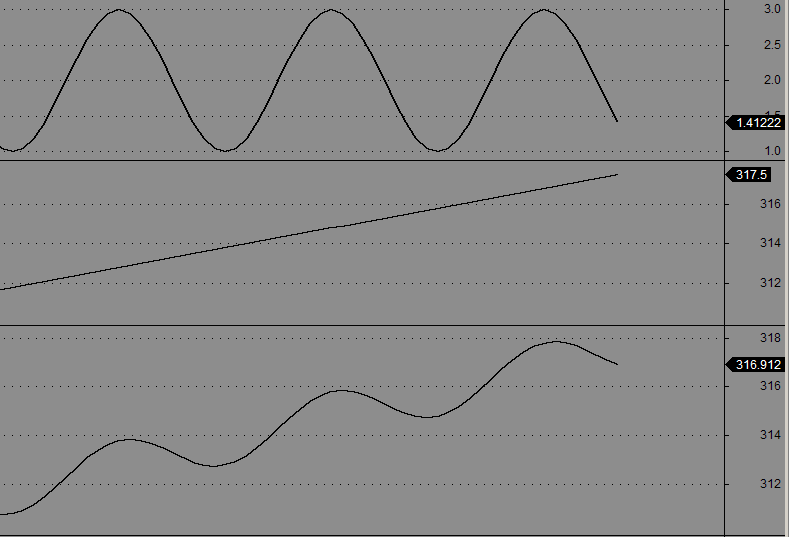

- Higher power, fuzzier
- Lower power, distinct

---

## The trouble with cycles

- Market events pluck the strings of the market, causing resonant standing waves
  - Eventually the wave dies out unless reinforced
  - Cycle periods change over time
  - Occasionally, no tradable cycles exist
- The dominant cycle, the one with the most amplitude, changes over time
  - May drift, appear and disappear, get fuzzy
  - For best trading, we want cycles whose energy is concentrated at one frequency (distinct), not spread across a wider band of frequencies (fuzzy)

---

## Extracting the Trend

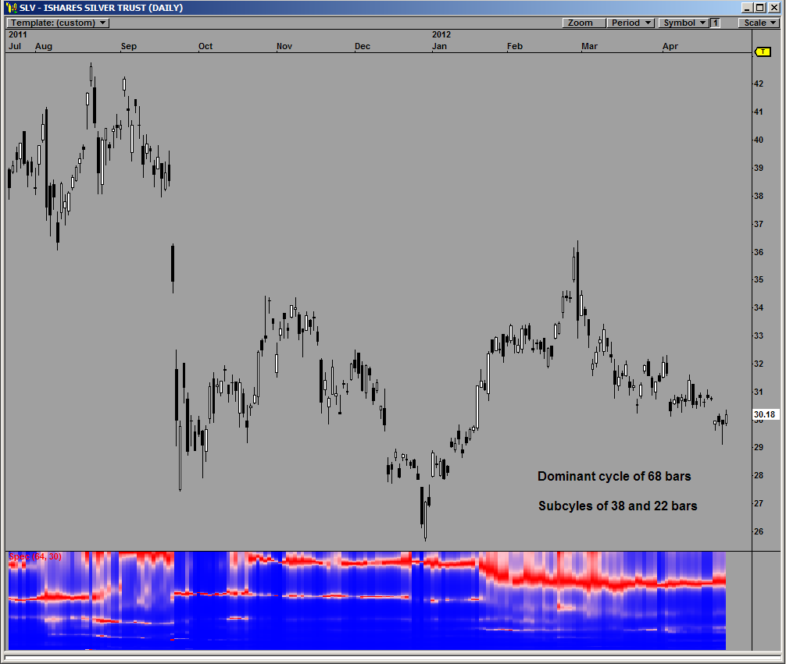

- Model
- Momentum

Price momentum over one cycle defines the slope (strength) of the trend

```
Slope = (price - price[bars in cycle]) / (bars in cycle)
```

---

## Extracting the cyclic component

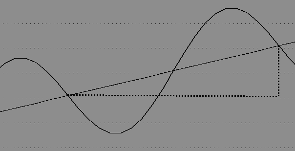

**Band Pass Filter**

Subtract a filter tuned above the desired frequency from one tuned below that frequency. Only the pure cyclic component, detrended, is left.

- Narrow band filter, selective, only sees dominant cycle frequency
- The further apart the two filter frequencies, the wider the band of frequencies that pass through.
- Wider band filter, sees multiple frequencies, summed up

---

## Extracting Amplitude and Phase

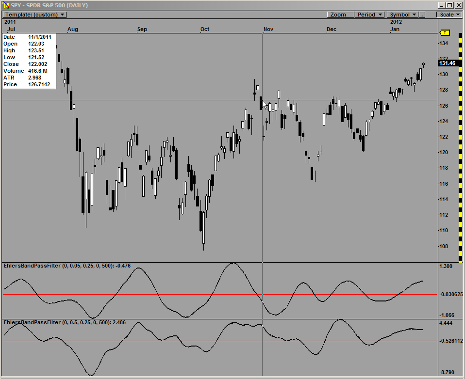

- Calculate the Phase and the Amplitude directly from the Bandpass Filter values
- Amplitude is proportional to time scale, i.e., weekly larger than daily

**Amplitude** – How large are the swings?
- Is the amplitude large enough compared to the stop to make the trade worthwhile?

**Phase** – Where are we in the cycle?
- Are you entering early enough in the cycle to get enough of the amplitude?
- Will your trailing stop tighten before the end of ½ cycle so you get out when you should?

---

## Market Mode: Cycling or Trending?

**Cycling:** amplitude > momentum
**Trending:** momentum > amplitude

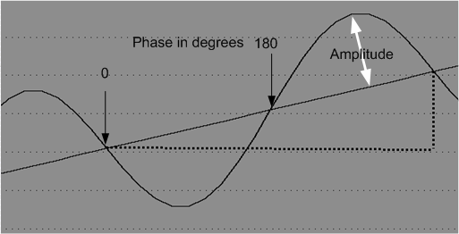

- Trending is a relationship between cycle amplitude and momentum slope – not an independent absolute thing
  - Trending or not, not "the trend"
- 100% trend would have no amplitude, thus no phase change, be a straight line

---

## Signal and Noise when Cycling

| S/N | S/N dB |
|-----|--------|
| 3   | 9.5    |
| 2.5 | 7.9    |
| 2   | 6      |
| 1.5 | 3.5    |

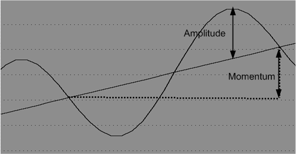

- Noisy
- Non-Time Based Charts do reduce noise

---

## Radio Analogy

- A symbol broadcasts on several frequencies,
- Occasionally a frequency drifts, changes, and gets stronger or weaker
- One frequency is the strongest and clearest – tune to that one
  - If you aren't right on the frequency, the signal is indistinct, hard to understand
  - Phase determines entries and exits, amplitude tells you how big moves are
- All Ehlers calculations exploit this analogy
  - Equivalent to tuning, filtering, and analysis of amplitude and frequency modulation

---

## Trading trends versus trading cycles

- If trending, use indicators like Ehlers moving average filter crossovers
  - Buy and hold, trade pullbacks and rallies in the direction of the trend
  - Do not take countertrend trades, since countertrend cyclic moves are swamped by trend momentum
- If cycling, use oscillators, Bollinger Bands, or Ehlers Sine Wave, pivots, support/resistance
  - Countertrend trades can work, since cyclic moves outweigh the weak trend
  - Tradeable cycles exist 15 to 30% of the time
- If noise dominates, avoid cyclic trading

---

## The trouble with Market Mode

- When market changes from cycling to trending or vice versa, there is at least a 1/2 cycle lag before you can recognize the mode has changed
  - In the meantime, you are whipsawed or you miss the start of a trend move
- Later in the presentation, we will explore a possible way to predict these shifts

---

## Trading trends with moving averages

- Most trend trading schemes have, at their root, moving averages or differences in moving averages
- Moving averages are, in the DSP view, low pass filters
  - Low pass filters attenuate short term variations and noise and let the rest through mostly unaffected
  - Short term means those with periods less than the filter period

---

## Moving averages are low pass filters

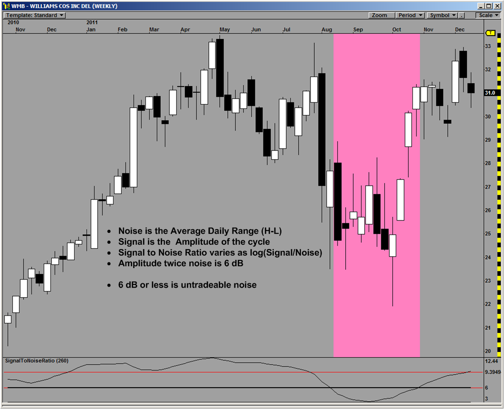

---

## The trouble with Moving Average filters

- Moving averages smooth the data and suffer lag
  - the more smoothing, the more lag
- SMAs and EMAs are unsatisfactory filters
  - Have ½ period lag, EMA requires about 3 times its period in bars to warm up and converge
  - Lagging filters are poor for decision making on the HRE (hard right edge) of the chart – get in late, get out late
  - The reason we use them is that they were easy to compute by hand before PCs were widespread
- Good filters require design tradeoffs
  - smoothing versus lag,
  - undesirable gain in noise versus reducing lag
  - attenuation of unwanted frequencies versus keeping the desired one

---

## Ehlers Filters for Trend Signals

- Goals of a good filter: trade-off lag and smoothing to
  - aggressively follow major price movements with minimal lag
  - achieve extraordinary smoothing in sideways markets
- Ehlers designed many very good filters
  - Ehlers Filter, Instantaneous Trend, Distance Coefficient Filter, FRAMA, MAMA, various Butterworth filters including Super Smooth Price, and others
  - All these filters are forms of moving averages, designed using DSP filtering principles
  - All are likely better than what you are now using

---

## Ehlers Instantaneous Trend Line

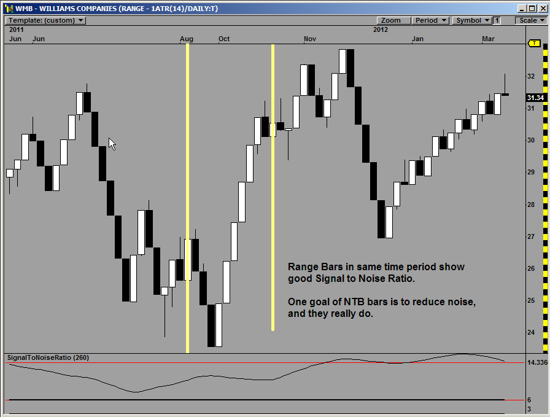

- Has zero lag
- Is extraordinarily smooth
- Responds to transients in about 7 bars

Ehlers created a predictive crossover signal that can be traded on the HRE of the chart by projecting forward with a EMA, smoothed to get rid of high frequency (2-4 bar) noise

---

## Trading Cycles with Oscillators

- The purpose of an oscillator:
  - Accurately reproduce the cyclic component of the dominant cycle so you can trade the price reversals
- Construct oscillators by:
  - Directly isolating the cyclic component of price
    - Ehlers BandPass Filter, CyberCycle, Sinewave
  - Measuring the momentum (price rate of change)
    - Momentum, Stochastic, RSI, MACD, CCI
    - Ehlers Awesome Oscillator, Relative Vigor Index, Center of Gravity

---

## The trouble with momentum oscillators

- Get badly timed signals unless the period parameter is set to directly synch with the cycle period
- We use up a lot of time trying to optimize to the correct indicator period settings, which are:
  - Stochastic and Momentum Oscillators — ½ DomCyc
  - CCI — DomCyc
  - MACD – Fast EMA — ½ DomCyc, Slow EMA — DomCyc
  - EMA, SMA, other standard MAs — ½ DomCyc
  - ATR period in loss stop — ½ DomCyc
- Heat Maps (Swami Charts) are an alternative
  - Display results using all periods at once

---

## Stochastic Heat Map example

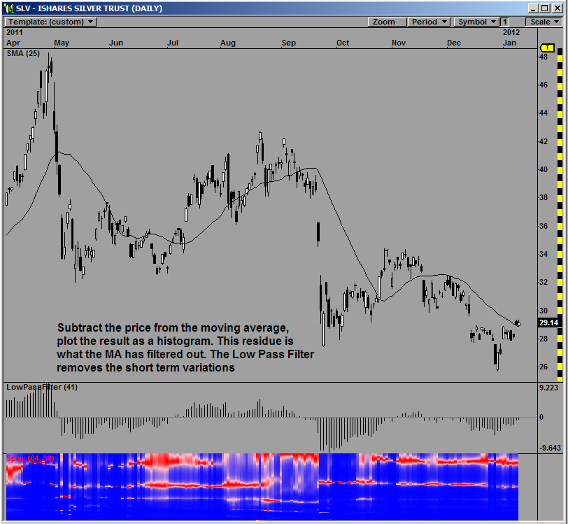

Stochastic is interesting because if period is too short you get whipsaws or get pinned at oversold/overbought, but if period is too long, it works well.

Every period from 12 to 50, 12 at bottom, 50 at top.

---

## Why ½ Cycle Momentum Oscillators?

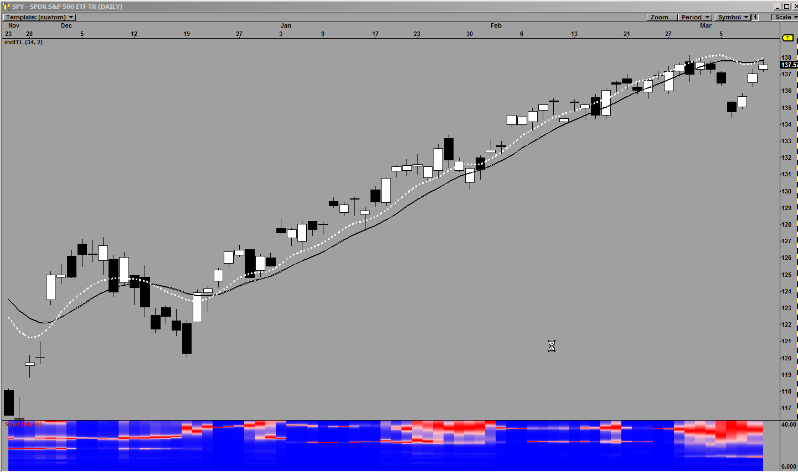

- 20 period sine wave price cycle
- 1 period (instantaneous) momentum, lags price by ¼ cycle — divergence
- 5 period momentum, still lags price, still creating divergence
- 10 period momentum (½ cycle) exactly reproduces the cycle, no divergence

---

## Meaningful Divergence?

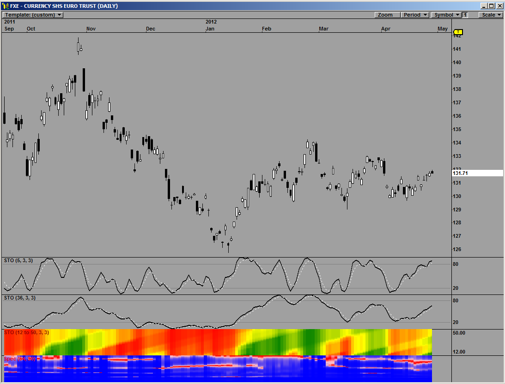

- What about peak to peak price and oscillator divergence?
- Can be seen in the oscillator tuned to the 10 period cycle
- Goes away in the oscillator tuned to the 50 period cycle
- No peaks in a band pass filter tuned to the 50 period cycle
- Divergence means you are not tuned in, unless it includes an independent variable like price-volume divergence

---

## Adaptive indicators

- Adaptive indicators always use the correct period, automatically
  - As the dominant cycle changes, the adaptive indicator keeps changing its period to match, or switches to a different dominant cycle
- Adaptive indicators eliminate
  - One class of bad signals
  - Optimization of the period parameter
  - An unnecessary degree of freedom
  - Some of the reason for using Heat Maps

---

## Fisher Transforms

- Price is not a Gaussian (Bell Curve) distribution, even though many technical analysis formulas falsely assume that it is. Bell Curve tails are missing.
  - If $10 stock were Gaussian, it could go up or down $20
  - Standard deviation based indicators like Bollinger Bands and zScore make the Gaussian assumption error
- The Fisher Transform converts almost any probability distribution in a Gaussian-like one
  - Expands the distribution and creates tails
- The Inverse Fisher Transform converts almost any probability distribution into a square wave
  - Compresses, removes low amplitude variations

---

## Fisher Transform of Price

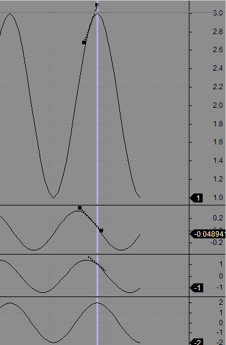

**Fisher Transform versus Bollinger Bands**

- With predictive white line, like an oscillator
- With 1 StDev bands, clearer breakouts

---

## Getting clearer momentum oscillator signals

- Take the Fisher Transform of the Stochastic of the oscillator
  - Gives a smoother indicator with fewer whipsaws
- Take the Inverse Fisher Transform of the oscillator
  - The oscillator is converted to something like a square wave – analogous to edge sharpening in image processing
  - Removes crossovers less than 2 dB in amplitude (the little whipsaw wiggles)

---

## Fisher Transforming the CCI

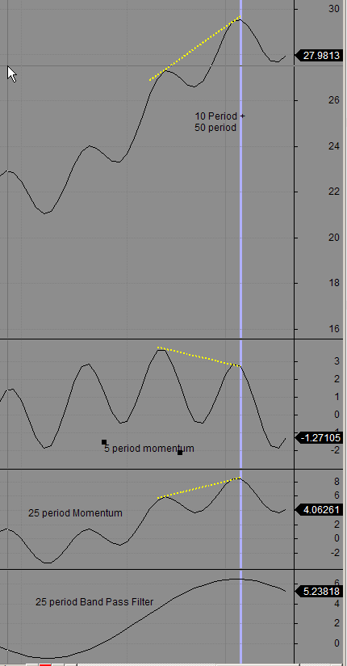

- Inverse Fisher Transform
- Fisher transform of Stochastic of CCI
- Stochastic of CCI
- Adaptive CCI

---

## Ehlers Sinewave Indicator

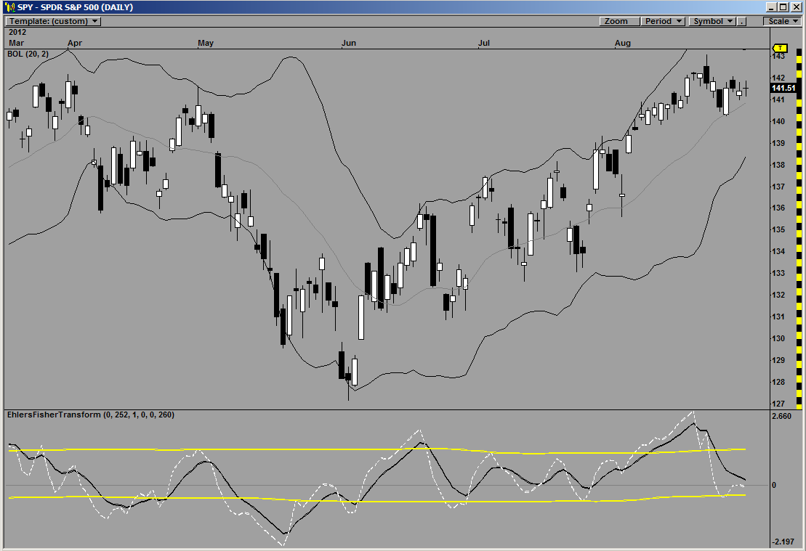

---

## Ehlers CyberCycle Oscillator

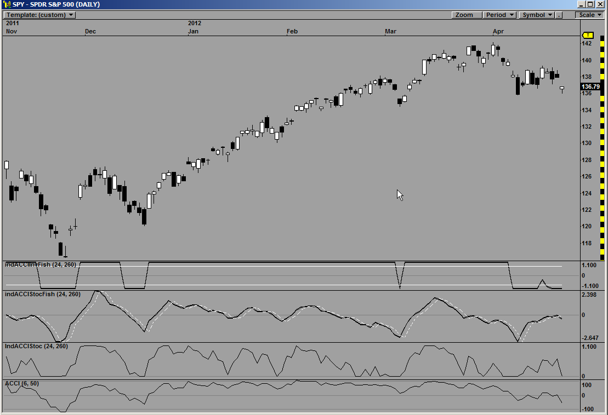

Subtract the pure trend component (Instant Trend Line) from the price, what's left is the cyclic component of price, the CyberCycle.

To get a 2 bar predictive crossover signal (white line) Ehlers subtracts ½ cycle period less 2 bars from the CyberCycle to create the proper phase shift.

---

## Are predictive indicators possible?

- "The Leading Indicator Myth" article in this month's Active Trader says nonsense because indicators are based on price and thus cannot lead price
  - price action is all
- Predictive indicators are possible if your model tells you why what is happening is happening, and what is likely to happen next
  - cycles do just that
- Trading without cycles is like playing billiards without understanding (as we do intuitively) Newton's Laws of Motion
  - We couldn't plan what would happen when we hit the ball, so our shots would be random

---

## Predictive, not lagging, indicators

- Profitable cycle trading requires anticipating the cycle turns and trend change
- Shift the phase of a pure cycle component indicator
  - Phase of Sinewave, CyberCycle, or Band Pass Filter can be shifted by `(360/DomCyc * leadBarsDesired)` degrees to get a predictive signal line for the HRE of the chart
- Add the EMA of the difference between price and its EMA to the original filter to get HRE usable crossover signals
  - Also works for momentum oscillators, normalized properly
  - Ehlers demonstrates this in his "Optimum Prediction Filters" article (TASC V13:6)
  - Simple to program, but the derivation is a complicated tradeoff between lag reduction and the resulting amplification of noise
  - Noise means a wiggly line on the HRE, making it hard to trade

---

## Quantifying Trending versus Cycling

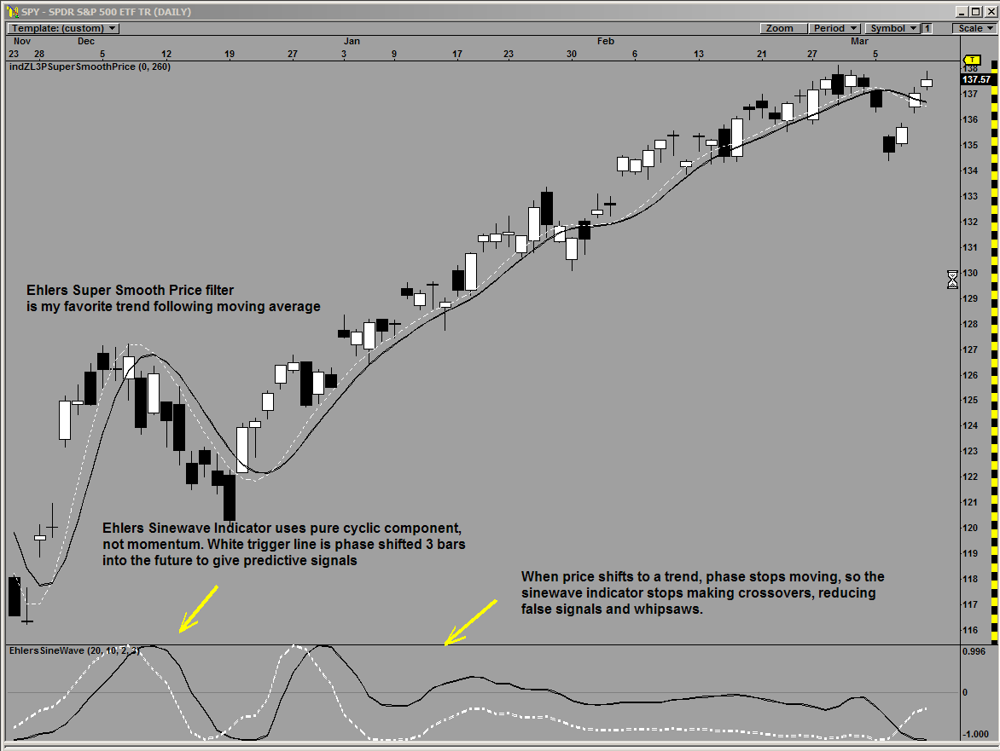

- Instantaneous Trend Line is colored line
- Zero Lag Kalman is white dotted line
- Zero lag Kalman filter should cross the Instantaneous Trend Line every ½ cycle. If not, trend has begun.
- Empirical Mode – cycling inside bands, trending outside
- Amplitude versus momentum

---

## The Model so far

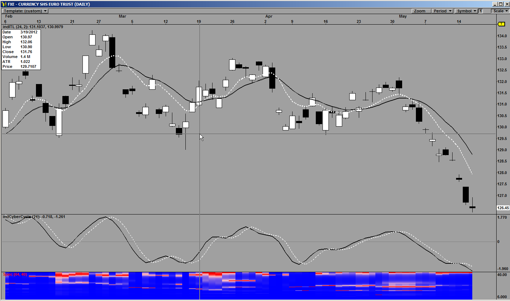

---

## Where do whipsaws come from?

- **Random**
  - A chance event in the market moves the price against us, and price hits our stop
- **Systemic**
  - Whipsaws that we cause by the way we trade
    - Cannot be blamed on random occurrences in the market
  - Most whipsaws are systemic

---

## Where do systemic whipsaws come from?

- Trading trend indicators when the market is cycling
  - Every cycle turn generates a crossover signal, not properly synced to the cycle the way an oscillator is
- Trading oscillators in a trending market
  - Every countertrend signal is a potential whipsaw
- Trading cycles in a low Signal-to-Noise Ratio market
  - Signals are random and generate whipsaws
- Trading with the wrong cycle period
  - Signals are inaccurate or just plain false
- Trading with stops that are too tight for the volatility of the market and the strategy being used

---

## Stops and Risk

- For any trading system, over an ensemble of trades, stop size controls the balance between the hit rate and the drawdown
  - There is always a best stop formula for your system, often based on volatility, always the result of a calculation based on your particular system parameters
  - Stops are not a matter of judgment
  - Stops are not a matter of personal risk tolerance
- Risk is controlled by position size
  - It is a costly mistake to try to control risk with stops
  - To avoid systemic whipsaws from stops, calculate the best stop setting, then:

```
position size = (desired risk in dollars) / abs(entry - stop)
```

---

## Where do patterns come from?

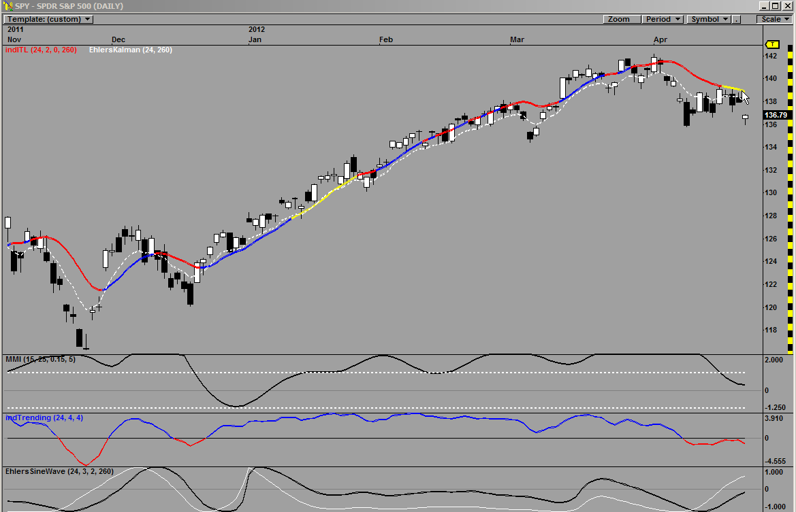

Start with an up trend → Add a sine wave → Get a channel with prices bouncing off trend lines, but the trend lines do not cause the bounce.

All price patterns can be constructed by superimposing different frequency and amplitude sine waves.

Patterns arise from the cycles we see in the Spectrogram.

---

## Head and Shoulders

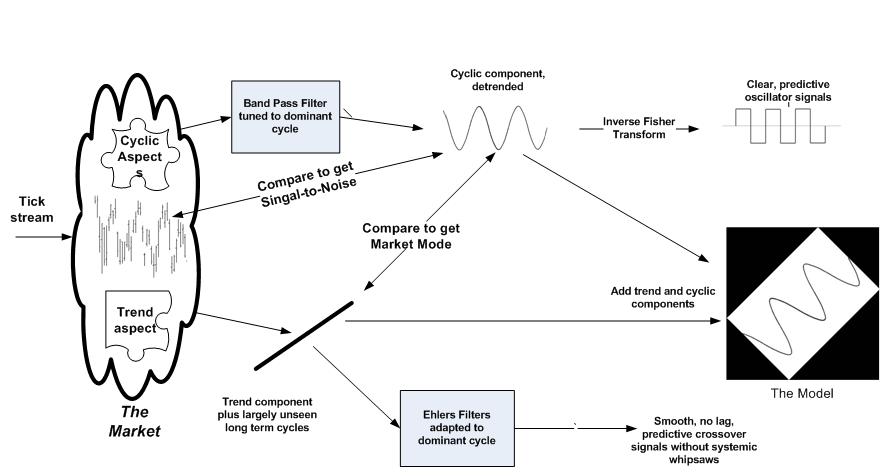

Start with our sine wave channel, add a longer period sine wave → Get a Head and Shoulders.

---

## Triangles and Double Tops

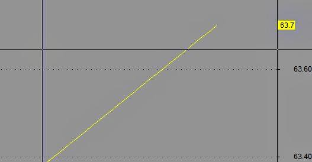

Add a third, higher frequency → Get Triangles and a Double Top.

Could go through all of Bulkowski's book of patterns this way. All the way to Elliot Waves.

Amazingly, the next pattern can be predicted by calculating with cycles.

---

## The reasons why patterns "fail"

- **Randomness**
  - Legitimate patterns are created by superimposing distinct cycles at different frequencies.
  - If there really are no significant cycles around the dominant cycle in the spectrum, the patterns you see are random occurrences, not legitimate, and ought not be traded.
- **Unknown Cause**
  - The standard pattern predictions are based on the statistical history of many pattern observations, not the underlying cyclic cause of each particular pattern instance
  - If the cycle superposition calculation says the price will go in a different direction than standard pattern probability interpretation, the pattern will "fail"
  - Cycle superposition is the unknown underlying cause – same visible chart pattern can arise from different cycles, and have different calculated directional results

---

## Is it Cycles or Psychology?

- What is the "real" explanation of patterns?
  - There are very compelling psychological explanations for each pattern
  - Cycles are real regardless of psychology – caused by seasonality, government schedules, system dynamics, etc.
- Is the truth that both are good models, like the wave and particle explanations of light?
  - Human pattern recognition while observing cyclic effects likely created the psychological technical analysis explanations
  - Expectations and disappointments based on psychology likely interact with cycles and cause them to amplify each other
- IMHO, advantage Cycles
  - Cycles give a testable quantitative explanation of why patterns arise, what pattern will come next, and whether it will "fail"
  - Psychological explanations are not easily testable and falsifiable

---

## Why do we use higher time frames?

- **Conventional wisdom:**
  - Since "The Trend is your Friend" then it follows that trading in the direction of the higher time frame trend improves your chances
- **DSP view:** Conventional wisdom is only partially true
  - A higher time frame is really just a longer wavelength cycle
    - 14 bar cycle on weekly chart is 70 bars on daily chart
  - A higher time frame (HTF) trend is actually a longer wavelength cycle's momentum slope
  - A trend move in the current time frame is a piece of the longer (HTF) wavelength's cyclic move up or down

---

## The HTF cycle and trend

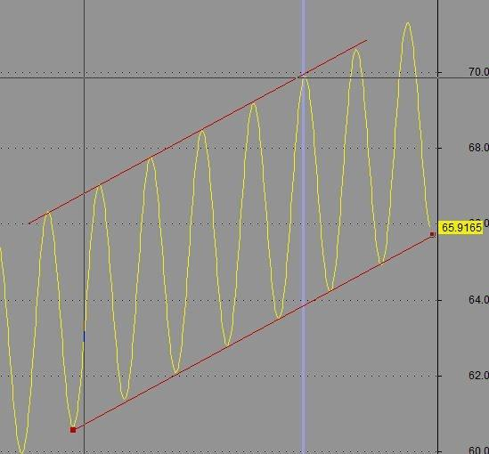

Cycle moves are a sine wave, so about 40% of the time they go up, 40% down, and the rest they slow down and change direction at the sine wave peaks and trough.

- 40% of the time, trading with the HTF trend helps, 40% it hurts, and 20% it doesn't matter

---

## The trouble with the HTF trend

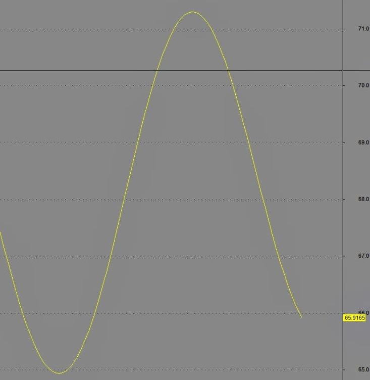

- Misses a lot of big moves
- Momentum shifts before the lagging trend indicator does when trend changes direction
- Trading in the direction of the HTF trend but against the HTF momentum makes things worse

---

## Momentum versus Trend

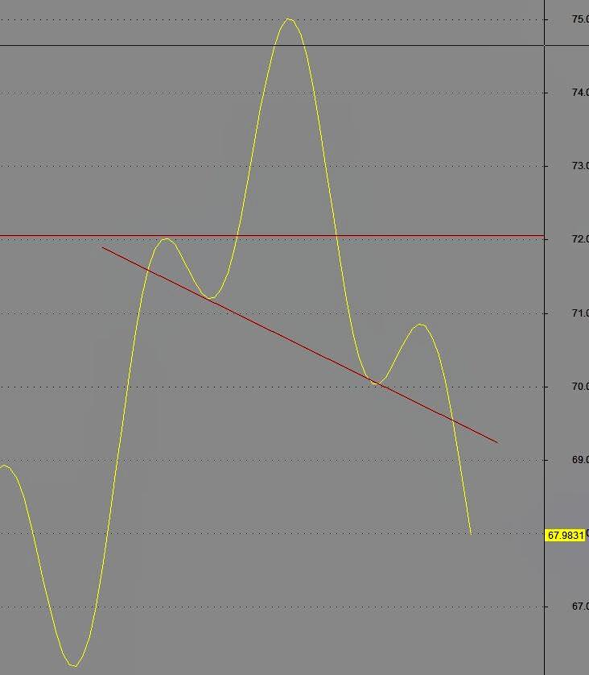

You are much better off trading with HTF momentum than you are trading with the HTF trend.

HTF momentum gives you warning that a trend may be starting at the lower time frame, if it is tuned in.

- Tuned to shorter cycle
- Tuned to longer cycle

**The trend may be your friend, but the momentum is your mistress.**

---

## Band Pass Filter perspective

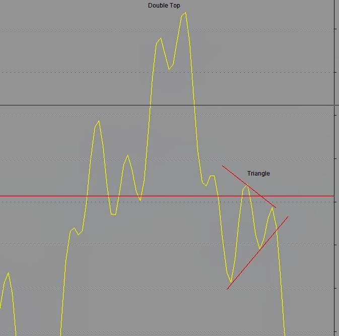

Band Pass Filter tuned to the longer cycle.

---

## Hurst Cycle Trading and Ehlers

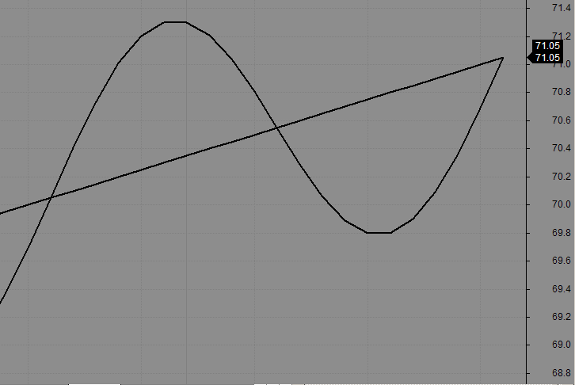

- Shifted MAs to remove lag, graphically projected future
- Two different cycle lengths, trade the shorter in the direction of the longer
- Hurst always traded in the direction of HTF momentum, as seen in the pseudo-cyclic component he derived from price movement

Like Ehlers, Hurst assumed cycles, found "stable" cycles, assumed they would persist, and used shifted MAs in place of oscillators. A graphical approach since there were no PCs then.

---

## Did I explain them all?

- The essential nature of the market, how to recognize when its nature changes, and how to find the most tradeable moves
- When not to trade, and why
- When to use what indicators, and why
  - what parameters to use in them, and why
- Where divergence comes from and what it means
- How to make indicators predictive, not lagging
- Why whipsaws happen, and how to avoid them
- Where patterns come from and the conditions that make patterns fail or succeed
- What using multiple time frames really means, and how to use them so they always improve your odds

---

## Significance of Ehlers Market Model Theory

- Ehlers Market Model is a drastic simplification, yet
  - Explains all the phenomena we promised to explain
  - Explains why as well as what and how, when and when not
  - Its underlying assumptions are explicit, and you can calculate whether they hold or not
  - It is testable, not subjective
- **Limitations**
  - A tradable dominant cycle must exist
  - Lag to determine changes Trend/Cycle and S/N
  - No way to predict or explain why cycles come and go, or when market events will occur

---

## Ehlers Model versus the rest

- **Periodic Table versus Fire, Air, Earth, and Water**
  - There are market models based on pivot points, market profiles, news, psychology, astrology, and Elliot Waves, probability, as well as proprietary "black box" models
- System starts or stops working. Why?
  - "Market changed" is not an explanation any more than saying "the gods frowned" or "I got the evil eye"
    - Explains everything, predicts nothing
  - What are the real reasons that systems start or stop working?

---

## The Real Reasons

- The system may unknowingly depend upon assumptions about the market that currently do not hold
  - Depending on your point of view
    - the market really did change, or,
    - the model is only a partial description of the market, making assumptions that sometimes hold, sometimes do not
- It may be luck
- There may be a bug in the system design or implementation
- The system may be based on the logical fallacy that correlation implies causation. It does not.
  - *The more firemen fighting a fire, the bigger the fire is observed to be. Therefore, firemen cause an increase in fire.*
  - *As ice cream sales increase, the rate of drowning deaths increases sharply. Therefore, ice cream consumption causes drowning.*

---

## Correlation versus Causation

- We usually build systems and strategies based on correlations we recognize in patterns or in data mining
  - May have built an excellent model of the past that does not have much predictive power going forward. If it doesn't hold in the future, it does not mean that the "market changed."
  - Unless you have a model with a falsifiable hypothesis as the basis of the system, you assume that correlation implies causality. This is statistically just not true.
- We deserve a model (theory) that makes testable predictions
- Ehlers' approach puts forth testable hypotheses – it supports the scientific method.
  - As a model to explain market behavior, it is way ahead of whatever model is in second place.

---

## Remember

> With great power comes great current squared times resistance
>
> — Ohm (via Randall Munroe of XKCD)

---

## References

- [www.mesasoftware.com](http://www.mesasoftware.com) (Ehlers website)
  - Papers and presentations for download
  - Software for sale
- **Books by John Ehlers**
  - *Rocket Science for Traders: Digital Signal Processing Applications*
  - *MESA and Trading Market Cycles: Forecasting and Trading Strategies from the Creator of MESA*
  - *Cybernetic Analysis for Stocks and Futures: Cutting-Edge DSP Technology to Improve Your Trading*
- *The Psychology of Technical Analysis* by Tony Plummer
- *The Profit Magic of Stock Transaction Timing* by J.M. Hurst
