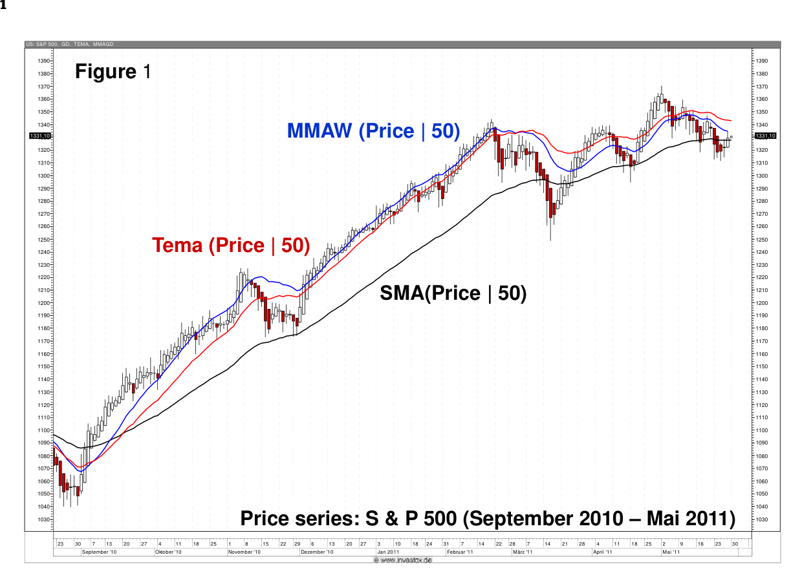
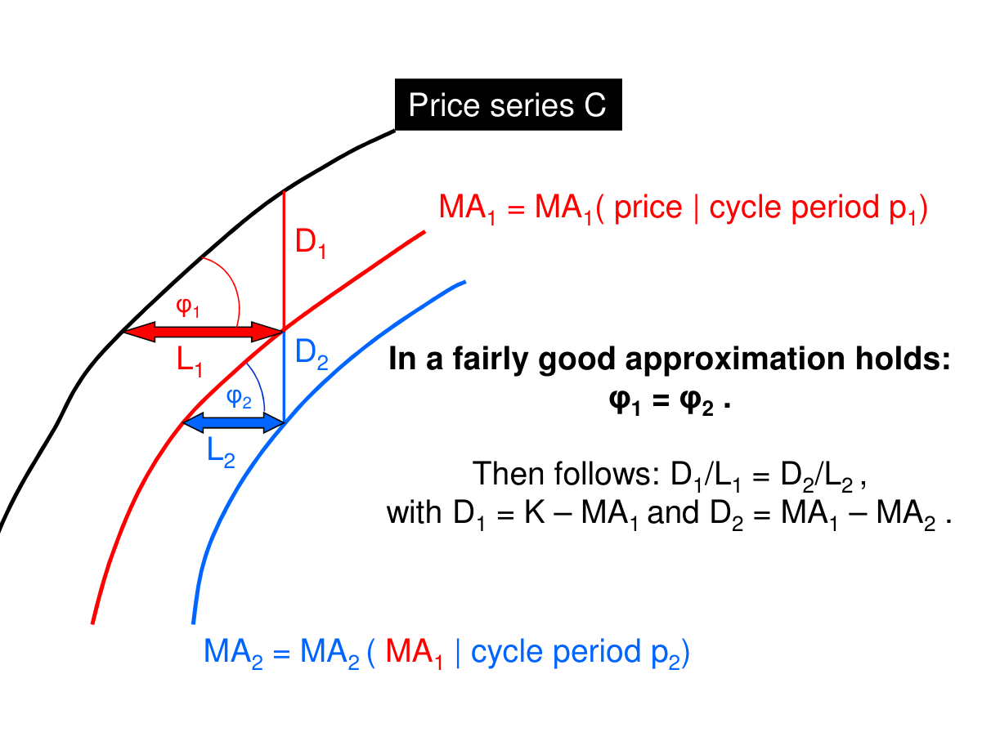
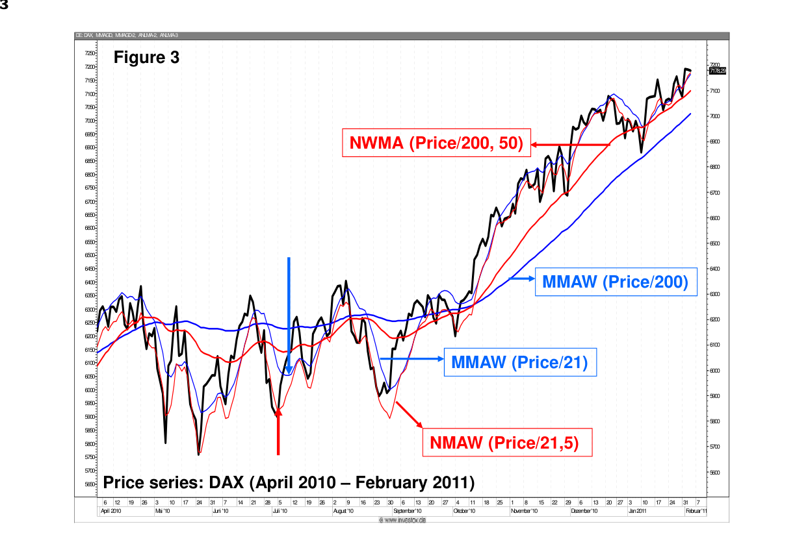
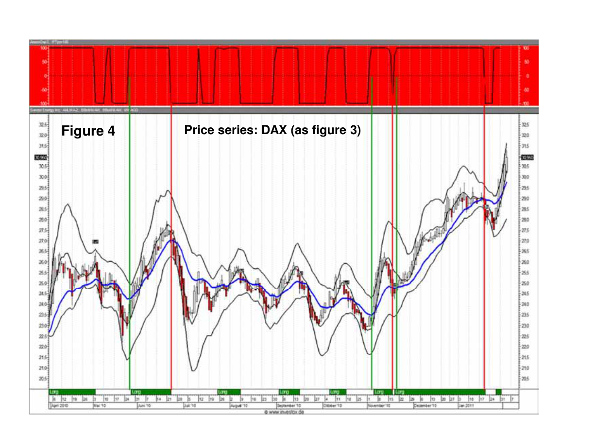
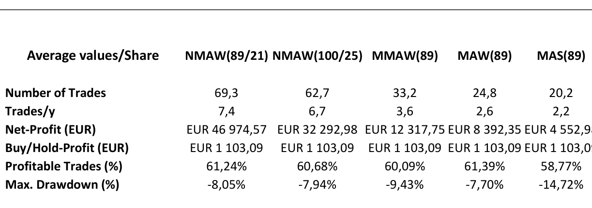
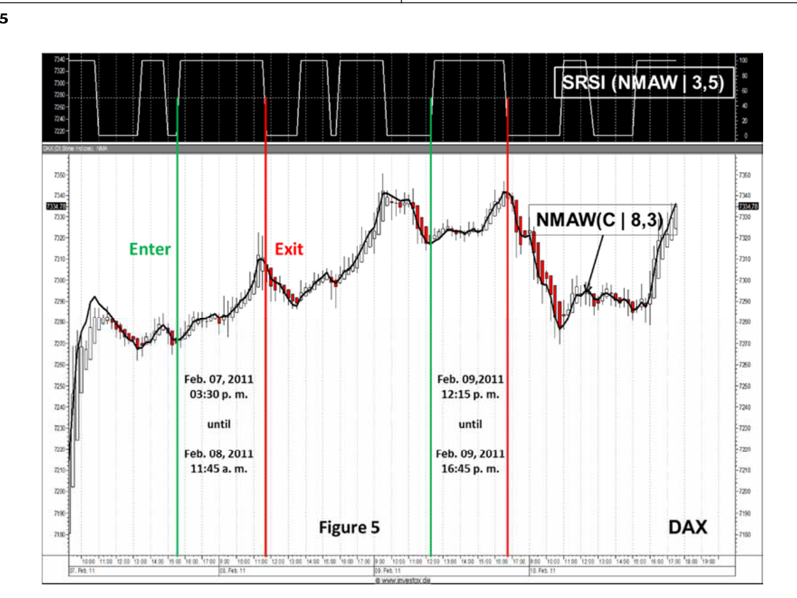

# Moving Averages 3.0

**by Manfred G. Dürschner**

## Abstract

The well-known Moving Averages (MA), namely the Simple Moving Average (SMA), the Exponential Moving Average (EMA) and the Weighted Moving Average (WMA), are modified in this paper with the help of the Nyquist Criterion. These modified Moving Averages 3.0 show good smoothing characteristics, illustrate relevant trends and trend reversals in price series without a time lag as far as calculated. With regard to smoothing, trend patterns and time lag bring about a significant improvement on conventional SMA (Moving Averages 1.0: SMA, EMA and WMA). In addition to this, the efficiency of the Moving Averages 3.0 is demonstrated by applying several tests and a simple trading system.

## Introduction

In Technical Analysis: SMA are the most widely used indicators. Applied to a price series, the market situation described as a fluctuating price pattern is then smoothed as the chaotic price fluctuations are smoothed out. Smoothing is the most valued advantage of a Moving Average (MA). The fluctuations of price movements are replicated in smoother and clearer patterns. Yet smoothing cannot avoid the main drawback of SMA: a time lag between the pattern of the price series and a MA itself. This can clearly be seen if you consider trend reversals. The reversal of a MA lags behind that of the price series.

The lags for the different SMA with a cycle period $n$ are calculated as follows [1]:

- SMA: $\text{lag} = (n - 1)/2$,
- EMA: $\text{lag} = 1/a - 1$, for $a = 2/(n+1)$, we get the same result as for the SMA,
- WMA: $\text{lag} = (n - 1)/3$.

It is noticeable that the WMA shows the smallest lag.

## Approaches to reduce time lag

In 1994, Patrick Mulloy made an innovative approach to reduce the lag [2]. According to the following expression:

$$\text{TEMA} = 3 \cdot \text{EMA} - 3 \cdot \text{EMA}[\text{EMA}] + \text{EMA}[\text{EMA}(\text{EMA})]$$

He applied a EMA once and twice to itself and combined the results with the original EMA.

In 2001, John F. Ehlers made a more general attempt for a MA with reduced lag [3]. It runs:

$$\text{MMA} = 2 \cdot \text{MA}[\text{price} \mid \text{cycle period } n] - \text{MA}[\text{MA} \mid \text{cycle period } n]$$

Ehlers used a MA (SMA, EMA or WMA) and applied this MA a second time to itself. This result MA[MA] is subtracted from the MA multiplied by the factor 2. The MA modified in this way (notation MMA) is compared with the TEMA in Figure 1 (price series S&P 500; as MA an EMA is used with a 50 days period; Ehlers' MEMA: red line; TEMA: blue line). Ehlers' simpler relation shows almost the same result as the TEMA as far as the trend reversals are concerned. Both MAs are comparable as to their smoothing behavior. In both MAs -- MEMA and TEMA -- there is a clear improvement concerning lag compared to EMA (black line).



*Figure 1: Price series S&P 500 (September 2010 -- May 2011). Comparison of SMA(Price | 50), TEMA(Price | 50) and MMAW(Price | 50).*

In the two approaches a MA is applied to a price series and to itself. If one considers the price series and the MA in a general way as a time-dependent time series, the application of a MA to a MA as a sampling procedure and takes findings from the field of signal processing, it can be deduced that the application of a MA to itself (as to MMA and TEMA, see above) is at best only approximately correct. This can be substantially improved by the Nyquist Criterion.

## Nyquist Criterion

In signal processing theory, the application of a MA to itself can be seen as a Sampling procedure. The sampled signal is the MA (referred to as $\text{MA}_1$) and the sampling signal is the MA as well (referred to as $\text{MA}_2$). If additional periodic cycles which are not included in the price series are to be avoided sampling must obey the Nyquist Criterion [1, 4].

With the cycle period as parameter, the usual one in Technical Analysis, the Nyquist Criterion reads as follows:

$$n_1 = \lambda \cdot n_2 , \quad \text{with } \lambda \geq 2.$$

$n_1$ is the cycle period of the sampled signal to which a sampling signal with cycle period $n_2$ is applied. $n_1$ must at least be twice as large as $n_2$. In Mulloy's and Ehlers' approaches (referred to as Moving Averages 2.0) both cycle periods are equal.

## Moving Averages 3.0

Using the Nyquist Criterion there is a relation by which the application of a MA to itself can be described more precisely. In Figure 2 a price series $C$ (black line), one MA ($\text{MA}_1$, red line) with lag $L_1$ to the price series and another MA with lag $L_2$ to $\text{MA}_1$ ($\text{MA}_2$, blue line) are illustrated. Based on the approximation and the relations described in Figure 2 the following equation holds:

$$\frac{D_1}{D_2} = \frac{C - \text{MA}_1}{\text{MA}_1 - \text{MA}_2} = \frac{L_1}{L_2} \tag{1}$$



*Figure 2: Geometric derivation of the NMA formula. In a fairly good approximation: $\varphi_1 = \varphi_2$. Then follows: $D_1/L_1 = D_2/L_2$, with $D_1 = C - \text{MA}_1$ and $D_2 = \text{MA}_1 - \text{MA}_2$.*

According to the lag formulas in the introduction $L_1/L_2$ can be written as follows:

$$\alpha := \frac{L_1}{L_2} = \frac{n_1 - 1}{n_2 - 1}$$

In this expression denominator 2 for the SMA and EMA as well as denominator 3 for the WMA are missing. $\alpha$ is therefore valid for all three MAs. Using the Nyquist Criterion one gets for $\alpha$ the following result:

$$\alpha = \frac{\lambda \cdot (n_1 - 1)}{n_1 - \lambda} \tag{2}$$

$\alpha$ put in (1) and $C$ replaced by the approximation term NMA, the notation for the new MA, one gets:

$$\text{NMA} = (1 + \alpha) \cdot \text{MA}_1 - \alpha \cdot \text{MA}_2$$

In detail, equation (2) reads as follows:

$$\text{NMA}[\text{price} \mid n_1, n_2] = (1 + \alpha) \cdot \text{MA}_1[\text{price} \mid n_1] - \alpha \cdot \text{MA}_2[\text{MA}_1 \mid n_2] \tag{3}$$

$$\alpha = \frac{\lambda \cdot (n_1 - 1)}{n_1 - \lambda}, \quad \text{with } \lambda \geq 2 \tag{4}$$

(3) and (4) are equations for a group of MAs (notation: Moving Averages 3.0). They are independent of the choice of an MA. As the WMA shows the smallest lag (see introduction), it should generally be the first choice for the NMA.

$n_1 = n_2$ results in the value 1 for $\alpha$ and $\lambda$, respectively. Then equation (3) passes into Ehlers' formula. Thus Ehlers' formula is included in the NMA formula as limiting value. It follows from a short calculation that the lag for NMA results in a theoretical value zero.

## Test of NMA

In Figure 3 a New Weighted Moving Average (NWMA) (a WMA is used for the MA) is compared with Ehlers' MWMA. In both cases a WMA with the cycle periods 21 and 200 days, respectively was chosen. In addition, a short period is necessary for the NWMA: 5 days ($\lambda = 4.2$, 21-day NWMA) and 50 days ($\lambda = 4$, 200-day NWMA). The German index DAX stands for the price series as an example.

From Figure 3 you will see:

- The NWMA is significantly closer to the price series than the MWMA.
- The long-term trend of the 200-day NWMA is precise and close to the price series.
- The distinct trend reversals of the 21-day NWMA are described much more precisely than by the MWMA, and the lag of the NWMA against the price series comes to less than two days.
- In case of 21-day cycle period the NWMA shows a lag which is 3 days shorter than that of the MWMA (compare the two colored arrows).



*Figure 3: Price series DAX (April 2010 -- February 2011). Comparison of MMAW and NWMA with cycle periods 21 and 200 days.*

In summary, it can be concluded that the Moving Averages 3.0 on the basis of the Nyquist Criterion bring about a significant improvement compared with the Moving Averages 2.0 and 1.0. Additionally, the efficiency of the Moving Averages 3.0 can be proven in the result of a trading system with NWMA as basis.

## Trading system based on NWMA

The trading system consists of one technical indicator, but with some significant details:

- The indicator is the Aroon-Oscillator (AO), which is defined as the difference between the Aroon up and Aroon down.
- The AO is not applied to a price series but to a NWMA applied to the price series: $\text{NWMA}[\text{price series} \mid n_1, n_2]$.
- Cycle periods for the NWMA are $n_1 = 89$ days and $n_2 = 21$ days ($\lambda = 4.2$).
- Cycle period for the AO is 5 days: $\text{AO}[\text{NWMA} \mid 5]$.
- An Inverse Fisher Transformation (IFT) is applied to the AO: $\text{IFT}[\text{AO}]$.
- The IFT digitizes the AO without lag.
- Settings: Buy $\text{IFT} > 0$, sell $\text{IFT} < 0$.

In Figure 4 you can recognize the trading system: in the upper, red field the digitized AO, and in the lower part of the chart the price series represented by Heikin-Ashi-Candlesticks and the Bollinger Bands. The purpose of the Heikin-Ashi-Candlesticks and the Bollinger Bands is to visually monitor trends and volatility. Long-trades are indicated by the green horizontal bars in the lower part of the chart. For examples, three trades are marked by green (enter) and red (exit) vertical lines.



*Figure 4: Price series DAX (as Figure 3). Trading system with NWMA-based Aroon Oscillator and Inverse Fisher Transformation.*

Furthermore, the trading system described was compared with systems which use other MAs instead of the $\text{NWMA}[\text{price series} \mid 89, 21]$ (see above). The following modifications were tested for comparison (no changes due to settings):

- $\text{NWMA}[\text{price series} \mid 100, 25]$,
- $\text{MWMA}[\text{price series} \mid 89]$,
- $\text{WMA}[\text{price series} \mid 89]$,
- $\text{SMA}[\text{price series} \mid 89]$.

The first modification is meant to be a stability test for the $\text{NWMA}[\text{price series} \mid 89, 21]$ system and the further modifications should be compared with Ehlers' approach and the standard moving averages WMA and SMA.

The trading system described was tested with 104 selected shares (Europe, USA and Asia, and 18 different sectors according to DJ Sector Titans) and submitted to a backtesting (Software: Investox, Version 5.9.4). The following data were chosen:

- Covered period: January 03, 2000 -- January 31, 2011,
- Seed capital/share: EUR 1,000,
- Enter-expenses 0.3% per trade as well as for exit-expenses and slippage.

After each trade closed, all capital available was reinvested. The results of average values per share are presented in tabular form (see Table 1):

- The NWMA trading system shows the highest net profit.
- Compared with a buy-and-hold-strategy the NWMA trading system described is significantly more profitable over others.
- The drawdown numbers of the different trading systems differ only slightly, with the exception of the SMA-system.
- Due to the net profit the NWMA trading system has the best drawdown.
- The largest profit together with the highest number of profitable trades of the NWMA trading system can be explained by its quick reaction and the minimal lag of the NWMA.

| Average values/Share | NMAW(89/21) | NMAW(100/25) | MMAW(89) | MAW(89) | MAS(89) |
|---|---|---|---|---|---|
| Number of Trades | 69.3 | 62.7 | 33.2 | 24.8 | 20.2 |
| Trades/y | 7.4 | 6.7 | 3.6 | 2.6 | 2.2 |
| Net-Profit (EUR) | 46,974.57 | 32,292.98 | 12,317.75 | 8,392.35 | 4,552.98 |
| Buy/Hold-Profit (EUR) | 1,103.09 | 1,103.09 | 1,103.09 | 1,103.09 | 1,103.09 |
| Profitable Trades (%) | 61.24% | 60.68% | 60.09% | 61.39% | 58.77% |
| Max. Drawdown (%) | −8.05% | −7.94% | −9.43% | −7.70% | −14.72% |

*Table 1: Backtesting results -- average values per share for different trading systems.*



## Conclusion

The group of Moving Averages 3.0 is a significant improvement over conventional Moving Averages 1.0 (SMA, EMA and WMA) and the well-known approaches to reduce time lags (Moving Averages 2.0). The NMA is suitable for intraday trading as well. A system with a Stochastic-RSI-Indicator (cycle periods 3 and 5) applied to a NWMA (cycle periods 8 and 3), time base 15 minutes, shows profitable trades, too (see Figure 5 with two trades as an example).



*Figure 5: Intraday trading example with Stochastic-RSI-Indicator applied to NWMA.*

## References

1. John F. Ehlers: *Rocket Science for Traders* (John Wiley & Sons, 2001)
2. Patrick Mulloy: *Stocks & Commodities Magazine* (February 1994)
3. John F. Ehlers: *Signal Analysis Concepts* (Internet, 2001)
4. Wikipedia: Nyquist--Shannon Criterion

## BibTeX

```bibtex
@Article{durschner2012moving,
  author    = {Dürschner, Manfred G.},
  title     = {Moving Averages 3.0},
  journal   = {IFTA Journal},
  year      = {2012},
  volume    = {12},
  pages     = {27--31},
  publisher = {International Federation of Technical Analysts},
  url       = {https://www.ifta.org/assets/docs/d_ifta_journal_12.pdf},
}
```
