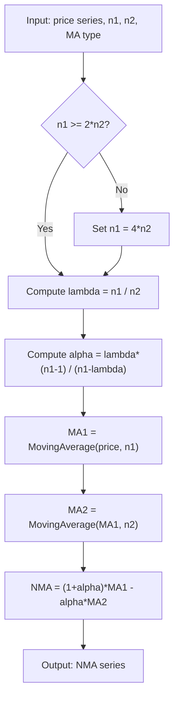

# New Moving Average (NMA)

## Overview

The **New Moving Average (NMA)**, also called **New Weighted Moving Average (NWMA)**, is a lag-free smoothing technique developed by Dr. Manfred G. Dürschner and published as "Moving Averages 3.0" in the IFTA Journal (2011). The method applies the Nyquist-Shannon sampling theorem to moving average design: by cascading two moving averages whose period ratio satisfies the Nyquist criterion ($\lambda = n_1/n_2 \geq 2$), the resulting lag can be extrapolated away geometrically.

## Principles

### The Lag Problem

Every moving average introduces a time delay (lag) proportional to its period. For a simple moving average of period $n$, the lag is approximately $(n-1)/2$ bars. This lag causes signals to arrive late, degrading trading system performance.

### Geometric Extrapolation

Dürschner's key insight is geometric. Consider two moving averages applied in series:

1. $\text{MA}_1$ with period $n_1$ — applied directly to price, producing lag $L_1$
2. $\text{MA}_2$ with period $n_2$ — applied to the output of $\text{MA}_1$, producing additional lag $L_2$

At any point in time, price $P$, $\text{MA}_1$, and $\text{MA}_2$ form three points on a line (approximately). By similar triangles, the current price can be extrapolated from the two MA values:

$$P \approx (1 + \alpha) \cdot \text{MA}_1 - \alpha \cdot \text{MA}_2$$

where $\alpha = L_1 / L_2$ is the ratio of their lags.

### The Nyquist Constraint

Applying a moving average to already-smoothed data is a form of resampling. The Nyquist-Shannon theorem requires the sampling rate to be at least twice the highest frequency present in the signal. In moving-average terms, this means the primary period must be at least twice the secondary period:

$$\lambda = \frac{n_1}{n_2} \geq 2$$

When this constraint is violated ($n_1 = n_2$, i.e., $\lambda = 1$), $\alpha$ becomes 1 and the formula degenerates to Ehlers' MMA ("Moving Averages 2.0"), which is a special — suboptimal — case.

## Formulas

### Core NMA Formula (Dürschner, Equations 3 & 4)

$$\text{NMA}[\text{price} \mid n_1, n_2] = (1 + \alpha) \cdot \text{MA}_1[\text{price} \mid n_1] - \alpha \cdot \text{MA}_2[\text{MA}_1 \mid n_2]$$

where:

$$\alpha = \frac{\lambda \cdot (n_1 - 1)}{n_1 - \lambda}, \quad \lambda = \left\lfloor \frac{n_1}{n_2} \right\rfloor \geq 2$$

### Lag

The theoretical lag of NMA is **zero** — the extrapolation exactly compensates the combined lag of both filters.

### Recommended MA Type

Dürschner recommends the **Linear Weighted Moving Average (LWMA)** as the first choice for both $\text{MA}_1$ and $\text{MA}_2$ due to its smallest lag among common MA types.

## Algorithm

### Step-by-Step

1. **Validate periods:** Ensure $n_1 \geq 2 \cdot n_2$ (Nyquist criterion). If violated, set $n_1 = 4 \cdot n_2$.
2. **Compute $\alpha$:** $\alpha = \lambda \cdot (n_1 - 1) / (n_1 - \lambda)$ where $\lambda = \lfloor n_1 / n_2 \rfloor$.
3. **First filter (MA1):** Apply moving average of period $n_1$ to the price series.
4. **Second filter (MA2):** Apply moving average of period $n_2$ to the output of MA1.
5. **Extrapolate:** $\text{NMA}[i] = (1 + \alpha) \cdot \text{MA1}[i] - \alpha \cdot \text{MA2}[i]$

### Mermaid Flow Diagram



## Pseudocode

```python
def compute_nma(prices, primary_period, secondary_period, ma_type="lwma"):
    """
    Compute the New Moving Average (NMA) according to Dürschner (2011).
    
    Parameters:
        prices           - array of price values (e.g., close prices)
        primary_period   - n1, the period for the first moving average
        secondary_period - n2, the period for the second moving average
        ma_type          - type of moving average: "sma", "ema", "smma", "lwma"
    
    Returns:
        nma - array of NMA values (same length as prices)
    """
    
    # --- Step 1: Enforce Nyquist constraint ---
    # The primary period must be at least 2x the secondary period.
    # If violated, default to 4x (intentional safety margin).
    if primary_period < secondary_period * 2:
        primary_period = secondary_period * 4
    
    # --- Step 2: Compute the Nyquist ratio (lambda) and alpha ---
    # Lambda is the integer ratio of periods (Dürschner eq. 4)
    nyquist_ratio = primary_period // secondary_period  # integer division
    
    # Alpha is the lag compensation factor (Dürschner eq. 4)
    alpha = nyquist_ratio * (primary_period - 1) / (primary_period - nyquist_ratio)
    
    # --- Step 3: First filter - smooth the raw price ---
    # Apply MA of period n1 to price. This has lag L1.
    ma_primary = moving_average(prices, primary_period, ma_type)
    
    # --- Step 4: Second filter - smooth the already-smoothed series ---
    # Apply MA of period n2 to MA1's output. This has lag L2.
    ma_secondary = moving_average(ma_primary, secondary_period, ma_type)
    
    # --- Step 5: Geometric extrapolation to cancel lag ---
    # By similar triangles: price ≈ (1+α)*MA1 - α*MA2
    nma = (1 + alpha) * ma_primary - alpha * ma_secondary
    
    return nma
```

## Variable Name Mapping

| MQL Variable | Paper Symbol | Python Name | Description |
|---|---|---|---|
| `priPeriod` | $n_1$ | `primary_period` | Period of the first (longer) moving average |
| `secPeriod` | $n_2$ | `secondary_period` | Period of the second (shorter) moving average |
| `alpha` | $\alpha$ | `alpha` | Lag compensation factor |
| `lambda` (local) | $\lambda$ | `nyquist_ratio` | Ratio $n_1 / n_2$, must be $\geq 2$ |
| `filter1[]` | $\text{MA}_1$ | `ma_primary` | First filter output (MA of price) |
| `filter2[]` | $\text{MA}_2$ | `ma_secondary` | Second filter output (MA of MA1) |
| `nma[]` | NMA | `nma` | Final Nyquist Moving Average output |
| `maMode` | — | `ma_type` | Type of MA: SMA(0), EMA(1), SMMA(2), LWMA(3) |
| `priceUsed` | — | `price_field` | Price field: Close(0), Open(1), High(2), Low(3), Median(4), Typical(5), Weighted(6) |
| `aroonPeriod` | — | `aroon_period` | Lookback for Aroon oscillator |
| `rsiPeriod` | — | `rsi_period` | RSI calculation period |
| `stochPeriod` | — | `stoch_period` | Stochastic %K lookback period |

## References

- Dürschner, M. G. (2011). Moving Averages 3.0. *IFTA Journal*, 2012 Edition, pp. 14–19. Available: [https://www.ifta.org/assets/docs/d_ifta_journal_12.pdf](https://www.ifta.org/assets/docs/d_ifta_journal_12.pdf)

- Dürschner, M. G. (2011). Gleitende Durchschnitte 3.0 (original German version). Published via VTAD. Archived: [https://web.archive.org/web/20200109020131/http://www.vtad.de/sites/files/forschung/M_Duerschner_Gleitende_Durchschnnitte_3.pdf](https://web.archive.org/web/20200109020131/http://www.vtad.de/sites/files/forschung/M_Duerschner_Gleitende_Durchschnnitte_3.pdf)

- MQL4 implementation by Juergen Moeck (simplex42fx@gmail.com), Copyright 2013. Private distribution — not published on MQL5.com CodeBase.

- Nyquist-Shannon sampling theorem: [https://en.wikipedia.org/wiki/Nyquist%E2%80%93Shannon_sampling_theorem](https://en.wikipedia.org/wiki/Nyquist%E2%80%93Shannon_sampling_theorem)

## BibTeX

```bibtex
@Article{Duerschner2011NMA,
  author  = {Dürschner, Manfred G.},
  title   = {Moving Averages 3.0},
  journal = {IFTA Journal},
  year    = {2011},
  pages   = {14--19},
  url     = {https://www.ifta.org/assets/docs/d_ifta_journal_12.pdf},
  note    = {2012 Edition}
}
```
