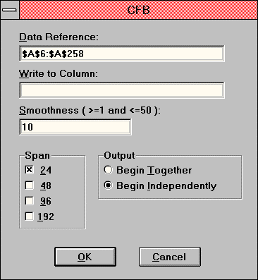

# CFB — Composite Fractal Behavior Index

## User's Guide — Add-In Tool for Microsoft Excel for Windows

**© 1994 Jurik Research and Consulting**
PO 2379, Aptos, CA — 831-688-5893; fax 831-688-8947

Source: `CFB.PDF` from Excel 97 Add-In distribution disk.

## BibTeX

```bibtex
@manual{jurik1994cfb_xl,
  author       = {Jurik, Mark},
  title        = {{CFB} --- Composite Fractal Behavior Index: User's Guide for Microsoft Excel},
  year         = {1994},
  organization = {Jurik Research and Consulting},
  address      = {Aptos, CA}
}
```

---

## Table of Contents

- [Requirements](#requirements)
- [Installation](#installation)
- [Why Use CFB?](#why-use-cfb)
- [How to Activate CFB](#how-to-activate-cfb)
- [Sample CFB Trading System](#sample-cfb-trading-system)
- [Calling CFB from Excel's Visual Basic for Applications](#calling-cfb-from-excels-visual-basic-for-applications)

---

## Requirements

Our tools run inside:

- Microsoft Excel 5.0c, under Windows 3.1, 3.11, 95, or NT
- Microsoft Excel 7 and 97 under Win 95 and NT

---

## Installation

1. Using either the Window's Program Manager or Explorer, go to the floppy disk and run `JRS_XL.EXE`. It will request a password. Press OK. The installer will give you a computer identification number. Write it down.

2. Get your installation password from Jurik Research Software. Call 323-258-4860 (USA), fax 323-258-0598 or E-mail to nfsmith@anet.net. Either way, give your full name, mailing address and computer identification number. You will then be given a password.

3. Rerun `JRS_XL.EXE`, this time entering the password. The installer will verify your password. When approved, it will install documentation and demonstration files into a user specified directory and the tool(s) into your `EXCEL\XLSTART` subdirectory. Read messages in all windows — they are important. Scroll down if necessary.

4. Start Excel. The tool(s) will be ready to run from the DATA command menu.

### Notes

In the installed directory, you will find the following files:

| File | Description |
|---|---|
| `LEGALESE.TXT` | Legal notices and warranties |
| `ORDRFORM.HLP` | A printable order form for all products we sell |
| `CATALOG.HLP` | An online catalog of all products we sell |

In each installed `xxx_DEMO` subdirectory, you will find the following files:

1. All the necessary demonstration XLS files.
2. A new VBA module, showing how to control a tool using Excel's Visual Basic.

### Passwords

If you upgrade to a new computer, you will need a new password to install these tools. If you want to run them on additional computers, you will need additional passwords. Call Jurik Research Software (323-258-4860) for details.

---

## Why Use CFB?

**To measure the market's trending time frame without cycles!**

CFB is an index that reveals the market's trending time frame, ideal for creating adaptive window sizes of various technical indicators.


*CFB index: long trending activity produces a large CFB index and short choppy action produces a small index value.*

All around you mechanisms adjust themselves to their environment. From simple thermostats that react to air temperature to computer chips in modern cars that respond to changes in engine temperature, r.p.m.'s, torque, and throttle position. It was only a matter of time before fast desktop computers applied the mathematics of self-adjustment to systems that trade the financial markets.

Unlike basic systems with fixed formulas, an adaptive system adjusts its own equations. For example, start with a basic channel breakout system that uses the highest closing price of the last N bars as a threshold for detecting breakouts on the up side. An adaptive and improved version of this system would adjust N according to market conditions, such as momentum, price volatility or acceleration.

Since many systems are based directly or indirectly on cycles, another useful measure of market condition is the periodic length of a price chart's dominant cycle (DC), that cycle with the greatest influence on price action.

The utility of this new DC measure was noted by author Murray Ruggiero in the January '96 issue of *Futures Magazine*. In it, Mr. Ruggiero used it to adaptively adjust the value of N in a channel breakout system. He then simulation-traded 15 years of D-Mark futures in order to compare its performance to a similar system that had a fixed optimal value of N. The adaptive version produced 20% more profit!

This DC index utilized the popular MESA algorithm (a formulation by John Ehlers adapted from Burg's maximum entropy algorithm, MEM). Unfortunately, the DC approach is problematic when the market has no real dominant cycle momentum. Therefore, we replaced the DC index with a proprietary indicator that does not presuppose the presence of market cycles. It's called CFB (Composite Fractal Behavior) and it works well whether or not the market is cyclic.

CFB examines price action for a particular fractal pattern, categorizes them by size, and then outputs a composite fractal size index. This index is smooth, timely and accurate.

Essentially, CFB reveals the length of the market's trending action time frame. Long trending activity produces a large CFB index and short choppy action produces a small index value. Investors have found many uses for CFB, all related to scaling other existing technical indicators adaptively, on a bar-to-bar basis.

---

## How to Activate CFB

### The Composite Fractal Behavior Index

If you installed CFB into the `EXCEL/XLSTART` subdirectory, then when you start Excel, CFB is automatically loaded and ready for use. It is accessed by the **"CFB"** command in the **DATA** menu.

#### Demonstration

1. In Excel, go to the directory where your documentation and demonstration XLS files were installed. Open file `CFB_DEMO.XLS`. If you are using Excel 5 or 7, use the SAVE AS command to save the file back onto your hard drive. Give it the new filename `CFB_DEM5.XLS` and specify it as a Microsoft Excel Workbook in the dialog field "Save File As Type".

2. Column 1 of the spreadsheet file contains 253 consecutive days of 30-year T-Bond futures closing prices. In this demo, you will create a 24-bar wide CFB index and a 48-bar wide CFB index.

3. Select all the cells in the column containing the time series to be sampled.

   > **NOTE:** Do not begin data time series in row 1. Row 1 is to be reserved for a text description (label) of the data. If you do not want to use a text description of the data column, then leave the cell in row 1 of this column blank.

4. In file `CFB_DEMO.XLS`, click on the first reference data cell (row 6, column 1) to highlight it. Include all the remaining data. You can easily do this by pressing CTRL-SHIFT-DOWN.

5. Bring up the tool dialog box by selecting the "CFB" command in the DATA menu.



*Figure 2 — CFB's dialog box.*

As shown in Figure 2, the dialog has three data entry fields, and two groups of modifying options: Span and Output. When you select the time series data before calling CFB, the first field will automatically be filled in.

#### Data Reference

This field designates the region of cells in one column. The dialog's default for this field is to use the most recently selected (highlighted) region of cells during your current session with Excel. If only a single cell was most recently highlighted, then CFB defaults to the prior run's Data Reference.

For the demo: bring up the tool dialog box by selecting the "CFB" command in the DATA menu. Press the TAB key until the dialog's "Data Reference" field is highlighted. Select the cell containing the first number of the time series (row 6, column 1). Select the rest of the data by pressing CTRL-SHIFT-DOWN. Now all the cells in the "T-Bond" time series should be highlighted.

#### Write to Column

This field designates the column that CFB will write to. If only a single cell was most recently selected, it defaults to using whatever column was designated the last time CFB was executed during your current session with Excel. Otherwise, it defaults to being blank.

For the demo: Press the TAB key until the dialog's "Write to Column" field is highlighted. Select any cell in column 3 of the spreadsheet. This tells the tool that you want its output to begin in column 3.

#### Smoothness

This field specifies the smoothness level of CFB's output. Larger values produce smoother curves. Typical smoothness values lay between 6 and 16. The full permissible range is any integer from 2 to 50.

For the demo, use the smoothness default value of 10.

#### Span

CFB measures the purity of fractals of various sizes. You must select the largest size fractal that CFB may consider. The choices are **24**, **48**, **96**, and **192** bars wide. If you select more than one choice, CFB will produce a separate index for each selection.

The selection involves performance tradeoffs: although larger sizes of Span will enable CFB to discover longer patterns in the data, this induces a penalty of additional lag, thereby adding some delay to CFB's timing. You need to determine the optimal setting that's best for you.

For the demo: mouse click on both 24 and 48 in the Span grouping.

#### Dead Zone

Note that CFB will leave as blank a block of cells at the top of each output column range. This "dead zone" gets larger for increasing values of Span. The size of the dead zone for CFB is automatically calculated using the formula:

```
Dead_Zone = Span Size + 6
```

For example, the "dead zone" of a 48-bar wide CFB index would be the first 48 + 6 = 54 output cells.

If you have selected multiple Span values, CFB defaults to applying a dead-zone for each output column separately. In the demo, Span = 24 and 48, therefore CFB will default to giving the two output columns dead-zone sizes of 30 and 54.

If you prefer to have all multiple output columns have the same dead-zone size, then select **"Begin Together"**. All dead-zones will be set equal to the largest value. Selecting "Begin Together" causes both dead-zone sizes to be 54.

#### Output

Select "Begin Together" if desired, then press the OK button.

#### Returning Home

After CFB has finished, press CTRL-HOME to return to the top left-hand corner of the spreadsheet.

For the demo, the CFB 24 index is the red line in the second chart, and the CFB 48 index is the blue line.

#### Automatic Titles

When CFB writes data out to the specified output column, it also gives a title to that column. The title is placed in the first row of that column.

The title is composed of three parts:

1. The title word found in the first row of the reference data column
2. An underscore `_` followed by the Span value used
3. An underscore `_` followed by the Smoothness value used

If no label is used in row 1 of the input reference column, then the first part is replaced by `col` followed by the column number. An example would be `col7_24_10`.

For the demo, the title "T-BOND" is in row 1, Span = 24 and 48, and smoothness = 10. Therefore, the two output columns will be automatically titled `T-Bond_24_10` and `T-Bond_48_10`.

---

## Sample CFB Trading System

In `CFB_SYS1.XLS` we have provided a sample trading system which demonstrates one possible method for utilizing the CFB in a trading system.

### Overview of System

Making money when a financial instrument's price meanders within a narrow trading range is not likely, but you can profit by jumping in when trends start. How do you know when a trend has started? It occurs when the price breaks through one of the bounds of a trading range; this is called "breaking out of the channel."

The sample system is essentially a channel breakout system. Such systems are designed to provide buy signals when price moves beyond the upper bound of a trading range and short signals when price moves below the channel's lower bound. The sample system, once it's in the market, is always long or short. Of course, more complex systems can be devised, and this one is only intended to be a learning tool.

### How the CFB is Used

Because CFB measures trend duration, it can be used to help define a channel. For instance, if the current trend duration is 4 bars, you could simply say that the upper boundary of the channel is defined as the highest high in the last 4 bars; conversely, the lower boundary would be the lowest low during the last 4 bars.

Because the CFB values for a particular market will tend to lie within a range that will differ from other markets, it is inadvisable to simply use the raw CFB value as the lookback period. The sample system uses a more complex method instead.

Because different markets exhibit different characteristics, a system needs to be optimized for each market. In particular, it is necessary to determine the optimum lookback periods to be used to define the breakout channels. Often these channels are not symmetrical. In the case of the sample system, we found that the optimum range of lookback periods ran from 7 to 12 days.

In order to arrive at a lookback period, it's first necessary to determine what range the observed CFB values will cover. In the sample system, the CFB span value was set to 24, so possible values include the range from 0 to 24, but the actual values observed range from 3.82 to 19.51. Formulas in columns H and I determine the maximum and minimum values of the CFB observed to date.

Essentially, the logic says that the maximum value must be at least slightly more than half the possible range (12.01 as the floor maximum). If the current CFB exceeds any prior value of CFB, it becomes the maximum. Otherwise, the maximum remains as the highest value observed previously. The logic for the minimum is the same in reverse.

In column J a formula calculates the fraction that the current value of CFB is relative to the observed range. For instance, if today's CFB is 9, and the range varies from 3 to 13, then the fraction is (9-3)/(13-3) = 0.6.

To arrive at a lookback period, the ratio of the current CFB value relative to its observed range is applied to the ideal range, 7 to 12. The formulas in column K round down to the nearest integer.

Once the lookback periods are determined, creating the channel boundaries is straightforward. Formulas in columns L and M use the lookback periods to find the highest highs and lowest lows. The actual channel boundaries are calculated in columns N and O:

- **Upper Channel:** If today's high is higher than the previous Upper Channel, then it becomes the Upper Channel boundary. Otherwise, the Upper Channel is defined as the average of yesterday's Upper Channel value and today's highest high during the lookback period.
- **Lower Channel:** The converse logic.

### Trading Results

All trades are entered with either BUY or SELL stops placed at the end of each day, to be used the next trading day. Stops are placed at channel boundaries. On the long side, trades are executed at the Channel boundary, or at the opening price if the Open has gapped above the Upper Channel boundary. Likewise on the short side.

Note that commissions and slippage of $70 per trade are applied to each closing transaction.

> **NOTICE: DO NOT USE THIS SYSTEM TO TRADE REAL MONEY!**
> The trading formulas in `CFB_SYS1.XLS` are for demonstration purposes only. It does not have important features, e.g. money management, typical of real trading systems. Without such features, you may lose substantial equity trading the market.

### EasyLanguage Code

```easylanguage
{
----------------------------------------------------------------------
System:    CFB CHANNEL BREAKOUT
Purpose:   This is an example of a breakout system based on the CFB
           index. Superimpose this indicator over any price chart
           (subplot #1).
           The default input parameters are for ILLUSTRATION PURPOSES ONLY.
Notes:     Depth is typically between 0 and 26.
           Smooth is typically between 7 and 12.
Author:    © 1996 Jurik Research, Aptos California USA  408-688-5893
----------------------------------------------------------------------
}

inputs: Depth1(20),   { lookback depth associated with min CFB output }
        Depth2(1),    { lookback depth associated with max CFB output }
        Smooth(8);    { smoothness of CFB curve }

vars:   ratio   (0),  { % location of CFB in current range }
        HH      (H),  { high channel boundary }
        LL      (L),  { low channel boundary }
        Depth   (0),  { lookback depth }
        CFB_out (0),  { CFB output }
        max_out (19), { maximum fractal length to date }
        min_out (18); { minimum fractal length to date }

{ get fractal_length }
CFB_out = JRC_Fractal24 ( H+L , Smooth ) ;

{ adjust max length }
if CFB_out > max_out
then max_out = CFB_out

{ adjust min length }
else if CFB_out < min_out
then min_out = CFB_out;

if currentbar > 1 then begin

    { ratio varies from 0 to 1 }
    ratio = (CFB_out - min_out) / (max_out - min_out);

    { depth varies from Depth1 to Depth2 }
    depth = Depth1 + ratio * (Depth2 - Depth1);

    { adjust high channel boundary }
    if H > HH[1]
    then HH = H
    else HH = ( HH[1] + highest ( H , Depth ) ) / 2 ;

    { adjust low channel boundary }
    if L < LL[1]
    then LL = L
    else LL = ( LL[1] + lowest ( L , Depth ) ) / 2 ;

    { buy when price breaks up }
    buy at HH stop;

    { sell when price breaks down }
    sell at LL stop;

end;
```

---

## Calling CFB from Excel's Visual Basic for Applications

> The following information is for advanced users who want to maximize the power of CFB by incorporating it within either user-defined subroutines or functions.

CFB may be called from Excel's Visual Basic for Applications (VBA). This powerful capability can be used to:

- Search for optimal SMOOTH and SPAN parameter values
- Create numerous columns of different SPAN and SMOOTH values
- Automate CFB's operation as part of an automated trading system

### Setup

In your CFB installation directory (e.g. `C:\JRS\CFB_DEMO`) the workbook `CFB_VBA.XLS` contains a working example of how to use Excel's VBA to operate CFB automatically. It contains one spreadsheet and one VBA module sheet.

The VBA routine will make CFB produce two columns (using span values 24 and 48) for each of two different data columns (Coffee and T-Bonds). The code makes CFB write to columns 4 through 7 (D through G). For each input column, there will be two output columns using SPAN values 24 and 48.

You can run this example by executing the menu command `TOOLS / MACRO...` and selecting the VBA subroutine named `CFBCall`.

`CFBCall` assumes the following:

1. There is data in the region `A5:B261`, in a worksheet named "data" in an open Excel 5 workbook named `CFB_VBA.XLS`.
2. The two input data columns have titles in the first row.
3. Both the workbook containing input data for CFB and the workbook set up to receive output from CFB are currently open in Excel. In this example, workbook `CFB_VBA.XLS` will serve for both input and output.
4. The path to your `XLSTART` subdirectory is `D:\msoffice\excel\xlstart`. If this is not true for your system, you MUST edit the code accordingly. This will enable the "register" command to find the file `JRS_XL.DLL`.

### Calling Parameters

The VBA code for CFB has 5 input parameters:

1. **Input reference range:** For coffee: `r5c1:r261c1` in sheet "Data"; for D-Mark: `r5c2:r261c2`.
2. **Output column number:** Appended as a text string to range `Data!r1c`.
3. **SMOOTHNESS:** A constant value of 10.
4. **SPAN:** Value for CFB calculations (must be 24, 48, 96, or 192). In this demo: 24 and 48.
5. **SPAN2:** Value for Dead_Zone calculation (must be 24, 48, 96, or 192). Actual dead_zone size is 6 more than SPAN2. In this demo, we want all 4 output columns to start in the same row. Since the largest SPAN is 48, we let SPAN2 = 48. Dead_zone size = 6 + 48 = 54.

### Example Macro Code

```vb
'
' CFB_Loop Macro
' Demonstration code for using CFB
'
Sub CFBCall()
    Dim CFBFunc As Long             'Identifier for CFB_func registration
    Dim smoothness As Integer       'SMOOTHNESS factor
    Dim in_colnum As Integer        'input column number
    Dim out_colnum As Integer       'output column number
    Dim span1 As Integer            'SPAN for CFB calculations
    Dim span2 As Integer            'SPAN for dead_zone calculation
    Dim CFB_SPAN(1 To 4) As Integer 'holds the 4 legal SPAN values
    Dim k As Integer                'loop counter

    CFB_SPAN(1) = 24
    CFB_SPAN(2) = 48
    CFB_SPAN(3) = 96
    CFB_SPAN(4) = 192

    Application.ScreenUpdating = False

    CFBFunc = ExecuteExcel4Macro( _
        "register(""D:\MSOFFICE\EXCEL\XLSTART\JRS_XL32.xll"",""CFB_func"",""JRRJJJ"")")

    '*** For Excel v5.0 or a Windows 3.1 environment, use the following line
    '
    'CFBFunc = ExecuteExcel4Macro( _
    '    "register(""C:\EXCEL5\XLSTART\JRS_XL.xll"",""CFB_func"",""IRRIII"")")

    ' Loop through COFFEE and D-MARK and calculate two CFB's for each
    smoothness = 10
    span2 = 48

    For in_colnum = 1 To 2
        For k = 1 To 2
            out_colnum = 2 * in_colnum + k + 1
            span1 = CFB_SPAN(k)
            ExecuteExcel4Macro("call(" & CFBFunc & _
                ", [CFB_VBA.XLS]Data!r5c" & LTrim(Str(in_colnum)) & _
                ":r261c" & LTrim(Str(in_colnum)) & _
                ", [CFB_VBA.XLS]Data!r1c" & LTrim(Str(out_colnum)) & _
                ", " & LTrim(Str(smoothness)) & _
                ", " & LTrim(Str(span1)) & _
                ", " & LTrim(Str(span2)) & ")")
        Next k
    Next in_colnum

    ExecuteExcel4Macro("UNregister(" & CFBFunc & ")")
End Sub
```

*Excel VBA code calling CFB in a double nested loop.*

---

## Bug Bounty & Referral Reward

**If you find a bug — you win!** If you discover a legitimate bug in any of our preprocessing tools, you will receive:

- A $50 discount coupon
- A free upgrade coupon

You may collect as many coupons as you can and apply more than one discount coupon toward the purchase of your next tool.

**Referral Reward Policy:** When Jurik Research receives an order from someone who states that the order was based on your recommendation, they will credit you $50 toward your next purchase of their products or upgrades.
