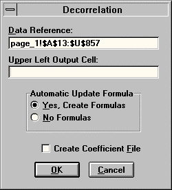
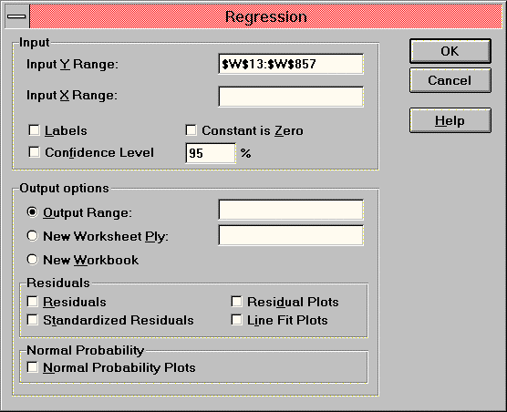

# DDR — Decorrelator and Dimension Reducer

Add-In Tool for Microsoft Excel for Windows

© 1994 Jurik Research & Consulting

## BibTeX

```bibtex
@manual{jurik_ddr_excel,
  title        = {DDR: Decorrelator and Dimension Reducer — Add-In Tool for Microsoft Excel for Windows — User's Guide},
  author       = {{Jurik Research}},
  year         = {1994},
  organization = {Jurik Research & Consulting},
  address      = {PO 2379, Aptos, CA 95001},
}
```

## Requirements

- Microsoft 5.0c, under Windows 3.1, 3.11, 95, or NT
- Microsoft Excel 7 and 97 under Win 95 and NT

## Installation

1. Using either the Window's Program Manager or Explorer, go to the floppy disk and run `JRS_XL.EXE`. It will request a password. Press OK. The installer will give you a computer identification number. Write it down.
2. Get your installation password from Jurik Research Software. Call 323-258-4860 (USA), fax 323-258-0598, or e-mail to nfsmith@anet.net. Give your full name, mailing address and computer identification number. You will then be given a password.
3. Rerun `JRS_XL.EXE`, this time entering the password. The installer will verify your password. When approved, it will install documentation and demonstration files into a user-specified directory and the tool(s) into your `EXCEL\XLSTART` subdirectory.
4. Start Excel. The tool(s) will be ready to run from the DATA command menu.

### Installed Files

In the installed directory:

1. `LEGALESE.TXT` — Legal notices and warranties.
2. `ORDRFORM.HLP` — A printable order form for all products.
3. `CATALOG.HLP` — An online catalog of all products.

In each installed `xxx_DEMO` subdirectory:

1. All the necessary demonstration XLS files.
2. A new VBA module, showing how to control a tool using Excel's Visual Basic.

### Passwords

If you upgrade to a new computer, you will need a new password to install these tools. If you want to run them on additional computers, you will need additional passwords. Call Jurik Research Software (323-258-4860) for details.

## What DDR Is All About

### Brief Description

If you are building a model whereby each data fact-record contains numerous input (independent) variables and you can arrange the fact-records as rows in a spreadsheet, then the Decorrelator / Dimension Reducer (DDR) is for you. On the same or another spreadsheet, DDR creates a new data set, arranged in the same number of rows and columns as the original data set, but with two important differences:

- All the columns are decorrelated.
- All the columns are ranked according to the strength of their information content.

This helps models in two ways:

- Models learn faster with decorrelated variables than correlated ones.
- Models learn faster when uninformative input variables are deleted.

### Why Decorrelate and Reduce?

Successful traders know that even the best forecast models are useless if the chosen indicators are not relevant.

**Collecting Relevant Indicators** — When an aspiring forecaster has no idea which indicators to use, he usually constructs models by feeding them lots of data that might have any relation to the desired forecast.

**A Well Kept Secret** — Most beginners think that regression models receiving a large number of indicators will perform better than models receiving a small number. Surprisingly, smaller regression models frequently outperform larger ones! The statistical world refers to this counter-intuitive behavior as the "phenomenon of multi-colinearity". It says that models prefer uncorrelated indicators, and that feeding a large number of mutually correlated indicators to a model typically DEGRADES its performance.

**The Secret Explained** — Interdependence among input variables seriously degrades the ability of regression models (including neural nets) to perform reliably with new data. The greater the correlation between variables, the more pronounced the effects. This is why you should consider giving models decorrelated input variables — it minimizes a model's divergent response to new data.

### Why Not Just Remove Correlated Inputs?

Consider three input signals:

- A) the daily high tide level near San Francisco
- B) the daily high tide level near Los Angeles
- C) the price of apples in China

Since signals A and B are very similar (and therefore highly correlated), one might be tempted to eliminate either one from the set of inputs. But if you do, then the model could never create desired output signal D if its formula is D = A − B. In other words, a model can only calculate (A minus B) when both A and B are present! Therefore removing inputs on the basis of correlation can leave you with insufficient data and a non-working model.

### DDR's Solution

DDR takes your data and produces a new data array the same size as the old but with two important differences:

1. All the new columns will be completely uncorrelated with each other — this enhances model performance.
2. DDR ranks the new columns according to how well they explain all the input data. DDR typically boils down 50 correlated indicators to only 14 with very little loss of information!

### Demonstration Results

Three models were built to forecast future values of a simulated financial time series (composite of sinusoidal curves, Mackey-Glass chaotic time series, and Brownian noise). Data consisted of 1500 cases with 21 independent variables each, forecasting 10 bars ahead.

| Model | Description | Error |
|-------|-------------|-------|
| #1 | Simple Regression on 21 columns of original data | 15.0% |
| #2 | Neural Net on 21 columns of original data | 6.4% |
| #3 | Neural Net on 5 columns produced by DDR | 6.4% |


DDR puts the secret of professional forecasting in your hands!

## The Theoretical Basis of DDR

DDR views each column of the original data as a separate axis, so that 21 columns represent 21 axes. DDR then creates a new set of axes and uses them to evaluate each point's new set of coordinates. DDR chooses the new axes so as to attain all the desirable properties mentioned above.

Example: Suppose a medical research study measured blood pressure and cholesterol levels on 1,000 people and later recorded their age at death. The plot reveals three distinct groups, each with a unique life expectancy. Neither blood pressure alone nor cholesterol alone can distinguish which group any point belongs to — both are required.

However, by creating new axes X and Y (where X travels through the centers of the three groups), only the X axis serves to determine which life expectancy group a point belongs. The Y axis value serves no purpose. Therefore, concerning the life insurance model, we can represent information on forecasted life expectancy with only one variable, X, instead of both P and C.

## How to Use DDR

### Bringing Up DDR

Whenever you start Excel, it automatically loads DDR, ready for use. DDR is accessed by the "DDR 2" command in the "Data" menu.

### Input Region

In an Excel worksheet, select all the cells (rows and columns) containing your input data. All the columns should be contiguous.

### Data Reference

This field designates the region of cells containing two or more columns of data to be decorrelated. The dialog's default is to use the most recently selected (highlighted) region of cells.

**NOTE:** We strongly recommend you position the top row of your input data region below row 2.



### Upper Left Output Cell

This field designates the location of the upper-left cell of DDR's output region. The output region will have the same number of rows and columns as the input region. The output region could be on the same spreadsheet as the input region or on a separate spreadsheet.

**NOTE:** The chosen cell location must not be anywhere within the input region. It must also not be in rows 1 or 2 (DDR reserves these for column titles).

**SUGGESTION:** Position the upper left output cell so that its row number is the same as the row number of the upper left cell of the input region (alignment).

### Automatic Update Formula

You have an option to let DDR insert into the last row of the output array the same formulas used by DDR to calculate the values in each column. These formulas refer to a hidden coefficient matrix automatically created by DDR. Having this row of formulas is handy — you can copy them down to as many additional rows as you want. When you append additional data to the bottom of the original Data Reference region, the formulas automatically update.

### Coefficient File

After DDR has processed your data and placed automatic formulas, it can also create a special coefficient file containing specifications that allow other software applications to decorrelate data the same way. The only software application capable of using the coefficient matrix file is TradeStation, by Omega Research. There, users can decorrelate data in real time.

### Status Bar

The time spent by DDR may take only a few seconds for small input data regions and much longer for very large regions. DDR's speed is faster if your computer has a floating processor unit (FPU). During long waits, the status bar displays what DDR is currently doing.

### Titles Row

When DDR writes its results, it gives a title to each column: D_1, D_2, D_3, ... and so on.

### Output Data and Relative Information Content

The output columns of DDR's decorrelation process will typically not resemble the original reference data columns. Nonetheless, there is no loss of information — there will always exist a linear regression that can perfectly convert the output region data back to the original input data.

DDR arranges the output columns according to how much information each column possesses. The leftmost column bears the most information and the rightmost column bears the least. The relative amount of information is enumerated in row 2 as percentages (adding up to 100%).

## Using the Automatic Formulas

If your DDR dialog box had the "Automatic Update Formula" checked, then the last row of DDR's output is a row of formulas. These formulas look for data in the corresponding input row. You may copy down the row of formulas for as many additional rows as you like.

If no data exists in a corresponding input row, the formula row will fill its output cells with `#NUM!`. When you fill the input row with data, the output row will automatically update.

The formulas multiply values in the input row with coefficients located on a hidden sheet in the same workbook that holds the output sheet.

**SUGGESTION:** If you add more rows on a daily basis, eventually you will have lots of rows being updated by formulas. At this point, we advise reusing DDR over all the data to update the coefficient file.

## Modeling with DDR's Output

### Regression on DDR's Output Data

Always use the first column produced by DDR for your model — it contains an enormous amount of information.

To demonstrate, a linear regression model was built to make 10-day forecasts using just the first 8 columns of DDR's output:

```
Regression Statistics
Multiple R          0.8307
R Square            0.6900
Adjusted R Square   0.6871
Standard Error      0.1370
Observations        845
```

The correlation value is 0.83 — very close to the correlation value of 0.84 attained by the model built using all 21 columns of input data. This proves that the first 8 columns produced by DDR contain almost all useful information that could be extracted from the original 21 columns.



## Appendix: Description of DDR_DEMO.XLS Data

`DDR_DEMO.XLS` is a Microsoft Excel spreadsheet containing 21 columns of input data for DDR.

- **Column 1:** A chaotic time series with added Brownian noise (approximating a financial time series).
- **Columns 2–11 (MGBN group):** Each successive column has the series shifted down by two additional rows. Any row contains eleven "snapshots" of the time series looking back in time.
- **Columns 12–15 (EMA group):** Exponential moving averages of column 1 with bar-lengths of 5, 10, 15, and 20.
- **Columns 16–21 (MACD group):** Difference between pairs of columns in the EMA group.
- **Target Forecast column:** The same chaos time series of column 1, shifted upward 10 rows (forecasted 10 bars into the future).

## Calling DDR from Excel's Visual Basic for Applications

DDR may be called from Excel's VBA. This capability can be used to:

- Search for optimal number of DDR output columns to use for modeling
- Automate DDR's operation as part of an automated trading system

### Introduction

In your DDR installation directory (e.g. `C:\JRS\DDR_DEMO`) the workbook `DDR_VBA.XLS` contains a working example. It contains one spreadsheet and one VBA module sheet.

The data in column 3 is designed to be highly correlated to the sum of columns 1 and 2. Consequently, the three columns truly offer only two columns worth of real information.

### Calling Parameters

`DDRCall` uses 3 input parameters:

1. **Input Range Reference:** Specify the complete name of the range containing input data. Example: `[DDR_VBA.XLS]Data!r5c1:r500c3`
2. **Output Cell Reference:** Specify the cell to be the upper left corner of DDR's output array. Example: `[DDR_VBA.XLS]Data!r5c5`
3. **Formula Output:** Specify whether you want the bottom row to contain live formulas. `TRUE` = Yes, `FALSE` = No.

### Example Code

```vb
Dim DDRFunc As Long

Sub DDRCall()
    Application.ScreenUpdating = False

    DDRFunc = ExecuteExcel4Macro _
     ("register(""D:\MSOFFICE\EXCEL\XLSTART\JRS_XL32.xll"",""Decor"",""JRRA"")")

    '*** For Excel v5.0 or a Windows 3.1 environment, use the following line
    'DDRFunc = ExecuteExcel4Macro _
    ' ("register(""C:\EXCEL5\XLSTART\JRS_XL.xll"",""Decor"",""IRRA"")")

    ' call DDR with 3 parameters:
    ' Input Range reference = [DDR_VBA.XLS]Data!r5c1:r500c3
    ' Output cell reference = [DDR_VBA.XLS]Data!r5c5
    ' Update formula Option = TRUE  (update formulas are desired)
    ExecuteExcel4Macro ("call(" & DDRFunc & _
        ", [DDR_VBA.XLS]Data!r5c1:r500c3" & _
        ", [DDR_VBA.XLS]Data!r5c5" & _
        ", TRUE)")

    ExecuteExcel4Macro ("UNregister(" & DDRFunc & ")")
End Sub
```

**Note:** The path to your XLSTART subdirectory must match your system. Edit the code accordingly to enable the "register" command to find the file `JRS_XL.DLL`.
