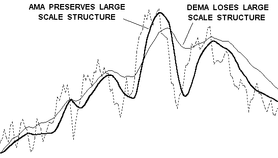
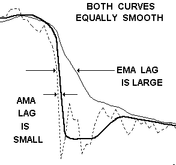
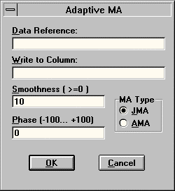
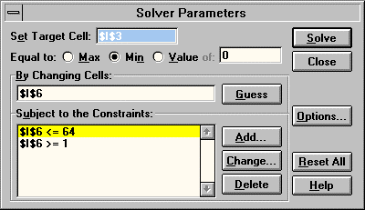
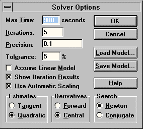

# JMA — Jurik Moving Average

## User's Guide — Add-In Tool for Microsoft Excel (versions 5c, 95 and 97)

**© 1998 Jurik Research and Consulting**
PO Box 2379, Aptos, CA 90051 — Ph: 831-688-5893; Fax: 831-688-8947

Source: `JMA_XL.PDF` from Excel 97 Add-In distribution disk.

## BibTeX

```bibtex
@manual{jurik1998jma_xl,
  author       = {Jurik, Mark},
  title        = {{JMA} --- Jurik Moving Average: User's Guide for Microsoft Excel},
  year         = {1998},
  organization = {Jurik Research and Consulting},
  address      = {Aptos, CA}
}
```

---

## Table of Contents

- [Installation](#installation)
- [Why Use JMA?](#why-use-jma)
- [On Using JMA](#on-using-jma)
  - [Command Menu Method](#command-menu-method)
  - [Array Formula Method](#array-formula-method)
  - [Indexing into an Array Formula Method](#indexing-into-an-array-formula-method)
  - [Visual Basic Method](#visual-basic-method)

---

## Installation

1. Using either the Window's Program Manager or Explorer, insert the floppy disk and run `JRS_XL.EXE`. If you downloaded the `JRS_XL.EXE` file from our web site, place it into any directory and run it. The installer will request a password. Press OK. The installer will give you a computer identification number. Write it down.

2. Get your installation password from Jurik Research Software. Call 323-258-4860 (USA), fax 323-258-0598 or E-mail to nfsmith@anet.net. Either way, give your full name, mailing address and computer identification number. You will then receive a password.

3. Rerun `JRS_XL.EXE`, this time entering the password. The installer will verify your password. When approved, it will install documentation and demonstration files into a user specified directory and the tool(s) into your `EXCEL\XLSTART` subdirectory. During Installation, read messages in all windows — they are important. Scroll down if necessary.

4. Start Excel. The tool(s) will be ready to run from the DATA command menu.

### Notes

In the installed directory, you will find the following files:

| File | Description |
|---|---|
| `JMA_XL.DOC` | This user manual |
| `CATALOG.HTM` | A web page with a link to our web site's product catalog |
| `LEGALESE.TXT` | Legal notices and warranties |
| `ORDRFORM.HLP` | A printable order form for complete line of products |

In the `JMA_DEMO` subdirectory, you will find the following file:

| File | Description |
|---|---|
| `JMA_DEMO.XLS` | The main demonstration file referred to by this manual |

### Passwords

If you upgrade to a new computer, you will need a new password to install these tools. If you want to run them on additional computers, you will need additional passwords. Call Jurik Research Software (323-258-4860) for details.

---

## Why Use JMA?

### The ADAPTIVE MOVING AVERAGE by Jurik Research

Daily prices produce a time series with some amount of random fluctuations. To remove this noise, market technicians typically use moving average (MA) filters. Jurik's JMA excels in all four benchmarks of a truly great filter...

### Benchmark #1: Accuracy

Moving Average (MA) filters have an adjustable parameter that controls its speed. Speed governs two opposing properties of a filter: smoothness (lack of random zigzagging) and accuracy (closeness to the original data). That is, the smoother a filter becomes, the less it accurately resembles the original time series. This makes sense, since we do not want to accurately track zigzagging noise within our data.

Because the financial investor tries to apply just enough smoothness to filter out noise without removing important structure in price activity. For example, in the chart below, the popular Double Exponential Moving Average (DEMA) is just as smooth as JMA yet DEMA fails to track large scale structure (the big cycles). On the other hand, JMA follows the cyclic action very well.



*JMA preserves large scale structure. DEMA loses large scale structure.*

### Benchmark #2: Timeliness

Most MA filters have another problem: they lag behind the original time series. This is a critical issue because excessive delay and late trades may reduce profits significantly.

Ideally, you would like a filtered signal to be both smooth and lag free. For many types of moving average filters, including the three classics (simple, weighted, and exponential), greater smoothness produces greater lag.

For example, in the chart to the right, price action is the dotted line. The exponential moving average, EMA, lags well behind JMA (thick solid line). As you can see, with EMA's excessive lag, you would have had to wait a long time before it returned to the price action. In contrast, JMA never left it!



*Both curves are equally smooth. EMA's lag is large; JMA's lag is small.*

Adaptive filters developed by others, such as the Kaufman and Chande AMA, will also lag well behind your time series. Kaufman's Moving Average (KMA), is an exponential moving average whose speed is governed by the "efficiency" of price movement. For example, fast moving price with little retracement (a strong trend) is considered very efficient and the KMA will automatically speed up to prevent excessive lag. This interesting concept sometimes works well, sometimes not.


*JMA and KMA have similar smoothness. KMA seriously lags behind data. JMA runs through the data, rather than below it. JMA crossover occurs 15 and 18 days before EMA.*

### Benchmark #3: Overshoot

Many trading systems set triggers to buy or sell when price reaches a certain threshold level. Because there is an inherent amount of noise in price action, the typical approach is to trigger when a moving average crosses the threshold. The smoothed line has less noise and is less likely to produce false alarms.

To do this right, you'll need an exceptional moving average indicator. Common versions lag too much and many sophisticated designs, like the Kalman or Butterworth filter, tend to overshoot during price reversals. Overshoots create false impressions of prices having reached levels it never truly did.

For example, in the chart we see the famous Kalman filter overshoot price data, creating a false price level that the market never really achieved. DEMA filters also tend to overshoot. The overshoot crosses the shown threshold and triggers a false alarm. In contrast, JMA did not overshoot and thus avoided a false alarm with the user's set threshold.


*Kalman filter overshoots, triggering a false alarm. JMA does not overshoot.*

### Benchmark #4: Smoothness

The most important property of a noise reduction filter is how well it removes noise, as measured by its smoothness.

In the chart below, EMA and JMA filters are run across closing prices. Note how much the fast EMA alternates upward and downward while JMA glides smoothly through the data. Clearly JMA reveals the noise-free underlying price more accurately.

If you try reducing EMA's erratic hopping by making it slower, you will discover its lag will become larger, producing late trade signals.


*Slow EMA is smooth but lags below the data. Fast EMA jumps up and down. JMA is both accurate and smooth!*

If you need a 2-bar momentum indicator, you could take the difference between two values along the EMA time series and produce the jagged line. This is in contrast to the much smoother momentum signal based on JMA. Imagine how many bad trades could be eliminated with this simple substitution!


*Comparing JMA to VIDYA. High volatility during the most recent downward trend caused VIDYA to be too fast. Low volatility during congestion caused VIDYA to be too slow.*

JMA also enhances the accuracy of technical indicators! JMA resolves the riddle of how to get both smoothness and accuracy simultaneously, even with technical indicators. For example, comparing the Fast %K indicator (dotted line) and two smoothed versions: one produced by the classic Slow %D (thin solid line) and the other produced by smoothing Fast %K with JMA (thick solid line). Clearly, JMA is both smoother and more accurate than slow %D!


*JMA tracks staircase structure of S&P (5 minute bars).*

---

## On Using JMA

You now have four methods of applying JMA to your data:

- **Command Menu** — manual dialog-box interface
- **Array Formula** — spreadsheet array formula with automatic updates
- **Array Indexing** — per-cell formula with INDEX into JMA array
- **Visual Basic** — VBA macro calling JMA programmatically

---

### Command Menu Method

Whenever you start Excel, the tool is automatically loaded and ready for use. It is accessed manually via the **"JMA"** command in the **DATA** menu.



*The JMA command menu dialog box.*

As shown in the figure, the dialog window has three data entry fields. The user may move forward from field to field in the dialog window by pressing the TAB key and backward by pressing the SHIFT-TAB keys.

#### Data Reference

The "Data Reference" field in the dialog box designates the region of cells within one column whose data is to be filtered. The data must be a time series (in time order) and JMA will build a moving average of it in another column. The dialog's default for this field is to use the most recently selected (highlighted) region of cells during your current session with Excel. If the most recent selection is a single cell, JMA defaults to keeping whatever was in the field the last time JMA was used this session.

The user may change the designated data reference region to any region as follows:

1. Activate the dialog's field by clicking the mouse on the "Data Reference" field or press the TAB key until the field becomes highlighted, and...
2. Modify it by either typing the range description or by highlighting a new region of cells on the spreadsheet.

#### Write to Column

This field designates into which column the filter writes its output. Its default is to use whatever column was designated the last time JMA was used during your current session with Excel. If this is the first time JMA is being used during this session with Excel, then it defaults to being blank. Any column may be designated except the one containing the reference data.

The user may change the designated output column to any other column as follows:

1. Activate the dialog's field by clicking the "Write to Column" field or by pressing the TAB key until the field becomes highlighted, and...
2. Modify its contents by either typing in the location of the cell containing the time series label, or by selecting (highlighting) any cell in the column you wish to designate.

JMA will insert data in the designated column beginning and ending with the same rows as the data reference.

#### Smoothness

This field designates how much smoothing the filter is to perform upon your reference data. A smoothness factor of zero yields no smoothing and the filter's output will be identical to the reference data. A large value (eg. 200) yields a very slow, smooth curve. Typical values for smoothing range from 5 to 100, although it can be any non-negative number, such as 0, 13, or 128.73.

#### Filter Type

You have two types of filtering available: **AMA** (the original moving average) or **JMA** (the more recent design). JMA is recommended because it tracks more closely and lets the user modify the filter's lag by specifying a "phase" value.

#### Phase

This field affects both the amount of lag (delay) in the filter's response and the extent of overshoot that occasionally occurs. Phase must be within the range of -100 to +100.

| Phase | Lag | Overshoot |
|---|---|---|
| -100 | very large | very small |
| -50 | large | small |
| 0 | medium | medium |
| 50 | small | large |
| 100 | very small | very large |

#### OK Button

When finished defining the field values, click on the OK button or press the RETURN key. JMA will soon output the new column of data.

#### Demonstration Example

1. In Excel, open data file `JMA_DEMO.XLS`. This file was copied onto your hard drive, probably into the default path `C:\JRS_XL\JMA_DEMO`. Select the sheet named "MENU control". Column one contains 145 consecutive days of crude oil futures closing price.

2. Click on the first closing price cell (column 1, row 7) to highlight it. Include all the remaining data in the time series. You can easily do this by pressing CTRL-SHIFT-DOWN on the keyboard.

3. Select JMA from the DATA command menu.

4. Press the TAB key until the cursor is in the dialog's "Write to Column" field. Select any cell in column 2 of the spreadsheet. This tells the tool that you want the filter's output to be placed in column 2. The filter's output range will automatically extend from row 7 to row 151, just like the data reference.

5. Press the TAB key until the cursor is in the dialog's "Smoothness" field. Type in `60`.

6. Press the TAB key until the "MA Type" group is activated. Select AMA. Press the "OK" button.

7. Select JMA from the DATA command menu again and specify the following values:
   - Write to Column: any cell in column 3
   - Smoothness: `30`
   - MA Type: JMA
   - Phase: `0`

8. Press the "OK" button. Press F9 key to update chart.

In this example, note that JMA follows the shape and trend of the time series more accurately than AMA. However, AMA has fewer swings between data points 31 through 51 than JMA. This behavior may or may not be desirable, depending on your needs.

#### The Dead Zone

The first 30 cells of the output range will be blank. The reason for this "dead zone" is that JMA reserves the first 30 cells of the input reference for statistical analysis.

#### Automatic Title

When JMA writes data out to a column, it also creates a title for that column, and it is placed in the first cell (row 1) of that column.

The title is composed of two or three parts: the first (prefix) is the title word found in row 1 of the reference data column, the second part (suffix) contains "S" followed by the specified smoothness factor. If JMA was selected, then a third part (another suffix) contains "P" followed by the specified phase value.

If no title is found in the reference data column, then the prefix is the letter "C" followed by the column number of the reference data.

In the demonstration provided above, the title "oil" is in row 1 of the reference data column. For AMA, smoothness was set to 60. Therefore, the title `Oil_S60` was automatically created for column 2. For JMA, smoothness was 30 and phase was 0. Therefore, the title `Oil_S30_P0` was automatically created for column 3.

```
     1          2          3          4
1    Oil        Oil_S60    Oil_S30_P0
2    Closing
3    Price
4
5
6
7    18.11
8    18.00
```

If cell r1c1 was blank, then cell r1c2 would read `C1_S60` instead of `Oil_S60`, and cell r1c3 would read `C1_S30_P0` instead of `Oil_S30_P0`.

---

### Array Formula Method

#### Introduction

The power of a spreadsheet is that you can assign to cells formulas that automatically update whenever values in other cells change. The Array Formula Method provides an extra feature that you cannot attain using the Menu Command Method: the Array Formula Method lets you specify JMA's parameters using cell values. This feature allows JMA's behavior to be modified automatically. This permits some very useful tasks, such as "What if" analysis and function optimization. In particular, Excel's Solver could be set up to optimize some function by altering JMA's parameters.

#### Creating the Array Formula

The steps to creating an array formula are as follows:

1. Determine the column-oriented region of cells that contain the input data.
2. Determine the column-oriented region of cells that is to contain the output data.
3. Place the array formula (explained below) into the first cell of the output region.
4. Select the cell mentioned in step 3 and then select downward all the cells of the intended output region.
5. Click inside the formula field above the spreadsheet area.
6. Press CTRL-SHIFT-ENTER to create the array formula.

The above procedure creates exactly the same formula for every cell in the output region. When you click on any cell containing the array formula, you will see a special `{ }` bracket around the formula.

#### Array Formula Format and Limitations

The format for entering JMA's array formula mentioned in step 3 above is:

```excel
=JMA_Update( DataRef, SmoothRef, PhaseRef )
```

And when you perform step 6 mentioned above, all the highlighted cells will have the same formula with the following format:

```excel
{=JMA_Update( DataRef, SmoothRef, PhaseRef )}
```

Where:

- **DataRef** is a valid reference to a region of at least 31 cells in a column.
- **SmoothRef** is either a value for JMA smoothness or a valid reference to a cell containing the value for smoothness.
- **PhaseRef** is either a value for JMA phase or a valid reference to a cell containing the value for phase.

> While Excel 97 can handle an entire column (65,536 rows) of data in an array formula, earlier versions are limited, in the case of Excel 5 to about 6,500 rows, and to only about 5,450 rows in the case of Excel 95.

> Note that `JMA_Update` does not start to produce smoothed values till the 32nd data point; prior values returned are identical to the raw input data.

#### Automatic Update

"DataRef" may contain blank cells in its lowest rows. This provides for quick calculation of new smoothed values as new data is entered into the previously blank range — without requiring you to enter a new array formula. As soon as numerical data is entered into the previously blank cells, the output cells will automatically update. (If you opted to have your spreadsheet update manually only, then you will need to press the F9 key to force the array formula to update.)

#### Demonstration Example

1. In Excel, open data file `JMA_DEMO.XLS`. Select the sheet named "Array Formula". Column one contains 98 consecutive days of NYSE index closing prices. Column 2 contains 109 consecutive cells all having the same array formula.

2. **UPDATING JMA:** Note that the array formula refers to rows 2–110 in column 1 even though price data exists only up to row 99. JMA automatically stops processing when it reaches the first blank input cell. However, if data is entered into this region and the spreadsheet is recalculated, JMA will update the corresponding output cells. To see this, copy the cell values from the pink region onto the cyan region. The output cells should automatically be filled with JMA's results.

3. **CREATING AN ARRAY FORMULA:** Click on cell r2c3. The formula field above the cells should show the formula:

   ```excel
   =JMA_Update(A2:A110,$F$2,$F$3)
   ```

   Press the SHIFT-DOWN keys until all the cells in the green region are selected. Next, mouse click inside the formula field and press CTRL-SHIFT-ENTER. The array formula has now been placed inside all cells in the green area.

4. **WHAT IF ANALYSIS:** The array formula refers to cells r2c6 and r3c6 for the values of smoothness and phase respectively. You can perform a simple version of "What If" analysis by changing the smoothness value and pressing the F9 key to update the chart. Try different values of smoothness and phase to see what happens to the JMA line.

---

### Indexing into an Array Formula Method

#### Introduction

The JMA Array Formula allows only one phase and one smoothness parameter for all the data being evaluated. If you desire to vary smoothness and phase on a bar to bar basis, you can do so by putting a separate array formula in each cell and indexing into the array to return the particular smoothed value desired.

> **NOTE:** This method forces Excel to evaluate the entire data series at each formula cell. This is very inefficient when the same time series, smoothness and phase are used in each cell's formula. In such a situation, it is much more efficient to run JMA using the Array Formula Method only once as was the case in the previous demonstration.

> **ADVANCED PROGRAMMING TIP:** To avoid unnecessary calculations, it is best to reference from the first row of the input data up to current row in each copy of the formula, instead of up to the last row of the input data. For example, an array formula in row 40 would reference input data from row 1 to row 40. The formula in the next row would reference input data from row 1 to row 41. This way, each array formula is not processing data beyond its own current row. This method reduces the overall processing time by 50%.

#### Cell Formula Format

The format of JMA's cell formula is:

```excel
=INDEX( JMA_Update( DataRef, SmoothRef, PhaseRef ), OffsetIndex )
```

Where:

- **DataRef** is a valid reference to a region of cells in a column.
- **SmoothRef** is either a value for JMA smoothness or a valid reference to a cell containing the value for smoothness.
- **PhaseRef** is either a value for JMA phase or a valid reference to a cell containing the value for phase.
- **OffsetIndex** selects the Nth output of JMA and displays that value in the cell containing the formula. E.g., if you want the 42nd smoothed data point, use 42.

#### Demonstration Example — Optimization with Solver

1. In Excel, open data file `JMA_DEMO.XLS`. Select the sheet named "Index Array Formula". Column one contains 145 consecutive days of crude oil futures closing price. Column 2 (in rows 38–152) contains cell formulas that use JMA to smooth the price data.

2. In this demonstration, we use Excel's Solver to find the "optimum" speed for JMA. The optimal speed will be one that produces the best performance as determined by a scoring function that considers both the smoothness of JMA's output as well as its accuracy in representing the original time series.

**MEDIAN DISTANCE FROM JMA:** A filtered signal that lags too far behind the original signal may often be too slow for profitable use in trading systems. Accuracy is measured by the proximity between JMA's output and the original signal. Column 3 (in rows 38–152) evaluates proximity by taking the absolute difference between JMA and the signal. The median of all these distance measurements are combined into a single measure in cell r5c3.

**MEDIAN DISTANCE FROM A FLAT LINE:** We want the scoring function to be independent of the scale of the time series used (i.e., scale invariant). To make the accuracy measure scale invariant, it is normalized by the median distance that would have occurred if JMA had a smoothness value of infinity. This special case would, theoretically, produce a flat line starting at the first data point of JMA's output. The distance measures between price and this flat line are recorded in column 4 (rows 38–152) and the median of these measurements is in cell r5c4.

**RELATIVE DISTANCE:** The ratio between the median distance from JMA and the median distance from a flat line produces a scale invariant measure with a range from 0 to 1. This value is located in cell r2c9. It measures the filter's accuracy in an inverse way: the smaller the relative distance, the better the accuracy.

**MEDIAN ROUGHNESS OF JMA:** The other component of our scoring function measures overall smoothness of JMA's output. Perfect smoothness occurs when all the momentum measurements taken on a bar-by-bar basis are identical. Roughness (the opposite of smoothness) is defined here to be the absolute difference between two adjacent momentum measurements:

```
roughness = absvalue[ (momentum(A,B) - momentum(B,C)) ]
          = absvalue[ (A-B) - (B-C) ]
          = absvalue[ A - 2B + C ]
```

The roughness of JMA's output, on a row-by-row basis, are in column 5 (rows 40–152) and the median of these measurements is in cell r5c5.

**MEDIAN ROUGHNESS OF PRICE:** The roughness measure needs to be scale invariant too. So it is normalized by the roughness of the original price time series, which is recorded in column 6 (rows 40–152), and whose median is in cell r5c6.

**RELATIVE ROUGHNESS:** The ratio between the median roughness of JMA and the median roughness of price produces a scale invariant measure with a range from 0 to 1. This value is located in cell r1c9. It measures the filter's smoothness in an inverse way: the smaller the relative roughness, the smoother the signal.

**COMBINED SCORE:** Relative roughness and relative smoothness are added together to produce a score we want to minimize. Theoretically, the perfect filter would have zero relative roughness and zero relative distance. In reality, it is not possible. However, various measures of JMA with different smoothness settings indicate an optimum lowest score exists somewhere between smoothness parameter 1 and 128.



*Preliminary Search for Optimal Score. The optimal smoothness is found between 1 and 128.*

All the cells formulas refer to the smoothness setting specified in cell r6c9. If you change the value in that cell, press RETURN and then press the F9 key, JMA will automatically update using the new smoothness setting.

To find the optimal smoothness parameter value, run Excel's Solver module. Solver has already been set up for this task.



*Excel Solver dialog box configured for JMA optimization.*

1. Click on cell r1c1. (This will keep the screen from shifting when solver is activated.)
2. Select the `TOOLS / SOLVER` command.
3. Press the OPTIONS button and verify the dialog box has the correct selections.
4. Press OK, then press SOLVE.
5. While Solver is running, a "Show Trial Solution" dialog box will appear several times. Press CONTINUE each time it appears.
6. After 5 iterations, Solver announces the maximum number of iterations was reached. Press STOP. Select "Keep Solver Solution" and press OK.

The optimal smoothness parameter for JMA on the price data in column 1 is approximately 16 and the chart shows JMA using that value. The example demonstrates how the cell formula method lets JMA be used in an interactive mode with other spreadsheet functions.

---

### Visual Basic Method

#### Introduction

The following method is for advanced users who want to maximize the power of JMA by incorporating it within user-defined Visual Basic subroutines or functions. This powerful capability can be used to:

- Have full control when searching for optimal parameters
- Create numerous columns of different smoothing factors
- Automate JMA for non-manual operation
- Dynamic, real time control over JMA's behavior

#### Demonstration Example

1. In Excel, open data file `JMA_DEMO.XLS`. Select the sheet named "VBA control". Columns 1 and 2 contain synthetic daily prices of the ingredients to salad dressing: water and oil. This workbook also includes a VBA module called "Macro" that will run JMA on both columns and create three smoothed time series of water and another three for oil.

2. To run the macro, select the `TOOLS / MACRO / MACROS...` command (in Excel 95 and 97) or the `TOOLS / MACRO...` command (in Excel 5). Select `JMACall` and press RUN. Six column labels will be entered in row 1 and JMA results will start on row 35.

`JMACall` assumes the following:

1. The input data columns have titles in the first row.
2. `JRS_XL.XLL` is in Excel's `XLSTART` subdirectory. If it is not, then you must specify the exact path to the file.

#### VBA Call Syntax

A simplified version of the call to JMA is a call to `ExecuteExcel4Macro` and the argument provided to it is a text string consisting of a call to `JMAFunc`. The word "JMAFunc" is not included in the text string because it is a pointer to the registered function and needs to be evaluated prior to being sent to `ExecuteExcel4Macro`.

```vb
ExecuteExcel4Macro("call(" & JMAFunc & _
    ", 'VBA'!r5c1:r500c1, 'VBA'!r1c4, 20.6, 10)")
```

The call to JMA has four parameters:

1. **Input data range:** Specify the range of cells containing input data. In the example above, the input column range is `'VBA'!r5c1:r500c1`, where "VBA" is the name of the sheet in the current workbook.

2. **Output column range:** Specify the column range for the output of JMA. In the example above, the results on column 1 will write to column 4, as specified by the cell `'VBA'!r1c4`.

3. **Smoothness factor:** Specify the amount of desired smoothness. Value must be positive. In the code above, the smoothness factor is `20.6`.

4. **Phase factor:** Specify the amount of desired phase shift. Value must range between -100 and +100. In the code above, phase is `10`.

#### Example Macro Code

> **NOTE:** EXCEL 5.0c users — Excel 5 uses 16 bit XLL files, not 32 bit. To access the correct XLL file, you must change the register command in the code below so that `JRS_XL32.xll` reads `JRS_XL.xll`.

```vb
'
' JMA_Loop Macro
' Demonstration code for using JMA
'
Sub JMACall()
    Dim smoothness As Single
    Dim JMAFunc As Long
    Dim colnum As Integer
    Dim blocknum As Integer

    Application.ScreenUpdating = False

    JMAFunc = ExecuteExcel4Macro("register(""JRS_XL32.xll"",""JMA"",""JRREE"")")

    ' Loop through the columns and calculate JMA filter smoothness for each
    ' Call jma using 4 parameters.  In this example...
    ' Input reference range is r5c1:r500c1 in sheet "VBA"
    ' Output column number is appended as a text string to range "VBA!r1c"
    ' SMOOTHNESS and PHASE are converted to text strings

    For blocknum = 0 To 1
      For colnum = 4 To 6
        smoothness = 20.3 * colnum
        ExecuteExcel4Macro("call(" & JMAFunc & _
          ", 'VBA'!r5c" & LTrim(Str(blocknum + 1)) & ":r500c" & LTrim(Str(blocknum + 1)) & _
          ", 'VBA'!r1c" & LTrim(Str(colnum + blocknum * 3)) & _
          ", " & LTrim(Str(smoothness)) & _
          ", " & LTrim(Str(blocknum * 10)) & ")")
      Next colnum
    Next blocknum

    ExecuteExcel4Macro("UNregister(" & JMAFunc & ")")
End Sub
```

*Excel VBA code calling JMA several times, with different smoothness and phase values.*

---

## Bug Bounty & Referral Reward

**If you find a bug — you win!** If you discover a legitimate bug in any of our preprocessing tools, you will receive:

- A $50 discount coupon
- A free upgrade coupon

You may collect as many coupons as you can and apply more than one discount coupon toward the purchase of your next tool.

**Referral Reward Policy:** When Jurik Research receives an order from someone who states that the order was based on your recommendation, they will credit you $50 toward your next purchase of their products or upgrades.
