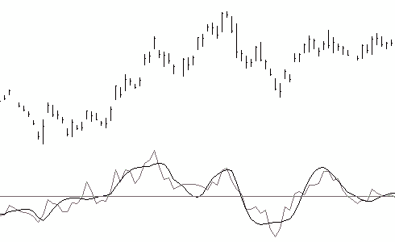
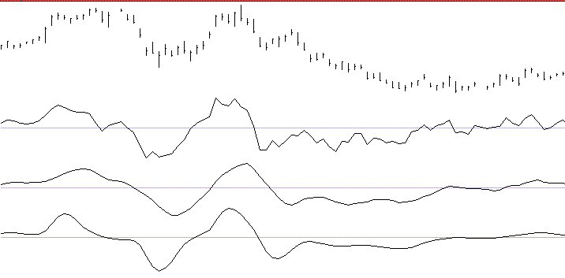
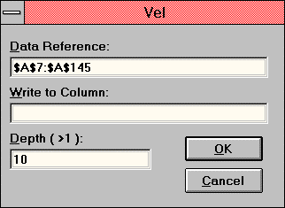

# VEL — Zero-Lag Velocity Momentum

## User's Guide — Add-In Tool for Microsoft Excel for Windows

**© 1998 Jurik Research and Consulting**
PO 2379, Aptos, CA — 831-688-5893; fax 831-688-8947

Source: `VEL.PDF` from Excel 97 Add-In distribution disk.

## BibTeX

```bibtex
@manual{jurik1998vel_xl,
  author       = {Jurik, Mark},
  title        = {{VEL} --- Zero-Lag Velocity: User's Guide for Microsoft Excel},
  year         = {1998},
  organization = {Jurik Research and Consulting},
  address      = {Aptos, CA}
}
```

---

## Table of Contents

- [Requirements](#requirements)
- [Installation](#installation)
- [Why Use VEL?](#why-use-vel)
- [How to Activate VEL](#how-to-activate-vel)
- [Calling VEL from Excel's Visual Basic for Applications](#calling-vel-from-excels-visual-basic-for-applications)

---

## Requirements

Our tools run inside:

- Microsoft Excel 5.0c, under Windows 3.1, 3.11, 95, or NT
- Microsoft Excel 7 and 97 under Win 95 and NT

---

## Installation

1. Using either the Window's Program Manager or Explorer, go to the floppy disk and run `JRS_XL.EXE`. It will request a password. Press OK. The installer will give you a computer identification number. Write it down.

2. Get your installation password from Jurik Research Software. Call 323-258-4860 (USA), fax 323-258-0598 or E-mail to nfsmith@anet.net. Either way, give your full name, mailing address and computer identification number. You will then be given a password.

3. Rerun `JRS_XL.EXE`, this time entering the password. The installer will verify your password. When approved, it will install documentation and demonstration files into a user specified directory and the tool(s) into your `EXCEL\XLSTART` subdirectory. Read messages in all windows — they are important. Scroll down if necessary.

4. Start Excel. The tool(s) will be ready to run from the DATA command menu.

### Notes

In the installed directory, you will find the following files:

| File | Description |
|---|---|
| `LEGALESE.TXT` | Legal notices and warranties |
| `ORDRFORM.HLP` | A printable order form for all products we sell |
| `CATALOG.HLP` | An online catalog of all products we sell |

In each installed `xxx_DEMO` subdirectory, you will find the following files:

1. All the necessary demonstration XLS files.
2. A new VBA module, showing how to control a tool using Excel's Visual Basic.

### Passwords

If you upgrade to a new computer, you will need a new password to install these tools. If you want to run them on additional computers, you will need additional passwords. Call Jurik Research Software (323-258-4860) for details.

---

## Why Use VEL?

**To obtain lag-free smoothing of the standard momentum indicator!**

### Brief Description

VEL (Zero-Lag Velocity) is a super smooth version of the technical indicator "momentum" with the special feature that the smoothing process has added no additional lag to the original momentum indicator. The chart on this manual's front cover illustrates a curve by VEL superimposed over the standard (and noisy) momentum. Less lag means better timing and a smoother curve has less noise that causes false signals. All in all, VEL provides the perfect momentum oscillator.



*VEL (smooth curve) superimposed over the standard noisy momentum indicator.*

### Background

One of the simplest ways to play the market is to buy when prices are rising and sell otherwise. If the trends are long enough, this strategy does very well. The momentum indicator (i.e. today's price minus that of N bars ago) is an effective indication of market direction. As N increases, more evidence is considered and the indicator becomes more accurate. However, the estimate's delay of N/2 bars also increases, delaying trades by a few critical bars, possibly making them too late to be profitable. It is the classic tradeoff: accuracy versus timing. You cannot have both... or can you?

You can with a new momentum oscillator from Jurik Research. By using sophisticated matrix algebra, it improves both accuracy and timing.

Refer to Figure 1. The first graph is the H-L-C daily price bars of D-Mark futures, from 8/92 to 12/92. The second graph (line A) is the ordinary 7-day momentum oscillator. N=7 is fast enough to capture the cyclic motion and not too fast to be extra jittery.

The classic method for reducing jitter is to use a M-bar wide moving average of the indicator. Note how often the plain oscillator (line A) crosses the zero-threshold line in the right-half of the graph and how the 6-bar averaged version (line B) is smoother and crosses the zero-line much less frequently.

This improvement comes with a penalty. Note the tops and bottoms of line B lag behind those of line A by (6/2 = 3) bars, on average. There is also a corresponding lag at all locations where line B crosses the zero-threshold line.

Line C was produced by our momentum oscillator, called "JRC Velocity" (VEL). This truly amazing indicator has the best of both worlds, smooth lines and no lag! Line C's tops, bottoms and zero-crossings all coincide with those of line A. We refer to this amazing feat as **ZERO-LAG FILTERING**, once thought by the financial community as a feat impossible to achieve!

VEL has one input parameter: **DEPTH**. Depth controls how many bars are simultaneously examined by our proprietary momentum (velocity) formula. Depth size is analogous to the window size of a classical momentum oscillator.



*Figure 1 — Line A is a 7-bar momentum of D-Mark futures. Line B is the result of smoothing line A using a 6-bar moving average (lagging by 3 bars). Line C is a smoothed momentum obtained by using VEL.*

---

## How to Activate VEL

### The Zero-Lag Momentum Oscillator

If you installed VEL into the `EXCEL/XLSTART` subdirectory, then when you start Excel, VEL is automatically loaded and ready for use. It is accessed by the **"VEL"** command in the **DATA** menu.

#### Demonstration

1. In Excel, go to the directory where your documentation and demonstration XLS files were installed. Open file `VEL_DEMO.XLS`. If you are using Excel 5 or 7, use the SAVE AS command to save the file back onto your hard drive. Give it the new filename `VEL_DEM5.XLS` and specify it as a Microsoft Excel Workbook in the dialog field "Save File As Type".

2. Column 1 of the spreadsheet file contains 139 consecutive days of S&P futures closing prices. In this demo, you will create a 10-bar momentum oscillator using VEL and compare it to the classical 10-bar momentum oscillator.

3. Select all the cells in the column containing the time series to be sampled.

   > **NOTE:** Do not begin data time series in row 1. Row 1 is to be reserved for a text description (label) of the data. If you do not want to use a text description of the data column, then leave the cell in row 1 of this column blank.

4. In file `VEL_DEMO.XLS`, click on the first reference data cell (row 7, column 1) to highlight it. Include all the remaining data in the time series. You can easily do this by pressing CTRL-SHIFT-DOWN.

5. Bring up the tool dialog box by selecting the "VEL" command in the DATA menu.



*Figure 2 — VEL's dialog box.*

As shown in Figure 2, the dialog has three data entry fields. When you select the time series data before calling VEL, the first field will automatically be filled in. The user may move forward from field to field by pressing the TAB key and backward by pressing the SHIFT-TAB keys.

#### Data Reference

This field designates the region of cells in one column. The dialog's default for this field is to use the most recently selected (highlighted) region of columns during your current session with Excel. If only a single cell was most recently highlighted, then VEL defaults to the prior run's Data Reference.

The user may change the designated region of cells to any other region as follows:

1. Activate the dialog's field by clicking the mouse on the "Data Reference" field or press the TAB key until the field becomes highlighted, and
2. Modify its contents by either typing in the region description or by highlighting a new region on the spreadsheet.

For the demo: bring up the tool dialog box by selecting the "VEL" command in the DATA menu. Then press the TAB key until the dialog's "Data Reference" field is highlighted. Select the cell containing the first number of the time series (row 7, column 1). Select the rest of the data in the column by pressing CTRL-SHIFT-DOWN on the keyboard. Now all the cells in the "S&P" time series should be highlighted.

#### Write to Column

This field designates the column that VEL will write to. Its default is to use whatever column was designated the last time VEL was executed during your current session with Excel. If this is the first time VEL is being used during this session with Excel, then it defaults to being blank.

The user may change the designated column to any other column as follows:

1. Activate the dialog's field by clicking the "Write to Column" field or by pressing the TAB key until the field becomes highlighted, and
2. Select, with a mouse click, any cell in the column you wish to designate.

For the demo:

- Press the TAB key until the dialog's "Write to Column" field is highlighted. Select any cell in column 5 of the spreadsheet. This tells the tool that you want the tool's output to column 5.
- Press the RETURN key or select the RETURN button in the dialog.

#### Depth

This field specifies how many historical bars VEL should examine for each row of output. For example, a depth of 10 means that for each row of output, VEL will make a smoothed version of a 10 bar momentum oscillator. The default value of DEPTH is 10. DEPTH may be any value greater than 2 and less than 501.

To activate VEL, press the RETURN key.

For the demo:

- Press the TAB key until the dialog's "Depth" field is highlighted.
- Type in `10`
- Press the RETURN key or select the RETURN button in the dialog.

#### Dead Zone

Note that a block of cells at the top of each output range will be left blank. This "dead zone" gets larger for increasing values of DEPTH. The size of the dead zone for VEL is automatically calculated using the formula:

```
Dead_Zone = max( 30, DEPTH )
```

For example, the first output of a 50-bar momentum oscillator is in the 51st output cell. So for that example, the "dead zone" would be the first 50 output cells.

In the demo, recall that DEPTH=10, therefore the size of the dead zone will be 30. Since the first data cell was in row 7, VEL will begin writing on row (30 + 7) or row 37.

#### Returning Home

After VEL has finished, you may want to return to the top left-hand corner of the spreadsheet. An easy way is to press CTRL-HOME on the keyboard.

For the demo, the VEL curve is the red line in the second chart. Note how it is much smoother than the 10 bar momentum oscillator.

#### Automatic Titles

When VEL writes data out to the specified output column, it also gives a title to that column. The title is placed in the first row of that column.

The title is composed of two parts: the first is the title word found in row 1 of the reference data column, and the second part contains underscore `_V` followed by the DEPTH value used.

If no label is used in row 1 of the input reference column, then the title for the output column is composed of two parts: the first is `col` followed by the column number of the input column, and the second part is `_V` followed by the DEPTH value used. An example would be `col5_V10`.

For the demo, the title "S&P" is in row 1 of the reference data column, and DEPTH = 10. Therefore, the title `S&P_V10` was automatically created for the output column.

---

## Calling VEL from Excel's Visual Basic for Applications

> The following information is for advanced users who want to maximize the power of VEL by incorporating it within either user-defined subroutines or functions.

VEL may be called from Excel's Visual Basic for Applications (VBA). This powerful capability can be used to:

- Search for an optimal DEPTH parameter
- Create numerous columns of different DEPTH parameters
- Automate VEL for non-manual operation

### Setup

In your VEL installation directory (e.g. `C:\JRS\VEL_DEMO`) the workbook `VEL_VBA.XLS` contains a working example of how to use Excel's VBA to operate VEL automatically. It contains one spreadsheet and one VBA module sheet.

The VBA routine will make VEL produce three columns (using DEPTH values 8, 10, 12) for each of two different data columns (Oil and Water). You can run this example by executing the menu command `TOOLS / MACRO...` and selecting the VBA subroutine named `VELCall`.

`VELCall` assumes the following:

1. There is data in the region `A5:B200`, in a worksheet named "data" in an open Excel 5 workbook named `VEL_VBA.XLS`.
2. The two input data columns have titles in the first row.
3. Both the workbook containing input data for VEL and the workbook set up to receive output from VEL are currently open in Excel. In this example, workbook `VEL_VBA.XLS` will serve for both input and output.
4. The path to your `XLSTART` subdirectory is `D:\msoffice\excel\xlstart`. If this is not true for your system, you MUST edit the code accordingly. This will enable the "register" command to find the file `JRS_XL.DLL`.

### Example Macro Code

The following code makes VEL write to columns 4 through 9 (D through I). For each input column, there will be three output columns using DEPTH of 8, 10, 12 respectively.

```vb
'
' VEL_Loop Macro
' Demonstration code for using VEL
'
Sub VELCall()
    Dim speed As Single
    Dim VELFunc As Long
    Dim colnum As Integer

    Application.ScreenUpdating = False

    VELFunc = ExecuteExcel4Macro( _
        "register(""D:\MSOFFICE\EXCEL\XLSTART\JRS_XL32.xll"",""vel"",""JRRJ"")")

    '*** For Excel v5.0 or a Windows 3.1 environment, use the following line
    '
    'VELFunc = ExecuteExcel4Macro( _
    '    "register(""C:\EXCEL5\XLSTART\JRS_XL.xll"",""vel"",""IRRI"")")

    ' Loop through the two input columns and calculate three VEL filter
    ' speeds for each.  This will produce a total of 6 output columns.
    ' Call VEL using 3 parameters.  In this example...
    ' Param1: Input reference range is r5c1:r200c2 in sheet "Data"
    ' Param2: Output column number is appended as a text string to range "Data!r1c"
    ' Param3: DEPTH is converted to a text string

    For blocknum = 0 To 1
        For colnum = 4 To 6
            depth = 2 * colnum
            ExecuteExcel4Macro("call(" & VELFunc & _
                ", [VEL_VBA.XLS]Data!r5c" & LTrim(Str(blocknum + 1)) & _
                ":r200c" & LTrim(Str(blocknum + 1)) & _
                ", [VEL_VBA.XLS]Data!r1c" & LTrim(Str(colnum + blocknum * 3)) & _
                ", " & LTrim(Str(depth)) & ")")
        Next colnum
    Next blocknum

    ExecuteExcel4Macro("UNregister(" & VELFunc & ")")
    Cells(2, 1).Select
End Sub
```

*Excel VBA code calling VEL several times, with different DEPTH values.*

---

## Bug Bounty & Referral Reward

**If you find a bug — you win!** If you discover a legitimate bug in any of our preprocessing tools, you will receive:

- A $50 discount coupon
- A free upgrade coupon

You may collect as many coupons as you can and apply more than one discount coupon toward the purchase of your next tool.

**Referral Reward Policy:** When Jurik Research receives an order from someone who states that the order was based on your recommendation, they will credit you $50 toward your next purchase of their products or upgrades.
