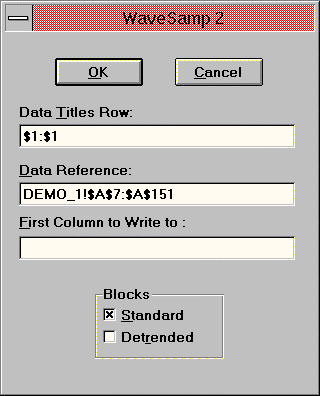
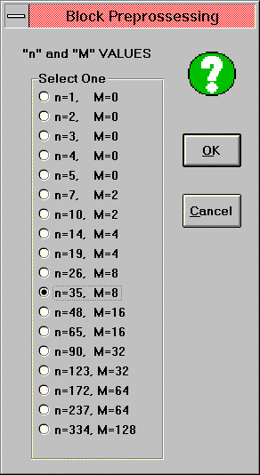
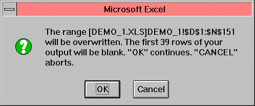

# WAV — Historical Sampling Filter (WaveSamp)

## User's Guide — Add-In Tool for Microsoft Excel for Windows

**© 1994 Jurik Research and Consulting**
PO 2379, Aptos, CA — 831-688-5893; fax 831-688-8947

Source: `WAV.PDF` from Excel 97 Add-In distribution disk.

## BibTeX

```bibtex
@manual{jurik1994wav_xl,
  author       = {Jurik, Mark},
  title        = {{WAV} --- Historical Sampling Filter (WaveSamp): User's Guide for Microsoft Excel},
  year         = {1994},
  organization = {Jurik Research and Consulting},
  address      = {Aptos, CA}
}
```

---

## Table of Contents

- [Requirements](#requirements)
- [Installation](#installation)
- [Why Use WAV?](#why-use-wav)
  - [Background](#background)
  - [Breakthrough: Wavelet Sampling](#breakthrough-wavelet-sampling)
  - [Modes of Operation](#modes-of-operation)
- [How to Activate WaveSamp](#how-to-activate-wavesamp)
  - [Demonstration #1](#demonstration-1)
  - [Demonstration #2](#demonstration-2)
- [Calling WAV from Excel's Visual Basic for Applications](#calling-wav-from-excels-visual-basic-for-applications)

---

## Requirements

Our tools run inside:

- Microsoft Excel 4.0 and 5.0c, under Windows 3.1, 3.11, or Windows 95
- Microsoft Excel 7 and 97 under Windows 95 and NT

---

## Installation

1. Using either the Window's Program Manager or Explorer, go to the floppy disk and run `JRS_XL.EXE`. It will request a password. Press OK. The installer will give you a computer identification number. Write it down.

2. Get your installation password from Jurik Research Software, calling 323-258-4860 (USA), or faxing 323-258-0598 (USA). Either way, give your full name, mailing address and computer identification number. You will then be given a password.

3. Rerun `JRS_XL.EXE`, this time entering the password. The installer will verify your password. When approved, it will install documentation and demonstration files into a user specified directory and the tool(s) into your `EXCEL\XLSTART` subdirectory. Read messages in all windows — they are important. Scroll down if necessary.

4. Start Excel. The tool(s) will be ready to run from the DATA command menu.

### Notes

In the installed directory, you will find the following files:

| File | Description |
|---|---|
| `LEGALESE.TXT` | Legal notices and warranties |
| `ORDRFORM.HLP` | A printable order form for all products we sell |
| `CATALOG.HLP` | An online catalog of all products we sell |

In each installed `xxx_DEMO` subdirectory, you will find the following files:

1. All the necessary demonstration XLS files.
2. A new VBA module, showing how to control a tool using Excel's Visual Basic.

### Passwords

If you upgrade to a new computer, you will need a new password to install these tools. If you want to run them on additional computers, you will need additional passwords. Call Jurik Research Software (323-258-4860) for details.

---

## Why Use WAV?

### Brief Description

If you are building a model whereby each data fact-record needs historical values of a time series and you can arrange the time series in a spreadsheet, then the Historical Data Wavelet Sampler, WaveSamp, is for you. When the original time series is arranged as a single column on a spreadsheet, WaveSamp adds additional columns such that within any row the additional cells look into the past. The wavelet sampling algorithm filters and samples the time series to efficiently squeeze short, medium and long term information into a very small number of indicators for your forecasting or financial trading system.

### Background

Let's suppose the time series involves numbers from the stock market's ticker tape. If you buy stock at today's market price, the price will already reflect long term fundamental factors. Variations in price (the source of profit making) are to a large degree due to changes in its perceived value. However, perception is partly emotional and thus partly unpredictable, giving trade prices a chaotic appearance. Despite this, a certain amount of predictability does exist provided you have all the necessary information to make such a prediction.

Exactly what information is relevant is not obvious. Sometimes an economic measurement that is useless for making forecasts all by itself becomes useful when used in conjunction with other measurements. For example, the long term price ratio of gold-to-oil has been fairly predictable for hundreds of years. Thus, if you know the long term average price of oil you can estimate the long term average price of gold. Another example would be to quantify a trend as the change between today's closing price and that of 5, 20 or 60 days ago. Better yet, you could evaluate change between today's price and an average price centered 5, 20 or 60 days ago. No matter how you slice it, past behavior of a time series bears information that should not be ignored.

In order to predict future price movements, investors use mathematical equations to model parts of the financial world. They first select important aspects of the data, such as the price of corn. They may then opt to modify that data in order to make it more useful. For example, one simple modification to a series of corn prices is to produce its moving average. The moving average serves to filter out chaotic "noise" in the day-to-day prices, leaving a smooth trend line. A simple short term buy/sell policy might be to buy immediately when the price rises above its moving average (and sell later on) or to sell immediately when the price falls below its moving average (and buy later on).

**Definitions:** Let's define *raw data* as the numbers coming right off the ticker tape machine. Any specific category, such as the price of gold, will be called a *raw feature*. Raw features could have their meaningful data hidden in noise or in some other way. The act of cleaning up raw features is called *preprocessing*. An example of preprocessing would be to attenuate noise in a raw feature by using a moving average.

Suppose you believe that a good forecasting model of the S&P 500 futures requires, as input, data spanning the last 300 days of S&P closing prices. You certainly do not want to create a model with 300 independent (input) variables! To do so will require an enormous amount of data for training the model. You would therefore like to reduce the number of columns from 300 to around 15. But taking the easy method of sampling every 20th day (300/15=20 days) is potentially useless to the model.

#### The Key Issue

Market oscillations between being overbought and oversold are due, in part, to a kind of psychological momentum that tends to persist despite changes in market conditions. It is the prime reason why 90% of all traders lose money. Each market has its own time-varying momentum (TVM), and these TVMs influence each other. Many TVMs, with different cycle lengths, may be driving the market you wish to forecast. Their cumulative effect contributes to the market price's complex waveform.

Many TVMs oscillate up and down at varying rates. For example, the seasons of the year cause annual cycles in food commodity prices; our country seems to need one good war every decade to keep the military industrial complex in good shape; the housing market has a mad rush about every 6 years; and so on.

Now consider two tangential thoughts. Suppose you are in a town where the air quality changes very slowly. If you paid $1 to get the air quality report, would you need to spend another dollar the next hour? Not really. Since the raw parameter (air quality) is changing slowly, you only need to pay $1 once per day. However, if the air quality changed hourly you would have to ask every hour. **The faster the changes, the more frequent the samples need to be taken.** This is intuitive.

The other thought: if a daily chart was entirely based upon a combination of cycles of different frequencies then we could recreate any point on the chart by just knowing what those underlying cycles were. If we sample in just the right way so as to detect all the underlying cycles then those samples are all we need to know "everything" about that curve.

**So for a trading system to work properly, it must have the right historical samples for detecting all possible TVMs affecting the market you wish to trade.** Although slow cycle TVMs may be sampled slowly (once per month), fast cycles must be sampled quickly (once per day). So the big question is: what is the best spread of samples in a financial time series when you do not have a clue about which TVMs are driving the market?

### Breakthrough: Wavelet Sampling

We need to sample a price time series in order to detect any underlying cycles and cycles with faster frequencies need to be sampled more frequently. The simple and inefficient way to accomplish this is to sample the price every day for the last year. We would no doubt capture all the cycle information but we would also require the model to accept over 200 input variables!

A more efficient way is to follow the concept of wavelet analysis, whereby only the smallest number of samples is taken for each cycle size. To see how this works, note that along the bottom of Figure 1 is a hypothetical price time-series whose current value is designated by the "today" marker. The zigzag waveforms above it represent TVMs of various cycles that might be driving that market.

**Figure 1:** Proper sampling of the market line requires getting just enough samples for detecting presence of the slow waveform, and just enough for detecting the medium-slow waveform, and just enough for all the other waveforms too. The dotted lines show where these samplings would occur. Note that the dotted lines get increasingly farther apart the further into history you sample.

Consider Figure 2. There are 5 horizontal rows of little squares, the rows labeled A through E. Let the last square in row A represent the S&P daily value on the last day of the year 1993. Row A is a time-series of prices, ending on the last day of 1993. Let rows B, C, D, E and F also represent the same time series as row A.

**Figure 2:** To capture any fast cycles that may exist in the S&P, every day's price must be sampled for the last four days, as shown by the black squares in row A. To capture a slower cycle, every other day is sampled as shown in row B. Slower cycles are sampled successively in rows C, D and E. Combine all the days that need to be sampled into one row, as shown in row F. This is a very efficient way to determine on which days the S&P price needs to be sampled in order to cover all possible cycle speeds with the least number of samples.

WaveSamp does more than merely sample historical prices. A single sample 32 days ago, for example, would not be very meaningful since such a sample would ignore data on all the days surrounding it. That's why WaveSamp filters the time-series before sampling it. The special filtering method forces every sample to contain information about a block of data points on both sides of the sample.

**Figure 3:** Let P1 through P16 be the S&P price on day 1 through 16. Suppose a fact record for your forecasting system contains several numbers: the "current" price, P16, and other historical prices. The historical sample WaveSamp creates from these prices is a combination of several prices. Prices P8 through P10 are combined to form a composite sample whose center is located 7 "days" before that of P16. If we define *n* to be the temporal distance between the "current" time slot and that of the sample, and *M* to be the number of additional data points included in the composite sample, then in this example, n = (16-9) = 7, and M = (10-8) = 2.

#### n-M Table

| max. distance | n | M |
|---|---|---|
| 1 | 1 | 0 |
| 2 | 2 | 0 |
| 3 | 3 | 0 |
| 4 | 4 | 0 |
| 5 | 5 | 0 |
| 8 | 7 | 2 |
| 11 | 10 | 2 |
| 16 | 14 | 4 |
| 21 | 19 | 4 |
| 30 | 26 | 8 |
| 39 | 35 | 8 |
| 56 | 48 | 16 |
| 73 | 65 | 16 |
| 106 | 90 | 32 |
| 139 | 123 | 32 |
| 204 | 172 | 64 |
| 269 | 237 | 64 |
| 398 | 334 | 128 |

*Table 1*

The column labeled "max. distance" indicates the farthest distance into the historical past that WaveSamp will sample for a specified value of n. For example: if you decide that an accurate forecast of tomorrow's S&P requires sampling up to the previous 135 days of activity, then you would select the next highest number from the "max. distance" column which would be 139. The corresponding "n" value would be 123.

After using WaveSamp, your original column of data will be accompanied by additional columns. Each column was produced by WaveSamp using a different "n" value from the table above, beginning with n=1 and ending with the "n" value you specified.

#### Column Selection by Forecast Distance

| Forecast Distance | Columns to use |
|---|---|
| 1–4 | `_1` through `_19` |
| 5–8 | `_2` through `_26` |
| 9–12 | `_3` through `_35` |
| 13–16 | `_4` through `_48` |
| 17–20 | `_5` through `_65` |
| 21–28 | `_7` through `_90` |
| 29–40 | `_10` through `_123` |
| 41–56 | `_14` through `_172` |
| 57–76 | `_19` through `_237` |
| 77–104 | `_26` through `_334` |
| 104–140 | `_35` through `_334` (7 columns) |
| 141–192 | `_48` through `_334` (6 columns) |

*Table 3 — One elegant property of wavelet sampling is its invariance to scale. Whether you want to forecast 4 days ahead or 40 days ahead, you select the same number of columns (9) produced by WaveSamp. The only difference is the actual columns selected.*

> **NOTES:**
> - The user is not constrained to employ exactly nine columns. As many or as few as desired may be used (provided there is enough historical data to support the lookbacks).
> - WaveSamp produces all the columns from `_1` to whichever you select when you specify lookback parameter n. If you don't want to use the first few columns, simply use Excel's `EDIT DELETE` command to remove them.
> - The reason you get to specify lookback parameter n rather than let WaveSamp simply give you all the columns is because the rightmost columns require a large amount of historical data. This requirement causes a large number of rows in the top of WaveSamp's output to be blank.

### Modes of Operation

WaveSamp 2.0 offers three different ways to preprocess your data:

1. **Standard** — designed to sample signals that do not have any long term trend. These signals include oscillators, stochastics and many other technical indicators. This mode is all that WaveSamp 1.0 offered.

2. **Detrend** — designed to sample signals that wander over long periods of time. These signals include prices, which tend to increase by way of inflation. In this mode WaveSamp cancels out the long term (or medium term) trend, causing the resulting values to fluctuate around zero. This lets your models process many years of financial data, regardless of how the data may have drifted during that time period.

   Available values of "n" for this mode are 26 or greater, although we strongly recommend setting "n" to be at least 48. Detrending a signal using a smaller time frame will produce correct results, but it may detrend out important medium-short term price action.

3. **Detrend & Normalize** — The detrend mode also offers optional automatic scale normalization. For example, if during the past 5 years, the price of T-Bonds was especially volatile during a 2-year period, automatic scale normalization would scale down the price activity during that time to make it more in line with the rest of the 5-year period. This way, price activity patterns are still preserved and can be accepted by your model without fear of overdriving your model's inputs.

   Available values of "n" for this mode are 48 or greater, although we strongly recommend setting "n" to be at least 90. Detrending and normalizing a signal using a smaller time frame will produce correct results, but they may appear visually unintuitive.

---

## How to Activate WaveSamp

### The Historical Data Wavelet Sampler

Whenever you start Excel, the tool is automatically loaded and ready for use. It is accessed by the **"WaveSamp 2"** command in the **DATA** menu. You can remove it from the DATA menu by selecting "Remove WaveSamp" in the DATA menu. Its removal is temporary and will reappear the next time Excel is started.

### Demonstration #1

1. Place the installation disk into your computer's floppy drive. Copy file `DEMO_1.XLS` from the floppy drive to any directory on your hard drive. In Excel for Windows, open file `DEMO_1.XLS`. If you are using Excel 5, use the SAVE AS command to save the file back onto your hard drive. Give it the new filename `DEMO_5.XLS` and specify it as a Microsoft Excel Workbook in the dialog field "Save File As Type".

2. Columns 1 and 2 of the spreadsheet file contain 145 consecutive days of "crude oil" and "crude water" futures closing prices. For this demo, you will pretend to be wanting to forecast the price of gold 10 trading days into the future using current and historical prices of crude oil and crude water. You plan to use WaveSamp to create these historical prices and automatically arrange them into rows suitable for feeding into a forecasting system.

3. To begin, note that for a forecast of 10 days, the largest recommended value for "n" is 35. Write this down, you'll need to refer to it later.

4. Select all the cells in the spreadsheet containing the time series to be sampled. In file `DEMO_1.XLS`, click on the first reference data cell (row 7, column 1) to highlight it. Include all the remaining data. You can easily do this by pressing CTRL-SHIFT-DOWN.

5. Bring up the tool dialog box by selecting the "WaveSamp2" command in the DATA menu.



*Figure 4 — WaveSamp's first dialog box.*

As shown in Figure 4, the dialog has three data entry fields. When you select the time series data before calling WaveSamp, the first two fields will automatically be filled in.

#### Data Titles Row

This field designates which row contains the title that describes the time series column as well as the row where titles for all the new columns will be placed. Its default is to use whatever row was designated the last time WaveSamp was executed during your current session with Excel. If this is the first time WaveSamp is being used, then it defaults to using row 1.

Finally, for each input reference (time series) column, the cell lying in the designated title row must contain an actual text field or WaveSamp will not execute. This is made mandatory because WaveSamp can process several time series columns simultaneously and it applies the titles to help the user distinguish which new columns belong to which time series.

#### Data Reference

This field designates the region of cells containing one or more input reference columns. Each column is considered to be a separate time series and WaveSamp will build a historical array for each one separately. The dialog's default for this field is to use the most recently selected (highlighted) region of columns during your current session with Excel.

For the demo:

- Press the TAB key until the dialog's "Data Titles Row" field is highlighted. Select the cell labeled "Oil" (row 2, column 1), or any other cell in row 2.
- Press the TAB key until the dialog's "Data Reference" field is highlighted. Select the cell containing the first number of the time series (row 7, column 1). Select the rest of the data by pressing CTRL-SHIFT-DOWN. Now all the cells in the "Oil" time series should be highlighted.

#### First Column to Write

This field designates the first (leftmost) column of the block of columns of data that WaveSamp will produce. Its default is to use whatever column was designated the last time WaveSamp was executed during your current session with Excel.

For the demo:

- Press the TAB key until the dialog's "First Column to Write" field is highlighted. Select any cell in column 4 of the spreadsheet. This tells the tool that you want the tool's output to begin in column 4.
- Press the RETURN key or select the RETURN button in the dialog.

#### Block Modes

You have the option to specify whether or not WaveSamp is to produce an array of values using the standard method and, in addition, whether or not WaveSamp is to produce a separate array using the detrend method.

#### Detrend Options

If you want WaveSamp to include the "detrend" mode, you then have the option to specify whether or not detrend is to also include localized normalization.

#### Live Formula Row

The last row of WaveSamp's output array contains live formulas. These are the same formulas used by WaveSamp to calculate the values in each cell of WaveSamp's output. The user may copy down the row of formulas onto additional rows. In doing so, any additional values placed in the input columns will automatically produce results in the output columns.

The advantage: when you append additional data to the bottom of the original time series column (the reference column), new rows of WaveSamp's output are automatically generated. The user does not need to re-enter the main menu and recall WaveSamp to reprocess all the data.

#### Block Preprocessing (n,M Selection)

The next dialog box (Figure 5) asks the user for lookback value "n". The modes "Trend" and "Trend & Normalize" have similar tables with the exception that the lowest "n" value is 26 and 48 respectively.



*Figure 5 — WaveSamp's second dialog box.*

For the demo, select n = 35 and press the RETURN key.

#### Dead Zone

Note that a block of cells at the top of each output range will be left blank. This "dead zone" gets larger for increasing values of lookback "n". The reason is that WaveSamp requires historical data that may chronologically precede the first number in the time series. The size of the dead zone is automatically calculated using the formula:

```
Dead_Zone = n + M / 2
```

In the demo, recall that n=35, M=8. The size of the dead zone will be 35+8/2=39. Since the first data cell was in row 7, WaveSamp will begin writing on row (39 + 7) or row 46.

#### Preprocessing Alert

After selecting the lookback value, WaveSamp reminds the user what cell ranges will be overwritten and the size of the dead zone.



*Figure 6 — WaveSamp's third dialog box.*

Press OK or hit the RETURN key to let WaveSamp proceed.

After WaveSamp has finished, you may want to return to the top left-hand corner of the spreadsheet. An easy way is to press CTRL-HOME on the keyboard.

#### Automatic Titles

When WaveSamp writes data out to the specified column, it also gives a title to that column. The title is placed in the designated row of that column.

The title is composed of two parts: the first is the title word found in the designated row of the reference data column, and the second part contains underscore `_` followed by the lookback value of that column.

For the demo, the title "oil" is in row 2 of the reference data column, and lookback values up to n=35 were used. Therefore the titles `Oil_1` through `Oil_35` were automatically created and placed in row 2.

As suggested by Table 3, the first few columns produced by WaveSamp, such as columns titled `Oil_1` and `Oil_2`, may be deleted. This may be desirable because when forecasting 10 trading days into the future, yesterday's price is not as important as the other days further out. These columns may be deleted using Excel's standard menu commands.

---

### Demonstration #2

*(Strongly recommended you try it)*

In this demonstration the user will use WaveSamp to build two blocks of historical samplings simultaneously, one for each of two fictitious time series (Crude Oil and Crude Water closing prices).

1. Copy file `DEMO_1.XLS` from the floppy drive to any directory on your hard drive. In Excel for Windows, open file `DEMO_1.XLS`.

2. Select the first data cell in column 1 and column 2. (Click on cell r7c1 (`$A$7`) and drag across to r7c2 (`$B$7`).)

3. Select the remaining cells in both time series. (Press CTRL-SHIFT-DOWN on the keyboard.)

4. Move to the top of the spreadsheet. (Grab the vertical scroll button and slide it all the way to the top.)

5. Select the "WaveSamp 2" command in the DATA menu.

6. Use row 2 for titles. (TAB through the dialog box until the "Data Titles Row" field is highlighted. Then click on any cell in row 2 of the spreadsheet.)

7. Have WaveSamp begin its output in column 4. (TAB through the dialog box until the "First Column to Write" field is highlighted. Then click on any cell in column 4 of the spreadsheet.)

8. Select both standard and detrended modes of processing. (Click to get an "X" in both the STANDARD and DETRENDED options.)

9. Select the NORMALIZED DETRENDED option. (Click on the appropriate radio button. Press the OK button or press the RETURN key.)

10. Have WaveSamp use a lookback of n=48. (Click on the n=48 selection in the Block Preprocessing dialog box. Click on the OK button or press the RETURN key. Click on OK again when the Pre-Processing Alert dialog box appears.)

You should now have 50 new columns of data, consisting of 25 columns for Oil and 25 columns for Water.

---

## Calling WAV from Excel's Visual Basic for Applications

> The following information is for advanced users who want to maximize the power of WAV by incorporating it within either user-defined subroutines or functions.

WAV may be called from Excel's Visual Basic for Applications (VBA). This powerful capability can be used to:

- Search for optimal number of WAV output columns to use for modeling
- Search for the optimal values of (n, m)
- Automate WAV's operation as part of an automated trading system

### Setup

In your WAV installation directory (e.g. `C:\JRS\WAV_DEMO`) the workbook `WAV_VBA.XLS` contains a working example of how to use Excel's VBA to operate WAV automatically. It contains one spreadsheet and one VBA module sheet.

The VBA subroutine will make WAV read data from two columns and expand both simultaneously, producing two groups of output columns, each with their respective titles in row 1. You can run this example by executing the menu command `TOOLS / MACRO...` and selecting the VBA subroutine named `WavCall`.

`WAVCall` assumes the following:

1. There is data in columns 1 and 2, in rows 5 to 500 in a worksheet named "data" in an open Excel workbook named `WAV_VBA.XLS`.
2. The two input data columns have titles in the first row.
3. Both the workbook containing the input data to WAV and the workbook ready to receive the output of WAV are currently open in Excel. In this example, workbook `WAV_VBA.XLS` will serve for both input and output.
4. The path to your `XLSTART` subdirectory is `D:\msoffice\excel\xlstart`. If this is not true for your system, you MUST edit the code accordingly. This will enable the "register" command to find the file `JRS_XL.DLL`.

### Calling Parameters

`WAVCall` uses 6 input parameters:

1. **Input Reference:** Specify the complete name of the range containing input data. In the example: `[WAV_VBA.XLS]Data!r5c1:r500c2`.

2. **Output Reference:** Specify the complete name of the column location where the output of WAV is to begin. In the example: `[WAV_VBA.XLS]Data!r1c5`. Note that the row coding "r1" will be ignored by WAV but must be specified anyway.

3. **Title Reference:** Specify the complete name of the row location of the titles or column labels (typically row #1) on the input data sheet. In the example: `[WAV_VBA.XLS]Data!r1`.

4. **N,M Index:** Specify the row you want to use in the N,M table. The example selects row 10 (n=26, M=8).

5. **Process Method:** Select the desired process method(s):
   - `1` = Create only standard output data
   - `2` = Create both standard and detrended output data blocks
   - `3` = Create only detrended output data

   The example selects method #3.

6. **Normalization Option:** Select whether you want the detrended data to also be normalized:
   - `1` = Detrend and Normalize
   - `2` = Detrend only

   The example selects option #2.

### Example Macro Code

```vb
'
' WAVCall Macro
' Demonstration code for using WAV
'
Dim WaveFunc As Long

Sub WAVCall()
    Application.ScreenUpdating = False

    WaveFunc = ExecuteExcel4Macro( _
        "register(""D:\MSOFFICE\EXCEL\XLSTART\JRS_XL32.xll"",""Wave"",""JRRRJJJ"")")

    '*** For Excel v5.0 or a Windows 3.1 environment, use the following line instead
    '
    ' WaveFunc = ExecuteExcel4Macro( _
    '     "register(""C:\EXCEL5\XLSTART\JRS_XL.xll"",""Wave"",""JRRRJJJ"")")

    ' Call WaveSamp using 6 parameters.  In this example...
    ' Input reference range is r5c1:r500c2 in sheet "Data"
    ' Output is in column 5 in sheet "Data"
    ' Title is in row 1 in sheet "Data"
    ' Use Line 10 in the n,M table  {n=28, M=8}
    ' Use Detrended values only  (1=standard, 2=standard & detrend, 3=detrend)
    ' Do not Normalize   (1= detrend and normalize, 2= detrend only)

    ExecuteExcel4Macro("call(" & WaveFunc & _
        ", [WAV_VBA.XLS]Data!r5c1:r500c2" & _
        ", [WAV_VBA.XLS]Data!r1C5" & _
        ", [WAV_VBA.XLS]Data!r1" & _
        ", 10, 3, 2)")

    ExecuteExcel4Macro("UNregister(" & WaveFunc & ")")
End Sub
```

### Running the VBA Macro

To run the macro:

1. Select the worksheet showing data.
2. Select `TOOLS / MACRO...` from the command bar.
3. Select `WAVCALL` and press the RUN button.

---

## Bug Bounty & Referral Reward

**If you find a bug — you win!** If you discover a legitimate bug in any of our preprocessing tools, you will receive:

- A $50 discount coupon
- A free upgrade coupon

You may collect as many coupons as you can and apply more than one discount coupon toward the purchase of your next tool.

**Referral Reward Policy:** When Jurik Research receives an order from someone who states that the order was based on your recommendation, they will credit you $50 toward your next purchase of their products or upgrades.
