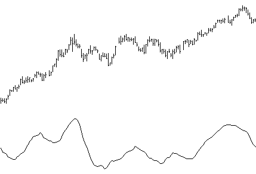

# CFB — Composite Fractal Behavior Index DLL Module

**For Windows Application Developers**

## BibTeX

```bibtex
@manual{jurik_cfb_dll,
  title        = {CFB: Composite Fractal Behavior Index DLL Module for Windows Application Developers — User's Guide},
  author       = {{Jurik Research}},
  organization = {Jurik Research \& Consulting},
  address      = {PO 460669, Aurora, CO 80046},
  year         = {1994--2001},
  note         = {From JRS\_DLL distribution}
}
```

## Requirements

- Windows 95, 98, 2000 or NT 4.
- Application software that can access DLL functions.

## Installation

1. Execute the Installer, `JRS_DLL.EXE`. It will analyze your computer and give you a computer identification number. Write it down.
2. Get your access PASSWORD from Jurik Research Software. Call 323-258-4860 (USA), fax 323-258-0598 (USA), e-mail support@nfsmith.net, or write Jurik Research Software at 686 South Arroyo Parkway, Suite 237, Pasadena, California 91105. Be sure to give your full name, mailing address and computer identification number. You will then be given a password.
3. Rerun the installer `JRS_DLL.EXE`, this time entering the password when asked. Also enter all the Jurik Research modules that you currently are licensed to run. It will copy the latest version of these modules to any directory you specify.

**About New Passwords:** If you upgrade to a new computer, you will need a new password to run CFB. If you want to run CFB on additional computers, you will need additional passwords. Call 323-258-4860 for details.

---

## Why Use CFB?

### To Measure the Market's Trending Time Frame Without Cycles

CFB is an index that reveals the market's trending time frame, ideal for creating adaptive window sizes of various technical indicators.

All around you mechanisms adjust themselves to their environment. From simple thermostats that react to air temperature to computer chips in modern cars that respond to changes in engine temperature, r.p.m.'s, torque, and throttle position. It was only a matter of time before fast desktop computers applied the mathematics of self-adjustment to systems that trade the financial markets.

Unlike basic systems with fixed formulas, an adaptive system adjusts its own equations. For example, start with a basic channel breakout system that uses the highest closing price of the last N bars as a threshold for detecting breakouts on the up side. An adaptive and improved version of this system would adjust N according to market conditions, such as momentum, price volatility or acceleration.

Since many systems are based directly or indirectly on cycles, another useful measure of market condition is the periodic length of a price chart's dominant cycle (DC), that cycle with the greatest influence on price action.

The utility of this new DC measure was noted by author Murray Ruggiero in the January '96 issue of Futures Magazine. In it, Mr. Ruggiero used it to adaptively adjust the value of N in a channel breakout system. He then simulation-traded 15 years of D-Mark futures in order to compare its performance to a similar system that had a fixed optimal value of N. The adaptive version produced 20% more profit!

This DC index utilized the popular MESA algorithm (a formulation by John Ehlers adapted from Burg's maximum entropy algorithm, MEM). Unfortunately, the DC approach is problematic when the market has no real dominant cycle momentum. Therefore, we replaced the DC index with a proprietary indicator that does not presuppose the presence of market cycles. It's called CFB (Composite Fractal Behavior) and it works well whether or not the market is cyclic.

CFB examines price action for particular fractal patterns, categorizes them by size, and then outputs a composite fractal size index. This index is smooth, timely and accurate.

Essentially, CFB reveals the length of the market's trending action time frame. Long trending activity produces a large CFB index and short choppy action produces a small index value. Investors have found many uses for CFB, all related to scaling other existing technical indicators adaptively, on a bar-to-bar basis.



---

## C Programming the 32-bit CFB DLL

The file `JRS_32.DLL` contains the function `CFB`. In your C code, you should declare CFB as externally defined and, if using MS VC++, use the `_declspec(dllimport)` keywords. The function is exported as a C function, so if you are using C++, you should insert `"C"` between the words `extern` and `_declspec`. Also, you should link with `JRS_32.LIB`, which we provide.

### Declaration

```c
extern _declspec(dllimport) int WINAPI CFB(double *pdSeries,
    double *pdCFB, int iDataLength, int iSmooth, int iSpanSize);
```

### Parameters

| Parameter | Type | Description |
|-----------|------|-------------|
| `pdSeries` | pointer to double array | Input data |
| `pdCFB` | pointer to double array | Output data (CFB results) |
| `iDataLength` | signed integer | Number of elements in input and output arrays |
| `iSmooth` | signed integer | Output smoothness (1–50; larger = smoother) |
| `iSpanSize` | signed integer | Largest fractal size to consider (24, 48, 96, or 192) |

### Notes

- Both input and output arrays must be of the same size.
- `iSmooth` must be between 1 and 50 inclusive. Larger values produce smoother results.
- `iSpanSize` must be either 24, 48, 96, or 192. Larger values make CFB consider more data and move slower.
- Although CFB reads all the input data, it does not attempt to produce true CFB output for the first N elements of the input array, where N = iSpanSize + 6. Instead, the first N elements of the output array are assigned a constant value of ½ × iSpanSize. For example, if iSpanSize = 48, then the first 54 output elements are set equal to 24.

### Return Values

```c
//  0       SUCCESSFUL. NO ERROR ENCOUNTERED
// -1       INSTALLATION / PASSWORD PROBLEM
// 10101    MEMORY IS NOT ABLE TO BE INSTALLED
// 10102    INPUT DATA POINTER IS NULL
// 10103    OUTPUT DATA POINTER IS NULL
// 10104    NUMBER OF DATAROWS IS MORE THAN VALUE OF SIGNED INT
// 10105    NUMBER OF DATA ROWS IS LESS THAN 32 OR LESS THAN ISPANSIZE+2
// 10106    SPAN IS NOT 24, 48, 96 OR 192
// 10107    SMOOTH VALUE IS LESS THAN 1 OR GREATER THAN 50
```

### Example

```c
iDataLength = 2500;
iSmooth = 8;
iSpanSize = 48;

pdSeries = (double *) GlobalAllocPtr(GHND, sizeof(double) * iDataLength);
pdCFB    = (double *) GlobalAllocPtr(GHND, sizeof(double) * iDataLength);

/* At this location in code, fill up your input array */

error_code = CFB(pdSeries, pdCFB, iDataLength, iSmooth, iSpanSize);
```

---

## Visual Basic Programming Example

In your Jurik Research DLL installation directory (e.g., `C:\JRS_DLL`) the workbook `CFB_DLL.XLS` contains a working example of how to use Excel's VBA to operate CFB automatically. The workbook includes:

- Worksheet "DLL VBA Results" — where you can apply the Visual Basic macro that calls the DLL
- Visual Basic Module — containing the VB macro code

Run the VBA macro called `CFB_Test` on the worksheet titled "DLL VBA Results". The macro gets the data in column 1 and sends it to the CFB function in the DLL four times, each time requesting a different CFB span size (fractal length). The output array produced by CFB is then written back into columns 3 to 6 of the worksheet.

### Declaration

```vb
Declare Function CFB Lib "JRS_32.dll" ( _
    ByRef pdData As Double, _
    ByRef pdOutData As Double, _
    ByVal iDatalength As Long, _
    ByVal iSmooth As Long, _
    ByVal iSpanSize As Long) As Long
```

### Example

```vb
Option Base 1

Sub CFB_test()
    Dim InputData() As Double
    Dim OutputData() As Double
    Dim iK, iJ, iDatalength, iResult, iSmooth As Long
    Dim iPower As Long
    Dim iaSpan() As Long
    Dim calctype As Long

    '--- CFB DLL return error codes ---
    '    0        NO ERROR CONDITIONS MET
    '   -1        PROBLEM WITH PASSWORD/INSTALLATION
    '10102        POINTER TO DATA NULL
    '10103        POINTER TO OUTPUT MEMORY NULL
    '10104        datarows > signed int
    '10105        data rows < 32 or < span+2
    '10106        span != 24,48,96, or 192
    '10107        smooth<2 || >50

    iDatalength = 1000   ' length of input array
    iSmooth = 10         ' CFB smoothness factor
    iSpans = 4           ' total number of possible span parameter values

    ReDim InputData(1 To iDatalength)
    ReDim OutputData(1 To iDatalength)
    ReDim iaSpan(1 To iSpans)

    'disable automatic calculation
    calctype = Application.Calculation
    Application.Calculation = xlManual

    'assign fractal lengths into array of span values
    iaSpan(1) = 24
    iaSpan(2) = 48
    iaSpan(3) = 96
    iaSpan(4) = 192

    'copy data from spreadsheet into array
    For iK = 1 To iDatalength
        InputData(iK) = Cells(iK + 1, 1)
    Next iK

    ' Apply CFB to input array, using all 4 fractal lengths
    For iJ = 1 To iSpans
       iResult = CFB(InputData(1), OutputData(1), iDatalength, iSmooth, iaSpan(iJ))
       If (iResult <> 0) Then
            ' Post Error Message
            Call Error_handler(iResult, calctype)
       Else
            ' Put data into spreadsheet and ZERO it out from array
            For iK = 1 To iDatalength
                Cells(1 + iK, 2 + iJ).FormulaR1C1 = OutputData(iK)
                OutputData(iK) = 0
            Next iK
       End If
    Next iJ

    ' restore calculation type
    Application.Calculation = calctype
End Sub

' The following subroutine is a simple way to handle run-time errors that may occur
' It is good practice to handle each error type mentioned in the user manual.
Private Sub Error_handler(ByVal error_code As Long, ByVal calctype As Long)
    Dim result As Long
    result = MsgBox("Error number " & Str(error_code) & _
                    " was returned by CFB.", , "CFB Error")
    Application.Calculation = calctype
    End   ' this END command will halt execution of the VBA code.
End Sub
```
