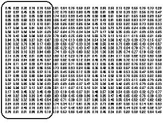

# DDR 2.2 — Decorrelator and Dimension Reducer DLL Module

**For Windows Application Developers**

## BibTeX

```bibtex
@manual{jurik_ddr_dll,
  title        = {DDR 2.2: Decorrelator and Dimension Reducer DLL Module for Windows Application Developers — User's Guide},
  author       = {{Jurik Research}},
  organization = {Jurik Research \& Consulting},
  address      = {PO 460669, Aurora, CO 80046},
  year         = {1994--2001},
  note         = {From JRS\_DLL distribution}
}
```

## Requirements

- Windows 98, 2000, NT4 or XP.
- Application software that can access DLL functions.

## Installation

1. Execute the Installer, `JRS_DLL.EXE`. It will analyze your computer and give you a computer identification number. Write it down.
2. Get your access PASSWORD from Jurik Research Software. Call 323-258-4860 (USA), fax 323-258-0598 (USA), e-mail support@nfsmith.net, or write Jurik Research Software at 686 South Arroyo Parkway, Suite 237, Pasadena, California 91105. Be sure to give your full name, mailing address and computer identification number. You will then be given a password.
3. Rerun the installer `JRS_DLL.EXE`, this time entering the password when asked. Also enter all the Jurik Research modules that you currently are licensed to run. It will copy the latest version of these modules to any directory you specify.

### Important Notices

**About Passwords:** If you upgrade to a new computer, or significantly upgrade your existing computer (such as flash a new BIOS), you should reinstall DDR and all other Jurik tools that are licensed for your computer. The installer will let you know if your current password is no longer valid. Also, if you want to run DDR on additional computers, you will need additional passwords. For new or replacement passwords, call 323-258-4860.

**About Data Validity:** When DDR encounters a problem (e.g. the password used during installation has become invalid), DDR will continue to run but the data produced will not be valid. To let you know this is the case, DDR will return an appropriate error code, but it will NOT post any warning message on your monitor. Therefore — do not assume DDR will always process your data correctly. You must validate DDR's output by CHECKING THE RETURN ERROR CODE immediately after each call to DDR.

---

## Why Use DDR?

### The Data Decorrelator by Jurik Research

#### Brief Description

If you are building a model whereby each data record contains numerous input (independent) variables and you can arrange the records as rows in a spreadsheet, then DDR is for you. On the same or another spreadsheet, DDR creates a new data set, arranged in the same number of rows and columns as the original data set, but with two important differences:

- All the columns are decorrelated.
- All the columns are ranked according to the strength of their information content.

This helps models in two ways:

- Models learn faster with decorrelated variables than correlated ones.
- Models learn faster when uninformative input variables are deleted.

#### Why Decorrelate and Reduce?

Knowing the future sure has its advantages, especially where making a profit is concerned. This is understood most clearly in financial exchanges where competing traders speculate on the rise and fall of market prices. Successful traders have several traits in common, and probably most important is knowing where to look for good information. They know that even the best forecast models are useless if the chosen indicators are not relevant.

**Collecting Relevant Indicators** — When an aspiring forecaster has no idea which indicators to use, he usually constructs models by feeding them lots of data, data that might have any relation to the desired forecast. For example, a model intended to forecast gold prices might be fed historical precious metal prices as well as estimates of its future supply and demand. Since gold is used a lot in jewelry, and its demand is a function of the public's perceived ability to buy jewelry, then additional indicators for the model may include estimates of the consumer confidence index and related indices. This collection of indicators could swell very quickly.

**A Well Kept Secret** — Suppose your model's input consists of 100 different indicators. Most beginners think that regression models receiving a large number of indicators will perform better than models receiving a small number. Surprisingly, smaller regression models frequently outperform larger ones! The statistical world refers to this counter-intuitive behavior as the "phenomenon of multi-colinearity". It says that models prefer uncorrelated indicators, and that feeding a large number of mutually correlated indicators to a model typically DEGRADES its performance.

**The Secret Explained** — To understand the "phenomenon of multi-colinearity", let's suppose we have some data records arranged as rows, with each record containing a few input variables. For each record, we also have the target output value. As an example, the input variables could be a person's height, weight, and shoe size; the target value could be the person's life expectancy. We would like a regression model that provides us with coefficients for calculating target values (life expectancy) from the corresponding input variables (height, weight and shoe size).

Recalling high school algebra, a model with fewer records than variables is "underconstrained", resulting in not one but an infinite number of sets of coefficients. Although each set would correctly calculate the target values, they may all produce different answers on new input data! This would be unacceptable.

In contrast, the more likely case in the real world is to have more records than variables. Models based on such data are typically "overconstrained" whereby no set of coefficients can deliver a perfect answer for every record. In such a case, we must simply accept a set of coefficients that offer performance with low overall error, usually a set delivering least mean square error. Standard regression, like the one embedded into Microsoft Excel, is designed to deliver least mean square error between a model's output and true target values.

The key word is "typically" because databases with lots of records can still be underconstrained, or very nearly so. This situation occurs when at least one input variable can be closely approximated by other input variables. For example, suppose the following table is a collection of five records (rows), each with three input variables and one target value. Now suppose that for any record in this database, a regression model can determine the target by multiplying the three input variables with coefficients (1, 3, −2) respectively.

| A | B | C | Target |
|-----|-----|-----|--------|
| 1.2 | 3.4 | 4.6 | 2.2 |
| 0.9 | 2.2 | 3.1 | 1.3 |
| 1.8 | 1.5 | 3.3 | −0.3 |
| 2.5 | 2.7 | 5.2 | 0.2 |
| 2.1 | 1.9 | 4.0 | −0.2 |

Let's see if this is true. In the first row, input data A=1.2, B=3.4 and C=4.6.

```
Model's Output = 1×A   + 3×B   + (−2)×C
               = 1×1.2 + 3×3.4 + (−2)×4.6
               = 1.2   + 10.2  + (−9.2)
               = 2.2
```

The model's output matches the target value of 2.2. The coefficients (1, 3, −2) work just as flawlessly for the other four records. One might believe, then, that these are the best coefficients for the model. They are not! Amazing as it may seem, there are an infinite number of equally good coefficient sets to this modeling problem. Some other equally good sets are (−1, 1, 0) and (0, 2, −1) and (3, 5, −4) and (7000, 7002, −7001)!

This is bad news. To see why, let's compare the performance of a model using coefficients (7000, 7002, −7001) and a model using (−1, 1, 0). The input data to both models will be a slightly modified version of record #1 in the example database: A=1.2, B=3.4, C=5. Multiplying the input data by coefficients (−1, 1, 0) produces the output value 2.2. However, multiplying the input data by coefficients (7000, 7002, −7001) produces the output −2798.2!! Although both coefficient sets produced identical results with the original database, they also produced drastically different results with new data. This is simply unacceptable.

The reason why this amazing experiment was possible is because column C of the database does not represent a truly "independent" variable. In fact, each value in column C could be calculated by adding the corresponding values in columns A and B. Simply put, C = A + B. As a rule of thumb, interdependence among input variables seriously degrades the ability of regression models (including neural nets) to perform reliably with new data.

What is even more disheartening is that similar damaging effects would occur even if column C was simply correlated to the sum of A+B! The greater the correlation, the more pronounced the effects. This is why you should consider giving models decorrelated input variables. It minimizes a model's divergent response to new data.

**The Bad News** — Unfortunately, financial indicators are highly correlated with each other, causing much frustration among those trying to model market behavior. This phenomenon forces all modelers to consider trying various combinations of two or more input variables until the best combination is found. Do you know how many possible combinations you can have with 100 indicators? About 10³⁰, equivalent to 100,000 times the number of atoms in a liter of water! Even with just ten indicators, there are over one thousand combinations to try! Examining the effectiveness of all these combinations could take you a very, very long time!

**Cutting Corners** — Some modeling tools try to get around this problem by performing correlation analysis between pairs of input variables. This practice is based on the assumption that if two variables are correlated, then you do not need both, and so one of them can be eliminated. This popular practice can easily lead to a dead end. Here's a simple example to illustrate why. Suppose your input consists of three time-series:

- A) the daily high tide level near San Francisco,
- B) the daily high tide level near Los Angeles,
- C) the price of apples in China.

Since signals A and B are very similar (and therefore highly correlated), one might be tempted to eliminate either one from the set of inputs to the model. But if you do, then the model could never create desired output signal D if its formula is D = A − B. In other words, a model can only calculate (A minus B) when both A and B are present! Therefore removing inputs on the basis of correlation can leave you with insufficient data and a non-working model.

Is there a better way to reduce the number of inputs to a model? YES! Professional forecasters have better ways to reduce the number of input variables and large companies can afford to pay their fees. This put individuals at a disadvantage. Until now, that is. With DDR, you now have access to the same powerful technique used by professional forecasters.

Suppose you arrange your model's data so that each indicator fills a separate column and each data case fills a separate row. DDR will take your data, and produce a new data array the same size as the old but with two important differences:

1. All the new columns will be completely uncorrelated with each other! This will very likely enhance a model's performance.
2. DDR ranks the new columns according to how well they explain all the input data. DDR typically boils down 50 correlated indicators to only 14 with very little loss of information! This ranking helps you decide which columns to throw away, giving you additional room to employ more of your favorite indicators!

#### Demonstration Results

| Model #1 | Model #2 | Model #3 |
|----------|----------|----------|
| Simple Regression on 21 columns of original data | Neural Net on 21 columns of original data | Neural Net on 5 columns produced by DDR |
| Error: 15.0% | Error: 6.4% | Error: 6.4% |

DDR puts the secret of professional forecasting in your hands!

### The Theoretical Basis of DDR

It may seem like magic that in most cases, models based on just a few of the new columns created by DDR perform just as well as models using all the original data! This is not an illusion; it is based on sound principles in mathematics. Consider the following example.

Suppose a long term medical research study measured blood pressure and cholesterol levels on 1,000 people and later recorded their age at death. Points in the figure represent data records, with axis P for pressure and C for cholesterol. The plot reveals three distinct groups, each group having a unique life expectancy.

The plot also shows that you cannot use just blood pressure readings or just cholesterol readings to distinguish which group any point would belong. This is because some neighboring groups overlap and share similar blood pressure measurements. Other points overlap and share similar cholesterol measurements. Therefore both are required to determine which group a point belongs.

We might also conclude that if an insurance company built a complex model that needed estimates on life expectancy, the model would also need both measurements. However, models typically perform better with a few key variables than a broad spectrum of many variables. So would it be possible to combine the measurements of blood pressure and cholesterol into one variable that can successfully discriminate among the three life expectancy groups?



The figure shows one way to do this. Two new axes are made: X and Y. Axis X travels through the centers of the three groups and axis Y lies perpendicular to X. We can now represent each point in the graph by giving either its P-C coordinates or its X-Y coordinates. The advantage to using these X-Y coordinates is that only the X axis serves to determine which life expectancy group a point belongs. The Y axis value serves no purpose. Therefore, concerning the life insurance model, we can represent information on forecasted life expectancy with only one variable, X, instead of both P and C.

In summary, DDR views each column of the original data as a separate axis, so that 21 columns represent 21 axes. DDR then creates a new set of axes and uses them to evaluate each point's new set of coordinates. DDR chooses the new axes so as to attain all the desirable properties mentioned in the beginning of this manual.

---

## Coding Applications

The DLL file contains two versions of DDR:

- **BATCH MODE** — accepts an entire array of input data and returns results into another array. This method requires the user provide the DLL function with pointers to two arrays. This version is ideal when an entire array is available for processing with only one call to DDR.
- **REAL TIME** — accepts one record (e.g. spreadsheet row) of input data and returns one same-size record as a result. DDR is called for each successive record in some arbitrary time series. This approach is ideal for processing real time data, whereby the user wants an instant DDR update as each new data record arrives.

## Dynamic Linking

### Load Time Dynamic Linking (Microsoft Compilers)

For load-time dynamic linking, you must use the LIB file `JRS_32.LIB`, located at `C:\JRS_DLL\LIB` (or on whichever drive you specified during installation). With load-time dynamic linking, the Jurik DLL is loaded into memory when the user's EXE is loaded.

### Load Time Dynamic Linking (non-Microsoft Compilers)

The LIB file provided will only work with the MS Visual C/C++ compiler. For C/C++ users with non-Microsoft compilers, you will probably not be able to use the LIB file for Load Time Dynamic Linking. You have two choices:

1. Consult your compiler's documentation to determine how to construct a LIB file from a DLL. For instance, Borland's compiler includes the `IMPLIB.EXE` utility.
2. Use run-time dynamic linking (described below). A LIB file is not required for this method.

### Run Time Dynamic Linking

You may prefer to use run-time dynamic linking instead of load-time. For example, users of Microsoft Visual C may wish to prevent the Jurik DLL from automatically loading along with the user's EXE. With run-time, the DLL is loaded only when the user's EXE specifically calls for it to be loaded with the `LoadLibrary` function.

For new C/C++ users, sample C files demonstrating run-time dynamic linking are located in the folder `C:\JRS_DLL\RUNTIME` (or on whichever drive you specified during installation).

---

## C Programming the 32-bit DDR DLL

The file `JRS_32.DLL` contains the functions `DDR` and `DDRUpdate`. In your C code, you should declare both functions as externally defined and, if using MS VC++, use the `_declspec(dllimport)` keywords. The function is exported as a C function, so if you are using C++, you should insert `"C"` between the words `extern` and `_declspec`. Also, you should link with `JRS_32.LIB`.

### DDR — Batch Mode Declaration

```c
extern _declspec(dllimport) int WINAPI DDR( double * pDataRef, double * pOutRef,
    DWORD dwRows, DWORD dwCols, double * pdContrib, LPSTR szFileName );
```

#### Parameters

| Parameter | Type | Description |
|-----------|------|-------------|
| `pDataRef` | pointer to double | Memory space containing the matrix of raw data to be processed |
| `pOutRef` | pointer to double | Memory space for the decorrelated output matrix (same size as input) |
| `dwRows` | DWORD | Number of rows of data in the input matrix |
| `dwCols` | DWORD | Number of columns of data in the input matrix |
| `pdContrib` | pointer to double array | Will hold relative contribution values for each output column |
| `szFileName` | LPSTR | Path/name for the coefficient file (pass NULL to skip file creation) |

### DDRUpdate — Real Time Declaration

```c
extern __declspec(dllimport) int WINAPI DDRUpdate( LPSTR szFileName,
    double * pdResult, double * pdNewData, DWORD dwColumn, DWORD dwCols );
```

#### Parameters

| Parameter | Type | Description |
|-----------|------|-------------|
| `szFileName` | LPSTR | Path and name of the coefficient file to be opened for updates |
| `pdResult` | pointer to double | Update result will be placed here |
| `pdNewData` | pointer to double array | Row of data required to create an update |
| `dwColumn` | DWORD | Which column of DDR's output is being updated (first column = 0) |
| `dwCols` | DWORD | How many columns there are in a row of data |

### Notes

- DDR must be called with at least 2 columns of data with at least 3 rows.
- The input and output arrays must be the same size.

### Return Values (both DDR and DDRUpdate)

| Code | Meaning |
|------|---------|
| 0 | No errors |
| 1 | Out of memory condition |
| 2 | DLL not properly installed |
| 3 | DDR called with NULL data pointer |
| 4 | DDR called with NULL output pointer |
| 5 | DDR called with NULL contribution pointer |
| 6 | There must be more than one column of data to be decorrelated |
| 7 | There must be at least 3 rows of data to be decorrelated |
| 8 | Couldn't create coefficient file |
| 9 | DDR could not converge, data already decorrelated |
| 10 | DDR could not write coefficient file |
| 11 | DDR could not open coefficient file |
| 12 | DDR could not read coefficient file |
| 13 | Number of columns in coefficient file don't match update request |

### Example

```c
rows   = 2500;
cols   = 15;

InPtr  = (double *) GlobalAllocPtr( GHND, sizeof(double) * length * width);
OutPtr = (double *) GlobalAllocPtr( GHND, sizeof(double) * length * width);
ValPtr = (double *) GlobalAllocPtr( GHND, sizeof(double) * width);

/* At this location, check that memory was actually allocated,
   and then put your data into the input array. */

err_code = DDR( Inptr, OutPtr, rows, cols, ValPtr, "C:\\MyDir\\MyFile.ddr" );
// check value of err_code and handle errors

/* To use your new decorrelation matrix, provide DDRUpdate with a
   row of data and it will return user-selected elements from the
   decorrelated version of that row. */

InRowPtr  = (double *) GlobalAllocPtr( GHND, sizeof(double) * width);
OutRowPtr = (double *) GlobalAllocPtr( GHND, sizeof(double) * width);

/* To use your new decorrelation matrix, provide DDRUpdate with a
   row of data pointed to by InRowPtr.  DDRUpdate will decorrelate the row
   and return one row element, specified by OutColNum. */

for( OutColNum=0; OutColNum < cols; OutColNum++ )
{
    err_code = DDRUpdate( "C:\\MyDir\\MyFile.ddr", OutRowPtr + OutColNum,
                          InRowPtr, OutColNum, cols );
    // check value of err_code and handle errors
}
```

---

## Visual Basic Example (DDR and DDRUpdate)

In your Jurik Research DLL installation directory (e.g., `C:\JRS_DLL`) the workbook `DDR_DLL.XLS` contains a programming example using Excel's VBA to call functions DDR and DDRUpdate. The workbook includes a worksheet where you can run the macro `DDR_Test` to run both functions.

Run the VBA macro called `DDR_Test`. It will produce a decorrelated matrix two ways: the entire matrix all at once, and then row-by-row.

### Declarations

```vb
Declare Function DDR Lib "JRS_32.dll" ( _
    ByRef pDataRef As Double, _
    ByRef pOutRef As Double, _
    ByVal dwRows As Long, _
    ByVal dwCols As Long, _
    ByRef pdContrib As Double, _
    ByVal szFileName As String) As Long

Declare Function DDRUpdate Lib "JRS_32.dll" ( _
    ByVal szCofsFileName As String, _
    ByRef pdResult As Double, _
    ByRef pdNewData As Double, _
    ByVal dwColumn As Long, _
    ByVal dwCols As Long) As Long
```

### Example

```vb
Sub DDR_test()
    Dim error_val As Long
    Dim CoefFile As String
    Dim calctype As Long

    ' In this example, input array has 15 rows, 3 columns.
    Const TotalRows = 15
    Const TotalCols = 3

    CoefFile = "C:\MyDir\My File.ddr"

    'disable automatic calculation and screen update
    calctype = Application.Calculation
    Application.Calculation = xlManual
    Application.ScreenUpdating = False

    ' The data must be rearranged as one-dimensional arrays,
    ' because VBA stores arrays in memory in column order, while
    ' programs written in C store them in row order.
    Dim InputData(1 To TotalRows * TotalCols) As Double
    Dim OutputData(1 To TotalRows * TotalCols) As Double
    Dim Contrib(1 To TotalCols) As Double

    ' Place values from spreadsheet into InputData array.
    ' Data begins in row 3 column 1
    For j = 1 To TotalCols
        For k = 1 To TotalRows
            InputData((k - 1) * TotalCols + j) = Cells(k + 2, j)
        Next k
    Next j

    ' Create DDR coefficient matrix file and process data in the
    ' entire input array, placing results into output array.
    error_val = DDR(InputData(1), OutputData(1), TotalRows, _
        TotalCols, Contrib(1), CoefFile)

    If (error_val) Then
        Call Error_handler(error_val, calctype)
    End If

    ' Put DDR's contribution row into worksheet beginning at row 2 column 5
    For k = 1 To TotalCols
        Cells(2, k + 4).FormulaR1C1 = Contrib(k)
    Next k

    ' Put DDR's output array into worksheet beginning at row 3 column 5
    For j = 1 To TotalCols
        For k = 1 To TotalRows
            Cells(k + 2, j + 4).FormulaR1C1 = OutputData((k - 1) * TotalCols + j)
        Next k
    Next j

    Dim InputRow(1 To TotalCols) As Double
    Dim OutputVal As Double

    ' The test below feeds DDRUpdate() the input data array, InputData, one row
    ' at a time and calculates the decorrelated values, putting them into the
    ' spreadsheet so that they may be compared with the values calculated by DDR().
    ' They should be equal.

    For j = 1 To TotalRows
        ' First, copy a row of elements from the array InputData to InputRow.
        For k = 1 To TotalCols
            InputRow(k) = InputData((j - 1) * TotalCols + k)
        Next k

        ' Next, feed the row to DDRUpdate.
        '
        ' Note that the fourth input parameter to DDRUpdate uses k-1 instead
        ' of k because DDRUpdate uses array indices that start at zero.
        ' Normally, new data not used in generating the coefficient file would be
        ' fed to DDRUpdate. This permits DDRUpdate to decorrelate new rows in
        ' real time.

        For k = 1 To TotalCols
            error_val = DDRUpdate(CoefFile, OutputVal, InputRow(1), k - 1, TotalCols)
            If (error_val) Then
                Call Error_handler(error_val, calctype)
            End If
            Cells(j + 2, k + 8).FormulaR1C1 = OutputVal
        Next k
    Next j

    Application.ScreenUpdating = True
    Application.Calculation = calctype
End Sub

' The following subroutine is a simple way to handle run-time errors that may occur
' It's good practice to handle each error type mentioned in the user manual.
Private Sub Error_handler(ByVal error_code As Long, ByVal calctype As Long)
    Dim result As Long
    result = MsgBox("Error number " & Str(error_code) & _
                    " was returned by DDR.", , "DDR Error")
    Application.Calculation = calctype
    End   ' this END command will halt execution of the VBA code.
End Sub
```
