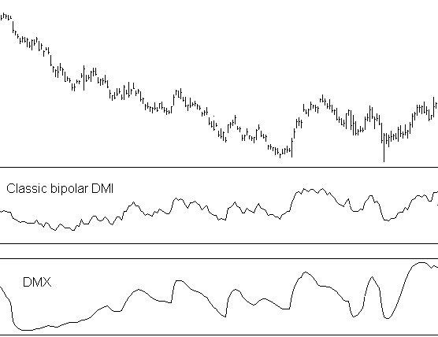
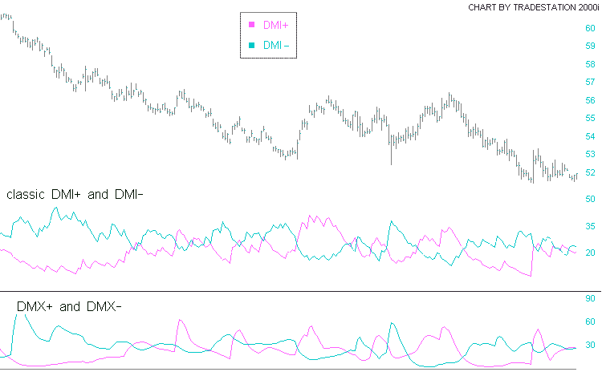
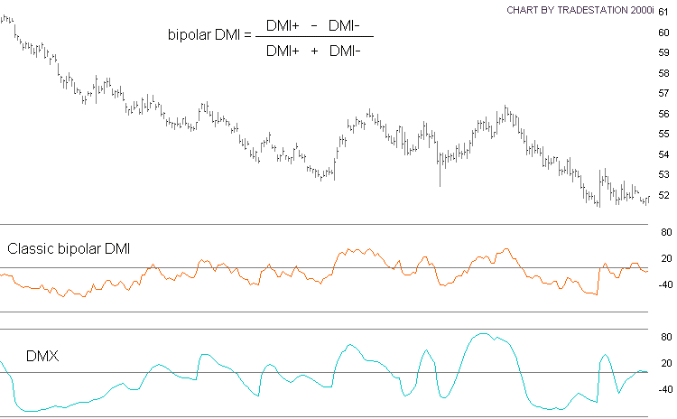

# DMX — Directional Movement Index DLL Module

**For Windows Application Developers**

## BibTeX

```bibtex
@manual{jurik_dmx_dll,
  title        = {DMX: Directional Movement Index DLL Module for Windows Application Developers — User's Guide},
  author       = {{Jurik Research}},
  organization = {Jurik Research \& Consulting},
  address      = {PO 460669, Aurora, CO 80046},
  year         = {1994--2002},
  note         = {From JRS\_DLL distribution}
}
```

## Requirements

- Windows 98, 2000, NT4, XP
- Application software that can access DLL functions

## Installation

There is no separate installation procedure for DMX. If you just acquired a user license for JMA, then DMX is created when you install JMA. If you had installed JMA a long time ago, then you obtain DMX by downloading it from the "Freebie" section of Jurik Research's website.

To operate DMX, you must have JMA already installed.

### Important Notices

**About Passwords:** If you upgrade to a new computer, or significantly upgrade your existing computer (such as flash a new BIOS), you should reinstall JMA, DMX and all other Jurik tools that are licensed for your computer. The installer will let you know if your current password is no longer valid. For new or replacement passwords, call 323-258-4860.

**About Data Validity:** When DMX encounters a problem (e.g. the password used during installation has become invalid), DMX will continue to run but the data produced will not be valid. To let you know this is the case, DMX will return an appropriate error code, but it will NOT post any warning message on your monitor. Therefore — do not assume DMX results are correct. You must validate DMX's output by CHECKING THE RETURN ERROR CODE immediately after each call to a DMX function.

---

## Why Use DMX?

### Smoother and More Responsive than DMI+, DMI− and ADX

#### Brief Description

DMX (Directional Movement Index) is a super-smooth version of the technical indicator DMI, while retaining very fast response speed. Low-lag super-smoothing means the DMX signal has less noise (yielding fewer false alarms) and less delay than DMI. Jurik's DMX is composed of two basic functions: DMX+ and DMX−, and they are superior to the classic DMI+ and DMI−. And since ADX is slower than DMI, Jurik's DMX is superior to ADX as well.

#### Background

The classic DMI indicator compares upward price action to downward price action and represents their "difference" in a chart scaled from 0 to 100. A strong trend (in either direction) will produce a DMI value close to 100 and the absence of any clear trend will produce a DMI value close to 0.

The speed and clarity of the DMI signal depends on the speed and clarity of the two component signals: DMI+ which measures upward motion, and DMI− which measures downward motion. If these two signals are noisy, then DMI will also be noisy, which renders the signal unreliable for market analysis.

The source of the noise problem is that DMI+ and DMI− use the standard exponential moving average (EMA) for smoothing. Unfortunately, the EMA is a poor noise filter. In contrast, JMA is a vastly superior filter and DMX is simply DMI analysis modified to use JMA instead of EMA for smoothing purposes.

The improvement gained by using JMA is amazing. The chart below compares the classic pair of DMI+ and DMI− signals against the pair of DMX+ and DMX− signals. Note how DMX+ and DMX− reduce noise yet are just as timely at indicating market reversals.





The next chart compares DMX to a bipolar form of DMI. (Bipolar means the signal can have negative as well as positive values. Values are negative when market trend is downward.) Here too, DMX is just as timely as DMI regarding market reversals, but virtually noise-free.



DMX has only one adjustable input parameter: LENGTH. Length controls DMX smoothness. Larger values force DMX to consider more historical points, making DMX run slower and smoother.

---

## Coding Applications

DMX is a function that can produce three different time-series results simultaneously: DMX bipolar, DMX+ and DMX−. DMX bipolar is an ultra-smooth version of the classic DMI with the added capability to be negative in value when the market is trending down. DMX+ and DMX− are the ultra-smooth versions of DMI+ and DMI− respectively.

DMX comes in two versions:

- **BATCH MODE** — accepts entire arrays of input data and returns results into other arrays of equal length. This version is ideal when an entire array is available for processing, since it requires only one call to DMX.
- **REAL TIME** — accepts one period or bar of time-series data and returns results for that time bar. This approach is ideal for processing real time data, whereby the user wants an instant DMX update as each new data value arrives.

## Dynamic Linking

### Load Time Dynamic Linking (Microsoft Compilers)

For load-time dynamic linking, you must use the LIB file `JRS_32.LIB`, located at `C:\JRS_DLL\LIB`. With load-time dynamic linking, the Jurik DLL is loaded into memory when the user's EXE is loaded.

### Load Time Dynamic Linking (non-Microsoft Compilers)

The LIB file provided will only work with the MS Visual C/C++ compiler. You have two choices:

1. Consult your compiler's documentation to determine how to construct a LIB file from a DLL (e.g., Borland's `IMPLIB.EXE`).
2. Use run-time dynamic linking. A LIB file is not required for this method.

### Run Time Dynamic Linking

You may prefer run-time dynamic linking. With run-time, the DLL is loaded only when the user's EXE specifically calls `LoadLibrary`. Sample C files are located in the folder `C:\JRS_DLL\RUNTIME`.

---

## C Programming — Batch Mode

The file `JRS_32.DLL` contains the function `DMX`. DMX works only when the JMA toolset is installed on the same computer. DMX can return all three time series simultaneously (DMX bipolar, DMX+ and DMX−). If the user sets an output array pointer to NULL, then DMX will not calculate that specific time series result.

### Declaration

```c
extern _declspec(dllimport) int WINAPI DMX(
    double *pdInHIGH, double *pdInLOW, double *pdInCLOSE,
    double *pdOutBipolar, double *pdOutPlus, double *pdOutMinus,
    double dLength, INT iSize );
```

### Parameters

| Parameter | Type | Description |
|-----------|------|-------------|
| `pdInHIGH` | pointer to double array | Time series of market bar HIGH prices |
| `pdInLOW` | pointer to double array | Time series of market bar LOW prices |
| `pdInCLOSE` | pointer to double array | Time series of market bar CLOSE prices |
| `pdOutBipolar` | pointer to double array | DMX bipolar results (or NULL to skip) |
| `pdOutPlus` | pointer to double array | DMX+ results (or NULL to skip) |
| `pdOutMinus` | pointer to double array | DMX− results (or NULL to skip) |
| `dLength` | double | Smoothness of DMX (1–500; typical 10–30) |
| `iSize` | 32-bit signed integer | Number of doubles in each data array |

### Notes

- All input and output arrays must be the same size, as specified by `iSize`.
- `iSize` must be no less than 41, as the first 40 result values are forced to zero.
- `dLength` may range from 1 to 500. Typical values range from 10–30.
- If any output pointer is NULL, then DMX will not create values for the corresponding time series.

### Return Values

| Code | Meaning |
|------|---------|
| 0 | Success — no error conditions |
| −1 | JMA password/installation error |
| 10120 | DMX requires at least 32 data points |
| 10121 | DMX length must be between 1 and 500 inclusive |
| 10122 | DMX out of memory |
| 10123 | DMX must have at least one valid output pointer |

### Example

```c
iSize = 2500;
dLength = 20;

/* Input arrays */
pdInHigh    = (double *) GlobalAllocPtr( GHND, (DWORD) sizeof(double) * iSize);
pdInLow     = (double *) GlobalAllocPtr( GHND, (DWORD) sizeof(double) * iSize);
pdInClose   = (double *) GlobalAllocPtr( GHND, (DWORD) sizeof(double) * iSize);

/* Output arrays */
pdOutPlus    = (double *) GlobalAllocPtr( GHND, (DWORD) sizeof(double) * iSize);
pdOutMinus   = (double *) GlobalAllocPtr( GHND, (DWORD) sizeof(double) * iSize);
pdOutBipolar = (double *) GlobalAllocPtr( GHND, (DWORD) sizeof(double) * iSize);

/* At this location, check that memory was actually allocated, and put your time
   series data (HIGH, LOW, CLOSE) into the three input arrays. */

error_code = DMX(pdInHigh, pdInLow, pdInClose, pdOutBipolar, pdOutPlus,
                 pdOutMinus, dLength, iSize);

/* Check error_code */
```

To receive only DMX bipolar (skipping Plus and Minus):

```c
error_code = DMX(pdInHigh, pdInLow, pdInClose, pdOutBipolar, NULL, NULL, dLength, iSize);
```

---

## C Programming — Real Time Mode

The file `JRS_32.DLL` contains the function `DMXRT`. DMXRT works only when the JMA toolset is installed on the same computer.

### Declaration

```c
extern _declspec(dllimport) int WINAPI DMXRT(
    double dHIGH, double dLOW, double dCLOSE,
    double *pdOutBipolar, double *pdOutPlus, double *pdOutMinus,
    double dLength, int iDestroy, int *piSeriesID);
```

### Parameters

| Parameter | Type | Description |
|-----------|------|-------------|
| `dHIGH` | double | Market HIGH value |
| `dLOW` | double | Market LOW value |
| `dCLOSE` | double | Market CLOSE value |
| `pdOutBipolar` | pointer to double | Receives DMX bipolar value |
| `pdOutPlus` | pointer to double | Receives DMX+ value |
| `pdOutMinus` | pointer to double | Receives DMX− value |
| `dLength` | double | Smoothness of DMXRT (1–500; typical 10–30) |
| `iDestroy` | int (0 or 1) | When 1, releases DLL RAM for the designated series |
| `piSeriesID` | pointer to int | Series identification; set to 0 for first element of new series |

### Notes

- `dLength` may range from 1 to 500. Typical values range from 10–30.
- Output will be zero for the first 40 times DMXRT is called.

### Return Values

| Code | Meaning |
|------|---------|
| 0 | Success — no error conditions |
| −1 | JMA password/installation error |
| 10121 | DMX length must be between 1 and 500 inclusive |
| 10122 | DMX out of memory |
| 10123 | DMX must have at least one valid output pointer |
| 10124 | Cannot deallocate DLL RAM without valid SeriesID |
| 10125 | Address of iSeriesID cannot be 0 |

### Example

```c
// declare variables
double *pdHigh, *pdLow, *pdClose;                     // input arrays
double *pdBipolar, *pdPlus, *pdMinus;                 // output arrays
double dLength;                                       // control parameter
int    iSeriesID, *piSeriesID, iErr, i;

// get address of variable iSeriesID
piSeriesID = &iSeriesID;

// assume you want this DMX parameter value
dLength = 20;

// allocate RAM for input and output arrays. Assume array size is 100
pdHigh    = (double *) GlobalAllocPtr(GHND, (DWORD) sizeof(double) * 100);
pdLow     = (double *) GlobalAllocPtr(GHND, (DWORD) sizeof(double) * 100);
pdClose   = (double *) GlobalAllocPtr(GHND, (DWORD) sizeof(double) * 100);
pdBipolar = (double *) GlobalAllocPtr(GHND, (DWORD) sizeof(double) * 100);
pdPlus    = (double *) GlobalAllocPtr(GHND, (DWORD) sizeof(double) * 100);
pdMinus   = (double *) GlobalAllocPtr(GHND, (DWORD) sizeof(double) * 100);

// fill pdData array with double precision numbers from disk file
// or other source. (code not shown)

// clear deallocation flag and initialize series identification to 0.
iDestroy = iSeriesID = 0;

// loop through data, calling DMX on each element, and store results
for(i=0;i<100;i++)
{
   iErr = DMXRT( *(pdHigh+i), *(pdLow+i), *(pdClose+i), (pdBipolar+i),
                 (pdPlus+i), (pdMinus+i), dLength, 0, piSeriesID);
   if(iErr != 0)
        YourErrHandlerFunc();
}

// done processing. Deallocate DMX RAM and check for errors.
// When deallocating, it is OK to replace the output pointers with 0.
iErr = DMXRT( 0,0,0,0,0,0,0,1, piSeriesID);
if(iErr != 0)
     YourErrHandlerFunc();

// do something with data and deallocate RAM at pdHigh, pdLow, etc.
```

To receive only DMX bipolar in real-time:

```c
iErr = DMXRT( *(pdHigh+i), *(pdLow+i), *(pdClose+i), (pdBipolar+i),
              NULL, NULL, dLength, 0, piSeriesID);
```

---

## Visual Basic — Batch Mode

In your Jurik Research DLL installation directory (e.g., `C:\JRS_DLL`) the workbook `JMA_DMX_DLL.XLS` contains a programming example using Excel's VBA to call function DMX. The macro gets data from columns 2–4 and sends it to the DMX batch mode function in the DLL. The three output arrays produced by DMX (bipolar, plus, minus) are then written back onto columns 7–9 of the worksheet.

### Declaration

```vb
Declare Function DMX Lib "JRS_32.dll" ( _
    ByRef daHigh As Double, _
    ByRef daLow As Double, _
    ByRef daClose As Double, _
    ByRef daOutX As Double, _
    ByRef daOutP As Double, _
    ByRef daOutM As Double, _
    ByVal dLength As Double, _
    ByVal iArraySize As Long) As Long
```

To skip an output array, change `ByRef` to `ByVal`, change `Double` to `Long`, and set the corresponding parameter value to zero in the function call:

```vb
iResult = DMX(HighData(1), LowData(1), CloseData(1), OutXData(1), 0, 0, dLength, iArraySize)
```

### Example

```vb
Sub DMX_Test()
    Dim k As Long                       'iteration variable
    Dim j As Long                       'iteration variable
    Dim iArraySize As Long              'size of data array
    Dim iResult As Long                 'returned error code
    Dim HighData(1 To 400) As Double    'input array
    Dim LowData(1 To 400) As Double     'input array
    Dim CloseData(1 To 400) As Double   'input array
    Dim OutPData(1 To 400) As Double    'DMX plus output array
    Dim OutMData(1 To 400) As Double    'DMX minus output array
    Dim OutXData(1 To 400) As Double    'DMX output array
    Dim dLength As Double               'DMX speed
    Dim calctype As Long

    calctype = Application.Calculation
    Application.Calculation = xlManual

    iArraySize = 400    'size of input series
    dLength = 20        'DMX speed

    ' Read Data from spreadsheet into array
    ' Input data are in columns 2, 3, and 4
    For k = 1 To iArraySize
        j = k + 2
        HighData(k) = Cells(j, 2)
        LowData(k) = Cells(j, 3)
        CloseData(k) = Cells(j, 4)
    Next k

    '--- DMX return error codes ---
    '    0      SUCCESS -- No error conditions
    '   -1      JMA password/installation error
    '10120      DMX requires at least 32 data points
    '10121      DMX Length must be between 1 and 400 inclusive
    '10122      DMX Out of Memory
    '10123      DMX must have at least one valid output pointer

    ' Call DMX using pointers to first elements of arrays
    iResult = DMX(HighData(1), LowData(1), CloseData(1), OutXData(1), _
                  OutPData(1), OutMData(1), dLength, iArraySize)

    If (iResult <> 0) Then
        ' Post Error Message and HALT
        Call DMX_Error_handler(iResult, calctype)
    Else
        ' Show results in columns 7, 8, and 9 on spreadsheet
        For k = 1 To iArraySize
            j = k + 2
            Cells(j, 7).FormulaR1C1 = OutPData(k)
            Cells(j, 8).FormulaR1C1 = OutMData(k)
            Cells(j, 9).FormulaR1C1 = OutXData(k)
        Next k
    End If

    Application.Calculation = calctype
End Sub
```

---

## Visual Basic — Real Time Mode

In your Jurik Research DLL installation directory the workbook `JMA_DMX_DLL.XLS` contains a programming example using Excel's VBA to call function `DMXRT`. The macro reads one row of three elements at a time from columns 2–4, sequentially feeding each through the real time version of DMX and places the results into columns 11–13.

### Declaration

```vb
Declare Function DMXRT Lib "JRS_32.dll" ( _
    ByVal dHigh As Double, _
    ByVal dLow As Double, _
    ByVal dClose As Double, _
    ByRef dOutX As Double, _
    ByRef dOutP As Double, _
    ByRef dOutM As Double, _
    ByVal dLength As Double, _
    ByVal iDestroy As Long, _
    ByRef iSeriesID As Long) As Long
```

To skip output values, change `ByRef` to `ByVal`, change `Double` to `Long`, and set corresponding parameter to zero:

```vb
iResult = DMXRT(Cells(j, 2), Cells(j, 3), Cells(j, 4), dOutX, 0, 0, dLength, 0, iSeriesID)
```

### Example

```vb
Sub DMXRT_test()
    Dim dHigh As Double         'Market High
    Dim dLow As Double          'Market Low
    Dim dClose As Double        'Market Close
    Dim dOutX As Double         'DMX Bipolar output
    Dim dOutP As Double         'DMX Plus output
    Dim dOutM As Double         'DMX Minus output
    Dim dLength As Double       'DMX speed
    Dim iSeriesID As Long       'Input series ID code
    Dim iResult As Long         'returned error code
    Dim iArraySize As Long      'length of data array
    Dim k As Long               'iteration variable
    Dim calctype As Long        'store current calculation type

    '--- DMXRT return error codes ---
    '    0   SUCCESS -- No error conditions
    '   -1   JMA password/installation error
    '10121   DMX Length must be between 1 and 500 inclusive
    '10122   DMX Out of Memory
    '10123   DMX must have at least one valid output pointer
    '10124   DMX Cannot deallocate DLL RAM without valid SeriesID
    '10125   address of iSeriesID cannot be 0

    iArraySize = 400      ' length of input array
    dLength = 20          ' DMX smoothness factor
    iSeriesID = 0         ' MUST initialize series identification to zero

    'disable automatic calculation
    calctype = Application.Calculation
    Application.Calculation = xlManual

    For k = 1 To iArraySize
        j = k + 2
        iResult = DMXRT(Cells(j, 2), Cells(j, 3), Cells(j, 4), dOutX, dOutP, dOutM, _
                        dLength, 0, iSeriesID)
        If (iResult <> 0) Then
            ' Post Error Message and HALT
            Call DMX_Error_handler(iResult, calctype)
        Else
            Cells(j, 11).FormulaR1C1 = dOutP
            Cells(j, 12).FormulaR1C1 = dOutM
            Cells(j, 13).FormulaR1C1 = dOutX
        End If
    Next k

    'deallocate DLL RAM. Check for errors.
    'iSeriesId should contain a non-zero identification value
    iResult = DMXRT(0, 0, 0, 0, 0, 0, 0, 1, iSeriesID)
    If (iResult <> 0) Then
        ' Post Error Message and HALT
        Call DMX_Error_handler(iResult, calctype)
    End If

    'restore calculation type
    Application.Calculation = calctype
End Sub
```
