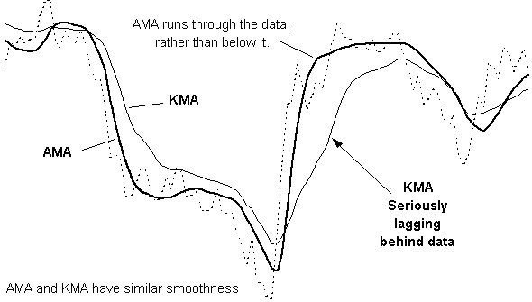
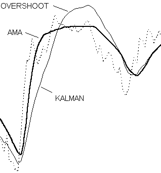
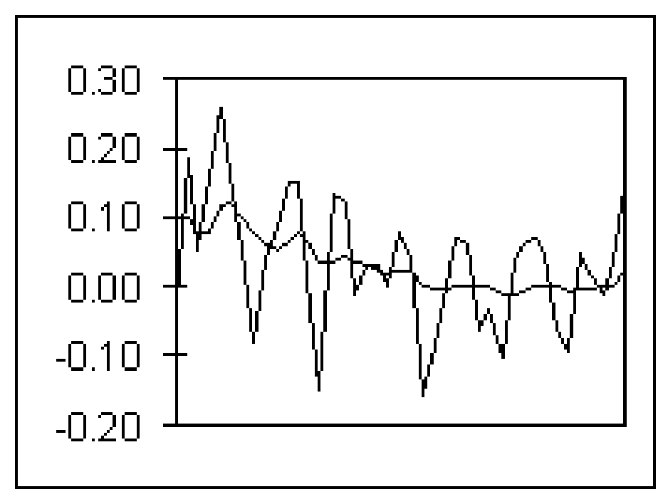
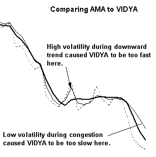
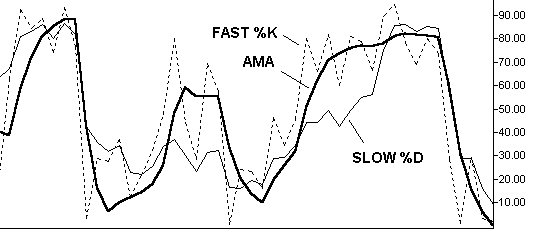
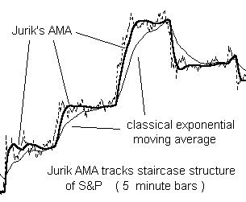

# JMA — Jurik Moving Average DLL Module

**For Windows Application Developers**

## BibTeX

```bibtex
@manual{jurik_jma_dll,
  title        = {JMA: Jurik Moving Average DLL Module for Windows Application Developers — User's Guide},
  author       = {{Jurik Research}},
  organization = {Jurik Research \& Consulting},
  address      = {PO 460669, Aurora, CO 80046},
  year         = {1994--2001},
  note         = {From JRS\_DLL distribution}
}
```

## Requirements

- Windows 98, 2000, NT4 or XP
- Application software that can access DLL functions

## Installation

1. Execute the Installer, `JRS_DLL.EXE`. It will analyze your computer and give you a computer identification number. Write it down.
2. Get your access PASSWORD from Jurik Research Software. Call 323-258-4860 (USA), fax 323-258-0598 (USA), e-mail support@nfsmith.net, or write Jurik Research Software at 686 South Arroyo Parkway, Suite 237, Pasadena, California 91105. Be sure to give your full name, mailing address and computer identification number. You will then be given a password.
3. Rerun the installer `JRS_DLL.EXE`, this time entering the password when asked. Also enter all the Jurik Research modules that you currently are licensed to run. It will copy the latest version of these modules to any directory you specify.

You may now code your software to access the DLL as described on the following pages.

### Important Notices

**About Passwords:** If you upgrade to a new computer, or significantly upgrade your existing computer (such as flash a new BIOS), you should reinstall JMA and all other Jurik tools that are licensed for your computer. The installer will let you know if your current password is no longer valid. Also, if you want to run JMA on additional computers, you will need additional passwords. For new or replacement passwords, call 323-258-4860.

**About Data Validity:** When JMA encounters a problem (e.g. the password used during installation has become invalid), JMA will continue to run but the data produced will not be valid. To let you know this is the case, JMA will return an appropriate error code, but it will NOT post any warning message on your monitor. Therefore — do not assume JMA will always smooth your data. You must validate JMA's output by CHECKING THE RETURN ERROR CODE immediately after each call to JMA.

---

## Why Use JMA?

### The Adaptive Moving Average by Jurik Research

Daily prices produce a time series with some amount of random fluctuations. To remove this noise, market technicians typically use moving average (MA) filters. Only Jurik's JMA excels in all four benchmarks of a truly great filter…

### Benchmark #1: Accuracy

Moving Average (MA) filters have an adjustable parameter that controls its speed. Speed governs two opposing properties of a filter: smoothness (lack of random zigzagging) and accuracy (closeness to the original data). That is, the smoother a filter becomes, the less it accurately resembles the original time series. This makes sense, since we do not want to accurately track zigzagging noise within our data.

Because the financial investor tries to apply just enough smoothness to filter out noise without removing important structure in price activity. For example, in the chart below, the popular Double Exponential Moving Average (DEMA) is just as smooth as JMA yet DEMA fails to track large scale structure (the big cycles). On the other hand, JMA follows the cyclic action very well.


### Benchmark #2: Timeliness

Most MA filters have another problem: they lag behind the original time series. This is a critical issue because excessive delay and late trades may reduce profits significantly.

Ideally, you would like a filtered signal to be both smooth and lag free. For many types of moving average filters, including the three classics (simple, weighted, and exponential), greater smoothness produces greater lag. For example, in the chart to the right, price action is the dotted line. The exponential moving average, EMA, lags well behind JMA (thick solid line). As you can see, with EMA's excessive lag, you would have had to wait a long time before it returned to the price action. In contrast, JMA never left it!


Adaptive filters developed by others, such as the Kaufman and Chande AMA, will also lag well behind your time series. Kaufman's Moving Average (KMA) is an exponential moving average whose speed is governed by the "efficiency" of price movement. For example, fast moving price with little retracement (a strong trend) is considered very efficient and the KMA will automatically speed up to prevent excessive lag. This interesting concept sometimes works well, sometimes not. For example, the chart below shows KMA lagging well behind JMA.



The advantage in avoiding lag is readily apparent in the crossover chart. Here we see how JMA enhances the timing of a simple crossover oscillator. The oscillator becomes positive when the curve of the faster filter crosses over the slower one. This occurrence suggests a "buy" signal. JMA's crossovers are 15 and 18 days earlier than EMA's. Can you afford to be 15 days late?

### Benchmark #3: Overshoot

Many trading systems set triggers to buy or sell when price reaches a certain threshold level. Because there is an inherent amount of noise in price action, the typical approach is to trigger when a moving average crosses the threshold. The smoothed line has less noise and is less likely to produce false alarms.

To do this right, you'll need an exceptional moving average indicator. Common versions lag too much and many sophisticated designs, like the Kalman or Butterworth filter, tend to overshoot during price reversals. Overshoots create false impressions of prices having reached levels it never truly did.

For example, in the chart below we see the famous Kalman filter overshoot price data, creating a false price level that the market never really achieved. DEMA filters also tend to overshoot. The overshoot crosses the shown threshold and triggers a false alarm. In contrast, JMA did not overshoot and thus avoided a false alarm with the user's set threshold.



### Benchmark #4: Smoothness

The most important property of a noise reduction filter is how well it removes noise, as measured by its smoothness.

In the chart below, EMA and JMA filters are run across closing prices. Note how much the fast EMA alternates upward and downward while JMA glides smoothly through the data. Clearly JMA reveals the noise-free underlying price more accurately. If you try reducing EMA's erratic hopping by making it slower, you will discover its lag will become larger, producing late trade signals.



If you need a 2-bar momentum indicator, you could take the difference between two values along the EMA time series and produce the jagged line. This is in contrast to the much smoother momentum signal based on JMA (flatter line). Imagine how many bad trades could be eliminated with this simple substitution!

Moving averages should have consistent behavior. Some do not. For example, Chande's VIDYA is an exponential moving average whose speed is governed by the variance of price movement. Fast moving price has large variance which will eventually cause VIDYA to automatically speed up (in an attempt to prevent excessive lag). This concept sometimes works well, sometimes not.



JMA also enhances the accuracy of technical indicators!



JMA resolves the riddle of how to get both smoothness and accuracy simultaneously, even with technical indicators! For example, the chart above compares the Fast %K indicator (dotted line) and two smoothed versions: one produced by the classic Slow %D (thin solid line) and the other produced by smoothing Fast %K with JMA (thick solid line). Clearly, JMA is both smoother and more accurate than slow %D!

JMA can also track price gaps produced by INTRA-DAY data. The chart below shows how JMA jumps to the next day's price levels while the classical exponential moving average lags behind.



Create superior trading indicators with:
- better timing
- less noise
- greater accuracy

---

## Coding Applications

The DLL file contains two versions of JMA:

- **BATCH MODE** — accepts an entire array of input data and returns results into another array of equal size. This method requires the user provide the DLL function with pointers to two arrays. This version is ideal when an entire array is available for processing with only one call to JMA.
- **REAL TIME** — accepts one input value and returns one value as a result. JMA is called for each successive value in some arbitrary time series. This approach is ideal for processing real time data, whereby the user wants an instant JMA update as each new data value arrives.

## Dynamic Linking

### Load Time Dynamic Linking (Microsoft Compilers)

For load-time dynamic linking, you must use the LIB file `JRS_32.LIB`, located at `C:\JRS_DLL\LIB` (or on whichever drive you specified during installation). With load-time dynamic linking, the Jurik DLL is loaded into memory when the user's EXE is loaded.

### Load Time Dynamic Linking (non-Microsoft Compilers)

The LIB file provided will only work with the MS Visual C/C++ compiler. For C/C++ users with non-Microsoft compilers, you will probably not be able to use the LIB file for Load Time Dynamic Linking with the DLL functions. You have two choices:

1. Consult your compiler's documentation to determine how to construct a LIB file from a DLL. For instance, Borland's compiler includes the `IMPLIB.EXE` utility to accomplish this.
2. Use run-time dynamic linking (described below). A LIB file is not required for this method.

### Run Time Dynamic Linking

You may prefer to use run-time dynamic linking instead of load-time. For example, users of Microsoft Visual C may wish to prevent the Jurik DLL from automatically loading along with the user's EXE. With run-time, the DLL is loaded only when the user's EXE specifically calls for it to be loaded with the `LoadLibrary` function. Another reason for preferring run-time is that the user has a non-Microsoft compiler, and therefore, cannot use the LIB file provided.

For new C/C++ users, sample C files demonstrating run-time dynamic linking are located in the folder `C:\JRS_DLL\RUNTIME` (or on whichever drive you specified during installation).

---

## C Programming — Batch Mode

The file `JRS_32.DLL` contains the function `JMA`. In your C code, you should declare JMA as externally defined and, if using MS VC++, use the `_declspec(dllimport)` keywords. The function is exported as a C function, so if you are using C++, you should insert `"C"` between the words `extern` and `_declspec`. Also, you should link with `JRS_32.LIB`.

### Declaration

```c
extern _declspec(dllimport) int WINAPI JMA( int iSize, double *pdSignal,
    double dSmooth, double dPhase, double *pdFilter );
```

### Parameters

| Parameter | Type | Description |
|-----------|------|-------------|
| `iSize` | 32-bit signed integer | Number of doubles in the input data array |
| `pdSignal` | pointer to double array | Input time series data for JMA |
| `dSmooth` | double | Controls the smoothness of JMA's curve |
| `dPhase` | double | Controls the lag/overshoot aspect of JMA's curve |
| `pdFilter` | pointer to double array | JMA writes its filtered time series here |

### Notes

- Both input and output arrays must be of the same size, as specified by `iSize`.
- `dSmooth` may be any non-negative value. Typical smoothness values range from 5–20.
- `dPhase` must be between −100 to +100 inclusive.

| Sample dPhase value | Effect on lag | Effect on overshoot |
|---------------------|---------------|---------------------|
| −100 | maximum lag | no overshoot |
| 0 | some lag | less overshoot |
| +100 | minimum lag | more overshoot |

Although JMA reads all the input data, it does not attempt to smooth the first 30 elements of the input array. This is because JMA needs at least 30 elements to begin its statistical analysis of the data. Consequently, JMA simply copies the first 30 elements of the input array to the output array. Smoothed values begin with the 31st element.

### Return Values

```c
#define JMASUCCESS             0       // NO ERROR
#define JMANOTINSTALLED       -1       // PASSWORD / INSTALLATION ERROR
#define JMABADDATAPTR      10111       // POINTER TO INPUT ARRAY WAS NULL
#define JMABADOUTPTR       10112       // POINTER TO OUTPUT ARRAY WAS NULL
#define JMAINSUFFICIENTDATA 10113      // JMA REQUIRES AT LEAST 31 DATA POINTS
```

Legacy AMA return values (AMA predates JMA; no longer supported but included for backward compatibility):

```c
#define AMASUCCESS             0       // NO ERROR
#define AMANOTINSTALLED       -1       // PASSWORD / INSTALLATION ERROR
#define AMABADDATAPTR      11111       // INPUT POINTER WAS NULL
#define AMABADOUTPTR       11112       // OUTPUT POINTER WAS NULL
#define AMAINSUFFICIENTDATA 11113      // AMA REQUIRES AT LEAST 31 DATA POINTS
#define AMA_MEM_ERR        11114       // OUT OF MEMORY CONDITION
```

### Example

```c
iSize = 2500;
dSmooth = 10;
dPhase = 0;

pdSignal = (double *) GlobalAllocPtr( GHND, sizeof(double) * iLength);
pdFilter = (double *) GlobalAllocPtr( GHND, sizeof(double) * iLength);

/* At this location, put your time input series data, smoothness series data and
   phase series data into their corresponding arrays. */

error_code = JMA( iSize, pdSignal, dSmooth, dPhase, pdFilter );
```

---

## C Programming — Real Time Mode

The file `JRS_32.DLL` contains the function `JMART`. In your C code, you should declare JMART as externally defined and, if using MS VC++, use the `_declspec(dllimport)` keywords. The function is exported as a C function, so if you are using C++, you should insert `"C"` between the words `extern` and `_declspec`. Also, you should link with `JRS_32.LIB`.

### Declaration

```c
extern _declspec(dllimport) int WINAPI JMART( double dSeries, double
    dSmooth, double dPhase, double *pdOutput, int iDestroy, int *piSeriesID );
```

### Parameters

| Parameter | Type | Description |
|-----------|------|-------------|
| `dSeries` | double | Input data value |
| `dSmooth` | double | Controls the smoothness of JMA's curve |
| `dPhase` | double | Controls the lag/overshoot aspect of JMA's curve |
| `pdOutput` | pointer to double | Memory location for filter output from JMA |
| `iDestroy` | 32-bit signed integer (0 or 1) | When 1, releases DLL memory for the designated series |
| `piSeriesID` | pointer to 32-bit signed integer | Series identification; set to 0 for first element of new series |

### Notes

- `dSmooth` may be any value between 2 and 500 inclusive. Typical smoothness values range from 5–20.
- `dPhase` must be between −100 to +100 inclusive.
- Although JMA reads all the input data, it does not attempt to produce output for the first 30 times it is called. JMA simply outputs the input value for the first 30 calls. True JMA output begins with the 31st call.

### Return Values

| Code | Meaning |
|------|---------|
| 0 | No error |
| 10112 | Pointer to output memory is NULL |
| 10114 | Cannot deallocate RAM when SeriesID = 0 |
| 10115 | Pointer to series identification variable is NULL |
| −1 | Password / installation error. JMA output not valid. |

### Example

```c
// declare variables
double *pdData, *pdOutput, dSmooth, dPhase ;
int    iDestroy, iSeriesID, *piSeriesID, iErr, i ;

// get address of variable iSeriesID
piSeriesID = &iSeriesID ;

// assume you want these JMA parameter values
dSmooth = 10 ;
dPhase = -20 ;

// allocate RAM for input and output. Assume array size is 100
pdData   = (double *) GlobalAllocPtr(GHND, sizeof(double) * 100) ;
pdOutput = (double *) GlobalAllocPtr(GHND, sizeof(double) * 100) ;

// fill pdData array with double precision numbers from disk
// file or other source. (code not shown)

// clear deallocation flag and initialize series identification to 0.
iDestroy = iSeriesID = 0 ;

// loop through filtration and store results
for(i=0;i<100;i++)
{
   iErr = JMART( *(pdData+i), dSmooth, dPhase, (pdOutput+i), iDestroy,
                 piSeriesID) ;
   if(iErr != 0)
        YourErrHandlerFunc() ;
}

// done processing. Deallocate DLL RAM, and check for any errors
// When deallocating, it is OK to replace the output pointer with 0.
iDestroy = 1 ;
iErr = JMART( 0,0,0,0, iDestroy, piSeriesID) ;
if(iErr != 0)
     YourErrHandlerFunc() ;

// do something with data and deallocate RAM at pdData and pdOutput
```

---

## Visual Basic — Batch Mode

In your Jurik Research DLL installation directory (e.g., `C:\JRS_DLL`) the workbook `JMA_DMX_DLL.XLS` contains a programming example using Excel's VBA to call function JMA. The workbook includes a worksheet where you can run the macro `JMA_Test` to run JMA in batch mode.

The macro gets the data in column 1 and sends it to the JMA batch mode function in the DLL. The output array produced by JMA is then written back onto column 5 of the worksheet.

### Declaration

```vb
Declare Function JMA Lib "JRS_32.dll" ( _
    ByVal iSize As Long, _
    ByRef daInData As Double, _
    ByVal dSmooth As Double, _
    ByVal dPhase As Double, _
    ByRef daOutData As Double) As Long
```

Note that the input and output arrays (`daInData` and `daOutData`) are called by reference using `ByRef`. This enables the calling statement to send to JMA a pointer to the first element of each data array.

### Example

```vb
Sub JMA_Test()
    Dim k As Long                       'iteration variable
    Dim iSize As Long                   'size of data array
    Dim iResult As Long                 'returned error code
    Dim InputData(1 To 484) As Double   'input array
    Dim OutputData(1 To 484) As Double  'output array
    Dim dSmooth As Double               'JMA speed
    Dim dPhase As Double                'JMA phase
    Dim calctype As Long                'for preserving current Excel calc mode

    calctype = Application.Calculation
    Application.Calculation = xlManual

    iSize = 199         'size of input series
    dSmooth = 20        'JMA speed
    dPhase = 0          'JMA length

    ' Read Data from spreadsheet into array
    ' Input data is in column 1
    For k = 1 To iSize
        InputData(k) = Cells(k + 1, 1)
    Next k

    '--- JMA return error codes ---
    '    0      SUCCESS -- No error conditions
    '10111      did not reference first element of input array
    '10112      did not reference first element of output array
    '10113      JMA requires at least 31 data points
    '   -1      password/installation error. JMA output not valid.

    ' Call JMA using pointers to first elements of arrays
    iResult = JMA(iSize, InputData(1), dSmooth, dPhase, OutputData(1))

    If (iResult <> 0) Then
        ' Post Error Message and HALT
        Call Error_handler(iResult, calctype)
    Else
        ' Show results in column 5 on spreadsheet
        For k = 1 To iSize
            Cells(1 + k, 5).FormulaR1C1 = OutputData(k)
        Next k
    End If

    'restore calculation type
    Application.Calculation = calctype
End Sub

' The following subroutine is a simple way to handle run-time errors that may occur
' It is good practice to handle each error type mentioned in the user manual.
Private Sub Error_handler(ByVal error_code As Long, ByVal calctype As Long)
    Dim result As Long
    result = MsgBox("Error number " & Str(error_code) & _
                    " was returned by JMA.", , "JMA Error")
    Application.Calculation = calctype
    End   ' this END command will halt execution of the VBA code.
End Sub
```

---

## Visual Basic — Real Time Mode

In your Jurik Research DLL installation directory (e.g., `C:\JRS_DLL`) the workbook `JMA_DMX_DLL.XLS` contains a programming example using Excel's VBA to call function `JMART`. The workbook includes a worksheet where you can run the macro `JMART_Test` to run JMART in real-time mode.

The macro reads one element at a time from column 1, sequentially feeding each one through the real time version of JMA and places the results sequentially into column 4.

### Declaration

```vb
Declare Function JMART Lib "JRS_32.dll" ( _
    ByVal dPrice As Double, _
    ByVal dSmooth As Double, _
    ByVal dPhase As Double, _
    ByRef dOutput As Double, _
    ByVal iDestroy As Long, _
    ByRef iSeriesID As Long) As Long
```

Note that the output and series identification variables (`dOutput` and `iSeriesID`) are called by reference using `ByRef`. The user initializes the series identification variable to zero and during the first call to JMART, the function will replace zero with an integer that uniquely identifies the time series. This way, when you have multiple time series running in parallel, the series identification numbers will tell JMART to which time series the new data point is to be assigned.

### Example

```vb
Sub JMART_test()
    Dim dLength As Double       'JMA speed
    Dim dJMAout As Double       'JMA output
    Dim dPhase As Double        'JMA phase
    Dim iSeriesID As Long       'Input series ID code
    Dim iResult As Long         'returned error code
    Dim iDestroy As Long        'deallocate DLL RAM switch
    Dim iSize As Long           'length of data array
    Dim k As Long               'iteration variable
    Dim calctype As Long        'for preserving current Excel calc mode

    '--- JMART return error codes ---
    '    0      SUCCESS -- No error conditions
    '10112      dJMAout not declared using ByRef
    '10114      iSeriesID=0 and iDestroy=1. Cannot deallocate DLL RAM when SeriesID=0
    '10115      iSeriesID not declared using ByRef
    '   -1      password/installation error. JMA output not valid.

    iSize = 199           ' length of input array
    dLength = 20          ' JMA smoothness factor
    dPhase = 0            ' JMA phase value
    iSeriesID = 0         ' MUST initialize series identification to zero
    iDestroy = 0          ' MUST clear "deallocate DLL RAM" flag

    'disable automatic calculation
    calctype = Application.Calculation
    Application.Calculation = xlManual

    For k = 1 To iSize
        iResult = JMART(Cells(k + 1, 1), dLength, dPhase, dJMAout, iDestroy, iSeriesID)
        If (iResult <> 0) Then
            ' Post Error Message and HALT
            Call Error_handler(iResult, calctype)
        Else
            Cells(1 + k, 4).FormulaR1C1 = dJMAout
        End If
    Next k

    'deallocate DLL RAM. Check for errors.
    'iSeriesId should contain a non-zero identification value
    iDestroy = 1
    iResult = JMART(0, 0, 0, 0, iDestroy, iSeriesID)
    If (iResult <> 0) Then
        ' Post Error Message and HALT
        Call Error_handler(iResult, calctype)
    End If

    'restore calculation type
    Application.Calculation = calctype
End Sub

' The following subroutine is a simple way to handle run-time errors that may occur
' It is good practice to handle each error type mentioned in the user manual.
Private Sub Error_handler(ByVal error_code As Long, ByVal calctype As Long)
    Dim result As Long
    result = MsgBox("Error number " & Str(error_code) & _
                    " was returned by JMA.", , "JMA Error")
    Application.Calculation = calctype
    End   ' this END command will halt execution of the VBA code.
End Sub
```
